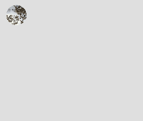
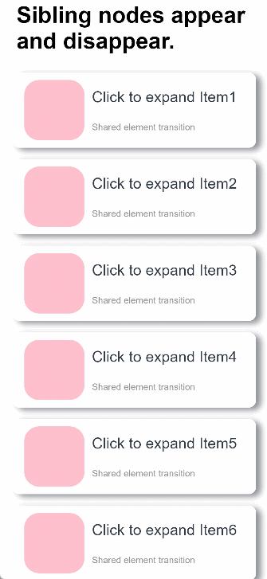
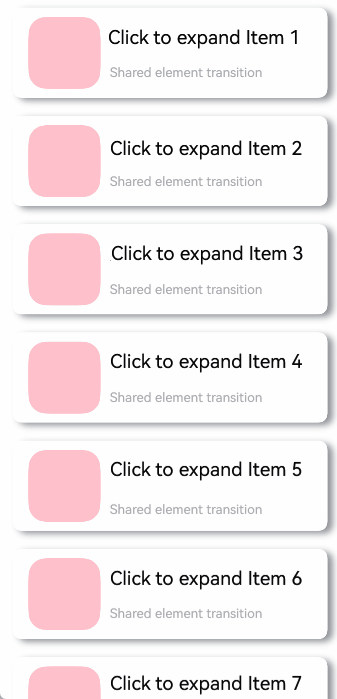

# Shared Element Transition

Shared element transition is a type of transition achieved by animating the size and position between styles of the same or similar elements during page switching.

Let's look at an example. After an image is clicked, it disappears, and a new image appears in another position. Because the two images have the same content, we can add shared element transition to them. The figures below show the results with and without a shared element transition. Clearly, the presence of the shared element transition renders the transition natural and smooth.

|
---|---

There are multiple methods to implement shared element transition. Choose one that is appropriate to your use case. The following outlines the basic implementation methods, ranked from most to least recommended.

## Directly Changing the Original Container Without Creating New Containers

This method does not create new containers. Instead, it triggers [transition](../reference/apis-arkui/arkui-ts/ts-transition-animation-component.md) by adding or removing components on an existing container and pairs it with the [property animation](./arkts-attribute-animation-apis.md) of components.

This example implements a shared element transition for the scenario where, as a component is expanded, sibling components in the same container disappear or appear. Specifically, property animations are applied to width and height changes of a component before and after the expansion; enter/exit animations are applied to the sibling components as they disappear or disappear. The basic procedure is as follows:

1. Build the component to be expanded, and build two pages for it through state variables: one for the normal state and one for the expanded state.

      ```ts
      class Tmp {
        set(item: PostData): PostData {
          return item
        }
      }
      // Build two pages for the normal and expanded states of the same component, which are then used based on the declared state variables.
      @Component
      export struct MyExtendView {
        // Declare the isExpand variable to be synced with the parent component.
        @Link isExpand: boolean;
        // You need to implement the list data.
        @State cardList: Array<PostData> = xxxx;
      
        build() {
          List() {
            // Customize the expanded component as required.
            if (this.isExpand) {
              Text('expand')
                .transition(TransitionEffect.translate({y:300}).animation({ curve: curves.springMotion(0.6, 0.8) }))
            }
      
            ForEach(this.cardList, (item: PostData) => {
              let Item: Tmp = new Tmp()
              let Imp: Tmp = Item.set(item)
              let Mc: Record<string, Tmp> = {'cardData': Imp}
              MyCard(Mc) // Encapsulated widget, which needs to be implemented by yourself.
            })
          }
          .width(this.isExpand? 200:500) // Define the attributes of the expanded component as required.
          .animation({ curve: curves.springMotion()}) // Bind an animation to component attributes.
        }
      }
      ... 
      ```

2. Expand the component to be expanded. Use state variables to control the disappearance or appearance of sibling components, and apply the enter/exit transition to the disappearance and appearance.

      ```ts
      class Tmp{
        isExpand: boolean = false;
        set(){
          this.isExpand = !this.isExpand;
        }
      }
      let Exp:Record<string,boolean> = {'isExpand': false}
        @State isExpand: boolean = false
        
        ...
        List() {
          // Control the appearance or disappearance of sibling components through the isExpand variable, and configure the enter/exit transition.
          if (!this.isExpand) {
            Text ('Collapse')
              .transition(TransitionEffect.translate({y:300}).animation({ curve: curves.springMotion(0.6, 0.9) }))
          }
        
          MyExtendView(Exp)
            .onClick(() => {
              let Epd:Tmp = new Tmp()
              Epd.set()
            })
        
          // Control the appearance or disappearance of sibling components through the isExpand variable, and configure the enter/exit transition.
          if (this.isExpand) {
            Text ('Expand')
              .transition(TransitionEffect.translate({y:300}).animation({ curve: curves.springMotion() }))
          }
        }
      ...
      ```

Below is the complete sample code and effect.

```ts
class PostData {
  avatar: Resource = $r('app.media.flower');
  name: string = '';
  message: string = '';
  images: Resource[] = [];
}

@Entry
@Component
struct Index {
  @State isExpand: boolean = false;
  @State @Watch('onItemClicked') selectedIndex: number = -1;

  private allPostData: PostData[] = [
    { avatar: $r('app.media.flower'), name: 'Alice', message: 'It's sunny.',
      images: [$r('app.media.spring'), $r('app.media.tree')] },
    { avatar: $r('app.media.sky'), name: 'Bob', message: 'Hello World',
      images: [$r('app.media.island')] },
    { avatar: $r('app.media.tree'), name: 'Carl', message: 'Everything grows.',
      images: [$r('app.media.flower'), $r('app.media.sky'), $r('app.media.spring')] }];

  private onItemClicked(): void {
    if (this.selectedIndex < 0) {
      return;
    }
    animateTo({
      duration: 350,
      curve: Curve.Friction
    }, () => {
      this.isExpand = !this.isExpand;
    });
  }

  build() {
    Column({ space: 20 }) {
      ForEach(this.allPostData, (postData: PostData, index: number) => {
        // When a post is clicked, other posts disappear from the tree.
        if (!this.isExpand || this.selectedIndex === index) {
          Column() {
            Post({ data: postData, selecteIndex: this.selectedIndex, index: index })
          }
          .width('100%')
          // Apply opacity and translate transition effects to the disappearing posts.
          .transition(TransitionEffect.OPACITY
            .combine(TransitionEffect.translate({ y: index < this.selectedIndex ? -250 : 250 }))
            .animation({ duration: 350, curve: Curve.Friction}))
        }
      }, (postData: PostData, index: number) => index.toString())
    }
    .size({ width: '100%', height: '100%' })
    .backgroundColor('#40808080')
  }
}

@Component
export default struct  Post {
  @Link selecteIndex: number;

  @Prop data: PostData;
  @Prop index: number;

  @State itemHeight: number = 250;
  @State isExpand: boolean = false;
  @State expandImageSize: number = 100;
  @State avatarSize: number = 50;

  build() {
    Column({ space: 20 }) {
      Row({ space: 10 }) {
        Image(this.data.avatar)
          .size({ width: this.avatarSize, height: this.avatarSize })
          .borderRadius(this.avatarSize / 2)
          .clip(true)

        Text(this.data.name)
      }
      .justifyContent(FlexAlign.Start)

      Text(this.data.message)

      Row({ space: 15 }) {
        ForEach(this.data.images, (imageResource: Resource, index: number) => {
          Image(imageResource)
            .size({ width: this.expandImageSize, height: this.expandImageSize })
        }, (imageResource: Resource, index: number) => index.toString())
      }

      if (this.isExpand) {
        Column() {
          Text('Comments')
            // Apply enter/exit transition effects to the text in the comments area.
            .transition( TransitionEffect.OPACITY
              .animation({ duration: 350, curve: Curve.Friction }))
            .padding({ top: 10 })
        }
        .transition(TransitionEffect.asymmetric(
          TransitionEffect.opacity(0.99)
            .animation({ duration: 350, curve: Curve.Friction }),
          TransitionEffect.OPACITY.animation({ duration: 0 })
        ))
        .size({ width: '100%'})
      }
    }
    .backgroundColor(Color.White)
    .size({ width: '100%', height: this.itemHeight })
    .alignItems(HorizontalAlign.Start)
    .padding({ left: 10, top: 10 })
    .onClick(() => {
      this.selecteIndex = -1;
      this.selecteIndex = this.index;
      animateTo({
        duration: 350,
        curve: Curve.Friction
      }, () => {
        // Animate the width and height of the expanded post, and apply animations to the profile picture and image sizes.
        this.isExpand = !this.isExpand;
        this.itemHeight = this.isExpand ? 780 : 250;
        this.avatarSize = this.isExpand ? 75: 50;
        this.expandImageSize = (this.isExpand && this.data.images.length > 0)
          ? (360 - (this.data.images.length + 1) * 15) / this.data.images.length : 100;
      })
    })
  }
}
```



## Creating a Container and Migrating Components Across Containers

Use [NodeContainer](../reference/apis-arkui/arkui-ts/ts-basic-components-nodecontainer.md) and [custom placeholder nodes](arkts-user-defined-place-hoder.md) with [NodeController](../reference/apis-arkui/js-apis-arkui-nodeController.md) for migrating components across different nodes. Then combine the migration with the property animations to achieve shared element transition. This method can be integrated with various transition styles, including navigation transitions ([Navigation](../reference/apis-arkui/arkui-ts/ts-basic-components-navigation.md)) and sheet transitions ([bindSheet](../reference/apis-arkui/arkui-ts/ts-universal-attributes-sheet-transition.md#bindsheet)).

### Using with Stack

With the **Stack** container, where later defined components appear on top, you can control the z-order to ensure that the component is on top after being migrated across nodes. For example, in the scenario of expanding and collapsing widgets, the implementation steps are as follows:

- When expanding a widget, obtain the source node (node A)'s position and migrate the components to a higher-level node (node B) with the same position.

- Add a property animation to node B to make it expand and move to the expanded position, creating a shared element transition.

- When collapsing the widget, add a property animation to node B to make it collapse and move back to the position of node A, creating a shared element transition.

- At the end of the animation, use a callback to migrate the components from node B back to node A.

```ts
// Index.ets
import { createPostNode, getPostNode, PostNode } from "../PostNode"
import { componentUtils, curves } from '@kit.ArkUI';

@Entry
@Component
struct Index {
  // Create an animation class.
  @State AnimationProperties: AnimationProperties = new AnimationProperties();
  private listArray: Array<number> = [1, 2, 3, 4, 5, 6, 7, 8 ,9, 10];

  build() {
    // Common parent component for widget collapsed and expanded states
    Stack() {
      List({space: 20}) {
        ForEach(this.listArray, (item: number) => {
          ListItem() {
            // Widget collapsed state
            PostItem({ index: item, AnimationProperties: this.AnimationProperties })
          }
        })
      }
      .clip(false)
      .alignListItem(ListItemAlign.Center)
      if (this.AnimationProperties.isExpandPageShow) {
        // Widget expanded state
        ExpandPage({ AnimationProperties: this.AnimationProperties })
      }
    }
    .key('rootStack')
    .enabled(this.AnimationProperties.isEnabled)
  }
}

@Component
struct PostItem {
  @Prop index: number
  @Link AnimationProperties: AnimationProperties;
  @State nodeController: PostNode | undefined = undefined;
  // Hide detailed content when the widget is collapsed.
  private showDetailContent: boolean = false;

  aboutToAppear(): void {
    this.nodeController = createPostNode(this.getUIContext(), this.index.toString(), this.showDetailContent);
    if (this.nodeController != undefined) {
      // Set a callback to trigger when the widget returns from expanded to collapsed state.
      this.nodeController.setCallback(this.resetNode.bind(this));
    }
  }
  resetNode() {
    this.nodeController = getPostNode(this.index.toString());
  }

  build() {
        Stack() {
          NodeContainer(this.nodeController)
        }
        .width('100%')
        .height(100)
        .key(this.index.toString())
        .onClick( ()=> {
          if (this.nodeController != undefined) {
            // The widget node is removed from the tree when collapsed.
            this.nodeController.onRemove();
          }
          // Trigger the animation for changing from the folded state to the collapsed state.
          this.AnimationProperties.expandAnimation(this.index);
        })
  }
}

@Component
struct ExpandPage {
  @Link AnimationProperties: AnimationProperties;
  @State nodeController: PostNode | undefined = undefined;
  // Show detailed content when the widget is expanded.
  private showDetailContent: boolean = true;

  aboutToAppear(): void {
    // Obtain the corresponding widget component by index.
    this.nodeController = getPostNode(this.AnimationProperties.curIndex.toString())
    // Update to show detailed content.
    this.nodeController?.update(this.AnimationProperties.curIndex.toString(), this.showDetailContent)
  }

  build() {
    Stack() {
      NodeContainer(this.nodeController)
    }
    .width('100%')
    .height(this.AnimationProperties.changedHeight ? '100%' : 100)
    .translate({ x: this.AnimationProperties.translateX, y: this.AnimationProperties.translateY })
    .position({ x: this.AnimationProperties.positionX, y: this.AnimationProperties.positionY })
    .onClick(() => {
      animateTo({ curve: curves.springMotion(0.6, 0.9),
        onFinish: () => {
          if (this.nodeController != undefined) {
            // Execute the callback to obtain the widget component from the folded node.
            this.nodeController.callCallback();
            // The widget component of the currently expanded node is removed from the tree.
            this.nodeController.onRemove();
          }
          // The widget expands to the expanded state node and is removed from the tree.
          this.AnimationProperties.isExpandPageShow = false;
          this.AnimationProperties.isEnabled = true;
        }
      }, () => {
        // The widget returns from the expanded state to the collapsed state.
        this.AnimationProperties.isEnabled = false;
        this.AnimationProperties.translateX = 0;
        this.AnimationProperties.translateY = 0;
        this.AnimationProperties.changedHeight = false;
        // Update to hide detailed content.
        this.nodeController?.update(this.AnimationProperties.curIndex.toString(), false);
      })
    })
  }
}

class RectInfo {
  left: number = 0;
  top: number = 0;
  right: number = 0;
  bottom: number = 0;
  width: number = 0;
  height: number = 0;
}

// Encapsulated animation class.
@Observed
class AnimationProperties {
  public isExpandPageShow: boolean = false;
  // Control whether the component responds to click events.
  public isEnabled: boolean = true;
  // Index of the expanded widget.
  public curIndex: number = -1;
  public translateX: number = 0;
  public translateY: number = 0;
  public positionX: number = 0;
  public positionY: number = 0;
  public changedHeight: boolean = false;
  private calculatedTranslateX: number = 0;
  private calculatedTranslateY: number = 0;
  // Set the position of the widget relative to the parent component after it is expanded.
  private expandTranslateX: number = 0;
  private expandTranslateY: number = 0;

  public expandAnimation(index: number): void {
    // Record the index of the widget in the expanded state.
    if (index != undefined) {
      this.curIndex = index;
    }
    // Calculate the position of the collapsed widget relative to the parent component.
    this.calculateData(index.toString());
    // The widget in expanded state is added to the tree.
    this.isExpandPageShow = true;
    // Property animation for widget expansion.
    animateTo({ curve: curves.springMotion(0.6, 0.9)
    }, () => {
      this.translateX = this.calculatedTranslateX;
      this.translateY = this.calculatedTranslateY;
      this.changedHeight = true;
    })
  }

  // Obtain the position of the component that needs to be migrated across nodes, and the position of the common parent node before and after the migration, to calculate the animation parameters for the animating component.
  public calculateData(key: string): void {
    let clickedImageInfo = this.getRectInfoById(key);
    let rootStackInfo = this.getRectInfoById('rootStack');
    this.positionX = px2vp(clickedImageInfo.left - rootStackInfo.left);
    this.positionY = px2vp(clickedImageInfo.top - rootStackInfo.top);
    this.calculatedTranslateX = px2vp(rootStackInfo.left - clickedImageInfo.left) + this.expandTranslateX;
    this.calculatedTranslateY = px2vp(rootStackInfo.top - clickedImageInfo.top) + this.expandTranslateY;
  }

  // Obtain the position information of the component based on its ID.
  private getRectInfoById(id: string): RectInfo {
    let componentInfo: componentUtils.ComponentInfo = componentUtils.getRectangleById(id);

    if (!componentInfo) {
      throw Error('object is empty');
    }

    let rstRect: RectInfo = new RectInfo();
    const widthScaleGap = componentInfo.size.width * (1 - componentInfo.scale.x) / 2;
    const heightScaleGap = componentInfo.size.height * (1 - componentInfo.scale.y) / 2;
    rstRect.left = componentInfo.translate.x + componentInfo.windowOffset.x + widthScaleGap;
    rstRect.top = componentInfo.translate.y + componentInfo.windowOffset.y + heightScaleGap;
    rstRect.right =
      componentInfo.translate.x + componentInfo.windowOffset.x + componentInfo.size.width - widthScaleGap;
    rstRect.bottom =
      componentInfo.translate.y + componentInfo.windowOffset.y + componentInfo.size.height - heightScaleGap;
    rstRect.width = rstRect.right - rstRect.left;
    rstRect.height = rstRect.bottom - rstRect.top;

    return {
      left: rstRect.left,
      right: rstRect.right,
      top: rstRect.top,
      bottom: rstRect.bottom,
      width: rstRect.width,
      height: rstRect.height
    }
  }
}
```

```ts
// PostNode.ets
// Cross-container migration
import { UIContext } from '@ohos.arkui.UIContext';
import { NodeController, BuilderNode, FrameNode } from '@ohos.arkui.node';
import { curves } from '@kit.ArkUI';

class Data {
  item: string | null = null
  isExpand: Boolean | false = false
}

@Builder
function PostBuilder(data: Data) {
  // Place the cross-container migration component inside @Builder.
  Column() {
      Row() {
        Row()
          .backgroundColor(Color.Pink)
          .borderRadius(20)
          .width(80)
          .height(80)

        Column() {
          Text('Click to expand Item ' + data.item)
            .fontSize(20)
          Text ('Shared element transition')
            .fontSize(12)
            .fontColor(0x909399)
        }
        .alignItems(HorizontalAlign.Start)
        .justifyContent(FlexAlign.SpaceAround)
        .margin({ left: 10 })
        .height(80)
      }
      .width('90%')
      .height(100)
      // Display detailed content in expanded state.
      if (data.isExpand) {
        Row() {
          Text('Expanded')
            .fontSize(28)
            .fontColor(0x909399)
            .textAlign(TextAlign.Center)
            .transition(TransitionEffect.OPACITY.animation({ curve: curves.springMotion(0.6, 0.9) }))
        }
        .width('90%')
        .justifyContent(FlexAlign.Center)
      }
    }
    .width('90%')
    .height('100%')
    .alignItems(HorizontalAlign.Center)
    .borderRadius(10)
    .margin({ top: 15 })
    .backgroundColor(Color.White)
    .shadow({
      radius: 20,
      color: 0x909399,
      offsetX: 20,
      offsetY: 10
    })

}

class __InternalValue__{
  flag:boolean =false;
};

export class PostNode extends NodeController {
  private node: BuilderNode<Data[]> | null = null;
  private isRemove: __InternalValue__ = new __InternalValue__();
  private callback: Function | undefined = undefined
  private data: Data | null = null

  makeNode(uiContext: UIContext): FrameNode | null {
    if(this.isRemove.flag == true){
      return null;
    }
    if (this.node != null) {
      return this.node.getFrameNode();
    }

    return null;
  }

  init(uiContext: UIContext, id: string, isExpand: boolean) {
    if (this.node != null) {
      return;
    }
    // Create a node, during which the UIContext should be passed.
    this.node = new BuilderNode(uiContext)
    // Create an offline component.
    this.data = { item: id, isExpand: isExpand }
    this.node.build(wrapBuilder<Data[]>(PostBuilder), this.data)
  }

  update(id: string, isExpand: boolean) {
    if (this.node !== null) {
      // Call update to perform an update.
      this.data = { item: id, isExpand: isExpand }
      this.node.update(this.data);
    }
  }

  setCallback(callback: Function | undefined) {
    this.callback = callback
  }

  callCallback() {
    if (this.callback != undefined) {
      this.callback();
    }
  }

  onRemove(){
    this.isRemove.flag = true;
    // Trigger rebuild when the component is migrated out of the node.
    this.rebuild();
    this.isRemove.flag = false;
  }
}

let gNodeMap: Map<string, PostNode | undefined> = new Map();

export const createPostNode =
  (uiContext: UIContext, id: string, isExpand: boolean): PostNode | undefined => {
    let node = new PostNode();
    node.init(uiContext, id, isExpand);
    gNodeMap.set(id, node);
    return node;
  }

export const getPostNode = (id: string): PostNode | undefined => {
  if (!gNodeMap.has(id)) {
    return undefined
  }
  return gNodeMap.get(id);
}

export const deleteNode = (id: string) => {
  gNodeMap.delete(id)
}
```



### Using with Navigation

You can use the [customNavContentTransition](../reference/apis-arkui/arkui-ts/ts-basic-components-navigation.md#customnavcontenttransition11) (see [Example 3](../reference/apis-arkui/arkui-ts/ts-basic-components-navigation.md#example-3)) capability of [Navigation](../reference/apis-arkui/arkui-ts/ts-basic-components-navigation.md) to implement shared element transition, during which, the component is migrated from the disappearing page to the appearing page.

The following is the procedure for implementing the expanding and collapsing of a thumbnail:

- Configure custom navigation transition animations between **PageOne** and **PageTwo** using **customNavContentTransition**.

- Implement the custom shared element transition with property animations. This is done by capturing the position information of components relative to the window, which allows for the correct matching of the components' positions, scales, and other information on **PageOne** and **PageTwo**, that is, the starting and ending property information for the animation.

- After the thumbnail is clicked, the shared element transitions from **PageOne** to **PageTwo**, triggering a custom animation that expands the element from a thumbnail to full-screen on **PageTwo**.

- When returning to the thumbnail from the full-screen state, a custom transition animation from **PageTwo** to **PageOne** is triggered, animating the shared element from full-screen to the thumbnail state on **PageOne**, and the component is migrated back to **PageOne** after the transition.

```
├──entry/src/main/ets                 // Code directory
│  ├──CustomTransition
│  │  ├──AnimationProperties.ets      // Encapsulation of shared element transition animation
│  │  └──CustomNavigationUtils.ets    // Custom transition animation configuration for Navigation
│  ├──entryability
│  │  └──EntryAbility.ets             // Entry point class
│  ├──NodeContainer
│  │  └──CustomComponent.ets          // Custom placeholder node
│  ├──pages
│  │  ├──Index.ets                    // Navigation page
│  │  ├──PageOne.ets                  // Thumbnail page
│  │  └──PageTwo.ets                  // Full-screen page
│  └──utils
│     ├──ComponentAttrUtils.ets       // Component position acquisition
│     └──WindowUtils.ets              // Window information
└──entry/src/main/resources           // Resource files
```

```ts
// Index.ets
import { AnimateCallback, CustomTransition } from '../CustomTransition/CustomNavigationUtils';

const TAG: string = 'Index';

@Entry
@Component
struct Index {
  private pageInfos: NavPathStack = new NavPathStack();
  // Allow custom transition for specific pages by name.
  private allowedCustomTransitionFromPageName: string[] = ['PageOne'];
  private allowedCustomTransitionToPageName: string[] = ['PageTwo'];

  aboutToAppear(): void {
    this.pageInfos.pushPath({ name: 'PageOne' });
  }

  private isCustomTransitionEnabled(fromName: string, toName: string): boolean {
    // Both clicks and returns require custom transitions, so they need to be judged separately.
    if ((this.allowedCustomTransitionFromPageName.includes(fromName)
      && this.allowedCustomTransitionToPageName.includes(toName))
      || (this.allowedCustomTransitionFromPageName.includes(toName)
        && this.allowedCustomTransitionToPageName.includes(fromName))) {
      return true;
    }
    return false;
  }

  build() {
    Navigation(this.pageInfos)
      .hideNavBar(true)
      .customNavContentTransition((from: NavContentInfo, to: NavContentInfo, operation: NavigationOperation) => {
        if ((!from || !to) || (!from.name || !to.name)) {
          return undefined;
        }

        // Control custom transition routes by the names of 'from' and 'to'.
        if (!this.isCustomTransitionEnabled(from.name, to.name)) {
          return undefined;
        }

        // Check whether the transition pages have registered animations to decide whether to perform a custom transition.
        let fromParam: AnimateCallback = CustomTransition.getInstance().getAnimateParam(from.index);
        let toParam: AnimateCallback = CustomTransition.getInstance().getAnimateParam(to.index);
        if (!fromParam.animation || !toParam.animation) {
          return undefined;
        }

        // After all judgments are made, construct customAnimation for the system side to call and execute the custom transition animation.
        let customAnimation: NavigationAnimatedTransition = {
          onTransitionEnd: (isSuccess: boolean) => {
            console.log(TAG, `current transition result is ${isSuccess}`);
          },
          timeout: 2000,
          transition: (transitionProxy: NavigationTransitionProxy) => {
            console.log(TAG, 'trigger transition callback');
            if (fromParam.animation) {
              fromParam.animation(operation == NavigationOperation.PUSH, true, transitionProxy);
            }
            if (toParam.animation) {
              toParam.animation(operation == NavigationOperation.PUSH, false, transitionProxy);
            }
          }
        };
        return customAnimation;
      })
  }
}
```

```ts
// PageOne.ets
import { CustomTransition } from '../CustomTransition/CustomNavigationUtils';
import { MyNodeController, createMyNode, getMyNode } from '../NodeContainer/CustomComponent';
import { ComponentAttrUtils, RectInfoInPx } from '../utils/ComponentAttrUtils';
import { WindowUtils } from '../utils/WindowUtils';

@Builder
export function PageOneBuilder() {
  PageOne();
}

@Component
export struct PageOne {
  private pageInfos: NavPathStack = new NavPathStack();
  private pageId: number = -1;
  @State myNodeController: MyNodeController | undefined = new MyNodeController(false);

  aboutToAppear(): void {
    let node = getMyNode();
    if (node == undefined) {
      // Create a custom node.
      createMyNode(this.getUIContext());
    }
    this.myNodeController = getMyNode();
  }

  private doFinishTransition(): void {
    // Migrate the node back from PageTwo to PageOne when the transition on PageTwo ends.
    this.myNodeController = getMyNode();
  }

  private registerCustomTransition(): void {
    // Register the custom animation protocol.
    CustomTransition.getInstance().registerNavParam(this.pageId,
      (isPush: boolean, isExit: boolean, transitionProxy: NavigationTransitionProxy) => {}, 500);
  }

  private onCardClicked(): void {
    let cardItemInfo: RectInfoInPx =
      ComponentAttrUtils.getRectInfoById(WindowUtils.window.getUIContext(), 'card');
    let param: Record<string, Object> = {};
    param['cardItemInfo'] = cardItemInfo;
    param['doDefaultTransition'] = (myController: MyNodeController) => {
      this.doFinishTransition()
    };
    this.pageInfos.pushPath({ name: 'PageTwo', param: param });
    // The custom node is removed from the tree of PageOne.
    if (this.myNodeController != undefined) {
      (this.myNodeController as MyNodeController).onRemove();
    }
  }

  build() {
    NavDestination() {
      Stack() {
        Column({ space: 20 }) {
          Row({ space: 10 }) {
            Image($r("app.media.avatar"))
              .size({ width: 50, height: 50 })
              .borderRadius(25)
              .clip(true)

            Text('Alice')
          }
          .justifyContent(FlexAlign.Start)

          Text('Hello World')

          NodeContainer(this.myNodeController)
            .size({ width: 320, height: 250 })
            .onClick(() => {
              this.onCardClicked()
            })
        }
        .alignItems(HorizontalAlign.Start)
        .margin(30)
      }
    }
    .onReady((context: NavDestinationContext) => {
      this.pageInfos = context.pathStack;
      this.pageId = this.pageInfos.getAllPathName().length - 1;
      this.registerCustomTransition();
    })
    .onDisAppear(() => {
      CustomTransition.getInstance().unRegisterNavParam(this.pageId);
      // The custom node is removed from the tree of PageOne.
      if (this.myNodeController != undefined) {
        (this.myNodeController as MyNodeController).onRemove();
      }
    })
  }
}
```

```ts
// PageTwo.ets
import { CustomTransition } from '../CustomTransition/CustomNavigationUtils';
import { AnimationProperties } from '../CustomTransition/AnimationProperties';
import { RectInfoInPx } from '../utils/ComponentAttrUtils';
import { getMyNode, MyNodeController } from '../NodeContainer/CustomComponent';

@Builder
export function PageTwoBuilder() {
  PageTwo();
}

@Component
export struct PageTwo {
  @State pageInfos: NavPathStack = new NavPathStack();
  @State AnimationProperties: AnimationProperties = new AnimationProperties();
  @State myNodeController: MyNodeController | undefined = new MyNodeController(false);

  private pageId: number = -1;

  private shouldDoDefaultTransition: boolean = false;
  private prePageDoFinishTransition: () => void = () => {};
  private cardItemInfo: RectInfoInPx = new RectInfoInPx();

  @StorageProp('windowSizeChanged') @Watch('unRegisterNavParam') windowSizeChangedTime: number = 0;
  @StorageProp('onConfigurationUpdate') @Watch('unRegisterNavParam') onConfigurationUpdateTime: number = 0;

  aboutToAppear(): void {
    // Migrate the custom node to the current page.
    this.myNodeController = getMyNode();
  }

  private unRegisterNavParam(): void {
    this.shouldDoDefaultTransition = true;
  }

  private onBackPressed(): boolean {
    if (this.shouldDoDefaultTransition) {
      CustomTransition.getInstance().unRegisterNavParam(this.pageId);
      this.pageInfos.pop();
      this.prePageDoFinishTransition();
      this.shouldDoDefaultTransition = false;
      return true;
    }
    this.pageInfos.pop();
    return true;
  }

  build() {
    NavDestination() {
      // Set alignContent to TopStart for Stack; otherwise, during height changes, both the snapshot and content will be repositioned with the height relayout.
      Stack({ alignContent: Alignment.TopStart }) {
        Stack({ alignContent: Alignment.TopStart }) {
          Column({space: 20}) {
            NodeContainer(this.myNodeController)
            if (this.AnimationProperties.showDetailContent)
              Text('Expanded content')
                .fontSize(20)
                .transition(TransitionEffect.OPACITY)
                .margin(30)
          }
          .alignItems(HorizontalAlign.Start)
        }
        .position({ y: this.AnimationProperties.positionValue })
      }
      .scale({ x: this.AnimationProperties.scaleValue, y: this.AnimationProperties.scaleValue })
      .translate({ x: this.AnimationProperties.translateX, y: this.AnimationProperties.translateY })
      .width(this.AnimationProperties.clipWidth)
      .height(this.AnimationProperties.clipHeight)
      .borderRadius(this.AnimationProperties.radius)
      // Use expandSafeArea to create an immersive effect for Stack, expanding it upwards to the status bar and downwards to the navigation bar.
      .expandSafeArea([SafeAreaType.SYSTEM])
      // Clip the height.
      .clip(true)
    }
    .backgroundColor(this.AnimationProperties.navDestinationBgColor)
    .hideTitleBar(true)
    .onReady((context: NavDestinationContext) => {
      this.pageInfos = context.pathStack;
      this.pageId = this.pageInfos.getAllPathName().length - 1;
      let param = context.pathInfo?.param as Record<string, Object>;
      this.prePageDoFinishTransition = param['doDefaultTransition'] as () => void;
      this.cardItemInfo = param['cardItemInfo'] as RectInfoInPx;
      CustomTransition.getInstance().registerNavParam(this.pageId,
        (isPush: boolean, isExit: boolean, transitionProxy: NavigationTransitionProxy) => {
          this.AnimationProperties.doAnimation(
            this.cardItemInfo, isPush, isExit, transitionProxy, 0,
            this.prePageDoFinishTransition, this.myNodeController);
        }, 500);
    })
    .onBackPressed(() => {
      return this.onBackPressed();
    })
    .onDisAppear(() => {
      CustomTransition.getInstance().unRegisterNavParam(this.pageId);
    })
  }
}
```

```ts
// CustomNavigationUtils.ets
// Configure custom transition animations for Navigation.
export interface AnimateCallback {
  animation: ((isPush: boolean, isExit: boolean, transitionProxy: NavigationTransitionProxy) => void | undefined)
    | undefined;
  timeout: (number | undefined) | undefined;
}

const customTransitionMap: Map<number, AnimateCallback> = new Map();

export class CustomTransition {
  private constructor() {};

  static delegate = new CustomTransition();

  static getInstance() {
    return CustomTransition.delegate;
  }

  // Register the animation callback for a page, where name is the identifier for the page's animation callback.
  // animationCallback indicates the animation content to be executed, and timeout indicates the timeout for ending the transition.
  registerNavParam(
    name: number,
    animationCallback: (operation: boolean, isExit: boolean, transitionProxy: NavigationTransitionProxy) => void,
    timeout: number): void {
    if (customTransitionMap.has(name)) {
      let param = customTransitionMap.get(name);
      if (param != undefined) {
        param.animation = animationCallback;
        param.timeout = timeout;
        return;
      }
    }
    let params: AnimateCallback = { timeout: timeout, animation: animationCallback };
    customTransitionMap.set(name, params);
  }

  unRegisterNavParam(name: number): void {
    customTransitionMap.delete(name);
  }

  getAnimateParam(name: number): AnimateCallback {
    let result: AnimateCallback = {
      animation: customTransitionMap.get(name)?.animation,
      timeout: customTransitionMap.get(name)?.timeout,
    };
    return result;
  }
}
```

```ts
// Add the {"routerMap": "$profile:route_map"} configuration to the project configuration file module.json5.
// route_map.json
{
  "routerMap": [
    {
      "name": "PageOne",
      "pageSourceFile": "src/main/ets/pages/PageOne.ets",
      "buildFunction": "PageOneBuilder"
    },
    {
      "name": "PageTwo",
      "pageSourceFile": "src/main/ets/pages/PageTwo.ets",
      "buildFunction": "PageTwoBuilder"
    }
  ]
}
```

```ts
// AnimationProperties.ets
// Encapsulation of shared element transition animation
import { curves } from '@kit.ArkUI';
import { RectInfoInPx } from '../utils/ComponentAttrUtils';
import { WindowUtils } from '../utils/WindowUtils';
import { MyNodeController } from '../NodeContainer/CustomComponent';

const TAG: string = 'AnimationProperties';

const DEVICE_BORDER_RADIUS: number = 34;

// Encapsulate the custom shared element transition animation, which can be directly reused by other APIs to reduce workload.
@Observed
export class AnimationProperties {
  public navDestinationBgColor: ResourceColor = Color.Transparent;
  public translateX: number = 0;
  public translateY: number = 0;
  public scaleValue: number = 1;
  public clipWidth: Dimension = 0;
  public clipHeight: Dimension = 0;
  public radius: number = 0;
  public positionValue: number = 0;
  public showDetailContent: boolean = false;

  public doAnimation(cardItemInfo_px: RectInfoInPx, isPush: boolean, isExit: boolean,
    transitionProxy: NavigationTransitionProxy, extraTranslateValue: number, prePageOnFinish: (index: MyNodeController) => void, myNodeController: MyNodeController|undefined): void {
    // Calculate the ratio of the widget's width and height to the window's width and height.
    let widthScaleRatio = cardItemInfo_px.width / WindowUtils.windowWidth_px;
    let heightScaleRatio = cardItemInfo_px.height / WindowUtils.windowHeight_px;
    let isUseWidthScale = widthScaleRatio > heightScaleRatio;
    let initScale: number = isUseWidthScale ? widthScaleRatio : heightScaleRatio;

    let initTranslateX: number = 0;
    let initTranslateY: number = 0;
    let initClipWidth: Dimension = 0;
    let initClipHeight: Dimension = 0;
    // Ensure that the widget on PageTwo expands to the status bar at the top.
    let initPositionValue: number = -px2vp(WindowUtils.topAvoidAreaHeight_px + extraTranslateValue);;

    if (isUseWidthScale) {
      initTranslateX = px2vp(cardItemInfo_px.left - (WindowUtils.windowWidth_px - cardItemInfo_px.width) / 2);
      initClipWidth = '100%';
      initClipHeight = px2vp((cardItemInfo_px.height) / initScale);
      initTranslateY = px2vp(cardItemInfo_px.top - ((vp2px(initClipHeight) - vp2px(initClipHeight) * initScale) / 2));
    } else {
      initTranslateY = px2vp(cardItemInfo_px.top - (WindowUtils.windowHeight_px - cardItemInfo_px.height) / 2);
      initClipHeight = '100%';
      initClipWidth = px2vp((cardItemInfo_px.width) / initScale);
      initTranslateX = px2vp(cardItemInfo_px.left - (WindowUtils.windowWidth_px / 2 - cardItemInfo_px.width / 2));
    }

    // Before the transition animation starts, calculate scale, translate, position, and clip height & width to ensure that the node's position is consistent before and after migration.
    console.log(TAG, 'initScale: ' + initScale + ' initTranslateX ' + initTranslateX +
      ' initTranslateY ' + initTranslateY + ' initClipWidth ' + initClipWidth +
      ' initClipHeight ' + initClipHeight + ' initPositionValue ' + initPositionValue);
    // Transition to the new page
    if (isPush && !isExit) {
      this.scaleValue = initScale;
      this.translateX = initTranslateX;
      this.clipWidth = initClipWidth;
      this.clipHeight = initClipHeight;
      this.translateY = initTranslateY;
      this.positionValue = initPositionValue;

      animateTo({
        curve: curves.interpolatingSpring(0, 1, 328, 36),
        onFinish: () => {
          if (transitionProxy) {
            transitionProxy.finishTransition();
          }
        }
      }, () => {
        this.scaleValue = 1.0;
        this.translateX = 0;
        this.translateY = 0;
        this.clipWidth = '100%';
        this.clipHeight = '100%';
        // The page corner radius matches the system corner radius.
        this.radius = DEVICE_BORDER_RADIUS;
        this.showDetailContent = true;
      })

      animateTo({
        duration: 100,
        curve: Curve.Sharp,
      }, () => {
        // The page background gradually changes from transparent to the set color.
        this.navDestinationBgColor = '#00ffffff';
      })

      // Return to the previous page.
    } else if (!isPush && isExit) {

      animateTo({
        duration: 350,
        curve: Curve.EaseInOut,
        onFinish: () => {
          if (transitionProxy) {
            transitionProxy.finishTransition();
          }
          prePageOnFinish(myNodeController);
          // The custom node is removed from the tree of PageTwo.
          if (myNodeController != undefined) {
            (myNodeController as MyNodeController).onRemove();
          }
        }
      }, () => {
        this.scaleValue = initScale;
        this.translateX = initTranslateX;
        this.translateY = initTranslateY;
        this.radius = 0;
        this.clipWidth = initClipWidth;
        this.clipHeight = initClipHeight;
        this.showDetailContent = false;
      })

      animateTo({
        duration: 200,
        delay: 150,
        curve: Curve.Friction,
      }, () => {
        this.navDestinationBgColor = Color.Transparent;
      })
    }
  }
}
```

```ts
// ComponentAttrUtils.ets
// Obtain the position of the component relative to the window.
import { componentUtils, UIContext } from '@kit.ArkUI';
import { JSON } from '@kit.ArkTS';

export class ComponentAttrUtils {
  // Obtain the position information of the component based on its ID.
  public static getRectInfoById(context: UIContext, id: string): RectInfoInPx {
    if (!context || !id) {
      throw Error('object is empty');
    }
    let componentInfo: componentUtils.ComponentInfo = context.getComponentUtils().getRectangleById(id);

    if (!componentInfo) {
      throw Error('object is empty');
    }

    let rstRect: RectInfoInPx = new RectInfoInPx();
    const widthScaleGap = componentInfo.size.width * (1 - componentInfo.scale.x) / 2;
    const heightScaleGap = componentInfo.size.height * (1 - componentInfo.scale.y) / 2;
    rstRect.left = componentInfo.translate.x + componentInfo.windowOffset.x + widthScaleGap;
    rstRect.top = componentInfo.translate.y + componentInfo.windowOffset.y + heightScaleGap;
    rstRect.right =
      componentInfo.translate.x + componentInfo.windowOffset.x + componentInfo.size.width - widthScaleGap;
    rstRect.bottom =
      componentInfo.translate.y + componentInfo.windowOffset.y + componentInfo.size.height - heightScaleGap;
    rstRect.width = rstRect.right - rstRect.left;
    rstRect.height = rstRect.bottom - rstRect.top;
    return {
      left: rstRect.left,
      right: rstRect.right,
      top: rstRect.top,
      bottom: rstRect.bottom,
      width: rstRect.width,
      height: rstRect.height
    }
  }
}

export class RectInfoInPx {
  left: number = 0;
  top: number = 0;
  right: number = 0;
  bottom: number = 0;
  width: number = 0;
  height: number = 0;
}

export class RectJson {
  $rect: Array<number> = [];
}
```

```ts
// WindowUtils.ets
// Window information
import { window } from '@kit.ArkUI';

export class WindowUtils {
  public static window: window.Window;
  public static windowWidth_px: number;
  public static windowHeight_px: number;
  public static topAvoidAreaHeight_px: number;
  public static navigationIndicatorHeight_px: number;
}
```

```ts
// EntryAbility.ets
// Add capture of window width and height in onWindowStageCreate at the application entry.

import { AbilityConstant, UIAbility, Want } from '@kit.AbilityKit';
import { hilog } from '@kit.PerformanceAnalysisKit';
import { display, window } from '@kit.ArkUI';
import { WindowUtils } from '../utils/WindowUtils';

const TAG: string = 'EntryAbility';

export default class EntryAbility extends UIAbility {
  private currentBreakPoint: string = '';

  onCreate(want: Want, launchParam: AbilityConstant.LaunchParam): void {
    hilog.info(0x0000, 'testTag', '%{public}s', 'Ability onCreate');
  }

  onDestroy(): void {
    hilog.info(0x0000, 'testTag', '%{public}s', 'Ability onDestroy');
  }

  onWindowStageCreate(windowStage: window.WindowStage): void {
    // Main window is created, set main page for this ability
    hilog.info(0x0000, 'testTag', '%{public}s', 'Ability onWindowStageCreate');

    // Obtain the window width and height.
    WindowUtils.window = windowStage.getMainWindowSync();
    WindowUtils.windowWidth_px = WindowUtils.window.getWindowProperties().windowRect.width;
    WindowUtils.windowHeight_px = WindowUtils.window.getWindowProperties().windowRect.height;

    this.updateBreakpoint(WindowUtils.windowWidth_px);

    // Obtain the height of the upper avoid area (such as the status bar).
    let avoidArea = WindowUtils.window.getWindowAvoidArea(window.AvoidAreaType.TYPE_SYSTEM);
    WindowUtils.topAvoidAreaHeight_px = avoidArea.topRect.height;

    // Obtain the height of the navigation bar.
    let navigationArea = WindowUtils.window.getWindowAvoidArea(window.AvoidAreaType.TYPE_NAVIGATION_INDICATOR);
    WindowUtils.navigationIndicatorHeight_px = navigationArea.bottomRect.height;

    console.log(TAG, 'the width is ' + WindowUtils.windowWidth_px + '  ' + WindowUtils.windowHeight_px + '  ' +
    WindowUtils.topAvoidAreaHeight_px + '  ' + WindowUtils.navigationIndicatorHeight_px);

    // Listen for changes in the window size, status bar height, and navigation bar height, and update accordingly.
    try {
      WindowUtils.window.on('windowSizeChange', (data) => {
        console.log(TAG, 'on windowSizeChange, the width is ' + data.width + ', the height is ' + data.height);
        WindowUtils.windowWidth_px = data.width;
        WindowUtils.windowHeight_px = data.height;
        this.updateBreakpoint(data.width);
        AppStorage.setOrCreate('windowSizeChanged', Date.now())
      })

      WindowUtils.window.on('avoidAreaChange', (data) => {
        if (data.type == window.AvoidAreaType.TYPE_SYSTEM) {
          let topRectHeight = data.area.topRect.height;
          console.log(TAG, 'on avoidAreaChange, the top avoid area height is ' + topRectHeight);
          WindowUtils.topAvoidAreaHeight_px = topRectHeight;
        } else if (data.type == window.AvoidAreaType.TYPE_NAVIGATION_INDICATOR) {
          let bottomRectHeight = data.area.bottomRect.height;
          console.log(TAG, 'on avoidAreaChange, the navigation indicator height is ' + bottomRectHeight);
          WindowUtils.navigationIndicatorHeight_px = bottomRectHeight;
        }
      })
    } catch (exception) {
      console.log('register failed ' + JSON.stringify(exception));
    }

    windowStage.loadContent('pages/Index', (err) => {
      if (err.code) {
        hilog.error(0x0000, 'testTag', 'Failed to load the content. Cause: %{public}s', JSON.stringify(err) ?? '');
        return;
      }
      hilog.info(0x0000, 'testTag', 'Succeeded in loading the content.');
    });
  }

  updateBreakpoint(width: number) {
    let windowWidthVp = width / (display.getDefaultDisplaySync().densityDPI / 160);
    let newBreakPoint: string = '';
    if (windowWidthVp < 400) {
      newBreakPoint = 'xs';
    } else if (windowWidthVp < 600) {
      newBreakPoint = 'sm';
    } else if (windowWidthVp < 800) {
      newBreakPoint = 'md';
    } else {
      newBreakPoint = 'lg';
    }
    if (this.currentBreakPoint !== newBreakPoint) {
      this.currentBreakPoint = newBreakPoint;
      // Use the state variable to record the current breakpoint value.
      AppStorage.setOrCreate('currentBreakpoint', this.currentBreakPoint);
    }
  }

  onWindowStageDestroy(): void {
    // Main window is destroyed, release UI related resources
    hilog.info(0x0000, 'testTag', '%{public}s', 'Ability onWindowStageDestroy');
  }

  onForeground(): void {
    // Ability has brought to foreground
    hilog.info(0x0000, 'testTag', '%{public}s', 'Ability onForeground');
  }

  onBackground(): void {
    // Ability has back to background
    hilog.info(0x0000, 'testTag', '%{public}s', 'Ability onBackground');
  }
}
```

```ts
// CustomComponent.ets
// Custom placeholder node with cross-container migration capability
import { BuilderNode, FrameNode, NodeController } from '@kit.ArkUI';

@Builder
function CardBuilder() {
  Image($r("app.media.card"))
    .width('100%')
    .id('card')
}

export class MyNodeController extends NodeController {
  private CardNode: BuilderNode<[]> | null = null;
  private wrapBuilder: WrappedBuilder<[]> = wrapBuilder(CardBuilder);
  private needCreate: boolean = false;
  private isRemove: boolean = false;

  constructor(create: boolean) {
    super();
    this.needCreate = create;
  }

  makeNode(uiContext: UIContext): FrameNode | null {
    if(this.isRemove == true){
      return null;
    }
    if (this.needCreate && this.CardNode == null) {
      this.CardNode = new BuilderNode(uiContext);
      this.CardNode.build(this.wrapBuilder)
    }
    if (this.CardNode == null) {
      return null;
    }
    return this.CardNode!.getFrameNode()!;
  }

  getNode(): BuilderNode<[]> | null {
    return this.CardNode;
  }

  setNode(node: BuilderNode<[]> | null) {
    this.CardNode = node;
    this.rebuild();
  }

  onRemove() {
    this.isRemove = true;
    this.rebuild();
    this.isRemove = false;
  }

  init(uiContext: UIContext) {
    this.CardNode = new BuilderNode(uiContext);
    this.CardNode.build(this.wrapBuilder)
  }
}

let myNode: MyNodeController | undefined;

export const createMyNode =
  (uiContext: UIContext) => {
    myNode = new MyNodeController(false);
    myNode.init(uiContext);
  }

export const getMyNode = (): MyNodeController | undefined => {
  return myNode;
}
```


### Using with BindSheet

To achieve a seamless transition to a sheet ([bindSheet](../reference/apis-arkui/arkui-ts/ts-universal-attributes-sheet-transition.md#bindsheet)) with a shared element animation from the initial screen, set the mode in [SheetOptions](../reference/apis-arkui/arkui-ts/ts-universal-attributes-sheet-transition.md#sheetoptions) to **SheetMode.EMBEDDED**. This ensures that a new page can overlay the sheet, and upon returning, the sheet persists with its content intact. Concurrently, use a full modal transition with [bindContentCover](../reference/apis-arkui/arkui-ts/ts-universal-attributes-modal-transition.md#bindcontentcover) that appears without a transition effect. This page should only include the component that requires the shared element transition. Apply property animation to demonstrate the component's transition from the initial screen to the sheet, then close the page after the animation and migrate the component to the sheet.

To implement a shared element transition to a sheet when an image is clicked:

- Mount both a sheet and a full-modal transition on the initial screen: Design the sheet as required, and place only the necessary components for the shared element transition on the full-modal page. Capture layout information to position it over the image on the initial screen. When the image is clicked, trigger both the sheet and full-modal pages to appear, with the full-modal set to **SheetMode.EMBEDDED** for the highest layer.

- Place an invisible placeholder image on the sheet: This will be the final position for the image after the shared element transition. Use a [layout callback](../reference/apis-arkui/js-apis-arkui-inspector.md) to listen for when the placeholder image's layout is complete, then obtain its position and start the shared element transition with property animation from the full-modal page's image.

- End the animation on the full-modal page: When the animation ends, trigger a callback to close the full-modal page and migrate the shared element image node to the sheet, replacing the placeholder.

- Account for height differences: The sheet may have varying elevations, affecting its starting position compared to the full-modal, which is full-screen. Calculate and adjust for these height differences during the shared element transition, as demonstrated in the demo.

- Enhance with additional animation: Optionally, add an animation to the initial image that transitions from transparent to visible to smooth the overall effect.

```
├──entry/src/main/ets                 // Code directory
│  ├──entryability
│  │  └──EntryAbility.ets             // Entry point class
│  ├──NodeContainer
│  │  └──CustomComponent.ets          // Custom placeholder node
│  ├──pages
│  │  └──Index.ets                    // Home page for the shared element transition
│  └──utils
│     ├──ComponentAttrUtils.ets       // Component position acquisition
│     └──WindowUtils.ets              // Window information
└──entry/src/main/resources           // Resource files
```

```ts
// index.ets
import { MyNodeController, createMyNode, getMyNode } from '../NodeContainer/CustomComponent';
import { ComponentAttrUtils, RectInfoInPx } from '../utils/ComponentAttrUtils';
import { WindowUtils } from '../utils/WindowUtils';
import { inspector } from '@kit.ArkUI'

class AnimationInfo {
  scale: number = 0;
  translateX: number = 0;
  translateY: number = 0;
  clipWidth: Dimension = 0;
  clipHeight: Dimension = 0;
}

@Entry
@Component
struct Index {
  @State isShowSheet: boolean = false;
  @State isShowImage: boolean = false;
  @State isShowOverlay: boolean = false;
  @State isAnimating: boolean = false;
  @State isEnabled: boolean = true;

  @State scaleValue: number = 0;
  @State translateX: number = 0;
  @State translateY: number = 0;
  @State clipWidth: Dimension = 0;
  @State clipHeight: Dimension = 0;
  @State radius: number = 0;
  // Original image opacity
  @State opacityDegree: number = 1;

  // Capture the original position information of the photo.
  private originInfo: AnimationInfo = new AnimationInfo;
  // Capture the photo's position information on the sheet.
  private targetInfo: AnimationInfo = new AnimationInfo;
  // Height of the sheet.
  private bindSheetHeight: number = 450;
  // Image corner radius on the sheet.
  private sheetRadius: number = 20;

  // Set a layout listener for the image on the sheet.
  listener:inspector.ComponentObserver = this.getUIContext().getUIInspector().createComponentObserver('target');
  aboutToAppear(): void {
    // Set a callback for when the layout of the image on the sheet is complete.
    let onLayoutComplete:()=>void=():void=>{
      // When the target image layout is complete, capture the layout information.
      this.targetInfo = this.calculateData('target');
      // Trigger the shared element transition animation only when the sheet is properly laid out and there is no animation currently running.
      if (this.targetInfo.scale != 0 && this.targetInfo.clipWidth != 0 && this.targetInfo.clipHeight != 0 && !this.isAnimating) {
        this.isAnimating = true;
        // Property animation for shared element transition animation of the modal
        animateTo({
          duration: 1000,
          curve: Curve.Friction,
          onFinish: () => {
            // The custom node on the modal transition page (overlay) is removed from the tree.
            this.isShowOverlay = false;
            // The custom node on the sheet is added to the tree, completing the node migration.
            this.isShowImage = true;
          }
        }, () => {
          this.scaleValue = this.targetInfo.scale;
          this.translateX = this.targetInfo.translateX;
          this.clipWidth = this.targetInfo.clipWidth;
          this.clipHeight = this.targetInfo.clipHeight;
          // Adjust for height differences caused by sheet height and scaling.
          this.translateY = this.targetInfo.translateY +
            (px2vp(WindowUtils.windowHeight_px) - this.bindSheetHeight
              - px2vp(WindowUtils.navigationIndicatorHeight_px) - px2vp(WindowUtils.topAvoidAreaHeight_px));
          // Adjust for corner radius differences caused by scaling.
          this.radius = this.sheetRadius / this.scaleValue
        })
        // Animate the original image from transparent to fully visible.
        animateTo({
          duration: 2000,
          curve: Curve.Friction,
        }, () => {
          this.opacityDegree = 1;
        })
      }
    }
    // Enable the layout listener.
    this.listener.on('layout', onLayoutComplete)
  }

  // Obtain the attributes of the component with the corresponding ID relative to the upper left corner of the window.
  calculateData(id: string): AnimationInfo {
    let itemInfo: RectInfoInPx =
      ComponentAttrUtils.getRectInfoById(WindowUtils.window.getUIContext(), id);
    // Calculate the ratio of the image's width and height to the window's width and height.
    let widthScaleRatio = itemInfo.width / WindowUtils.windowWidth_px;
    let heightScaleRatio = itemInfo.height / WindowUtils.windowHeight_px;
    let isUseWidthScale = widthScaleRatio > heightScaleRatio;
    let itemScale: number = isUseWidthScale ? widthScaleRatio : heightScaleRatio;
    let itemTranslateX: number = 0;
    let itemClipWidth: Dimension = 0;
    let itemClipHeight: Dimension = 0;
    let itemTranslateY: number = 0;

    if (isUseWidthScale) {
      itemTranslateX = px2vp(itemInfo.left - (WindowUtils.windowWidth_px - itemInfo.width) / 2);
      itemClipWidth = '100%';
      itemClipHeight = px2vp((itemInfo.height) / itemScale);
      itemTranslateY = px2vp(itemInfo.top - ((vp2px(itemClipHeight) - vp2px(itemClipHeight) * itemScale) / 2));
    } else {
      itemTranslateY = px2vp(itemInfo.top - (WindowUtils.windowHeight_px - itemInfo.height) / 2);
      itemClipHeight = '100%';
      itemClipWidth = px2vp((itemInfo.width) / itemScale);
      itemTranslateX = px2vp(itemInfo.left - (WindowUtils.windowWidth_px / 2 - itemInfo.width / 2));
    }

    return {
      scale: itemScale,
      translateX: itemTranslateX ,
      translateY: itemTranslateY,
      clipWidth: itemClipWidth,
      clipHeight: itemClipHeight,
    }
  }

  // Photo page.
  build() {
    Column() {
      Text('Photo')
        .textAlign(TextAlign.Start)
        .width('100%')
        .fontSize(30)
        .padding(20)
      Image($r("app.media.flower"))
        .opacity(this.opacityDegree)
        .width('90%')
        .id('origin')// Mount the sheet page.
        .enabled(this.isEnabled)
        .onClick(() => {
          // Obtain the position information of the original image, and move and scale the image on the modal page to this position.
          this.originInfo = this.calculateData('origin');
          this.scaleValue = this.originInfo.scale;
          this.translateX = this.originInfo.translateX;
          this.translateY = this.originInfo.translateY;
          this.clipWidth = this.originInfo.clipWidth;
          this.clipHeight = this.originInfo.clipHeight;
          this.radius = 0;
          this.opacityDegree = 0;
          // Start the sheet and modal pages.
          this.isShowSheet = true;
          this.isShowOverlay = true;
          // Set the original image to be non-interactive and interrupt-resistant.
          this.isEnabled = false;
        })
    }
    .width('100%')
    .height('100%')
    .padding({ top: 20 })
    .alignItems(HorizontalAlign.Center)
    .bindSheet(this.isShowSheet, this.mySheet(), {
      // EMBEDDED mode allows other pages to be higher than the sheet page.
      mode: SheetMode.EMBEDDED,
      height: this.bindSheetHeight,
      onDisappear: () => {
        // Ensure that the state is correct when the sheet disappears.
        this.isShowImage = false;
        this.isShowSheet = false;
        // Set the shared element transition animation to be triggerable again.
        this.isAnimating = false;
        // The original image becomes interactive again.
        this.isEnabled = true;
      }
    }) // Mount the modal page as the implementation page for the shared element transition animation.
    .bindContentCover(this.isShowOverlay, this.overlayNode(), {
      // Set the modal page to have no transition.
      transition: TransitionEffect.IDENTITY,
    })
  }

  // Sheet page.
  @Builder
  mySheet() {
    Column({space: 20}) {
      Text('Sheet')
        .fontSize(30)
      Row({space: 40}) {
        Column({space: 20}) {
          ForEach([1, 2, 3, 4], () => {
            Stack()
              .backgroundColor(Color.Pink)
              .borderRadius(20)
              .width(60)
              .height(60)
          })
        }
        Column() {
          if (this.isShowImage) {
            // Custom image node for the sheet page.
            ImageNode()
          }
          else {
            // For capturing layout and placeholder use, not actually displayed.
            Image($r("app.media.flower"))
              .visibility(Visibility.Hidden)
          }
        }
        .height(300)
        .width(200)
        .borderRadius(20)
        .clip(true)
        .id('target')
      }
      .alignItems(VerticalAlign.Top)
    }
    .alignItems(HorizontalAlign.Start)
    .height('100%')
    .width('100%')
    .margin(40)
  }

  @Builder
  overlayNode() {
    // Set alignContent to TopStart for Stack; otherwise, during height changes, both the snapshot and content will be repositioned with the height relayout.
    Stack({ alignContent: Alignment.TopStart }) {
      ImageNode()
    }
    .scale({ x: this.scaleValue, y: this.scaleValue, centerX: undefined, centerY: undefined})
    .translate({ x: this.translateX, y: this.translateY })
    .width(this.clipWidth)
    .height(this.clipHeight)
    .borderRadius(this.radius)
    .clip(true)
  }
}

@Component
struct ImageNode {
  @State myNodeController: MyNodeController | undefined = new MyNodeController(false);

  aboutToAppear(): void {
    // Obtain the custom node.
    let node = getMyNode();
    if (node == undefined) {
      // Create a custom node.
      createMyNode(this.getUIContext());
    }
    this.myNodeController = getMyNode();
  }

  aboutToDisappear(): void {
    if (this.myNodeController != undefined) {
      // The node is removed from the tree.
      this.myNodeController.onRemove();
    }
  }
  build() {
    NodeContainer(this.myNodeController)
  }
}
```

```ts
// CustomComponent.ets
// Custom placeholder node with cross-container migration capability
import { BuilderNode, FrameNode, NodeController } from '@kit.ArkUI';

@Builder
function CardBuilder() {
  Image($r("app.media.flower"))
    // Prevent flickering of the image during the first load.
    .syncLoad(true)
}

export class MyNodeController extends NodeController {
  private CardNode: BuilderNode<[]> | null = null;
  private wrapBuilder: WrappedBuilder<[]> = wrapBuilder(CardBuilder);
  private needCreate: boolean = false;
  private isRemove: boolean = false;

  constructor(create: boolean) {
    super();
    this.needCreate = create;
  }

  makeNode(uiContext: UIContext): FrameNode | null {
    if(this.isRemove == true){
      return null;
    }
    if (this.needCreate && this.CardNode == null) {
      this.CardNode = new BuilderNode(uiContext);
      this.CardNode.build(this.wrapBuilder)
    }
    if (this.CardNode == null) {
      return null;
    }
    return this.CardNode!.getFrameNode()!;
  }

  getNode(): BuilderNode<[]> | null {
    return this.CardNode;
  }

  setNode(node: BuilderNode<[]> | null) {
    this.CardNode = node;
    this.rebuild();
  }

  onRemove() {
    this.isRemove = true;
    this.rebuild();
    this.isRemove = false;
  }

  init(uiContext: UIContext) {
    this.CardNode = new BuilderNode(uiContext);
    this.CardNode.build(this.wrapBuilder)
  }
}

let myNode: MyNodeController | undefined;

export const createMyNode =
  (uiContext: UIContext) => {
    myNode = new MyNodeController(false);
    myNode.init(uiContext);
  }

export const getMyNode = (): MyNodeController | undefined => {
  return myNode;
}
```

```ts
// ComponentAttrUtils.ets
// Obtain the position of the component relative to the window.
import { componentUtils, UIContext } from '@kit.ArkUI';
import { JSON } from '@kit.ArkTS';

export class ComponentAttrUtils {
  // Obtain the position information of the component based on its ID.
  public static getRectInfoById(context: UIContext, id: string): RectInfoInPx {
    if (!context || !id) {
      throw Error('object is empty');
    }
    let componentInfo: componentUtils.ComponentInfo = context.getComponentUtils().getRectangleById(id);

    if (!componentInfo) {
      throw Error('object is empty');
    }

    let rstRect: RectInfoInPx = new RectInfoInPx();
    const widthScaleGap = componentInfo.size.width * (1 - componentInfo.scale.x) / 2;
    const heightScaleGap = componentInfo.size.height * (1 - componentInfo.scale.y) / 2;
    rstRect.left = componentInfo.translate.x + componentInfo.windowOffset.x + widthScaleGap;
    rstRect.top = componentInfo.translate.y + componentInfo.windowOffset.y + heightScaleGap;
    rstRect.right =
      componentInfo.translate.x + componentInfo.windowOffset.x + componentInfo.size.width - widthScaleGap;
    rstRect.bottom =
      componentInfo.translate.y + componentInfo.windowOffset.y + componentInfo.size.height - heightScaleGap;
    rstRect.width = rstRect.right - rstRect.left;
    rstRect.height = rstRect.bottom - rstRect.top;
    return {
      left: rstRect.left,
      right: rstRect.right,
      top: rstRect.top,
      bottom: rstRect.bottom,
      width: rstRect.width,
      height: rstRect.height
    }
  }
}

export class RectInfoInPx {
  left: number = 0;
  top: number = 0;
  right: number = 0;
  bottom: number = 0;
  width: number = 0;
  height: number = 0;
}

export class RectJson {
  $rect: Array<number> = [];
}
```

```ts
// WindowUtils.ets
// Window information
import { window } from '@kit.ArkUI';

export class WindowUtils {
  public static window: window.Window;
  public static windowWidth_px: number;
  public static windowHeight_px: number;
  public static topAvoidAreaHeight_px: number;
  public static navigationIndicatorHeight_px: number;
}
```

```ts
// EntryAbility.ets
// Add capture of window width and height in onWindowStageCreate at the application entry.

import { AbilityConstant, UIAbility, Want } from '@kit.AbilityKit';
import { hilog } from '@kit.PerformanceAnalysisKit';
import { display, window } from '@kit.ArkUI';
import { WindowUtils } from '../utils/WindowUtils';

const TAG: string = 'EntryAbility';

export default class EntryAbility extends UIAbility {
  private currentBreakPoint: string = '';

  onCreate(want: Want, launchParam: AbilityConstant.LaunchParam): void {
    hilog.info(0x0000, 'testTag', '%{public}s', 'Ability onCreate');
  }

  onDestroy(): void {
    hilog.info(0x0000, 'testTag', '%{public}s', 'Ability onDestroy');
  }

  onWindowStageCreate(windowStage: window.WindowStage): void {
    // Main window is created, set main page for this ability
    hilog.info(0x0000, 'testTag', '%{public}s', 'Ability onWindowStageCreate');

    // Obtain the window width and height.
    WindowUtils.window = windowStage.getMainWindowSync();
    WindowUtils.windowWidth_px = WindowUtils.window.getWindowProperties().windowRect.width;
    WindowUtils.windowHeight_px = WindowUtils.window.getWindowProperties().windowRect.height;

    this.updateBreakpoint(WindowUtils.windowWidth_px);

    // Obtain the height of the upper avoid area (such as the status bar).
    let avoidArea = WindowUtils.window.getWindowAvoidArea(window.AvoidAreaType.TYPE_SYSTEM);
    WindowUtils.topAvoidAreaHeight_px = avoidArea.topRect.height;

    // Obtain the height of the navigation bar.
    let navigationArea = WindowUtils.window.getWindowAvoidArea(window.AvoidAreaType.TYPE_NAVIGATION_INDICATOR);
    WindowUtils.navigationIndicatorHeight_px = navigationArea.bottomRect.height;

    console.log(TAG, 'the width is ' + WindowUtils.windowWidth_px + '  ' + WindowUtils.windowHeight_px + '  ' +
    WindowUtils.topAvoidAreaHeight_px + '  ' + WindowUtils.navigationIndicatorHeight_px);

    // Listen for changes in the window size, status bar height, and navigation bar height, and update accordingly.
    try {
      WindowUtils.window.on('windowSizeChange', (data) => {
        console.log(TAG, 'on windowSizeChange, the width is ' + data.width + ', the height is ' + data.height);
        WindowUtils.windowWidth_px = data.width;
        WindowUtils.windowHeight_px = data.height;
        this.updateBreakpoint(data.width);
        AppStorage.setOrCreate('windowSizeChanged', Date.now())
      })

      WindowUtils.window.on('avoidAreaChange', (data) => {
        if (data.type == window.AvoidAreaType.TYPE_SYSTEM) {
          let topRectHeight = data.area.topRect.height;
          console.log(TAG, 'on avoidAreaChange, the top avoid area height is ' + topRectHeight);
          WindowUtils.topAvoidAreaHeight_px = topRectHeight;
        } else if (data.type == window.AvoidAreaType.TYPE_NAVIGATION_INDICATOR) {
          let bottomRectHeight = data.area.bottomRect.height;
          console.log(TAG, 'on avoidAreaChange, the navigation indicator height is ' + bottomRectHeight);
          WindowUtils.navigationIndicatorHeight_px = bottomRectHeight;
        }
      })
    } catch (exception) {
      console.log('register failed ' + JSON.stringify(exception));
    }

    windowStage.loadContent('pages/Index', (err) => {
      if (err.code) {
        hilog.error(0x0000, 'testTag', 'Failed to load the content. Cause: %{public}s', JSON.stringify(err) ?? '');
        return;
      }
      hilog.info(0x0000, 'testTag', 'Succeeded in loading the content.');
    });
  }

  updateBreakpoint(width: number) {
    let windowWidthVp = width / (display.getDefaultDisplaySync().densityDPI / 160);
    let newBreakPoint: string = '';
    if (windowWidthVp < 400) {
      newBreakPoint = 'xs';
    } else if (windowWidthVp < 600) {
      newBreakPoint = 'sm';
    } else if (windowWidthVp < 800) {
      newBreakPoint = 'md';
    } else {
      newBreakPoint = 'lg';
    }
    if (this.currentBreakPoint !== newBreakPoint) {
      this.currentBreakPoint = newBreakPoint;
      // Use the state variable to record the current breakpoint value.
      AppStorage.setOrCreate('currentBreakpoint', this.currentBreakPoint);
    }
  }

  onWindowStageDestroy(): void {
    // Main window is destroyed, release UI related resources
    hilog.info(0x0000, 'testTag', '%{public}s', 'Ability onWindowStageDestroy');
  }

  onForeground(): void {
    // Ability has brought to foreground
    hilog.info(0x0000, 'testTag', '%{public}s', 'Ability onForeground');
  }

  onBackground(): void {
    // Ability has back to background
    hilog.info(0x0000, 'testTag', '%{public}s', 'Ability onBackground');
  }
}
```


## Using geometryTransition

[geometryTransition](../reference/apis-arkui/arkui-ts/ts-transition-animation-geometrytransition.md) facilitates implicit shared element transitions within components, offering a smooth transition experience during view state changes.

To use **geometryTransition**, assign the same ID to both components that require the shared element transition. This sets up a seamless animation between them as one component disappears and the other appears.

This method is ideal for shared element transitions between two distinct objects.

### Simple Use of geometryTransition

Below is a simple example of using **geometryTransition** to implement shared element transition for two elements on the same page:

```ts
import { curves } from '@kit.ArkUI';

@Entry
@Component
struct IfElseGeometryTransition {
  @State isShow: boolean = false;

  build() {
    Stack({ alignContent: Alignment.Center }) {
      if (this.isShow) {
        Image($r('app.media.spring'))
          .autoResize(false)
          .clip(true)
          .width(200)
          .height(200)
          .borderRadius(100)
          .geometryTransition("picture")
          .transition(TransitionEffect.OPACITY)
          // If a new transition is triggered during the animation, ghosting occurs when id is not specified.
          // With id specified, the new spring image reuses the previous spring image node instead of creating a new node. Therefore, ghosting does not occur.
          // id needs to be added to the first node under if and else. If there are multiple parallel nodes, id needs to be added for all of them.
          .id('item1')
      } else {
        // geometryTransition is bound to a container. Therefore, a relative layout must be configured for the child components of the container.
        // The multiple levels of containers here are used to demonstrate passing of relative layout constraints.
        Column() {
          Column() {
            Image($r('app.media.sky'))
              .size({ width: '100%', height: '100%' })
          }
          .size({ width: '100%', height: '100%' })
        }
        .width(100)
        .height(100)
        // geometryTransition synchronizes rounded corner settings, but only for the bound component, which is the container in this example.
        // In other words, rounded corner settings of the container are synchronized, and those of the child components are not.
        .borderRadius(50)
        .clip(true)
        .geometryTransition("picture")
        // transition ensures that the component is not destroyed immediately when it exits. You can customize the transition effect.
        .transition(TransitionEffect.OPACITY)
        .position({ x: 40, y: 40 })
        .id('item2')
      }
    }
    .onClick(() => {
      animateTo({
        curve: curves.springMotion()
      }, () => {
        this.isShow = !this.isShow;
      })
    })
    .size({ width: '100%', height: '100%' })
  }
}
```


### Combining geometryTransition with Modal Transition

By combining **geometryTransition** with a modal transition API, you can implement a shared element transition between two elements on different pages. The following example implements a demo where clicking a profile picture displays the corresponding profile page.

```ts
class PostData {
  avatar: Resource = $r('app.media.flower');
  name: string = '';
  message: string = '';
  images: Resource[] = [];
}

@Entry
@Component
struct Index {
  @State isPersonalPageShow: boolean = false;
  @State selectedIndex: number = 0;
  @State alphaValue: number = 1;

  private allPostData: PostData[] = [
    { avatar: $r('app.media.flower'), name: 'Alice', message: 'It's sunny.',
      images: [$r('app.media.spring'), $r('app.media.tree')] },
    { avatar: $r('app.media.sky'), name: 'Bob', message: 'Hello World',
      images: [$r('app.media.island')] },
    { avatar: $r('app.media.tree'), name: 'Carl', message: 'Everything grows.',
      images: [$r('app.media.flower'), $r('app.media.sky'), $r('app.media.spring')] }];

  private onAvatarClicked(index: number): void {
    this.selectedIndex = index;
    animateTo({
      duration: 350,
      curve: Curve.Friction
    }, () => {
      this.isPersonalPageShow = !this.isPersonalPageShow;
      this.alphaValue = 0;
    });
  }

  private onPersonalPageBack(index: number): void {
    animateTo({
      duration: 350,
      curve: Curve.Friction
    }, () => {
      this.isPersonalPageShow = !this.isPersonalPageShow;
      this.alphaValue = 1;
    });
  }

  @Builder
  PersonalPageBuilder(index: number) {
    Column({ space: 20 }) {
      Image(this.allPostData[index].avatar)
        .size({ width: 200, height: 200 })
        .borderRadius(100)
        // Apply a shared element transition to the profile picture by its ID.
        .geometryTransition(index.toString())
        .clip(true)
        .transition(TransitionEffect.opacity(0.99))

      Text(this.allPostData[index].name)
        .font({ size: 30, weight: 600 })
        // Apply a transition effect to the text.
        .transition(TransitionEffect.asymmetric(
          TransitionEffect.OPACITY
            .combine(TransitionEffect.translate({ y: 100 })),
          TransitionEffect.OPACITY.animation({ duration: 0 })
        ))

      Text('Hello, this is' + this.allPostData[index].name)
        // Apply a transition effect to the text.
        .transition(TransitionEffect.asymmetric(
          TransitionEffect.OPACITY
            .combine(TransitionEffect.translate({ y: 100 })),
          TransitionEffect.OPACITY.animation({ duration: 0 })
        ))
    }
    .padding({ top: 20 })
    .size({ width: 360, height: 780 })
    .backgroundColor(Color.White)
    .onClick(() => {
      this.onPersonalPageBack(index);
    })
    .transition(TransitionEffect.asymmetric(
      TransitionEffect.opacity(0.99),
      TransitionEffect.OPACITY
    ))
  }

  build() {
    Column({ space: 20 }) {
      ForEach(this.allPostData, (postData: PostData, index: number) => {
        Column() {
          Post({ data: postData, index: index, onAvatarClicked: (index: number) => { this.onAvatarClicked(index) } })
        }
        .width('100%')
      }, (postData: PostData, index: number) => index.toString())
    }
    .size({ width: '100%', height: '100%' })
    .backgroundColor('#40808080')
    .bindContentCover(this.isPersonalPageShow,
      this.PersonalPageBuilder(this.selectedIndex), { modalTransition: ModalTransition.NONE })
    .opacity(this.alphaValue)
  }
}

@Component
export default struct  Post {
  @Prop data: PostData;
  @Prop index: number;

  @State expandImageSize: number = 100;
  @State avatarSize: number = 50;

  private onAvatarClicked: (index: number) => void = (index: number) => { };

  build() {
    Column({ space: 20 }) {
      Row({ space: 10 }) {
        Image(this.data.avatar)
          .size({ width: this.avatarSize, height: this.avatarSize })
          .borderRadius(this.avatarSize / 2)
          .clip(true)
          .onClick(() => {
            this.onAvatarClicked(this.index);
          })
          // ID of the shared element transition bound to the profile picture.
          .geometryTransition(this.index.toString(), {follow:true})
          .transition(TransitionEffect.OPACITY.animation({ duration: 350, curve: Curve.Friction }))

        Text(this.data.name)
      }
      .justifyContent(FlexAlign.Start)

      Text(this.data.message)

      Row({ space: 15 }) {
        ForEach(this.data.images, (imageResource: Resource, index: number) => {
          Image(imageResource)
            .size({ width: 100, height: 100 })
        }, (imageResource: Resource, index: number) => index.toString())
      }
    }
    .backgroundColor(Color.White)
    .size({ width: '100%', height: 250 })
    .alignItems(HorizontalAlign.Start)
    .padding({ left: 10, top: 10 })
  }
}
```

After a profile picture on the home page is clicked, the corresponding profile page is displayed in a modal, and there is a shared element transition between the profile pictures on the two pages.


