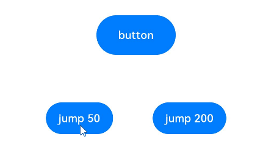
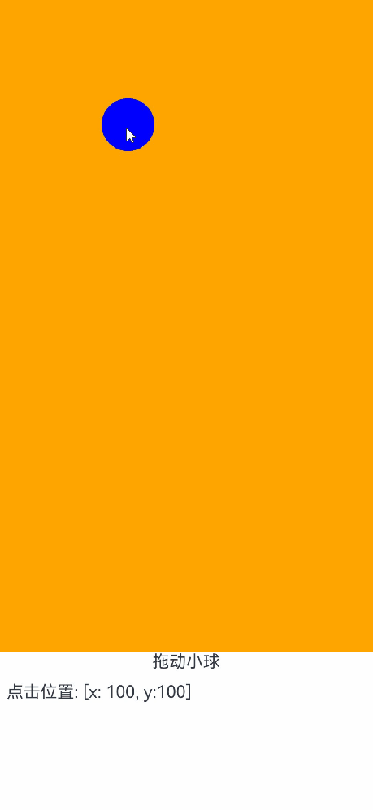

# Spring Curve Animation


ArkUI provides [preset animation curves](../reference/arkui-ts/ts-appendix-enums.md#curve), which specifies the change rule of animation attributes from the start value to the end value, such as Linear, Ease, and EaseIn. At the same time, ArkUI also provides spring curves generated by the physical model of spring oscillators. Through the spring curve, developers can set the end value to be exceeded and oscillate around the end value until the end value stops. The animation effect of spring curve is more interactive and playable than other curves.


There are two types of interfaces for spring curves: [springCurve](../reference/apis/js-apis-curve.md#curvesspringcurve9) and [springMotion](../reference/apis/js-apis-curve.md#curvesspringmotion9) and [responsiveSpringMotion](../reference/apis/js-apis-curve.md#curvesresponsivespringmotion9). Spring curves can be generated in both modes.


## Using springCurve

The **springCurve** API is as follows:


```ts
springCurve(velocity: number, mass: number, stiffness: number, damping: number)
```

The structural parameters include the initial velocity, the mass, stiffness and damping of the spring system. When building springCurve, you can set the quality to 1. Adjust the stiffness and damping parameters based on the parameter description in springCurve to achieve the desired oscillation effect.


```ts
import curves from '@ohos.curves';
@Entry
@Component
struct SpringTest {
  @State translateX: number = 0;

  private jumpWithSpeed(speed: number) {
    this.translateX = -1;
    animateTo({ duration: 2000, curve: curves.springCurve(speed, 1, 1, 1.2) }, () => {
      //Spring animation for translation in the x direction at the specified initial speed
      this.translateX = 0;
    })
  }

  build() {
    Column() {
      Button("button")
        .fontSize(14)
        .width(100)
        .height(50)
        .margin(30)
        .translate({ x: this.translateX })
      Row({space:50}) {
        Button("jump 50").fontSize(14)
          .onClick(() => {
            //Translate the spring curve with an initial speed of 50.
            this.jumpWithSpeed(50);
          })
        Button("jump 200").fontSize(14)
          .onClick(() => {
            //Translate the spring curve with an initial speed of 200.
            this.jumpWithSpeed(200);
          })
      }.margin(30)
    }.height('100%').width('100%')
  }
}
```





In the preceding example, when different buttons are clicked and different initial speeds of springCurve are given, the buttons reach the specified positions elastically, and the amplitude of the buttons increases with the speed. In addition, you can modify the mass, stiffness, and damping parameters of springCurve to achieve the desired elasticity.


>**NOTE**
>
>The speed only amplifies the oscillation effect, but whether the system can produce the oscillation effect depends on the physical parameters of the spring oscillator, that is, mass, stiffness, and damping. The smaller the stiffness and the larger the damping, the weaker the "elasticity" of springCurve and the weaker the oscillation effect. With the decrease of stiffness or the increase of damping, no matter how large the velocity is, there will be no oscillation near the end value.


## Using springMotion and responsiveSpringMotion

The interfaces of the [springMotion](../reference/apis/js-apis-curve.md#curvesspringmotion9) are as follows:


```ts
springMotion(response?: number, dampingFraction?: number, overlapDuration?: number)
```

The interfaces of the [responsiveSpringMotion](../reference/apis/js-apis-curve.md#curvesresponsivespringmotion9) are as follows:


```ts
responsiveSpringMotion(response?: number, dampingFraction?: number, overlapDuration?: number)
```

Their construction parameters include three optional parameters: spring natural vibration period, damping coefficient, and elastic animation connection duration. For details about the parameters, see their documents.


When the springMotion and responsiveSpringMotion curves are used, the duration parameter does not take effect. This parameter is applicable to hand animation.


```ts
import curves from '@ohos.curves';

@Entry
@Component
struct SpringMotionTest {
  @State positionX: number = 100;
  @State positionY: number = 100;
  diameter: number = 50;

  build() {
    Column() {
      Row() {
        Circle({ width: this.diameter, height: this.diameter })
          .fill(Color.Blue)
          .position({ x: this.positionX, y: this.positionY })
          .onTouch((event: TouchEvent) => {
            if (event.type === TouchType.Move) {
              // Follow-up process. Use the responsiveSpringMotion curve.
              animateTo({ curve: curves.responsiveSpringMotion() }, () => {
                //subtract the radius so that the center of the ball moves to the finger position
                this.positionX = event.touches[0].screenX - this.diameter / 2;
                this.positionY = event.touches[0].screenY - this.diameter / 2;
                console.info(`move, animateTo x:${this.positionX}, y:${this.positionY}`);
              })
            } else if (event.type === TouchType.Up) {
              //Use the springMotion curve when you leave your hand.
              animateTo({ curve: curves.springMotion() }, () => {
                this.positionX = 100;
                this.positionY = 100;
                console.info(`touchUp, animateTo x:100, y:100`);
              })
            }
          })
      }
      .width("100%").height("80%")
      .clip(true) //If the ball exceeds the range of the parent component, the ball is invisible.
      .backgroundColor(Color.Orange)

      Flex({ direction: FlexDirection.Row, alignItems: ItemAlign.Start, justifyContent: FlexAlign.Center }) {
        Text("Drag the ball").fontSize(16)
      }
      .width("100%")

      Row() {
        Text('Click position: [x:' + Math.round(this.positionX) +', y:' + Math.round(this.positionY) + ']').fontSize(16)
      }
      .padding(10)
      .width("100%")
    }.height('100%').width('100%')
  }
}
```


The preceding code is an example of hand animation. In the onTouch event, the touch position is captured and the translate or position attribute of the component is changed so that the component moves to the touch position when following the hand. After the hand is released, the component returns to the original position. The following figure shows the effect of the follower animation.





The responsiveSpringMotion curve is recommended for the follow-up process, and the springMotion curve is recommended for the release process. The follow-up process is triggered for multiple times as the position of the hand changes. Therefore, the responsiveSpringMotion animation is started for multiple times. When the hand is released, the springMotion animation is started once. During the follow-up and release processes, an animation is executed on the same attribute of the same object, and the springMotion or responsiveSpringMotion curve is used. Each time the animation is started, the speed used by the last animation is inherited, implementing smooth transition.


>**NOTE**
>
>  1. SpringCurve can be used to set the initial speed. If a single attribute has multiple animations, the animations do not affect each other. The effects of multiple animations are superimposed.
>
>  2. Although springMotion has an internal speed mechanism, it cannot be set by developers. When multiple animations exist for a single attribute, the later animation replaces the previous animation and inherits the speed of the previous animation.
