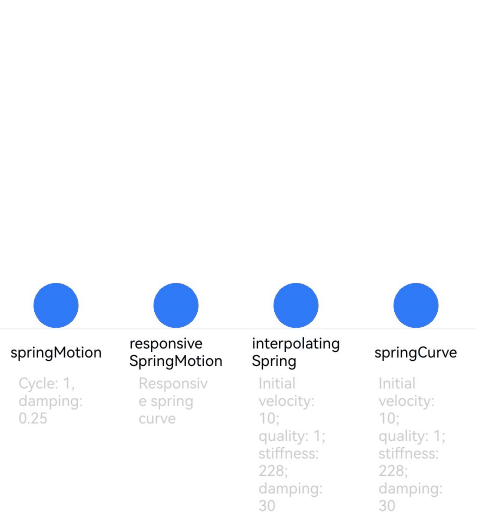

# Spring Curve


In a damped spring system corresponding to a damped spring curve (spring curve for short), an object that deviates from the equilibrium position is forced to oscillate due to a reverse force generated by spring deformation; this oscillation is resisted by the damping force. Except for the special case where the damping is 0, the oscillation gradually decays in amplitude towards 0, and the resultant animation curve is natural and continuous.


An animation using the spring curve slows down toward the end until the velocity is 0, instead of stopping abruptly.


ArkUI provides four types of damped spring curve APIs:


- [springMotion](../reference/apis-arkui/js-apis-curve.md#curvesspringmotion9): creates a spring animation curve. The animation duration is automatically calculated based on the curve parameters, attribute change values, and initial spring velocity. Manually set animation duration values do not take effect.
    **springMotion** does not provide any API for setting the velocity, as the velocity is obtained through inheritance. For an attribute, if there is already a springMotion or responsiveSpringMotion animation running, a new spring animation will stop the running animation and inherit the attribute values and velocity of that animation as its initial values. This spring curve API provides default parameters, which you can directly use when appropriate.

  ```ts
  function springMotion(response?: number, dampingFraction?: number, overlapDuration?: number): ICurve;
  ```


- [responsiveSpringMotion](../reference/apis-arkui/js-apis-curve.md#curvesresponsivespringmotion9): creates a responsive spring animation curve. It is a special case of **springMotion**, with the only difference in the default values. It is typically used to create an animation with a gesture on the screen. You can use **springMotion** to create an animation for when the user lifts their finger off the screen. The created animation automatically inherits the previous velocity for animation transition.
  When the **overlapDuration** parameter of the new animation is not **0** and the previous spring animation of the current attribute is not yet complete, **response** and **dampingFraction** transit, over the period specified by **overlapDuration**, from the values of the previous animation to that of the new animation.


  ```ts
  function responsiveSpringMotion(response?: number, dampingFraction?: number, overlapDuration?: number): ICurve;
  ```


- [interpolatingSpring](../reference/apis-arkui/js-apis-curve.md#curvesinterpolatingspring10): creates an interpolating spring curve animated from 0 to 1. It applies to scenarios where the initial animation velocity needs to be specified. The animation duration is automatically calculated, and the manually specified animation duration does not take effect.
  The actual animation value is calculated based on the curve. Therefore, the velocity should be the normalized speed, which is equal to the absolute speed of the animation attribute change divided by the amount of the animation attribute change. In light of this, this API is not applicable to the scenario where the attribute value of the animation start point is the same as that of the animation end point, since under this scenario, the amount of the animation attribute change is 0, and the normalized speed does not exist.


  ```ts
  function interpolatingSpring(velocity: number, mass: number, stiffness: number, damping: number): ICurve;
  ```


- [springCurve](../reference/apis-arkui/js-apis-curve.md#curvesspringcurve9): creates a spring curve with the specified animation duration. This API is almost the same as **interpolatingSpring**. However, for an animation that uses **springCurve**, the physical duration of the curve is mapped to the specified duration, which is equivalent to stretching or compressing the curve on the time axis and violating the original physical rule of the curve. Whenever possible, avoid using this API.

  ```ts
  function springCurve(velocity: number, mass: number, stiffness: number, damping: number): ICurve;
  ```


The following shows a complete example and effect of spring curves. For details about how to connect gestures and animations, see [Animation Smoothing](arkts-animation-smoothing.md).


 


```ts
import { curves } from '@kit.ArkUI';

class Spring {
  public title: string;
  public subTitle: string;
  public iCurve: ICurve;

  constructor(title: string, subTitle: string, iCurve: ICurve) {
    this.title = title;
    this.iCurve = iCurve;
    this.subTitle = subTitle;
  }
}

// Spring component
@Component
struct Motion {
  @Prop dRotate: number = 0
  private title: string = ""
  private subTitle: string = ""
  private iCurve: ICurve | undefined = undefined

  build() {
    Column() {
      Circle()
        .translate({ y: this.dRotate })
        .animation({ curve: this.iCurve, iterations: -1 })
        .foregroundColor('#317AF7')
        .width(30)
        .height(30)

      Column() {
        Text(this.title)
          .fontColor(Color.Black)
          .fontSize(10).height(30)
        Text(this.subTitle)
          .fontColor(0xcccccc)
          .fontSize(10).width(50)
      }
      .borderWidth({ top: 1 })
      .borderColor(0xf5f5f5)
      .width(80)
      .alignItems(HorizontalAlign.Center)
      .height(100)

    }
    .height(110)
    .margin({ bottom: 5 })
    .alignItems(HorizontalAlign.Center)
  }
}

@Entry
@Component
export struct SpringCurve {
  @State dRotate: number = 0;
  private springs: Spring[] = [
    new Spring('springMotion', 'Cycle: 1, damping: 0.25', curves.springMotion(1, 0.25)),
    new Spring('responsive' + '\n' + 'SpringMotion', 'Responsive spring curve', curves.responsiveSpringMotion(1, 0.25)),
    new Spring('interpolating' + '\n' + 'Spring', 'Initial velocity: 10; quality: 1; stiffness: 228; damping: 30', curves.interpolatingSpring(10, 1, 228, 30)),
    new Spring('springCurve', 'Initial velocity: 10; quality: 1; stiffness: 228; damping: 30', curves.springCurve(10, 1, 228, 30))
  ];

  build() {
    Row() {
      ForEach(this.springs, (item: Spring) => {
        Motion({ title: item.title, subTitle: item.subTitle, iCurve: item.iCurve, dRotate: this.dRotate })
      })
    }
    .justifyContent(FlexAlign.Center).alignItems(VerticalAlign.Bottom)
    .width('100%')
    .height(437)
    .margin({ top: 20 })
    .onClick(() => {
      this.dRotate = -50;
    })
  }
}
```



