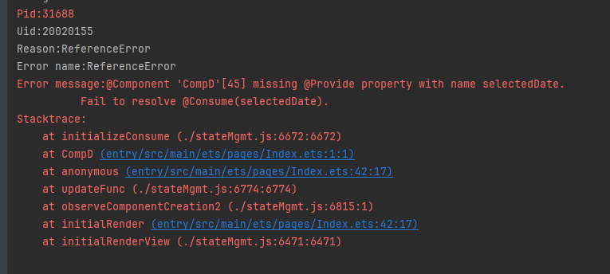
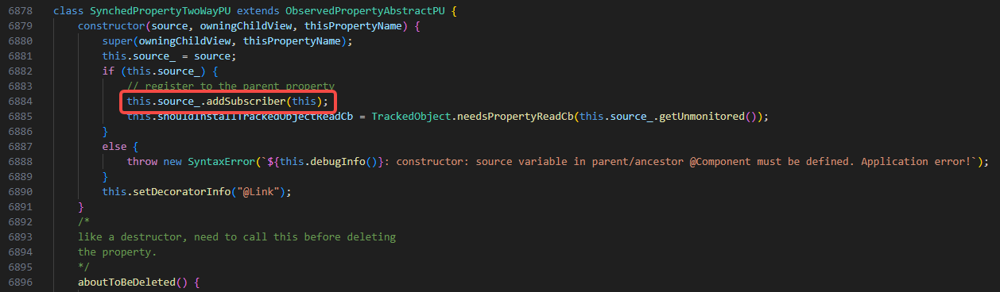

# Debugging Common UI-Related Application Crash Issues

This topic outlines frequent misuse patterns of ArkUI APIs that may lead to application crashes. It is intended to help you recognize and avoid common pitfalls during development.

## Premature Release of the OH_NativeXComponent Callback Object

**Symptom**

The application crashes with a cppcrash stack trace resembling the following:

```cpp
Reason:Signal:SIGSEGV(SEGV_ACCERR)@0x0000005c5f09a280 

#00 pc 0000000000ac9280 [anon:native_heap:jemalloc]
#01 pc 0000000002615120 /system/lib64/platformsdk/libace_compatible.z.so(OHOS::Ace::NG::XComponentPattern::OnSurfaceDestroyed()+468)
#02 pc 0000000002614b18 /system/lib64/platformsdk/libace_compatible.z.so(OHOS::Ace::NG::XComponentPattern::OnDetachFromFrameNode(OHOS::Ace::NG::FrameNode*)+88)
#03 pc 0000000000875294 /system/lib64/platformsdk/libace_compatible.z.so(OHOS::Ace::NG::FrameNode::~FrameNode()+264)
```

The final call frame of **libace_compatible.z.so** typically belongs to one of the **XComponentPattern** APIs: **OnSurfaceCreated**, **OnSurfaceChanged**, **OnSurfaceDestroyed**, or **DispatchTouchEvent**. Frame **#00** often points to an invalid address, with **pc** matching the last few digits of the address following **Reason** in the signal line. This indicates a corrupted function pointer.

**Possible Causes**

The application registers a callback object of type [OH_NativeXComponent_Callback](../reference/apis-arkui/capi-oh-nativexcomponent-native-xcomponent-oh-nativexcomponent-callback.md) using [OH_NativeXComponent_RegisterCallback](../reference/apis-arkui/capi-native-interface-xcomponent-h.md#oh_nativexcomponent_registercallback). Internally, this callback is stored as a raw pointer within the **XComponentPattern**. The callbacks is controlled by the application. If the application destroys the **OH_NativeXComponent_Callback** object prematurely, the pointer becomes invalid, leading to a use-after-free error.


**Solution**

The **onSurfaceDestroy** callback is the final callback invoked during the destruction of the **XComponentPattern**; its execution signifies that the component has been destroyed. Therefore, the application must ensure that these callback objects remain valid until after the **onSurfaceDestroy** callback has been executed.

**Reference**

[OH_NativeXComponent Native XComponent](../reference/apis-arkui/capi-oh-nativexcomponent-native-xcomponent.md)


## Premature Release of the OH_NativeXComponent Object

**Symptom**

The application crashes with a cppcrash stack trace resembling the following:

```cpp
#00 pc 00000000000c8b3c /system/lib64/libc++.so(std::__h::basic_string<char, std::__h::char_traits<char>, std::__h::allocator<char>>::basic_string(std::__h::basic_string<char, std::__h::char_traits<char>, std::__h::allocator<char>> const&)+16)
#01 pc 0000000000034f64 /system/lib64/libace_ndk.z.so(OH_NativeXComponent::GetXComponentId(char*, unsigned long*)+76)
#02 pc 00000000000867c0 /data/storage/el1/bundle/libs/arm64/librenderer.so
```

The top of the stack shows frames related to **libace_ndk.z.so(OH_NativeXComponent::XXX...)**, and the subsequent frame is within the application's own shared object (.so).

**Possible Causes**

The application holds a raw pointer to an **OH_NativeXComponent** object. If this object is destroyed but the pointer is still used to invoke methods, a use-after-free crash occurs.

**Solution**

Do not access any **OH_NativeXComponent** APIs after the **onSurfaceDestroy** callback has completed. This callback signals the end of the component's lifecycle.

**Reference**

[OH_NativeXComponent Native XComponent](../reference/apis-arkui/capi-oh-nativexcomponent-native-xcomponent.md)


## Missing Matching @Provide for @Consume

**Symptom**

The application crashes with a JS crash stack trace during initialization.



**Possible Causes**

The @Consume decorator requires a matching @Provide variable with the same key. If no such @Provide variable exists, initialization fails.


**Solution**

When examining the component tree, ensure that variables decorated with @Provide are defined in ancestor components. These variables are considered state variables provided to descendants. Variables decorated with @Consume are used in descendant components to bind to the variables provided by ancestor components. If the key bound by @Consume is not defined in any ancestor component, it will cause this error. Investigate from the usage perspective.

**Reference**

[\@Provider and \@Consumer Decorators: Synchronizing Across Component Levels in a Two-Way Manner](state-management/arkts-new-Provider-and-Consumer.md)


## Incorrect Data Source Type for @Link

**Symptom**

The application crashes with a JS crash stack trace during initialization.


**Possible Causes**

During initialization, @Link registers itself with the parent component and calls the parent component's **addSubscriber** API. If the type of the data source does not exactly match the type of the @Link variable, or if a constant is used to initialize @Link, this API cannot be called, resulting in an "is not callable" error.



**Solution**

Verify that the data source bound to @Link is a state variable and that its type matches the @Link declaration.

**Reference**

[\@Link Decorator: Implementing Two-Way Synchronization Between Parent and Child Components](state-management/arkts-link.md)


## Missing allowOverride in @Provide Declaration

**Symptom**

The application crashes with a JS crash stack trace during initialization.


**Possible Causes**

Overriding an @Provide variable requires the declaration of **allowOverride**. After declaration, both the alias and the property name can be overridden. If **allowOverride** is not declared and a duplicate alias or property name exists, it will cause an error (duplicate @Provide property with name xxxxx).


**Solution**

Use **allowOverride** when declaring @Provide variables that may be overridden. This enables child components using @Consume to bind to the nearest matching @Provide in the hierarchy based on the alias or property name.

**Reference**

[\@Provider and \@Consumer Decorators: Synchronizing Across Component Levels in a Two-Way Manner](state-management/arkts-new-Provider-and-Consumer.md)
