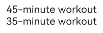
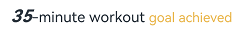
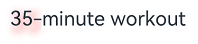
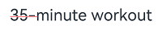
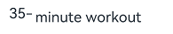
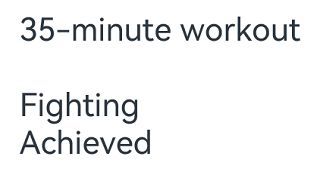
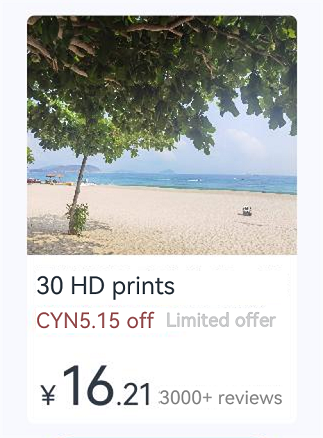

# Styled String (StyledString/MutableStyledString)

Styled strings, implemented by **StyledString** or **MutableStyledString** (collectively referred to as **StyledString**, with **MutableStyledString** inheriting from **StyledString**), are powerful markup objects designed to set text styles at the character or paragraph level. By binding a **StyledString** object to a text component, you can modify the text in various ways, including changing the font size, adding font colors, making the text clickable, and customizing the drawing of text, among others. For details, see [Styled String](../reference/apis-arkui/arkui-ts/ts-universal-styled-string.md).

Styled strings provide a variety of style objects that cover various common text formatting styles, such as text decorative lines, line height, and text shadows. You can also create **CustomSpan** objects to apply custom styles.

## Creating and Applying a StyledString Object

  You can bind a **StyledString** object to a text component using the [setStyledString](../reference/apis-arkui/arkui-ts/ts-basic-components-text.md#setstyledstring12) API provided by **TextController**. You are advised to call the API in the [onPageShow](../reference/apis-arkui/arkui-ts/ts-custom-component-lifecycle.md#onpageshow) callback for immediate display of the styled string text content.
  > **NOTE**
  >
  > Avoid calling the **setStyledString** API in **aboutToAppear**, as the component may have not yet been mounted to the node tree at the time **aboutToAppear** is executed, preventing the styled string text content from appearing upon page load.

  ```ts
  @Entry
  @Component
  struct styled_string_demo1 {
    styledString1: StyledString = new StyledString("45-minute workout");
    mutableStyledString1: MutableStyledString = new MutableStyledString("35-minute workout");
    controller1: TextController = new TextController();
    controller2: TextController = new TextController();

    async onPageShow() {
      this.controller1.setStyledString(this.styledString1)
      this.controller2.setStyledString(this.mutableStyledString1)
    }

    build() {
      Column() {
        // Display the styled string.
        Text(undefined, { controller: this.controller1 })
        Text(undefined, { controller: this.controller2 })
      }
      .width('100%')
    }
  }
  ```
  

## Setting the Text Style

Styled strings offer multiple style objects, such as [TextStyle](../reference/apis-arkui/arkui-ts/ts-universal-styled-string.md#textstyle), [TextShadowStyle](../reference/apis-arkui/arkui-ts/ts-universal-styled-string.md#textshadowstyle), [DecorationStyle](../reference/apis-arkui/arkui-ts/ts-universal-styled-string.md#decorationstyle), [BaselineOffsetStyle](../reference/apis-arkui/arkui-ts/ts-universal-styled-string.md#baselineoffsetstyle), [LineHeightStyle](../reference/apis-arkui/arkui-ts/ts-universal-styled-string.md#lineheightstyle), and [LetterSpacingStyle](../reference/apis-arkui/arkui-ts/ts-universal-styled-string.md#letterspacingstyle), for setting text styles.

- Creating and applying a **TextStyle** object

  ```ts
  import { LengthMetrics } from '@kit.ArkUI'
  @Entry
  @Component
  struct styled_string_demo2 {
    textStyleAttrs: TextStyle = new TextStyle({ fontWeight: FontWeight.Bolder, fontSize: LengthMetrics.vp(24), fontStyle: FontStyle.Italic })
    mutableStyledString: MutableStyledString = new MutableStyledString("35-minute workout goal achieved", [
      {
        start: 2,
        length: 2,
        styledKey: StyledStringKey.FONT,
        styledValue: this.textStyleAttrs
      },
      {
        start: 7,
        length: 4,
        styledKey: StyledStringKey.FONT,
        styledValue: new TextStyle({ fontColor: Color.Orange, fontSize: LengthMetrics.vp(12)})
      }
    ]);
    controller: TextController = new TextController();

    async onPageShow() {
      this.controller.setStyledString(this.mutableStyledString)
    }

    build() {
      Column() {
        // Display the styled string.
        Text(undefined, { controller: this.controller })
          .margin({ top: 10 })
      }
      .width('100%')
    }
  }
  ```
  

- Creating and applying a **TextShadowStyle** object

  ```ts
  // xxx.ets
  @Entry
  @Component
  struct styled_string_demo3 {
    mutableStyledString: MutableStyledString = new MutableStyledString("35-minute workout", [
    {
      start: 0,
      length: 3,
      styledKey: StyledStringKey.TEXT_SHADOW,
      styledValue: new TextShadowStyle({
        radius: 5,
        type: ShadowType.COLOR,
        color: Color.Red,
        offsetX: 10,
        offsetY: 10
      })
    }
    ]);
    controller: TextController = new TextController();

    async onPageShow() {
      this.controller.setStyledString(this.mutableStyledString)
    }

    build() {
      Column() {
        // Display the styled string.
        Text(undefined, { controller: this.controller })
      }
      .width('100%')
    }
  }
  ```
  

- Creating and applying a **Text DecorationStyle** object

  ```ts
  // xxx.ets
  @Entry
  @Component
  struct styled_string_demo4 {
    mutableStyledString: MutableStyledString = new MutableStyledString("35-minute workout", [
    {
      start: 0,
      length: 3,
      styledKey: StyledStringKey.DECORATION,
      styledValue: new DecorationStyle({type: TextDecorationType.LineThrough, color: Color.Red})
    }
    ]);
    controller: TextController = new TextController();

    async onPageShow() {
      this.controller.setStyledString(this.mutableStyledString)
    }

    build() {
      Column() {
        // Display the styled string.
        Text(undefined, { controller: this.controller })
      }
      .width('100%')
    }
  }
  ```
  

- Creating and applying a **Text BaselineOffsetStyle** object

  ```ts
  import { LengthMetrics, LengthUnit } from '@kit.ArkUI'
  // xxx.ets
  @Entry
  @Component
  struct styled_string_demo5 {
    mutableStyledString: MutableStyledString = new MutableStyledString("35-minute workout", [
      {
        start: 0,
        length: 3,
        styledKey: StyledStringKey.BASELINE_OFFSET,
        styledValue: new BaselineOffsetStyle(LengthMetrics.px(20))
      }
    ]);
    controller: TextController = new TextController();

    async onPageShow() {
      this.controller.setStyledString(this.mutableStyledString)
    }

    build() {
      Column() {
        // Display the styled string.
        Text(undefined, { controller: this.controller })
      }
      .width('100%')
    }
  }
  ```
  

- Creating and applying a **LineHeightStyle** object

  ```ts
  import { LengthMetrics, LengthUnit } from '@kit.ArkUI'
  // xxx.ets
  @Entry
  @Component
  struct styled_string_demo6 {
    mutableStyledString: MutableStyledString = new MutableStyledString("35-minute workout\nFighting\nAchieved", [
      {
        start: 8,
        length: 3,
        styledKey: StyledStringKey.LINE_HEIGHT,
        styledValue: new LineHeightStyle(LengthMetrics.vp(50))
      }
    ]);
    controller: TextController = new TextController();

    async onPageShow() {
      this.controller.setStyledString(this.mutableStyledString)
    }

    build() {
      Column() {
        // Display the styled string.
        Text(undefined, { controller: this.controller })
      }
      .width('100%')
      .margin({ top: 10 })
    }
  }
  ```
  

- Creating and applying a **LetterSpacingStyle** object

  ```ts
  import { LengthMetrics, LengthUnit } from '@kit.ArkUI'
  // xxx.ets
  @Entry
  @Component
  struct styled_string_demo7 {
    mutableStyledString: MutableStyledString = new MutableStyledString("35-minute workout", [
      {
        start: 0,
        length: 2,
        styledKey: StyledStringKey.LETTER_SPACING,
        styledValue: new LetterSpacingStyle(new LengthMetrics(20, LengthUnit.VP))
      }
    ]);
    controller: TextController = new TextController();

    async onPageShow() {
      this.controller.setStyledString(this.mutableStyledString)
    }

    build() {
      Column() {
        // Display the styled string.
        Text(undefined, { controller: this.controller })
      }
      .width('100%')
    }
  }
  ```
  

## Setting the Paragraph Style

You can set the paragraph style using [ParagraphStyle](../reference/apis-arkui/arkui-ts/ts-universal-styled-string.md#paragraphstyle). The figure below shows how to divide paragraphs in the text, with each paragraph ending with a newline character \n.


The following example shows how to create and apply a paragraph style. The style is applied to the start, end or any position within a paragraph; it does not apply to non-paragraph areas.

  ```ts
  import { LengthMetrics } from '@kit.ArkUI'
  titleParagraphStyleAttr: ParagraphStyle = new ParagraphStyle({ textAlign: TextAlign.Center });
  // Create a paragraph style for a 15 vp first-line text indent.
  paragraphStyleAttr1: ParagraphStyle = new ParagraphStyle({ textIndent: LengthMetrics.vp(15) });
  // Line height style object
  lineHeightStyle1: LineHeightStyle= new LineHeightStyle(new LengthMetrics(24));
  // Create a paragraph style object paragraphStyledString1.
  paragraphStyledString1: MutableStyledString = new MutableStyledString("Paragraph Title\nFirst paragraph starts 0123456789 First paragraph ends.", [
    {
      start: 0,
      length: 4,
      styledKey: StyledStringKey.PARAGRAPH_STYLE,
      styledValue: this.titleParagraphStyleAttr
    },
    {
      start: 0,
      length: 4,
      styledKey: StyledStringKey.LINE_HEIGHT,
      styledValue: new LineHeightStyle(new LengthMetrics(50))
    },{
    start: 0,
    length: 4,
    styledKey: StyledStringKey.FONT,
    styledValue: new TextStyle({ fontSize: LengthMetrics.vp(24), fontWeight: FontWeight.Bolder })
  },
    {
      start: 5,
      length: 3,
      styledKey: StyledStringKey.PARAGRAPH_STYLE,
      styledValue: this.paragraphStyleAttr1
    },
    {
      start: 5,
      length: 20,
      styledKey: StyledStringKey.LINE_HEIGHT,
      styledValue: this.lineHeightStyle1
    }
  ]);
  ```

  In addition to presetting styles when creating a styled string, you can also clear the original styles and replace them with new ones later using the [replaceStyle](../reference/apis-arkui/arkui-ts/ts-universal-styled-string.md#replacestyle) API. After the replacement, you need to proactively trigger an update to the bound styled string on the attached text component's controller.

  ```ts
  import { LengthMetrics } from '@kit.ArkUI'
  // Set the maximum number of lines and text overflow mode for the paragraph, without setting the indent.
  paragraphStyleAttr3: ParagraphStyle = new ParagraphStyle({ textAlign: TextAlign.End, maxLines: 1, wordBreak: WordBreak.BREAK_ALL, overflow: TextOverflow.Ellipsis});
  // Later in the code, trigger an update to the paragraph style.
  controller: TextController = new TextController();
  this.paragraphStyledString1.replaceStyle({
    start: 5,
    length: 3,
    styledKey: StyledStringKey.PARAGRAPH_STYLE,
    styledValue: this.paragraphStyleAttr3
  })
  this.controller.setStyledString(this.paragraphStyledString1)
  ```

## Using Images

You can add images using [ImageAttachment](../reference/apis-arkui/arkui-ts/ts-universal-styled-string.md#imageattachment).

The following example shows how to attach images and text to the same **MutableStyledString** object for mixed display of text and images.

  ```ts
  // xxx.ets
  import { image } from '@kit.ImageKit'
  import { LengthMetrics } from '@kit.ArkUI'

  @Entry
  @Component
  struct styled_string_demo4 {
    @State message: string = 'Hello World'
    imagePixelMap: image.PixelMap | undefined = undefined
    @State imagePixelMap3: image.PixelMap | undefined = undefined
    mutableStr: MutableStyledString = new MutableStyledString('123');
    controller: TextController = new TextController();
    mutableStr2: MutableStyledString = new MutableStyledString('This is set decoration line style to the mutableStr2', [{
      start: 0,
      length: 15,
      styledKey: StyledStringKey.DECORATION,
      styledValue: new DecorationStyle({
        type: TextDecorationType.Overline,
        color: Color.Orange,
        style: TextDecorationStyle.DOUBLE
      })
    }])

    async aboutToAppear() {
      console.info("aboutToAppear initial imagePixelMap")
      this.imagePixelMap = await this.getPixmapFromMedia($r('app.media.sea'))
    }

    private async getPixmapFromMedia(resource: Resource) {
      let unit8Array = await this.getUIContext().getHostContext()?.resourceManager?.getMediaContent({
        bundleName: resource.bundleName,
        moduleName: resource.moduleName,
        id: resource.id
      })
      let imageSource = image.createImageSource(unit8Array?.buffer?.slice(0, unit8Array?.buffer?.byteLength))
      let createPixelMap: image.PixelMap = await imageSource.createPixelMap({
        desiredPixelFormat: image.PixelMapFormat.RGBA_8888
      })
      await imageSource.release()
      return createPixelMap
    }

    leadingMarginValue: ParagraphStyle = new ParagraphStyle({ leadingMargin: LengthMetrics.vp(5)})
    // Line height style object
    lineHeightStyle1: LineHeightStyle= new LineHeightStyle(new LengthMetrics(24));
    //Bold style
    boldTextStyle: TextStyle = new TextStyle({ fontWeight: FontWeight.Bold });
    // Create a paragraph style object paragraphStyledString1.
    paragraphStyledString1: MutableStyledString = new MutableStyledString("\n30 HD prints\nCYN5.15 off Limited offer", [
      {
        start: 0,
        length: 28,
        styledKey: StyledStringKey.PARAGRAPH_STYLE,
        styledValue: this.leadingMarginValue
      },
      {
        start: 14,
        length: 9,
        styledKey: StyledStringKey.FONT,
        styledValue: new TextStyle({ fontSize: LengthMetrics.vp(14), fontColor: '#B22222' })
      },
      {
        start: 24,
        length: 4,
        styledKey: StyledStringKey.FONT,
        styledValue: new TextStyle({ fontSize: LengthMetrics.vp(14), fontWeight: FontWeight.Lighter })
      },
      {
        start: 11,
        length: 4,
        styledKey: StyledStringKey.LINE_HEIGHT,
        styledValue: this.lineHeightStyle1
      }
    ]);
    paragraphStyledString2: MutableStyledString = new MutableStyledString("\n¥16.21 3000+ reviews", [
      {
        start: 0,
        length: 5,
        styledKey: StyledStringKey.PARAGRAPH_STYLE,
        styledValue: this.leadingMarginValue
      },
      {
        start: 0,
        length: 4,
        styledKey: StyledStringKey.LINE_HEIGHT,
        styledValue: new LineHeightStyle(new LengthMetrics(60))
      },
      {
        start: 0,
        length: 7,
        styledKey: StyledStringKey.FONT,
        styledValue: this.boldTextStyle
      },
      {
        start: 1,
        length: 1,
        styledKey: StyledStringKey.FONT,
        styledValue: new TextStyle({ fontSize: LengthMetrics.vp(18) })
      },
      {
        start: 2,
        length: 2,
        styledKey: StyledStringKey.FONT,
        styledValue: new TextStyle({ fontSize: LengthMetrics.vp(36) })
      },
      {
        start: 4,
        length: 3,
        styledKey: StyledStringKey.FONT,
        styledValue: new TextStyle({ fontSize: LengthMetrics.vp(20) })
      },
      {
        start: 7,
        length: 9,
        styledKey: StyledStringKey.FONT,
        styledValue: new TextStyle({ fontColor: Color.Grey, fontSize: LengthMetrics.vp(14)})
      }
    ])

    build() {
      Row() {
        Column({ space: 10 }) {
          Text(undefined, { controller: this.controller })
            .copyOption(CopyOptions.InApp)
            .draggable(true)
            .backgroundColor('#FFFFFF')
            .borderRadius(5)

          Button('View Product Details')
            .onClick(() => {
              if (this.imagePixelMap !== undefined) {
                this.mutableStr = new MutableStyledString(new ImageAttachment({
                  value: this.imagePixelMap,
                  size: { width: 180, height: 160 },
                  verticalAlign: ImageSpanAlignment.BASELINE,
                  objectFit: ImageFit.Fill
                }))
                this.paragraphStyledString1.appendStyledString(this.paragraphStyledString2)
                this.mutableStr.appendStyledString(this.paragraphStyledString1)
                this.controller.setStyledString(this.mutableStr)
              }
            })
        }
        .width('100%')
      }
      .height('100%')
      .backgroundColor('#F8F8FF')
    }
  }
  ```
  

## Setting Events

You can use [GestureStyle](../reference/apis-arkui/arkui-ts/ts-universal-styled-string.md#gesturestyle) to set up **onClick** and **onLongPress** events to enable text to respond to click and long-press actions.

In addition to initializing styled strings with initial style objects, you can also use the [setStyle](../reference/apis-arkui/arkui-ts/ts-universal-styled-string.md#setstyle) API to overlay new styles or update existing ones. After making changes, you need to manually trigger an update of the bound styled string on the attached text component's controller. 

  ```ts
import { drawing } from '@kit.ArkGraphics2D';

class MyCustomSpan extends CustomSpan {
  constructor(word: string, width: number, height: number, fontSize: number) {
    super();
    this.word = word;
    this.width = width;
    this.height = height;
    this.fontSize = fontSize;
  }

  onMeasure(measureInfo: CustomSpanMeasureInfo): CustomSpanMetrics {
    return { width: this.width, height: this.height }
  }

  onDraw(context: DrawContext, options: CustomSpanDrawInfo) {
    let canvas = context.canvas;

    const brush = new drawing.Brush();
    brush.setColor({ alpha: 255, red: 0, green: 0, blue: 0 })
    const font = new drawing.Font()
    font.setSize(vp2px(this.fontSize))
    const textBlob = drawing.TextBlob.makeFromString(this.word.substring(0, 5), font, drawing.TextEncoding.TEXT_ENCODING_UTF8)
    canvas.attachBrush(brush)

    this.onDrawRectByRadius(context, options.x, options.x + vp2px(this.width), options.lineTop, options.lineBottom, 20)
    brush.setColor({ alpha: 255, red: 255, green: 255, blue: 255 })
    canvas.attachBrush(brush)
    canvas.drawTextBlob(textBlob, options.x, options.lineBottom - 30)
    brush.setColor({ alpha: 255, red: 255, green: 228 , blue: 196 })
    canvas.attachBrush(brush)
    const textBlob1 = drawing.TextBlob.makeFromString(this.word.substring(5), font, drawing.TextEncoding.TEXT_ENCODING_UTF8)
    canvas.drawTextBlob(textBlob1, options.x + vp2px(100), options.lineBottom - 30)

    canvas.detachBrush()
  }
  onDrawRectByRadius(context: DrawContext, left: number, right: number, top: number, bottom: number, radius: number) {
    let canvas = context.canvas
    let path = new drawing.Path()

    // Draw a rectangle with rounded corners.
    path.moveTo(left  + radius, top)
    path.lineTo(right - radius, top)
    path.arcTo(right - 2 * radius, top, right, top + 2 * radius, 270, 90)
    path.lineTo(right, bottom - radius)
    path.arcTo(right - 2 * radius, bottom - 2 * radius, right, bottom, 0, 90)

    path.lineTo(left + 2 * radius, bottom)
    path.arcTo(left, bottom - 2 * radius, left + 2 * radius, bottom, 90, 90)
    path.lineTo(left, top + 2 * radius)
    path.arcTo(left, top, left + 2 * radius, top + 2 * radius, 180, 90)

    canvas.drawPath(path)
  }
  setWord(word: string) {
    this.word = word;
  }

  width: number = 160
  word: string = "drawing"
  height: number = 10
  fontSize: number = 16
}

@Entry
@Component
struct styled_string_demo6 {
  customSpan3: MyCustomSpan = new MyCustomSpan("99VIP88%off", 200, 40, 30)
  textStyle: MutableStyledString = new MutableStyledString("123");
  textController: TextController = new TextController()
  isPageShow: boolean = true

  async onPageShow() {
    if (!this.isPageShow) {
      return
    }
    this.isPageShow = false
    this.textController.setStyledString(new StyledString(this.customSpan3))
  }

  build() {
    Row() {
      Column() {
        Text(undefined, { controller: this.textController })
          .copyOption(CopyOptions.InApp)
          .fontSize(30)
      }
      .width('100%')
    }
    .height('100%')
  }
}
  ```


## Example

This example shows how to implement an expired membership notification using **ParagraphStyle**, **LineHeightStyle**, and **TextStyle** objects.

```ts
import { LengthMetrics } from '@kit.ArkUI';

@Entry
@Component
struct Index {
  alignCenterParagraphStyleAttr: ParagraphStyle = new ParagraphStyle({ textAlign: TextAlign.Center });
  // Line height style object
  lineHeightStyle1: LineHeightStyle= new LineHeightStyle(LengthMetrics.vp(24));
  //Bold style
  boldTextStyle: TextStyle = new TextStyle({ fontWeight: FontWeight.Bold });
  // Create a paragraph style object paragraphStyledString1.
  paragraphStyledString1: MutableStyledString = new MutableStyledString("Diamond Membership expired\nRenew to keep your perks ", [
    {
      start: 0,
      length: 4,
      styledKey: StyledStringKey.PARAGRAPH_STYLE,
      styledValue: this.alignCenterParagraphStyleAttr
    },
    {
      start: 0,
      length: 4,
      styledKey: StyledStringKey.LINE_HEIGHT,
      styledValue: new LineHeightStyle(LengthMetrics.vp(40))
    },
    {
      start: 11,
      length: 14,
      styledKey: StyledStringKey.FONT,
      styledValue: new TextStyle({ fontSize: LengthMetrics.vp(14), fontColor: Color.Grey })
    },
    {
      start: 11,
      length: 4,
      styledKey: StyledStringKey.PARAGRAPH_STYLE,
      styledValue: this.alignCenterParagraphStyleAttr
    },
    {
      start: 11,
      length: 4,
      styledKey: StyledStringKey.LINE_HEIGHT,
      styledValue: this.lineHeightStyle1
    }
  ]);
  paragraphStyledString2: MutableStyledString = new MutableStyledString("\n￥4.88￥15", [
    {
      start: 0,
      length: 4,
      styledKey: StyledStringKey.PARAGRAPH_STYLE,
      styledValue: this.alignCenterParagraphStyleAttr
    },
    {
      start: 0,
      length: 4,
      styledKey: StyledStringKey.LINE_HEIGHT,
      styledValue: new LineHeightStyle(LengthMetrics.vp(60))
    },
    {
      start: 0,
      length: 6,
      styledKey: StyledStringKey.FONT,
      styledValue: this.boldTextStyle
    },
    {
      start: 1,
      length: 1,
      styledKey: StyledStringKey.FONT,
      styledValue: new TextStyle({ fontSize: LengthMetrics.vp(18)})
    },
    {
      start: 2,
      length: 4,
      styledKey: StyledStringKey.FONT,
      styledValue: new TextStyle({ fontSize: LengthMetrics.vp(40)})
    },
    {
      start: 6,
      length: 3,
      styledKey: StyledStringKey.FONT,
      styledValue: new TextStyle({ fontColor: Color.Grey, fontSize: LengthMetrics.vp(14)})
    },
    {
      start: 6,
      length: 3,
      styledKey: StyledStringKey.DECORATION,
      styledValue: new DecorationStyle({ type: TextDecorationType.LineThrough, color: Color.Grey })
    }
  ])
  paragraphStyledString3: MutableStyledString = new MutableStyledString("\nOffer ends in 02:06", [
    {
      start: 0,
      length: 4,
      styledKey: StyledStringKey.PARAGRAPH_STYLE,
      styledValue: this.alignCenterParagraphStyleAttr
    },
    {
      start: 0,
      length: 4,
      styledKey: StyledStringKey.LINE_HEIGHT,
      styledValue: new LineHeightStyle(LengthMetrics.vp(30))
    },
    {
      start: 1,
      length: 2,
      styledKey: StyledStringKey.FONT,
      styledValue: new TextStyle({ fontColor: '#FFD700', fontWeight: FontWeight.Bold })
    },
    {
      start: 4,
      length: 2,
      styledKey: StyledStringKey.FONT,
      styledValue: new TextStyle({ fontColor: '#FFD700', fontWeight: FontWeight.Bold })
    }
  ])
  controller: TextController = new TextController();

  build() {
    Row() {
      Column( { space : 5 }) {
        Text(undefined, { controller: this.controller })
          .width(240)
          .copyOption(CopyOptions.InApp)
          .draggable(true)
          .onAppear(()=>{
            this.paragraphStyledString2.appendStyledString(this.paragraphStyledString3)
            this.paragraphStyledString1.appendStyledString(this.paragraphStyledString2)
            this.controller.setStyledString(this.paragraphStyledString1)
          })

        Button("Renew")
          .width(200)
          .fontColor(Color.White)
          .fontSize(18)
          .backgroundColor('#3CB371')
          .margin({ bottom: 10 })
      }
      .borderWidth(1).borderColor('#FFDEAD')
      .margin({ left: 10 })
    }
    .height('60%')
  }
}
```

