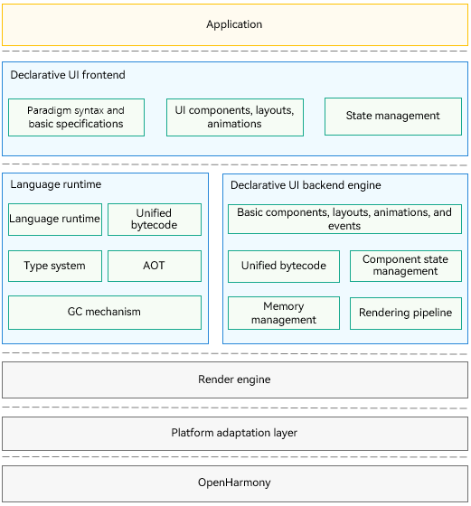

# UI Development (ArkTS-based Declarative Development Paradigm) Overview

Powered by the ArkTS-based declarative development paradigm, ArkUI is a simplified, high-performance UI development framework for cross-device applications. It provides the capabilities required for building the application UI, including:

- **ArkTS**

  ArkTS is the preferred programming language for application development. As a superset of [TypeScript](https://www.typescriptlang.org/) (TS for short), it contains all TS features and added features, including declarative UI description, custom components, dynamic UI element extension, state management, and rendering control. State management in ArkTS provides clear page re-render processes and pipes through decorators with different functions. It covers UI component states and application states, allowing for a comprehensive data update and UI rendering mechanism across the application. To learn more about ArkTS, see [Getting Started with ArkTS](../quick-start/arkts-get-started.md).

- **Layout**

  Layout defines how components are laid out in the UI. ArkUI offers a diverse array of layouts. Besides the basic layouts, such as linear, stack, flex, and relative, you also have access to the advanced layouts, including list, grid, and swiper, for more complex UI design needs.

- **Component**

  Components are essential elements of the UI, working together to shape the UI. They can be classified as built-in components provided by ArkUI and custom components defined by developers. The built-in components include buttons, radio buttons, progress indicators, and text. You can set the rendering effect of these components in method chaining mode. You can combine built-in components to create custom components. In this way, page components are divided into independent UI units to implement individual creation, development, and reuse of different units on pages, making pages more engineering-oriented.

- **Page routing and component navigation**

  An application may contain a good many pages, and each page may come with multiple components. You can implement page routing to navigate users between pages and use navigation components to navigate them between components.

- **Graphics**

  ArkUI offers diversified graphics capabilities, including capabilities to display images in various formats and custom drawing capabilities. By leveraging these capabilities, you can easily bring your custom drawing ideas into reality.

- **Animation**

  Apart from animations embedded in components, ArkUI offers additional animation features: attribute animation, explicit animation, transition animation, and animation APIs. You can customize animation tracks by calling the provided animation APIs in addition to using the encapsulated physical models.

- **Interaction event**

  Interaction events are important for interactions between the UI and users. ArkUI allows users to interact with your application UI, with support for various universal events and gesture events. Universal events include touch events, mouse events, key events, and focus events. Gesture events accept single gestures (tap, long press, pan, pinch, rotation, and swipe), and a combination of gestures.

- **Customization**

  ArkUI offers comprehensive customization capabilities for UI development and personalization: custom combinations, extensions, nodes, and rendering techniques.

## Highlights

- Simplified and efficient development
  - Simple code: You can describe the UI in pseudo-natural language, without caring about how the framework implements UI drawing and rendering.
  - Data-driven UI change: This allows you to better focus on your service logic processing. When the UI changes, you do not need to write code for switching between different UIs. Instead, you only need to write the data that causes the UI change and let the framework take over the rest.
  - Improved development experience: Just code to get the UI developed.

- High performance
  - Declarative UI frontend and backend layering: The UI backend, constructed using the C++ programming language, provides basic components, layout, animations, interaction events, component state management, and rendering pipelines for the frontend.
  - Language compiler and runtime optimization: The productivity punch includes unified bytecode, efficient Foreign Function Interface (FFI), ahead-of-time (AOT), engine minimization, and type optimization.

- Promising ecosystem
  ArkUI can gain traction with its relatively neutral and friendly programming language. It can tap on the ecosystems of mainstream languages ecosystem and pushed toward a steady revolutionary path with standards organizations.

## Architecture

  **Figure 1** Overall architecture 

- **Declarative UI frontend**
  Provides basic language specifications of the UI development paradigm, built-in UI components, layouts, and animations, and multiple state management mechanisms, with a wide array of APIs for you to call as required.

- **Language runtime**
  Provides the parsing capability for the UI paradigm syntax and allows for cross-language API calls for a high-performance operating environment of the TS language.

- **Declarative UI backend engine**
  Provides UI rendering pipelines that are compatible with different development paradigms, multiple basic components, layout calculation, animations, and interaction events, with state management and drawing capabilities.

- **Render engine**
  Provides efficient drawing capabilities, which enable rendering instructions collected by the rendering pipeline to be drawn to the screen.

- **Platform adaptation layer**
  Provides abstract APIs to connect to different systems, such as system rendering pipelines and lifecycle scheduling.

## Development Process

The table below lists the main tasks involved in UI development with ArkUI.

| Task         | Description                                 | Guide                                    |
| ----------- | ----------------------------------- | ---------------------------------------- |
| Get started with ArkTS    | Learn the basic syntax, state management, and rendering control scenarios of ArkTS.        | - [Basic Syntax Overview](../ui/state-management/arkts-basic-syntax-overview.md) - [State Management](../ui/state-management/arkts-state-management-overview.md) - [Rendering Control](../ui/state-management/arkts-rendering-control-ifelse.md)|
| Develop the layout       | Understand the common layouts.            | - [Layout Overview](arkts-layout-development-overview.md) |
| Add components       | Understand how to use common built-in components and create custom components.| - [Common Components](arkts-common-components-button.md) - [Custom Components](../ui/state-management/arkts-create-custom-components.md)|
| Set component navigation and page routing| Learn how to set up navigation between components and page routing.               | - [Component Navigation (Recommended)](arkts-navigation-navigation.md) - [Page Routing](arkts-routing.md)|
| Use text| Discover how to work with text components such as text boxes, rich text, and styled strings.               | - [Text Display](arkts-common-components-text-display.md) - [Text Input](arkts-common-components-text-input.md) - [Rich Text](arkts-common-components-richeditor.md) - [Symbol Glyph](arkts-common-components-symbol.md) - [Styled String](arkts-styled-string.md)|
| Use popup windows| Learn when and how to use popup windows.| - [Dialog Box Overview](arkts-base-dialog-overview.md) - [Menu Control (Menu)](arkts-popup-and-menu-components-menu.md) - [Popup](arkts-popup-and-menu-components-popup.md) - [Modal Page Overview](arkts-modal-overview.md) - [Toast](arkts-create-toast.md) - [OverlayManager](arkts-create-overlaymanager.md)|
| Use graphics       | Understand how to display images, draw custom geometry, and make custom graphics on the canvas.  | - [Drawing Geometric Shapes](arkts-geometric-shape-drawing.md) - [Drawing Custom Graphics Using the Canvas](arkts-drawing-customization-on-canvas.md)|
| Apply animations       | Learn the typical scenarios of applying animations on components and pages.                 | - [Property Animation](arkts-attribute-animation-overview.md) - [Transition Animation](arkts-transition-overview.md) - [Particle Animation](arkts-particle-animation.md) - [Component Animation](arkts-component-animation.md) - [Traditional Curve](arkts-traditional-curve.md) - [Animation Smoothing](arkts-animation-smoothing.md) - [Blur Effect](arkts-blur-effect.md) - [Frame Animation](arkts-animator.md)|
| Add interaction events       | Understand the basic interaction mechanism, input devices and events, and gesture response capabilities.          | - [Interaction Mechanism Overview](arkts-interaction-basic-principles.md) - [Input Devices and Events](arkts-interaction-development-guide-raw-input-event.md) - [Adding Gesture Response](arkts-interaction-development-guide-support-gesture.md)|
| Use customization capabilities       | Learn the basic concepts of custom capabilities and how to apply them.      | - [Custom Composition](arkts-user-defined-composition.md) - [Custom Node](arkts-user-defined-node.md) - [Custom Extension](arkts-user-defined-modifier.md)|
| Implement UI internationalization       | Learn how to implement an internationalized application UI, including resource configuration and support for right-to-left (RTL) layouts.      | - [Implementing UI Internationalization](arkts-internationalization.md)|
| Support aging-friendly design       | Learn about the use cases and methods for aging-friendly design.      | - [Supporting Aging-Friendly Design](arkui-support-for-aging-adaptation.md)|
| Set the theme      | Explore application-level and page-level theme setting capabilities.      | - [Implementing Dark and Light Mode Adaptation](ui-dark-light-color-adaptation.md) - [Configuring In-Application Theme Skinning](theme_skinning.md)|
| Use the UI context API for UI operations      | Learn how to use the corresponding APIs in **UIContext** to obtain objects bound to instances.      | - [Using the UI Context API for UI Operations](arkts-global-interface.md)|
| Launch pages across processes| Discover methods to launch atomic services in full-screen mode.| - [Atomic Service Full Screen Launch Component](arkts-FullScreenComponent.md) |
| Use NDK APIs to build UIs| Understand the capabilities provided by ArkUI NDK APIs and how to create UIs through NDK APIs.      | - [Integrating with ArkTS Pages](ndk-access-the-arkts-page.md) - [Listening for Component Events](ndk-listen-to-component-events.md) - [Using Animations](ndk-use-animation.md) - [Implementing a List Layout](ndk-loading-long-list.md) - [Building Dialog Boxes](ndk-build-pop-up-window.md) - [Building Custom Components](ndk-build-custom-components.md) - [Embedding ArkTS Components](ndk-embed-arkts-components.md) - [Integrating Accessibility Through XComponent](ndk-accessibility-xcomponent.md)|

## General Rules

- **Default Unit**

  The default unit for input parameters representing length is vp, which means that input parameters of number type, as well as the number units in [Length](../reference/apis-arkui/arkui-ts/ts-types.md#length) and [Dimension](../reference/apis-arkui/arkui-ts/ts-types.md#dimension10) types, are in vp.

- **Abnormal Value Processing**

  If the input parameter is **undefined**, **null**, or an invalid value, the following processing rules apply:

  (1) If a default value is specified for the parameter, it is used.

  (2) If no default value is specified for the parameter, the property or API associated with that parameter is ineffective.
<!--no_check-->