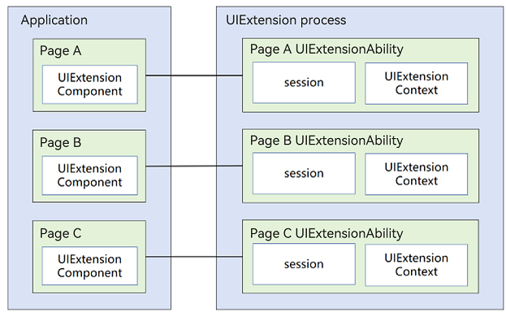
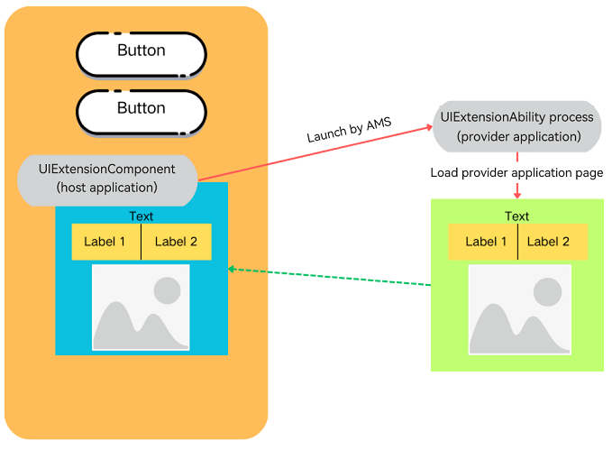
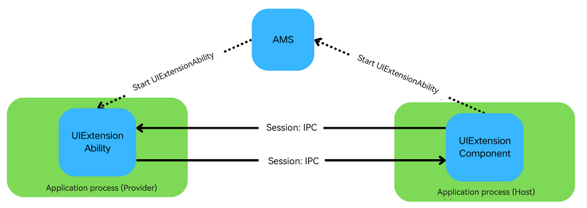

# Cross-Process Application Capability Extension (UIExtension, for System Applications Only)

<!--Kit: ArkUI-->
<!--Subsystem: ArkUI-->
<!--Owner: @dutie123-->
<!--Designer: @dutie123-->
<!--Tester: @fredyuan0912-->
<!--Adviser: @Brilliantry_Rui-->
<!-- md-trans-meta sourceCommit=5ed0cc4164abf79790ec16923fb6361d2a756da9 translatedAt=2026-08-04T06:41:34.742Z pushedAt=2026-08-04T08:55:41.364Z -->

[UIExtension](../reference/apis-arkui/js-apis-arkui-uiExtension.md) allows you to create UI extensions that can be embedded into other app windows, enabling apps to deliver richer and more flexible user experiences.

## Basic Concepts

- [UIExtensionComponent](../reference/apis-arkui/arkui-ts/ts-container-ui-extension-component-sys.md) component

  Defined and used in the host application, this is a component provided by ArkUI. It allows you to use the ArkTS declarative paradigm to define and use components directly within your own application.

- [UIExtensionAbility](../application-models/uiextensionability-sys.md) component

  Defined in the provider application, this component runs in an independent process. It can be instantiated by the host application and embedded into its own window as a UI extension, thereby enhancing inter-application interactivity and user experience.

## Implementation Principles

UIExtension provides a cross-process app component sharing mechanism. A host app (such as a system app) can embed the provider's UI into itself through the UIExtensionComponent component. When this component is initialized, the AMS (Ability Manager Service) in the system schedules and launches an independent process for the provider app to complete UI rendering and interaction.

After implementation, the page of the provider application can be displayed in the host application as a component:

After being started by AMS, the provider application can exchange data with the host application.

- The host application sends messages to the provider application through [UIExtensionProxy.send](../reference/apis-arkui/arkui-ts/ts-container-ui-extension-component-sys.md#send), and the provider can obtain the messages using [UIExtensionContentSession.setReceiveDataCallback](../reference/apis-ability-kit/js-apis-app-ability-uiExtensionContentSession-sys.md#setreceivedatacallback).

- The provider application sends messages to the host application through [UIExtensionContentSession.sendData](../reference/apis-ability-kit/js-apis-app-ability-uiExtensionContentSession-sys.md#senddata), and the host can receive the messages using [UIExtensionProxy.onReceive](../reference/apis-arkui/arkui-ts/ts-container-ui-extension-component-sys.md#onreceive).

## Available Capabilities

### Basic Component Capabilities

- Component-based [UIExtensionComponent](../reference/apis-arkui/arkui-ts/ts-container-ui-extension-component-sys.md): provides an embedded extension capability that allows embedding and invoking page extensions from other apps within an app page.

- Full-screen modal UIExtension: displays a full-screen modal page for interaction and cannot be obscured. System apps expose specific components or Node-APIs based on the internal capabilities of UIExtension, providing specific capabilities for third-party apps to use.

### Available Capabilities of the UIExtensionAbility Process

UIExtension is designed to facilitate the sharing of capabilities across different applications, offering a high degree of flexibility. It operates by launching the provider application's capabilities through a cross-process approach for use by the current (host) application. This mechanism involves service interactions between two separate processes, which is fundamentally different from the interactions between common components and their host applications.

The following outlines the scope of attributes, events, components, and Node-API interfaces available to the provider app within UIExtensionAbility for UIExtension, serving as a reference for both host apps and provider apps when using UIExtension components.

As component capabilities are subject to frequent updates, the current list of unsupported and partially supported features only reflects the status at the time of this document. Whether new capabilities are supported can be determined by referring to the principles of capability support. For capabilities that are currently unsupported, you can submit an issue to request support to the relevant component and UIExtension teams, which will then analyze the feasibility and provide support accordingly.

**Universal Attributes**

Currently, the component can affect other components or host app information (such as the application context [UIContext](../reference/apis-arkui/arkts-apis-uicontext-uicontext.md) and [obtaining application window information](../dfx/hidumper.md#obtaining-application-window-information)) through attributes. However, due to cross-process mechanisms, UIExtension components do not support this by default.

In scenarios where component attributes involve cross-component interactions, the following capabilities are not supported:

- The attributes of the provider component cannot control, assign, or merge with the attributes of other components or host application components. For example, the [component ID](../reference/apis-arkui/arkui-ts/ts-universal-attributes-component-id.md) is not supported.

- The attributes of the provider component cannot control display effects or animations that extend beyond the boundaries of the **UIExtension** component. For example, the [modal transition](../reference/apis-arkui/arkui-ts/ts-universal-attributes-modal-transition.md) is not supported.

The details are as follows.

| Attribute                                                        | Capability Support| Description                                                    | Remarks                                                |
| ------------------------------------------------------------ | -------- | ------------------------------------------------------------ | ------------------------------------------------------------ |
| [Component ID](../reference/apis-arkui/arkui-ts/ts-universal-attributes-component-id.md) | Not supported | The ID is the unique identifier of a component, which is unique within the entire app. This module provides component ID-related APIs for obtaining attributes of a component with a specified ID and sending events to a component with a specified ID. | UIExtensionComponent itself can use the component ID, and the Provider can also set the component ID normally. However, unified ID management is not implemented between the Host Side and the Provider. The Host Side cannot query information about components inside the Provider through the component ID. Therefore, the component ID set inside the Provider is invisible to the Host Side and cannot be used for cross-process queries. |
| [Image effects](../reference/apis-arkui/arkui-ts/ts-universal-attributes-image-effect.md)| Not supported  | Image effects include blur, shadow, spherical effect, and much more.      | —                                                            |
| [restoreId](../reference/apis-arkui/arkui-ts/ts-universal-attributes-restoreId.md) | Not supported  | **restoreId** identifies a component in hopping scenarios. It can be used to restore the component to a specific state on a remote device.| —                                                            |
| [Drag and drop control](../reference/apis-arkui/arkui-ts/ts-universal-attributes-drag-drop.md) | Not supported  | The drag and drop control attributes set whether a component can respond to drag events.                              | —                                                            |
| [Modal transition](../reference/apis-arkui/arkui-ts/ts-universal-attributes-modal-transition.md) | Partially supported| The **bindContentCover** attribute binds a full-screen modal to a component. It provides a **ModalTransition** parameter for you to apply a transition effect for when the component is inserted or deleted.| Within the **UIExtension** component, the pages generated by the provider application cannot exceed the boundaries of the component. To make the page within the **UIExtension** component fill the entire screen, you must explicitly set the component to full-screen mode.|
| [Sheet Transition](../reference/apis-arkui/arkui-ts/ts-universal-attributes-sheet-transition.md)| Partially supported| The **bindSheet** attribute binds a sheet to a component. You can set the sheet to the preset or custom height for when the component is inserted.| Within the **UIExtension** component, the pages generated by the provider application cannot exceed the boundaries of the component. To make the page within the **UIExtension** component fill the entire screen, you must explicitly set the component to full-screen mode.|

**Components**

By default, the provider application cannot interact with the host application's components or process context. Specifically, the following are not supported:

- Effects that exceed a component's boundaries, such as the **Navigation** component displaying into the safe area

- Components that rely on other components or require cross-component or cross-application control and access, for example, **PluginComponent** for accessing other components or **FormComponent** for displaying pages from other applications across processes

- Components that depend on the host application's window information or process **UIContext** instance for capabilities, interactions, or animations, such as the **FolderStack** component

The details are as follows.

| Component                                                        | Capability Support| Description                                                    | Remarks                                                |
| ------------------------------------------------------------ | -------- | ------------------------------------------------------------ | ------------------------------------------------------------ |
| [PluginComponent (System API)](../reference/apis-arkui/arkui-ts/ts-basic-components-plugincomponent-sys.md) | Not supported | Used by the component consumer to request components and data. The consumer sends a component template and data. Supports the SystemUI in integrating UI provided by other services through a plug-in approach. | 1. Similar to the UIExtension capability, this component is prone to nesting, which increases complexity. 2. Since the provider of the UIExtension component operates in a separate process, it cannot access or interact with components within the host component by default. |
| [FormComponent (System API)](../reference/apis-arkui/arkui-ts/ts-basic-components-formcomponent-sys.md)| Not supported  | **FormComponent** is a component used to display widgets.                          | This component facilitates cross-process component calls. However, nesting it within UIExtension can complicate the process relationships, potentially leading to functional and performance issues.|
| [IsolatedComponent (System API)](../reference/apis-arkui/arkui-ts/ts-container-isolated-component-sys.md) | Not supported | IsolatedComponent is used to embed and display UI provided by an independent Abc (.abc file) within the current page. The displayed content runs in a restricted worker thread. | Because the capabilities carried by IsolatedComponent (such as cloud cards) involve cross-app scheduling, nested use in UIExtension cross-process scenarios would complicate the process relationship. It is not currently supported in UIExtension. |
| [FullScreenLaunchComponent](../reference/apis-arkui/arkui-ts/ohos-arkui-advanced-FullScreenLaunchComponent.md) | Not supported  | **FullScreenLaunchComponent** is a component designed for launching atomic services in full screen. If the invoked application (the one being launched) grants the invoker the authorization to run the atomic service in an embedded manner, the invoker can operate the atomic service in full-screen embedded mode. If authorization is not provided, the invoker will launch the atomic service in a pop-up manner.| Due to its cross-application scheduling capability, UIExtension does not support nested launching of this component. |
| [EmbeddedComponent](../reference/apis-arkui/arkui-ts/ts-container-embedded-component.md) | Not supported | EmbeddedComponent is used to embed UI provided by another [EmbeddedUIExtensionAbility](../reference/apis-ability-kit/js-apis-app-ability-embeddedUIExtensionAbility.md) within the same app on the current page. EmbeddedUIExtensionAbility runs in an independent process and handles page layout and rendering. | Because EmbeddedComponent involves launching an independent EmbeddedUIExtensionAbility process across processes, nested use in the existing cross-process UIExtension scenario would complicate the process relationship. Nested launching is not currently supported in UIExtension. |
| [RemoteWindow](../reference/apis-arkui/arkui-ts/ts-basic-components-remotewindow-sys.md) | Not supported  | **RemoteWindow** is a component that enables remote management of application windows, offering the capability to create synchronized animations between the application window and components during application startup and exit.| The components in UIExtension are already in another process and cannot affect or control the host application's window.|
| [RichText](../reference/apis-arkui/arkui-ts/ts-basic-components-richtext.md) | Not supported  | The **RichText** component parses and displays HTML text.                        | —                                                            |
| [FolderStack](../reference/apis-arkui/arkui-ts/ts-container-folderstack.md) | Not supported | FolderStack inherits from [Stack](../reference/apis-arkui/arkui-ts/ts-container-stack.md) (stack layout) and adds foldable screen hover capability. By identifying upperItems, it automatically avoids the foldable screen crease area and moves content to the upper half of the screen. | The foldable screen area division capability requires coordination with the host-side window, which in turn requires obtaining the host's main window information from the provider. This is not currently supported. |
| [XComponent](../reference/apis-arkui/arkui-ts/ts-basic-components-xcomponent.md) | Not supported | Can be used for EGL/OpenGLES and media data writing, with the content displayed on the XComponent. | — |
| [FormLink](../reference/apis-arkui/arkui-ts/ts-container-formlink.md) | Not supported  | The **FormLink** component is provided for interactions between static widgets and widget providers. It supports three types of events: router, message, and call.| This component facilitates cross-process component calls. However, nesting it within UIExtension can complicate the process relationships, potentially leading to functional and performance issues.|
| [HyperLink](../reference/apis-arkui/arkui-ts/ts-container-hyperlink.md) | Not supported  | The **Hyperlink** component implements a link from a location in the component to another location.                    | —                                                            |
| [ContextMenu](../reference/apis-arkui/arkui-ts/ts-methods-menu.md) | Not supported  | The menu bound to a component through [bindContextMenu](../reference/apis-arkui/arkui-ts/ts-universal-attributes-menu.md#bindcontextmenu12) on a page can be closed as needed.| —                                                            |
| [Alert Dialog](../reference/apis-arkui/arkui-ts/ts-methods-alert-dialog-box.md) | Partially supported | Displays an alert dialog component, where you can set text content and response callbacks. If [showInSubWindow](../reference/apis-arkui/arkui-ts/ts-methods-alert-dialog-box.md#alertdialogparam) is set to `true` in UIExtension, the dialog is aligned based on the UIExtension's host window. | Dialog alignment depends on the main window information. The popup component obtains the host app's window information based on the information provided by UIExtension to achieve alignment with the app window. Limited to window alignment only. |
| [Action Sheet](../reference/apis-arkui/arkui-ts/ts-methods-action-sheet.md) | Partially supported | A list-style dialog. If `showInSubWindow` is set to `true` in UIExtension, the dialog is aligned based on the UIExtension's host window. | Dialog alignment depends on the main window information. The popup component obtains the host app's window information based on the information provided by UIExtension to achieve alignment with the app window. Limited to window alignment only. |
| [Custom Dialog](../reference/apis-arkui/arkui-ts/ts-methods-custom-dialog-box.md) | Partially supported | Displays a custom dialog through the [CustomDialogController](../reference/apis-arkui/arkui-ts/ts-methods-custom-dialog-box.md#customdialogcontroller) class. When using a popup component, consider using a custom dialog first for easier customization of the dialog style and content. If `showInSubWindow` is set to `true` in UIExtension, the dialog is aligned based on the UIExtension's host window. | Dialog alignment depends on the main window information. The popup component obtains the host app's window information based on the information provided by UIExtension to achieve alignment with the app window. Limited to window alignment only. |
| [Navigation](../reference/apis-arkui/arkui-ts/ts-basic-components-navigation.md) | Partially supported | Starting from API version 11, this component supports the safe area avoidance feature by default (default value: [expandSafeArea](../reference/apis-arkui/arkui-ts/ts-universal-attributes-expand-safe-area.md#expandsafearea)([SafeAreaType.SYSTEM], [SafeAreaEdge.TOP, SafeAreaEdge.BOTTOM])). You can override this attribute to change the default behavior. | 1. If UIExtension is not set to modal or immersive mode, Navigation cannot expand into the safe area. 2. Cannot route to pages on the host side. |

**Node-API**

The capabilities provided by Node-APIs in the **UIExtension** scenario must account for their potential to extend beyond the current component and interact with the host application's components and process context. Specifically, the following are not supported:

- The API may require information from the host application's context or window, such as **UIContext**.

- The API may control or influence not just the component itself but also other components or aspects of the host application, such as UI appearance.

The details are as follows.

| Module                                                        | Capability Support| Description                                                    | Remarks                                                |
| ------------------------------------------------------------ | -------- | ------------------------------------------------------------ | ------------------------------------------------------------ |
| [Page Transition](../reference/apis-arkui/arkui-ts/ts-page-transition-animation.md) | Not supported  | You can customize the page entrance and exit animations in the **pageTransition** API for transition between pages.| —                                                            |
| [Implicit Shared Element Transition (geometryTransition)](../reference/apis-arkui/arkui-ts/ts-transition-animation-geometrytransition.md)| Not supported  | **geometryTransition** is used to create a smooth, seamless transition between views. By specifying the frame and position of the in and out components through **geometryTransition**, you can create a spatial linkage between the transition effects (such as opacity and scale) defined through the **transition** mechanism. In this way, you can guide the visual focus from the previous view (out component) to the new view (in component).| —                                                            |
| [componentUtils](../reference/apis-arkui/js-apis-arkui-componentUtils.md) | Not supported  | The **componentUtils** module provides API for obtaining the coordinates and size of the drawing area of a component.                      | The information obtained pertains to the window, and by default, it is the information about **WindowProxy** of the UIExtensionAbility, not the main window information of the host application.|
| [UIContext](../reference/apis-arkui/arkts-apis-uicontext-uicontext.md) | Not supported  | **@ohos.window** adds the [getUIContext](../reference/apis-arkui/arkts-apis-window-Window.md#getuicontext10) API in API version 10 for obtaining the **UIContext** object of a UI instance. The API provided by the **UIContext** object can be directly applied to the corresponding UI instance.| In the default **UIExtension** configuration, the provider lacks an actual window, and therefore it is not possible to obtain the correct **UIContext** through this API.|
| [DragController](../reference/apis-arkui/js-apis-arkui-dragController.md) | Not supported | The **dragController** module provides APIs for initiating drag actions. When receiving a gesture event, such as a touch or long-press event, an application can initiate a drag action and carry drag information therein. The functionality of this module depends on UI context. This means that the APIs of this module cannot be used in places where the [UI context is ambiguous](./arkts-global-interface.md). For details, see **UIContext**. | Drag event transmission between components relies on **UIContext** instances. Since the host and provider applications do not share the **UIContext** content, drag event transmission is not supported by default. |
| [@ohos.arkui.inspector (Layout Callback)](../reference/apis-arkui/js-apis-arkui-inspector.md) | Partially supported| The **Inspector** module provides APIs for registering the component layout and drawing completion callbacks.                  | If a UIExtension component is specified, all the component information in the UIExtension is expected to be obtained. This capability is not supported yet. The provider can use this capability internally.|
| [@ohos.arkui.performanceMonitor (Performance Monitoring)](../reference/apis-arkui/js-apis-arkui-performancemonitor-sys.md) | Not supported  | The **performanceMonitor** module provides APIs for performance monitoring indicators: response delay, completion delay, and frame loss rate.| —                                                            |
| [@ohos.font (Custom Font Registration)](../reference/apis-arkui/js-apis-font.md)    | Not supported  | The **font** module provides APIs for registering custom fonts.                                  | The registered fonts have a restricted scope, and the provider is unable to influence the font settings within the host application.|
| [PluginComponentManager](../reference/apis-arkui/js-apis-plugincomponent.md) | Not supported  | The **PluginComponentManager** module provides APIs for the **PluginComponent** user to request components and data and send component templates and data.| The provider component, residing in a separate process, is unable to access data from other components. As such, the capability to interact with the host component is not supported.|
| [User Interface Appearance](../reference/apis-arkui/js-apis-uiappearance-sys.md) (System API) | Not supported | The **uiAppearance** module provides basic capabilities for managing the system appearance, currently including only the dark and light mode configuration. | The provider cannot affect the consumer through this capability. |

## Constraints

**Security Capability Constraints**

The **UIExtensionComponent** (on the host side) can access applications that have integrated the UIExtensionAbility (on the provider side), offering a universal capability for application sharing. As UIExtension capabilities do not independently include a security mechanism, the provider application must utilize other ArkUI capabilities to protect against potential attacks from the host application, including scenarios with **CreateModalUIExtension**.

Considering the extensive capabilities of UIExtension (including those derived from UIExtension, such as those for **CreateModalUIExtension** in the system), if there are security concerns within the provider application that cannot be resolved within UIExtension, alternative approaches should be considered. Using UIExtension without proper security measures poses potential risks to both the provider and host applications.

**Usage modes:**

- **CreateModalUIExtension** (full-screen modal mode): **CreateModalUIExtension** is an inner class interface used exclusively by system applications to launch cross-process UIs through the development of Node-APIs or components. In this mode, a modal that overlays the application is created, preventing any components or windows from the host application from obscuring the UIExtension, and resizing of the component is not permitted.

- UIExtensionComponent component mode: available only to system apps and can be used in apps through the ArkTS declarative development paradigm. It is integrated into apps as a component, achieving interaction effects similar to those of other components.

In component mode, to avoid being obscured by the host application's subwindows:

- The provider application can determine, based on its service needs, whether to allow the host application to obscure the UI.

- A recommended measure to prevent obscuration is the use of the [hideNonSecureWindows](../reference/apis-arkui/js-apis-uiExtensionHost-sys.md#hidenonsecurewindows) API.

- This approach has a drawback: Once applied, it restricts the host application's interaction capabilities, as it can no longer create subwindows that could cover the provider application's window.

**Lock screen display control policy**:

Aligned with the `UIAbility` specifications, the app being launched by `UIExtension` must have the lock screen display permission to successfully display on the lock screen. (This control applies only when the device is in an unlocked state, such as when the device owner has set up lock screen password, fingerprint, face recognition, or other security authentication, and the screen lights up after the user actively locks the screen.)

Only the UIAbility components of system applications can be launched on the lock screen. For UIExtension components, the required lock screen display permission is described as follows.

| Attribute    | Value                                                 |
| -------- | --------------------------------------------------- |
| Permission  | `ohos.permission.CALLED_UIEXTENSION_ON_LOCK_SCREEN` |
| APL | `SYSTEM_CORE`                                       |
| Grant mode| `SYSTEM_GRANT`                                      |
| Availability| `SYSTEM_APPLICATION`                                |

**Nesting Constraints**

Due to the capability characteristics of UIExtension, a nested capability dependency such as App A (UIAbility) -> App B (UIExtensionAbility) -> App C (UIExtensionAbility) can be implemented. However, because of cross-process relationships, excessive nesting levels can cause a sharp decline in app interaction performance. Therefore, the following constraints are imposed:

- No more than three levels of nesting: Excessive nesting levels can lead to frequent cross-process interactions, degrading response performance and resulting in a poor user experience.

- Circular nesting is not allowed: Circular nesting refers to App A (UIAbility) -> App B (UIExtensionAbility) -> App C (UIExtensionAbility) -> App B (UIExtensionAbility). Since app processing involves synchronous scenarios, in such scenarios, App B becomes unresponsive, ultimately leading to a deadlock.

**Event Processing Mechanism Constraints**

Events are handled synchronously or asynchronously based on their use case:

- Interactions between the host process and the provider process are handled asynchronously by default: This avoids performance issues and deadlocks, which could affect the overall interaction experience.

- Synchronous event handling principles: Synchronous events are supported where they have a low trigger frequency and minimal performance impact; they should meet the actual use scenarios.

When using the UIExtension capabilities, comply with the following design constraints:

- Synchronous event handling scenarios: Performance issues due to deep nesting or functional issues due to circular nesting cannot be resolved by the UIExtension component mechanism. You need to analyze and resolve these issues based on their service scenarios, such as reducing nesting levels or using non-UIExtension component solutions.

- Asynchronous event handling scenarios: Both the UIExtension component and the host application's components may receive events simultaneously. You need to manage this based on the use scenario. For example, you can configure the host application components not to handle the events. If this is not feasible, you are advised to replace the UIExtension component to ensure a seamless interaction experience.

| Scenario    | Category                      | Supported or Not| Synchronous/Asynchronous (Host and Provider)| Remarks                                                        |
| -------- | -------------------------- | -------- | ------------------------- | ------------------------------------------------------------ |
| Universal event| [Click event](../reference/apis-arkui/arkui-ts/ts-universal-events-click.md) (Click)         | Supported    | Asynchronous                     | —                                                            |
| Universal event| [Touch event](../reference/apis-arkui/arkui-ts/ts-universal-events-touch.md) (Touch)         | Supported    | Asynchronous                     | —                                                            |
| Universal event| [Drag event](../reference/apis-arkui/arkui-ts/ts-universal-events-drag-drop.md) (onDragXXX)     | Supported    | Asynchronous                     | —                                                            |
| Universal event| [Key event](../reference/apis-arkui/arkui-ts/ts-universal-events-key.md) (KeyEvent)      | Supported    | Synchronous                     | Circular nesting or excessive nesting can cause unresponsiveness in applications. To address this issue, a default timeout mechanism is provided for managing waiting periods. If the timeout threshold is exceeded, the waiting is automatically aborted. From the perspective of the upper layer, this is treated as if the event was not processed at all.|
| Universal event| [Focus event](../reference/apis-arkui/arkui-ts/ts-universal-focus-event.md) (onFocus/onBlur)| Supported    | Synchronous                     | Circular nesting or excessive nesting can cause unresponsiveness in applications. To address this issue, a default timeout mechanism is provided for managing waiting periods. If the timeout threshold is exceeded, the waiting is automatically aborted. From the perspective of the upper layer, this is treated as if the event was not processed at all.|
| Universal Events | [Mouse Events](../reference/apis-arkui/arkui-ts/ts-universal-mouse-key.md) (onHover/onMouse) | Supported | Asynchronous | — |
| Gesture handling| —                          | Supported    | Asynchronous                     | —                                                            |
| Accessibility  | —                          | Supported    | Synchronous                     | Circular nesting or excessive nesting can cause unresponsiveness in applications. To address this issue, a default timeout mechanism is provided for managing waiting periods. If the timeout threshold is exceeded, the waiting is automatically aborted. From the perspective of the upper layer, this is treated as if the event was not processed at all.|

**Page Rendering Experience Constraints**

As UIExtension involves cross-process application calls, the processing between the host application process and the provider application process cannot be synchronized, leading to different experience issues compared to regular components. Be aware of the performance constraints of rendering pages across multiple processes with this component and take targeted measures.

- **Flickering white screen**: Initiating a new process through UIExtension to deliver functionality involves a sequence of steps – creation, launch, and page rendering – that require time to complete. During this period, users may notice a brief display of the **UIExtensionComponent**'s default white background, resulting in a flickering white screen.

- **Desynchronization between rendering and display**: When the host app page changes rapidly (such as during screen rotation or window resizing), there can be a desynchronization between the rendering of the host app page and the content displayed within the UIExtension component. This issue arises from cross-process interactions; while the provider app's process tasks are triggered by the host app, layout tasks are handled in the respective process's JS thread. There is no guarantee of synchronization between the host app's and provider app's rendering tasks, resulting in desynchronization.

When developing the provider application, consider the following design constraints:

- Use scenarios with minimal layout changes.

- When layout changes occur, the provider app's JS thread should execute as few tasks as possible to ensure that the JS thread can respond to layout change tasks promptly.

You can mitigate the flickering white screen issue with the provider application in the following ways:

- Adjust the background color of the UIExtensionComponent (for instructions, see [Background](../reference/apis-arkui/arkui-ts/ts-universal-attributes-background.md)) to match the background color of the host application's and provider application's pages, to deliver a seamless transition and prevent noticeable changes during the loading process.

- Utilize the [placeholder](../reference/apis-arkui/arkui-ts/ts-container-ui-extension-component-sys.md#uiextensionoptions11) mechanism provided by this component to configure a custom UI, which will be displayed before the provider application page is fully displayed.

If the mitigation does not fully meet the application's interaction requirements due to the constraints of cross-process capabilities, it is recommended that you consider alternative solutions.

<!--no_check-->