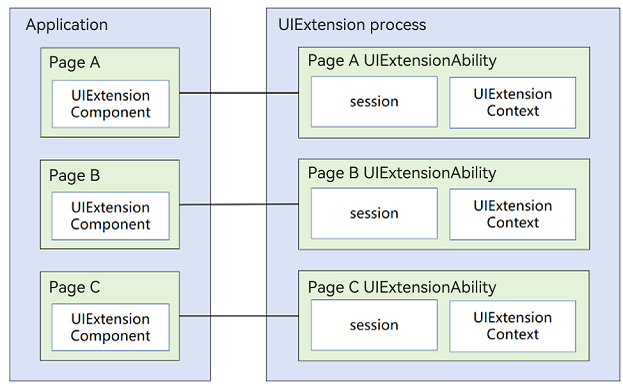
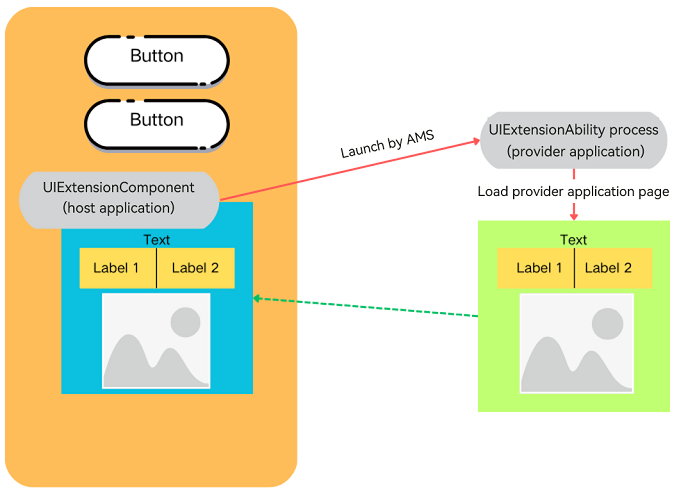
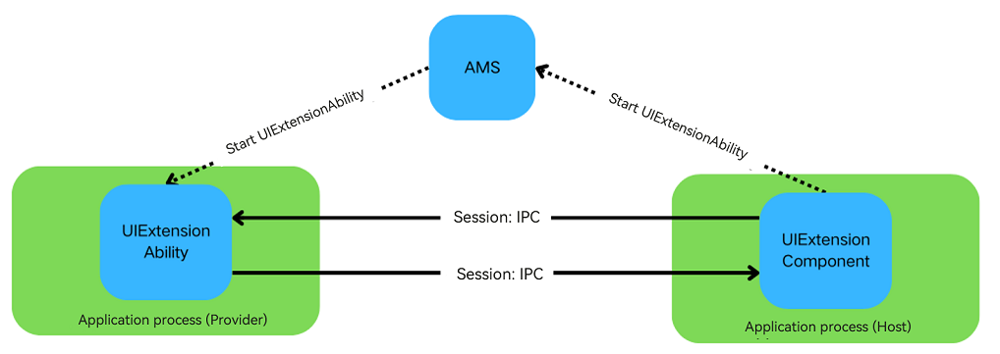

# Cross-Process Application Capability Extension (UIExtension, for System Applications Only)

**UIExtension** allows you to embed UI extensions from one application into another, providing a seamless experience as users interact with different application functionalities within a single application UI.

## Basic Concepts

- [UIExtensionComponent](../reference/apis-arkui/arkui-ts/ts-container-ui-extension-component-sys.md) component

	Defined and used in the host application, **UIExtensionComponent** is provided by ArkUI for use in the application following the ArkTS declarative paradigm.

- [UIExtensionAbility](../application-models/uiextensionability.md) component

  Defined and used in the provider application, **UIExtensionAbility** allows the provider to run in a separate process and creates UI extensions that can be embedded in the host application's window.

## Working Principle

UIExtension offers a capability for cross-process application sharing. It is embedded into the host application (system application) process in the form of a component using the **UIExtensionComponent**. When the host application starts, it triggers the Application Management Service (AMS) to start the provider application process. AMS is mainly responsible for the management tasks of application startup, exit, and switching.

After implementation, the page of the provider application can be displayed in the host application as a component:

After being started by AMS, the provider application can exchange data with the host application.

- The host application sends messages to the provider application through [UIExtensionProxy.send](../reference/apis-arkui/arkui-ts/ts-container-ui-extension-component-sys.md#send), and the provider can obtain the messages using [UIExtensionContentSession.setReceiveDataCallback](../reference/apis-ability-kit/js-apis-app-ability-uiExtensionContentSession-sys.md#uiextensioncontentsessionsetreceivedatacallback).
- The provider application sends messages to the host application through [UIExtensionContentSession.sendData](../reference/apis-ability-kit/js-apis-app-ability-uiExtensionContentSession-sys.md#uiextensioncontentsessionsenddata), and the host can receive the messages using [UIExtensionProxy.onReceive](../reference/apis-arkui/arkui-ts/ts-container-ui-extension-component-sys.md#onreceive).

## Available Capabilities

### Basic Component Capabilities

- Component-based [UIExtensionComponent](../reference/apis-arkui/arkui-ts/ts-container-ui-extension-component-sys.md): provides an embedded extension capability that allows the embedding and invocation of page extensions from other applications within the application page.
- Full-screen UIExtension: presents content in a full-screen modal for immersive interaction, without being obscured by other elements. System applications can expose specific components or Node-APIs based on the underlying capabilities of UIExtension, enabling third-party applications to utilize these for creating full-screen modal experiences.

### Available Capabilities of the UIExtensionAbility Process

UIExtension is designed to facilitate the sharing of capabilities across different applications, offering a high degree of flexibility. It operates by launching the provider application's capabilities through a cross-process approach for use by the current (host) application. This mechanism involves service interactions between two separate processes, which is fundamentally different from the interactions between common components and their host applications.

Below is a detailed list of the attributes, events, components, Node-API interfaces, and other features that the provider application can utilize within **UIExtensionAbility**.

As component capabilities are subject to frequent updates, the current list of unsupported and partially supported features only reflects the status at the time of this document. Whether new capabilities are supported can be determined by referring to the principles of capability support. For capabilities that are currently unsupported, you can submit an issue to request support to the relevant component and UIExtension teams, which will then analyze the feasibility and provide support accordingly.

**Universal Attributes**

Due to the complexities of the cross-process communication mechanism, the **UIExtension** component is not able to influence other components or the host application's information, such as the application context **UIContext** and application window information.

In scenarios where component attributes involve cross-component interactions, the following capabilities are not supported:

- The attributes of the provider component cannot control, assign, or merge with the attributes of other components or host application components. For example, the [component ID](../reference/apis-arkui/arkui-ts/ts-universal-attributes-component-id.md) is not supported.
- The attributes of the provider component cannot control display effects or animations that extend beyond the boundaries of the **UIExtension** component. For example, the [modal transition](../reference/apis-arkui/arkui-ts/ts-universal-attributes-modal-transition.md) is not supported.

The details are as follows.

| Attribute                                                    | Capability Support  | Description                                                  | Remarks                                                      |
| ------------------------------------------------------------ | ------------------- | ------------------------------------------------------------ | ------------------------------------------------------------ |
| [Component ID](../reference/apis-arkui/arkui-ts/ts-universal-attributes-component-id.md) | Not supported       | **id** identifies a component uniquely within an application. This module provides APIs for obtaining the attributes of or sending events to the component with the specified ID. | The **UIExtensionComponent** itself can use the component ID, and the provider can also set the component ID. However, there is no unified ID management system between the host application and the provider application. As a result, the host application cannot query information about components within the provider application using the component ID. Consequently, setting the component ID within the provider application is ineffective in terms of cross-process interaction. |
| [Background blur](../reference/apis-arkui/arkui-ts/ts-universal-attributes-image-effect.md) | Not supported       | Image effects include blur, shadow, spherical effect, and much more. | —                                                            |
| [restoreId](../reference/apis-arkui/arkui-ts/ts-universal-attributes-restoreId.md) | Not supported       | **restoreId** identifies a component in hopping scenarios. It can be used to restore the component to a specific state on a remote device. | —                                                            |
| [Drag and drop control](../reference/apis-arkui/arkui-ts/ts-universal-attributes-drag-drop.md) | Not supported       | The drag and drop control attributes set whether a component can respond to drag events. | —                                                            |
| [Modal transition](../reference/apis-arkui/arkui-ts/ts-universal-attributes-modal-transition.md) | Partially supported | The **bindContentCover** attribute binds a full-screen modal to a component. It provides a **ModalTransition** parameter for you to apply a transition effect for when the component is inserted or deleted. | Within the **UIExtension** component, the pages generated by the provider application cannot exceed the boundaries of the component. To make the page within the **UIExtension** component fill the entire screen, you must explicitly set the component to full-screen mode. |
| [Sheet transition](../reference/apis-arkui/arkui-ts/ts-universal-attributes-sheet-transition.md) | Partially supported | The **bindSheet** attribute binds a sheet to a component. You can set the sheet to the preset or custom height for when the component is inserted. | Within the **UIExtension** component, the pages generated by the provider application cannot exceed the boundaries of the component. To make the page within the **UIExtension** component fill the entire screen, you must explicitly set the component to full-screen mode. |
|                                                              |                     |                                                              |                                                              |

**Components**

By default, the provider application cannot interact with the host application's components or process context. Specifically, the following are not supported:

- Effects that exceed a component's boundaries, such as the **Navigation** component displaying into the safe area
- Components that rely on other components or require cross-component or cross-application control and access, for example, **PluginComponent** for accessing other components or **FormComponent** for displaying pages from other applications across processes
- Components that depend on the host application's window information or process **UIContext** instance for capabilities, interactions, or animations, such as the **FolderStack** component

The details are as follows.

| Component                                                    | Capability Support  | Description                                                  | Remarks                                                      |
| ------------------------------------------------------------ | ------------------- | ------------------------------------------------------------ | ------------------------------------------------------------ |
| [PluginComponent (System API)](../reference/apis-arkui/arkui-ts/ts-basic-components-plugincomponent-sys.md) | Not supported       | **PluginComponent** enables users of the component to request both the component and the data it needs. The users send a component template and the corresponding data. It supports the SystemUI in integrating UI elements provided by various services through a plug-in-based approach. | 1. This component shares similarities with **UIExtension** and can be nested within other components. This nesting introduces additional complexity. 2. Since the provider of the **UIExtension** component operates in a separate process, it cannot access or interact with components within the host application by default. |
| [FormComponent (System API)](../reference/apis-arkui/arkui-ts/ts-basic-components-formcomponent-sys.md) | Not supported       | **FormComponent** is a component used to display widgets.    | This component facilitates cross-process component calls. However, nesting it within UIExtension can complicate the process relationships, potentially leading to functional and performance issues. |
| [IsolatedComponent (System API)](../reference/apis-arkui/arkui-ts/ts-container-isolated-component-sys.md) | Not supported       | **IsolatedComponent** is designed to support the embedding and display of UIs provided by independent .abc files within the current page, with the displayed content running in a restricted worker thread. | Due to its cross-application scheduling capability, UIExtension does not support nested launching of this component. |
| [FullScreenLaunchComponent](../reference/apis-arkui/arkui-ts/ohos-arkui-advanced-FullScreenLaunchComponent.md) | Not supported       | **FullScreenLaunchComponent** is a component designed for launching atomic services in full screen. If the invoked application (the one being launched) grants the invoker the authorization to run the atomic service in an embedded manner, the invoker can operate the atomic service in full-screen embedded mode. If authorization is not provided, the invoker will launch the atomic service in a pop-up manner. | Due to its cross-application scheduling capability, UIExtension does not support nested launching of this component. |
| [EmbeddedComponent](../reference/apis-arkui/arkui-ts/ts-container-embedded-component.md) | Not supported       | The **EmbeddedComponent** is a component used to embed into the current page the UI provided by another [EmbeddedUIExtensionAbility](../reference/apis-ability-kit/js-apis-app-ability-embeddedUIExtensionAbility.md) in the same application. The EmbeddedUIExtensionAbility runs in an independent process for UI layout and rendering. | Due to its cross-application scheduling capability, UIExtension does not support nested launching of this component. |
| [RemoteWindow](../reference/apis-arkui/arkui-ts/ts-basic-components-remotewindow-sys.md) | Not supported       | **RemoteWindow** is a component that enables remote control of application windows, offering the capability to create synchronized animations between the application window and components during application startup and exit. | The components in UIExtension are already in another process and cannot affect or control the host application's window. |
| [RichText](../reference/apis-arkui/arkui-ts/ts-basic-components-richtext.md) | Not supported       | The **RichText** component parses and displays HTML text.    | —                                                            |
| [FolderStack](../reference/apis-arkui/arkui-ts/ts-container-folderstack.md) | Not supported       | The **FolderStack** component extends the **Stack** component by adding the hover feature for foldable devices. With the **upperItems** parameter set, it can automatically avoid the crease area of the foldable device and move the content to the upper half screen. The **FolderStack** component is usually used in modular development scenarios where .abc file hot update is required. | The component's capabilities require linkage with the host application's window, necessitating access to the host application's main window information within the provider. Therefore, this component is not supported at present. |
| [XComponent](../reference/apis-arkui/arkui-ts/ts-basic-components-xcomponent.md) | Not supported       | The **XComponent** can accept and display the EGL/OpenGL ES and media data input. | —                                                            |
| [FormLink](../reference/apis-arkui/arkui-ts/ts-container-formlink.md) | Not supported       | The **FormLink** component is provided for interactions between static widgets and widget providers. It supports three types of events: router, message, and call. | This component facilitates cross-process component calls. However, nesting it within UIExtension can complicate the process relationships, potentially leading to functional and performance issues. |
| [HyperLink](../reference/apis-arkui/arkui-ts/ts-container-hyperlink.md) | Not supported       | The **Hyperlink** component implements a link from a location in the component to another location. | —                                                            |
| [ContextMenu](../reference/apis-arkui/arkui-ts/ts-methods-menu.md) | Not supported       | The menu bound to a component through [bindContextMenu](../reference/apis-arkui/arkui-ts/ts-universal-attributes-menu.md) on a page can be closed as needed. | —                                                            |
| [Alert Dialog Box (AlertDialog)](../reference/apis-arkui/arkui-ts/ts-methods-alert-dialog-box.md) | Partially supported | You can set the text content and response callback for an alert dialog box. If **showInSubWindow** is set to **true** in **UIExtension**, the dialog box is aligned with the host window based on **UIExtension**. | The dialog box achieves alignment with the host application's window by utilizing data obtained from **UIExtension** regarding the application's window. Yet, only window alignment is supported. |
| [Action Sheet (ActionSheet)](../reference/apis-arkui/arkui-ts/ts-methods-action-sheet.md) | Partially supported | An action sheet is a dialog box that displays actions a user can take. If **showInSubWindow** is set to **true** in **UIExtension**, the dialog box is aligned with the host window based on **UIExtension**. | The dialog box achieves alignment with the host application's window by utilizing data obtained from **UIExtension** regarding the application's window. Yet, only window alignment is supported. |
| [Custom Dialog Box](../reference/apis-arkui/arkui-ts/ts-methods-custom-dialog-box.md) | Partially supported | A custom dialog box is a dialog box you customize by using APIs of the **CustomDialogController** class. You can set the style and content to your preference for a custom dialog box. If **showInSubWindow** is set to **true** in **UIExtension**, the dialog box is aligned with the host window based on **UIExtension**. | The dialog box achieves alignment with the host application's window by utilizing data obtained from **UIExtension** regarding the application's window. Yet, only window alignment is supported. |
| [Navigation](../reference/apis-arkui/arkui-ts/ts-basic-components-navigation.md) | Partially supported | Since API version 11, this component supports the safe area attribute by default, with the default attribute value being **expandSafeArea([SafeAreaType.SYSTEM], [SafeAreaEdge.TOP, SafeAreaEdge.BOTTOM])**. You can override this attribute to change the default behavior. | 1. If **UIExtension** does not have modal or immersive settings configured, **Navigation** cannot extend into the safe area. 2. Routing to pages within the host application is not supported. |

**Node-API**

The capabilities provided by Node-APIs in the **UIExtension** scenario must account for their potential to extend beyond the current component and interact with the host application's components and process context. Key considerations include:

- The API may require information from the host application's context or window, such as **UIContext**.
- The API may control or influence not just the component itself but also other components or aspects of the host application, such as UI appearance.

The details are as follows.

| Module                                                       | Capability Support  | Description                                                  | Remarks                                                      |
| ------------------------------------------------------------ | ------------------- | ------------------------------------------------------------ | ------------------------------------------------------------ |
| [Page Transition](../reference/apis-arkui/arkui-ts/ts-page-transition-animation.md) | Not supported       | You can customize the page entrance and exit animations in the **pageTransition** API for transition between pages. | —                                                            |
| [Implicit Shared Element Transition (geometryTransition)](../reference/apis-arkui/arkui-ts/ts-transition-animation-geometrytransition.md) | Not supported       | **GeometryTransition** is used to create a smooth, seamless transition between views. By specifying the frame and position of the in and out components through **GeometryTransition**, you can create a spatial linkage between the transition effects (such as opacity and scale) defined through the **transition** mechanism. In this way, you can guide the visual focus from the previous view (out component) to the new view (in component). | —                                                            |
| [componentUtils](../reference/apis-arkui/js-apis-arkui-componentUtils.md) | Not supported       | The **componentUtils** module provides API for obtaining the coordinates and size of the drawing area of a component. | The information obtained pertains to the window, and by default, it is the information about **WindowProxy** of the UIExtensionAbility, not the main window information of the host application. |
| [UIContext](../reference/apis-arkui/js-apis-arkui-UIContext.md) | Not supported       | **@ohos.window** adds the [getUIContext](../reference/apis-arkui/js-apis-window.md#getuicontext10) API in API version 10 for obtaining the **UIContext** object of a UI instance. The API provided by the **UIContext** object can be directly applied to the corresponding UI instance. | In the default **UIExtension** configuration, the provider lacks an actual window, and therefore it is not possible to obtain the correct **UIContext** through this API. |
| [DragController](../reference/apis-arkui/js-apis-arkui-dragController.md) | Not supported       | The **dragController** module provides APIs for initiating drag actions. When receiving a gesture event, such as a touch or long-press event, an application can initiate a drag action and carry drag information therein. The functionality of this module depends on UI context. This means that the APIs of this module cannot be used where the UI context is unclear. For details, see **UIContext**. | Drag event transmission between components relies on **UIContext** instances. Since the host and provider applications do not share the **UIContext** content, drag event transmission is not supported by default. |
| [@ohos.arkui.inspector (Layout Callback)](../reference/apis-arkui/js-apis-arkui-inspector.md) | Partially supported | The **Inspector** module provides APIs for registering the component layout and drawing completion callbacks. | If a UIExtension component is specified, all the component information in the UIExtension is expected to be obtained. This capability is not supported yet. The provider can use this capability internally. |
| [@ohos.arkui.performanceMonitor (Performance Monitor)](../reference/apis-arkui/js-apis-arkui-performancemonitor-sys.md) | Not supported       | The **performanceMonitor** module provides APIs for performance monitoring indicators: response delay, completion delay, and frame loss rate. Not supported | —                                                            |
| [@ohos.font (Custom Font Registration)](../reference/apis-arkui/js-apis-font.md) | Not supported       | The **font** module provides APIs for registering custom fonts. | The registered fonts have a restricted scope, and the provider is unable to influence the font settings within the host application. |
| [PluginComponentManager](../reference/apis-arkui/js-apis-plugincomponent.md) | Not supported       | The **PluginComponentManager** module provides APIs for the **PluginComponent** user to request components and data and send component templates and data. | The provider component, residing in a separate process, is unable to access data from other components. As such, the capability to interact with the host application's components is not supported. |
| [@ohos.uiAppearance (UI Appearance) (System API)](../reference/apis-arkui/js-apis-uiappearance-sys.md) | Not supported       | The **uiAppearance** module provides basic capabilities for managing the system appearance. It allows for color mode configuration currently, and will introduce more features over time. | The provider application cannot influence the host application through this capability. |

## Constraints

**Security Capability Constraints**

The **UIExtensionComponent** (on the host side) can access applications that have integrated the UIExtensionAbility (on the provider side), offering a universal capability for application sharing. As UIExtension capabilities do not independently offer a security mechanism, the provider application must utilize other ArkUI capabilities to protect against potential attacks from the host application, including scenarios with **CreateModalUIExtension**.

Given the flexibility of UIExtension capabilities (including those derived from UIExtension, such as those for **CreateModalUIExtension** in the system), if the provider application has security concerns that cannot be addressed within the current UIExtension context, you are advised to use alternative solutions. Continuing with UIExtension entails security risks for both provider and host applications.

**Usage modes:**

- **CreateModalUIExtension** (full-screen modal mode): **CreateModalUIExtension** is an inner class interface used exclusively by system applications to launch cross-process UIs through the development of Node-APIs or components. In this mode, a modal that overlays the application is created, preventing any components or windows from the host application from obscuring the UIExtension, and resizing of the component is not permitted.

- **UIExtensionComponent** (component mode): This mode is exclusively for system applications and can be used within applications through the ArkTS declarative paradigm. Integrated as a component, **UIExtensionComponent** allows for interaction effects similar to those of other components within the application.

In component mode, to avoid being obscured by the host application's subwindows:

- The provider application can determine, based on its service needs, whether to allow the host application to obscure the UI.

- A recommended measure to prevent obscuration is the use of the [hideNonSecureWindows](../reference/apis-arkui/js-apis-uiExtensionHost-sys.md#hidenonsecurewindows) API.

- This approach has a drawback: Once applied, it restricts the host application's interaction capabilities, as it can no longer create subwindows that could cover the provider application's window.

**Nesting Constraints**

UIExtension capabilities allow for a nested dependency chain as the following: application A (UIAbility) -> application B (UIExtensionAbility) -> application C (UIExtensionAbility). However, because of the cross-process nature, too many nesting levels can lead to a sharp decline in application interaction performance. Therefore, the following constraints are imposed:

- No more than three levels of nesting: Excessive nesting levels can lead to frequent cross-process interactions, degrading response performance and resulting in a poor user experience.
- No circular nesting allowed: Circular nesting, such as application A (UIAbility) -> application B (UIExtensionAbility) -> application C (UIExtensionAbility) -> back to application B (UIExtensionAbility), can cause application B to become unresponsive in synchronous processing scenarios, leading to potential deadlocks.

**Event Processing Mechanism Constraints**

Events are handled synchronously or asynchronously based on their use case:

- Interactions between the host process and the provider process are handled asynchronously by default: This avoids performance issues and deadlocks, which could affect the overall interaction experience.
- Synchronous event handling principles: Synchronous events are supported where they have a low trigger frequency and minimal performance impact; they should meet the actual use scenarios.

When using the UIExtension capabilities, comply with the following design constraints:

- Synchronous event handling scenarios: Performance issues due to deep nesting or functional issues due to circular nesting cannot be resolved by the UIExtension component mechanism. You need to analyze and resolve these issues based on their service scenarios, such as reducing nesting levels or using non-UIExtension component solutions.
- Asynchronous event handling scenarios: Both the UIExtension component and the host application's components may receive events simultaneously. You need to manage this based on the use scenario. For example, you can configure the host application components not to handle the events. If this is not feasible, you are advised to replace the UIExtension component to ensure a seamless interaction experience.

| Scenario         | Category                             | Supported or Not | Synchronous/Asynchronous (Host and Provider) | Remarks                                                      |
| ---------------- | ------------------------------------ | ---------------- | -------------------------------------------- | ------------------------------------------------------------ |
| Universal event  | Click event (**Click**)              | Supported        | Asynchronous                                 | —                                                            |
| Universal event  | Touch event (**Touch**)              | Supported        | Asynchronous                                 | —                                                            |
| Universal event  | Drag event (**onDrag*XXX***)         | Supported        | Asynchronous                                 | —                                                            |
| Universal event  | Key event (**KeyEvent**)             | Supported        | Synchronous                                  | Circular nesting or excessive nesting can cause unresponsiveness in applications. To address this issue, a default fallback mechanism is provided, which includes a timeout waiting mechanism. Once the timeout is reached, the wait is terminated, and for the upper layer, it is as if the event was not processed. |
| Universal event  | Focus event (**onFocus**/**onBlur**) | Supported        | Synchronous                                  | Circular nesting or excessive nesting can cause unresponsiveness in applications. To address this issue, a default fallback mechanism is provided, which includes a timeout waiting mechanism. Once the timeout is reached, the wait is terminated, and for the upper layer, it is as if the event was not processed. |
| Universal event  | Mouse event (**onHove**/**onMouse**) | Supported        | Asynchronous                                 | —                                                            |
| Gesture handling | —                                    | Supported        | Asynchronous                                 | —                                                            |
| Accessibility    | —                                    | Supported        | Synchronous                                  | Circular nesting or excessive nesting can cause unresponsiveness in applications. To address this issue, a default fallback mechanism is provided, which includes a timeout waiting mechanism. Once the timeout is reached, the wait is terminated, and for the upper layer, it is as if the event was not processed. |

**Page Rendering Experience Constraints**

As UIExtension involves cross-process application calls, the processing between the host application process and the provider application process cannot be synchronized, leading to different experience issues compared to regular components. Be aware of the performance constraints of rendering pages across multiple processes with this component and take targeted measures.

- **Flickering white screen**: Initiating a new process through UIExtension to deliver functionality involves a sequence of steps – creation, launch, and page rendering – that require time to complete. During this period, users may notice a brief display of the **UIExtensionComponent**'s default white background, resulting in a flickering white screen.
- **Desynchronization between rendering and display**: When the host application page changes rapidly (such as during screen rotation or window resizing), there can be a desynchronization between the rendering of the host application page and the content displayed within the **UIExtension** component. This issue arises from cross-process interactions; while the provider application's process tasks are triggered by the host application, layout tasks are handled in the respective process's JavaScript thread. There is no guarantee of synchronization between the host application's and provider application's rendering tasks, resulting in desynchronization.

When developing the provider application, consider the following design constraints:

- Use scenarios with minimal layout changes.
- When layout changes occur, the provider application's JavaScript thread should execute as few tasks as possible to ensure that it can respond to layout change tasks promptly.

You can mitigate the flickering white screen issue with the provider application in the following ways:

- Adjust the background color of the UIExtensionComponent (for instructions, see [Background](../reference/apis-arkui/arkui-ts/ts-universal-attributes-background.md)) to match the background color of the host application's and provider application's pages, to deliver a seamless transition and prevent noticeable changes during the loading process.
- Utilize the [placeholder](../reference/apis-arkui/arkui-ts/ts-container-ui-extension-component-sys.md#uiextensionoptions11) mechanism provided by this component to configure a custom UI, which will be displayed before the provider application page is fully displayed.

If the mitigation does not fully meet the application's interaction requirements due to the constraints of cross-process capabilities, it is recommended that you consider alternative solutions.