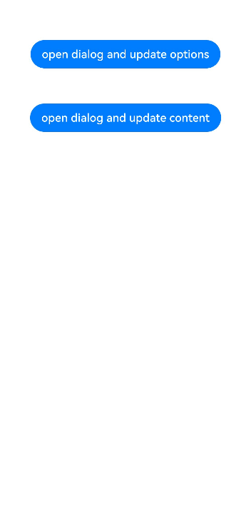

# Global Custom Dialog Box Independent of UI Components (openCustomDialog)

<!--Kit: ArkUI-->
<!--Subsystem: ArkUI-->
<!--Owner: @houguobiao-->
<!--Designer: @houguobiao-->
<!--Tester: @lxl007-->
<!--Adviser: @Brilliantry_Rui-->
<!-- md-trans-meta sourceCommit=233780541406c33f29af8bce3784afa16dc6ae50 translatedAt=2026-08-04T06:40:27.479Z pushedAt=2026-08-04T08:40:15.902Z -->

In scenarios such as advertising, prize notifications, warnings, and software updates that require interactive user responses, you can use the [openCustomDialog](../reference/apis-arkui/arkts-apis-uicontext-promptaction.md#opencustomdialog12) interface provided by the **PromptAction** object obtained from **UIContext** to create a custom dialog box. Compared with [CustomDialogController](../reference/apis-arkui/arkui-ts/ts-methods-custom-dialog-box.md#customdialogcontroller), this approach offers the advantages of page decoupling and support for dynamic refresh via [update](../reference/apis-arkui/js-apis-arkui-ComponentContent.md#update).

> **NOTE**
> 
> There are two ways to create a custom dialog using **openCustomDialog**:
> - **openCustomDialog** with **ComponentContent**: By encapsulating content using **ComponentContent**, the dialog box can be decoupled from the UI, offering greater flexibility and satisfying needs for encapsulation. This approach provides full customizability of the dialog box style and allows for dynamic updates to dialog box parameters using the **updateCustomDialog** API after the dialog box is opened.
> - **openCustomDialog** with builder parameters: Unlike **ComponentContent**, the builder must be context-bound, creating some coupling with the UI layer. This approach provides a default dialog box style, suitable for those who want to achieve a look consistent with the system's default dialog box style.
> 
> This topic focuses on creating custom dialog boxes using **ComponentContent**. For the usage of the builder-based dialog box, see [openCustomDialog](../reference/apis-arkui/arkts-apis-uicontext-promptaction.md#opencustomdialog12-1).

By default, dialog boxes implemented using **openCustomDialog** are modal and include a mask. Interactions with underlying components are blocked (click and gesture events are not transmitted). You can configure dialog box modality by setting the **isModal** property in [promptAction.BaseDialogOptions](../reference/apis-arkui/js-apis-promptAction.md#basedialogoptions11). For details, see [Types of Popup Windows](arkts-dialog-overview.md#types-of-popup-windows).

When **isModal** is **true**, the dialog box is modal, and the mask area does not transmit events. When **isModal** is **false**, the dialog box is non-modal, and the mask area allows event transmission. To enable simultaneous interaction with both the dialog box and the page outside the dialog box, set the dialog box to non-modal.

## Lifecycle

The dialog box provides lifecycle functions to notify users of its lifecycle events. The order in which these lifecycle events are triggered is as follows: **onWillAppear**, **onDidAppear**, **onWillDisappear**, **onDidDisappear**.

| Name           |Type| Description                      |
| ----------------- | ------ | ---------------------------- |
| onDidAppear    | () => void  | Triggered after the dialog box appears.   |
| onDidDisappear |() => void  | Triggered after the dialog box disappears.   |
| onWillAppear    | () => void | Callback invoked when the dialog box is about to appear.|
| onWillDisappear | () => void | Callback invoked when the dialog box is about to disappear.|

## Opening and Closing a Custom Dialog Box

> **NOTE**
> 
> For details about the variables, see [Sample Code](#sample-code).

1. Create a **ComponentContent** instance.

   **ComponentContent** is used to define the content of the custom dialog box. **wrapBuilder(buildText)** encapsulates the custom component, and **new Params(this.message)** is the input parameter for the custom component, which can be omitted or passed in with basic data types.

   <!-- @[open_dialog_and_update_create_componentContent](https://gitcode.com/openharmony/applications_app_samples/blob/master/code/DocsSample/ArkUISample/DialogProject/entry/src/main/ets/pages/opencustomdialog/OpenDialogAndUpdate.ets) -->

   ``` TypeScript
   private contentNode: ComponentContent<Object> =
     new ComponentContent(this.ctx, wrapBuilder(buildText), new Params(this.message));
   ```

2. Open the custom dialog box.

   Call [openCustomDialog](../reference/apis-arkui/arkts-apis-uicontext-promptaction.md#opencustomdialog12) to open the custom dialog box, whose **customStyle** is set to **true** by default, meaning that the dialog box is styled entirely based on the **contentNode** settings you provide.

   <!-- @[prompt_action_class_open_custom_dialog](https://gitcode.com/openharmony/applications_app_samples/blob/master/code/DocsSample/ArkUISample/DialogProject/entry/src/main/ets/common/PromptActionClassNew.ts) -->

   ``` TypeScript
   PromptActionClassNew.ctx.getPromptAction().openCustomDialog(PromptActionClassNew.contentNode, PromptActionClassNew.options)
     .then(() => {
       hilog.info(DOMAIN, 'testTag', 'testTag', 'OpenCustomDialog complete.');
     })
     .catch((error: BusinessError) => {
       let message = (error as BusinessError).message;
       let code = (error as BusinessError).code;
       hilog.error(DOMAIN, 'testTag', 'testTag', `OpenCustomDialog args error code is ${code}, message is ${message}`);
     })
   ```

3. Close the custom dialog box.

   Call [closeCustomDialog](../reference/apis-arkui/arkts-apis-uicontext-promptaction.md#closecustomdialog12), which requires the **ComponentContent** corresponding to the dialog box to be closed. To set a close method within the dialog box, follow the complete sample to encapsulate this functionality into a static method.

   To release the corresponding **ComponentContent** after the dialog box is closed, call the [dispose](../reference/apis-arkui/js-apis-arkui-ComponentContent.md#dispose) API of the **ComponentContent**.

   <!-- @[prompt_action_class_close_custom_dialog](https://gitcode.com/openharmony/applications_app_samples/blob/master/code/DocsSample/ArkUISample/DialogProject/entry/src/main/ets/common/PromptActionClassNew.ts) -->

   ``` TypeScript
   PromptActionClassNew.ctx.getPromptAction().closeCustomDialog(PromptActionClassNew.contentNode)
     .then(() => {
       hilog.info(DOMAIN, 'testTag', 'testTag', 'CloseCustomDialog complete.');
       if (this.contentNode !== null) {
         this.contentNode.dispose();   // Dispose of contentNode.
       }
     })
     .catch((error: BusinessError) => {
       let message = (error as BusinessError).message;
       let code = (error as BusinessError).code;
       hilog.error(DOMAIN, 'testTag', 'testTag', `CloseCustomDialog args error code is ${code}, message is ${message}`);
     })
   ```

## Updating the Content of a Custom Dialog Box

**ComponentContent** has the same usage constraints as [BuilderNode](../reference/apis-arkui/js-apis-arkui-builderNode.md) and does not support custom components using decorators such as [@Reusable](state-management/arkts-reusable.md), [@Link](state-management/arkts-link.md), [@Provide](state-management/arkts-provide-and-consume.md), and [@Consume](state-management/arkts-provide-and-consume.md) to synchronize the state between the page where the dialog box pops up and the custom component in **ComponentContent**. Therefore, if you need to update the content of the custom component in the dialog box, use the **update** API provided by **ComponentContent**.

```ts
this.contentNode.update(new Params('update'))
```

## Updating the Attributes of a Custom Dialog Box

You can dynamically update the attributes of the dialog box through **updateCustomDialog**. Currently supported updates include the following attributes of [BaseDialogOptions](../reference/apis-arkui/js-apis-promptAction.md#basedialogoptions11): **alignment** (alignment mode), **offset** (position offset relative to alignment), **autoCancel** (whether clicking the mask closes the dialog box), **maskColor** (background mask color).

During attribute updates, any unspecified attributes revert to their default values. For example, if you initially set **{ alignment: DialogAlignment.Top, offset: { dx: 0, dy: 50 } }** and then update it to **{ alignment: DialogAlignment.Bottom }**, the initially set **offset: { dx: 0, dy: 50 }** will not be retained; the offset will be restored to the default value.

<!-- @[prompt_action_class_update_options](https://gitcode.com/openharmony/applications_app_samples/blob/master/code/DocsSample/ArkUISample/DialogProject/entry/src/main/ets/common/PromptActionClassNew.ts) -->

``` TypeScript
PromptActionClassNew.ctx.getPromptAction().updateCustomDialog(PromptActionClassNew.contentNode, options)
  .then(() => {
    hilog.info(DOMAIN, 'testTag', 'testTag', 'UpdateCustomDialog complete.');
  })
  .catch((error: BusinessError) => {
    let message = (error as BusinessError).message;
    let code = (error as BusinessError).code;
    hilog.error(DOMAIN, 'testTag', 'testTag', `UpdateCustomDialog args error code is ${code}, message is ${message}`);
  })
```

## Configuring Separate Animations for the Dialog Box Content and Mask

By default, dialog box content and mask share the same animation when displayed. Starting from API version 19, you can configure distinct animations using the **dialogTransition** and **maskTransition** properties in [BaseDialogOptions](../reference/apis-arkui/js-apis-promptAction.md#basedialogoptions11) to define separate transitions for dialog box content and background mask. For animation implementation details, see [Component Transition (transition)](../reference/apis-arkui/arkui-ts/ts-transition-animation-component.md).

> **NOTE**
>
> The **maskTransition** property only takes effect when **isModal** is set to **true**, which enables mask display. When **isModal** is **false**, mask transition settings are ignored.

<!-- @[custom_dialog_with_transition](https://gitcode.com/openharmony/applications_app_samples/blob/master/code/DocsSample/ArkUISample/DialogProject/entry/src/main/ets/pages/opencustomdialog/customDialogComponentWithTransition.ets) -->

``` TypeScript
import { BusinessError } from '@kit.BasicServicesKit';
import { hilog } from '@kit.PerformanceAnalysisKit';

const DOMAIN = 0x0000;

@Entry
@Component
export struct CustomDialogComponentWithTransition {
  private customDialogComponentId: number = 0

  @Builder
  customDialogComponent() {
    Row({ space: 50 }) {
      // Replace $r('app.string.this_is_a_window') with the actual resource file. In this example, the value in the resource file is "This Is a Dialog Box."
      Button($r('app.string.this_is_a_window'))
    }.height(200).padding(5)
  }

  build() {
    NavDestination() {
      Row() {
        Row({ space: 20 }) {
          // Replace $r('app.string.open_windows') with the actual resource file. In this example, the value in the resource file is "Open."
          Text($r('app.string.open_windows'))
            .fontSize(30)
            .onClick(() => {
              this.getUIContext()
                .getPromptAction()
                .openCustomDialog({
                  builder: () => {
                    this.customDialogComponent()
                  },
                  isModal: true,
                  showInSubWindow: false,
                  maskColor: Color.Pink,
                  maskRect: {
                    x: 20,
                    y: 20,
                    width: '90%',
                    height: '90%'
                  },

                  dialogTransition: // Set the transition effect for dialog box content display.
                  TransitionEffect.translate({ x: 0, y: 290, z: 0 })
                    .animation({ duration: 4000, curve: Curve.Smooth }), // 4-second translation animation

                  maskTransition: // Set the transition effect for mask display.
                  TransitionEffect.opacity(0)
                    .animation({ duration: 4000, curve: Curve.Smooth }) // 4-second opacity animation

                })
                .then((dialogId: number) => {
                  this.customDialogComponentId = dialogId;
                })
                .catch((error: BusinessError) => {
                  hilog.error(DOMAIN, 'testTag',
                    `openCustomDialog error code is ${error.code}, message is ${error.message}`)
                })
            })
        }
        .width('100%')
      }
      .height('100%')
    }
  }
}
```

 

## Setting the Distance Between the Dialog Box and the Soft Keyboard

To maintain dialog box independence, dialog boxes automatically avoid surrounding elements like status bars, navigation bars, and keyboards. When the soft keyboard appears, dialog boxes maintain a default 16 vp distance. Since API version 15, you can use **keyboardAvoidMode** and **keyboardAvoidDistance** in [BaseDialogOptions](../reference/apis-arkui/js-apis-promptAction.md#basedialogoptions11) to configure keyboard avoidance behavior.

Note that the value of **keyboardAvoidMode** should be set to **KeyboardAvoidMode.DEFAULT**.

<!-- @[custom_dialog_with_key_board_distance](https://gitcode.com/openharmony/applications_app_samples/blob/master/code/DocsSample/ArkUISample/DialogProject/entry/src/main/ets/pages/opencustomdialog/customDialogWithKeyboardAvoidDistance.ets) -->

``` TypeScript
import { BusinessError } from '@kit.BasicServicesKit';
import { LengthMetrics } from '@kit.ArkUI'
import { hilog } from '@kit.PerformanceAnalysisKit';

const DOMAIN = 0x0000;

@Entry
@Component
export struct CustomDialogWithKeyboardAvoidDistance {
  @Builder
  customDialogComponent() {
    Column() {
      Text('keyboardAvoidDistance: 0vp')
        .fontSize(20)
        .margin({ bottom: 36 })
      TextInput({ placeholder: '' })
    }.backgroundColor('#FFF0F0F0')
  }

  build() {
    NavDestination() {
      Row() {
        Row({ space: 20 }) {
          // Replace $r('app.string.open_windows') with the actual resource file. In this example, the value in the resource file is "Open."
          Text($r('app.string.open_windows'))
            .fontSize(30)
            .onClick(() => {
              this.getUIContext().getPromptAction().openCustomDialog({
                builder: () => {
                  this.customDialogComponent();
                },
                alignment: DialogAlignment.Bottom,
                keyboardAvoidMode: KeyboardAvoidMode.DEFAULT, // The dialog box automatically avoids the soft keyboard.
                keyboardAvoidDistance: LengthMetrics.vp(0) // The distance between the soft keyboard and the dialog box is 0 vp.
              }).catch((error: BusinessError) => {
                hilog.error(DOMAIN, 'testTag',
                  `openCustomDialog error code is ${error.code}, message is ${error.message}`);
              })
            })
        }
        .width('100%')
      }
      .height('100%')
    }
  }
}
```

 

## Sample Code

<!-- @[prompt_action_class_new](https://gitcode.com/openharmony/applications_app_samples/blob/master/code/DocsSample/ArkUISample/DialogProject/entry/src/main/ets/common/PromptActionClassNew.ts) -->

``` TypeScript
// PromptActionClassNew.ets
import { BusinessError } from '@kit.BasicServicesKit';
import { ComponentContent, promptAction, UIContext } from '@kit.ArkUI';
import { hilog } from '@kit.PerformanceAnalysisKit';
const DOMAIN = 0x0000;

export class PromptActionClassNew {
  static ctx: UIContext;
  static contentNode: ComponentContent<Object>;
  static options: promptAction.BaseDialogOptions;

  static setContext(context: UIContext) {
    PromptActionClassNew.ctx = context;
  }

  static setContentNode(node: ComponentContent<Object>) {
    PromptActionClassNew.contentNode = node;
  }

  static setOptions(options: promptAction.BaseDialogOptions) {
    PromptActionClassNew.options = options;
  }

  // Open a dialog box.
  static openDialog() {
    if (PromptActionClassNew.contentNode !== null) {
      PromptActionClassNew.ctx.getPromptAction().openCustomDialog(PromptActionClassNew.contentNode, PromptActionClassNew.options)
        .then(() => {
          hilog.info(DOMAIN, 'testTag', 'testTag', 'OpenCustomDialog complete.');
        })
        .catch((error: BusinessError) => {
          let message = (error as BusinessError).message;
          let code = (error as BusinessError).code;
          hilog.error(DOMAIN, 'testTag', 'testTag', `OpenCustomDialog args error code is ${code}, message is ${message}`);
        })
    }
  }

  // Close the dialog box.
  static closeDialog() {
    if (PromptActionClassNew.contentNode !== null) {
      PromptActionClassNew.ctx.getPromptAction().closeCustomDialog(PromptActionClassNew.contentNode)
        .then(() => {
          hilog.info(DOMAIN, 'testTag', 'testTag', 'CloseCustomDialog complete.');
        })
        .catch((error: BusinessError) => {
          let message = (error as BusinessError).message;
          let code = (error as BusinessError).code;
          hilog.error(DOMAIN, 'testTag', 'testTag', `CloseCustomDialog args error code is ${code}, message is ${message}`);
        })
    }
  }

  // ...

  // Update the dialog box.
  static updateDialog(options: promptAction.BaseDialogOptions) {
    if (PromptActionClassNew.contentNode !== null) {
      PromptActionClassNew.ctx.getPromptAction().updateCustomDialog(PromptActionClassNew.contentNode, options)
        .then(() => {
          hilog.info(DOMAIN, 'testTag', 'testTag', 'UpdateCustomDialog complete.');
        })
        .catch((error: BusinessError) => {
          let message = (error as BusinessError).message;
          let code = (error as BusinessError).code;
          hilog.error(DOMAIN, 'testTag', 'testTag', `UpdateCustomDialog args error code is ${code}, message is ${message}`);
        })
    }
  }
}
```

<!-- @[open_dialog_and_update](https://gitcode.com/openharmony/applications_app_samples/blob/master/code/DocsSample/ArkUISample/DialogProject/entry/src/main/ets/pages/opencustomdialog/OpenDialogAndUpdate.ets) -->

``` TypeScript
// Index.ets
import { ComponentContent } from '@kit.ArkUI';
import { PromptActionClassNew } from '../../common/PromptActionClassNew';

class Params {
  public text: string = '';

  constructor(text: string) {
    this.text = text;
  }
}

@Builder
function buildText(params: Params) {
  Column() {
    Text(params.text)
      .fontSize(50)
      .fontWeight(FontWeight.Bold)
      .margin({ bottom: 36 })
    Button('Close')
      .onClick(() => {
        PromptActionClassNew.closeDialog();
      })
  }.backgroundColor('#FFF0F0F0')
}

@Entry
@Component
export struct OpenDialogAndUpdate {
  @State message: string = 'hello';
  private ctx: UIContext = this.getUIContext();
  private contentNode: ComponentContent<Object> =
    new ComponentContent(this.ctx, wrapBuilder(buildText), new Params(this.message));
  aboutToAppear(): void {
    PromptActionClassNew.setContext(this.ctx);
    PromptActionClassNew.setContentNode(this.contentNode);
    PromptActionClassNew.setOptions({ alignment: DialogAlignment.Top, offset: { dx: 0, dy: 50 } });
  }

  build() {
    NavDestination() {
      Row() {
        Column() {
          Button('open dialog and update options')
            .margin({ top: 50 })
            .onClick(() => {
              PromptActionClassNew.openDialog();

              setTimeout(() => {
                PromptActionClassNew.updateDialog({
                  alignment: DialogAlignment.Bottom,
                  offset: { dx: 0, dy: -50 }
                });
              }, 1500)
            })
          Button('open dialog and update content')
            .margin({ top: 50 })
            .onClick(() => {
              PromptActionClassNew.openDialog();

              setTimeout(() => {
                this.contentNode.update(new Params('update'));
              }, 1500)
            })
        }
        .width('100%')
        .height('100%')
      }
      .height('100%')
    }
  }
}
```

 