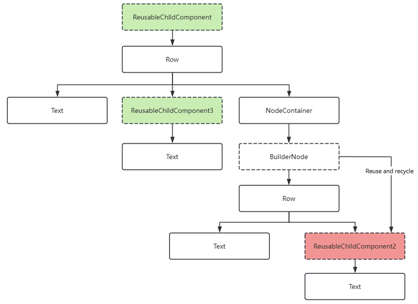
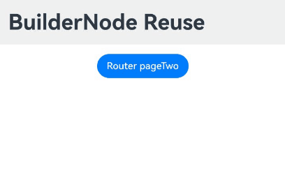

# Custom Declarative Node (BuilderNode)

## Overview

[BuilderNode](../reference/apis-arkui/js-apis-arkui-builderNode.md) is a custom declarative nodedesigned to seamlessly mount built-in components. With BuilderNode, you can build a custom component tree within stateless UI environments through the [global custom builder function](../quick-start/arkts-builder.md#global-custom-builder-function), which is decorated by @Builder. Once your custom component tree is established, you can obtain its root [FrameNode](../reference/apis-arkui/js-apis-arkui-frameNode.md) by calling [getFrameNode](../reference/apis-arkui/js-apis-arkui-builderNode.md#getframenode). The root node can be directly returned by [NodeController](../reference/apis-arkui/js-apis-arkui-nodeController.md) and mounted under a [NodeContainer](../reference/apis-arkui/arkui-ts/ts-basic-components-nodecontainer.md). **BuilderNode** facilitates embedding of embedding declarative components within **FrameNode** and [RenderNode](../reference/apis-arkui/js-apis-arkui-renderNode.md) trees for mixed display. **BuilderNode** also offers a feature for exporting textures, which can be used for rendering within the same layer of the [XComponent](../reference/apis-arkui/arkui-ts/ts-basic-components-xcomponent.md).

The ArkTS built-in component tree constructed by **BuilderNode** can be used together with custom nodes, such as FrameNodes and RenderNodes, to achieve the mixed display effect. **BuilderNode** offers a suite of APIs designed to integrate built-in components within third-party frameworks. This is particularly beneficial for scenarios where these frameworks require interaction with custom nodes

**BuilderNode** offers the capability to pre-create components, allowing you to dictate when built-in components are instantiated. This feature is useful for dynamically mounting and displaying components, especially for those that have a longer initialization period, such as [Web](../reference/apis-arkweb/ts-basic-components-web.md) and [XComponent](../reference/apis-arkui/arkui-ts/ts-basic-components-xcomponent.md).


## Basic Concepts

- [Built-in component](arkts-ui-development-overview.md): component provided directly by ArkUI. Components are essential elements of the UI, working together to shape the UI.

- Entity node: native node created by the backend.

A BuilderNode can be used only as a leaf node. If an update is required, you are advised to use the [update](../reference/apis-arkui/js-apis-arkui-builderNode.md#update) API provided by the BuilderNode, rather than making modifications directly to the RenderNode obtained from it. 

> **NOTE**
> 
> - The BuilderNode only supports a single [global custom build function(../quick-start/arkts-builder.md#global-custom-builder-function) decorated by @Builder and wrapped by [wrapBuilder](../quick-start/arkts-wrapBuilder.md).
> 
> - A newly created BuilderNode can only obtain a **FrameNode** object pointing to the root node through [getFrameNode](../reference/apis-arkui/js-apis-arkui-builderNode.md#getframenode) after [build](../reference/apis-arkui/js-apis-arkui-builderNode.md#build); otherwise, it returns **null**.
> 
> - If the root node of the passed Builder is a syntactic node (such as **if/else** and **ForEach**), an additional FrameNode must be generated, which will be displayed as "BuilderProxyNode" in the node tree.
> 
> - If BuilderNode mounts a node onto another FrameNode through **getFrameNode**, or mounts it as a child node onto a **NodeContainer**, the node uses the layout constraints of the parent component for layout.
> 
> - If a BuilderNode's FrameNode mounts its node onto a RenderNode through [getRenderNode](../reference/apis-arkui/js-apis-arkui-frameNode.md#getrendernode), its size defaults to **0** since its FrameNode is not yet part of the tree. To display it properly, you must explicitly specify the layout constraint size through [selfIdeaSize](../reference/apis-arkui/js-apis-arkui-builderNode.md#renderoptions) in the constructor.
> 
> - Pre-creation with the BuilderNode does not reduce the creation time of components. For the **Web** component, resources must be loaded in the kernel during creation, and pre-creation cannot reduce this time. However, it enables the kernel to preload resources, which can reduce the loading time when the component is used.

## Creating a BuilderNode Object

When creating a **BuilderNode** object, which is a template class, you must specify a type that matches the type of the [WrappedBuilder](../quick-start/arkts-wrapBuilder.md) used in the **build** method later on. Mismatches can cause compilation warnings and failures.

## Creating a Built-in Component Tree

Use the **build** API of **BuilderNode** to create a built-in component tree. The tree is constructed based on the **WrappedBuilder** object passed in, and the root node of the component tree is retained.

> **NOTE**
>
> Stateless UI methods using the global @Builder can have at most one root node.
>
> The @Builder within the **build** method accepts only one input parameter.
>
> In scenarios where @Builder is nested within another @Builder in the **build** method, ensure that the parameters of the nested @Builder match the input parameters provided to the **build** method.
> 
> For scenarios where @Builder is nested within another @Builder, if the parameter types do not match, you must include the [BuilderOptions](../reference/apis-arkui/js-apis-arkui-builderNode.md#buildoptions12) field as a parameter for the [build](../reference/apis-arkui/js-apis-arkui-builderNode.md#build12) method.
> 
> To operate objects in a BuilderNode, ensure that the reference to the BuilderNode is not garbage collected. Once a BuilderNode object is collected by the virtual machine, its FrameNode and RenderNode objects will also be dereferenced from the backend nodes. This means that any FrameNode objects obtained from a BuilderNode will no longer correspond to any actual node if the BuilderNode is garbage collected.

Create offline nodes and built-in component trees, and use them in conjunction with FrameNodes.

The root node of the BuilderNode is directly used as the return value of [makeNode](../reference/apis-arkui/js-apis-arkui-nodeController.md#makenode) of [NodeController](../reference/apis-arkui/js-apis-arkui-nodeController.md).

```ts
import { BuilderNode, FrameNode, NodeController, UIContext } from '@kit.ArkUI';

class Params {
  text: string = "";

  constructor(text: string) {
    this.text = text;
  }
}

@Builder
function buildText(params: Params) {
  Column() {
    Text(params.text)
      .fontSize(50)
      .fontWeight(FontWeight.Bold)
      .margin({ bottom: 36 })
  }
}

class TextNodeController extends NodeController {
  private textNode: BuilderNode<[Params]> | null = null;
  private message: string = "DEFAULT";

  constructor(message: string) {
    super();
    this.message = message;
  }

  makeNode(context: UIContext): FrameNode | null {
    this.textNode = new BuilderNode(context);
    this.textNode.build(wrapBuilder<[Params]>(buildText), new Params(this.message))
    return this.textNode.getFrameNode();
  }
}

@Entry
@Component
struct Index {
  @State message: string = "hello";

  build() {
    Row() {
      Column() {
        NodeContainer(new TextNodeController(this.message))
          .width('100%')
          .height(100)
          .backgroundColor('#FFF0F0F0')
      }
      .width('100%')
      .height('100%')
    }
    .height('100%')
  }
}
```

When combining a BuilderNode with a RenderNode, note the following:

If you mount the RenderNode from the BuilderNode under another RenderNode, you must explicitly specify [selfIdeaSize](../reference/apis-arkui/js-apis-arkui-builderNode.md#renderoptions) as the layout constraint for the BuilderNode. This approach to mounting nodes is not recommended.

```ts
import { NodeController, BuilderNode, FrameNode, UIContext, RenderNode } from "@kit.ArkUI";

class Params {
  text: string = "";

  constructor(text: string) {
    this.text = text;
  }
}

@Builder
function buildText(params: Params) {
  Column() {
    Text(params.text)
      .fontSize(50)
      .fontWeight(FontWeight.Bold)
      .margin({ bottom: 36 })
  }
}

class TextNodeController extends NodeController {
  private rootNode: FrameNode | null = null;
  private textNode: BuilderNode<[Params]> | null = null;
  private message: string = "DEFAULT";

  constructor(message: string) {
    super();
    this.message = message;
  }

  makeNode(context: UIContext): FrameNode | null {
    this.rootNode = new FrameNode(context);
    let renderNode = new RenderNode();
    renderNode.clipToFrame = false;
    this.textNode = new BuilderNode(context, { selfIdealSize: { width: 150, height: 150 } });
    this.textNode.build(wrapBuilder<[Params]>(buildText), new Params(this.message));
    const textRenderNode = this.textNode?.getFrameNode()?.getRenderNode();

    const rootRenderNode = this.rootNode.getRenderNode();
    if (rootRenderNode !== null) {
      rootRenderNode.appendChild(renderNode);
      renderNode.appendChild(textRenderNode);
    }

    return this.rootNode;
  }
}

@Entry
@Component
struct Index {
  @State message: string = "hello";

  build() {
    Row() {
      Column() {
        NodeContainer(new TextNodeController(this.message))
          .width('100%')
          .height(100)
          .backgroundColor('#FFF0F0F0')
      }
      .width('100%')
      .height('100%')
    }
    .height('100%')
  }
}
```

## Updating the Built-in Component Tree

Create a built-in component tree using the **build** API of a **BuilderNode** object. The tree is constructed based on the **WrappedBuilder** object passed in, and the root node of the component tree is retained.

Custom component updates follow the update mechanisms of [state management](../quick-start/arkts-state-management-overview.md). For custom components used directly in a **WrappedBuilder** object, their parent component is the **BuilderNode** object. Therefore, to update child components defined in the **WrappedBuilder** objects, you need to define the relevant state variables with the [\@Prop](../quick-start/arkts-prop.md) or [\@ObjectLink](../quick-start/arkts-observed-and-objectlink.md) decorator, in accordance with the specifications of state management and the needs of your application development.


To update nodes within a BuilderNode:<br>Use the **update** API to update individual nodes within the BuilderNode.

Use the [updateConfiguration](../reference/apis-arkui/js-apis-arkui-builderNode.md#updateconfiguration12) API to trigger a full update of all nodes within the BuilderNode.

 

```ts
import { NodeController, BuilderNode, FrameNode, UIContext } from "@kit.ArkUI";

class Params {
  text: string = "";
  constructor(text: string) {
    this.text = text;
  }
}

// Custom component
@Component
struct TextBuilder {
  // The @Prop decorated attribute is the attribute to be updated in the custom component. It is a basic attribute.
  @Prop message: string = "TextBuilder";

  build() {
    Row() {
      Column() {
        Text(this.message)
          .fontSize(50)
          .fontWeight(FontWeight.Bold)
          .margin({ bottom: 36 })
          .backgroundColor(Color.Gray)
      }
    }
  }
}

@Builder
function buildText(params: Params) {
  Column() {
    Text(params.text)
      .fontSize(50)
      .fontWeight(FontWeight.Bold)
      .margin({ bottom: 36 })
    TextBuilder({ message: params.text }) // Custom component
  }
}

class TextNodeController extends NodeController {
  private textNode: BuilderNode<[Params]> | null = null;
  private message: string = "";

  constructor(message: string) {
    super()
    this.message = message
  }

  makeNode(context: UIContext): FrameNode | null {
    this.textNode = new BuilderNode(context);
    this.textNode.build(wrapBuilder<[Params]>(buildText), new Params(this.message))
    return this.textNode.getFrameNode();
  }

  update(message: string) {
    if (this.textNode !== null) {
      // Call update to perform an update.
      this.textNode.update(new Params(message));
    }
  }
}

@Entry
@Component
struct Index {
  @State message: string = "hello";
  private textNodeController: TextNodeController = new TextNodeController(this.message);
  private count = 0;

  build() {
    Row() {
      Column() {
        NodeContainer(this.textNodeController)
          .width('100%')
          .height(200)
          .backgroundColor('#FFF0F0F0')
        Button('Update')
          .onClick(() => {
            this.count += 1;
            const message = "Update " + this.count.toString();
            this.textNodeController.update(message);
          })
      }
      .width('100%')
      .height('100%')
    }
    .height('100%')
  }
}
```

## Canceling the Reference to the Entity Node

A **BuilderNode** object is mapped to a backend entity node, and its memory release is usually contingent on the disposal of the frontend object. To directly release the backend node object, you can call the [dispose](../reference/apis-arkui/js-apis-arkui-builderNode.md#dispose12) API to break the reference to the entity node. Once this is done, the frontend **BuilderNode** object will no longer affect the lifecycle of the entity node.

> **NOTE**
>
> Calling **dispose** on a **BuilderNode** object breaks its reference to the backend entity node, and also simultaneously severs the references of its contained FrameNode and RenderNode to their respective entity nodes.
>
> If the frontend object BuilderNode cannot be released, memory leaks may occur. To avoid this, be sure to call **dispose** on the BuilderNode when you no longer need it. This reduces the complexity of reference relationships and lowers the risk of memory leaks.

## Injecting a Touch Event

Use the [postTouchEvent](../reference/apis-arkui/js-apis-arkui-builderNode.md#posttouchevent) API in the BuilderNode to inject a [touch event](../reference/apis-arkui/arkui-ts/ts-universal-events-touch.md) into the bound component for event simulation and forwarding.

 

The following example forwards a touch event from one **Column** component to another in the BuilderNode, so that when the lower **Column** component is touched, the upper **Column** component also receives the same touch event. The API returns **true** if the button's event is successfully recognized.

```ts
import { NodeController, BuilderNode, FrameNode, UIContext } from '@kit.ArkUI';

class Params {
  text: string = "this is a text";
}

@Builder
function ButtonBuilder(params: Params) {
  Column() {
    Button(`button ` + params.text)
      .borderWidth(2)
      .backgroundColor(Color.Orange)
      .width("100%")
      .height("100%")
      .gesture(
        TapGesture()
          .onAction((event: GestureEvent) => {
            console.log("TapGesture");
          })
      )
  }
  .width(500)
  .height(300)
  .backgroundColor(Color.Gray)
}

class MyNodeController extends NodeController {
  private rootNode: BuilderNode<[Params]> | null = null;
  private wrapBuilder: WrappedBuilder<[Params]> = wrapBuilder(ButtonBuilder);

  makeNode(uiContext: UIContext): FrameNode | null {
    this.rootNode = new BuilderNode(uiContext);
    this.rootNode.build(this.wrapBuilder, { text: "this is a string" })
    return this.rootNode.getFrameNode();
  }

  postTouchEvent(touchEvent: TouchEvent): void {
    if (this.rootNode == null) {
      return;
    }
    let result = this.rootNode.postTouchEvent(touchEvent);
    console.log("result " + result);
  }
}

@Entry
@Component
struct MyComponent {
  private nodeController: MyNodeController = new MyNodeController();

  build() {
    Column() {
      NodeContainer(this.nodeController)
        .height(300)
        .width(500)
      Column()
        .width(500)
        .height(300)
        .backgroundColor(Color.Pink)
        .onTouch((event) => {
          if (event != undefined) {
            this.nodeController.postTouchEvent(event);
          }
        })
    }
  }
}
```

## Reusing a BuilderNode

To implement component reuse within a BuilderNode, you need to call the [reuse](../reference/apis-arkui/js-apis-arkui-builderNode.md#reuse12) and [recycle](../reference/apis-arkui/js-apis-arkui-builderNode.md#recycle12) APIs. These APIs pass reuse and recycle events to custom components inside the BuilderNode.

For example, in the following demo, the custom component **ReusableChildComponent** can pass reuse and recycle events to its nested custom component **ReusableChildComponent3**. However, these events cannot automatically reach another custom component, **ReusableChildComponent2**, if it is separated by a BuilderNode. To enable reuse for **ReusableChildComponent2**, you must explicitly call the **reuse** and **recycle** APIs on the BuilderNode to forward these events to **ReusableChildComponent2**.



```ts
import { FrameNode, NodeController, BuilderNode, UIContext } from "@kit.ArkUI";

const TEST_TAG: string = "Reuse+Recycle";

class MyDataSource {
  private dataArray: string[] = [];
  private listener: DataChangeListener | null = null

  public totalCount(): number {
    return this.dataArray.length;
  }

  public getData(index: number) {
    return this.dataArray[index];
  }

  public pushData(data: string) {
    this.dataArray.push(data);
  }

  public reloadListener(): void {
    this.listener?.onDataReloaded();
  }

  public registerDataChangeListener(listener: DataChangeListener): void {
    this.listener = listener;
  }

  public unregisterDataChangeListener(): void {
    this.listener = null;
  }
}

class Params {
  item: string = '';

  constructor(item: string) {
    this.item = item;
  }
}

@Builder
function buildNode(param: Params = new Params("hello")) {
  Row() {
    Text(`C${param.item} -- `)
    ReusableChildComponent2({ item: param.item }) // This custom component cannot be correctly reused in the BuilderNode.
  }
}

class MyNodeController extends NodeController {
  public builderNode: BuilderNode<[Params]> | null = null;
  public item: string = "";

  makeNode(uiContext: UIContext): FrameNode | null {
    if (this.builderNode == null) {
      this.builderNode = new BuilderNode(uiContext, { selfIdealSize: { width: 300, height: 200 } });
      this.builderNode.build(wrapBuilder<[Params]>(buildNode), new Params(this.item));
    }
    return this.builderNode.getFrameNode();
  }
}

// The custom component that is reused and recycled will have its state variables updated, and the state variables of the nested custom component ReusableChildComponent3 will also be updated. However, the BuilderNode will block this propagation process.
@Reusable
@Component
struct ReusableChildComponent {
  @Prop item: string = '';
  @Prop switch: string = '';
  private controller: MyNodeController = new MyNodeController();

  aboutToAppear() {
    this.controller.item = this.item;
  }

  aboutToRecycle(): void {
    console.log(`${TEST_TAG} ReusableChildComponent aboutToRecycle ${this.item}`);

    // When the switch is open, pass the recycle event to the nested custom component, such as ReusableChildComponent2, through the BuilderNode's recycle API to complete recycling.
    if (this.switch === 'open') {
      this.controller?.builderNode?.recycle();
    }
  }

  aboutToReuse(params: object): void {
    console.log(`${TEST_TAG} ReusableChildComponent aboutToReuse ${JSON.stringify(params)}`);

    // When the switch is open, pass the reuse event to the nested custom component, such as ReusableChildComponent2, through the BuilderNode's reuse API to complete reuse.
    if (this.switch === 'open') {
      this.controller?.builderNode?.reuse(params);
    }
  }

  build() {
    Row() {
      Text(`A${this.item}--`)
      ReusableChildComponent3({ item: this.item })
      NodeContainer(this.controller);
    }
  }
}

@Component
struct ReusableChildComponent2 {
  @Prop item: string = "false";

  aboutToReuse(params: Record<string, object>) {
    console.log(`${TEST_TAG} ReusableChildComponent2 aboutToReuse ${JSON.stringify(params)}`);
  }

  aboutToRecycle(): void {
    console.log(`${TEST_TAG} ReusableChildComponent2 aboutToRecycle ${this.item}`);
  }

  build() {
    Row() {
      Text(`D${this.item}`)
        .fontSize(20)
        .backgroundColor(Color.Yellow)
        .margin({ left: 10 })
    }.margin({ left: 10, right: 10 })
  }
}

@Component
struct ReusableChildComponent3 {
  @Prop item: string = "false";

  aboutToReuse(params: Record<string, object>) {
    console.log(`${TEST_TAG} ReusableChildComponent3 aboutToReuse ${JSON.stringify(params)}`);
  }

  aboutToRecycle(): void {
    console.log(`${TEST_TAG} ReusableChildComponent3 aboutToRecycle ${this.item}`);
  }

  build() {
    Row() {
      Text(`B${this.item}`)
        .fontSize(20)
        .backgroundColor(Color.Yellow)
        .margin({ left: 10 })
    }.margin({ left: 10, right: 10 })
  }
}


@Entry
@Component
struct Index {
  @State data: MyDataSource = new MyDataSource();

  aboutToAppear() {
    for (let i = 0; i < 100; i++) {
      this.data.pushData(i.toString());
    }
  }

  build() {
    Column() {
      List({ space: 3 }) {
        LazyForEach(this.data, (item: string) => {
          ListItem() {
            ReusableChildComponent({
              item: item,
              switch: 'open' // Changing open to close can be used to observe the behavior of custom components inside the BuilderNode when reuse and recycle events are not passed through the BuilderNode's reuse and recycle APIs.
            })
          }
        }, (item: string) => item)
      }
      .width('100%')
      .height('100%')
    }
  }
}
```


## Updating Nodes Based on System Environment Changes

Use the [updateConfiguration](../reference/apis-arkui/js-apis-arkui-builderNode.md#updateconfiguration12) API to listen for [system environment changes](../reference/apis-ability-kit/js-apis-app-ability-configuration.md). This will trigger a full update of all nodes within the BuilderNode.

> **NOTE**
>
> The **updateConfiguration** API is designed to inform objects of the need to update, with the updates reflecting changes in the application's current system environment.

```ts
import { NodeController, BuilderNode, FrameNode, UIContext } from "@kit.ArkUI";
import { AbilityConstant, Configuration, EnvironmentCallback } from '@kit.AbilityKit';

class Params {
  text: string = ""

  constructor(text: string) {
    this.text = text;
  }
}

// Custom component
@Component
struct TextBuilder {
  // The @Prop decorated attribute is the attribute to be updated in the custom component. It is a basic attribute.
  @Prop message: string = "TextBuilder";

  build() {
    Row() {
      Column() {
        Text(this.message)
          .fontSize(50)
          .fontWeight(FontWeight.Bold)
          .margin({ bottom: 36 })
          .fontColor($r(`app.color.text_color`))
          .backgroundColor($r(`app.color.start_window_background`))
      }
    }
  }
}

@Builder
function buildText(params: Params) {
  Column() {
    Text(params.text)
      .fontSize(50)
      .fontWeight(FontWeight.Bold)
      .margin({ bottom: 36 })
      .fontColor($r(`app.color.text_color`))
    TextBuilder({ message: params.text }) // Custom component
  }.backgroundColor($r(`app.color.start_window_background`))
}

class TextNodeController extends NodeController {
  private textNode: BuilderNode<[Params]> | null = null;
  private message: string = "";

  constructor(message: string) {
    super()
    this.message = message;
  }

  makeNode(context: UIContext): FrameNode | null {
    return this.textNode?.getFrameNode() ? this.textNode?.getFrameNode() : null;
  }

  createNode(context: UIContext) {
    this.textNode = new BuilderNode(context);
    this.textNode.build(wrapBuilder<[Params]>(buildText), new Params(this.message));
    builderNodeMap.push(this.textNode);
  }

  deleteNode() {
    let node = builderNodeMap.pop();
    node?.dispose();
  }

  update(message: string) {
    if (this.textNode !== null) {
      // Call update to perform an update.
      this.textNode.update(new Params(message));
    }
  }
}

// Record the created custom node object.
const builderNodeMap: Array<BuilderNode<[Params]>> = new Array();

function updateColorMode() {
  builderNodeMap.forEach((value, index) => {
    // Notify BuilderNode of the environment changes.
    value.updateConfiguration();
  })
}

@Entry
@Component
struct Index {
  @State message: string = "hello"
  private textNodeController: TextNodeController = new TextNodeController(this.message);
  private count = 0;

  aboutToAppear(): void {
    let environmentCallback: EnvironmentCallback = {
      onMemoryLevel: (level: AbilityConstant.MemoryLevel): void => {
        console.log('onMemoryLevel');
      },
      onConfigurationUpdated: (config: Configuration): void => {
        console.log('onConfigurationUpdated ' + JSON.stringify(config));
        updateColorMode();
      }
    }
    // Register a callback.
    this.getUIContext().getHostContext()?.getApplicationContext().on('environment', environmentCallback);
    // Create a custom node and add it to the map.
    this.textNodeController.createNode(this.getUIContext());
  }

  aboutToDisappear(): void {
    // Remove the reference to the custom node from the map and release the node.
    this.textNodeController.deleteNode();
  }

  build() {
    Row() {
      Column() {
        NodeContainer(this.textNodeController)
          .width('100%')
          .height(200)
          .backgroundColor('#FFF0F0F0')
        Button('Update')
          .onClick(() => {
            this.count += 1;
            const message = "Update " + this.count.toString();
            this.textNodeController.update(message);
          })
      }
      .width('100%')
      .height('100%')
    }
    .height('100%')
  }
}
```

## Cross-Page Reuse Considerations

With use of [routing](../reference/apis-arkui/js-apis-router.md) APIs such as [router.replaceUrl](../reference/apis-arkui/js-apis-router.md#routerreplaceurl9), [router.back](../reference/apis-arkui/js-apis-router.md#routerback), [router.clear](../reference/apis-arkui/js-apis-router.md#routerclear), and [router.replaceNamedRoute](../reference/apis-arkui/js-apis-router.md#routerreplacenamedroute10) to navigate between pages, issues may arise when you reuse a cached BuilderNode from a page that is about to be destroyed. Specifically, the reused BuilderNode might not update its data correctly, or newly created nodes might not display as expected. For example, when you use [router.replaceNamedRoute](../reference/apis-arkui/js-apis-router.md#routerreplacenamedroute10), consider the following scenario: When the **router replace** button is clicked, the page switches to PageTwo, and the flag **isShowText** is set to **false**.

```ts
// ets/pages/Index.ets
import { NodeController, BuilderNode, FrameNode, UIContext } from "@kit.ArkUI";
import "ets/pages/PageTwo"

@Builder
function buildText() {
  // Use syntax nodes to generate a BuilderProxyNode within @Builder.
  if (true) {
    MyComponent()
  }
}

@Component
struct MyComponent {
  @StorageLink("isShowText") isShowText: boolean = true;

  build() {
    if (this.isShowText) {
      Column() {
        Text("BuilderNode Reuse")
          .fontSize(36)
          .fontWeight(FontWeight.Bold)
          .padding(16)
      }
    }
  }
}

class TextNodeController extends NodeController {
  private rootNode: FrameNode | null = null;
  private textNode: BuilderNode<[]> | null = null;

  makeNode(context: UIContext): FrameNode | null {
    this.rootNode = new FrameNode(context);

    if (AppStorage.has("textNode")) {
      // Reuse the BuilderNode from AppStorage.
      this.textNode = AppStorage.get<BuilderNode<[]>>("textNode") as BuilderNode<[]>;
      const parent = this.textNode.getFrameNode()?.getParent();
      if (parent) {
        parent.removeChild(this.textNode.getFrameNode());
      }
    } else {
      this.textNode = new BuilderNode(context);
      this.textNode.build(wrapBuilder<[]>(buildText));
      // Save the created BuilderNode to AppStorage.
      AppStorage.setOrCreate<BuilderNode<[]>>("textNode", this.textNode);
    }
    this.rootNode.appendChild(this.textNode.getFrameNode());

    return this.rootNode;
  }
}

@Entry({ routeName: "myIndex" })
@Component
struct Index {
  aboutToAppear(): void {
    AppStorage.setOrCreate<boolean>("isShowText", true);
  }

  build() {
    Row() {
      Column() {
        NodeContainer(new TextNodeController())
          .width('100%')
          .backgroundColor('#FFF0F0F0')
        Button('Router pageTwo')
          .onClick(() => {
            // Change the state variable in AppStorage to trigger re-creation of the Text node.
            AppStorage.setOrCreate<boolean>("isShowText", false);

            this.getUIContext().getRouter().replaceNamedRoute({ name: "pageTwo" });
          })
          .margin({ top: 16 })
      }
      .width('100%')
      .height('100%')
      .padding(16)
    }
    .height('100%')
  }
}
```

The implementation of **PageTwo** is as follows:

```ts
// ets/pages/PageTwo.ets
// This page contains a button to navigate back to the home page, where the original text disappears.
import "ets/pages/Index"

@Entry({ routeName: "pageTwo" })
@Component
struct PageTwo {
  build() {
    Column() {
      Button('Router replace to index')
        .onClick(() => {
          this.getUIContext().getRouter().replaceNamedRoute({ name: "myIndex" });
        })
    }
    .height('100%')
    .width('100%')
    .alignItems(HorizontalAlign.Center)
    .padding(16)
  }
}
```



In versions earlier than API version 16, you need to manually remove the BuilderNode from the cache, AppStorage in this example, when the page is destroyed.

Since API version 16, the BuilderNode automatically refreshes its content when reused in a new page. This means you no longer need to remove the BuilderNode from the cache when the page is destroyed.

```ts
// ets/pages/Index.ets
import { NodeController, BuilderNode, FrameNode, UIContext } from "@kit.ArkUI";
import "ets/pages/PageTwo"

@Builder
function buildText() {
  // Use syntax nodes to generate a BuilderProxyNode within @Builder.
  if (true) {
    MyComponent()
  }
}

@Component
struct MyComponent {
  @StorageLink("isShowText") isShowText: boolean = true;

  build() {
    if (this.isShowText) {
      Column() {
        Text("BuilderNode Reuse")
          .fontSize(36)
          .fontWeight(FontWeight.Bold)
          .padding(16)
      }
    }
  }
}

class TextNodeController extends NodeController {
  private rootNode: FrameNode | null = null;
  private textNode: BuilderNode<[]> | null = null;

  makeNode(context: UIContext): FrameNode | null {
    this.rootNode = new FrameNode(context);

    if (AppStorage.has("textNode")) {
      // Reuse the BuilderNode from AppStorage.
      this.textNode = AppStorage.get<BuilderNode<[]>>("textNode") as BuilderNode<[]>;
      const parent = this.textNode.getFrameNode()?.getParent();
      if (parent) {
        parent.removeChild(this.textNode.getFrameNode());
      }
    } else {
      this.textNode = new BuilderNode(context);
      this.textNode.build(wrapBuilder<[]>(buildText));
      // Save the created BuilderNode to AppStorage.
      AppStorage.setOrCreate<BuilderNode<[]>>("textNode", this.textNode);
    }
    this.rootNode.appendChild(this.textNode.getFrameNode());

    return this.rootNode;
  }
}

@Entry({ routeName: "myIndex" })
@Component
struct Index {
  aboutToAppear(): void {
    AppStorage.setOrCreate<boolean>("isShowText", true);
  }

  build() {
    Row() {
      Column() {
        NodeContainer(new TextNodeController())
          .width('100%')
          .backgroundColor('#FFF0F0F0')
        Button('Router pageTwo')
          .onClick(() => {
            // Change the state variable in AppStorage to trigger re-creation of the Text node.
            AppStorage.setOrCreate<boolean>("isShowText", false);
            // Remove the BuilderNode from AppStorage.
            AppStorage.delete("textNode");

            this.getUIContext().getRouter().replaceNamedRoute({ name: "pageTwo" });
          })
          .margin({ top: 16 })
      }
      .width('100%')
      .height('100%')
      .padding(16)
    }
    .height('100%')
  }
}
```


## Using the LocalStorage in the BuilderNode

Since API version 12, custom components can receive [LocalStorage](../quick-start/arkts-localstorage.md) instances. You can use LocalStorage related decorators such as [@LocalStorageProp](../quick-start/arkts-localstorage.md#localstorageprop) and [@LocalStorageLink](../quick-start/arkts-localstorage.md#localstoragelink) by [passing LocalStorage instances](../quick-start/arkts-localstorage.md#example-of-providing-a-custom-component-with-access-to-a-localstorage-instance).

```ts
import { BuilderNode, NodeController, UIContext } from '@kit.ArkUI';

let localStorage1: LocalStorage = new LocalStorage();
localStorage1.setOrCreate('PropA', 'PropA');

let localStorage2: LocalStorage = new LocalStorage();
localStorage2.setOrCreate('PropB', 'PropB');

@Entry(localStorage1)
@Component
struct Index {
  // PropA is in two-way synchronization with PropA in localStorage1.
  @LocalStorageLink('PropA') PropA: string = 'Hello World';
  @State count: number = 0;
  private controller: NodeController = new MyNodeController(this.count, localStorage2);

  build() {
    Row() {
      Column() {
        Text(this.PropA)
          .fontSize(50)
          .fontWeight(FontWeight.Bold)
        // Use the LocalStorage instance localStorage2.
        Child({ count: this.count }, localStorage2)
        NodeContainer(this.controller)
      }
      .width('100%')
    }
    .height('100%')
  }
}

interface Params {
  count: number;
  localStorage: LocalStorage;
}

@Builder
function CreateChild(params: Params) {
  // Pass localStorage during construction.
  Child({ count: params.count }, params.localStorage)
}

class MyNodeController extends NodeController {
  private count?: number;
  private localStorage ?: LocalStorage;

  constructor(count: number, localStorage: LocalStorage) {
    super();
    this.count = count;
    this.localStorage = localStorage;
  }

  makeNode(uiContext: UIContext): FrameNode | null {
    let builderNode = new BuilderNode<[Params]>(uiContext);
    // Pass localStorage during construction.
    builderNode.build(wrapBuilder(CreateChild), { count: this.count, localStorage: this.localStorage });
    return builderNode.getFrameNode();
  }
}

@Component
struct Child {
  @Prop count: number;
  // 'Hello World' is in two-way synchronization with PropB in localStorage2. If there is no PropB in localStorage2, the default value 'Hello World' is used.
  @LocalStorageLink('PropB') PropB: string = 'Hello World';

  build() {
    Text(this.PropB)
      .fontSize(50)
      .fontWeight(FontWeight.Bold)
  }
}
```
