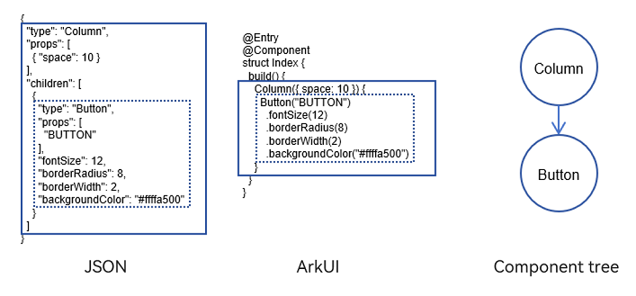
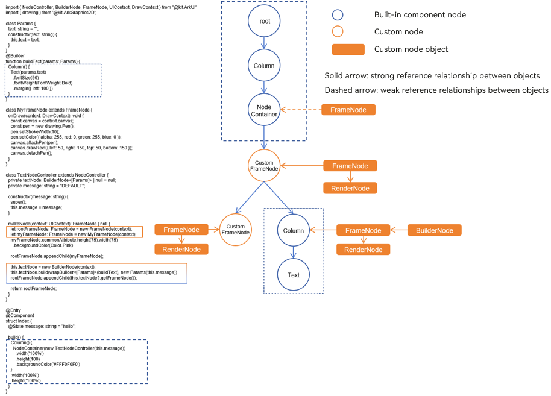

# Custom Component Node (FrameNode)

## Overview

For third-party frameworks with custom frontend definitions, such as those in JSON, XML, or a DOM tree, a conversion from the specific DSL into ArkUI's declarative descriptions is necessary. The following figure shows the mapping between a frontend framework defined by JSON and the ArkUI declarative description.



The aforementioned conversion process, which relies on additional data-driven bindings to the [Builder](../quick-start/arkts-builder.md), is complex and can be performance-intensive. Such frameworks typically leverage ArkUI's layout and event handling, as well as basic node operations and customization capabilities. While most components are customized, some built-in components are needed for mixed display. This is where [FrameNode](../reference/apis-arkui/js-apis-arkui-frameNode.md) comes into the picture. In the example shown below, while the custom method of **FrameNode** is used for drawing, a built-in component **Column** and its child component **Text** are mounted to the root FrameNode through **BuilderNode**, thereby achieving mixed display.



This is where [FrameNode](../reference/apis-arkui/js-apis-arkui-frameNode.md) comes into the picture. **FrameNode** represents an entity node in the component tree. It is used in conjunction with the custom placeholder container component, [NodeContainer](../reference/apis-arkui/arkui-ts/ts-basic-components-nodecontainer.md), to construct a custom node tree inside the placeholder container. This node tree supports dynamic operations, including node addition, modification, and removal. Basic FrameNodes provide functionality for setting universal attributes and event callbacks, as well as comprehensive customization capabilities for measurement, layout, and rendering.

Moreover, the ArkUI framework enables obtaining and traversing proxy FrameNode objects for built-in components, known as proxy nodes, which facilitate UI tree traversal and allow for obtaining specific information about built-in components or registering additional event listeners.

## Creating and Removing Nodes

You can create and remove nodes with **FrameNode**. You can create a custom instance of **FrameNode** using its constructor, and the instance thereby created corresponds to an entity node. You can use the [dispose](../reference/apis-arkui/js-apis-arkui-frameNode.md#dispose12) API in **FrameNode** to break the binding with the entity node.

> **NOTE**
>
> - A valid **UIContext** object is required for creating a FrameNode. If no **UIContext** object is provided or if the provided one is invalid, an exception will be thrown during node creation.
>
> - Maintain UI context consistency for custom placeholder components to prevent display issues.
>
> - **FrameNode** objects are subject to garbage collection (GC) if not retained.

## Checking Whether a Node is Modifiable

Use [isModifiable](../reference/apis-arkui/js-apis-arkui-frameNode.md#ismodifiable12) to check whether the current node is a proxy for a built-in component. If a FrameNode serves as a proxy, it cannot be modified, which means you cannot change its properties or the structure of its child nodes.

## Obtaining the Corresponding RenderNode

Use the [getRenderNode](../reference/apis-arkui/js-apis-arkui-frameNode.md#getrendernode) API to obtain the RenderNode associated with the FrameNode. You can then perform operations on the obtained RenderNode object to dynamically modify the drawing-related properties of the FrameNode. For details about the properties that can be modified, see [RenderNode](arkts-user-defined-arktsNode-renderNode.md).

> **NOTE**
>
> - You cannot obtain the RenderNode for a built-in component's proxy FrameNode.
> 
> - In **BuilderNode**, you can use [getFrameNode](../reference/apis-arkui/js-apis-arkui-builderNode.md#getframenode) to get the FrameNode object, and then use **getRenderNode** to obtain the RenderNode object of the corresponding root node.

## Operating the Node Tree

With **FrameNode**, you can add, delete, query, and modify nodes, thereby changing the subtree structure of non-proxy nodes. You can also query the parent-child relationships to obtain the results.

> **NOTE**
>
> Illegal operations for adding, deleting, or modifying nodes will result in exceptions.
>
> Proxy nodes obtained through queries are read-only. They can be used to obtain node information, but cannot modify node properties. These proxy nodes do not hold references to the underlying component entity nodes and therefore do not affect the lifecycle of the corresponding nodes.
>
> Node queries only return UI-related nodes and do not include syntax nodes.
>
> In scenarios using custom components, you may query and obtain newly added nodes of the custom components, with the node type being **\_\_Common\_\_**.

```ts
import { BuilderNode, FrameNode, NodeController, UIContext } from '@kit.ArkUI';
import { BusinessError } from '@kit.BasicServicesKit';

const TEST_TAG: string = "FrameNode"

class Params {
  text: string = "this is a text"
}

@Builder
function buttonBuilder(params: Params) {
  Column({ space: 10 }) {
    Button(params.text)
      .fontSize(12)
      .borderRadius(8)
      .borderWidth(2)
      .backgroundColor(Color.Orange)

    Button(params.text)
      .fontSize(12)
      .borderRadius(8)
      .borderWidth(2)
      .backgroundColor(Color.Pink)
  }
}

class MyNodeController extends NodeController {
  public buttonNode: BuilderNode<[Params]> | null = null;
  public frameNode: FrameNode | null = null;
  public childList: Array<FrameNode> = new Array<FrameNode>();
  public rootNode: FrameNode | null = null;
  private uiContext: UIContext | null = null;
  private wrapBuilder: WrappedBuilder<[Params]> = wrapBuilder(buttonBuilder);

  makeNode(uiContext: UIContext): FrameNode | null {
    this.uiContext = uiContext;
    if (this.rootNode == null) {
      this.rootNode = new FrameNode(uiContext);
      this.rootNode.commonAttribute
        .width("50%")
        .height(100)
        .borderWidth(1)
        .backgroundColor(Color.Gray)
    }

    if (this.frameNode == null) {
      this.frameNode = new FrameNode(uiContext);
      this.frameNode.commonAttribute
        .width("100%")
        .height(50)
        .borderWidth(1)
        .position({ x: 200, y: 0 })
        .backgroundColor(Color.Pink);
      this.rootNode.appendChild(this.frameNode);
    }
    if (this.buttonNode == null) {
      this.buttonNode = new BuilderNode<[Params]>(uiContext);
      this.buttonNode.build(this.wrapBuilder, { text: "This is a Button" })
      this.rootNode.appendChild(this.buttonNode.getFrameNode())
    }
    return this.rootNode;
  }

  operationFrameNodeWithFrameNode(frameNode: FrameNode | undefined | null) {
    if (frameNode) {
      console.log(TEST_TAG + " get ArkTSNode success.")
      console.log(TEST_TAG + " check rootNode whether is modifiable " + frameNode.isModifiable());
    }
    if (this.uiContext) {
      let frameNode1 = new FrameNode(this.uiContext);
      let frameNode2 = new FrameNode(this.uiContext);
      frameNode1.commonAttribute.size({ width: 50, height: 50 })
        .backgroundColor(Color.Black)
        .position({ x: 50, y: 60 })
      frameNode2.commonAttribute.size({ width: 50, height: 50 })
        .backgroundColor(Color.Orange)
        .position({ x: 120, y: 60 })
      try {
        frameNode?.appendChild(frameNode1);
        console.log(TEST_TAG + " appendChild success ");
      } catch (err) {
        console.log(TEST_TAG + " appendChild fail :" + (err as BusinessError).code + " : " +
        (err as BusinessError).message);
      }
      try {
        frameNode?.insertChildAfter(frameNode2, null);
        console.log(TEST_TAG + " insertChildAfter success ");
      } catch (err) {
        console.log(TEST_TAG + " insertChildAfter fail : " + (err as BusinessError).code + " : " +
        (err as BusinessError).message);
      }
      setTimeout(() => {
        try {
          frameNode?.removeChild(frameNode?.getChild(0))
          console.log(TEST_TAG + " removeChild success ");
        } catch (err) {
          console.log(TEST_TAG + " removeChild fail : " + (err as BusinessError).code + " : " +
          (err as BusinessError).message);
        }
      }, 2000)
      setTimeout(() => {
        try {
          frameNode?.clearChildren();
          console.log(TEST_TAG + " clearChildren success ");
        } catch (err) {
          console.log(TEST_TAG + " clearChildren fail : " + (err as BusinessError).code + " : " +
          (err as BusinessError).message);
        }
      }, 4000)
    }
  }

  testInterfaceAboutSearch(frameNode: FrameNode | undefined | null): string {
    let result: string = "";
    if (frameNode) {
      result = result + `current node is ${frameNode.getNodeType()} \n`;
      result = result + `parent node is ${frameNode.getParent()?.getNodeType()} \n`;
      result = result + `child count is ${frameNode.getChildrenCount()} \n`;
      result = result + `first child node is ${frameNode.getFirstChild()?.getNodeType()} \n`;
      result = result + `second child node is ${frameNode.getChild(1)?.getNodeType()} \n`;
      result = result + `previousSibling node is ${frameNode.getPreviousSibling()?.getNodeType()} \n`;
      result = result + `nextSibling node is ${frameNode.getNextSibling()?.getNodeType()} \n`;
    }
    return result;
  }

  checkAppendChild(parent: FrameNode | undefined | null, child: FrameNode | undefined | null) {
    try {
      if (parent && child) {
        parent.appendChild(child);
        console.log(TEST_TAG + " appendChild success ");
      }
    } catch (err) {
      console.log(TEST_TAG + " appendChild fail : " + (err as BusinessError).code + " : " +
      (err as BusinessError).message);
    }
  }
}

@Entry
@Component
struct Index {
  @State index: number = 0;
  @State result: string = ""
  private myNodeController: MyNodeController = new MyNodeController();

  build() {
    Flex({ direction: FlexDirection.Column, alignItems: ItemAlign.Center, justifyContent: FlexAlign.SpaceBetween }) {
      List({ space: 20, initialIndex: 0 }) {
        ListItem() {
          Column({ space: 5 }) {
            Text("Verify the add, delete, and modify features of the FrameNode")
            Button("Operate Custom FrameNode")
              .fontSize(16)
              .width(400)
              .onClick(() => {
                // Add, delete, and modify FrameNode child nodes, which is properly implemented.
                this.myNodeController.operationFrameNodeWithFrameNode(this.myNodeController?.frameNode);
              })
            Button("Operate Proxy Node in BuilderNode")
              .fontSize(16)
              .width(400)
              .onClick(() => {
                // Add, delete, and modify the BuilderNode proxy node to generate an exception.
                this.myNodeController.operationFrameNodeWithFrameNode(this.myNodeController?.buttonNode?.getFrameNode());
              })
            Button("Operate Proxy Node in Built-in Component")
              .fontSize(16)
              .width(400)
              .onClick(() => {
                // Add, delete, and modify the proxy node to generate an exception.
                this.myNodeController.operationFrameNodeWithFrameNode(this.myNodeController?.rootNode?.getParent());
              })
          }
        }

        ListItem() {
          Column({ space: 5 }) {
            Text("Verify the feature to add subnodes to FrameNode")
            Button("Add BuilderNode Proxy Node")
              .fontSize(16)
              .width(400)
              .onClick(() => {
                let buttonNode = new BuilderNode<[Params]>(this.getUIContext());
                buttonNode.build(wrapBuilder<[Params]>(buttonBuilder), { text: "BUTTON" })
                this.myNodeController.checkAppendChild(this.myNodeController?.frameNode, buttonNode?.getFrameNode());
              })
            Button("Add Built-in Component Proxy Node")
              .fontSize(16)
              .width(400)
              .onClick(() => {
                this.myNodeController.checkAppendChild(this.myNodeController?.frameNode,
                  this.myNodeController?.rootNode?.getParent());
              })
            Button("Add Custom Node with Existing Parent Node")
              .fontSize(16)
              .width(400)
              .onClick(() => {
                this.myNodeController.checkAppendChild(this.myNodeController?.frameNode,
                  this.myNodeController?.rootNode);
              })
          }
        }

        ListItem() {
          Column({ space: 5 }) {
            Text("Verify the query feature of the FrameNode")
            Button("Operate Custom FrameNode")
              .fontSize(16)
              .width(400)
              .onClick(() => {
                // Query the FrameNode. The current node is a child of the NodeContainer.
                this.result = this.myNodeController.testInterfaceAboutSearch(this.myNodeController?.rootNode);
                setTimeout(() => {
                  // Query the FrameNode. The current node is the first child node under rootNode.
                  this.result = this.myNodeController.testInterfaceAboutSearch(this.myNodeController?.frameNode);
                }, 2000)
              })
            Button("Operate Proxy Node in BuilderNode")
              .fontSize(16)
              .width(400)
              .onClick(() => {
                // Query the BuilderNode proxy nodes. The current node is the Column node within BuilderNode.
                this.result =
                  this.myNodeController.testInterfaceAboutSearch(this.myNodeController?.buttonNode?.getFrameNode());
              })
            Button("Operate Proxy Node in Built-in Component")
              .fontSize(16)
              .width(400)
              .onClick(() => {
                // Query the proxy node. The current node is the NodeContainer.
                this.result =
                  this.myNodeController.testInterfaceAboutSearch(this.myNodeController?.rootNode?.getParent());
              })
          }
        }
      }.height("50%")

      Text(`Result: \n${this.result}`)
        .fontSize(16)
        .width(400)
        .height(200)
        .padding(30)
        .borderWidth(1)
      Column() {
        Text("This is a NodeContainer.")
          .textAlign(TextAlign.Center)
          .borderRadius(10)
          .backgroundColor(0xFFFFFF)
          .width('100%')
          .fontSize(16)
        NodeContainer(this.myNodeController)
          .borderWidth(1)
          .width(400)
          .height(150)
      }
    }
    .padding({
      left: 35,
      right: 35,
      top: 35,
      bottom: 35
    })
    .width("100%")
    .height("100%")
  }
}
```

## Setting Universal Attributes and Event Callbacks

Use the [commonAttribute](../reference/apis-arkui/js-apis-arkui-frameNode.md#commonattribute12) and [commonEvent](../reference/apis-arkui/js-apis-arkui-frameNode.md#commonevent12) objects to set the [universal attributes](../reference/apis-arkui/arkui-ts/ts-universal-attributes-size.md) and [event callbacks](../reference/apis-arkui/arkui-ts/ts-uicommonevent.md), respectively.

> **NOTE**
> 
> - Proxy node attributes are immutable. Therefore, **commonAttribute** is ineffective on proxy nodes.
> 
> - The custom basic events that you define run in parallel with the events predefined in the built-in components, without overriding them. When two event callbacks are set, the built-in component event callback is prioritized.

```ts
import { BuilderNode, FrameNode, NodeController, UIContext } from '@kit.ArkUI'

class Params {
  text: string = "this is a text"
}

@Builder
function buttonBuilder(params: Params) {
  Button(params.text)
    .fontSize(12)
    .borderRadius(8)
    .borderWidth(2)
    .backgroundColor(Color.Orange)
    .onClick((event: ClickEvent) => {
      console.log(`Button ${JSON.stringify(event)}`);
    })
}

class MyNodeController extends NodeController {
  public buttonNode: BuilderNode<[Params]> | null = null;
  public frameNode: FrameNode | null = null;
  public rootNode: FrameNode | null = null;
  private wrapBuilder: WrappedBuilder<[Params]> = wrapBuilder(buttonBuilder);

  makeNode(uiContext: UIContext): FrameNode | null {
    if (this.rootNode == null) {
      this.rootNode = new FrameNode(uiContext);
      // Modify the attributes of rootNode, which is a custom FrameNode, and the changes take effect.
      this.rootNode.commonAttribute
        .width("100%")
        .height(100)
        .borderWidth(1)
        .backgroundColor(Color.Gray)
    }

    if (this.frameNode == null) {
      this.frameNode = new FrameNode(uiContext);
      // Modify the attributes of frameNode, which is a custom FrameNode, and the changes take effect.
      this.frameNode.commonAttribute
        .width("50%")
        .height(50)
        .borderWidth(1)
        .backgroundColor(Color.Pink);
      this.rootNode.appendChild(this.frameNode);
    }
    if (this.buttonNode == null) {
      this.buttonNode = new BuilderNode<[Params]>(uiContext);
      this.buttonNode.build(this.wrapBuilder, { text: "This is a Button" })
      // Modify the attributes of the FrameNode obtained from BuilderNode, which is not a custom FrameNode, and the changes do not take effect.
      this.buttonNode?.getFrameNode()?.commonAttribute.position({ x: 100, y: 100 })
      this.rootNode.appendChild(this.buttonNode.getFrameNode())
    }
    return this.rootNode;
  }

  modifyNode(frameNode: FrameNode | null | undefined, sizeValue: SizeOptions, positionValue: Position) {
    if (frameNode) {
      frameNode.commonAttribute.size(sizeValue).position(positionValue);
    }
  }

  addClickEvent(frameNode: FrameNode | null | undefined) {
    if (frameNode) {
      frameNode.commonEvent.setOnClick((event: ClickEvent) => {
        console.log(`FrameNode ${JSON.stringify(event)}`);
      })
    }
  }
}

@Entry
@Component
struct Index {
  private myNodeController: MyNodeController = new MyNodeController();

  build() {
    Flex({ direction: FlexDirection.Column, alignItems: ItemAlign.Center, justifyContent: FlexAlign.SpaceBetween }) {
      Column({ space: 10 }) {
        Text("Modify the universal node attributes: width and height.")
        Button("modify ArkTS-FrameNode")
          .onClick(() => {
            // The object obtained is the FrameNode created on the current page, which can be modified. That is, the size and position of the node can be changed.
            console.log("Check the weather the node can be modified " + this.myNodeController?.frameNode
            ?.isModifiable());
            this.myNodeController.modifyNode(this.myNodeController?.frameNode, { width: 150, height: 100 }, {
              x: 100,
              y: 0
            })
          })
        Button("modify FrameNode get by BuilderNode")
          .onClick(() => {
            // The object obtained is the root node of the BuilderNode on the current page, which cannot be modified. That is, the size and position of the node remain unchanged.
            console.log("Check the weather the node can be modified " +
            this.myNodeController?.buttonNode?.getFrameNode()
            ?.isModifiable());
            this.myNodeController.modifyNode(this.myNodeController?.buttonNode?.getFrameNode(), {
              width: 100,
              height: 100
            }, { x: 50, y: 50 })
          })
        Button("modify proxyFrameNode get by search")
          .onClick(() => {
            // The rootNode object calling getParent() obtains the NodeContainer node on the current page, which cannot be modified. That is, the size and position of the node remain unchanged.
            console.log("Check the weather the node can be modified " + this.myNodeController?.rootNode?.getParent()
            ?.isModifiable());
            this.myNodeController.modifyNode(this.myNodeController?.rootNode?.getParent(), {
              width: 500,
              height: 500
            }, {
              x: 0,
              y: 0
            })
          })
      }
      .padding({
        left: 35,
        right: 35,
        top: 35,
        bottom: 35
      })

      Column({ space: 10 }) {
        Text("Modify the node click event.")
        Button("add click event to ArkTS-FrameNode")
          .onClick(() => {
            // The object obtained is the FrameNode created on the current page, to which click events can be added.
            // The added click event participates in event competition, meaning the click event will be consumed by this node and will no longer bubble up to the parent component.
            console.log("Check the weather the node can be modified " + this.myNodeController?.rootNode?.getParent()
            ?.isModifiable());
            this.myNodeController.addClickEvent(this.myNodeController?.frameNode)
          })
        Button("add click event to FrameNode get by BuilderNode")
          .onClick(() => {
            // The object obtained is the root node of the BuilderNode on the current page, to which click events can be added.
            // When the button is clicked, the click event callback set through the built-in component API is called first, followed by the click listener added through commonEvent.
            console.log("Check the weather the node can be modified " +
            this.myNodeController?.buttonNode?.getFrameNode()
            ?.isModifiable());
            this.myNodeController.addClickEvent(this.myNodeController?.buttonNode?.getFrameNode())
          })
        Button("add click event to proxyFrameNode get by search")
          .onClick(() => {
            // The rootNode object calling getParent() obtains the NodeContainer node on the current page, to which click events can be added.
            console.log("Check the weather the node can be modified " + this.myNodeController?.rootNode?.getParent()
            ?.isModifiable());
            this.myNodeController.addClickEvent(this.myNodeController?.rootNode?.getParent());
          })
      }
      .padding({
        left: 35,
        right: 35,
        top: 35,
        bottom: 35
      })

      NodeContainer(this.myNodeController)
        .borderWidth(1)
        .width("100%")
        .height(100)
        .onClick((event: ClickEvent) => {
          console.log(`NodeContainer ${JSON.stringify(event)}`);
        })
    }
    .padding({
      left: 35,
      right: 35,
      top: 35,
      bottom: 35
    })
    .width("100%")
    .height("100%")
  }
}
```

## Implementing Custom Measurement, Layout, and Drawing

By overriding the [onDraw](../reference/apis-arkui/js-apis-arkui-frameNode.md#ondraw12) API, you can customize the drawing content of the FrameNode. Use the [invalidate](../reference/apis-arkui/js-apis-arkui-frameNode.md#invalidate12) API to manually trigger a redraw of the node.

By overriding the [onMeasure](../reference/apis-arkui/js-apis-arkui-frameNode.md#onmeasure12) API, you can customize how the FrameNode measures its size. Use [measure](../reference/apis-arkui/js-apis-arkui-frameNode.md#measure12) to proactively pass layout constraints to initiate a remeasurement.

By overriding the [onLayout](../reference/apis-arkui/js-apis-arkui-frameNode.md#onlayout12) API, you can customize the layout of the FrameNode. Use [layout](../reference/apis-arkui/js-apis-arkui-frameNode.md#layout12) to proactively pass position information and initiate a re-layout.

Use [setNeedsLayout](../reference/apis-arkui/js-apis-arkui-frameNode.md#setneedslayout12) to mark the current node and trigger a re-layout in the next frame.

> **NOTE**
> 
> - After a node is disposed and unbound, the FrameNode no longer represents an entity node. In this case, the **invalidate** call cannot update the previously bound node.
> 
> - Custom drawings made through the **onDraw** API cannot exceed the component's size.

```ts
import { DrawContext, FrameNode, NodeController, Position, Size, UIContext, LayoutConstraint } from '@kit.ArkUI';
import { drawing } from '@kit.ArkGraphics2D';

function GetChildLayoutConstraint(constraint: LayoutConstraint, child: FrameNode): LayoutConstraint {
  const size = child.getUserConfigSize();
  const width = Math.max(
    Math.min(constraint.maxSize.width, size.width.value),
    constraint.minSize.width
  );
  const height = Math.max(
    Math.min(constraint.maxSize.height, size.height.value),
    constraint.minSize.height
  );
  const finalSize: Size = { width, height };
  const res: LayoutConstraint = {
    maxSize: finalSize,
    minSize: finalSize,
    percentReference: finalSize
  };

  return res;
}

class MyFrameNode extends FrameNode {
  public width: number = 100;
  public offsetY: number = 0;
  private space: number = 1;

  onMeasure(constraint: LayoutConstraint): void {
    let sizeRes: Size = { width: vp2px(100), height: vp2px(100) };
    for (let i = 0; i < this.getChildrenCount(); i++) {
      let child = this.getChild(i);
      if (child) {
        let childConstraint = GetChildLayoutConstraint(constraint, child);
        child.measure(childConstraint);
        let size = child.getMeasuredSize();
        sizeRes.height += size.height + this.space;
        sizeRes.width = Math.max(sizeRes.width, size.width);
      }
    }
    this.setMeasuredSize(sizeRes);
  }

  onLayout(position: Position): void {
    for (let i = 0; i < this.getChildrenCount(); i++) {
      let child = this.getChild(i);
      if (child) {
        child.layout({
          x: vp2px(100),
          y: vp2px(this.offsetY)
        });
        let layoutPosition = child.getLayoutPosition();
        console.log("child position:" + JSON.stringify(layoutPosition));
      }
    }
    this.setLayoutPosition(position);
  }

  onDraw(context: DrawContext) {
    const canvas = context.canvas;
    const pen = new drawing.Pen();
    pen.setStrokeWidth(15);
    pen.setColor({
      alpha: 255,
      red: 255,
      green: 0,
      blue: 0
    });
    canvas.attachPen(pen);
    canvas.drawRect({
      left: 50,
      right: this.width + 50,
      top: 50,
      bottom: this.width + 50,
    });
    canvas.detachPen();
  }

  addWidth() {
    this.width = (this.width + 10) % 50 + 100;
  }
}

class MyNodeController extends NodeController {
  public rootNode: MyFrameNode | null = null;

  makeNode(context: UIContext): FrameNode | null {
    this.rootNode = new MyFrameNode(context);
    this.rootNode?.commonAttribute?.size({ width: 100, height: 100 }).backgroundColor(Color.Green);
    let frameNode: FrameNode = new FrameNode(context);
    this.rootNode.appendChild(frameNode);
    frameNode.commonAttribute.width(10).height(10).backgroundColor(Color.Pink);
    return this.rootNode;
  }
}

@Entry
@Component
struct Index {
  private nodeController: MyNodeController = new MyNodeController();

  build() {
    Row() {
      Column() {
        NodeContainer(this.nodeController)
          .width('100%')
          .height(200)
          .backgroundColor('#FFF0F0F0')
        Button('Invalidate')
          .margin(10)
          .onClick(() => {
            this.nodeController?.rootNode?.addWidth();
            this.nodeController?.rootNode?.invalidate();
          })
        Button('UpdateLayout')
          .onClick(() => {
            let node = this.nodeController.rootNode;
            node!.offsetY = (node!.offsetY + 10) % 110;
            this.nodeController?.rootNode?.setNeedsLayout();
          })
      }
      .width('100%')
      .height('100%')
    }
    .height('100%')
  }
}
```

## Searching for Nodes and Obtaining Basic Information

**FrameNode** provides APIs for obtaining basic information about an entity node. For details about the returned information, see the FrameNode API documentation.

To obtain a FrameNode, use any of the following methods:

1. Use [getFrameNodeById](../reference/apis-arkui/js-apis-arkui-UIContext.md#getframenodebyid12).

2. Use [getFrameNodeByUniqueId](../reference/apis-arkui/js-apis-arkui-UIContext.md#getframenodebyuniqueid12).

3. Use an [observer](../reference/apis-arkui/js-apis-arkui-observer.md).

> **NOTE**
>
> 1. Currently, the following information can be obtained:
>
> - Node size: [getMeasuredSize](../reference/apis-arkui/js-apis-arkui-frameNode.md#getmeasuredsize12), [getUserConfigSize](../reference/apis-arkui/js-apis-arkui-frameNode.md#getuserconfigsize12)
> 
> - Layout information: [getPositionToWindow](../reference/apis-arkui/js-apis-arkui-frameNode.md#getpositiontowindow12), [getPositionToParent](../reference/apis-arkui/js-apis-arkui-frameNode.md#getpositiontoparent12), [getLayoutPosition](../reference/apis-arkui/js-apis-arkui-frameNode.md#getlayoutposition12), [getUserConfigBorderWidth](../reference/apis-arkui/js-apis-arkui-frameNode.md#getuserconfigborderwidth12), [getUserConfigPadding](../reference/apis-arkui/js-apis-arkui-frameNode.md#getuserconfigpadding12), [getUserConfigMargin](../reference/apis-arkui/js-apis-arkui-frameNode.md#getuserconfigmargin12)
> 
> - Node information: [getId](../reference/apis-arkui/js-apis-arkui-frameNode.md#getid12), [getUniqueId](../reference/apis-arkui/js-apis-arkui-frameNode.md#getuniqueid12), [getNodeType](../reference/apis-arkui/js-apis-arkui-frameNode.md#getnodetype12), [getOpacity](../reference/apis-arkui/js-apis-arkui-frameNode.md#getopacity12), [isVisible](../reference/apis-arkui/js-apis-arkui-frameNode.md#isvisible12), [isClipToFrame](../reference/apis-arkui/js-apis-arkui-frameNode.md#iscliptoframe12), [isAttached](../reference/apis-arkui/js-apis-arkui-frameNode.md#isattached12), [getInspectorInfo](../reference/apis-arkui/js-apis-arkui-frameNode.md#getinspectorinfo12), [getCustomProperty](../reference/apis-arkui/js-apis-arkui-frameNode.md#getcustomproperty12)
>
> 2. UINode-type nodes, such as JsView nodes, [Span](../../application-dev/reference/apis-arkui/arkui-ts/ts-basic-components-span.md), [ContainerSpan](../../application-dev/reference/apis-arkui/arkui-ts/ts-basic-components-containerspan.md), [ContentSlot](../../application-dev/reference/apis-arkui/arkui-ts/ts-components-contentSlot.md), [ForEach](../../application-dev/reference/apis-arkui/arkui-ts/ts-rendering-control-foreach.md), [LazyForEach](../../application-dev/reference/apis-arkui/arkui-ts/ts-rendering-control-lazyforeach.md), and **if/else** components, cannot be obtained.

## Obtaining Node Position Offset Information

**FrameNode** provides APIs to obtain the position offsets of nodes relative to the window, parent component, and the screen: [getPositionToWindow](../reference/apis-arkui/js-apis-arkui-frameNode.md#getpositiontowindow12), [getPositionToParent](../reference/apis-arkui/js-apis-arkui-frameNode.md#getpositiontoparent12), [getPositionToScreen](../reference/apis-arkui/js-apis-arkui-frameNode.md#getpositiontoscreen12), [getPositionToWindowWithTransform](../reference/apis-arkui/js-apis-arkui-frameNode.md#getpositiontowindowwithtransform12), [getPositionToParentWithTransform](../reference/apis-arkui/js-apis-arkui-frameNode.md#getpositiontoparentwithtransform12), [getPositionToScreenWithTransform](../reference/apis-arkui/js-apis-arkui-frameNode.md#getpositiontoscreenwithtransform12), [getLayoutPosition](../reference/apis-arkui/js-apis-arkui-frameNode.md#getlayoutposition12), [getUserConfigBorderWidth](../reference/apis-arkui/js-apis-arkui-frameNode.md#getuserconfigborderwidth12), [getUserConfigPadding](../reference/apis-arkui/js-apis-arkui-frameNode.md#getuserconfigpadding12), [getUserConfigMargin](../reference/apis-arkui/js-apis-arkui-frameNode.md#getuserconfigmargin12).

```ts
import { NodeController, FrameNode, UIContext } from '@kit.ArkUI';

const TEST_TAG: string = "FrameNode"

class MyNodeController extends NodeController {
  public frameNode: FrameNode | null = null;
  private rootNode: FrameNode | null = null;

  makeNode(uiContext: UIContext): FrameNode | null {
    this.rootNode = new FrameNode(uiContext);
    this.frameNode = new FrameNode(uiContext);
    this.rootNode.appendChild(this.frameNode);
    return this.rootNode;
  }

  getPositionToWindow() {
    let positionToWindow = this.rootNode?.getPositionToWindow(); // Obtain the position offset of the FrameNode relative to the window.
    console.log(`${TEST_TAG} ${JSON.stringify(positionToWindow)}`);
  }

  getPositionToParent() {
    let positionToParent = this.rootNode?.getPositionToParent(); // Obtain the position offset of the FrameNode relative to the parent component.
    console.log(`${TEST_TAG} ${JSON.stringify(positionToParent)}`);
  }

  getPositionToScreen() {
    let positionToScreen = this.rootNode?.getPositionToScreen(); // Obtain the position offset of the FrameNode relative to the screen.
    console.log(`${TEST_TAG} ${JSON.stringify(positionToScreen)}`);
  }

  getPositionToWindowWithTransform() {
    let positionToWindowWithTransform =
      this.rootNode?.getPositionToWindowWithTransform(); // Obtain the position offset of the FrameNode relative to the window with drawing attributes.
    console.log(`${TEST_TAG} ${JSON.stringify(positionToWindowWithTransform)}`);
  }

  getPositionToParentWithTransform() {
    let positionToParentWithTransform =
      this.rootNode?.getPositionToParentWithTransform(); // Obtain the position offset of the FrameNode relative to the parent component with drawing attributes.
    console.log(`${TEST_TAG} ${JSON.stringify(positionToParentWithTransform)}`);
  }

  getPositionToScreenWithTransform() {
    let positionToScreenWithTransform =
      this.rootNode?.getPositionToScreenWithTransform(); // Obtain the position offset of the FrameNode relative to the screen with drawing attributes.
    console.log(`${TEST_TAG} ${JSON.stringify(positionToScreenWithTransform)}`);
  }
}

@Entry
@Component
struct Index {
  private myNodeController: MyNodeController = new MyNodeController();

  build() {
    Flex({ direction: FlexDirection.Column, alignItems: ItemAlign.Center, justifyContent: FlexAlign.SpaceBetween }) {
      Button("getPositionToWindow")
        .width(300)
        .onClick(() => {
          this.myNodeController.getPositionToWindow();
        })
      Button("getPositionToParent")
        .width(300)
        .onClick(() => {
          this.myNodeController.getPositionToParent();
        })
      Button("getPositionToScreen")
        .width(300)
        .onClick(() => {
          this.myNodeController.getPositionToScreen();
        })
      Button("getPositionToParentWithTransform")
        .width(300)
        .onClick(() => {
          this.myNodeController.getPositionToParentWithTransform();
        })
      Button("getPositionToWindowWithTransform")
        .width(300)
        .onClick(() => {
          this.myNodeController.getPositionToWindowWithTransform();
        })
      Button("getPositionToScreenWithTransform")
        .width(300)
        .onClick(() => {
          this.myNodeController.getPositionToScreenWithTransform();
        })
      Column() {
        Text("This is a NodeContainer.")
          .textAlign(TextAlign.Center)
          .borderRadius(10)
          .backgroundColor(0xFFFFFF)
          .width('100%')
          .fontSize(16)
        NodeContainer(this.myNodeController)
          .borderWidth(1)
          .width(300)
          .height(100)
      }
    }
    .padding({
      left: 35,
      right: 35,
      top: 35,
      bottom: 35
    })
    .width("100%")
    .height("100%")
  }
}
```

## Creating a FrameNode of a Specific Type Using typeNode

By creating a FrameNode of a specific type using **typeNode**, you can obtain user-set attribute information through attribute obtaining APIs.

```ts
import { NodeController, FrameNode, UIContext, BuilderNode, typeNode } from '@kit.ArkUI';

class Params {
  text: string = "";

  constructor(text: string) {
    this.text = text;
  }
}

@Builder
function buildText(params: Params) {
  Column() {
    Text(params.text)
      .id("buildText")
      .border({ width: 1 })
      .padding(1)
      .fontSize(25)
      .fontWeight(FontWeight.Bold)
      .margin({ top: 10 })
      .visibility(Visibility.Visible)
      .opacity(0.7)
      .customProperty("key1", "value1")
      .width(300)
  }
}

const TEST_TAG: string = "FrameNode"

class MyNodeController extends NodeController {
  public frameNode: typeNode.Column | null = null;
  public uiContext: UIContext | undefined = undefined;
  private rootNode: FrameNode | null = null;
  private textNode: BuilderNode<[Params]> | null = null;
  public textTypeNode: typeNode.Text | null = null;
  private message: string = "DEFAULT";

  makeNode(uiContext: UIContext): FrameNode | null {
    this.rootNode = new FrameNode(uiContext);
    this.uiContext = uiContext;
    this.frameNode = typeNode.createNode(uiContext, "Column");
    this.frameNode.attribute
      .width("100%")
      .height("100%")
    this.rootNode.appendChild(this.frameNode);
    this.textNode = new BuilderNode(uiContext);
    this.textNode.build(wrapBuilder<[Params]>(buildText), new Params(this.message));
    this.frameNode.appendChild(this.textNode.getFrameNode());
    this.textTypeNode = typeNode.createNode(uiContext, "Text");
    this.textTypeNode.initialize("textTypeNode")
      .fontSize(25)
      .visibility(Visibility.Visible)
      .id("textTypeNode")
    this.frameNode.appendChild(this.textTypeNode);
    return this.rootNode;
  }

  removeChild(frameNode: FrameNode) {
    let parent = frameNode.getParent();
    if (parent) {
      parent.removeChild(frameNode);

    }
  }

  getUserConfigBorderWidth(frameNode: FrameNode) {
    let userConfigBorderWidth = frameNode?.getUserConfigBorderWidth(); // Obtain the border width set by the user.
    console.log(`${TEST_TAG} ${JSON.stringify(userConfigBorderWidth)}`);
  }

  getUserConfigPadding(frameNode: FrameNode) {
    let userConfigPadding = frameNode?.getUserConfigPadding(); // Obtain the padding set by the user. 
    console.log(`${TEST_TAG} ${JSON.stringify(userConfigPadding)}`);
  }

  getUserConfigMargin(frameNode: FrameNode) {
    let userConfigMargin = frameNode?.getUserConfigMargin(); // Obtain the margin set by the user.
    console.log(`${TEST_TAG} ${JSON.stringify(userConfigMargin)}`);
  }

  getUserConfigSize(frameNode: FrameNode) {
    let userConfigSize = frameNode?.getUserConfigSize(); // Obtain the width and height set by the user.
    console.log(`${TEST_TAG} ${JSON.stringify(userConfigSize)}`);
  }

  getId(frameNode: FrameNode) {
    let id = frameNode?.getId(); // Obtain the node ID set by the user.
    console.log(`${TEST_TAG} ${id}`);
  }

  getUniqueId(frameNode: FrameNode) {
    let uniqueId = frameNode?.getUniqueId(); // Obtain the unique node ID allocated by the system.
    console.log(`${TEST_TAG} ${uniqueId}`);
  }

  getNodeType(frameNode: FrameNode) {
    let nodeType = frameNode?.getNodeType(); // Obtain the node type.
    console.log(`${TEST_TAG} ${nodeType}`);
  }

  getOpacity(frameNode: FrameNode) {
    let opacity = frameNode?.getOpacity(); // Obtain the node opacity.
    console.log(`${TEST_TAG} ${JSON.stringify(opacity)}`);
  }

  isVisible(frameNode: FrameNode) {
    let visible = frameNode?.isVisible(); // Obtain whether the node is visible.
    console.log(`${TEST_TAG} ${JSON.stringify(visible)}`);
  }

  isClipToFrame(frameNode: FrameNode) {
    let clipToFrame = frameNode?.isClipToFrame(); // Obtain whether the node is clipped to the component area.
    console.log(`${TEST_TAG} ${JSON.stringify(clipToFrame)}`);
  }

  isAttached(frameNode: FrameNode) {
    let attached = frameNode?.isAttached(); // Obtain whether a node is mounted to the main node tree.
    console.log(`${TEST_TAG} ${JSON.stringify(attached)}`);
  }

  getInspectorInfo(frameNode: FrameNode) {
    let inspectorInfo = frameNode?.getInspectorInfo(); // Obtain the structure information of the node.
    console.log(`${TEST_TAG} ${JSON.stringify(inspectorInfo)}`);
  }
}

@Entry
@Component
struct Index {
  private myNodeController: MyNodeController = new MyNodeController();
  @State index: number = 0;

  build() {
    Flex({ direction: FlexDirection.Column, alignItems: ItemAlign.Center, justifyContent: FlexAlign.SpaceBetween }) {
      Column() {
        Text("This is a NodeContainer.")
          .textAlign(TextAlign.Center)
          .borderRadius(10)
          .backgroundColor(0xFFFFFF)
          .width('100%')
          .fontSize(16)
        NodeContainer(this.myNodeController)
          .borderWidth(1)
          .width(300)
          .height(100)
      }

      Button("getUserConfigBorderWidth")
        .width(300)
        .onClick(() => {
          const uiContext: UIContext = this.getUIContext();
          if (uiContext) {
            const node: FrameNode | null = uiContext.getFrameNodeById("buildText") || null;
            if (node) {
              this.myNodeController.getUserConfigBorderWidth(node);
            }
          }
        })
      Button("getUserConfigPadding")
        .width(300)
        .onClick(() => {
          const uiContext: UIContext = this.getUIContext();
          if (uiContext) {
            const node: FrameNode | null = uiContext.getFrameNodeById("buildText") || null;
            if (node) {
              this.myNodeController.getUserConfigPadding(node);
            }
          }
        })
      Button("getUserConfigMargin")
        .width(300)
        .onClick(() => {
          const uiContext: UIContext = this.getUIContext();
          if (uiContext) {
            const node: FrameNode | null = uiContext.getFrameNodeById("buildText") || null;
            if (node) {
              this.myNodeController.getUserConfigMargin(node);
            }
          }
        })
      Button("getUserConfigSize")
        .width(300)
        .onClick(() => {
          const uiContext: UIContext = this.getUIContext();
          if (uiContext) {
            const node: FrameNode | null = uiContext.getFrameNodeById("buildText") || null;
            if (node) {
              this.myNodeController.getUserConfigSize(node);
            }
          }
        })
      Button("getId")
        .width(300)
        .onClick(() => {
          const uiContext: UIContext = this.getUIContext();
          if (uiContext) {
            const node: FrameNode | null = uiContext.getFrameNodeById("buildText") || null;
            if (node) {
              this.myNodeController.getId(node);
            }
          }
        })
      Button("getUniqueId")
        .width(300)
        .onClick(() => {
          const uiContext: UIContext = this.getUIContext();
          if (uiContext) {
            const node: FrameNode | null = uiContext.getFrameNodeById("buildText") || null;
            if (node) {
              this.myNodeController.getUniqueId(node);
            }
          }
        })
      Button("getNodeType")
        .width(300)
        .onClick(() => {
          const uiContext: UIContext = this.getUIContext();
          if (uiContext) {
            const node: FrameNode | null = uiContext.getFrameNodeById("buildText") || null;
            if (node) {
              this.myNodeController.getNodeType(node);
            }
          }
        })
      Button("getOpacity")
        .width(300)
        .onClick(() => {
          const uiContext: UIContext = this.getUIContext();
          if (uiContext) {
            const node: FrameNode | null = uiContext.getFrameNodeById("buildText") || null;
            if (node) {
              this.myNodeController.getOpacity(node);
            }
          }
        })
      Button("isVisible")
        .width(300)
        .onClick(() => {
          const uiContext: UIContext = this.getUIContext();
          if (uiContext) {
            const node: FrameNode | null = uiContext.getFrameNodeById("buildText") || null;
            if (node) {
              this.myNodeController.isVisible(node);
            }
          }
        })
      Button("isClipToFrame")
        .width(300)
        .onClick(() => {
          const uiContext: UIContext = this.getUIContext();
          if (uiContext) {
            const node: FrameNode | null = uiContext.getFrameNodeById("buildText") || null;
            if (node) {
              this.myNodeController.isClipToFrame(node);
            }
          }
        })
      Button("isAttached")
        .width(300)
        .onClick(() => {
          const uiContext: UIContext = this.getUIContext();
          if (uiContext) {
            const node: FrameNode | null = uiContext.getFrameNodeById("buildText") || null;
            if (node) {
              this.myNodeController.isAttached(node);
            }
          }
        })
      Button("remove Text")
        .width(300)
        .onClick(() => {
          const uiContext: UIContext = this.getUIContext();
          if (uiContext) {
            const node: FrameNode | null = uiContext.getFrameNodeById("textTypeNode") || null;
            if (node) {
              this.myNodeController.removeChild(node);
              this.myNodeController.isAttached(node);
            }
          }
        })
      Button("getInspectorInfo")
        .width(300)
        .onClick(() => {
          const uiContext: UIContext = this.getUIContext();
          if (uiContext) {
            const node: FrameNode | null = uiContext.getFrameNodeById("buildText") || null;
            if (node) {
              this.myNodeController.getInspectorInfo(node);
            }
          }
        })
      Button("getCustomProperty")
        .width(300)
        .onClick(() => {
          const uiContext: UIContext = this.getUIContext();
          if (uiContext) {
            const node: FrameNode | null = uiContext.getFrameNodeById("buildText") || null;
            if (node) {
              const property = node.getCustomProperty("key1");
              console.log(TEST_TAG, JSON.stringify(property));
            }
          }
        })
    }
    .padding({
      left: 35,
      right: 35,
      top: 35,
      bottom: 35
    })
    .width("100%")
    .height("100%")
  }
}
```

## Disassociating the Current FrameNode Object from the Entity FrameNode

To disassociate the current **FrameNode** object from the entity FrameNode, call the [dispose](../reference/apis-arkui/js-apis-arkui-frameNode.md#dispose12) API.

> **NOTE**
>
> After the **dispose** API is called, the **FrameNode** object no longer corresponds to any actual FrameNode. In this case, any attempt to call the following APIs will result in a JS crash in the application: **getMeasuredSize**, **getLayoutPosition**, **getUserConfigBorderWidth**, **getUserConfigPadding**, **getUserConfigMargin**, **getUserConfigSize**.
>
> To check whether the current **FrameNode** object corresponds to an entity FrameNode, you can use [getUniqueId](../reference/apis-arkui/js-apis-arkui-frameNode.md#getuniqueid12) API. A **UniqueId** value greater than 0 indicates that the object is associated with an entity FrameNode.

```ts
import { NodeController, FrameNode, BuilderNode } from '@kit.ArkUI';

const TEST_TAG: string = "FrameNode";

@Component
struct TestComponent {
  build() {
    Column() {
      Text('This is a BuilderNode.')
        .fontSize(16)
        .fontWeight(FontWeight.Bold)
    }
    .width('100%')
    .backgroundColor(Color.Gray)
  }

  aboutToAppear() {
    console.error(TEST_TAG + ' aboutToAppear');
  }

  aboutToDisappear() {
    console.error(TEST_TAG + ' aboutToDisappear');
  }
}

@Builder
function buildComponent() {
  TestComponent()
}

class MyNodeController extends NodeController {
  private rootNode: FrameNode | null = null;
  private builderNode: BuilderNode<[]> | null = null;

  makeNode(uiContext: UIContext): FrameNode | null {
    this.rootNode = new FrameNode(uiContext);
    this.builderNode = new BuilderNode(uiContext, { selfIdealSize: { width: 200, height: 100 } });
    this.builderNode.build(new WrappedBuilder(buildComponent));

    const rootRenderNode = this.rootNode.getRenderNode();
    if (rootRenderNode !== null) {
      rootRenderNode.size = { width: 200, height: 200 };
      rootRenderNode.backgroundColor = 0xff00ff00;
      rootRenderNode.appendChild(this.builderNode!.getFrameNode()!.getRenderNode());
    }

    return this.rootNode;
  }

  printUniqueId(): void {
    if (this.rootNode !== null && this.builderNode !== null) {
      console.log(`${TEST_TAG} rootNode's uniqueId: ${this.rootNode.getUniqueId()}`);
      const frameNode = this.builderNode.getFrameNode();
      if (frameNode) {
        console.log(`${TEST_TAG} the uniqueId of builderNode's framenode: ${frameNode.getUniqueId()}`);
      } else {
        console.log(`${TEST_TAG} builderNode's framenode is undefined`);
      }
    }
  }

  disposeFrameNode(): void {
    if (this.rootNode !== null && this.builderNode !== null) {
      console.log(`${TEST_TAG} disposeFrameNode`);
      this.rootNode.removeChild(this.builderNode.getFrameNode());
      this.builderNode.dispose();

      this.rootNode.dispose();
    }
  }

  removeBuilderNode(): void {
    const rootRenderNode = this.rootNode!.getRenderNode();
    if (rootRenderNode !== null && this.builderNode !== null && this.builderNode.getFrameNode() !== null) {
      rootRenderNode.removeChild(this.builderNode!.getFrameNode()!.getRenderNode());
    }
  }
}

@Entry
@Component
struct Index {
  private myNodeController: MyNodeController = new MyNodeController();

  build() {
    Column({ space: 4 }) {
      NodeContainer(this.myNodeController)
      Button('FrameNode dispose')
        .onClick(() => {
          this.myNodeController.printUniqueId();
          this.myNodeController.disposeFrameNode();
          this.myNodeController.printUniqueId();
        })
        .width('100%')
    }
  }
}
```

## Using the Lazy Loading Capability of FrameNode

To implement lazy loading for custom nodes, you can use the [NodeAdapter](../reference/apis-arkui/js-apis-arkui-frameNode.md#nodeadapter12) object, the counterpart of **LazyForEach** on ArkTS.

> **NOTE**
>
> Make sure the input parameter is not a negative number. If a negative value is provided, no action will be taken.

```ts
import { FrameNode, NodeController, NodeAdapter, typeNode } from '@kit.ArkUI';

const TEST_TAG: string = "FrameNode";

class MyNodeAdapter extends NodeAdapter {
  uiContext: UIContext
  cachePool: Array<FrameNode> = new Array();
  changed: boolean = false
  reloadTimes: number = 0;
  data: Array<string> = new Array();
  hostNode?: FrameNode

  constructor(uiContext: UIContext, count: number) {
    super();
    this.uiContext = uiContext;
    this.totalNodeCount = count;
    this.loadData();
  }

  reloadData(count: number): void {
    this.reloadTimes++;
    NodeAdapter.attachNodeAdapter(this, this.hostNode);
    this.totalNodeCount = count;
    this.loadData();
    this.reloadAllItems();
  }

  refreshData(): void {
    let items = this.getAllAvailableItems()
    console.log(TEST_TAG + " get All items:" + items.length);
    this.totalNodeCount -= 1;
    this.reloadAllItems();
  }

  detachData(): void {
    NodeAdapter.detachNodeAdapter(this.hostNode);
    this.reloadTimes = 0;
  }

  loadData(): void {
    for (let i = 0; i < this.totalNodeCount; i++) {
      this.data[i] = "Adapter ListItem " + i + " r:" + this.reloadTimes;
    }
  }

  changeData(from: number, count: number): void {
    this.changed = !this.changed;
    for (let i = 0; i < count; i++) {
      let index = i + from;
      this.data[index] = "Adapter ListItem " + (this.changed ? "changed:" : "") + index + " r:" + this.reloadTimes;
    }
    this.reloadItem(from, count);
  }

  insertData(from: number, count: number): void {
    for (let i = 0; i < count; i++) {
      let index = i + from;
      this.data.splice(index, 0, "Adapter ListItem " + from + "-" + i);
    }
    this.insertItem(from, count);
    this.totalNodeCount += count;
    console.log(TEST_TAG + " after insert count:" + this.totalNodeCount);
  }

  removeData(from: number, count: number): void {
    let arr = this.data.splice(from, count);
    this.removeItem(from, count);
    this.totalNodeCount -= arr.length;
    console.log(TEST_TAG + " after remove count:" + this.totalNodeCount);
  }

  moveData(from: number, to: number): void {
    let tmp = this.data.splice(from, 1);
    this.data.splice(to, 0, tmp[0]);
    this.moveItem(from, to);
  }

  onAttachToNode(target: FrameNode): void {
    console.log(TEST_TAG + " onAttachToNode id:" + target.getUniqueId());
    this.hostNode = target;
  }

  onDetachFromNode(): void {
    console.log(TEST_TAG + " onDetachFromNode");
  }

  onGetChildId(index: number): number {
    console.log(TEST_TAG + " onGetChildId:" + index);
    return index;
  }

  onCreateChild(index: number): FrameNode {
    console.log(TEST_TAG + " onCreateChild:" + index);
    if (this.cachePool.length > 0) {
      let cacheNode = this.cachePool.pop();
      if (cacheNode !== undefined) {
        console.log(TEST_TAG + " onCreateChild reused id:" + cacheNode.getUniqueId());
        let text = cacheNode?.getFirstChild();
        let textNode = text as typeNode.Text;
        textNode?.initialize(this.data[index]).fontSize(20);
        return cacheNode;
      }
    }
    console.log(TEST_TAG + " onCreateChild createNew");
    let itemNode = typeNode.createNode(this.uiContext, "ListItem");
    let textNode = typeNode.createNode(this.uiContext, "Text");
    textNode.initialize(this.data[index]).fontSize(20);
    itemNode.appendChild(textNode);
    return itemNode;
  }

  onDisposeChild(id: number, node: FrameNode): void {
    console.log(TEST_TAG + " onDisposeChild:" + id);
    if (this.cachePool.length < 10) {
      if (!this.cachePool.includes(node)) {
        console.log(TEST_TAG + " caching node id:" + node.getUniqueId());
        this.cachePool.push(node);
      }
    } else {
      node.dispose();
    }
  }

  onUpdateChild(id: number, node: FrameNode): void {
    let index = id;
    let text = node.getFirstChild();
    let textNode = text as typeNode.Text;
    textNode?.initialize(this.data[index]).fontSize(20);
  }
}

class MyNodeAdapterController extends NodeController {
  rootNode: FrameNode | null = null;
  nodeAdapter: MyNodeAdapter | null = null;

  makeNode(uiContext: UIContext): FrameNode | null {
    this.rootNode = new FrameNode(uiContext);
    let listNode = typeNode.createNode(uiContext, "List");
    listNode.initialize({ space: 3 }).borderWidth(2).borderColor(Color.Black);
    this.rootNode.appendChild(listNode);
    this.nodeAdapter = new MyNodeAdapter(uiContext, 100);
    NodeAdapter.attachNodeAdapter(this.nodeAdapter, listNode);
    return this.rootNode;
  }
}

@Entry
@Component
struct ListNodeTest {
  adapterController: MyNodeAdapterController = new MyNodeAdapterController();

  build() {
    Column() {
      Text("ListNode Adapter");
      NodeContainer(this.adapterController)
        .width(300).height(300)
        .borderWidth(1).borderColor(Color.Black);
      Row() {
        Button("Reload")
          .onClick(() => {
            this.adapterController.nodeAdapter?.reloadData(50);
          })
        Button("Change")
          .onClick(() => {
            this.adapterController.nodeAdapter?.changeData(5, 10)
          })
        Button("Insert")
          .onClick(() => {
            this.adapterController.nodeAdapter?.insertData(10, 10);
          })
      }

      Row() {
        Button("Remove")
          .onClick(() => {
            this.adapterController.nodeAdapter?.removeData(10, 10);
          })
        Button("Move")
          .onClick(() => {
            this.adapterController.nodeAdapter?.moveData(2, 5);
          })
        Button("Refresh")
          .onClick(() => {
            this.adapterController.nodeAdapter?.refreshData();
          })
        Button("Detach")
          .onClick(() => {
            this.adapterController.nodeAdapter?.detachData();
          })
      }
    }.borderWidth(1)
    .width("100%")
  }
}
```
