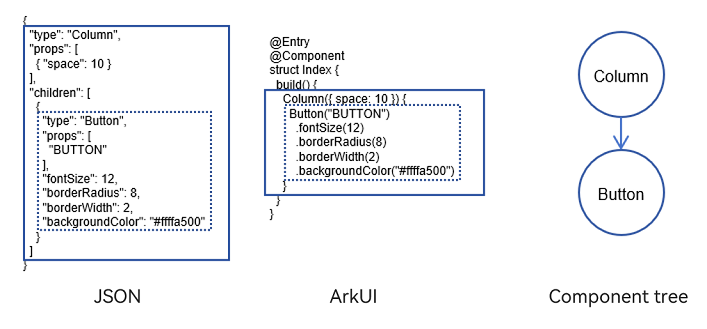
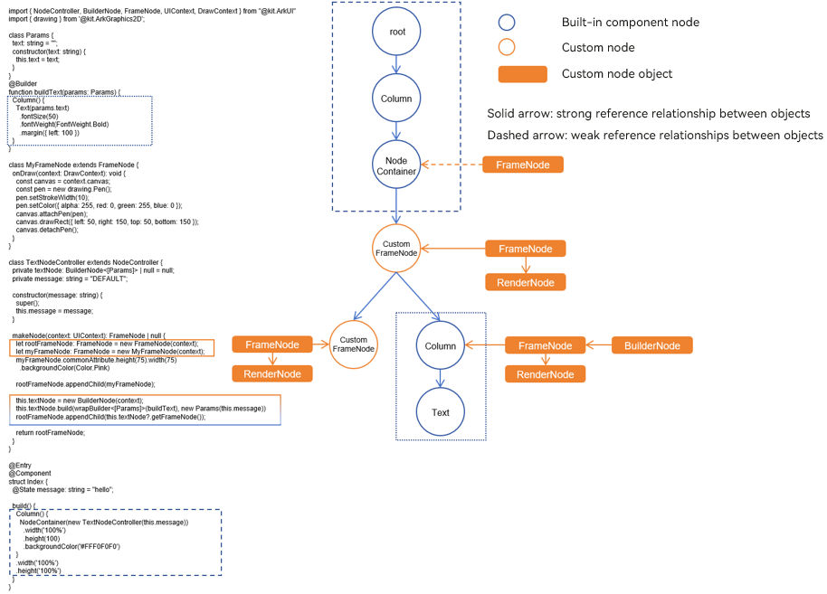

# Custom Component Node (FrameNode)

<!--Kit: ArkUI-->
<!--Subsystem: ArkUI-->
<!--Owner: @wangyang2022-->
<!--Designer: @wangyang2022-->
<!--Tester: @sally__-->
<!--Adviser: @Brilliantry_Rui-->
<!-- md-trans-meta sourceCommit=82cbd61bf5a97c687ddb974e4186cc744a8f06f2 translatedAt=2026-08-05T01:24:36.752Z pushedAt=2026-08-05T01:38:21.860Z -->

## Overview

For third-party frameworks with custom frontend definitions, such as those in JSON, XML, or a DOM tree, a conversion from the specific DSL into ArkUI's declarative descriptions is necessary. The following figure shows the mapping between a frontend framework defined by JSON and the ArkUI declarative description.



The aforementioned conversion process, which relies on additional data-driven bindings to the [Builder](../ui/state-management/arkts-builder.md), is complex and can be performance-intensive. Such frameworks typically leverage ArkUI's layout and event handling, as well as basic node operations and customization capabilities. Most components are implemented through customization, but some system components need to be used in combination to achieve hybrid display. For example, the figure below uses both the custom drawing method of [FrameNode](../reference/apis-arkui/js-apis-arkui-frameNode.md) and the system components [Column](../reference/apis-arkui/arkui-ts/ts-container-column.md) and its child [Text](../reference/apis-arkui/arkui-ts/ts-basic-components-text.md), which are mounted onto the root node's FrameNode via [BuilderNode](../reference/apis-arkui/js-apis-arkui-builderNode.md) for hybrid rendering.



This is where [FrameNode](../reference/apis-arkui/js-apis-arkui-frameNode.md) comes into the picture. **FrameNode** represents an entity node in the component tree. It is used in conjunction with the custom placeholder container component, [NodeContainer](../reference/apis-arkui/arkui-ts/ts-basic-components-nodecontainer.md), to construct a custom node tree inside the placeholder container. This node tree supports dynamic operations, including node addition, modification, and removal. Basic FrameNodes provide functionality for setting universal attributes and event callbacks, as well as comprehensive customization capabilities for measurement, layout, and rendering.

Moreover, the ArkUI framework enables obtaining and traversing proxy FrameNode objects for built-in components, known as proxy nodes, which facilitate UI tree traversal and allow for obtaining specific information about built-in components or registering additional event listeners.

## Creating and Removing Nodes

You can create and remove nodes with **FrameNode**. You can create a custom instance of **FrameNode** using its constructor, and the instance thereby created corresponds to an entity node. You can use the [dispose](../reference/apis-arkui/js-apis-arkui-frameNode.md#dispose12) API in **FrameNode** to break the binding with the entity node.

> **NOTE**
>
> - A valid **UIContext** object is required for creating a FrameNode. If no **UIContext** object is provided or if the provided one is invalid, an exception will be thrown during node creation.
>
> - Maintain UI context consistency for custom placeholder components to prevent display issues.
>
> - **FrameNode** objects are subject to garbage collection (GC) if not retained.

## Checking Whether a Node is Modifiable

Use [isModifiable](../reference/apis-arkui/js-apis-arkui-frameNode.md#ismodifiable12) to check whether the current node is a proxy for a built-in component. If a FrameNode serves as a proxy, it cannot be modified, which means you cannot change its properties or the structure of its child nodes.

## Obtaining the Corresponding RenderNode

Use the [getRenderNode](../reference/apis-arkui/js-apis-arkui-frameNode.md#getrendernode) API to obtain the RenderNode associated with the FrameNode. You can then perform operations on the obtained RenderNode object to dynamically modify the drawing-related properties of the FrameNode. For details about the properties that can be modified, see [RenderNode](../reference/apis-arkui/js-apis-arkui-renderNode.md).

> **NOTE**
>
> - You cannot obtain the RenderNode for a built-in component's proxy FrameNode.
> 
> - In **BuilderNode**, you can use [getFrameNode](../reference/apis-arkui/js-apis-arkui-builderNode.md#getframenode) to get the FrameNode object, and then use **getRenderNode** to obtain the RenderNode object of the corresponding root node.

## Operating the Node Tree

With **FrameNode**, you can add, delete, query, and modify nodes, thereby changing the subtree structure of non-proxy nodes. You can also query the parent-child relationships to obtain the results.

> **NOTE**
>
> Illegal operations for adding, deleting, or modifying nodes will result in exceptions.
>
> Proxy nodes obtained through queries are read-only. They can be used to obtain node information, but cannot modify node properties. These proxy nodes do not hold references to the underlying component entity nodes and therefore do not affect the lifecycle of the corresponding nodes.
>
> Node queries only return UI-related nodes and do not include syntax nodes.
>
> In scenarios using custom components, you may query and obtain newly added nodes of the custom components, with the node type being **\_\_Common\_\_**.

<!-- @[frameNodeTree_start](https://gitcode.com/openharmony/applications_app_samples/blob/master/code/DocsSample/ArkUISample/FrameNode/entry/src/main/ets/pages/framenode/FrameNodeTree.ets) --> 

``` TypeScript
import { BuilderNode, FrameNode, NodeController, UIContext } from '@kit.ArkUI';
import { BusinessError } from '@kit.BasicServicesKit';
import { hilog } from '@kit.PerformanceAnalysisKit';

const TEST_TAG: string = 'FrameNode'

class Params {
  public text: string = 'this is a text'
}

@Builder
function buttonBuilder(params: Params) {
  Column({ space: 10 }) {
    Button(params.text)
      .fontSize(12)
      .borderRadius(8)
      .borderWidth(2)
      .backgroundColor(Color.Orange)

    Button(params.text)
      .fontSize(12)
      .borderRadius(8)
      .borderWidth(2)
      .backgroundColor(Color.Pink)
  }
}

class MyNodeController extends NodeController {
  public buttonNode: BuilderNode<[Params]> | null = null;
  public frameNode: FrameNode | null = null;
  public childList: Array<FrameNode> = new Array<FrameNode>();
  public rootNode: FrameNode | null = null;
  private uiContext: UIContext | null = null;
  private wrapBuilder: WrappedBuilder<[Params]> = wrapBuilder(buttonBuilder);

  makeNode(uiContext: UIContext): FrameNode | null {
    this.uiContext = uiContext;
    if (this.rootNode === null) {
      this.rootNode = new FrameNode(uiContext);
      this.rootNode.commonAttribute
        .width('50%')
        .height(100)
        .borderWidth(1)
        .backgroundColor(Color.Gray)
    }

    if (this.frameNode === null) {
      this.frameNode = new FrameNode(uiContext);
      this.frameNode.commonAttribute
        .width('100%')
        .height(50)
        .borderWidth(1)
        .position({ x: 200, y: 0 })
        .backgroundColor(Color.Pink);
      this.rootNode.appendChild(this.frameNode);
    }
    if (this.buttonNode === null) {
      this.buttonNode = new BuilderNode<[Params]>(uiContext);
      this.buttonNode.build(this.wrapBuilder, { text: 'This is a Button' })
      this.rootNode.appendChild(this.buttonNode.getFrameNode())
    }
    return this.rootNode;
  }

  operationFrameNodeWithFrameNode(frameNode: FrameNode | undefined | null) {
    if (frameNode) {
      hilog.info(0x0000, `${TEST_TAG} get ArkTSNode success.`, 'success')
      hilog.info(0x0000, `${TEST_TAG} check rootNode whether is modifiable ${frameNode.isModifiable()}`,
        'isModifiable');
    }
    if (this.uiContext) {
      let frameNode1 = new FrameNode(this.uiContext);
      let frameNode2 = new FrameNode(this.uiContext);
      frameNode1.commonAttribute.size({ width: 50, height: 50 })
        .backgroundColor(Color.Black)
        .position({ x: 50, y: 60 })
      frameNode2.commonAttribute.size({ width: 50, height: 50 })
        .backgroundColor(Color.Orange)
        .position({ x: 120, y: 60 })
      try {
        frameNode?.appendChild(frameNode1);
        hilog.info(0x0000, `${TEST_TAG} appendChild success`, 'success');
      } catch (err) {
        hilog.error(0x0000, `${TEST_TAG} appendChild fail :${(err as BusinessError).code}:
        ${(err as BusinessError).message}`, 'appendChild error');
      }
      try {
        frameNode?.insertChildAfter(frameNode2, null);
        hilog.info(0x0000, `${TEST_TAG} insertChildAfter success `, 'success');
      } catch (err) {
        hilog.error(0x0000, `${TEST_TAG} insertChildAfter fail :${(err as BusinessError).code}:
        ${(err as BusinessError).message}`, 'insertChildAfter error');
      }
      setTimeout(() => {
        try {
          frameNode?.removeChild(frameNode?.getChild(0))
          hilog.info(0x0000, `${TEST_TAG} removeChild success`, 'success');
        } catch (err) {
          hilog.error(0x0000, `${TEST_TAG} removeChild fail :${(err as BusinessError).code} :
          ${(err as BusinessError).message}`, 'removeChild error');
        }
      }, 2000)
      setTimeout(() => {
        try {
          frameNode?.clearChildren();
          hilog.info(0x0000, `${TEST_TAG} clearChildren success `, 'success');
        } catch (err) {
          hilog.error(0x0000, `${TEST_TAG} clearChildren fail: ${(err as BusinessError).code}:
          ${(err as BusinessError).message}`, 'clearChildren error');
        }
      }, 4000)
    }
  }

  testInterfaceAboutSearch(frameNode: FrameNode | undefined | null): string {
    let result: string = '';
    if (frameNode) {
      result = result + `current node is ${frameNode.getNodeType()} \n`;
      result = result + `parent node is ${frameNode.getParent()?.getNodeType()} \n`;
      result = result + `child count is ${frameNode.getChildrenCount()} \n`;
      result = result + `first child node is ${frameNode.getFirstChild()?.getNodeType()} \n`;
      result = result + `second child node is ${frameNode.getChild(1)?.getNodeType()} \n`;
      result = result + `previousSibling node is ${frameNode.getPreviousSibling()?.getNodeType()} \n`;
      result = result + `nextSibling node is ${frameNode.getNextSibling()?.getNodeType()} \n`;
    }
    return result;
  }

  checkAppendChild(parent: FrameNode | undefined | null, child: FrameNode | undefined | null) {
    try {
      if (parent && child) {
        parent.appendChild(child);
        hilog.info(0x0000, `${TEST_TAG} appendChild success`, 'success');
      }
    } catch (err) {
      console.error(`${TEST_TAG} appendChild fail : ${(err as BusinessError).code} : ${(err as BusinessError).message}`);
    }
  }
}

@Entry
@Component
struct Index {
  @State index: number = 0;
  @State result: string = ''
  private myNodeController: MyNodeController = new MyNodeController();

  build() {
    Flex({ direction: FlexDirection.Column, alignItems: ItemAlign.Center, justifyContent: FlexAlign.SpaceBetween }) {
      List({ space: 20, initialIndex: 0 }) {
        ListItem() {
          Column({ space: 5 }) {
            /**
             * Replace $r('app.string.Verify_The_Child_Node_Function_Of_FrameNode') with the actual resource file.
             * In this example, the value in the resource file is "Verify the addition, deletion, and modification of FrameNode child nodes."
             */
            Text($r('app.string.Verify_The_Child_Node_Function_Of_FrameNode'))
            // Replace $r('app.string.Operate_On_Custom_FrameNode') with the actual resource file. In this example, the value in the resource file is "Perform operations on the custom FrameNode."
            Button($r('app.string.Operate_On_Custom_FrameNode'))
              .fontSize(16)
              .width(400)
              .onClick(() => {
                // Add, delete, and modify FrameNode child nodes, which is properly implemented.
                this.myNodeController.operationFrameNodeWithFrameNode(this.myNodeController?.frameNode);
              })
            /**
             * Replace $r('app.string.Operate_On_Proxy_Nodes_In_BuilderNode') with the actual resource file.
             * In this example, the value in the resource file is "Perform operations on the proxy nodes in BuilderNode."
             */
            Button($r('app.string.Operate_On_Proxy_Nodes_In_BuilderNode'))
              .fontSize(16)
              .width(400)
              .onClick(() => {
                // Add, delete, and modify the BuilderNode proxy node to generate an exception.
                this.myNodeController.operationFrameNodeWithFrameNode
                (this.myNodeController?.buttonNode?.getFrameNode());
              })
            /**
             * Replace $r('app.string.Operate_On_Proxy_Nodes_In_System_Components') with the actual resource file.
             * In this example, the value in the resource file is "Perform operations on the proxy nodes in the system components."
             */
            Button($r('app.string.Operate_On_Proxy_Nodes_In_System_Components'))
              .fontSize(16)
              .width(400)
              .onClick(() => {
                // Add, delete, and modify the proxy node to generate an exception.
                this.myNodeController.operationFrameNodeWithFrameNode(this.myNodeController?.rootNode?.getParent());
              })
          }
        }

        ListItem() {
          Column({ space: 5 }) {
            /**
             * Replace $r('app.string.Verify_Special_Scenarios_Of_FrameNode_Adding_Child_Nodes') with the actual resource file.
             * In this example, the value in the resource file is "Verify the special scenario where a child node is added to FrameNode."
             */
            Text($r('app.string.Verify_Special_Scenarios_Of_FrameNode_Adding_Child_Nodes'))
            // Replace $r('app.string.Add_Proxy_Nodes_Of_BuilderNode') with the actual resource file. In this example, the value in the resource file is "Add proxy nodes of BuilderNode."
            Button($r('app.string.Add_Proxy_Nodes_Of_BuilderNode'))
              .fontSize(16)
              .width(400)
              .onClick(() => {
                let buttonNode = new BuilderNode<[Params]>(this.getUIContext());
                buttonNode.build(wrapBuilder<[Params]>(buttonBuilder), { text: 'BUTTON' })
                this.myNodeController.checkAppendChild(this.myNodeController?.frameNode, buttonNode?.getFrameNode());
              })
            // Replace $r('app.string.Add_Proxy_Nodes_Of_System_Components') with the actual resource file. In this example, the value in the resource file is "Add proxy nodes of system components."
            Button($r('app.string.Add_Proxy_Nodes_Of_System_Components'))
              .fontSize(16)
              .width(400)
              .onClick(() => {
                this.myNodeController.checkAppendChild(this.myNodeController?.frameNode,
                  this.myNodeController?.rootNode?.getParent());
              })
            // Replace $r('app.string.Add_Custom_Nodes_With_Existing_Parent_Nodes') with the actual resource file. In this example, the value in the resource file is "Add custom nodes with existing parent nodes."
            Button($r('app.string.Add_Custom_Nodes_With_Existing_Parent_Nodes'))
              .fontSize(16)
              .width(400)
              .onClick(() => {
                this.myNodeController.checkAppendChild(this.myNodeController?.frameNode,
                  this.myNodeController?.rootNode);
              })
          }
        }

        ListItem() {
          Column({ space: 5 }) {
            // Replace $r('app.string.Verify_Query_Function_Of_FrameNode') with the actual resource file. In this example, the value in the resource file is "Query the FrameNode."
            Text($r('app.string.Verify_Query_Function_Of_FrameNode'))
            // Replace $r('app.string.Operate_On_Custom_FrameNode_Again') with the actual resource file. In this example, the value in the resource file is "Perform operations on the custom FrameNode."
            Button($r('app.string.Operate_On_Custom_FrameNode_Again'))
              .fontSize(16)
              .width(400)
              .onClick(() => {
                // Query the FrameNode. The current node is a child node of NodeContainer.
                this.result = this.myNodeController.testInterfaceAboutSearch(this.myNodeController?.rootNode);
                setTimeout(() => {
                  // Query the FrameNode. The current node is the first child node under rootNode.
                  this.result = this.myNodeController.testInterfaceAboutSearch(this.myNodeController?.frameNode);
                }, 2000)
              })
            /**
             * Replace $r('app.string.Operate_On_Proxy_Nodes_In_BuilderNode_Again') with the actual resource file.
             * In this example, the value in the resource file is "Perform operations on the proxy nodes in BuilderNode."
             */
            Button($r('app.string.Operate_On_Proxy_Nodes_In_BuilderNode_Again'))
              .fontSize(16)
              .width(400)
              .onClick(() => {
                // Query the BuilderNode proxy node. The current node is the Column node in BuilderNode.
                this.result =
                  this.myNodeController.testInterfaceAboutSearch(this.myNodeController?.buttonNode?.getFrameNode());
              })
            /**
             * Replace $r('app.string.Operate_On_Proxy_Nodes_In_System_Components_Again') with the actual resource file.
             * In this example, the value in the resource file is "Perform operations on the proxy nodes in the system components."
             */
            Button($r('app.string.Operate_On_Proxy_Nodes_In_System_Components_Again'))
              .fontSize(16)
              .width(400)
              .onClick(() => {
                // Query the proxy node. The current node is the NodeContainer.
                this.result =
                  this.myNodeController.testInterfaceAboutSearch(this.myNodeController?.rootNode?.getParent());
              })
          }
        }
      }.height('50%')

      Text(`Result: \n${this.result}`)
        .fontSize(16)
        .width(400)
        .height(200)
        .padding(30)
        .borderWidth(1)
      Column() {
        Text('This is a NodeContainer.')
          .textAlign(TextAlign.Center)
          .borderRadius(10)
          .backgroundColor(0xFFFFFF)
          .width('100%')
          .fontSize(16)
        NodeContainer(this.myNodeController)
          .borderWidth(1)
          .width(400)
          .height(150)
      }
    }
    .padding({
      left: 35,
      right: 35,
      top: 35,
      bottom: 35
    })
    .width('100%')
    .height('100%')
  }
}
```

## Using moveTo to Move an Imperative Node

Use the [moveTo](../reference/apis-arkui/js-apis-arkui-frameNode.md#moveto18) API to move a FrameNode to a new parent node, enabling dynamic modifications to the node tree structure.

> **NOTE**
>
> If the current FrameNode is not modifiable, an exception is thrown.
>
> When the target parent node is [typeNode](../reference/apis-arkui/js-apis-arkui-frameNode.md#typenode12), the system validates both the types and quantity of child components. Failed validation results in an exception. For specific constraints, see [typeNode](../reference/apis-arkui/js-apis-arkui-frameNode.md#typenode12).
>
> Imperative nodes without component types cannot be moved.
>
> Only the following [TypedFrameNode](../reference/apis-arkui/js-apis-arkui-frameNode.md#typedframenode12) types are supported: [Stack](../reference/apis-arkui/js-apis-arkui-frameNode.md#stack12) and [XComponent](../reference/apis-arkui/js-apis-arkui-frameNode.md#xcomponent12). This API does not work for other node types.
>
> Currently, only [BuilderNode](../reference/apis-arkui/js-apis-arkui-builderNode.md#buildernode-1) instances with the following root component types support move operations: [Stack](../reference/apis-arkui/arkui-ts/ts-container-stack.md), [XComponent](../reference/apis-arkui/arkui-ts/ts-basic-components-xcomponent.md), and [EmbeddedComponent](../reference/apis-arkui/arkui-ts/ts-container-embedded-component.md). This API does not work for other component types.

<!-- @[frameNodeMoveTo_start](https://gitcode.com/openharmony/applications_app_samples/blob/master/code/DocsSample/ArkUISample/FrameNode/entry/src/main/ets/pages/framenode/FrameNodeMoveTo.ets) --> 

``` TypeScript
import { FrameNode, NodeController, UIContext, typeNode } from '@kit.ArkUI';

class MyNodeController extends NodeController {
  public uiContext: UIContext | null = null;
  public rootNode: FrameNode | null = null;
  public rowNode: FrameNode | null = null;
  public stackNode1: FrameNode | null = null;
  public stackNode2: FrameNode | null = null;
  public stackNode3: FrameNode | null = null;

  makeNode(uiContext: UIContext): FrameNode | null {
    this.uiContext = uiContext;
    this.rootNode = new FrameNode(uiContext);

    const row = typeNode.createNode(this.uiContext, 'Row');
    row.initialize({ space: 10 });
    this.rowNode = row;
    this.rootNode.appendChild(this.rowNode);

    const stack1 = typeNode.createNode(this.uiContext, 'Stack');
    stack1.commonAttribute.width(50).height(50).backgroundColor(Color.Pink);
    this.stackNode1 = stack1;
    this.rowNode?.appendChild(this.stackNode1);
    const stack2 = typeNode.createNode(this.uiContext, 'Stack');
    stack2.commonAttribute.width(50).height(50).backgroundColor(Color.Yellow);
    this.stackNode2 = stack2;
    this.rowNode?.appendChild(this.stackNode2);
    const stack3 = typeNode.createNode(this.uiContext, 'Stack');
    stack3.commonAttribute.width(50).height(50).backgroundColor(Color.Green);
    this.stackNode3 = stack3;
    this.rowNode?.appendChild(this.stackNode3);

    return this.rootNode;
  }
}

@Entry
@Component
struct Index {
  private myNodeController1: MyNodeController = new MyNodeController()
  private myNodeController2: MyNodeController = new MyNodeController()

  build() {
    Column({ space: 20 }) {
      NodeContainer(this.myNodeController1)
      NodeContainer(this.myNodeController2)
      Button('move')
        .onClick(() => {
          this.myNodeController1.stackNode1?.moveTo(this.myNodeController2.rowNode, 2);
        })
    }
    .height('100%')
    .width('100%')
  }
}
``` 


## Setting Universal Attributes and Event Callbacks

Use the [commonAttribute](../reference/apis-arkui/js-apis-arkui-frameNode.md#commonattribute12) and [commonEvent](../reference/apis-arkui/js-apis-arkui-frameNode.md#commonevent12)objects to set the [universal attributes](../reference/apis-arkui/arkui-ts/ts-component-general-attributes.md) and [event callbacks](../reference/apis-arkui/arkui-ts/ts-uicommonevent.md), respectively.

> **NOTE**
> 
> - Proxy node attributes are immutable. Therefore, **commonAttribute** is ineffective on proxy nodes.
> 
> - The custom basic events that you define run in parallel with the events predefined in the built-in components, without overriding them. When two event callbacks are set, the built-in component event callback is prioritized.

<!-- @[frameNodeCommon_start](https://gitcode.com/openharmony/applications_app_samples/blob/master/code/DocsSample/ArkUISample/FrameNode/entry/src/main/ets/pages/framenode/FrameNodeCommon.ets) --> 

``` TypeScript
import { BuilderNode, FrameNode, NodeController, UIContext } from '@kit.ArkUI';
import { hilog } from '@kit.PerformanceAnalysisKit';

class Params {
  public text: string = 'this is a text';
}

@Builder
function buttonBuilder(params: Params) {
  Button(params.text)
    .fontSize(12)
    .borderRadius(8)
    .borderWidth(2)
    .backgroundColor(Color.Orange)
    .onClick((event: ClickEvent) => {
      hilog.info(0x0000, `Button ${JSON.stringify(event)}`, 'isClicked');
    })
}

class MyNodeController extends NodeController {
  public buttonNode: BuilderNode<[Params]> | null = null;
  public frameNode: FrameNode | null = null;
  public rootNode: FrameNode | null = null;
  private wrapBuilder: WrappedBuilder<[Params]> = wrapBuilder(buttonBuilder);

  makeNode(uiContext: UIContext): FrameNode | null {
    if (this.rootNode === null) {
      this.rootNode = new FrameNode(uiContext);
      // Modify the attributes of rootNode, which is a custom FrameNode, and the changes take effect.
      this.rootNode.commonAttribute
        .width('100%')
        .height(100)
        .borderWidth(1)
        .backgroundColor(Color.Gray)
    }

    if (this.frameNode === null) {
      this.frameNode = new FrameNode(uiContext);
      // Modify the attributes of frameNode, which is a custom FrameNode, and the changes take effect.
      this.frameNode.commonAttribute
        .width('50%')
        .height(50)
        .borderWidth(1)
        .backgroundColor(Color.Pink);
      this.rootNode.appendChild(this.frameNode);
    }
    if (this.buttonNode === null) {
      this.buttonNode = new BuilderNode<[Params]>(uiContext);
      this.buttonNode.build(this.wrapBuilder, { text: 'This is a Button' });
      // Modify the attributes of the FrameNode obtained from BuilderNode, which is not a custom FrameNode, and the changes do not take effect.
      this.buttonNode?.getFrameNode()?.commonAttribute.position({ x: 100, y: 100 });
      this.rootNode.appendChild(this.buttonNode.getFrameNode());
    }
    return this.rootNode;
  }

  modifyNode(frameNode: FrameNode | null | undefined, sizeValue: SizeOptions, positionValue: Position) {
    if (frameNode) {
      frameNode.commonAttribute.size(sizeValue).position(positionValue);
    }
  }

  addClickEvent(frameNode: FrameNode | null | undefined) {
    if (frameNode) {
      frameNode.commonEvent.setOnClick((event: ClickEvent) => {
        console.info(`FrameNode ${JSON.stringify(event)}`);
      })
    }
  }
}

@Entry
@Component
struct Index {
  private myNodeController: MyNodeController = new MyNodeController();

  build() {
    Flex({ direction: FlexDirection.Column, alignItems: ItemAlign.Center, justifyContent: FlexAlign.SpaceBetween }) {
      Column({ space: 10 }) {
        // Replace $r('app.string.Modify_Node_Common_Properties_Width_And_Height') with the actual resource file. In this example, the value in the resource file is "Modify general node properties: width and height."
        Text($r('app.string.Modify_Node_Common_Properties_Width_And_Height'))
        Button('modify ArkTS-FrameNode')
          .onClick(() => {
            // The object obtained is the FrameNode created on the current page, which can be modified. That is, the size and position of the node can be changed.
            hilog.info(0x0000, `Check the whether the node can be modified ${this.myNodeController?.frameNode
            ?.isModifiable()}`, 'isClicked');
            this.myNodeController.modifyNode(this.myNodeController?.frameNode, { width: 150, height: 100 }, {
              x: 100,
              y: 0
            });
          })
        Button('modify FrameNode get by BuilderNode')
          .onClick(() => {
            // The object obtained is the root node of the BuilderNode on the current page, which cannot be modified. That is, the size and position of the node remain unchanged.
            hilog.info(0x0000, `Check the whether the node can be modified
            ${this.myNodeController?.buttonNode?.getFrameNode()
            ?.isModifiable()}`, 'isClicked');
            this.myNodeController.modifyNode(this.myNodeController?.buttonNode?.getFrameNode(), {
              width: 100,
              height: 100
            }, { x: 50, y: 50 });
          })
        Button('modify proxyFrameNode get by search')
          .onClick(() => {
            // The rootNode object calling getParent() obtains the NodeContainer node on the current page, which cannot be modified. That is, the size and position of the node remain unchanged.
            hilog.info(0x0000,
              `Check the whether the node can be modified ${this.myNodeController?.rootNode?.getParent()
              ?.isModifiable()}`, 'isClicked');
            this.myNodeController.modifyNode(this.myNodeController?.rootNode?.getParent(), {
              width: 500,
              height: 500
            }, {
              x: 0,
              y: 0
            });
          })
      }
      .padding({
        left: 35,
        right: 35,
        top: 35,
        bottom: 35
      })

      Column({ space: 10 }) {
        // Replace $r('app.string.Modify_Node_Click_Event') with the actual resource file. In this example, the value in the resource file is "Modify the node click event."
        Text($r('app.string.Modify_Node_Click_Event'))
        Button('add click event to ArkTS-FrameNode')
          .onClick(() => {
            // The object obtained is the FrameNode created on the current page, to which click events can be added.
            // The added click event participates in event competition, meaning the click event is consumed at this node and does not bubble up to the parent component.
            hilog.info(0x0000,
              `Check the whether the node can be modified ${this.myNodeController?.rootNode?.getParent()
              ?.isModifiable()}`, 'isClicked');
            this.myNodeController.addClickEvent(this.myNodeController?.frameNode);
          })
        Button('add click event to FrameNode get by BuilderNode')
          .onClick(() => {
            // The object obtained is the root node of the BuilderNode on the current page, to which click events can be added.
            // When the button is clicked, the click event callback set through the built-in component API is called first, followed by the click listener added through commonEvent.
            hilog.info(0x0000, `Check the whether the node can be modified
            ${this.myNodeController?.buttonNode?.getFrameNode()
            ?.isModifiable()}`, 'isClicked');
            this.myNodeController.addClickEvent(this.myNodeController?.buttonNode?.getFrameNode());
          })
        Button('add click event to proxyFrameNode get by search')
          .onClick(() => {
            // The rootNode object calling getParent() obtains the NodeContainer node on the current page, to which click events can be added.
            hilog.info(0x0000,
              `Check the whether the node can be modified ${this.myNodeController?.rootNode?.getParent()
              ?.isModifiable()}`, 'isClicked');
            this.myNodeController.addClickEvent(this.myNodeController?.rootNode?.getParent());
          })
      }
      .padding({
        left: 35,
        right: 35,
        top: 35,
        bottom: 35
      })

      NodeContainer(this.myNodeController)
        .borderWidth(1)
        .width('100%')
        .height(100)
        .onClick((event: ClickEvent) => {
          hilog.info(0x0000, `NodeContainer ${JSON.stringify(event)}`, 'isClicked');
        })
    }
    .padding({
      left: 35,
      right: 35,
      top: 35,
      bottom: 35
    })
    .width('100%')
    .height('100%')
  }
}
```

## Implementing Custom Measurement, Layout, and Drawing

By overriding the [onDraw](../reference/apis-arkui/js-apis-arkui-frameNode.md#ondraw12) API, you can customize the drawing content of the FrameNode. Use the [invalidate](../reference/apis-arkui/js-apis-arkui-frameNode.md#invalidate12) API to manually trigger a redraw of the node.

By overriding the [onMeasure](../reference/apis-arkui/js-apis-arkui-frameNode.md#onmeasure12) API, you can customize how the FrameNode measures its size. Use [measure](../reference/apis-arkui/js-apis-arkui-frameNode.md#measure12) to proactively pass layout constraints to initiate a remeasurement.

By overriding the [onLayout](../reference/apis-arkui/js-apis-arkui-frameNode.md#onlayout12) API, you can customize the layout of the FrameNode. Use [layout](../reference/apis-arkui/js-apis-arkui-frameNode.md#layout12) to proactively pass position information and initiate a re-layout.

Use [setNeedsLayout](../reference/apis-arkui/js-apis-arkui-frameNode.md#setneedslayout12) to mark the current node and trigger a re-layout in the next frame.

> **NOTE**
> 
> - After a node is disposed and unbound, the FrameNode no longer represents an entity node. In this case, the **invalidate** call cannot update the previously bound node.
> 
> - Custom drawings made through the **onDraw** API cannot exceed the component's size.

<!-- @[frameNodeDraw_start](https://gitcode.com/openharmony/applications_app_samples/blob/master/code/DocsSample/ArkUISample/FrameNode/entry/src/main/ets/pages/framenode/FrameNodeDraw.ets) --> 

``` TypeScript
import { DrawContext, FrameNode, NodeController, Position, Size, UIContext, LayoutConstraint } from '@kit.ArkUI';
import { drawing } from '@kit.ArkGraphics2D';
import { hilog } from '@kit.PerformanceAnalysisKit';

function getChildLayoutConstraint(constraint: LayoutConstraint, child: FrameNode): LayoutConstraint {
  // Obtain the user-defined width and height of the child node.
  const size = child.getUserConfigSize();

  // Calculate the child node width.
  const width = Math.max(
    Math.min(constraint.maxSize.width, size.width.value),
    constraint.minSize.width
  );

  // Calculate the child node height.
  const height = Math.max(
    Math.min(constraint.maxSize.height, size.height.value),
    constraint.minSize.height
  );
  const finalSize: Size = { width, height };
  const res: LayoutConstraint = {
    maxSize: finalSize,
    minSize: finalSize,
    percentReference: finalSize
  };

  return res;
}

class MyFrameNode extends FrameNode {
  public width: number = 100;
  public offsetY: number = 0;
  private space: number = 1;
  private uiContext: UIContext;

  constructor(uiContext: UIContext) {
    super(uiContext);
    this.uiContext = uiContext;
  }

  // Override the layout measurement method.
  onMeasure(constraint: LayoutConstraint): void {
    let sizeRes: Size = { width: this.uiContext.vp2px(100), height: this.uiContext.vp2px(100) };

    // Iterate through all child nodes to calculate the total size.
    for (let i = 0; i < this.getChildrenCount(); i++) {
      let child = this.getChild(i);
      if (child) {
        let childConstraint = getChildLayoutConstraint(constraint, child);
        child.measure(childConstraint); // Trigger measurement of the child node.
        let size = child.getMeasuredSize();
        sizeRes.height += size.height + this.space;
        sizeRes.width = Math.max(sizeRes.width, size.width);
      }
    }
    this.setMeasuredSize(sizeRes);
  }

  // Override the layout arrangement method.
  onLayout(position: Position): void {
    for (let i = 0; i < this.getChildrenCount(); i++) {
      let child = this.getChild(i);
      if (child) {
        child.layout({
          x: this.uiContext.vp2px(100),
          y: this.uiContext.vp2px(this.offsetY)
        });
        let layoutPosition = child.getLayoutPosition();
        hilog.info(0x0000, 'testTag', `child position: ${JSON.stringify(layoutPosition)}`);
      }
    }
    this.setLayoutPosition(position);
  }

  // Override the custom drawing method.
  onDraw(context: DrawContext) {
    const canvas = context.canvas;
    const pen = new drawing.Pen();
    pen.setStrokeWidth(15);
    pen.setColor({
      alpha: 255,
      red: 255,
      green: 0,
      blue: 0
    });
    canvas.attachPen(pen);
    canvas.drawRect({
      left: 50,
      right: this.width + 50,
      top: 50,
      bottom: this.width + 50,
    });
    canvas.detachPen();
  }

  addWidth() {
    this.width = (this.width + 10) % 50 + 100;
  }
}

class MyNodeController extends NodeController {
  public rootNode: MyFrameNode | null = null;

  makeNode(context: UIContext): FrameNode | null {
    this.rootNode = new MyFrameNode(context);
    this.rootNode?.commonAttribute?.size({ width: 100, height: 100 }).backgroundColor(Color.Green);
    let frameNode: FrameNode = new FrameNode(context);
    this.rootNode.appendChild(frameNode);
    frameNode.commonAttribute.width(10).height(10).backgroundColor(Color.Pink);
    return this.rootNode;
  }
}

@Entry
@Component
struct Index {
  private nodeController: MyNodeController = new MyNodeController();

  build() {
    Row() {
      Column() {
        NodeContainer(this.nodeController)
          .width('100%')
          .height(200)
          .backgroundColor('#FFF0F0F0')

        // Trigger node redrawing.
        Button('Invalidate')
          .margin(10)
          .onClick(() => {
            this.nodeController?.rootNode?.addWidth();
            this.nodeController?.rootNode?.invalidate();
          })

        // Trigger layout update.
        Button('UpdateLayout')
          .onClick(() => {
            let node = this.nodeController.rootNode;
            node!.offsetY = (node!.offsetY + 10) % 110;
            this.nodeController?.rootNode?.setNeedsLayout();
          })
      }
      .width('100%')
      .height('100%')
    }
    .height('100%')
  }
}
```

## Searching for Nodes and Obtaining Basic Information

**FrameNode** provides APIs for obtaining basic information about an entity node. For details about the returned information, see the FrameNode API documentation.

To obtain a FrameNode, use any of the following methods:

1. Use [getFrameNodeById](../reference/apis-arkui/arkts-apis-uicontext-uicontext.md#getframenodebyid12).

2. Use [getFrameNodeByUniqueId](../reference/apis-arkui/arkts-apis-uicontext-uicontext.md#getframenodebyuniqueid12).

3. Use an [observer](../reference/apis-arkui/js-apis-arkui-observer.md).

> **NOTE**
>
> 1. Currently, the following information can be obtained:
>
> - Node size: [getMeasuredSize](../reference/apis-arkui/js-apis-arkui-frameNode.md#getmeasuredsize12), [getUserConfigSize](../reference/apis-arkui/js-apis-arkui-frameNode.md#getuserconfigsize12)
> 
> - Layout information: [getPositionToWindow](../reference/apis-arkui/js-apis-arkui-frameNode.md#getpositiontowindow12), [getPositionToParent](../reference/apis-arkui/js-apis-arkui-frameNode.md#getpositiontoparent12), [getLayoutPosition](../reference/apis-arkui/js-apis-arkui-frameNode.md#getlayoutposition12), [getUserConfigBorderWidth](../reference/apis-arkui/js-apis-arkui-frameNode.md#getuserconfigborderwidth12), [getUserConfigPadding](../reference/apis-arkui/js-apis-arkui-frameNode.md#getuserconfigpadding12), [getUserConfigMargin](../reference/apis-arkui/js-apis-arkui-frameNode.md#getuserconfigmargin12)
> 
> - Node information: [getId](../reference/apis-arkui/js-apis-arkui-frameNode.md#getid12), [getUniqueId](../reference/apis-arkui/js-apis-arkui-frameNode.md#getuniqueid12), [getNodeType](../reference/apis-arkui/js-apis-arkui-frameNode.md#getnodetype12), [getOpacity](../reference/apis-arkui/js-apis-arkui-frameNode.md#getopacity12), [isVisible](../reference/apis-arkui/js-apis-arkui-frameNode.md#isvisible12), [isClipToFrame](../reference/apis-arkui/js-apis-arkui-frameNode.md#iscliptoframe12), [isAttached](../reference/apis-arkui/js-apis-arkui-frameNode.md#isattached12), [getInspectorInfo](../reference/apis-arkui/js-apis-arkui-frameNode.md#getinspectorinfo12), [getCustomProperty](../reference/apis-arkui/js-apis-arkui-frameNode.md#getcustomproperty12)
>
> 2. UINode-type nodes, such as JsView nodes, [Span](../../application-dev/reference/apis-arkui/arkui-ts/ts-basic-components-span.md), [ContainerSpan](../../application-dev/reference/apis-arkui/arkui-ts/ts-basic-components-containerspan.md), [ContentSlot](../../application-dev/reference/apis-arkui/arkui-ts/ts-components-contentSlot.md), [ForEach](../../application-dev/reference/apis-arkui/arkui-ts/ts-rendering-control-foreach.md), [LazyForEach](../../application-dev/reference/apis-arkui/arkui-ts/ts-rendering-control-lazyforeach.md), and **if/else** components, cannot be obtained.

## Obtaining Node Position Offset Information

**FrameNode** provides APIs to obtain the position offsets of nodes relative to the window, the parent component, and the screen: [getPositionToWindow](../reference/apis-arkui/js-apis-arkui-frameNode.md#getpositiontowindow12), [getPositionToParent](../reference/apis-arkui/js-apis-arkui-frameNode.md#getpositiontoparent12), [getPositionToScreen](../reference/apis-arkui/js-apis-arkui-frameNode.md#getpositiontoscreen12), [getGlobalPositionOnDisplay](../reference/apis-arkui/js-apis-arkui-frameNode.md#getglobalpositionondisplay20), [getPositionToWindowWithTransform](../reference/apis-arkui/js-apis-arkui-frameNode.md#getpositiontowindowwithtransform12), [getPositionToParentWithTransform](../reference/apis-arkui/js-apis-arkui-frameNode.md#getpositiontoparentwithtransform12), [getPositionToScreenWithTransform](../reference/apis-arkui/js-apis-arkui-frameNode.md#getpositiontoscreenwithtransform12), [getLayoutPosition](../reference/apis-arkui/js-apis-arkui-frameNode.md#getlayoutposition12), [getUserConfigBorderWidth](../reference/apis-arkui/js-apis-arkui-frameNode.md#getuserconfigborderwidth12), [getUserConfigPadding](../reference/apis-arkui/js-apis-arkui-frameNode.md#getuserconfigpadding12), [getUserConfigMargin](../reference/apis-arkui/js-apis-arkui-frameNode.md#getuserconfigmargin12).

The positional information obtained by the three APIs [getPositionToWindow](../reference/apis-arkui/js-apis-arkui-frameNode.md#getpositiontowindow12), [getPositionToParent](../reference/apis-arkui/js-apis-arkui-frameNode.md#getpositiontoparent12), and [getPositionToScreen](../reference/apis-arkui/js-apis-arkui-frameNode.md#getpositiontoscreen12) is illustrated in the figure below.


<!-- @[frameNodePosition_start](https://gitcode.com/openharmony/applications_app_samples/blob/master/code/DocsSample/ArkUISample/FrameNode/entry/src/main/ets/pages/framenode/FrameNodePosition.ets) --> 

``` TypeScript
import { NodeController, FrameNode, UIContext } from '@kit.ArkUI';
import { hilog } from '@kit.PerformanceAnalysisKit';

const TEST_TAG: string = 'FrameNode'

class MyNodeController extends NodeController {
  public frameNode: FrameNode | null = null;
  private rootNode: FrameNode | null = null;

  makeNode(uiContext: UIContext): FrameNode | null {
    this.rootNode = new FrameNode(uiContext);
    this.frameNode = new FrameNode(uiContext);
    this.rootNode.appendChild(this.frameNode);
    return this.rootNode;
  }

  getPositionToWindow() {
    let positionToWindow = this.rootNode?.getPositionToWindow(); // Obtain the position offset of the FrameNode relative to the window.
    hilog.info(0x0000, `${TEST_TAG} ${JSON.stringify(positionToWindow)}`, 'positionToWindow');
  }

  getPositionToParent() {
    let positionToParent = this.rootNode?.getPositionToParent(); // Obtain the position offset of the FrameNode relative to the parent component.
    hilog.info(0x0000, `${TEST_TAG} ${JSON.stringify(positionToParent)}`, 'positionToParent');
  }

  getPositionToScreen() {
    let positionToScreen = this.rootNode?.getPositionToScreen(); // Obtain the position offset of the FrameNode relative to the screen.
    hilog.info(0x0000, `${TEST_TAG} ${JSON.stringify(positionToScreen)}`, 'positionToScreen');
  }

  getGlobalPositionOnDisplay() {
    let positionOnGlobalDisplay = this.rootNode?.getGlobalPositionOnDisplay(); // Obtain the position offset of the FrameNode relative to the global display.
    hilog.info(0x0000, `${TEST_TAG} ${JSON.stringify(positionOnGlobalDisplay)}`, 'positionOnGlobalDisplay');
  }

  getPositionToWindowWithTransform() {
    let positionToWindowWithTransform =
      this.rootNode?.getPositionToWindowWithTransform(); // Obtain the position offset of the FrameNode relative to the window with drawing attributes.
    hilog.info(0x0000, `${TEST_TAG} ${JSON.stringify(positionToWindowWithTransform)}`, 'positionToWindowWithTransform');
  }

  getPositionToParentWithTransform() {
    let positionToParentWithTransform =
      this.rootNode?.getPositionToParentWithTransform(); // Obtain the position offset of the FrameNode relative to the parent component with drawing attributes.
    hilog.info(0x0000, `${TEST_TAG} ${JSON.stringify(positionToParentWithTransform)}`, 'positionToParentWithTransform');
  }

  getPositionToScreenWithTransform() {
    let positionToScreenWithTransform =
      this.rootNode?.getPositionToScreenWithTransform(); // Obtain the position offset of the FrameNode relative to the screen with drawing attributes.
    hilog.info(0x0000, `${TEST_TAG} ${JSON.stringify(positionToScreenWithTransform)}`, 'positionToScreenWithTransform');
  }
}

@Entry
@Component
struct Index {
  private myNodeController: MyNodeController = new MyNodeController();

  build() {
    Flex({ direction: FlexDirection.Column, alignItems: ItemAlign.Center, justifyContent: FlexAlign.SpaceBetween }) {
      Button('getPositionToWindow')
        .width(300)
        .onClick(() => {
          this.myNodeController.getPositionToWindow();
        })
      Button('getPositionToParent')
        .width(300)
        .onClick(() => {
          this.myNodeController.getPositionToParent();
        })
      Button('getPositionToScreen')
        .width(300)
        .onClick(() => {
          this.myNodeController.getPositionToScreen();
        })
      Button('getGlobalPositionOnDisplay')
        .width(300)
        .onClick(() => {
          this.myNodeController.getGlobalPositionOnDisplay();
        })
      Button('getPositionToParentWithTransform')
        .width(300)
        .onClick(() => {
          this.myNodeController.getPositionToParentWithTransform();
        })
      Button('getPositionToWindowWithTransform')
        .width(300)
        .onClick(() => {
          this.myNodeController.getPositionToWindowWithTransform();
        })
      Button('getPositionToScreenWithTransform')
        .width(300)
        .onClick(() => {
          this.myNodeController.getPositionToScreenWithTransform();
        })
      Column() {
        Text('This is a NodeContainer.')
          .textAlign(TextAlign.Center)
          .borderRadius(10)
          .backgroundColor(0xFFFFFF)
          .width('100%')
          .fontSize(16)
        NodeContainer(this.myNodeController)
          .borderWidth(1)
          .width(300)
          .height(100)
      }
    }
    .padding({
      left: 35,
      right: 35,
      top: 35,
      bottom: 35
    })
    .width('100%')
    .height('100%')
  }
}
```

## Creating a FrameNode of a Specific Type Using typeNode

When creating a FrameNode of a specific type using [typeNode](../reference/apis-arkui/js-apis-arkui-frameNode.md#typenode12), you can retrieve the attribute information set by the user through the attribute retrieval API.

<!-- @[frameNodeTypeNode_start](https://gitcode.com/openharmony/applications_app_samples/blob/master/code/DocsSample/ArkUISample/FrameNode/entry/src/main/ets/pages/framenode/FrameNodeTypeNode.ets) -->   

``` TypeScript
import { NodeController, FrameNode, UIContext, BuilderNode, typeNode } from '@kit.ArkUI';
import { hilog } from '@kit.PerformanceAnalysisKit';

class Params {
  text: string = '';

  constructor(text: string) {
    this.text = text;
  }
}

@Builder
function buildText(params: Params) {
  Column() {
    Text(params.text)
      .id('buildText')
      .border({ width: 1 })
      .padding(1)
      .fontSize(25)
      .fontWeight(FontWeight.Bold)
      .margin({ top: 10 })
      .visibility(Visibility.Visible)
      .opacity(0.7)
      .customProperty('key1', 'value1')
      .width(300)
  }
}

const TEST_TAG: string = 'FrameNode'

class MyNodeController extends NodeController {
  public frameNode: typeNode.Column | null = null;
  public uiContext: UIContext | undefined = undefined;
  private rootNode: FrameNode | null = null;
  private textNode: BuilderNode<[Params]> | null = null;
  public textTypeNode: typeNode.Text | null = null;
  private message: string = 'DEFAULT';

  makeNode(uiContext: UIContext): FrameNode | null {
    this.rootNode = new FrameNode(uiContext);
    this.uiContext = uiContext;
    this.frameNode = typeNode.createNode(uiContext, 'Column');
    this.frameNode.attribute
      .width('100%')
      .height('100%')
    this.rootNode.appendChild(this.frameNode);
    this.textNode = new BuilderNode(uiContext);
    this.textNode.build(wrapBuilder<[Params]>(buildText), new Params(this.message));
    this.frameNode.appendChild(this.textNode.getFrameNode());
    this.textTypeNode = typeNode.createNode(uiContext, 'Text');
    this.textTypeNode.initialize('textTypeNode')
      .fontSize(25)
      .visibility(Visibility.Visible)
      .id('textTypeNode')
    this.frameNode.appendChild(this.textTypeNode);
    return this.rootNode;
  }

  removeChild(frameNode: FrameNode) {
    let parent = frameNode.getParent();
    if (parent) {
      parent.removeChild(frameNode);

    }
  }

  getUserConfigBorderWidth(frameNode: FrameNode) {
    let userConfigBorderWidth = frameNode?.getUserConfigBorderWidth(); // Obtain the border width set by the user.
    hilog.info(0x0000, `${TEST_TAG} ${JSON.stringify(userConfigBorderWidth)}`, 'userConfigBorderWidth');
  }

  getUserConfigPadding(frameNode: FrameNode) {
    let userConfigPadding = frameNode?.getUserConfigPadding(); // Obtain the padding set by the user. 
    hilog.info(0x0000, `${TEST_TAG} ${JSON.stringify(userConfigPadding)}`, 'userConfigPadding');
  }

  getUserConfigMargin(frameNode: FrameNode) {
    let userConfigMargin = frameNode?.getUserConfigMargin(); // Obtain the margin set by the user.
    hilog.info(0x0000, `${TEST_TAG} ${JSON.stringify(userConfigMargin)}`, 'userConfigMargin');
  }

  getUserConfigSize(frameNode: FrameNode) {
    let userConfigSize = frameNode?.getUserConfigSize(); // Obtain the width and height set by the user.
    hilog.info(0x0000, `${TEST_TAG} ${JSON.stringify(userConfigSize)}`, 'userConfigSize');
  }

  getId(frameNode: FrameNode) {
    let id = frameNode?.getId(); // Obtain the node ID set by the user.
    hilog.info(0x0000, `${TEST_TAG} ${id}`, 'getId');
  }

  getUniqueId(frameNode: FrameNode) {
    let uniqueId = frameNode?.getUniqueId(); // Obtain the unique node ID allocated by the system.
    hilog.info(0x0000, `${TEST_TAG} ${uniqueId}`, 'uniqueId');
  }

  getNodeType(frameNode: FrameNode) {
    let nodeType = frameNode?.getNodeType(); // Obtain the node type.
    hilog.info(0x0000, `${TEST_TAG} ${nodeType}`, 'nodeType');
  }

  getOpacity(frameNode: FrameNode) {
    let opacity = frameNode?.getOpacity(); // Obtain the node opacity.
    hilog.info(0x0000, `${TEST_TAG} ${JSON.stringify(opacity)}`, 'opacity');
  }

  isVisible(frameNode: FrameNode) {
    let visible = frameNode?.isVisible(); // Obtain whether the node is visible.
    hilog.info(0x0000, `${TEST_TAG} ${JSON.stringify(visible)}`, 'visible');
  }

  isClipToFrame(frameNode: FrameNode) {
    let clipToFrame = frameNode?.isClipToFrame(); // Obtain whether the node is clipped to the component area.
    hilog.info(0x0000, `${TEST_TAG} ${JSON.stringify(clipToFrame)}`, 'clipToFrame');
  }

  isAttached(frameNode: FrameNode) {
    let attached = frameNode?.isAttached(); // Obtain whether a node is mounted to the main node tree.
    hilog.info(0x0000, `${TEST_TAG} ${JSON.stringify(attached)}`, 'attached');
  }

  getInspectorInfo(frameNode: FrameNode) {
    let inspectorInfo = frameNode?.getInspectorInfo(); // Obtain the structure information of the node.
    hilog.info(0x0000, `${TEST_TAG} ${JSON.stringify(inspectorInfo)}`, 'inspectorInfo');
  }
}

@Entry
@Component
struct Index {
  private myNodeController: MyNodeController = new MyNodeController();
  @State index: number = 0;

  build() {
    Flex({ direction: FlexDirection.Column, alignItems: ItemAlign.Center, justifyContent: FlexAlign.SpaceBetween }) {
      Column() {
        Text('This is a NodeContainer.')
          .textAlign(TextAlign.Center)
          .borderRadius(10)
          .backgroundColor(0xFFFFFF)
          .width('100%')
          .fontSize(16)
        NodeContainer(this.myNodeController)
          .borderWidth(1)
          .width(300)
          .height(100)
      }.height(200)

      Scroll() {
        Column({ space: 20 }) {
          Button('getUserConfigBorderWidth')
            .width(300)
            .onClick(() => {
              const uiContext: UIContext = this.getUIContext();
              if (uiContext) {
                const node: FrameNode | null = uiContext.getFrameNodeById('buildText') || null;
                if (node) {
                  this.myNodeController.getUserConfigBorderWidth(node);
                }
              }
            })
          Button('getUserConfigPadding')
            .width(300)
            .onClick(() => {
              const uiContext: UIContext = this.getUIContext();
              if (uiContext) {
                const node: FrameNode | null = uiContext.getFrameNodeById('buildText') || null;
                if (node) {
                  this.myNodeController.getUserConfigPadding(node);
                }
              }
            })
          Button('getUserConfigMargin')
            .width(300)
            .onClick(() => {
              const uiContext: UIContext = this.getUIContext();
              if (uiContext) {
                const node: FrameNode | null = uiContext.getFrameNodeById('buildText') || null;
                if (node) {
                  this.myNodeController.getUserConfigMargin(node);
                }
              }
            })
          Button('getUserConfigSize')
            .width(300)
            .onClick(() => {
              const uiContext: UIContext = this.getUIContext();
              if (uiContext) {
                const node: FrameNode | null = uiContext.getFrameNodeById('buildText') || null;
                if (node) {
                  this.myNodeController.getUserConfigSize(node);
                }
              }
            })
          Button('getId')
            .width(300)
            .onClick(() => {
              const uiContext: UIContext = this.getUIContext();
              if (uiContext) {
                const node: FrameNode | null = uiContext.getFrameNodeById('buildText') || null;
                if (node) {
                  this.myNodeController.getId(node);
                }
              }
            })
          Button('getUniqueId')
            .width(300)
            .onClick(() => {
              const uiContext: UIContext = this.getUIContext();
              if (uiContext) {
                const node: FrameNode | null = uiContext.getFrameNodeById('buildText') || null;
                if (node) {
                  this.myNodeController.getUniqueId(node);
                }
              }
            })
          Button('getNodeType')
            .width(300)
            .onClick(() => {
              const uiContext: UIContext = this.getUIContext();
              if (uiContext) {
                const node: FrameNode | null = uiContext.getFrameNodeById('buildText') || null;
                if (node) {
                  this.myNodeController.getNodeType(node);
                }
              }
            })
          Button('getOpacity')
            .width(300)
            .onClick(() => {
              const uiContext: UIContext = this.getUIContext();
              if (uiContext) {
                const node: FrameNode | null = uiContext.getFrameNodeById('buildText') || null;
                if (node) {
                  this.myNodeController.getOpacity(node);
                }
              }
            })
          Button('isVisible')
            .width(300)
            .onClick(() => {
              const uiContext: UIContext = this.getUIContext();
              if (uiContext) {
                const node: FrameNode | null = uiContext.getFrameNodeById('buildText') || null;
                if (node) {
                  this.myNodeController.isVisible(node);
                }
              }
            })
          Button('isClipToFrame')
            .width(300)
            .onClick(() => {
              const uiContext: UIContext = this.getUIContext();
              if (uiContext) {
                const node: FrameNode | null = uiContext.getFrameNodeById('buildText') || null;
                if (node) {
                  this.myNodeController.isClipToFrame(node);
                }
              }
            })
          Button('isAttached')
            .width(300)
            .onClick(() => {
              const uiContext: UIContext = this.getUIContext();
              if (uiContext) {
                const node: FrameNode | null = uiContext.getFrameNodeById('buildText') || null;
                if (node) {
                  this.myNodeController.isAttached(node);
                }
              }
            })
          Button('remove Text')
            .width(300)
            .onClick(() => {
              const uiContext: UIContext = this.getUIContext();
              if (uiContext) {
                const node: FrameNode | null = uiContext.getFrameNodeById('textTypeNode') || null;
                if (node) {
                  this.myNodeController.removeChild(node);
                  this.myNodeController.isAttached(node);
                }
              }
            })
          Button('getInspectorInfo')
            .width(300)
            .onClick(() => {
              const uiContext: UIContext = this.getUIContext();
              if (uiContext) {
                const node: FrameNode | null = uiContext.getFrameNodeById('buildText') || null;
                if (node) {
                  this.myNodeController.getInspectorInfo(node);
                }
              }
            })
          Button('getCustomProperty')
            .width(300)
            .onClick(() => {
              const uiContext: UIContext = this.getUIContext();
              if (uiContext) {
                const node: FrameNode | null = uiContext.getFrameNodeById('buildText') || null;
                if (node) {
                  const property = node.getCustomProperty('key1');
                  hilog.info(0x0000, TEST_TAG, JSON.stringify(property));
                }
              }
            })
        }
      }
    }
    .padding({
      left: 35,
      right: 35,
      top: 35,
      bottom: 35
    })
    .width('100%')
    .height('100%')
  }
}
```

## Disassociating the Current FrameNode Object from the Entity FrameNode

To disassociate the current **FrameNode** object from the entity FrameNode, call the [dispose](../reference/apis-arkui/js-apis-arkui-frameNode.md#dispose12) API.

> **NOTE**
>
> After the **dispose** API is called, the **FrameNode** object no longer corresponds to any actual FrameNode. At this point, attempting to call the following query APIs will cause the application to trigger a [JavaScript crash](../ui/arkts-stability-guide.md#javascript-crash-jscrash): [getMeasuredSize](../reference/apis-arkui/js-apis-arkui-frameNode.md#getmeasuredsize12), [getLayoutPosition](../reference/apis-arkui/js-apis-arkui-frameNode.md#getlayoutposition12), [getUserConfigBorderWidth](../reference/apis-arkui/js-apis-arkui-frameNode.md#getuserconfigborderwidth12), [getUserConfigPadding](../reference/apis-arkui/js-apis-arkui-frameNode.md#getuserconfigpadding12), [getUserConfigMargin](../reference/apis-arkui/js-apis-arkui-frameNode.md#getuserconfigmargin12), and [getUserConfigSize](../reference/apis-arkui/js-apis-arkui-frameNode.md#getuserconfigsize12).
>
> To check whether the current **FrameNode** object corresponds to an entity FrameNode, you can use [getUniqueId](../reference/apis-arkui/js-apis-arkui-frameNode.md#getuniqueid12) API. A **UniqueId** value greater than 0 indicates that the object is associated with an entity FrameNode.

<!-- @[frameNodeDisposed_start](https://gitcode.com/openharmony/applications_app_samples/blob/master/code/DocsSample/ArkUISample/FrameNode/entry/src/main/ets/pages/framenode/FrameNodeDisposed.ets) --> 

``` TypeScript
import { NodeController, FrameNode, BuilderNode } from '@kit.ArkUI';
import { hilog } from '@kit.PerformanceAnalysisKit';

const TEST_TAG: string = 'FrameNode';

@Component
struct TestComponent {
  build() {
    Column() {
      Text('This is a BuilderNode.')
        .fontSize(16)
        .fontWeight(FontWeight.Bold)
    }
    .width('100%')
    .backgroundColor(Color.Gray)
  }

  aboutToAppear() {
    console.info(`${TEST_TAG} aboutToAppear`);
  }

  aboutToDisappear() {
    console.info(`${TEST_TAG} aboutToDisappear`);
  }
}

@Builder
function buildComponent() {
  TestComponent()
}

class MyNodeController extends NodeController {
  private rootNode: FrameNode | null = null;
  private builderNode: BuilderNode<[]> | null = null;

  // Create and initialize the custom node tree.
  makeNode(uiContext: UIContext): FrameNode | null {
    this.rootNode = new FrameNode(uiContext);
    this.builderNode = new BuilderNode(uiContext, { selfIdealSize: { width: 200, height: 100 } });
    this.builderNode.build(new WrappedBuilder(buildComponent));

    const rootRenderNode = this.rootNode.getRenderNode();
    if (rootRenderNode !== null) {
      rootRenderNode.size = { width: 200, height: 200 };
      rootRenderNode.backgroundColor = 0xff00ff00;
      rootRenderNode.appendChild(this.builderNode!.getFrameNode()!.getRenderNode());
    }

    return this.rootNode;
  }

  // Print the unique ID of the node.
  printUniqueId(): void {
    if (this.rootNode !== null && this.builderNode !== null) {
      hilog.info(0x0000, `${TEST_TAG} rootNode's uniqueId: ${this.rootNode.getUniqueId()}`, 'isClicked');
      const frameNode = this.builderNode.getFrameNode();
      if (frameNode) {
        hilog.info(0x0000, `${TEST_TAG} the uniqueId of builderNode's framenode: ${frameNode.getUniqueId()}`,
          'isClicked');
      } else {
        hilog.info(0x0000, `${TEST_TAG} builderNode's framenode is undefined`, 'isClicked');
      }
    }
  }

  // Destroy all custom nodes.
  disposeFrameNode(): void {
    if (this.rootNode !== null && this.builderNode !== null) {
      hilog.info(0x0000, `${TEST_TAG} disposeFrameNode`, 'isCLicked');
      this.rootNode.removeChild(this.builderNode.getFrameNode());
      this.builderNode.dispose();

      this.rootNode.dispose();
    }
  }

  removeBuilderNode(): void {
    const rootRenderNode = this.rootNode!.getRenderNode();
    if (rootRenderNode !== null && this.builderNode !== null && this.builderNode.getFrameNode() !== null) {
      // Remove the BuilderNode's render node from the root render node.
      rootRenderNode.removeChild(this.builderNode!.getFrameNode()!.getRenderNode());
    }
  }
}

@Entry
@Component
struct Index {
  private myNodeController: MyNodeController = new MyNodeController();

  build() {
    Column({ space: 4 }) {
      NodeContainer(this.myNodeController)
      Button('FrameNode dispose')
        .onClick(() => {
          this.myNodeController.printUniqueId();
          this.myNodeController.disposeFrameNode(); // Execute node destruction.
          this.myNodeController.printUniqueId();
        })
        .width('100%')
    }
  }
}
```

## Checking FrameNode Reference Status

Frontend nodes maintain references to corresponding backend entity nodes. After a node calls the **dispose** API to release this reference, subsequent API calls may cause crashes or return default values.

Since API version 20, you can use the [isDisposed](../reference/apis-arkui/js-apis-arkui-frameNode.md#isdisposed20) API to check whether a **FrameNode** object has released its reference to backend entity nodes. This enables validation before node operations to prevent potential risks.

<!-- @[frameNodeDisposed_start](https://gitcode.com/openharmony/applications_app_samples/blob/master/code/DocsSample/ArkUISample/FrameNode/entry/src/main/ets/pages/framenode/FrameNodeIsDisposed.ets) --> 

``` TypeScript
import { NodeController, FrameNode } from '@kit.ArkUI';

class MyNodeController extends NodeController {
  private rootNode: FrameNode | null = null;

  makeNode(uiContext: UIContext): FrameNode | null {
    this.rootNode = new FrameNode(uiContext);
    this.rootNode.commonAttribute.width(100)
      .height(100)
      .backgroundColor(Color.Pink);

    return this.rootNode;
  }

  disposeFrameNode() {
    // Release the reference of the current FrameNode to the underlying FrameNode entity.
    this.rootNode?.dispose();
  }

  isDisposed(): string {
    if (this.rootNode !== null) {
      // Check FrameNode reference status.
      if (this.rootNode.isDisposed()) {
        return 'frameNode isDisposed is true';
      } else {
        return 'frameNode isDisposed is false';
      }
    }
    return 'frameNode is null';
  }
}

@Entry
@Component
struct Index {
  @State text: string = ''
  private myNodeController: MyNodeController = new MyNodeController();

  build() {
    Column({ space: 4 }) {
      NodeContainer(this.myNodeController)
      Button('FrameNode dispose')
        .onClick(() => {
          this.myNodeController.disposeFrameNode();
          this.text = '';
        })
        .width(200)
        .height(50)
      Button('FrameNode isDisposed')
        .onClick(() => {
          this.text = this.myNodeController.isDisposed();
        })
        .width(200)
        .height(50)
      Text(this.text)
        .fontSize(25)
    }
    .width('100%')
    .height('100%')
  }
}
```

## Using the Lazy Loading Capability of FrameNode

The [NodeAdapter](../reference/apis-arkui/js-apis-arkui-frameNode.md#nodeadapter12) object is provided to replace the [LazyForEach](../reference/apis-arkui/arkui-ts/ts-rendering-control-lazyforeach.md) function on the ArkTS side. It supports data lazy loading for custom nodes, enabling on-demand data iteration.

> **NOTE**
>
> Make sure the input parameter is not a negative number. If a negative value is provided, no action will be taken.

<!-- @[frameNodeLazyForEach_start](https://gitcode.com/openharmony/applications_app_samples/blob/master/code/DocsSample/ArkUISample/FrameNode/entry/src/main/ets/pages/framenode/FrameNodeLazyForEach.ets) -->   

``` TypeScript
import { FrameNode, NodeController, NodeAdapter, typeNode } from '@kit.ArkUI';
import { hilog } from '@kit.PerformanceAnalysisKit';

const TEST_TAG: string = 'FrameNode';

class MyNodeAdapter extends NodeAdapter {
  uiContext: UIContext;
  cachePool: FrameNode[] = new Array();
  changed: boolean = false;
  reloadTimes: number = 0;
  data: Array<string> = new Array();
  hostNode?: FrameNode;

  constructor(uiContext: UIContext, count: number) {
    super();
    this.uiContext = uiContext;
    this.totalNodeCount = count;
    this.loadData();
  }

  // Reload the list data.
  reloadData(count: number): void {
    this.reloadTimes++;
    NodeAdapter.attachNodeAdapter(this, this.hostNode);
    this.totalNodeCount = count;
    this.loadData();
    this.reloadAllItems();
  }

  // Refresh data.
  refreshData(): void {
    let items = this.getAllAvailableItems()
    hilog.info(0x0000, `${TEST_TAG} get All items: ${items.length}`, 'isClicked');
    this.totalNodeCount -= 1;
    this.reloadAllItems();
  }

  // Unbind the adapter from the host node.
  detachData(): void {
    NodeAdapter.detachNodeAdapter(this.hostNode);
    this.reloadTimes = 0;
  }

  // Generate text data for list items based on the current total node count and reload count.
  loadData(): void {
    for (let i = 0; i < this.totalNodeCount; i++) {
      this.data[i] = 'Adapter ListItem ' + i + ' r:' + this.reloadTimes;
    }
  }

  // Modify list data within a specified range.
  changeData(from: number, count: number): void {
    this.changed = !this.changed;
    for (let i = 0; i < count; i++) {
      let index = i + from;
      this.data[index] = 'Adapter ListItem ' + (this.changed ? 'changed:' : '') + index + ' r:' + this.reloadTimes;
    }
    this.reloadItem(from, count);
  }

  // Insert data at the specified position.
  insertData(from: number, count: number): void {
    for (let i = 0; i < count; i++) {
      let index = i + from;
      this.data.splice(index, 0, 'Adapter ListItem ' + from + '-' + i);
    }
    this.insertItem(from, count); // Notify the list of node insertion.
    this.totalNodeCount += count;
    hilog.info(0x0000, `TEST_TAG after insert count ${this.totalNodeCount}`, 'insertData');
  }

  // Remove data from the specified position.
  removeData(from: number, count: number): void {
    let arr = this.data.splice(from, count);
    this.removeItem(from, count);
    this.totalNodeCount -= arr.length;
    hilog.info(0x0000, `TEST_TAG after remove count: ${this.totalNodeCount}`, 'removeData');
  }

  moveData(from: number, to: number): void {
    let tmp = this.data.splice(from, 1);
    this.data.splice(to, 0, tmp[0]);
    this.moveItem(from, to); // Notify the list of node movement.
  }

  onAttachToNode(target: FrameNode): void {
    hilog.info(0x0000, `TEST_TAG onAttachToNode id: ${target.getUniqueId()}`, 'onAttachToNode');
    this.hostNode = target;
  }

  // Triggered when the adapter is unbound from the host node.
  onDetachFromNode(): void {
    hilog.info(0x0000, 'TEST_TAG onDetachFromNode', 'onDetachFromNode');
  }

  // Obtain the ID of the child node at the specified index.
  onGetChildId(index: number): number {
    hilog.info(0x0000, `TEST_TAG onGetChildId: ${index}`, 'onGetChildId');
    return index;
  }

  onCreateChild(index: number): FrameNode {
    hilog.info(0x0000, `${TEST_TAG} onCreateChild: ${index}`, 'onCreateChild');
    // Reuse a node from the cache pool if available.
    if (this.cachePool.length > 0) {
      let cacheNode = this.cachePool.pop();
      if (cacheNode !== undefined) {
        hilog.info(0x0000, `TEST_TAG onCreateChild reused id: ${cacheNode.getUniqueId()}`, 'getUniqueId');
        let text = cacheNode?.getFirstChild();
        let textNode = text as typeNode.Text;
        textNode?.initialize(this.data[index]).fontSize(20);
        return cacheNode;
      }
    }
    // Create a new node when no cached node is available.
    hilog.info(0x0000, 'TEST_TAG onCreateChild createNew', 'createNew');
    let itemNode = typeNode.createNode(this.uiContext, 'ListItem');
    let textNode = typeNode.createNode(this.uiContext, 'Text');
    textNode.initialize(this.data[index]).fontSize(20);
    itemNode.appendChild(textNode);
    return itemNode;
  }

  onDisposeChild(id: number, node: FrameNode): void {
    hilog.info(0x0000, `TEST_TAG onDisposeChild: ${id}`, 'onDisposeChild');
    if (this.cachePool.length < 10) {
      if (!this.cachePool.includes(node)) {
        hilog.info(0x0000, `TEST_TAG caching node id: ${node.getUniqueId()}`, 'getUniqueId');
        this.cachePool.push(node);
      }
    } else {
      node.dispose();
    }
  }

  onUpdateChild(id: number, node: FrameNode): void {
    let index = id;
    let text = node.getFirstChild();
    let textNode = text as typeNode.Text;
    textNode?.initialize(this.data[index]).fontSize(20);
  }
}

class MyNodeAdapterController extends NodeController {
  private rootNode: FrameNode | null = null;
  public nodeAdapter: MyNodeAdapter | null = null;

  makeNode(uiContext: UIContext): FrameNode | null {
    this.rootNode = new FrameNode(uiContext);
    // Create a List node and configure its style.
    let listNode = typeNode.createNode(uiContext, 'List');
    listNode.initialize({ space: 3 }).borderWidth(2).borderColor(Color.Black);
    this.rootNode.appendChild(listNode);
    // Initialize the adapter and bind it to the List node.
    this.nodeAdapter = new MyNodeAdapter(uiContext, 100);
    NodeAdapter.attachNodeAdapter(this.nodeAdapter, listNode);
    return this.rootNode;
  }
}

@Entry
@Component
struct Index {
  adapterController: MyNodeAdapterController = new MyNodeAdapterController();
  aboutToDisappear(): void {
    this.adapterController.nodeAdapter?.dispose();
  }
  build() {
    Column({ space: 10 }) {
      Text('ListNode Adapter');
      NodeContainer(this.adapterController)
        .width(300).height(300)
        .borderWidth(1).borderColor(Color.Black)
      Row({ space: 5 }) {
        Button('Reload')
          .onClick(() => {
            this.adapterController.nodeAdapter?.reloadData(50);
          })
        Button('Change')
          .onClick(() => {
            this.adapterController.nodeAdapter?.changeData(5, 10)
          })
        Button('Insert')
          .onClick(() => {
            this.adapterController.nodeAdapter?.insertData(10, 10);
          })
      }

      Row({ space: 5 }) {
        Button('Remove')
          .onClick(() => {
            this.adapterController.nodeAdapter?.removeData(10, 10);
          })
        Button('Move')
          .onClick(() => {
            this.adapterController.nodeAdapter?.moveData(2, 5);
          })
        Button('Refresh')
          .onClick(() => {
            this.adapterController.nodeAdapter?.refreshData();
          })
        Button('Detach')
          .onClick(() => {
            this.adapterController.nodeAdapter?.detachData();
          })
      }
    }.borderWidth(1)
    .width('100%')
  }
}
```

## Querying FrameNode Information in LazyForEach

When a FrameNode contains [LazyForEach](../reference/apis-arkui/arkui-ts/ts-rendering-control-lazyforeach.md) child nodes, the [getChild](../reference/apis-arkui/js-apis-arkui-frameNode.md#getchild15) API supports the [ExpandMode](../reference/apis-arkui/js-apis-arkui-frameNode.md#expandmode15) parameter to control child node expansion behavior.

Currently, the following child node expansion modes are supported:

- **ExpandMode.NOT_EXPAND**: Child nodes remain unexpanded. This mode is designed for accessing child nodes currently present in the main node tree when the FrameNode contains **LazyForEach** child nodes. The child node indexes are calculated based on the nodes currently present in the main tree.

- **ExpandMode.EXPAND**: All child nodes are fully expanded. This mode provides access to all potential child nodes when the FrameNode contains **LazyForEach** child nodes. The child node indexes are calculated based on all child nodes.

- **ExpandMode.LAZY_EXPAND**: The child nodes are expanded on demand. In this mode, when the FrameNode contains **LazyForEach** child nodes, main tree nodes are accessed without expansion, whereas non-main tree nodes are automatically expanded upon access. The child node indexes are calculated based on all child nodes.

You can use [getFirstChildIndexWithoutExpand](../reference/apis-arkui/js-apis-arkui-frameNode.md#getfirstchildindexwithoutexpand15) and [getLastChildIndexWithoutExpand](../reference/apis-arkui/js-apis-arkui-frameNode.md#getlastchildindexwithoutexpand15) to obtain the indexes of the first and last child nodes currently present in the main node tree. All child node indexes are calculated relative to the complete set of child nodes.

<!-- @[frameNodeLazyForEachSelect_start](https://gitcode.com/openharmony/applications_app_samples/blob/master/code/DocsSample/ArkUISample/FrameNode/entry/src/main/ets/pages/framenode/FrameNodeLazyForEachSelect.ets) --> 

``` TypeScript
import { NodeController, FrameNode, UIContext, BuilderNode, ExpandMode, LengthUnit } from '@kit.ArkUI';
import { hilog } from '@kit.PerformanceAnalysisKit';

const TEST_TAG: string = 'FrameNode ';

// BasicDataSource implements the IDataSource API to manage listeners and notify LazyForEach of data updates.
class BasicDataSource implements IDataSource {
  private listeners: DataChangeListener[] = [];
  private originDataArray: string[] = [];

  public totalCount(): number {
    return 0;
  }

  public getData(index: number): string {
    return this.originDataArray[index];
  }

  // Called by the framework to register a listener with the LazyForEach data source.
  registerDataChangeListener(listener: DataChangeListener): void {
    if (this.listeners.indexOf(listener) < 0) {
      hilog.info(0x0000, 'add listener', 'registerDataChangeListener');
      this.listeners.push(listener);
    }
  }

  // Called by the framework to unregister the listener from the LazyForEach data source.
  unregisterDataChangeListener(listener: DataChangeListener): void {
    const pos = this.listeners.indexOf(listener);
    if (pos >= 0) {
      hilog.info(0x0000, 'remove listener', 'unregisterDataChangeListener');
      this.listeners.splice(pos, 1);
    }
  }

  // Notify LazyForEach that all child components need to be reloaded.
  notifyDataReload(): void {
    this.listeners.forEach(listener => {
      listener.onDataReloaded();
    })
  }

  // Notify LazyForEach that a child component needs to be added for the data item with the specified index.
  notifyDataAdd(index: number): void {
    this.listeners.forEach(listener => {
      listener.onDataAdd(index);
      // Method 2: listener.onDatasetChange([{type: DataOperationType.ADD, index: index}]);
    })
  }

  // Notify LazyForEach that the data item with the specified index has changed and the child component needs to be rebuilt.
  notifyDataChange(index: number): void {
    this.listeners.forEach(listener => {
      listener.onDataChange(index);
      // Method 2: listener.onDatasetChange([{type: DataOperationType.CHANGE, index: index}]);
    })
  }

  // Notify LazyForEach that the child component needs to be deleted from the data item with the specified index.
  notifyDataDelete(index: number): void {
    this.listeners.forEach(listener => {
      listener.onDataDelete(index);
      // Method 2: listener.onDatasetChange([{type: DataOperationType.DELETE, index: index}]);
    })
  }

  // Notify LazyForEach that data needs to be swapped between the from and to positions.
  notifyDataMove(from: number, to: number): void {
    this.listeners.forEach(listener => {
      listener.onDataMove(from, to);
      // Method 2: listener.onDatasetChange([{type: DataOperationType.EXCHANGE, index: {start: from, end: to}}]);
    })
  }

  notifyDatasetChange(operations: DataOperation[]): void {
    this.listeners.forEach(listener => {
      listener.onDatasetChange(operations);
    })
  }
}

class MyDataSource extends BasicDataSource {
  private dataArray: string[] = [];

  public totalCount(): number {
    return this.dataArray.length;
  }

  public getData(index: number): string {
    return this.dataArray[index];
  }

  public addData(index: number, data: string): void {
    this.dataArray.splice(index, 0, data);
    this.notifyDataAdd(index);
  }

  public pushData(data: string): void {
    this.dataArray.push(data);
    this.notifyDataAdd(this.dataArray.length - 1);
  }
}

class Params {
  public data: MyDataSource | null = null;
  public scroller: Scroller | null = null;

  constructor(data: MyDataSource, scroller: Scroller) {
    this.data = data;
    this.scroller = scroller;
  }
}

@Builder
function buildData(params: Params) {
  List({ scroller: params.scroller }) {
    LazyForEach(params.data, (item: string) => {
      ListItem() {
        Column() {
          Text(item)
            .fontSize(20)
            .onAppear(() => {
              hilog.info(0x0000, `TEST_TAG node appear: ${item}`, 'item');
            })
            .backgroundColor(Color.Pink)
            .margin({
              top: 30,
              bottom: 30,
              left: 10,
              right: 10
            })
        }
      }
      .id(item)
    }, (item: string) => item)
  }
  .cachedCount(5)
  .listDirection(Axis.Horizontal)
}

class MyNodeController extends NodeController {
  private rootNode: FrameNode | null = null;
  private uiContext: UIContext | null = null;
  private data: MyDataSource = new MyDataSource();
  private scroller: Scroller = new Scroller();

  makeNode(uiContext: UIContext): FrameNode | null {
    this.uiContext = uiContext;
    for (let i = 0; i <= 20; i++) {
      this.data.pushData(`N${i}`);
    }
    const params: Params = new Params(this.data, this.scroller);
    const dataNode: BuilderNode<[Params]> = new BuilderNode(uiContext);
    dataNode.build(wrapBuilder<[Params]>(buildData), params);
    this.rootNode = dataNode.getFrameNode();
    const scrollToIndexOptions: ScrollToIndexOptions = {
      extraOffset: {
        value: 20, unit: LengthUnit.VP
      }
    };
    this.scroller.scrollToIndex(6, true, ScrollAlign.START, scrollToIndexOptions);
    return this.rootNode;
  }

  getFirstChildIndexWithoutExpand() {
    hilog.info(0x0000,
      `${TEST_TAG} getFirstChildIndexWithoutExpand: ${this.rootNode!.getFirstChildIndexWithoutExpand()}`,
      'getFirstChildIndexWithoutExpand');
  }

  getLastChildIndexWithoutExpand() {
    hilog.info(0x0000,
      `${TEST_TAG} getLastChildIndexWithoutExpand: ${this.rootNode!.getLastChildIndexWithoutExpand()}`,
      'getLastChildIndexWithoutExpand');
  }

  getChildWithNotExpand() {
    const childNode = this.rootNode!.getChild(3, ExpandMode.NOT_EXPAND);
    hilog.info(0x0000, `${TEST_TAG} getChild(3, ExpandMode.NOT_EXPAND): ${childNode!.getId()}`, 'getId');
    if (childNode!.getId() === 'N9') {
      hilog.info(0x0000, `${TEST_TAG} getChild(3, ExpandMode.NOT_EXPAND) result: success.`, 'success');
    } else {
      hilog.info(0x0000, `${TEST_TAG} getChild(3, ExpandMode.NOT_EXPAND)  result: fail.`, 'fail');
    }
  }

  getChildWithExpand() {
    const childNode = this.rootNode!.getChild(3, ExpandMode.EXPAND);
    hilog.info(0x0000, `${TEST_TAG} getChild(3, ExpandMode.EXPAND): ${childNode!.getId()}`, 'getId');
    if (childNode!.getId() === 'N3') {
      hilog.info(0x0000, `${TEST_TAG} getChild(3, ExpandMode.EXPAND)  result: success.`, 'success');
    } else {
      hilog.info(0x0000, `${TEST_TAG} getChild(3, ExpandMode.EXPAND)  result: fail.`, 'fail');
    }
  }

  getChildWithLazyExpand() {
    const childNode = this.rootNode!.getChild(3, ExpandMode.LAZY_EXPAND);
    hilog.info(0x0000, `${TEST_TAG} getChild(3, ExpandMode.LAZY_EXPAND): ${childNode!.getId()}`, 'getId');
    if (childNode!.getId() === 'N3') {
      hilog.info(0x0000, `${TEST_TAG} getChild(3, ExpandMode.LAZY_EXPAND) result: success.`, 'success');
    } else {
      hilog.info(0x0000, `${TEST_TAG} getChild(3, ExpandMode.LAZY_EXPAND)  result: fail.`, 'fail');
    }
  }
}

@Entry
@Component
struct Index {
  private myNodeController: MyNodeController = new MyNodeController();
  private scroller: Scroller = new Scroller();

  build() {
    Scroll(this.scroller) {
      Column({ space: 8 }) {
        Column() {
          Text('This is a NodeContainer.')
            .textAlign(TextAlign.Center)
            .borderRadius(10)
            .backgroundColor(0xFFFFFF)
            .width('100%')
            .fontSize(16)
          NodeContainer(this.myNodeController)
            .borderWidth(1)
            .width(300)
            .height(100)
        }

        Button('getFirstChildIndexWithoutExpand')
          .width(300)
          .onClick(() => {
            this.myNodeController.getFirstChildIndexWithoutExpand();
          })
        Button('getLastChildIndexWithoutExpand')
          .width(300)
          .onClick(() => {
            this.myNodeController.getLastChildIndexWithoutExpand();
          })
        Button('getChildWithNotExpand')
          .width(300)
          .onClick(() => {
            this.myNodeController.getChildWithNotExpand();
          })
        Button('getChildWithExpand')
          .width(300)
          .onClick(() => {
            this.myNodeController.getChildWithExpand();
          })
        Button('getChildWithLazyExpand')
          .width(300)
          .onClick(() => {
            this.myNodeController.getChildWithLazyExpand();
          })
      }
      .width('100%')
    }
    .scrollable(ScrollDirection.Vertical) // The scrollbar scrolls in the vertical direction.
  }
}
```

## Adjusting the Transformation Matrix of the Custom Drawing Canvas

Starting from API version 12, you can override the default drawing method by overriding the [onDraw](../reference/apis-arkui/js-apis-arkui-frameNode.md#ondraw12) method of FrameNode.

Use [concatMatrix](../../application-dev/reference/apis-arkgraphics2d/arkts-apis-graphics-drawing-Canvas.md#concatmatrix12) to adjust the transformation matrix of the custom drawing canvas.

> **NOTE**
> 
> - [getTotalMatrix](../../application-dev/reference/apis-arkgraphics2d/arkts-apis-graphics-drawing-Canvas.md#gettotalmatrix12) obtains the transformation matrix of the temporary command-recording canvas.
> 
> - To apply transformations to the canvas, use [concatMatrix](../../application-dev/reference/apis-arkgraphics2d/arkts-apis-graphics-drawing-Canvas.md#concatmatrix12) instead of [setMatrix](../../application-dev/reference/apis-arkgraphics2d/arkts-apis-graphics-drawing-Canvas.md#setmatrix12). This is because **setMatrix** overwrites the existing transformation matrix inherited from the actual canvas.

**ArkTS API sample code**

<!-- @[frameNodeCanvas_start](https://gitcode.com/openharmony/applications_app_samples/blob/master/code/DocsSample/ArkUISample/FrameNode/entry/src/main/ets/pages/framenode/FrameNodeCanvas.ets) --> 

``` TypeScript
import { NodeController, UIContext, DrawContext, FrameNode } from '@kit.ArkUI';
import { drawing } from '@kit.ArkGraphics2D';

function drawImage(canvas: DrawingCanvas) {
  let matrix = new drawing.Matrix();
  matrix.setTranslation(100, 100);
  canvas.concatMatrix(matrix);
  const pen = new drawing.Pen();
  pen.setStrokeWidth(5);
  pen.setColor({
    alpha: 255,
    red: 0,
    green: 0,
    blue: 255
  });
  canvas.attachPen(pen);
  const brush = new drawing.Brush();
  brush.setColor({
    alpha: 255,
    red: 0,
    green: 0,
    blue: 255
  });
  canvas.attachBrush(brush);
  canvas.drawRect({
    left: 10,
    top: 10,
    right: 110,
    bottom: 60
  });
  canvas.detachPen();
}

function drawImage1(canvas: DrawingCanvas) {
  let matrix = new drawing.Matrix();
  matrix.setTranslation(100, 100);

  // 1. getTotalMatrix obtains the transformation matrix of the temporary command-recording canvas.
  // 2. Use concatMatrix instead of setMatrix to apply transformations, as setMatrix overwrites the existing transformation matrix inherited from the actual canvas.
  canvas.getTotalMatrix();
  canvas.setMatrix(matrix);
  const pen = new drawing.Pen();
  pen.setStrokeWidth(5);
  pen.setColor({
    alpha: 255,
    red: 0,
    green: 0,
    blue: 255
  });
  canvas.attachPen(pen);
  const brush = new drawing.Brush();
  brush.setColor({
    alpha: 255,
    red: 0,
    green: 0,
    blue: 255
  });
  canvas.attachBrush(brush);
  canvas.drawRect({
    left: 10,
    top: 10,
    right: 110,
    bottom: 60
  });
  canvas.detachPen();
}

class MyFrameNode extends FrameNode {
  onDraw(context: DrawContext): void {
    drawImage(context.canvas);
  }
}

class MyFrameNode1 extends FrameNode {
  onDraw(context: DrawContext): void {
    drawImage1(context.canvas);
  }
}

class MyNodeController extends NodeController {
  makeNode(uiContext: UIContext): FrameNode | null {
    const rootNode: FrameNode = new FrameNode(uiContext);
    rootNode.commonAttribute.width(300).height(300);
    const theFrameNode: MyFrameNode = new MyFrameNode(uiContext)
    theFrameNode.commonAttribute.width(100)
      .height(50)
      .position({ x: 10, y: 20 })
      .backgroundColor(0xFF2787D9);
    rootNode.appendChild(theFrameNode);
    return rootNode;
  }
}

class MyNodeController1 extends NodeController {
  makeNode(uiContext: UIContext): FrameNode | null {
    const rootNode: FrameNode = new FrameNode(uiContext);
    rootNode.commonAttribute.width(300).height(300);
    const theFrameNode: MyFrameNode1 = new MyFrameNode1(uiContext);
    theFrameNode.commonAttribute.width(100)
      .height(50)
      .position({ x: 10, y: 20 })
      .backgroundColor(0xFF2787D9);
    rootNode.appendChild(theFrameNode);
    return rootNode;
  }
}

@Entry
@Component
struct Index {
  myNodeController: MyNodeController = new MyNodeController();
  myNodeController1: MyNodeController = new MyNodeController1();

  build() {
    Row() {
      Column() {
        NodeContainer(this.myNodeController);
      }
      .height('100%')
      .width('45%')

      Column() {
        NodeContainer(this.myNodeController1);
      }
      .height('100%')
      .width('45%')
    }.height('100%')
    .width('100%')

  }
}
```


## Updating the Current Frame Node

Starting from API version 21, you can use the [invalidateAttributes](../reference/apis-arkui/js-apis-arkui-frameNode.md#invalidateattributes21) API of FrameNode to force node updates within the current frame, avoiding flickering during component switching.

<!-- @[frameNodeInvalidateAttributes_start](https://gitcode.com/openharmony/applications_app_samples/blob/master/code/DocsSample/ArkUISample/FrameNode/entry/src/main/ets/pages/framenode/FrameNodeInvalidateAttributes.ets) --> 

``` TypeScript
import { FrameNode, NodeController, typeNode, NodeContent } from '@kit.ArkUI';

// Implement a custom NodeAdapter controller by extending NodeController.
class MyNodeAdapterController extends NodeController {
  public rootNode: FrameNode | null = null;
  public imageUrl: string = '';

  constructor(imageUrl: string) {
    super();
    this.imageUrl = imageUrl;
  }

  makeNode(uiContext: UIContext): FrameNode | null {
    let imageNode = typeNode.createNode(uiContext, 'Image');
    imageNode.initialize($r(this.imageUrl))
    imageNode.commonAttribute.margin({ left: 100 })
    imageNode.attribute.syncLoad(true).width(100).height(100);
    // Force immediate node updates within the current frame to prevent flickering.
    imageNode.invalidateAttributes();
    return imageNode;
  }
}

// Custom component with custom mount event handling that pre-loads sample images before mounting
@Component
struct NodeComponent3 {
  private rootSlot: NodeContent = new NodeContent();

  aboutToAppear(): void {
    const uiContext = this.getUIContext();
    let imageNode = typeNode.createNode(uiContext, 'Image');
    imageNode.initialize($r('app.media.startIcon'))
    imageNode.attribute.syncLoad(true).width(100).height(100);
    imageNode.invalidateAttributes();
    this.rootSlot.addFrameNode(imageNode);
  }

  build() {
    ContentSlot(this.rootSlot)
  }
}

// Custom component with custom mount event handling that pre-loads sample images before mounting
@Component
struct NodeComponent4 {
  private rootSlot: NodeContent = new NodeContent();

  aboutToAppear(): void {
    const uiContext = this.getUIContext();
    let imageNode = typeNode.createNode(uiContext, 'Image');
    imageNode.initialize($r('app.media.startIcon'))
    imageNode.attribute.syncLoad(true).width(100).height(100);
    imageNode.invalidateAttributes();
    this.rootSlot.addFrameNode(imageNode);
  }

  build() {
    ContentSlot(this.rootSlot)
  }
}

@Entry
@Component
struct ListNodeTest {
  @State flag: boolean = true;
  adapterController: MyNodeAdapterController = new MyNodeAdapterController('app.media.startIcon');

  build() {
    Column() {
      Text('NodeComponent')
      if (this.flag) {
        NodeComponent3()
      } else {
        NodeComponent4()
      }
      Text('NodeContainer').margin({ top: 20 })
      if (this.flag) {
        NodeContainer(this.adapterController)
          .width(300).height(100)
      } else {
        NodeContainer(this.adapterController)
          .width(300).height(100)
      }
      // Images switch correctly without flickering after clicking.
      Button('change').onClick(() => {
        this.flag = !this.flag;
      }).margin({ top: 20 })
    }
    .width('100%')
  }
}

```


## Checking Whether a Node Is in Render State

Starting from API version 23, you can use the [isInRenderState](../reference/apis-arkui/js-apis-arkui-frameNode.md#isinrenderstate23) API of FrameNode to check whether a FrameNode is in render state.

<!-- @[frameNodeIsInRenderState_start](https://gitcode.com/openharmony/applications_app_samples/blob/master/code/DocsSample/ArkUISample/FrameNode/entry/src/main/ets/pages/framenode/FrameNodeIsInRenderState.ets) -->  

``` TypeScript
import { hilog } from '@kit.PerformanceAnalysisKit';

@Entry
@Component
struct Index {
  @State message: string = 'is on render tree';
  @State @Watch('change') isShow: boolean = true;
  data: Array<string> = ['hello1', 'hello2', 'hello3', 'hello4', 'hello5', 'hello6', 'hello7', 'hello8'];

  // Listen for state changes and log the render status.
  change() {
    let buttonNode = this.getUIContext().getFrameNodeById('testButton');
    if (buttonNode == null) {
      return;
    }
    let isOnRenderTree = buttonNode!.isInRenderState();
    if (isOnRenderTree) {
      hilog.info(1, 'frameNode', 'is on render tree');
    } else {
      hilog.info(1, 'frameNode', 'is not on render tree');
    }
  }

  build() {
    Column() {
      Button('change button visibility').onClick(() => {
        // Change the visibility status of the button.
        this.isShow = !this.isShow;
      })
        .margin({ top: 20 })
      Button('test button')
        .visibility(this.isShow ? Visibility.Visible : Visibility.Hidden)
        .margin(20).id('testButton')

      List() {
        ForEach(this.data, (item: string, index: number) => {
          ListItem() {
            Text(item).id(item)
          }.alignSelf(ItemAlign.Center).width('100%')
        })
      }
      .width('30%')
      .alignSelf(ItemAlign.Center)
      .height('10%')
      .onReachEnd(() => {
        let textNode8 = this.getUIContext().getFrameNodeById('hello8');
        if (textNode8 != null) {
          let isOnRenderTree = textNode8!.isInRenderState();
          hilog.info(1, 'frameNode', 'is hello8 on RenderTree: %{public}s', isOnRenderTree);
        }
        let textNode1 = this.getUIContext().getFrameNodeById('hello1');
        if (textNode1 != null) {
          let isOnRenderTree = textNode1!.isInRenderState();
          this.message = isOnRenderTree ? 'is on render tree' : 'is not on render tree';
          hilog.info(1, 'frameNode', 'is hello1 on RenderTree: %{public}s', isOnRenderTree);
        }
      })
    }
    .height('100%')
    .width('100%')
  }
}
```

