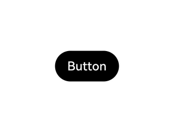
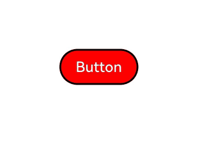

# AttributeModifier

## Overview
The introduction of the @Styles and @Extend decorators in declarative syntax helps address some reuse issues, but there are limitations in certain scenarios:
- Both @Styles and @Extend are processed at compile time and do not support cross-file exports for reuse.
- @Styles only supports universal attributes and events, not component-specific attributes.
- Although @Styles supports the use of polymorphic styles, it does not support parameter passing, which means it cannot expose certain properties externally.
- @Extend supports private attributes and events of specific components, but it does not support cross-file exports for reuse either.
- Neither @Styles nor @Extend supports service logic for dynamically determining whether to set certain attributes. They only allow setting all possible attributes using ternary expressions, which is inefficient when dealing with a large number of attributes.


To address the above issues, ArkUI introduces the **AttributeModifier** mechanism, which allows for dynamic modification of attributes through **Modifier** objects. The table below is a comparison of the capabilities between the **AttributeModifier** mechanism and the @Styles and @Extend decorators.
|  Capability |  @Styles  |  @Extend  |  AttributeModifier  |
| :-----: | :-----: | :-----: | :-----: |
|  Cross-file export |  Not supported |  Not supported |  Supported |
|  Universal attribute setting |  Supported |  Supported |  Supported |
|  Universal event setting |  Supported |  Supported |  Partially supported |
|  Component-specific attribute setting	 |  Not supported |  Supported |  Partially supported |
|  Component-specific event setting |  Not supported |  Supported |  Partially supported |
|  Parameter passing |  Not supported |  Supported |  Supported |
|  Polymorphic styles |  Supported |  Not supported |  Supported |
|  Service logic |  Not supported |  Not supported |  Supported |

It is evident that **AttributeModifier** offers enhanced capabilities and flexibility compared to @Styles and @Extend. Currently, efforts are underway to expand its functionality to cover all aspects of attribute and event settings. Looking ahead, **AttributeModifier** is expected to offer most, if not all, of the functionalities provided by @Styles and @Extend. In light of its superior adaptability and the ongoing development to support a comprehensive range of features, it is recommended that you use **AttributeModifier** for the aforementioned scenarios.

## API

```ts
declare interface AttributeModifier<T> {

  applyNormalAttribute?(instance: T): void;
  
  applyPressedAttribute?(instance: T): void;
  
  applyFocusedAttribute?(instance: T): void;
  
  applyDisabledAttribute?(instance: T): void;
  
  applySelectedAttribute?(instance: T): void;

}
```

**AttributeModifier** is an API that requires you to implement methods in the form of ApplyXxxAttribute. *Xxx* signifies various states of polymorphism, including the default state, pressed state, focused state, disabled state, and selected state. **T** represents the attribute type of the component. Within the callback, you can access the attribute object and use it to set the attributes.

```ts
declare class CommonMethod<T> {
  attributeModifier(modifier: AttributeModifier<T>): T;
}
```

**attributeModifier** is a universal component method that allows you to pass in a custom modifier. Since the type **T** is explicitly defined when a component is instantiated, the type **T** passed to the method must be the corresponding attribute type for that component, or it must be **CommonAttribute**.

## Behavior Specifications

- The **attributeModifier** method accepts an instance that implements the **AttributeModifier\<T>** API. Here, **T** must be the specific attribute type corresponding to the component, or it must be **CommonAttribute**.
- When a component is initialized for the first time or when its associated state variable changes, if the passed instance implements the corresponding API, the **applyNormalAttribute** callback will be invoked.
- When the **applyNormalAttribute** callback is invoked, a component attribute object is passed in. Through this object, you can set the attributes and events of the current component. 
- If an attempt is made to execute attributes or events that are not yet supported, an exception will be thrown during execution.
- When an attribute change triggers the **Apply*Xxx*Attribute** API, any attributes that were previously set on the component but not included in the current change will revert to their default values.
- The API can be used to leverage polymorphic styling capabilities. For example, if you need to set certain attributes when the component enters a pressed state, you can implement the **applyPressedAttribute** method to achieve this.
- If the same attribute is set on a component using both attribute methods and **applyNormalAttribute**, the principle of property override is followed, which means that the last set attributes take effect.
- A single **Modifier** instance object can be used across multiple components.
- If **applyNormalAttribute** is used multiple times on a single component with different **Modifier** instances, each time the state variables are updated, the attribute settings of these instances will be executed in the order they were applied, which also follows the principle of property override.

## Attribute Setting and Modification 

**AttributeModifier** provides a powerful mechanism to separate the UI from styling. It enables the dynamic customization of component attributes with support for parameter passing and service logic writing, and triggers updates through state variables.

  ```ts
  // button_modifier.ets
  export class MyButtonModifier implements AttributeModifier<ButtonAttribute> {
    // A private member variable that can be dynamically modified externally
    isDark: boolean = false

    // The constructor allows for parameter passing when creating an instance.
    constructor(dark?: boolean) {
      this.isDark = dark ? dark : false
    }

    applyNormalAttribute(instance: ButtonAttribute): void {
      // instance is the attribute object for the Button, which can be modified here.
      if (this.isDark) {// Service logic can be written here.
        // After attribute changes trigger the apply function, attributes that were set before but not included in the change will revert to their default values.
        instance.backgroundColor(Color.Black)
      } else {
        // Chaining of attribute methods is supported.
        instance.backgroundColor(Color.Red)
          .borderColor(Color.Black)
          .borderWidth(2)
      }
    }
  }
  ```
  ```ts
  // demo.ets
  import { MyButtonModifier } from './button_modifier'

  @Entry
  @Component
  struct attributeDemo {
    // The modifier is decorated with @State, with behavior consistent with that of a regular object.
    @State modifier: MyButtonModifier = new MyButtonModifier(true);

    build() {
      Row() {
        Column() {
          Button("Button")
            .attributeModifier(this.modifier)
            .onClick(() => {
              // When the level-1 attribute of the modifier is changed, a UI update is triggered, causing applyNormalAttribute to be executed again.
              this.modifier.isDark = !this.modifier.isDark
            })
        }
        .width('100%')
      }
      .height('100%')
    }
  }
  ```
  

If the same attribute is set on a component using both attribute methods and **applyNormalAttribute**, the principle of property override is followed, which means that the last set attributes take effect.

  ```ts
  // button_modifier.ets
  export class MyButtonModifier implements AttributeModifier<ButtonAttribute> {
    isDark: boolean = false

    constructor(dark?: boolean) {
      this.isDark = dark ? dark : false
    }

    applyNormalAttribute(instance: ButtonAttribute): void {
      if (this.isDark) {
        instance.backgroundColor(Color.Black)
      } else {
        instance.backgroundColor(Color.Red)
          .borderColor(Color.Black)
          .borderWidth(2)
      }
    }
  }
  ```
  ```ts
  // demo.ets
  import { MyButtonModifier } from './button_modifier';

  @Entry
  @Component
  struct attributeDemo {
    @State modifier: MyButtonModifier = new MyButtonModifier(true);

    build() {
      Row() {
        Column() {
          // As the attribute is set before the modifier, the button's color changes in accordance with the value of the modifier.
          Button("Button")
            .backgroundColor(Color.Blue)
            .attributeModifier(this.modifier)
            .onClick(() => {
              this.modifier.isDark = !this.modifier.isDark
            })
        }
        .width('100%')
      }
      .height('100%')
    }
  }
  ```
   

If **applyNormalAttribute** is used multiple times on a single component with different **Modifier** instances, each time the state variables are updated, the attribute settings of these instances will be executed in the order they were applied, which also follows the principle of property override.

  ```ts
  // button_modifier.ets
  export class MyButtonModifier implements AttributeModifier<ButtonAttribute> {
    isDark: boolean = false

    constructor(dark?: boolean) {
      this.isDark = dark ? dark : false
    }

    applyNormalAttribute(instance: ButtonAttribute): void {
      if (this.isDark) {
        instance.backgroundColor(Color.Black)
          .width(200)
      } else {
        instance.backgroundColor(Color.Red)
          .width(100)
      }
    }
  }
  ```
  ```ts
  // button_modifier2.ets
  export class MyButtonModifier2 implements AttributeModifier<ButtonAttribute> {
    isDark2: boolean = false

    constructor(dark?: boolean) {
      this.isDark2 = dark ? dark : false
    }

    applyNormalAttribute(instance: ButtonAttribute): void {
      if (this.isDark2) {
        instance.backgroundColor('#2787D9')
      } else {
        instance.backgroundColor('#707070')
      }
    }
  }
  ```
  ```ts
  // demo.ets
  import { MyButtonModifier } from './button_modifier';
  import { MyButtonModifier2 } from './button_modifier2';

  @Entry
  @Component
  struct attributeDemo {
    @State modifier: MyButtonModifier = new MyButtonModifier(true);
    @State modifier2: MyButtonModifier2 = new MyButtonModifier2(true);

    build() {
      Row() {
        Column() {
          Button("Button")
            .attributeModifier(this.modifier)
            .attributeModifier(this.modifier2)
            .onClick(() => {
              this.modifier.isDark = !this.modifier.isDark
              this.modifier2.isDark2 = !this.modifier2.isDark2
            })
        }
        .width('100%')
      }
      .height('100%')
    }
  }
  ```
   

## Polymorphic Style and Event Setting

You can use **AttributeModifier** to set polymorphic styles and events, which enables the reuse of event logic and supports various states such as default, pressed, focused, disabled, and selected. For example, if you need to set certain attributes when the component enters a pressed state, you can implement the **applyPressedAttribute** method to achieve this.

  ```ts
  // button_modifier.ets
  export class MyButtonModifier implements AttributeModifier<ButtonAttribute> {
    applyNormalAttribute(instance: ButtonAttribute): void {
      // instance is the attribute object for the Button, used to set attributes for the normal state.
      instance.backgroundColor(Color.Red)
        .borderColor(Color.Black)
        .borderWidth(2)
    }

    applyPressedAttribute(instance: ButtonAttribute): void {
      // instance is the attribute object for the Button, used to set attributes for the pressed state.
      instance.backgroundColor(Color.Green)
        .borderColor(Color.Orange)
        .borderWidth(5)
    }
  }
  ```
  ```ts
  // demo.ets
  import { MyButtonModifier } from './button_modifier'

  @Entry
  @Component
  struct attributeDemo {
    @State modifier: MyButtonModifier = new MyButtonModifier();

    build() {
      Row() {
        Column() {
          Button("Button")
            .attributeModifier(this.modifier)
        }
        .width('100%')
      }
      .height('100%')
    }
  }

  ```
   
