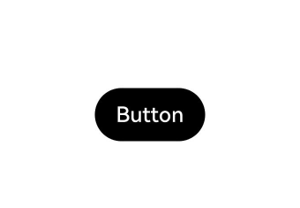
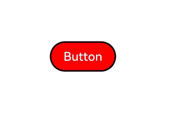

# Attribute Modifier (AttributeModifier)

<!--Kit: ArkUI-->
<!--Subsystem: ArkUI-->
<!--Owner: @wangyang2022-->
<!--Designer: @wangyang2022-->
<!--Tester: @sally__-->
<!--Adviser: @Brilliantry_Rui-->
<!-- md-trans-meta sourceCommit=c95bfd438188db0f5250ce0308aede264df6c96f translatedAt=2026-08-05T01:24:34.366Z pushedAt=2026-08-05T01:57:22.506Z -->

## Overview

The introduction of the [@Styles](../ui/state-management/arkts-style.md) and [@Extend](../ui/state-management/arkts-extend.md) decorators in declarative syntax helps with reuse of custom styles, but they encounter limitations in certain scenarios:

- Both @Styles and @Extend are processed at compile time and do not support cross-file exports for reuse.

- @Styles only supports universal attributes and events, not component-specific attributes.

- While @Styles allows for polymorphic styles, it does not support parameter passing, which means it cannot expose certain properties externally.

- @Extend supports private attributes and events of specific components, but it does not support cross-file exports for reuse either.

- Neither @Styles nor @Extend supports service logic for dynamically determining whether to set certain attributes. They only allow setting all possible attributes using ternary expressions, which is inefficient when dealing with a large number of attributes.

To address the above issues, ArkUI introduces the **AttributeModifier** mechanism, which allows for dynamic modification of attributes through **Modifier** objects. The table below is a comparison of the capabilities between the **AttributeModifier** mechanism and the @Styles and @Extend decorators.

|  Capability |  @Styles  |  @Extend  |  AttributeModifier  |
| :-----: | :-----: | :-----: | :-----: |
|  Cross-file export |  Not supported |  Not supported |  Supported |
|  Universal attribute setting |  Supported |  Supported |  Supported |
|  Universal event setting |  Supported |  Supported |  Partially supported |
|  Component-specific attribute setting	 |  Not supported |  Supported |  Partially supported |
|  Component-specific event setting |  Not supported |  Supported |  Partially supported |
|  Parameter passing |  Not supported |  Supported |  Supported |
|  Polymorphic styles |  Supported |  Not supported |  Supported |
|  Service logic |  Not supported |  Not supported |  Supported |

Clearly, when compared to @Styles and @Extend, **AttributeModifier** provides superior capabilities and flexibility. As it continues to evolve to encompass a full spectrum of attribute and event settings, **AttributeModifier** is the preferred choice for implementation.

## API Definition

  <!-- @[Common_AttributeModifier](https://gitcode.com/openharmony/applications_app_samples/blob/master/code/DocsSample/ArkUISample/ButtonAttribute/entry/src/main/ets/Common/ButtonModifier01.ets) -->

  ``` TypeScript
  declare interface AttributeModifier<T> {
  
    applyNormalAttribute?(instance: T): void;
  
    applyPressedAttribute?(instance: T): void;
  
    applyFocusedAttribute?(instance: T): void;
  
    applyDisabledAttribute?(instance: T): void;
  
    applySelectedAttribute?(instance: T): void;
  
  }
  ```

**AttributeModifier** is an API that requires you to implement methods in the form of **apply*Xxx*Attribute**. *Xxx* signifies various states of polymorphism and can be in the following: **Normal**, **Pressed**, **Focused**, **Disabled**, and **Selected**. **T** represents the attribute type of the component. Within the callback, you can access the attribute object and use it to set the attributes.

  <!-- @[Common_CommonMethod](https://gitcode.com/openharmony/applications_app_samples/blob/master/code/DocsSample/ArkUISample/ButtonAttribute/entry/src/main/ets/Common/ButtonModifier01.ets) -->

  ``` TypeScript
  declare class CommonMethod<T> {
    attributeModifier(modifier: AttributeModifier<T>): T;
  }
  ```

**attributeModifier** is a universal component method that allows you to pass in a custom modifier. Since the type **T** is explicitly defined when a component is instantiated, the type **T** passed to the method must be the corresponding attribute type for that component, or it must be **CommonAttribute**.

## How to Use

- The component universal method `attributeModifier` supports passing an instance that implements the `AttributeModifier<T>` interface, where `T` must be specified as the corresponding Attribute type of the component, or as [Universal Attribute](../reference/apis-arkui/arkui-ts/ts-component-general-attributes.md) (CommonAttribute).

- When a component is initialized for the first time or when its associated state variable changes, if the passed instance implements the corresponding API, the **applyNormalAttribute** callback will be invoked.

- When the [applyNormalAttribute](../reference/apis-arkui/arkui-ts/ts-universal-attributes-attribute-modifier.md#applynormalattribute) callback is invoked, the component attribute object is passed in, through which you can set the attributes/events of the current component.

- If an attempt is made to execute attributes or events that are not yet supported, an exception will be thrown during execution.

- When an attribute change triggers the **apply*Xxx*Attribute** API, any attributes that were previously set on the component but not included in the current change will revert to their default values.

- This API can be used to leverage polymorphic styling capabilities. For example, if you need to set certain attributes when the component enters a pressed state, you can implement the [applyPressedAttribute](../reference/apis-arkui/arkui-ts/ts-universal-attributes-attribute-modifier.md#applypressedattribute) method to achieve this.

- Avoid setting the same attributes in `attributeModifier` as those set through other methods, to prevent `attributeModifier` from not taking effect during page refresh.

- A single **Modifier** instance object can be used across multiple components.

- If **applyNormalAttribute** is used multiple times on a single component with different **Modifier** instances, each time the state variables are updated, the attribute settings of these instances will be executed in the order they were applied, which also follows the principle of property override.

## Setting and Modifying Component Attributes

**AttributeModifier** provides a mechanism to separate the UI from styling. It supports parameter passing and service logic writing, and triggers updates through state variables.

  <!-- @[Common_MyButtonModifier](https://gitcode.com/openharmony/applications_app_samples/blob/master/code/DocsSample/ArkUISample/ButtonAttribute/entry/src/main/ets/Common/ButtonModifier01.ets) -->

  ``` TypeScript
  export class MyButtonModifier implements AttributeModifier<ButtonAttribute> {
    // A private member variable that can be dynamically modified externally
    public isDark: boolean = false
  
    // The constructor allows for parameter passing when creating an instance.
    constructor(dark?: boolean) {
      this.isDark = dark ?? false
    }
  
    applyNormalAttribute(instance: ButtonAttribute): void {
      // instance is the attribute object for the Button, which can be modified here.
      if (this.isDark) {// Service logic can be written here.
        // After attribute changes trigger the apply function, attributes that were set before but not included in the change will revert to their default values.
        instance.backgroundColor('#707070')
      } else {
        // Chaining of attribute methods is supported.
        instance.backgroundColor('#17A98D')
          .borderColor('#707070')
          .borderWidth(2)
      }
    }
  }
  ```

  <!-- @[main_button1](https://gitcode.com/openharmony/applications_app_samples/blob/master/code/DocsSample/ArkUISample/ButtonAttribute/entry/src/main/ets/pages/Button1.ets) -->

  ``` TypeScript
  
  // pages/Button1.ets
  import { MyButtonModifier } from '../Common/ButtonModifier01'
  
  @Entry
  @Component
  struct Button1 {
    // The modifier is decorated with @State, with behavior consistent with that of a regular object.
    @State modifier: MyButtonModifier = new MyButtonModifier(true);
  
    build() {
      Row() {
        Column() {
          Button('Button')
            .attributeModifier(this.modifier)
            .onClick(() => {
              // When the level-1 attribute of the modifier is changed, a UI update is triggered, causing applyNormalAttribute to be executed again.
              this.modifier.isDark = !this.modifier.isDark
            })
        }
        .width('100%')
      }
      .height('100%')
    }
  }
  ```

  

  <!-- @[Common_MyButtonModifier](https://gitcode.com/openharmony/applications_app_samples/blob/master/code/DocsSample/ArkUISample/ButtonAttribute/entry/src/main/ets/Common/ButtonModifier01.ets) -->

  ``` TypeScript
  export class MyButtonModifier implements AttributeModifier<ButtonAttribute> {
    // A private member variable that can be dynamically modified externally
    public isDark: boolean = false
  
    // The constructor allows for parameter passing when creating an instance.
    constructor(dark?: boolean) {
      this.isDark = dark ?? false
    }
  
    applyNormalAttribute(instance: ButtonAttribute): void {
      // instance is the attribute object for the Button, which can be modified here.
      if (this.isDark) {// Service logic can be written here.
        // After attribute changes trigger the apply function, attributes that were set before but not included in the change will revert to their default values.
        instance.backgroundColor('#707070')
      } else {
        // Chaining of attribute methods is supported.
        instance.backgroundColor('#17A98D')
          .borderColor('#707070')
          .borderWidth(2)
      }
    }
  }
  ```

  <!-- @[main_button2](https://gitcode.com/openharmony/applications_app_samples/blob/master/code/DocsSample/ArkUISample/ButtonAttribute/entry/src/main/ets/pages/Button2.ets) -->

  ``` TypeScript
  
  // pages/Button2.ets
  import { MyButtonModifier } from '../Common/ButtonModifier01'
  
  @Entry
  @Component
  struct Button2 {
    @State modifier: MyButtonModifier = new MyButtonModifier(true);
  
    build() {
      Row() {
        Column() {
          // As the attribute is set before the modifier, the button's color changes in accordance with the value of the modifier.
          Button('Button')
            .backgroundColor('#2787D9')
            .attributeModifier(this.modifier)
            .onClick(() => {
              this.modifier.isDark = !this.modifier.isDark
            })
        }
        .width('100%')
      }
      .height('100%')
    }
  }
  ```

   

If **applyNormalAttribute** is used multiple times on a single component with different **Modifier** instances, each time the state variables are updated, the attribute settings of these instances will be executed in the order they were applied, which also follows the principle of property override, meaning that the properties set later will override earlier ones.

  <!-- @[Common_MyButtonModifier2](https://gitcode.com/openharmony/applications_app_samples/blob/master/code/DocsSample/ArkUISample/ButtonAttribute/entry/src/main/ets/Common/ButtonModifier02.ets) -->

  ``` TypeScript
  export class MyButtonModifier2 implements AttributeModifier<ButtonAttribute> {
    public isDark: boolean = false
  
    constructor(dark?: boolean) {
      this.isDark = dark ?? false
    }
  
    applyNormalAttribute(instance: ButtonAttribute): void {
      if (this.isDark) {
        instance.backgroundColor(Color.Black)
          .width(200)
      } else {
        instance.backgroundColor(Color.Red)
          .width(100)
      }
    }
  }
  ```

  <!-- @[Common_MyButtonModifier3](https://gitcode.com/openharmony/applications_app_samples/blob/master/code/DocsSample/ArkUISample/ButtonAttribute/entry/src/main/ets/Common/ButtonModifier03.ets) -->

  ``` TypeScript
  export class MyButtonModifier3 implements AttributeModifier<ButtonAttribute> {
    public isDark2: boolean = false
  
    constructor(dark?: boolean) {
      this.isDark2 = dark ? dark : false
    }
  
    applyNormalAttribute(instance: ButtonAttribute): void {
      if (this.isDark2) {
        instance.backgroundColor('#2787D9')
      } else {
        instance.backgroundColor('#707070')
      }
    }
  }
  ```

  <!-- @[main_button3](https://gitcode.com/openharmony/applications_app_samples/blob/master/code/DocsSample/ArkUISample/ButtonAttribute/entry/src/main/ets/pages/Button3.ets) -->

  ``` TypeScript
  
  // pages/Button3.ets
  import { MyButtonModifier2 } from '../Common/ButtonModifier02';
  import { MyButtonModifier3 } from '../Common/ButtonModifier03';
  
  @Entry
  @Component
  struct Button3 {
    @State modifier: MyButtonModifier2 = new MyButtonModifier2(true);
    @State modifier2: MyButtonModifier3 = new MyButtonModifier3(true);
  
    build() {
      Row() {
        Column() {
          Button('Button')
            .attributeModifier(this.modifier)
            .attributeModifier(this.modifier2)
            .onClick(() => {
              this.modifier.isDark = !this.modifier.isDark
              this.modifier2.isDark2 = !this.modifier2.isDark2
            })
        }
        .width('100%')
      }
      .height('100%')
    }
  }
  ```

   

## Setting Polymorphic Styles and Events

You can use **AttributeModifier** to set polymorphic styles and events, which enables the reuse of event logic and supports various states such as **Normal**, **Pressed**, **Focused**, **Disabled**, and **Selected**. For example, if you need to set certain attributes when the component enters a pressed state, you can implement the **applyPressedAttribute** method to achieve this.

  <!-- @[Common_MyButtonModifier4](https://gitcode.com/openharmony/applications_app_samples/blob/master/code/DocsSample/ArkUISample/ButtonAttribute/entry/src/main/ets/Common/ButtonModifier04.ets) -->

  ``` TypeScript
  export class MyButtonModifier4 implements AttributeModifier<ButtonAttribute> {
    applyNormalAttribute(instance: ButtonAttribute): void {
      // instance is the attribute object for the Button, used to set attributes for the normal state.
      instance.backgroundColor('#17A98D')
        .borderColor('#707070')
        .borderWidth(2)
    }
  
    applyPressedAttribute(instance: ButtonAttribute): void {
      // instance is the attribute object for the Button, used to set attributes for the pressed state.
      instance.backgroundColor('#2787D9')
        .borderColor('#FFC000')
        .borderWidth(5)
    }
  }
  ```

  <!-- @[main_button4](https://gitcode.com/openharmony/applications_app_samples/blob/master/code/DocsSample/ArkUISample/ButtonAttribute/entry/src/main/ets/pages/Button4.ets) -->

  ``` TypeScript
  
  // pages/Button4.ets
  import { MyButtonModifier4 } from '../Common/ButtonModifier04'
  
  @Entry
  @Component
  struct Button4 {
    @State modifier: MyButtonModifier4 = new MyButtonModifier4();
  
    build() {
      Row() {
        Column() {
          Button('Button')
            .attributeModifier(this.modifier)
        }
        .width('100%')
      }
      .height('100%')
    }
  }
  ```

   

## attributeModifier Support for Attributes and Events

  Dynamic attribute and event configuration via **attributeModifier** is supported since API version 11.

### Attributes and Events Not Supporting attributeModifier

  The following table lists attributes and events that currently do not support attributeModifier. Unless otherwise specified, attributes and events support **attributeModifier** by default from their initial release.

  | Component/Attribute Category| Attribute/Event Name            | Error Message                 | Description                                   |
  | ------------------------ | -------- | ----------------------------------------- | ------------------------ |
  | CommonAttribute | [accessibilityText](../reference/apis-arkui/arkui-ts/ts-universal-attributes-accessibility.md#accessibilitytext12)     | -   | -  |
  | CommonAttribute | [accessibilityDescription](../reference/apis-arkui/arkui-ts/ts-universal-attributes-accessibility.md#accessibilitydescription12)     | -   | -  |
  | CommonAttribute | [animation](../reference/apis-arkui/arkui-ts/ts-animatorproperty.md#animation)                | Method not implemented.   | Animation attributes are not supported.                |
  | CommonAttribute | [attributeModifier](../reference/apis-arkui/arkui-ts/ts-universal-attributes-attribute-modifier.md#attributemodifier)        | -                         | **attributeModifier** does not take effect when nested.|
  | CommonAttribute | [backgroundFilter](../reference/apis-arkui/arkui-ts/ts-universal-attributes-filter-effect.md#backgroundfilter)         | is not callable           | -                                         |
  | CommonAttribute | [chainWeight](../reference/apis-arkui/arkui-ts/ts-universal-attributes-location.md#chainweight14)              | is not callable           | -                                         |
  | CommonAttribute | [compositingFilter](../reference/apis-arkui/arkui-ts/ts-universal-attributes-filter-effect.md#compositingfilter)        | is not callable           | -                                         |
  | CommonAttribute | [drawModifier](../reference/apis-arkui/arkui-ts/ts-universal-attributes-draw-modifier.md#drawmodifier)             | is not callable           | Modifier attributes are not supported.               |
  | CommonAttribute | [foregroundFilter](../reference/apis-arkui/arkui-ts/ts-universal-attributes-filter-effect.md#foregroundfilter)         | is not callable           | -                                         |
  | CommonAttribute    | [freeze](../reference/apis-arkui/arkui-ts/ts-universal-attributes-image-effect.md#freeze18)                   | is not callable           | -                                         |
  | CommonAttribute    | [gesture](../reference/apis-arkui/arkui-ts/ts-gesture-settings.md#gesture)                   | Method not implemented.   | Gesture attributes are not supported.                |
  | CommonAttribute | [gestureModifier](../reference/apis-arkui/arkui-ts/ts-universal-attributes-gesture-modifier.md#gesturemodifier)          | is not callable           | Modifier attributes are not supported.               |
  | CommonAttribute | [onAccessibilityHover](../reference/apis-arkui/arkui-ts/ts-universal-accessibility-hover-event.md#onaccessibilityhover)      | is not callable           | -                                         |
  | CommonAttribute | [onDigitalCrown](../reference/apis-arkui/arkui-ts/ts-universal-events-crown.md#ondigitalcrown)            | is not callable.          | -                                       |
  | CommonAttribute | [parallelGesture](../reference/apis-arkui/arkui-ts/ts-gesture-settings.md#parallelgesture)          | Method not implemented.   | Gesture attributes are not supported.                |
  | CommonAttribute | [priorityGesture](../reference/apis-arkui/arkui-ts/ts-gesture-settings.md#prioritygesture)          | Method not implemented.   | Gesture attributes are not supported.                |
  | CommonAttribute   | [reuseId](../reference/apis-arkui/arkui-ts/ts-universal-attributes-reuse-id.md#reuseid)                  | Method not implemented.   | -                                         |
  | CommonAttribute | [stateStyles](../reference/apis-arkui/arkui-ts/ts-universal-attributes-polymorphic-style.md#statestyles)              | Method not implemented.   | **stateStyles** attributes are not supported.            |
  | CommonAttribute | [useSizeType](../reference/apis-arkui/arkui-ts/ts-universal-attributes-grid.md#attributes)            | Method not implemented.   | Deprecated attributes are not supported.                       |
  | CommonAttribute | [visualEffect](../reference/apis-arkui/arkui-ts/ts-universal-attributes-filter-effect.md#visualeffect)             | is not callable           | -                                         |
  | CommonAttribute | [bindContextMenu](../reference/apis-arkui/arkui-ts/ts-universal-attributes-menu.md#bindcontextmenu12) | Method not implemented. | Attributes that accept a CustomBuilder are not supported.|
  | CommonAttribute | [bindContentCover](../reference/apis-arkui/arkui-ts/ts-universal-attributes-modal-transition.md#bindcontentcover) | Method not implemented. | Attributes that accept a CustomBuilder are not supported.|
  | CommonAttribute | [bindSheet](../reference/apis-arkui/arkui-ts/ts-universal-attributes-sheet-transition.md#bindsheet) | Method not implemented. | Attributes that accept a CustomBuilder are not supported.|
  | CommonAttribute | [dragPreview](../reference/apis-arkui/arkui-ts/ts-universal-attributes-drag-drop.md#dragpreview15) | Builder is not supported. | Attributes that accept a CustomBuilder are not supported.|
  | CommonAttribute | [bindPopup](../reference/apis-arkui/arkui-ts/ts-universal-attributes-popup.md#bindpopup) | Method not implemented. | Attributes that accept a CustomBuilder are not supported.|
  | CommonAttribute | [accessibilityVirtualNode](../reference/apis-arkui/arkui-ts/ts-universal-attributes-accessibility.md#accessibilityvirtualnode11) | is not callable | Attributes that accept a CustomBuilder are not supported.|
  | CommonAttribute | [chainWeight](../reference/apis-arkui/arkui-ts/ts-universal-attributes-location.md#chainweight14) | - | - |
  | CheckboxGroup |  [contentModifier](../reference/apis-arkui/arkui-ts/ts-basic-components-checkboxgroup.md#contentmodifier21)| - | - |
  | CommonAttribute  | [backgroundImage](../reference/apis-arkui/arkui-ts/ts-universal-attributes-background.md#backgroundimage18) | - | - |
  | CommonAttribute  | [onClick](../reference/apis-arkui/arkui-ts/ts-universal-events-click.md#onclick12) | - | - |
  | CommonAttribute  | [toolbar](../reference/apis-arkui/arkui-ts/ts-universal-attributes-toolbar.md#toolbar) | - | - |
  | CommonAttribute  | [accessibilityGroup](../reference/apis-arkui/arkui-ts/ts-universal-attributes-accessibility.md#accessibilitygroup14) | - | - |
  | CommonAttribute  | [reuse](../reference/apis-arkui/arkui-ts/ts-universal-attributes-reuse.md#reuse) | - | - |
  | CommonAttribute  | [onGestureRecognizerJudgeBegin](../reference/apis-arkui/arkui-ts/ts-gesture-blocking-enhancement.md#ongesturerecognizerjudgebegin13) | - | - |
  | EmbeddedComponent  | [onError](../reference/apis-arkui/arkui-ts/ts-container-embedded-component.md#onerror) | - | - |
  | EmbeddedComponent  | [onTerminated](../reference/apis-arkui/arkui-ts/ts-container-embedded-component.md#onterminated) | - | - |
  | NavDestination | [backButtonIcon<sup>19+</sup>](../reference/apis-arkui/arkui-ts/ts-basic-components-navdestination.md#backbuttonicon19) | - | - |
  | NavDestination | [menus<sup>19+</sup>](../reference/apis-arkui/arkui-ts/ts-basic-components-navdestination.md#menus19) | - | - |
  | NavDestination | [customTransition](../reference/apis-arkui/arkui-ts/ts-basic-components-navdestination.md#customtransition15) | - | - |
  | Navigation | [backButtonIcon](../reference/apis-arkui/arkui-ts/ts-basic-components-navigation.md#backbuttonicon19) | - | - |
  | Navigation | [menus](../reference/apis-arkui/arkui-ts/ts-basic-components-navigation.md#menus19) | - | - |
  | Repeat | [each](../reference/apis-arkui/arkui-ts/ts-rendering-control-repeat.md#each) | - | - |
  | Repeat | [key](../reference/apis-arkui/arkui-ts/ts-rendering-control-repeat.md#key) | - | - |
  | Repeat | [virtualScroll](../reference/apis-arkui/arkui-ts/ts-rendering-control-repeat.md#virtualscroll) | - | - |
  | Repeat | [template](../reference/apis-arkui/arkui-ts/ts-rendering-control-repeat.md#template) | - | - |
  | Repeat | [templateId](../reference/apis-arkui/arkui-ts/ts-rendering-control-repeat.md#templateid) | - | - |
  | Search | [customKeyboard](../reference/apis-arkui/arkui-ts/ts-basic-components-search.md#customkeyboard10) | - | - |
  | Search | [onWillAttachIME](../reference/apis-arkui/arkui-ts/ts-basic-components-search.md#onwillattachime20) | - | - |
  | Select | [menuItemContentModifier<sup>12+</sup>](../reference/apis-arkui/arkui-ts/ts-basic-components-select.md#menuitemcontentmodifier12) | - | - |
  | Select | [menuItemContentModifier<sup>18+</sup>](../reference/apis-arkui/arkui-ts/ts-basic-components-select.md#menuitemcontentmodifier18) | - | - |
  | Select | [textModifier](../reference/apis-arkui/arkui-ts/ts-basic-components-select.md#textmodifier20) | - | - |
  | Select | [arrowModifier](../reference/apis-arkui/arkui-ts/ts-basic-components-select.md#arrowmodifier20) | - | - |
  | Select | [optionTextModifier](../reference/apis-arkui/arkui-ts/ts-basic-components-select.md#optiontextmodifier20) | - | - |
  | Select | [selectedOptionTextModifier](../reference/apis-arkui/arkui-ts/ts-basic-components-select.md#selectedoptiontextmodifier20) | - | - |
  | Slider | [digitalCrownSensitivity](../reference/apis-arkui/arkui-ts/ts-basic-components-slider.md#digitalcrownsensitivity18) | - | - |
  | Swiper | [prevMargin](../reference/apis-arkui/arkui-ts/ts-container-swiper.md#prevmargin10) | - | - |
  | Swiper | [nextMargin](../reference/apis-arkui/arkui-ts/ts-container-swiper.md#nextmargin10) | - | - |
  | TextArea | [customKeyboard](../reference/apis-arkui/arkui-ts/ts-basic-components-textarea.md#customkeyboard10) | - | - |
  | Text | [bindSelectionMenu](../reference/apis-arkui/arkui-ts/ts-basic-components-text.md#bindselectionmenu11) | - | - |
  | TextInput | [customKeyboard](../reference/apis-arkui/arkui-ts/ts-basic-components-textinput.md#customkeyboard10) | - | - |
  | TextInput | [onWillAttachIME](../reference/apis-arkui/arkui-ts/ts-basic-components-textinput.md#onwillattachime20) | - | - |
  | TextPicker | [onEnterSelectedArea](../reference/apis-arkui/arkui-ts/ts-basic-components-textpicker.md#onenterselectedarea18) | - | - |
  | TimePicker | [onEnterSelectedArea](../reference/apis-arkui/arkui-ts/ts-basic-components-timepicker.md#onenterselectedarea18) | - | - |

### Version Differences Between Attribute/Event Initial Release and attributeModifier Support

  The following table shows cases where the initial release version of an attribute or event differs from its **attributeModifier** support version. Unless otherwise specified, attributes and events support **attributeModifier** by default from their initial release.

  | Component/Attribute Category| Attribute/Event Name                                             | Initial Release Version| attributeModifier Support Version|
  | --------------------------- | ------------------------------------------------------------ | ------------------- | --------------------------- |
  | AlphabetIndexer | [autoCollapse](../reference/apis-arkui/arkui-ts/ts-container-alphabet-indexer.md#autocollapse11) | 11 | 12 |
  | Button | [buttonStyle](../reference/apis-arkui/arkui-ts/ts-basic-components-button.md#buttonstyle11) |11  |12  |
  | Button | [controlSize](../reference/apis-arkui/arkui-ts/ts-basic-components-button.md#controlsize11) |11  |12  |
  | CalendarPicker |[onChange](../reference/apis-arkui/arkui-ts/ts-basic-components-calendarpicker.md#onchange18)  | 18 |20  |
  | Canvas | [enableAnalyzer](../reference/apis-arkui/arkui-ts/ts-components-canvas-canvas.md#enableanalyzer12) | 12 | 20 |
  | CommonAttribute | [accessibilityTextHint](../reference/apis-arkui/arkui-ts/ts-universal-attributes-accessibility.md#accessibilitytexthint12)    | 12   | 20|
  | CommonAttribute | [accessibilityChecked](../reference/apis-arkui/arkui-ts/ts-universal-attributes-accessibility.md#accessibilitychecked13)     | 13 | 20  |
  | CommonAttribute | [accessibilitySelected](../reference/apis-arkui/arkui-ts/ts-universal-attributes-accessibility.md#accessibilityselected13)    | 13 | 20 |
  | CommonAttribute | [background](../reference/apis-arkui/arkui-ts/ts-universal-attributes-background.md#background10) | 10 | 20|
  | CommonAttribute  | [visualEffect](../reference/apis-arkui/arkui-ts/ts-universal-attributes-filter-effect.md#visualeffect) | 12 | 20 |
  | CommonAttribute | [onDragStart](../reference/apis-arkui/arkui-ts/ts-universal-events-drag-drop.md#ondragstart) | 8 | 13 |
  | CommonAttribute  | [onVisibleAreaApproximateChange](../reference/apis-arkui/arkui-ts/ts-universal-component-visible-area-change-event.md#onvisibleareaapproximatechange17) | 17     | 23     |
  | CommonAttribute  | [onVisibleAreaChange](../reference/apis-arkui/arkui-ts/ts-universal-component-visible-area-change-event.md#onvisibleareachange) | 9     | 20     |
  | CommonAttribute  | [onTouchIntercept](../reference/apis-arkui/arkui-ts/ts-universal-attributes-on-touch-intercept.md#ontouchintercept) | 12       | 20    |
  | CommonAttribute  | [onPreDrag](../reference/apis-arkui/arkui-ts/ts-universal-events-drag-drop.md#onpredrag12)    | 12                  | 20             |
  | CommonAttribute  | [onChildTouchTest](../reference/apis-arkui/arkui-ts/ts-universal-attributes-on-child-touch-test.md#onchildtouchtest11) | 11      | 20  |
  | CommonAttribute  | [backgroundFilter](../reference/apis-arkui/arkui-ts/ts-universal-attributes-filter-effect.md#backgroundfilter) | 12 | 20 |
  | CommonAttribute  | [foregroundFilter](../reference/apis-arkui/arkui-ts/ts-universal-attributes-filter-effect.md#foregroundfilter) | 12 | 20 |
  | CommonAttribute  | [compositingFilter](../reference/apis-arkui/arkui-ts/ts-universal-attributes-filter-effect.md#compositingfilter) | 12 | 20 |
  | CommonAttribute  | [foregroundBlurStyle](../reference/apis-arkui/arkui-ts/ts-universal-attributes-foreground-blur-style.md#foregroundblurstyle) | 10 | 18 |
  | CommonAttribute  | [freeze<sup>12+</sup>](../reference/apis-arkui/arkui-ts/ts-universal-attributes-image-effect.md#freeze12) | 12 | 20 |
  | CommonAttribute  | [freeze<sup>18+</sup>](../reference/apis-arkui/arkui-ts/ts-universal-attributes-image-effect.md#freeze18) | 18 | 20 |
  | CommonAttribute  | [dragPreviewOptions](../reference/apis-arkui/arkui-ts/ts-universal-attributes-drag-drop.md#dragpreviewoptions11) | 11 | 12 |
  | CommonAttribute  | [bindMenu](../reference/apis-arkui/arkui-ts/ts-universal-attributes-menu.md#bindmenu) | 11| 20|
  | CommonAttribute  | [transition](../reference/apis-arkui/arkui-ts/ts-transition-animation-component.md#transition12) | 12| 20|
  | CommonAttribute  | [safeAreaPadding](../reference/apis-arkui/arkui-ts/ts-universal-attributes-size.md#safeareapadding14) | 14| 18|
  | CommonAttribute  | [pixelRound](../reference/apis-arkui/arkui-ts/ts-universal-attributes-pixelRoundForComponent.md#pixelround) | 11| 12|
  | ContainerSpan  | [textBackgroundStyle](../reference/apis-arkui/arkui-ts/ts-basic-components-containerspan.md#textbackgroundstyle) | 11 | 12 |
  | DatePicker  | [onDateChange](../reference/apis-arkui/arkui-ts/ts-basic-components-datepicker.md#ondatechange18) | 18 | 20 |
  | FolderStack  | [alignContent](../reference/apis-arkui/arkui-ts/ts-container-folderstack.md#aligncontent) | 11 | 12 |
  | FolderStack  | [onFolderStateChange](../reference/apis-arkui/arkui-ts/ts-container-folderstack.md#onfolderstatechange) | 11 | 20 |
  | FolderStack  | [onHoverStatusChange](../reference/apis-arkui/arkui-ts/ts-container-folderstack.md#onhoverstatuschange12) | 11 | 20 |
  | FolderStack  | [enableAnimation](../reference/apis-arkui/arkui-ts/ts-container-folderstack.md#enableanimation) | 11 | 12 |
  | FolderStack  | [autoHalfFold](../reference/apis-arkui/arkui-ts/ts-container-folderstack.md#autohalffold) | 11 | 12 |
  | Gauge  | [privacySensitive](../reference/apis-arkui/arkui-ts/ts-basic-components-gauge.md#privacysensitive12) | 12 | 20 |
  | Image  | [enableAnalyzer](../reference/apis-arkui/arkui-ts/ts-basic-components-image.md#enableanalyzer11) | 11 | 12 |
  | Image  | [resizable](../reference/apis-arkui/arkui-ts/ts-basic-components-image.md#resizable11) | 11 | 20 |
  | List  | [OnScrollVisibleContentChangeCallback](../reference/apis-arkui/arkui-ts/ts-container-list.md#onscrollvisiblecontentchangecallback12) | 12 | 14 |
  | List  | [onItemDragStart](../reference/apis-arkui/arkui-ts/ts-container-list.md#onitemdragstart8) | 8 | 14 |
  | NavDestination | [title](../reference/apis-arkui/arkui-ts/ts-basic-components-navdestination.md#title) | 9 | 12 |
  | NavDestination | [mode](../reference/apis-arkui/arkui-ts/ts-basic-components-navdestination.md#mode11) | 11 | 12 |
  | NavDestination | [backButtonIcon<sup>11+</sup>](../reference/apis-arkui/arkui-ts/ts-basic-components-navdestination.md#backbuttonicon11) | 11 | 12 |
  | NavDestination | [menus<sup>12+</sup>](../reference/apis-arkui/arkui-ts/ts-basic-components-navdestination.md#menus12) | 12 | 14 |
  | NavDestination | [toolbarConfiguration](../reference/apis-arkui/arkui-ts/ts-basic-components-navdestination.md#toolbarconfiguration13) | 13 | 20 |
  | NavDestination | [onReady](../reference/apis-arkui/arkui-ts/ts-basic-components-navdestination.md#onready11) | 11 | 20 |
  | NavDestination | [onWillAppear](../reference/apis-arkui/arkui-ts/ts-basic-components-navdestination.md#onwillappear12) | 12 | 20 |
  | NavDestination | [onWillDisappear](../reference/apis-arkui/arkui-ts/ts-basic-components-navdestination.md#onwilldisappear12) | 12 | 20 |
  | NavDestination | [onWillShow](../reference/apis-arkui/arkui-ts/ts-basic-components-navdestination.md#onwillshow12) | 12 | 20 |
  | NavDestination | [onWillHide](../reference/apis-arkui/arkui-ts/ts-basic-components-navdestination.md#onwillhide12) | 12 | 20 |
  | NavDestination | [systemBarStyle](../reference/apis-arkui/arkui-ts/ts-basic-components-navdestination.md#systembarstyle12) | 12 | 20 |
  | NavDestination | [onResult](../reference/apis-arkui/arkui-ts/ts-basic-components-navdestination.md#onresult15) | 15 | 22 |
  | NavDestination | [bindToScrollable](../reference/apis-arkui/arkui-ts/ts-basic-components-navdestination.md#bindtoscrollable14) | 14 | 22 |
  | NavDestination | [bindToNestedScrollable](../reference/apis-arkui/arkui-ts/ts-basic-components-navdestination.md#bindtonestedscrollable14) | 14 | 22 |
  | NavDestination | [onActive](../reference/apis-arkui/arkui-ts/ts-basic-components-navdestination.md#onactive17) | 17 | 22 |
  | NavDestination | [onInactive](../reference/apis-arkui/arkui-ts/ts-basic-components-navdestination.md#oninactive17) | 17 | 22 |
  | NavDestination | [onNewParam](../reference/apis-arkui/arkui-ts/ts-basic-components-navdestination.md#onnewparam19) | 19 | 22 |
  | Navigation | [title](../reference/apis-arkui/arkui-ts/ts-basic-components-navigation.md#title) | 8 | 12 |
  | Navigation | [toolbarConfiguration](../reference/apis-arkui/arkui-ts/ts-basic-components-navigation.md#toolbarconfiguration10) | 10 | 20 |
  | Navigation | [customNavContentTransition](../reference/apis-arkui/arkui-ts/ts-basic-components-navigation.md#customnavcontenttransition11) | 11 | 20 |
  | Navigation | [systemBarStyle](../reference/apis-arkui/arkui-ts/ts-basic-components-navigation.md#systembarstyle12) | 12 | 20 |
  | Navigation | [enableVisibilityLifecycleWithContentCover](../reference/apis-arkui/arkui-ts/ts-basic-components-navigation.md#enablevisibilitylifecyclewithcontentcover21) | 21 | 23 |
  | PatternLock | [backgroundColor](../reference/apis-arkui/arkui-ts/ts-basic-components-patternlock.md#backgroundcolor) | 9 | 20 |
  | PatternLock | [onDotConnect](../reference/apis-arkui/arkui-ts/ts-basic-components-patternlock.md#ondotconnect11) | 11 | 20 |
  | Progress | [privacySensitive](../reference/apis-arkui/arkui-ts/ts-basic-components-progress.md#privacysensitive12) | 12 | 20 |
  | Refresh | [onOffsetChange](../reference/apis-arkui/arkui-ts/ts-container-refresh.md#onoffsetchange12) | 12 | 20 |
  | RichEditor | [customKeyboard](../reference/apis-arkui/arkui-ts/ts-basic-components-richeditor.md#customkeyboard) | 10 | 23 |
  | RichEditor | [onDidIMEInput](../reference/apis-arkui/arkui-ts/ts-basic-components-richeditor.md#ondidimeinput12) | 12 | 20 |
  | RichEditor | [enablePreviewText](../reference/apis-arkui/arkui-ts/ts-basic-components-richeditor.md#enablepreviewtext12) | 12 | 18 |
  | RichEditor | [placeholder](../reference/apis-arkui/arkui-ts/ts-basic-components-richeditor.md#placeholder12) | 12 | 18 |
  | RichEditor | [onWillChange](../reference/apis-arkui/arkui-ts/ts-basic-components-richeditor.md#onwillchange12) | 12 | 18 |
  | RichEditor | [onDidChange](../reference/apis-arkui/arkui-ts/ts-basic-components-richeditor.md#ondidchange12) | 12 | 18 |
  | RichEditor | [editMenuOptions](../reference/apis-arkui/arkui-ts/ts-basic-components-richeditor.md#editmenuoptions12) | 12 | 18 |
  | RichEditor | [enableKeyboardOnFocus](../reference/apis-arkui/arkui-ts/ts-basic-components-richeditor.md#enablekeyboardonfocus12) | 12 | 18 |
  | RichEditor | [enableHapticFeedback](../reference/apis-arkui/arkui-ts/ts-basic-components-richeditor.md#enablehapticfeedback13) | 13 | 20 |
  | RichEditor | [barState](../reference/apis-arkui/arkui-ts/ts-basic-components-richeditor.md#barstate13) | 13 | 18 |
  | Select | [menuBackgroundColor](../reference/apis-arkui/arkui-ts/ts-basic-components-select.md#menubackgroundcolor11) | 11 | 12 |
  | Select | [menuBackgroundBlurStyle](../reference/apis-arkui/arkui-ts/ts-basic-components-select.md#menubackgroundblurstyle11) | 11 | 12 |
  | Swiper | [displayCount](../reference/apis-arkui/arkui-ts/ts-container-swiper.md#displaycount8) | 8 | 12 |
  | SymbolGlyph | [fontSize](../reference/apis-arkui/arkui-ts/ts-basic-components-symbolGlyph.md#fontsize) | 11 | 12 |
  | SymbolGlyph | [fontColor](../reference/apis-arkui/arkui-ts/ts-basic-components-symbolGlyph.md#fontcolor) | 11 | 12 |
  | SymbolGlyph | [fontWeight](../reference/apis-arkui/arkui-ts/ts-basic-components-symbolGlyph.md#fontweight) | 11 | 12 |
  | SymbolGlyph | [effectStrategy](../reference/apis-arkui/arkui-ts/ts-basic-components-symbolGlyph.md#effectstrategy) | 11 | 12 |
  | SymbolGlyph | [renderingStrategy](../reference/apis-arkui/arkui-ts/ts-basic-components-symbolGlyph.md#renderingstrategy) | 11 | 12 |
  | SymbolSpan | [fontSize](../reference/apis-arkui/arkui-ts/ts-basic-components-symbolSpan.md#fontsize) | 11 | 12 |
  | SymbolSpan | [fontColor](../reference/apis-arkui/arkui-ts/ts-basic-components-symbolSpan.md#fontcolor) | 11 | 12 |
  | SymbolSpan | [fontWeight](../reference/apis-arkui/arkui-ts/ts-basic-components-symbolSpan.md#fontweight) | 11 | 12 |
  | SymbolSpan | [effectStrategy](../reference/apis-arkui/arkui-ts/ts-basic-components-symbolSpan.md#effectstrategy) | 11 | 12 |
  | SymbolSpan | [renderingStrategy](../reference/apis-arkui/arkui-ts/ts-basic-components-symbolSpan.md#renderingstrategy) | 11 | 12 |
  | ScrollableCommonAttribute | [onWillScroll](../reference/apis-arkui/arkui-ts/ts-container-scrollable-common.md#onwillscroll12) | 12 | 14 |
  | ScrollableCommonAttribute | [onDidScroll](../reference/apis-arkui/arkui-ts/ts-container-scrollable-common.md#ondidscroll12) | 12 | 14 |
  | TabContent | [onWillShow](../reference/apis-arkui/arkui-ts/ts-container-tabcontent.md#onwillshow12) | 12 | 20 |
  | TabContent | [onWillHide](../reference/apis-arkui/arkui-ts/ts-container-tabcontent.md#onwillhide12) | 12 | 20 |
  | Tabs | [edgeEffect](../reference/apis-arkui/arkui-ts/ts-container-tabs.md#edgeeffect12) | 12 | 17 |
  | Tabs | [customContentTransition](../reference/apis-arkui/arkui-ts/ts-container-tabs.md#customcontenttransition11) | 11 | 20 |
  | Tabs | [onContentWillChange](../reference/apis-arkui/arkui-ts/ts-container-tabs.md#oncontentwillchange12) | 12 | 20 |
  | Tabs | [barBackgroundBlurStyle](../reference/apis-arkui/arkui-ts/ts-container-tabs.md#barbackgroundblurstyle11) | 11 | 12 |
  | TextArea | [enterKeyType](../reference/apis-arkui/arkui-ts/ts-basic-components-textarea.md#enterkeytype11) | 11 | 12 |
  | Text | [enableHapticFeedback](../reference/apis-arkui/arkui-ts/ts-basic-components-text.md#enablehapticfeedback13) | 13 | 18 |
  | TextInput | [showCounter](../reference/apis-arkui/arkui-ts/ts-basic-components-textinput.md#showcounter11) | 11 | 12 |
  | TextInput | [onSecurityStateChange](../reference/apis-arkui/arkui-ts/ts-basic-components-textinput.md#onsecuritystatechange12) | 12 | 20 |
  | TextPicker | [onScrollStop<sup>18+</sup>](../reference/apis-arkui/arkui-ts/ts-basic-components-textpicker.md#onscrollstop18) | 18 | 20 |
  | TextTimer | [textShadow](../reference/apis-arkui/arkui-ts/ts-basic-components-texttimer.md#textshadow11) | 11 | 12 |
  | TimePicker | [enableHapticFeedback](../reference/apis-arkui/arkui-ts/ts-basic-components-timepicker.md#enablehapticfeedback12) | 12 | 18 |
  | TimePicker | [onChange](../reference/apis-arkui/arkui-ts/ts-basic-components-timepicker.md#onchange18) | 18 | 20 |
  | Video | [enableAnalyzer](../reference/apis-arkui/arkui-ts/ts-media-components-video.md#enableanalyzer12) | 12 | 20 |
  | Video | [analyzerConfig](../reference/apis-arkui/arkui-ts/ts-media-components-video.md#analyzerconfig12) | 12 | 20 |
  | Video | [onError](../reference/apis-arkui/arkui-ts/ts-media-components-video.md#onerror) | 7 | 20 |
  | WaterFlow | [onScrollIndex](../reference/apis-arkui/arkui-ts/ts-container-waterflow.md#onscrollindex11) | 11 | 20 |