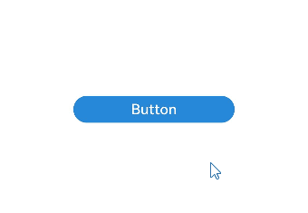
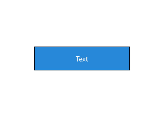

# AttributeUpdater

## Overview
When dealing with frequent updates to a large number of attributes, using state variables can lead to significant computational overhead in frontend state management, requiring full updates of all attributes for individual components. Although the **AttributeModifier** mechanism allows for selective updates based on needs, the frontend still applies some default strategies for differentiation (diffing) and resetting attributes.

This is where **AttributeUpdater** comes into the picture. As a special type of **AttributeModifier**, **AttributeUpdater** not only inherits the capabilities of **AttributeModifier** but also provides the capability to obtain the attribute object. By using the attribute object, you can update specific attributes without relying on state variables. With **AttributeUpdater**, you can implement custom update strategies, further improving the performance of attribute updates. However, due to its flexibility, it does not enforce the "single source of truth" rule, and there is a risk of conflicts when the same properties are updated through both **AttributeUpdater** and state variables. You need to ensure the rationality of attribute settings to prevent conflicts.

## API

```ts
export declare class AttributeUpdater<T, C = Initializer<T>> implements AttributeModifier<T> {
  applyNormalAttribute?(instance: T): void;
  initializeModifier(instance: T): void;
  get attribute(): T | undefined;
  updateConstructorParams: C;
}
```

**AttributeUpdater** implements the **AttributeModifier** API and provides additional functionality beyond the standard capabilities of **AttributeModifier**: It provides **initializeModifier** to initialize the attributes of a component, **attribute** to obtain the attribute object (which enables direct updates to the corresponding component's attributes), and **updateConstructorParams** to directly update the component's constructor parameters.

## Behavior Specifications

- You can implement the **AttributeUpdater\<T>** class and set it up through **AttributeModifier** of the component. When the binding is first established, the **initializeModifier** API is triggered to initialize attributes. The subsequent lifecycle events are consistent with those of **AttributeModifier**.
- After the component is initialized, you can obtain the attribute object through the **attribute** method of the **AttributeUpdater** instance. If the component is not initialized, the result will be **undefined**.
- Directly modifying attributes through **attribute** will store the latest settings within the current object and immediately trigger an update of the component's attributes.
- Marking an instance of **AttributeUpdater** as a state variable for modification, or updating the attributes of the corresponding component through other state variables, will trigger **applyNormalAttribute**. If you do not override this logic, by default, all the attribute recorded by the **attribute** object will be updated in batch.
- If you override the logic of **applyNormalAttribute** and do not call the **super** method, you will not be able to obtain the attribute object, and the **initializeModifier** method will not be invoked.
- A single **AttributeUpdater** object can be associated with only one component. If it is associated with multiple components, only one component will have its attribute settings take effect.

## Directly Modifying Attributes Through Modifier

After the component is initialized, you can use the **attribute** method of the **AttributeUpdater** instance to obtain the attribute object. You can then directly modify the attributes through this attribute object, which will immediately trigger an update of the component's attributes.

```ts
import { AttributeUpdater } from '@ohos.arkui.modifier'

class MyButtonModifier extends AttributeUpdater<ButtonAttribute> {
  initializeModifier(instance: ButtonAttribute): void {
    instance.backgroundColor('#2787D9')
      .width('50%')
      .height(30)
  }
}

@Entry
@Component
struct updaterDemo {
  modifier: MyButtonModifier = new MyButtonModifier()

  build() {
    Row() {
      Column() {
        Button("Button")
          .attributeModifier(this.modifier)
          .onClick(() => {
            this.modifier.attribute?.backgroundColor('#17A98D').width('30%')
          })
      }
      .width('100%')
    }
    .height('100%')
  }
}
```



## Updating Component Constructor Parameters Through Modifier
You can directly update the constructor parameters of a component using the **updateConstructorParams** method of the **AttributeUpdater** instance.

```ts
import { AttributeUpdater } from '@ohos.arkui.modifier'

class MyTextModifier extends AttributeUpdater<TextAttribute, TextInterface> {
  initializeModifier(instance: TextAttribute): void {
  }
}

@Entry
@Component
struct updaterDemo {
  modifier: MyTextModifier = new MyTextModifier()

  build() {
    Row() {
      Column() {
        Text("Text")
          .attributeModifier(this.modifier)
          .fontColor(Color.White)
          .fontSize(14)
          .border({ width: 1 })
          .textAlign(TextAlign.Center)
          .lineHeight(20)
          .width(200)
          .height(50)
          .backgroundColor('#2787D9')
          .onClick(() => {
            this.modifier.updateConstructorParams('Update');
          })
      }
      .width('100%')
    }
    .height('100%')
  }
}
```

