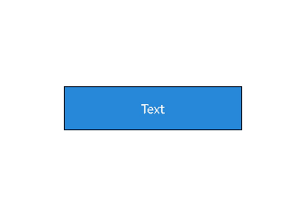

# Attribute Updater (AttributeUpdater)

<!--Kit: ArkUI-->
<!--Subsystem: ArkUI-->
<!--Owner: @wangyang2022-->
<!--Designer: @wangyang2022-->
<!--Tester: @sally__-->
<!--Adviser: @Brilliantry_Rui-->
<!-- md-trans-meta sourceCommit=82cbd61bf5a97c687ddb974e4186cc744a8f06f2 translatedAt=2026-08-05T01:24:50.321Z pushedAt=2026-08-05T01:59:53.956Z -->

## Overview

In scenarios where a large number of attributes are frequently updated, using state variables may lead to excessive computation in frontend state management and require full attribute updates for individual components. Although the [AttributeModifier](../reference/apis-arkui/arkui-ts/ts-universal-attributes-attribute-modifier.md) mechanism enables on-demand attribute updates, the frontend still applies certain diff and reset strategies, which may cause performance issues.

This is where **AttributeUpdater** comes into the picture. As a special type of **AttributeModifier**, **AttributeUpdater** not only inherits all the functionality of **AttributeModifier** but also extends its capabilities by allowing access to the attribute object. By using the attribute object, you can update specific attributes without relying on state variables. With **AttributeUpdater**, you can implement custom update strategies, further improving the performance of attribute updates.

This flexibility, however, comes with a trade-off: It does not enforce the "single source of truth" rule, which means that there is a risk of conflicts when the same attributes are updated through both **AttributeUpdater** and state variables. To avoid such conflicts, you need to ensure that attribute settings are applied logically and consistently.

## API Definition

<!-- @[att_class](https://gitcode.com/openharmony/applications_app_samples/blob/master/code/DocsSample/ArkUISample/ArkTSUserAttributeUpdater/entry/src/main/ets/pages/Common.ets) -->

``` TypeScript
export declare class AttributeUpdater<T, C = Initializer<T>> implements AttributeModifier<T> {

  applyNormalAttribute?(instance: T): void;

  initializeModifier(instance: T): void;

  get attribute(): T | undefined;

  public updateConstructorParams: C;
}
```

`AttributeUpdater` implements the `AttributeModifier` API and additionally provides [initializeModifier](../reference/apis-arkui/js-apis-arkui-AttributeUpdater.md#initializemodifier), which can initialize the component's attributes. Through the [attribute](../reference/apis-arkui/js-apis-arkui-AttributeUpdater.md#attribute) attribute method, you can obtain the attribute object and directly update the attributes of the corresponding component. In addition, you can directly update the component's constructor parameters through [updateConstructorParams](../reference/apis-arkui/js-apis-arkui-AttributeUpdater.md#properties).

## How to Use

- You can extend the **AttributeUpdater\<T>** class and set it up through the universal method **AttributeModifier** of the component. When the binding is first established, the **initializeModifier** API is triggered to initialize attributes. This is followed by a series of lifecycle events that are consistent with those of **AttributeModifier**.

- After the component is initialized, you can obtain the attribute object through the **attribute** method of the **AttributeUpdater** instance. If the component is not initialized, the method will return **undefined**.

- Modifying attributes through **attribute** will store the latest settings within the current object and immediately trigger an update of the component's attributes.

- If an `AttributeUpdater` instance is marked as a state variable for modification, or if the attributes of the corresponding component are updated through other state variables, the [applyNormalAttribute](../reference/apis-arkui/js-apis-arkui-AttributeUpdater.md#applynormalattribute) process is triggered. If the developer does not override this logic, all attributes recorded in the attribute object are updated in a batch by default.

- If you override the [applyNormalAttribute](../reference/apis-arkui/js-apis-arkui-AttributeUpdater.md#applynormalattribute) logic without calling the super class's implementation of this method, the ability to obtain the `attribute` property object is lost, and the `initializeModifier` method is not called.

- A single **AttributeUpdater** object can be associated with only one component. If it is associated with multiple components, attribute settings will be applied to only one of these components.

## Directly Modifying Attributes Through Modifier

After a component is initialized, you can use the **attribute** method of the **AttributeUpdater** instance to obtain the attribute object. Modifying attributes directly through this object will immediately trigger an update to the component's attributes.

<!-- @[att_modifier](https://gitcode.com/openharmony/applications_app_samples/blob/master/code/DocsSample/ArkUISample/ArkTSUserAttributeUpdater/entry/src/main/ets/pages/AttModifier.ets) -->

``` TypeScript
import { AttributeUpdater } from '@kit.ArkUI';

class MyButtonModifier extends AttributeUpdater<ButtonAttribute> {
  // The initializeModifier method is triggered upon the first binding, initializing the attributes.
  initializeModifier(instance: ButtonAttribute): void {
    instance.backgroundColor('#2787D9')
      .width('50%')
      .height(30)
  }
}

@Entry
@Component
struct updaterDemo {
  modifier: MyButtonModifier = new MyButtonModifier()

  build() {
    Row() {
      Column() {
        Button('Button')
          .attributeModifier(this.modifier)
          .onClick(() => {
            // Directly modify the component's attributes through attribute, which will trigger an immediate update.
            this.modifier.attribute?.backgroundColor('#17A98D').width('30%')
          })
      }
      .width('100%')
    }
    .height('100%')
  }
}
```


## Updating Component Constructor Parameters Through Modifier

You can directly update the component's constructor parameters through the `updateConstructorParams` property of the `AttributeUpdater` instance.

<!-- @[att_update](https://gitcode.com/openharmony/applications_app_samples/blob/master/code/DocsSample/ArkUISample/ArkTSUserAttributeUpdater/entry/src/main/ets/pages/AttUpdate.ets) -->

``` TypeScript
import { AttributeUpdater } from '@kit.ArkUI';

class MyTextModifier extends AttributeUpdater<TextAttribute, TextInterface> {
  initializeModifier(instance: TextAttribute): void {
  }
}

@Entry
@Component
struct updaterDemo {
  modifier: MyTextModifier = new MyTextModifier();

  build() {
    Row() {
      Column() {
        Text('Text')
          .attributeModifier(this.modifier)
          .fontColor(Color.White)
          .fontSize(14)
          .border({ width: 1 })
          .textAlign(TextAlign.Center)
          .lineHeight(20)
          .width(200)
          .height(50)
          .backgroundColor('#2787D9')
          .onClick(() => {
            // Call the updateConstructorParams property to directly update the component's construction parameters.
            this.modifier.updateConstructorParams('Update');
          })
      }
      .width('100%')
    }
    .height('100%')
  }
}
```

