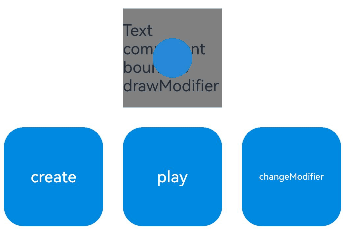

# Custom Drawing Modifier (DrawModifier)
<!--Kit: ArkUI-->
<!--Subsystem: ArkUI-->
<!--Owner: @xiang-shouxing-->
<!--Designer: @xiang-shouxing-->
<!--Tester: @sally__-->
<!--Adviser: @HelloCrease-->

## Overview

If the default drawing content of a component fails to meet your requirements, you can customize the component's drawing to achieve the desired effect. For example, you can create specially shaped buttons or icons that combine text and graphics. The custom drawing modifier **DrawModifier** is provided to enable freeform drawing for components.

## Using the DrawModifier API

```ts
declare class DrawModifier {

  drawBehind?(drawContext: DrawContext): void;

  drawContent?(drawContext: DrawContext): void;

  drawFront?(drawContext: DrawContext): void;

  drawForeground?(drawContext: DrawContext): void;

  invalidate(): void;
}
```

The **DrawModifier** API allows you to define drawing methods for four layers: foreground layer (**drawForeground**), content foreground layer (**drawFront**), content layer (**drawContent**), and content background layer (**drawBehind**). You need to override these methods and use the [Canvas](arkts-drawing-customization-on-canvas.md) API to implement custom drawing. The following figure illustrates the layers of custom drawing.


**DrawModifier** also provides the **invalidate** method to trigger redrawing. This method cannot be overridden.

> **NOTE**
>
> Each **DrawModifier** instance can be assigned to only one component. Reusing the same instance across multiple components is not allowed.
>
> The **drawContent** method replaces the component's original content drawing logic.
>
> The **drawForeground** method is supported since API version 20.
>
> For details about NDK-based custom drawing capabilities and examples, see [Implementing Custom Drawing](./arkts-user-defined-draw.md).

## Custom Drawing Using drawFront, drawContent, and drawBehind

The **drawFront**, **drawContent**, and **drawBehind** APIs are used to customize the drawing of the **Text** component at the foreground, content, and background layers, respectively, allowing you to adjust the component's drawing effect as needed.

```ts
// xxx.ets
import { drawing } from '@kit.ArkGraphics2D';
import { AnimatorResult } from '@kit.ArkUI';

class MyFullDrawModifier extends DrawModifier {
  public scaleX: number = 1;
  public scaleY: number = 1;
  uiContext: UIContext;

  constructor(uiContext: UIContext) {
    super();
    this.uiContext = uiContext;
  }

  // Override the drawBehind method to implement custom background drawing.
  drawBehind(context: DrawContext): void {
    const brush = new drawing.Brush();
    brush.setColor({
      alpha: 255,
      red: 161,
      green: 10,
      blue: 33
    });
    context.canvas.attachBrush(brush);
    const halfWidth = context.size.width / 2;
    const halfHeight = context.size.height / 2;
    context.canvas.drawRect({
      left: this.uiContext.vp2px(halfWidth - 50 * this.scaleX),
      top: this.uiContext.vp2px(halfHeight - 50 * this.scaleY),
      right: this.uiContext.vp2px(halfWidth + 50 * this.scaleX),
      bottom: this.uiContext.vp2px(halfHeight + 50 * this.scaleY)
    });
  }

  // Override the drawContent method to customize the content drawing.
  drawContent(context: DrawContext): void {
    const brush = new drawing.Brush();
    brush.setColor({
      alpha: 255,
      red: 23,
      green: 169,
      blue: 141
    });
    context.canvas.attachBrush(brush);
    const halfWidth = context.size.width / 2;
    const halfHeight = context.size.height / 2;
    context.canvas.drawRect({
      left: this.uiContext.vp2px(halfWidth - 30 * this.scaleX),
      top: this.uiContext.vp2px(halfHeight - 30 * this.scaleY),
      right: this.uiContext.vp2px(halfWidth + 30 * this.scaleX),
      bottom: this.uiContext.vp2px(halfHeight + 30 * this.scaleY)
    });
  }

  // Override the drawFront method to customize the content foreground drawing.
  drawFront(context: DrawContext): void {
    const brush = new drawing.Brush();
    brush.setColor({
      alpha: 255,
      red: 39,
      green: 135,
      blue: 217
    });
    context.canvas.attachBrush(brush);
    const halfWidth = context.size.width / 2;
    const halfHeight = context.size.height / 2;
    const radiusScale = (this.scaleX + this.scaleY) / 2;
    context.canvas.drawCircle(this.uiContext.vp2px(halfWidth), this.uiContext.vp2px(halfHeight), this.uiContext.vp2px(20 * radiusScale));
  }
}

class MyFrontDrawModifier extends DrawModifier {
  public scaleX: number = 1;
  public scaleY: number = 1;
  uiContext: UIContext;

  constructor(uiContext: UIContext) {
    super();
    this.uiContext = uiContext;
  }

  // Override the drawFront method to customize the foreground drawing.
  drawFront(context: DrawContext): void {
    const brush = new drawing.Brush();
    brush.setColor({
      alpha: 255,
      red: 39,
      green: 135,
      blue: 217
    });
    context.canvas.attachBrush(brush);
    const halfWidth = context.size.width / 2;
    const halfHeight = context.size.height / 2;
    const radiusScale = (this.scaleX + this.scaleY) / 2;
    context.canvas.drawCircle(this.uiContext.vp2px(halfWidth), this.uiContext.vp2px(halfHeight), this.uiContext.vp2px(20 * radiusScale));
  }
}

@Entry
@Component
struct DrawModifierExample {
  // Instantiate the foreground drawing class and pass the UIContext instance.
  private fullModifier: MyFullDrawModifier = new MyFullDrawModifier(this.getUIContext());
  private frontModifier: MyFrontDrawModifier = new MyFrontDrawModifier(this.getUIContext());
  private drawAnimator: AnimatorResult | undefined = undefined;
  @State modifier: DrawModifier = new MyFrontDrawModifier(this.getUIContext());
  private count = 0;

  create() {
    // Configure animation for drawing.
    let self = this;
    this.drawAnimator = this.getUIContext().createAnimator({
      duration: 1000,
      easing: 'ease',
      delay: 0,
      fill: 'forwards',
      direction: 'normal',
      iterations: 1,
      begin: 0,
      end: 2
    });
    this.drawAnimator.onFrame = (value: number) => {
      console.log('frame value =', value);
      const tempModifier = self.modifier as MyFullDrawModifier | MyFrontDrawModifier;
      tempModifier.scaleX = Math.abs(value - 1);
      tempModifier.scaleY = Math.abs(value - 1);
      self.modifier.invalidate();
    };
  }

  build() {
    Column() {
      Row() {
        Text('Text component bound to drawModifier')
          .width(100)
          .height(100)
          .margin(10)
          .backgroundColor(Color.Gray)
          .onClick(() => {
            // Adjust the current drawing size.
            const tempModifier = this.modifier as MyFullDrawModifier | MyFrontDrawModifier;
            tempModifier.scaleX -= 0.1;
            tempModifier.scaleY -= 0.1;
          })
          // Apply custom drawing by passing the custom DrawModifier instance.
          .drawModifier(this.modifier)
      }

      Row() {
        Button('create')
          .width(100)
          .height(100)
          .margin(10)
          .backgroundColor(0xFF2787D9)
          .onClick(() => {
            // Create an animation.
            this.create();
          })
        Button('play')
          .width(100)
          .height(100)
          .margin(10)
          .backgroundColor(0xFF2787D9)
          .onClick(() => {
            // Play the animation.
            if (this.drawAnimator) {
              this.drawAnimator.play();
            }
          })
        Button('changeModifier')
          .width(100)
          .height(100)
          .margin(10)
          .backgroundColor(0xFF2787D9)
          .onClick(() => {
            // Switch between DrawModifier instances.
            this.count += 1;
            if (this.count % 2 === 1) {
              console.log('change to full modifier');
              this.modifier = this.fullModifier;
            } else {
              console.log('change to front modifier');
              this.modifier = this.frontModifier;
            }
          })
      }
    }
    .width('100%')
    .height('100%')
  }
}
```



## Custom Drawing by Using drawForeground

The **drawForeground** API is used to implement custom drawing on the foreground layer of the **Column** component.

```ts
// xxx.ets
import { drawing } from '@kit.ArkGraphics2D';

class MyForegroundDrawModifier extends DrawModifier {
  public scaleX: number = 3;
  public scaleY: number = 3;
  uiContext: UIContext;

  constructor(uiContext: UIContext) {
    super();
    this.uiContext = uiContext;
  }

  // Override the drawForeground method to customize foreground drawing.
  drawForeground(context: DrawContext): void {
    const brush = new drawing.Brush();
    brush.setColor({
      alpha: 255,
      red: 0,
      green: 50,
      blue: 100
    });
    context.canvas.attachBrush(brush);
    const halfWidth = context.size.width / 2;
    const halfHeight = context.size.height / 2;
    context.canvas.drawRect({
      left: this.uiContext.vp2px(halfWidth - 30 * this.scaleX),
      top: this.uiContext.vp2px(halfHeight - 30 * this.scaleY),
      right: this.uiContext.vp2px(halfWidth + 30 * this.scaleX),
      bottom: this.uiContext.vp2px(halfHeight + 30 * this.scaleY)
    });
  }
}

@Entry
@Component
struct DrawModifierExample {
  // Instantiate the foreground drawing class and pass the UIContext instance.
  private foregroundModifier: MyForegroundDrawModifier = new MyForegroundDrawModifier(this.getUIContext());

  build() {
    Column() {
      Text('Here is a child node')
        .fontSize(36)
        .width('100%')
        .height('100%')
        .textAlign(TextAlign.Center)
    }
    .margin(50)
    .width(280)
    .height(300)
    .backgroundColor(0x87CEEB)
    // Apply custom foreground drawing by passing the DrawModifier instance.
    .drawModifier(this.foregroundModifier)
  }
}
```

