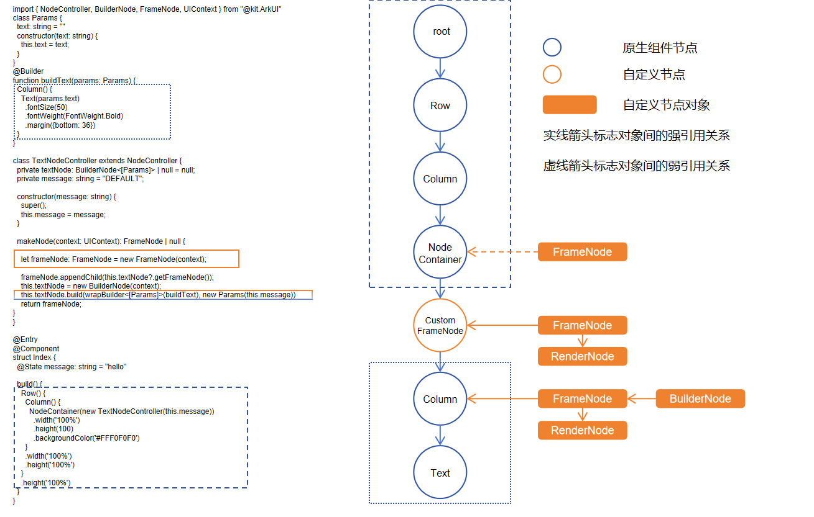

# Custom Node Overview

<!--Kit: ArkUI-->
<!--Subsystem: ArkUI-->
<!--Owner: @wangyang2022-->
<!--Designer: @wangyang2022-->
<!--Tester: @sally__-->
<!--Adviser: @Brilliantry_Rui-->
<!-- md-trans-meta sourceCommit=82cbd61bf5a97c687ddb974e4186cc744a8f06f2 translatedAt=2026-08-05T01:25:04.633Z pushedAt=2026-08-05T02:25:16.699Z -->

Custom nodes in the ArkUI framework are node objects that provide basic capabilities of underlying entity nodes through APIs, and can be mixed and displayed with built-in components. The attachment and display of custom nodes depend on [custom placeholder nodes](./arkts-user-defined-place-holder.md). There are three types of custom nodes: [FrameNode](../reference/apis-arkui/js-apis-arkui-frameNode.md), [RenderNode](../reference/apis-arkui/js-apis-arkui-renderNode.md), and [BuilderNode](../reference/apis-arkui/js-apis-arkui-builderNode.md). The FrameNode represents a single custom component node, the RenderNode represents a streamlined render node, and the BuilderNode provides the capability to create and update built-in components and component trees.

## Basic Concepts

- System component: A component is an essential element of the UI that defines the style on the interface. Components directly provided by ArkUI are called [system components](arkts-ui-development-overview.md).

- Entity node: underlying node in the component tree managed by the system. They handle attribute settings, lifecycle management, and other component logic. Custom nodes you obtain or create in TypeScript are essentially frontend objects that hold references to the corresponding entity nodes.

- Custom node: A node created imperatively using the APIs provided by ArkUI. This includes custom component nodes (FrameNode), custom render nodes (RenderNode), and custom declarative nodes (BuilderNode).

## Constraints

- **Unique parent node**: When using custom node capabilities, you must ensure that a node has exactly one parent at any given time. If the same node exists as a child of different nodes, issues such as abnormal event response, abnormal content display, abnormal position display, and stability problems may occur.

- **Avoid mesh or circular structures**: When using custom node capabilities, do not mount the node tree into a mesh or circular structure. For example, mutual references between parent and child nodes will cause the node tree to become circular, and a child node with multiple parent nodes will cause the node tree to become a mesh.

## Custom Placeholder Nodes

Custom placeholder nodes, acting as built-in components, provide anchors for custom nodes in the built-in component tree, thereby allowing for a mixed display of custom nodes and built-in components.

## Custom Component Node (FrameNode)

FrameNode represents the entity node of a component, with two main capabilities:

- Fully custom node: Provides complete customization capabilities, including custom measurement, layout, and drawing, and supports dynamic addition and removal of nodes, setting of universal attributes, and setting of event callbacks. This is suitable for scenarios where no built-in rendering engine is used and the system's layout, event, animation, and rendering capabilities are required. Nodes created through the FrameNode [constructor](../reference/apis-arkui/js-apis-arkui-frameNode.md#constructor) or through the node creation methods of [typeNode](../reference/apis-arkui/js-apis-arkui-frameNode.md#typenode12) (for example, [createNode('Text')](../reference/apis-arkui/js-apis-arkui-frameNode.md#createnodetext12), [createNode('Column')](../reference/apis-arkui/js-apis-arkui-frameNode.md#createnodecolumn12), [createNode('Row')](../reference/apis-arkui/js-apis-arkui-frameNode.md#createnoderow12)) are fully custom nodes.

- Built-in component proxy node: provides proxy capabilities for built-in components, enabling traversal of the node tree. By using FrameNodes within the component tree, you can navigate the entire tree and access component information or register additional event listeners. This is useful for combining seamless listening APIs to implement services such as tracking, advertising SDKs, and mid-end DFX. FrameNode objects returned through FrameNode query APIs (such as [getChild](../reference/apis-arkui/js-apis-arkui-frameNode.md#getchild12), [getParent](../reference/apis-arkui/js-apis-arkui-frameNode.md#getparent12), [getNextSibling](../reference/apis-arkui/js-apis-arkui-frameNode.md#getnextsibling12), and [getAttachedFrameNodeById](../reference/apis-arkui/arkts-apis-uicontext-uicontext.md#getattachedframenodebyid12)) are classified as built-in component proxy nodes if they are not fully custom nodes.

## Custom Render Node (RenderNode)

The RenderNode, as a lightweight rendering node, only provides capabilities for setting rendering-related properties, custom drawing content, and node operations. It is suitable for custom scenarios that rely solely on the system's rendering and animation capabilities.

## Custom Declarative Node (BuilderNode)

The BuilderNode uses a stateless UI method, the [global custom builder function](../ui/state-management/arkts-builder.md#global-custom-builder-function), which is decorated by @Builder, to generate a component tree where the nodes are built-in components. It is suitable for scenarios where a specific built-in component tree needs to be created based on the system capabilities for a mixed display with other custom nodes. Compared to built-in components, the BuilderNode offers the advantage of pre-creation and enables the control over the initiation of the creation process. Because it holds the actual node objects, the BuilderNode facilitates the synchronous reuse of nodes, and by combining with placeholder nodes, it can leverage FrameNodes and RenderNodes for display positioning.

## Setting Custom Node Cross-Language Attributes

ArkUI supports creating imperative nodes using the ArkTS language on the frontend, that is, FrameNodes. It also allows for creating imperative nodes using the C language on the native side, and both types of nodes can be used together to build pages. For this scenario, ArkUI provides cross-language attribute setting for imperative nodes, meaning nodes created with ArkTS can have their attributes set on the native side, and nodes created in C can have their attributes set in ArkTS.

<!--RP1--><!--RP1End-->