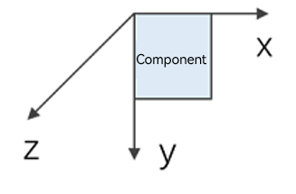

# ArkUI Glossary

<!--Kit: ArkUI-->
<!--Subsystem: ArkUI-->
<!--Owner: @huangxiaolinabc-->
<!--Designer: @fangzhiyuan1-->
<!--Tester: @zhangwenhan12-->
<!--Adviser: @Brilliantry_Rui-->
<!-- md-trans-meta sourceCommit=d1e4d0c1349312557d4315ff2b1c5d57de74d862 translatedAt=2026-08-05T01:25:10.419Z pushedAt=2026-08-05T02:32:49.600Z -->

## A

### Accessibility Virtual Node

When you use self-drawing components for custom rendering, the content inside these components (such as drawn graphics and text) is usually not directly perceivable by accessibility services. An accessibility virtual node is an invisible accessibility node supplemented for self-drawing components, used to enable assistive applications to identify perceivable content within the self-drawn area.

### Affine Property

Transform attributes of a component (scale, rotate, translate) that perform affine transformations based on the component coordinate system and anchor point. After a component is translated, the coordinate system of the affine property remains fixed, unlike layout attributes (such as width and height) which directly change the position of the content. Changing an affine property does not trigger measurement and layout, resulting in lower performance overhead compared to layout attribute changes.

### Animatable Property

When an attribute value changes within an animatable closure function, a smooth animation transition occurs instead of an abrupt jump. This differs from non-animatable attributes, where changes take effect instantly without any transition.

### Axis Event

A general event triggered by pointer input devices such as a mouse wheel or touchpad when the pointer is within the component area, caused by scrolling the wheel, sliding two fingers along the horizontal or vertical axis, or pinching two fingers. The axis refers to the two-dimensional directions (horizontal X-axis, vertical Y-axis). The event carries horizontal axis value, vertical axis value, and pinch scale, used to implement custom scrolling and scaling interactions.

## C

### Concurrent Recognition

A recognition mode for combined gestures, where all gestures within the group recognize independently and simultaneously without affecting each other until all recognitions are complete. Used to allow multiple gestures to respond in parallel during the same period (such as scaling and rotating simultaneously).

### Crown Event

A general event triggered when the user rotates the physical crown of a wearable device. Event distribution depends on the app focus (only the focused component can receive it), and it is supported only on wearable devices. It carries information such as angular velocity, relative rotation angle, and action (begin, continue, end), commonly used to drive list scrolling and selector adjustments.

## D

### Dirty Node

An associated node marked as needing an update after a state variable changes. Dirty nodes are updated in the next frame and cleared from the dirty node list. They are used to describe the state of components or nodes that are currently waiting to be refreshed.

### Dirty State Marking

The process by which the framework marks the corresponding component or node as needing an update after a component state or attribute changes. This is used to refresh the marked dirty nodes in subsequent UI rendering and trigger related measurement, layout, and rendering. After a custom attribute or custom drawing attribute changes, the developer needs to actively notify the framework to re-measure or re-render.

### Drag Event

A general event sequence triggered when the user drags an object (such as a file or control) on the interface, including stages such as drag start, enter target, move, leave target, drop, and end. Supports custom drag preview image, drag data, drop animation, cross-device dragging, and hover detection.

### Drag Preview

A preview image that follows the finger or mouse during a drag process, representing the dragged object. It can be composed of a custom builder, a drag information object, or a component snapshot, and supports configuring styles such as scale, shadow, corner radius, and material, as well as a badge count. It is the core visual carrier that conveys the dragged content to the user during a drag interaction.

## E

### Entity Node

A native node created by the backend, serving as the actual underlying carrier of a frontend node object. The frontend node is bound to the entity node through a reference relationship. When dispose is called to unbind them, the frontend node no longer corresponds to any entity node, and calling the API again may cause a crash or return a default value.

### Event Monopolize

The ability of a component to monopolize all event response rights for the current interaction within the current window after being the first to respond to an event in that interaction. When enabled, events for other components (including parent and child components) in the window will not respond, used to prevent unintended concurrent responses to gesture or touch events among overlapping components.

## F

### Focus Active State

A state entered by a UI instance where directional key focus navigation is available. After entering, the user can move focus between focusable components using keyboard arrow keys; after exiting, arrow key focus navigation does not take effect. It describes the overall mode of whether the entire interface is available for key navigation, distinct from the local state of whether a single component is focused.

### Focus Axis Event

An axis event reported through the gamepad's D-pad or joystick and distributed via callback to the app by the currently focused component when interacting with a gamepad. Unlike ordinary axis events based on pointer position (mouse wheel, touchpad), its input source is a gamepad and its distribution depends on component focus.

### Focus State

The visual feedback style displayed when a component is in the focused state, typically manifested as a focus box surrounding the edge of the component (with configurable margin, color, and width), used to clearly identify the component currently targeted by input for keyboard or remote control users. The focus state style only takes effect when the focus active state is enabled.

### Frame Animation

An animation form created by playing multiple frame images in chronological order, used to display continuous dynamic effects, suitable for scenarios requiring the presentation of an animation sequence.

## G

### Gesture Resolution

A mechanism where, just before a gesture recognizer is about to succeed, the developer's callback returns a judgment result (such as reject or continue) based on the current event information and component state, thereby dynamically deciding whether the recognizer ultimately takes effect. Used to intervene in the outcome of gesture competition at runtime (such as blocking the inner layer when nested scrolling reaches the boundary).

## H

### Hit Test

The process by which the ArkUI framework intersects the press point with the component response region to collect the set of components that need to respond to the event before distributing interaction events such as touch screen and mouse events. Its result directly determines the target and order of subsequent event distribution. It is the prerequisite hit determination step for the distribution of events such as tap, touch, drag, mouse, axis, hover, and gesture events; also known as touch test.

## I

### Imperative Node

In contrast to ArkUI's declarative syntax, a set of imperative UI construction capabilities is also provided. Developers can use the ArkTS language to directly create nodes through constructors such as new FrameNode(), or use C interfaces to build UI on the Native side. This approach is more flexible but also requires developers to be more involved in UI management to avoid issues such as rendering errors and memory leaks. In cross-language attribute setting scenarios, nodes created on the ArkTS side can have attributes set by the Native side, and nodes created in C language can have attributes set by the ArkTS side.

## L

### Long Tail State

The gradually decaying, faint oscillation phase after the main motion of a spring animation ends. At this point, the animation appears to be almost stopped but has not yet come to a complete rest, which is an inevitable process of the spring's rebound characteristic.

## M

### Mutual Exclusion Recognition

A recognition mode for combined gestures, where all gestures within the group recognize simultaneously, but as soon as any one gesture succeeds in recognition first, the recognition ends and all other gestures are judged as failed. Used to allow only one gesture to take effect from a group of conflicting gestures (such as choosing between a single tap and a double tap).

## N

### Named Route

A routing method that performs page navigation through name-based identification rather than URL paths, primarily used for redirecting to pages within a package across packages (HAR or HSP shared packages).

## O

### Off-Screen Rendering

A processing method where a component and its child components are first rendered off-screen and then drawn together with the parent control; suitable for scenarios where the current component and its child components need to be blended and drawn with the parent control as a whole.

### Offscreen Snapshot

The ability to temporarily build and render an incoming custom builder function in the app background and output its snapshot. The component to be captured does not need to be pre-loaded into the current component tree, suitable for capturing content not yet displayed on the interface. Unlike ordinary onscreen snapshots of components, its return typically has a delay because it needs to wait for the build and render to complete.

### Onscreen Snapshot

The ability to capture a snapshot of a component that has already been rendered on the interface. The component to be captured needs to have been rendered and drawn into the current component tree, suitable for capturing content already displayed on the interface (it may not be within the current visible screen range, but must already be mounted on the tree).

## P

### Page Stack

The page navigation stack structure managed by the **Router** module, which records the order in which pages are pushed and popped, and can hold a maximum of 32 pages.

### Passive Observation

A mechanism for subscribing to changes in UI component behavior, **Router** page state changes, **Navigation** page switching, scrolling, screen pixel density, drawing, or layout through **Observer** or **UIObserver** without intruding into the component's business logic. Suitable for scenarios where related change information needs to be obtained within the current process and processed through callbacks.

### Polymorphic Style

A mechanism where a component applies different styles under different interaction and visual states. By configuring style sets for normal, pressed, disabled, focused, clicked, selected, and hover states respectively, the same component presents a differentiated appearance. Used to centrally manage the state-based visual representation of components in a declarative manner.

### Pre-loading Area

In lazy loading mode, the area immediately adjacent to the display range of a container component. Child components within this area are created and laid out in advance when the system is idle to improve list scrolling performance.

## R

### Response Region

The effective area on a component that can respond to touch interactions. It is the basis for determining the intersection of the press point with the component in the hit test, and can be inconsistent with the component's visible boundary (it can extend beyond or shrink within the visible boundary). Used to expand or shrink the actual tappable range of a component, or to bind multiple discontinuous areas to the same component to meet touch target size requirements; also called response region.

### Route Map

A configuration mapping in **Navigation** that defines page route names, source file paths, and custom fields, used for finding target pages during route navigation.

### Route Stack

The stack structure of **NavDestination** pages, managed by **NavPathStack** in the **Navigation** component, which controls the entry and exit order of pages. It is a different navigation model from the page stack managed by **Router**.

## S

### Sequential Recognition

A recognition mode for combined gestures, where gestures within the group recognize sequentially in the order of registration. The preceding gesture must succeed in recognition before proceeding to the next; if any gesture fails, all subsequent gestures cannot be completed. Used to express a serial interaction chain of "A then B" (such as long press then drag).

## T

### Theme Skinning

A visual theme switching mechanism within an application, which can customize the application's global color scheme style and local color scheme style.

## U

### UI Context

The abstract runtime environment of a UI instance, where UI operations are executed and ultimately reflected in the corresponding UI instance. Used to explicitly locate the target UI instance that an interface should act upon when replacing global functions or handling non-UI and asynchronous scenarios.

### UI Parallelization

A page construction method that creates UI components and sets attributes through multiple threads and submits mounting tasks to the UI thread. Used to reduce UI thread load and decrease page creation time in complex business scenarios, thereby improving app startup, page update, and interaction smoothness.

### UI Thread

The thread that runs the ArkUI interface and processes UI events, typically the app's main thread. It is used to execute ArkUI interfaces that require binding to a UI context. Interfaces related to UI processing, including UI context environment initialization, destruction notifications, and frame callback registration, must be called on this thread; otherwise, the program will actively abort.

## Z

### Component Coordinate System

A coordinate system that takes the top‑left corner of the component as the origin, where the positive x‑axis points to the right and the positive y‑axis points downward. If the coordinate system is a three-dimensional coordinate system, the positive z‑axis points outward from the screen.

