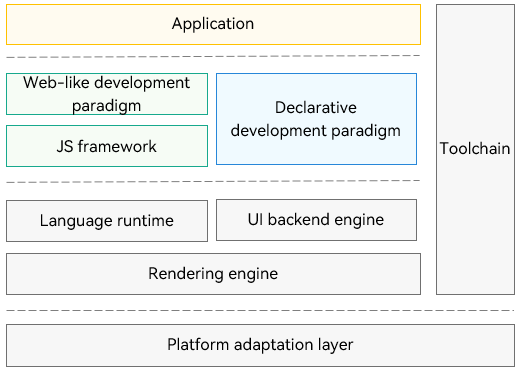

# About This Kit

<!--Kit: ArkUI-->
<!--Subsystem: ArkUI-->
<!--Owner: @yihao-lin-->
<!--Designer: @piggyguy-->
<!--Tester: @songyanhong-->
<!--Adviser: @Brilliantry_Rui-->
<!-- md-trans-meta sourceCommit=08bd9d20998adb9611ceecab63ba1fe9b4f01711 translatedAt=2026-08-05T01:25:50.304Z pushedAt=2026-08-05T02:47:43.413Z -->

ArkUI provides a comprehensive infrastructure for application UI development, including simple UI syntax, a diverse array of UI features (components, layouts, animations, and interaction events), and powerful preview tools.

## Basic Concepts

- **UI**: user interface. You can design the application's UI into multiple functional pages using [NavDestination](../reference/apis-arkui/arkui-ts/ts-basic-components-navdestination.md). These pages are managed in a stack structure, and transitions between them, such as navigating to a new page or going back to the previous one, are handled by the navigation container [Navigation](../reference/apis-arkui/arkui-ts/ts-basic-components-navigation.md), enabling functional decoupling within the application.

- **Component**: the smallest unit for UI building and display, for example, a list, grid, button, radio button, progress indicator, and text. You build a UI that meets your needs through flexible combinations of components.

## Two Development Paradigms

ArkUI comes with two development paradigms: [ArkTS-based declarative development paradigm](arkts-ui-development-overview.md) (declarative development paradigm for short) and [JavaScript-compatible web-like development paradigm](ui-js-overview.md) (web-like development paradigm for short). You can choose whichever development paradigm that aligns with your practice.

- **Declarative development paradigm**: uses the [ArkTS language](../quick-start/arkts-get-started.md), which extends TypeScript with declarative UI syntax, to provide UI drawing capabilities from three dimensions: components, animations, and state management.

- **Web-like development paradigm**: uses the classical three-stage programming model, in which <!--RP1-->HML<!--RP1End--> is used for building layouts, CSS for defining styles, and JavaScript for adding processing logic. This development paradigm has a low learning curve for frontend web developers, allowing them to quickly transform existing web applications into ArkUI applications.

The declarative development paradigm is a better choice for building new application UIs for the following reasons:

- **Higher development efficiency**: In the declarative development paradigm, the programming mode used is closer to natural semantics. You can intuitively describe the UI without caring about how the framework implements UI drawing and rendering, leading to simplified and efficient development.

- **Higher application performance**: As shown below, the two development paradigms share the UI backend engine and language runtime. However, the declarative development paradigm does not require the JavaScript framework for managing the page DOM. As such, it has more streamlined rendering and update links and less memory usage.

- **Future proof**: The declarative development paradigm will continue to develop as the preferred development paradigm, providing increasingly diverse and powerful capabilities.

  **Figure 1** ArkUI framework 

  

## Development Paradigm Support by Application Type

Depending on the selected [application model](../application-models/stage-model-development-overview.md) (stage model or FA model) and page form (normal pages of an app or service, or widgets), the supported UI development paradigms vary. For details, see the table below.

  **Table 1** Supported development paradigms

| Application Model       | Page Form    | Supported Development Paradigm               |
| ----------- | -------- | ------------------------ |
| Stage model (recommended)| Application or service page| Declarative development paradigm (recommended)             |
| Stage model (recommended)| Widget      | Declarative development paradigm (recommended) Web-like development paradigm|
| FA model       | Application or service page| Declarative development paradigm Web-like development paradigm    |
| FA model      | Widget      | Web-like development paradigm                |

## Layered API Architecture and Selection Guidelines

- **Declarative development paradigm**: Built on ArkTS, this paradigm automatically renders UIs by declaring UI structure and state. You define "what the UI should be" rather than managing updates manually. This paradigm is suitable for complex applications and team collaboration scenarios, offering advantages such as high development efficiency, good performance, and easy maintainability.

  **Recommended for**: new projects and applications requiring rapid development with sustained maintainability.

- **Customization capabilities**: ArkUI supports multi-layer customization capabilities, including custom composition, custom extensions through [modifiers](arkts-user-defined-modifier.md), custom node types ([FrameNode](../reference/apis-arkui/js-apis-arkui-frameNode.md), [RenderNode](../reference/apis-arkui/js-apis-arkui-renderNode.md), and [BuilderNode](../reference/apis-arkui/js-apis-arkui-builderNode.md)), and custom rendering. You can choose different levels of customization based on your service requirements.

  **Recommended for**: specialized UI requirements, low-level rendering control, and deep system integration.

- **NDK development**: The ArkUI framework offers NDK APIs for building UIs with C/C++, including component creation, UI tree control, attribute configuration, and event handling. For details, see [NDK API Overview](ndk-build-ui-overview.md).

  **Recommended for**: performance-critical applications, fine-grained UI control, and integration with existing C/C++ libraries.