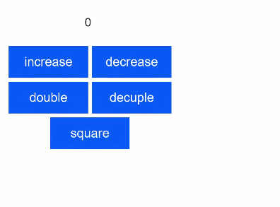
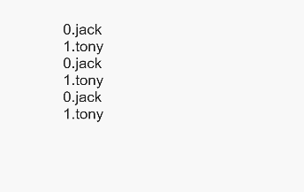

# HML

HML is an HTML-like language that allows you to build pages based on components and events. Pages built using HML have advanced capabilities such as data binding, event binding, loop rendering, conditional rendering, and logic control.


## HML Page Structure

```html
<!-- xxx.hml -->
<div class="item-container">
  <text class="item-title">Image Show</text>
  <div class="item-content">
    <image src="/common/xxx.png" class="image"></image>
  </div>
</div>
```


## Data Binding

```html
<!-- xxx.hml -->
<div class="container" onclick="changeText">
  <text> {{content[1]}} </text>
</div>
```
```css
/*xxx.css*/
.container{
    margin: 200px;
}
```
```js
// xxx.js
export default {
  data: {
    content: ['Hello World!', 'Welcome to my world!']
  },
  changeText: function() {
    this.content.splice(1, 1, this.content[0]);
  }
}
```

> **NOTE**
> - To make the array data modification take effect, use the **splice** method to change array items.
>
> - ECMAScript 6 (ES6) syntax is not supported in HML.


## Common Event Binding

Events are bound to components through **'on'** or **'\@'**. When a component triggers an event, the corresponding event processing function in the **.js** file is executed.

Events can be written in the following formats:

- **funcName**: name of the event callback, which is implemented by defining the corresponding function in the **.js** file.

- **funcName(a,b)**: function parameters, such as **a** and **b**, which can be constants, or variables defined in **data** in the **.js** file. Do not add the prefix **this.** to variables.

- Example
  ```html
  <!-- xxx.hml -->
  <div class="container">
      <text class="title">{{count}}</text>
      <div class="box">
          <input type="button" class="btn" value="increase" onclick="increase" />
          <input type="button" class="btn" value="decrease" @click="decrease" />
          <!-- Pass additional parameters. -->
          <input type="button" class="btn" value="double" @click="multiply(2)" />
          <input type="button" class="btn" value="decuple" @click="multiply(10)" />
          <input type="button" class="btn" value="square" @click="multiply(count)" />
      </div>
  </div>
  ```

  ```js
  // xxx.js
  export default {
    data: {
      count: 0
    },
    increase() {
      this.count++;
    },
    decrease() {
      this.count--;
    },
    multiply(multiplier) {
      this.count = multiplier * this.count;
    }
  };
  ```

  ```css
  /* xxx.css */
  .container {
      display: flex;
      flex-direction: column;
      justify-content: center;
      align-items: center;
      left: 0px;
      top: 0px;
      width: 454px;
      height: 454px;
  }
  .title {
      font-size: 30px;
      text-align: center;
      width: 200px;
      height: 100px;
  }
  .box {
      width: 454px;
      height: 200px;
      justify-content: center;
      align-items: center;
      flex-wrap: wrap;
  }
  .btn {
      width: 200px;
      border-radius: 0;
      margin-top: 10px;
      margin-left: 10px;
  }
  ```



## Binding for Event Bubbling<sup>5+</sup>

Binding for event bubbling covers the following:

- Bind an event callback for event bubbling: **on:{event}.bubble**. **on:{event}** is equivalent to **on:{event}.bubble**.

- Bind an event callback, but stop the event from bubbling upwards: **grab:{event}.bubble**. **grab:{event}** is equivalent to **grab:{event}.bubble**.
  > **NOTE**
  >
  > Event bubbling occurs when the target element and its ancestors have registered a listener for the same event. When the event happens on the element, it first runs the event handler on it, then on its parent, and then all the way up on other ancestors. If an element triggers this event, it first triggers the callback on the element, then on its parent, and then all the way up on other ancestors.
  >
  > For details about event bubbling, see [Universal Events](../reference/apis-arkui/arkui-js/js-components-common-events.md).
- Example
  ```html
  <!-- xxx.hml -->
  <div>
     <!-- Bind an event callback for event bubbling.5+ -->
      <div on:touchstart.bubble="touchstartfunc"></div>
      <div on:touchstart="touchstartfunc"></div>
      <!-- Bind an event callback, but stop the event from bubbling upwards.5+ -->
      <div grab:touchstart.bubble="touchstartfunc"></div>
      <div grab:touchstart="touchstartfunc"></div>
      <!-- Bind an event callback for event bubbling.6+ -->
      <div on:click.bubble="clickfunc"></div>
      <div on:click="clickfunc"></div>
      <!-- Bind an event callback, but stop the event from bubbling upwards.6+ -->
      <div grab:click.bubble="clickfunc"></div>
      <div grab:click="clickfunc"></div>
  </div>
  ```

  ```js
  // xxx.js
  export default {
      clickfunc: function(e) {
          console.log(e);
      },
      touchstartfuc: function(e) {
          console.log(e);
      },
  }
  ```

> **NOTE**
>
> Events bound using a traditional statement (such as **onclick**) will bubble only when the API version in use is 6 or later.

## Binding for Event Capturing<sup>5+</sup>

Touch events can be captured. In the capture phase, which precedes the bubbling phase, an event starts from the parent component to the child component.

Binding for event capturing covers the following:

- Bind an event callback for event capturing: **on:{event}.capture**.

- Bind an event callback, but stop the event from being captured during downward transfer: **grab:{event}.capture**.

- Example
  ```html
  <!-- xxx.hml -->
  <div>
      <!-- Bind an event callback for event capturing.5+ -->   
      <div on:touchstart.capture="touchstartfunc"></div>
      <!-- Bind an event callback, but stop the event from being captured during downward transfer.5+ -->
      <div grab:touchstart.capture="touchstartfunc"></div>
  </div>
  ```

  ```js
  // xxx.js
  export default {
      touchstartfuc: function(e) {
          console.log(e);
      },
  }
  ```


## Loop Rendering

```html
<!-- xxx.hml -->
<div class="array-container" style="flex-direction: column;margin: 200px;">
  <!-- div loop rendering -->
  <!-- By default, $item indicates the element in the array, and $idx indicates the index of the element in the array. -->
  <div for="{{array}}" tid="id" onclick="changeText">
    <text>{{$idx}}.{{$item.name}}</text>
  </div>
  <!-- Define the name for an element variable. -->
  <div for="{{value in array}}" tid="id" onclick="changeText">    
    <text>{{$idx}}.{{value.name}}</text>
  </div>
  <!-- Define an element variable and its index name. -->
  <div for="{{(index, value) in array}}" tid="id" onclick="changeText">    
    <text>{{index}}.{{value.name}}</text>
  </div>
</div>

```

```js
// xxx.js
export default {
  data: {
    array: [
      {id: 1, name: 'jack', age: 18}, 
      {id: 2, name: 'tony', age: 18},
    ],
  },
  changeText: function() {
    if (this.array[1].name === "tony"){
      this.array.splice(1, 1, {id:2, name: 'Isabella', age: 18});
    } else {
      this.array.splice(2, 1, {id:3, name: 'Bary', age: 18});
    }
  },
}
```

The **tid** attribute accelerates the **for** loop and improves the re-rendering efficiency when data in a loop changes. It specifies the unique ID of each element in the array. If it is not specified, the index of each element in the array is used as the ID. For example, **tid="id"** indicates that the **id** attribute of each element is its unique ID. The **for** loop supports the following statements:

- for="array": **array** is an array object, whose element variable is **$item** by default.

- for="v in array": **v** is a custom element variable, whose index is **$idx** by default.

- for="(i, v) in array": **i** indicates the element index, and **v** indicates the element variable. All elements of the array object will be looped through.

> **NOTE**
> - Each element in the array must have the data attribute specified by **tid**. Otherwise, an exception may occur.
>
> - The attribute specified by **tid** in the array must be unique. Otherwise, performance loss occurs. In the above example, only **id** and **name** can be used as **tid** because they are unique fields.
>
> - The **tid** attribute does not support expressions.



## Conditional Rendering

There are two ways to implement conditional rendering: **if-elif-else** or **show**. In **if-elif-else**, when the **if** statement evaluates to **false**, the component is not built in the VDOM and is not rendered. For **show**, when show is **false**, the component is not rendered but is built in the VDOM. In addition, the **if-elif-else** statements must be used in sibling nodes. Otherwise, the compilation fails. The following example uses both ways to implement conditional rendering:

```html
<!-- xxx.hml -->
<div class="container">
  <button class="btn" type="capsule" value="toggleShow" onclick="toggleShow"></button>
  <button class="btn" type="capsule" value="toggleDisplay" onclick="toggleDisplay"></button>
  <text if="{{visible}}"> Hello-world1 </text>
  <text elif="{{display}}"> Hello-world2 </text>
  <text else> Hello-World </text>
</div>
```

```css
/* xxx.css */
.container{
  flex-direction: column;
  align-items: center;
}
.btn{
  width: 280px;
  font-size: 26px;
  margin: 10px 0;
}
```

```js
// xxx.js
export default {
  data: {
    visible: false,
    display: true,
  },
  toggleShow: function() {
    this.visible = !this.visible;
  },
  toggleDisplay: function() {
    this.display = !this.display;
  }
}
```


In the optimized rendering (**show**), if **show** is **true**, the node is rendered properly; if it is **false**, the display style will be **none**.

```html
<!-- xxx.hml -->
<div class="container">
  <button class="btn" type="capsule" value="toggle" onclick="toggle"></button>
  <text show="{{visible}}" > Hello World </text>
</div>
```

```css
/* xxx.css */
.container{
  flex-direction: column;
  align-items: center;
}
.btn{
  width: 280px;
  font-size: 26px;
  margin: 10px 0;
}
```

```js
// xxx.js
export default {
  data: {
    visible: false,
  },
  toggle: function() {
    this.visible = !this.visible;
  },
}
```

> **NOTE**
>
> Do not use **for** and **if** attributes at the same time in an element.


## Logic Control Block

**\<block>** makes loop rendering and conditional rendering more flexible. A **\<block>** will not be compiled as a real component. Note that the **\<block>** tag supports only the **for** and **if** attributes.

```html
<!-- xxx.hml -->
<list>
  <block for="glasses">
    <list-item type="glasses">
      <text>{{$item.name}}</text>
    </list-item>
    <block for="$item.kinds">
      <list-item type="kind">
        <text>{{$item.color}}</text>
      </list-item>
    </block>
  </block>
</list>
```

```js
// xxx.js
export default {
  data: {
    glasses: [
      {name:'sunglasses', kinds:[{name:'XXX',color:'XXX'},{name:'XXX',color:'XXX'}]},
      {name:'nearsightedness mirror', kinds:[{name:'XXX',color:'XXX'}]},
    ],
  },
}
```


## Template Reference

HML supports using **element** to reference template files. For details, see [Basic Usage of Custom Components](../reference/apis-arkui/arkui-js/js-components-custom-basic-usage.md).

```html
<!-- template.hml -->
<div class="item"> 
  <text>Name: {{name}}</text>
  <text>Age: {{age}}</text>
</div>
```

```html
<!-- index.hml -->
<element name='comp' src='../../common/template.hml'></element>
<div>
  <comp name="Tony" age="18"></comp>
</div>
```
