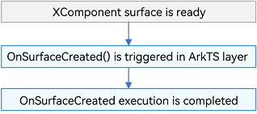
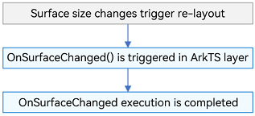
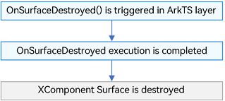
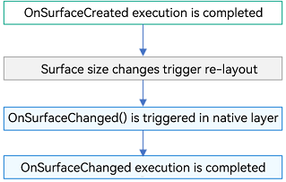
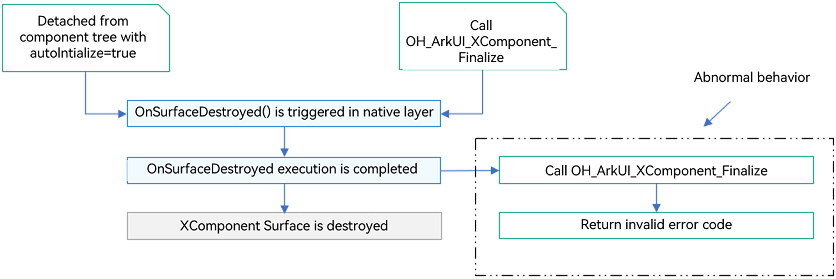
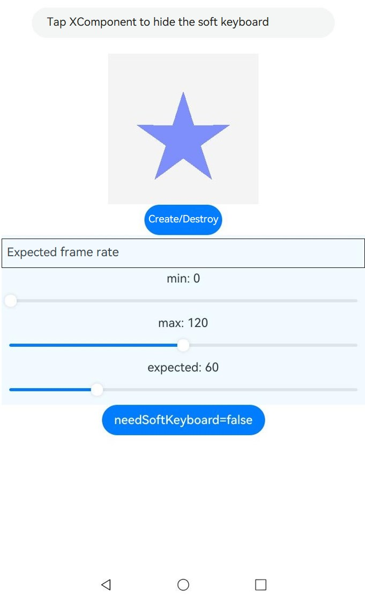
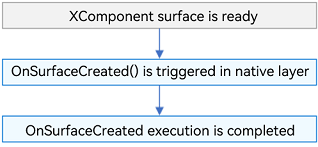
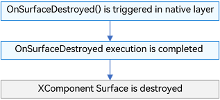

# Custom Rendering (XComponent)

## Overview

The **XComponent** is a rendering component that can be used for EGL/OpenGL ES and media data output. It uses the held [NativeWindow](../graphics/native-window-guidelines.md) to render graphics and is typically employed to meet complex custom rendering needs, such as displaying camera preview streams and rendering game graphics. You can specify different rendering methods through the **type** field, which are [XComponentType](../reference/apis-arkui/arkui-ts/ts-appendix-enums.md#xcomponenttype10).SURFACE and XComponentType.TEXTURE. For the SURFACE type, you display the custom drawing content on the screen separately. For the TEXTURE type, you combine custom drawing content with the content of the **XComponent** and display it on the screen.

The **XComponent** is mainly used in three scenarios:
1. Managing the surface lifecycle with **XComponentController**: In this scenario, the **SurfaceId** is obtained on the ArkTS side; lifecycle callbacks and event callbacks (such as touch, mouse, and key event callbacks) are all triggered on the ArkTS side.
2. Managing the surface lifecycle with **OH_ArkUI_SurfaceHolder**: In this scenario, the **OH_ArkUI_SurfaceHolder** instance is created based on the **ArkUI_NodeHandle** corresponding to the **XComponent**; lifecycle callbacks, event callbacks, accessibility and variable frame rate callbacks are all triggered on the native side.
3. Managing the surface lifecycle with **NativeXComponent**: In this scenario, the native **XComponent** instance is obtained at the native layer, and the lifecycle callbacks of **XComponent**, as well as touch, mouse, key and other event callbacks are registered on the native side.

## How Custom Drawing Works

The **XComponent** provides a surface for custom drawing. To draw custom content on this surface, you can use the [NativeWindow](../graphics/native-window-guidelines.md) API to allocate and submit graphics buffers. This process pushes your custom content to the surface, and the **XComponent** then integrates the surface into the UI and displays the result. By default, the surface matches the size and position of the **XComponent**. Yet, you can adjust its position and size using the [setXComponentSurfaceRect](../reference/apis-arkui/arkui-ts/ts-basic-components-xcomponent.md#setxcomponentsurfacerect12) API if needed.

The **XComponent** is responsible for creating the surface and notifying the application of surface-related information through callbacks. Applications can set the properties of the surface through dedicated APIs. It should be note that the component itself has no awareness of the actual drawn content and does not provide direct rendering APIs.

> **NOTE**
>
> If your custom drawn content includes transparent elements, they will blend with the content below the surface. For example, if your content is fully transparent, the background of the **XComponent** is black, and the surface maintains its default size and position, the final display will be a black area.

## Managing the Surface Lifecycle with XComponentController

This scenario involves obtaining the **SurfaceId** on the ArkTS side, with layout information, lifecycle callbacks, and event callbacks (such as touch, mouse, and key event callbacks) all triggered on the ArkTS side before being optionally passed to the native side for processing. The development mainly involves the following use cases:
- Use the **SurfaceId** obtained on the ArkTS side to call the **OH_NativeWindow_CreateNativeWindowFromSurfaceId** API on the native side to create a **NativeWindow** instance.
- Use the **NativeWindow** instance with EGL APIs to develop custom drawing content, and allocate and submit buffers to the graphics queue.
- Obtain lifecycle and event information on the ArkTS side and pass it to the native side for processing.

> **NOTE**
>
> 1. **NativeWindow** instances are cached in a dictionary on the native side. Their keys must be globally unique, and they must be promptly removed from the dictionary when the corresponding **XComponent** component is destroyed.
>
> 2. For the **XComponent** components of the TEXTURE or SURFACE type created using [typeNode](../reference/apis-arkui/js-apis-arkui-frameNode.md#typenode12), due to their lifecycle differences from declarative components, the buffer size remains unset after component creation. Therefore, before starting to draw content, call the [OH_NativeWindow_NativeWindowHandleOpt](../reference/apis-arkgraphics2d/capi-external-window-h.md#oh_nativewindow_nativewindowhandleopt) API to set the buffer size.
> 
> 3. During development with multiple **XComponent** components, make sure the keys used to cache resources on the Native side are unique. The two recommended key formats are as follows: **Id** + random number; **surfaceId**.

**lifecycle Callbacks**

- OnSurfaceCreated   	

  Triggered when the surface of the **XComponent** component is ready.

  ArkTS-side sequence

  

- OnSurfaceChanged

  Triggered after surface size changes trigger re-layout.

  ArkTS-side sequence

  

- OnSurfaceDestroyed

  Triggered when the **XComponent** component is destroyed, which is consistent with the destruction timing of common ArkUI components.

  ArkTS-side sequence

  

**Available APIs**

XComponentController on the ArkTS side

| API                                                      | Description                                                        |
| ------------------------------------------------------------ | ------------------------------------------------------------ |
| getXComponentSurfaceId(): string                             | Obtains the ID of the surface associated with the **XComponent**.                               |
| onSurfaceCreated(surfaceId: string): void                    | Called when the surface held by the **XComponent** is created.                   |
| onSurfaceChanged(surfaceId: string, rect: SurfaceRect): void | Called when the size of the surface held by the **XComponent** changes (including the initial size change upon creation).|
| onSurfaceDestroyed(surfaceId: string): void                  | Called when the surface held by the **XComponent** is destroyed.                   |

Native side

| API                                                      | Description                                                        |
| ------------------------------------------------------------ | ------------------------------------------------------------ |
| int32_t OH_NativeWindow_CreateNativeWindowFromSurfaceId (uint64_t surfaceId, OHNativeWindow **window ) | Creates an **OHNativeWindow** instance based on a surface ID.                       |
| void OH_NativeWindow_DestroyNativeWindow (OHNativeWindow* window) | Decreases the reference count of an **OHNativeWindow** instance by 1 and when the reference count reaches 0, destroys the instance.|

**How to Develop**

The following uses the SURFACE type as an example to describe how to use the **XComponent** to pass in **SurfaceId** on the ArkTS side, create a **NativeWindow** instance on the native side, then create an EGL/GLES environment, implement drawing graphics on the main page, and change the graphics color.

1. Define the **XComponent** on the UI.
   
    ```javascript
    // Function declarations defined in cpp/types/libnativerender/Index.d.ts
    type XComponentContextStatus = {
        hasDraw: boolean,
        hasChangeColor: boolean,
    };
    export const SetSurfaceId: (id: BigInt) => any;
    export const ChangeSurface: (id: BigInt, w: number, h: number) =>any;
    export const DrawPattern: (id: BigInt) => any;
    export const GetXComponentStatus: (id: BigInt) => XComponentContextStatus
    export const ChangeColor: (id: BigInt) => any;
    export const DestroySurface: (id: BigInt) => any;
    ```
    
    ```typescript
    import nativeRender from 'libnativerender.so';
    
    // Override XComponentController to set lifecycle callbacks.
    class MyXComponentController extends XComponentController {
        onSurfaceCreated(surfaceId: string): void {
            console.log(`onSurfaceCreated surfaceId: ${surfaceId}`)
            nativeRender.SetSurfaceId(BigInt(surfaceId));
        }
    
        onSurfaceChanged(surfaceId: string, rect: SurfaceRect): void {
            console.log(`onSurfaceChanged surfaceId: ${surfaceId}, rect: ${JSON.stringify(rect)}}`)
            // Call ChangeSurface to draw content in onSurfaceChanged.
            nativeRender.ChangeSurface(BigInt(surfaceId), rect.surfaceWidth, rect.surfaceHeight)
        }
    
        onSurfaceDestroyed(surfaceId: string): void {
            console.log(`onSurfaceDestroyed surfaceId: ${surfaceId}`)
            nativeRender.DestroySurface(BigInt(surfaceId))
        }
    }
    
    @Entry
    @Component
    struct Index {
        @State currentStatus: string = "index";
        xComponentController: XComponentController = new MyXComponentController();
    
        build() {
            Column() {
                //...
                // Define XComponent in an .ets file.
                Column({ space: 10 }) {
                    XComponent({
                        type: XComponentType.SURFACE,
                        controller: this.xComponentController
                    })
                Text(this.currentStatus)
                    .fontSize('24fp')
                    .fontWeight(500)
                }
                .onClick(() => {
                    let surfaceId = this.xComponentController.getXComponentSurfaceId()
                    nativeRender.ChangeColor(BigInt(surfaceId))
                    let hasChangeColor: boolean = false;
                    if (nativeRender.GetXComponentStatus(BigInt(surfaceId))) {
                        hasChangeColor = nativeRender.GetXComponentStatus(BigInt(surfaceId)).hasChangeColor;
                    }
                    if (hasChangeColor) {
                        this.currentStatus = "change color";
                    }
                })
    
                //...
                Row() {
                    Button('Draw Star')
                        .fontSize('16fp')
                        .fontWeight(500)
                        .margin({ bottom: 24 })
                        .onClick(() => {
                            let surfaceId = this.xComponentController.getXComponentSurfaceId()
                            nativeRender.DrawPattern(BigInt(surfaceId))
                            let hasDraw: boolean = false;
                            if (nativeRender.GetXComponentStatus(BigInt(surfaceId))) {
                                hasDraw = nativeRender.GetXComponentStatus(BigInt(surfaceId)).hasDraw;
                            }
                            if (hasDraw) {
                                this.currentStatus = "draw star"
                            }
                        })
                        .width('53.6%')
                        .height(40)
                }
                .width('100%')
                .justifyContent(FlexAlign.Center)
                .alignItems(VerticalAlign.Bottom)
                .layoutWeight(1)
            }
            .width('100%')
            .height('100%')
        }
    }
    ```
    
2. Register the Node-API module. For details, see [Node-API Development Specifications](../napi/napi-guidelines.md).

    ```typescript
    #include <hilog/log.h>
    #include "common/common.h"
    #include "manager/plugin_manager.h"
    namespace NativeXComponentSample {
    // In the napi_init.cpp file, use the Init method to register the target function to pass in the encapsulated C++ methods for the ArkTS method to call.
    EXTERN_C_START
    static napi_value Init(napi_env env, napi_value exports) {
        // ...
        // Expose the SetSurfaceId(), ChangeSurface(), and DestroySurface() APIs to the ArkTS side.
        // DrawPattern(),ChangeColor(),GetXComponentStatus()
        napi_property_descriptor desc[] = {
            {"SetSurfaceId", nullptr, PluginManager::SetSurfaceId, nullptr, nullptr, nullptr, napi_default, nullptr},
            {"ChangeSurface", nullptr, PluginManager::ChangeSurface, nullptr, nullptr, nullptr, napi_default, nullptr},
            {"DestroySurface", nullptr, PluginManager::DestroySurface, nullptr, nullptr, nullptr, napi_default, nullptr},
            {"DrawPattern", nullptr, PluginManager::DrawPattern, nullptr, nullptr, nullptr, napi_default, nullptr},
            {"ChangeColor", nullptr, PluginManager::ChangeColor, nullptr, nullptr, nullptr, napi_default, nullptr},
            {"GetXComponentStatus", nullptr, PluginManager::GetXComponentStatus, nullptr, nullptr, nullptr, napi_default,
             nullptr}};
        if (napi_define_properties(env, exports, sizeof(desc) / sizeof(desc[0]), desc) != napi_ok) {
            OH_LOG_Print(LOG_APP, LOG_ERROR, LOG_PRINT_DOMAIN, "Init", "napi_define_properties failed");
            return nullptr;
        }
        return exports;
    }
    EXTERN_C_END
    // Provide module descriptor configuration. You can modify parameters as needed.
    static napi_module nativerenderModule = {.nm_version = 1,
                                             .nm_flags = 0,
                                             .nm_filename = nullptr,
                                             // Entry point function
                                             .nm_register_func = Init,
                                             // Module name
                                             .nm_modname = "nativerender",
                                             .nm_priv = ((void *)0),
                                             .reserved = {0}};
    } // namespace NativeXComponentSample
    // The method decorated by __attribute__((constructor)) is automatically called by the system. The Node-API napi_module_register() is used to pass in the module descriptor configuration for module registration.
    extern "C" __attribute__((constructor)) void RegisterModule(void) {
        napi_module_register(&NativeXComponentSample::nativerenderModule);
    }
    ```
    
3. Implement the preceding six registered functions on the native side.

    ```cpp
    // Define the PluginManager class.
    class PluginManager {
    public:
        ~PluginManager();
        static PluginRender *GetPluginRender(int64_t &id);
        static napi_value ChangeColor(napi_env env, napi_callback_info info);
        static napi_value DrawPattern(napi_env env, napi_callback_info info);
        static napi_value SetSurfaceId(napi_env env, napi_callback_info info);
        static napi_value ChangeSurface(napi_env env, napi_callback_info info);
        static napi_value DestroySurface(napi_env env, napi_callback_info info);
        static napi_value GetXComponentStatus(napi_env env, napi_callback_info info);
    
    public:
        static std::unordered_map<int64_t, PluginRender *> pluginRenderMap_;
        static std::unordered_map<int64_t, OHNativeWindow *> windowMap_;
    };
    
    // Parse the surfaceId passed from ArkTS. Here, surfaceId is a 64-bit integer value.
    int64_t ParseId(napi_env env, napi_callback_info info) {
        if ((env == nullptr) || (info == nullptr)) {
            OH_LOG_Print(LOG_APP, LOG_ERROR, LOG_PRINT_DOMAIN, "ParseId", "env or info is null");
            return -1;
        }
        size_t argc = 1;
        napi_value args[1] = {nullptr};
        if (napi_ok != napi_get_cb_info(env, info, &argc, args, nullptr, nullptr)) {
            OH_LOG_Print(LOG_APP, LOG_ERROR, LOG_PRINT_DOMAIN, "ParseId", "GetContext napi_get_cb_info failed");
            return -1;
        }
        int64_t value = 0;
        bool lossless = true;
        if (napi_ok != napi_get_value_bigint_int64(env, args[0], &value, &lossless)) {
            OH_LOG_Print(LOG_APP, LOG_ERROR, LOG_PRINT_DOMAIN, "ParseId", "Get value failed");
            return -1;
        }
        return value;
    }
    
    // Set SurfaceId and initialize NativeWindow based on SurfaceId.
    napi_value PluginManager::SetSurfaceId(napi_env env, napi_callback_info info) {
        int64_t surfaceId = ParseId(env, info);
        OHNativeWindow *nativeWindow;
        PluginRender *pluginRender;
        if (windowMap_.find(surfaceId) == windowMap_.end()) {
            OH_NativeWindow_CreateNativeWindowFromSurfaceId(surfaceId, &nativeWindow);
            windowMap_[surfaceId] = nativeWindow;
        }
        if (pluginRenderMap_.find(surfaceId) == pluginRenderMap_.end()) {
            pluginRender = new PluginRender(surfaceId);
            pluginRenderMap_[surfaceId] = pluginRender;
        }
        pluginRender->InitNativeWindow(nativeWindow);
        return nullptr;
    }

    void PluginRender::InitNativeWindow(OHNativeWindow *window) {
        eglCore_->EglContextInit(window); // For details about the EglContextInit implementation, see the "Native XComponent Scenario" section.
    }
    
    // Implement surface size changes based on the passed surfaceId, width, and height.
    napi_value PluginManager::ChangeSurface(napi_env env, napi_callback_info info) {
        if ((env == nullptr) || (info == nullptr)) {
            OH_LOG_Print(LOG_APP, LOG_ERROR, LOG_PRINT_DOMAIN, "PluginManager",
                         "ChangeSurface: OnLoad env or info is null");
            return nullptr;
        }
        int64_t surfaceId = 0;
        size_t argc = 3;
        napi_value args[3] = {nullptr};

        if (napi_ok != napi_get_cb_info(env, info, &argc, args, nullptr, nullptr)) {
            OH_LOG_Print(LOG_APP, LOG_ERROR, LOG_PRINT_DOMAIN, "PluginManager",
                         "ChangeSurface: GetContext napi_get_cb_info failed");
            return nullptr;
        }
        bool lossless = true;
        int index = 0;
        if (napi_ok != napi_get_value_bigint_int64(env, args[index++], &surfaceId, &lossless)) {
            OH_LOG_Print(LOG_APP, LOG_ERROR, LOG_PRINT_DOMAIN, "PluginManager", "ChangeSurface: Get value failed");
            return nullptr;
        }
        double width;
        if (napi_ok != napi_get_value_double(env, args[index++], &width)) {
            OH_LOG_Print(LOG_APP, LOG_ERROR, LOG_PRINT_DOMAIN, "PluginManager", "ChangeSurface: Get width failed");
            return nullptr;
        }
        double height;
        if (napi_ok != napi_get_value_double(env, args[index++], &height)) {
            OH_LOG_Print(LOG_APP, LOG_ERROR, LOG_PRINT_DOMAIN, "PluginManager", "ChangeSurface: Get height failed");
            return nullptr;
        }
        auto pluginRender = GetPluginRender(surfaceId);
        if (pluginRender == nullptr) {
            OH_LOG_Print(LOG_APP, LOG_ERROR, LOG_PRINT_DOMAIN, "PluginManager", "ChangeSurface: Get pluginRender failed");
            return nullptr;
        }
        pluginRender->UpdateNativeWindowSize(width, height);
        return nullptr;
    }
    
    void PluginRender::UpdateNativeWindowSize(int width, int height) {
        eglCore_->UpdateSize(width, height); // For details about the UpdateSize implementation, see the "Native XComponent Scenario" section.
        if (!hasChangeColor_ && !hasDraw_) {
            eglCore_->Background(); // For details about the Background implementation, see the "Native XComponent Scenario" section.
        }
    }
    
    // Destroy the surface.
    napi_value PluginManager::DestroySurface(napi_env env, napi_callback_info info) {
        int64_t surfaceId = ParseId(env, info);
        auto pluginRenderMapIter = pluginRenderMap_.find(surfaceId);
        if (pluginRenderMapIter != pluginRenderMap_.end()) {
            delete pluginRenderMapIter->second;
            pluginRenderMap_.erase(pluginRenderMapIter);
        }
        auto windowMapIter = windowMap_.find(surfaceId);
        if (windowMapIter != windowMap_.end()) {
            OH_NativeWindow_DestroyNativeWindow(windowMapIter->second);
            windowMap_.erase(windowMapIter);
        }
        return nullptr;
    }
    
    // Implement the EGL drawing logic.
    napi_value PluginManager::DrawPattern(napi_env env, napi_callback_info info) {
        int64_t surfaceId = ParseId(env, info);
        auto pluginRender = GetPluginRender(surfaceId);
        if (pluginRender == nullptr) {
            OH_LOG_Print(LOG_APP, LOG_ERROR, LOG_PRINT_DOMAIN, "PluginManager", "DrawPattern: Get pluginRender failed");
            return nullptr;
        }
        pluginRender->DrawPattern();
        return nullptr;
    }

    PluginRender *PluginManager::GetPluginRender(int64_t &id) {
        if (pluginRenderMap_.find(id) != pluginRenderMap_.end()) {
            return pluginRenderMap_[id];
        }
        return nullptr;
    }

    void PluginRender::DrawPattern() {
        eglCore_->Draw(hasDraw_); // For details about the Draw implementation, see the "Native XComponent Scenario" section.
    }
    
    // Implement the feature of changing the color of the drawn graphics.
    napi_value PluginManager::ChangeColor(napi_env env, napi_callback_info info) {
        int64_t surfaceId = ParseId(env, info);
        auto pluginRender = GetPluginRender(surfaceId);
        if (pluginRender == nullptr) {
            OH_LOG_Print(LOG_APP, LOG_ERROR, LOG_PRINT_DOMAIN, "PluginManager", "ChangeColor: Get pluginRender failed");
            return nullptr;
        }
        pluginRender->ChangeColor(); // For details about the ChangeColor implementation, see the "Native XComponent Scenario" section.
        return nullptr;
    }

    void PluginRender::ChangeColor() { eglCore_->ChangeColor(hasChangeColor_); }
    
    // Obtain the XComponent status and return it to the ArkTS side.
    napi_value PluginManager::GetXComponentStatus(napi_env env, napi_callback_info info) {
        int64_t surfaceId = ParseId(env, info);
        auto pluginRender = GetPluginRender(surfaceId);
        if (pluginRender == nullptr) {
            OH_LOG_Print(LOG_APP, LOG_ERROR, LOG_PRINT_DOMAIN, "PluginManager",
                         "GetXComponentStatus: Get pluginRender failed");
            return nullptr;
        }
        napi_value hasDraw;
        napi_value hasChangeColor;
        napi_status ret = napi_create_int32(env, pluginRender->HasDraw(), &(hasDraw));
        if (ret != napi_ok) {
            OH_LOG_Print(LOG_APP, LOG_ERROR, LOG_PRINT_DOMAIN, "PluginManager",
                         "GetXComponentStatus: napi_create_int32 hasDraw_ error");
            return nullptr;
        }
        ret = napi_create_int32(env, pluginRender->HasChangedColor(), &(hasChangeColor));
        if (ret != napi_ok) {
            OH_LOG_Print(LOG_APP, LOG_ERROR, LOG_PRINT_DOMAIN, "PluginManager",
                         "GetXComponentStatus: napi_create_int32 hasChangeColor_ error");
            return nullptr;
        }
        napi_value obj;
        ret = napi_create_object(env, &obj);
        if (ret != napi_ok) {
            OH_LOG_Print(LOG_APP, LOG_ERROR, LOG_PRINT_DOMAIN, "PluginManager",
                         "GetXComponentStatus: napi_create_object error");
            return nullptr;
        }
        ret = napi_set_named_property(env, obj, "hasDraw", hasDraw);
        if (ret != napi_ok) {
            OH_LOG_Print(LOG_APP, LOG_ERROR, LOG_PRINT_DOMAIN, "PluginManager",
                         "GetXComponentStatus: napi_set_named_property hasDraw error");
            return nullptr;
        }
        ret = napi_set_named_property(env, obj, "hasChangeColor", hasChangeColor);
        if (ret != napi_ok) {
            OH_LOG_Print(LOG_APP, LOG_ERROR, LOG_PRINT_DOMAIN, "PluginManager",
                         "GetXComponentStatus: napi_set_named_property hasChangeColor error");
            return nullptr;
        }
        return obj;
    }

    int32_t PluginRender::HasDraw() { return hasDraw_; }

    int32_t PluginRender::HasChangedColor() { return hasChangeColor_; }
    ```
    
4. Configure the specific CMakeLists to use the CMake toolchain to compile the C++ source code into a dynamic link library file.

    ```cmake
    # Set the minimum CMake version.
    cmake_minimum_required(VERSION 3.4.1)
    # Project name
    project(XComponent)
    
    set(NATIVERENDER_ROOT_PATH ${CMAKE_CURRENT_SOURCE_DIR})
    add_definitions(-DOHOS_PLATFORM)
    # Set the header file search directory.
    include_directories(
        ${NATIVERENDER_ROOT_PATH}
        ${NATIVERENDER_ROOT_PATH}/include
    )
    # Add the **nativerender** dynamic library, with the **libnativerender.so** library file. Add the .cpp files.
    add_library(nativerender SHARED
        render/egl_core.cpp
        render/plugin_render.cpp
        manager/plugin_manager.cpp
        napi_init.cpp
    )
    
    find_library(
        # Set the name of the path variable.
        EGL-lib
        # Set the name of the NDK library to search for.
        EGL
    )
    
    find_library(
        # Set the name of the path variable.
        GLES-lib
        # Set the name of the NDK library to search for.
        GLESv3
    )
    
    find_library(
        # Set the name of the path variable.
        hilog-lib
        # Set the name of the NDK library to search for.
        hilog_ndk.z
    )
    
    find_library(
        # Set the name of the path variable.
        libace-lib
        # Set the name of the NDK library to search for.
        ace_ndk.z
    )
    
    find_library(
        # Set the name of the path variable.
        libnapi-lib
        # Set the name of the NDK library to search for.
        ace_napi.z
    )
    
    find_library(
        # Set the name of the path variable.
        libuv-lib
        # Set the name of the NDK library to search for.
        uv
    )
    # Add the libraries to be linked.
    target_link_libraries(nativerender PUBLIC
        ${EGL-lib} ${GLES-lib} ${hilog-lib} ${libace-lib} ${libnapi-lib} ${libuv-lib} libnative_window.so)
    ```

## Managing the Surface Lifecycle with OH_ArkUI_SurfaceHolder

Unlike the scenario where the surface lifecycle is managed with **XComponentController**, this scenario allows applications to create an **OH_ArkUI_SurfaceHolder** object based on the **ArkUI_NodeHandle** corresponding to the **XComponent** component. Through relevant APIs on the **OH_ArkUI_SurfaceHolder**, you can register surface lifecycle callbacks and implement **XComponent** capabilities such as accessibility and variable frame rate. In addition, listening for basic and gesture events on the **XComponent** component can be achieved using ArkUI NDK APIs through the **ArkUI_NodeHandle** object. For details, see [Listening for Component Events](./ndk-listen-to-component-events.md). The development mainly involves the following use cases:
- For **XComponent** components created on the ArkTS side, you can pass the corresponding FrameNode to the native side to obtain an **ArkUI_NodeHandle** object. For **XComponent** components created on the native side, you can directly obtain the **ArkUI_NodeHandle** object. Then, call the **OH_ArkUI_SurfaceHolder_Create** API to create an **OH_ArkUI_SurfaceHolder** instance.
- Register lifecycle and event callbacks using the **OH_ArkUI_SurfaceHolder** instance and obtain a **NativeWindow** instance.
- Use the **NativeWindow** instance with EGL APIs to develop custom drawing content, and allocate and submit buffers to the graphics queue.

**lifecycle Callbacks**

- OnSurfaceCreated   	

  Triggered when the surface of the XComponent component is ready and either of the following conditions is met:
  1. The component is attached to the component tree with **autoInitialize = true**.
  2. The **OH_ArkUI_XComponent_Initialize** API is called.

  ArkTS-side sequence

  
- OnSurfaceChanged
  
  Triggered when surface size changes trigger re-layout, after the **OnSurfaceCreated** callback is successfully triggered.

  ArkTS-side sequence

  

- OnSurfaceDestroyed

  Triggered when the component is detached from the component tree with **autoInitialize=true** or the **OH_ArkUI_XComponent_Finalize** API is called.

  ArkTS-side sequence

  


**Available APIs**

| API                                                      | Description                                                        |
| ------------------------------------------------------------ | ------------------------------------------------------------ |
| OH_ArkUI_QueryModuleInterfaceByName(ArkUI_NativeAPIVariantKind type, const char* structName) | Obtains the native API set of a specified type.                                        |
| OH_ArkUI_XComponent_GetNativeWindow(OH_ArkUI_SurfaceHolder* surfaceHolder) | Obtains the **NativeWindow** instance associated with an **OH_ArkUI_SurfaceHolder** instance.                                        |
| OH_ArkUI_SurfaceHolder_RemoveSurfaceCallback(OH_ArkUI_SurfaceHolder* surfaceHolder, OH_ArkUI_SurfaceCallback* callback) | Removes the previously added surface lifecycle callback from an **OH_ArkUI_SurfaceHolder** instance.                                        |
| OH_ArkUI_SurfaceCallback_Dispose(OH_ArkUI_SurfaceCallback* callback) | Disposes of an **OH_ArkUI_SurfaceCallback** object.                                        |
| OH_ArkUI_SurfaceHolder_Dispose(OH_ArkUI_SurfaceHolder* surfaceHolder) | Disposes of an **OH_ArkUI_SurfaceHolder** object.                                        |
| OH_ArkUI_NodeEvent_GetEventType(ArkUI_NodeEvent* event) | Obtains the event type from a component event.                                        |
| OH_ArkUI_NodeEvent_GetNodeHandle(ArkUI_NodeEvent* event) | Obtains the component object that triggers a component event.                                        |
| OH_ArkUI_GetNodeHandleFromNapiValue(napi_env env, napi_value frameNode, ArkUI_NodeHandle* handle) | Obtains an **ArkUI_NodeHandle** object on the native side mapped from the **FrameNode** object created on the ArkTS side.                                        |
| OH_ArkUI_SurfaceHolder_Create(ArkUI_NodeHandle node) | Creates an **OH_ArkUI_SurfaceHolder** object from the **XComponent** node.                                      |
| OH_ArkUI_SurfaceCallback_Create() | Creates an **OH_ArkUI_SurfaceCallback** object.                                        |
| OH_ArkUI_SurfaceCallback_SetSurfaceCreatedEvent(OH_ArkUI_SurfaceCallback* callback, void (\*onSurfaceCreated)(OH_ArkUI_SurfaceHolder* surfaceHolder)) | Registers the **onSurfaceCreated** callback with an **OH_ArkUI_SurfaceCallback** object.                                        |
| OH_ArkUI_SurfaceCallback_SetSurfaceChangedEvent(OH_ArkUI_SurfaceCallback* callback, void (\*onSurfaceChanged)(OH_ArkUI_SurfaceHolder* surfaceHolder, uint64_t width, uint64_t height)) | Registers the **onSurfaceChanged** callback with an **OH_ArkUI_SurfaceCallback** object.                                        |
| OH_ArkUI_SurfaceCallback_SetSurfaceDestroyedEvent(OH_ArkUI_SurfaceCallback* callback, void (\*onSurfaceDestroyed)(OH_ArkUI_SurfaceHolder* surfaceHolder)) | Registers the **onSurfaceDestroyed** callback with an **OH_ArkUI_SurfaceCallback** object.                                        |
| OH_ArkUI_SurfaceCallback_SetSurfaceShowEvent(OH_ArkUI_SurfaceCallback* callback, void (\*onSurfaceShow)(OH_ArkUI_SurfaceHolder* surfaceHolder)) | Registers the **onSurfaceShow** callback with an **OH_ArkUI_SurfaceCallback** object.                                        |
| OH_ArkUI_SurfaceCallback_SetSurfaceHideEvent(OH_ArkUI_SurfaceCallback* callback, void (\*onSurfaceHide)(OH_ArkUI_SurfaceHolder* surfaceHolder)) | Registers the **onSurfaceHide** callback with an **OH_ArkUI_SurfaceCallback** object.                                        |
| OH_ArkUI_XComponent_RegisterOnFrameCallback(ArkUI_NodeHandle node, void (*callback)(ArkUI_NodeHandle node, uint64_t timestamp, uint64_t targetTimestamp)) | Registers the **onFrame** callback for the **XComponent** node.                                        |
| OH_ArkUI_SurfaceHolder_AddSurfaceCallback(OH_ArkUI_SurfaceHolder* surfaceHolder, OH_ArkUI_SurfaceCallback* callback) | Registers the **OH_ArkUI_SurfaceCallback** object with an **OH_ArkUI_SurfaceHolder** instance.                                        |
| OH_ArkUI_AccessibilityProvider_Create(ArkUI_NodeHandle node) | Creates an **ArkUI_AccessibilityProvider** object from the **XComponent** node.                                        |
| OH_ArkUI_XComponent_UnregisterOnFrameCallback(ArkUI_NodeHandle node) | Unregisters the **onFrame callback** of the **XComponent** node.                                        |
| OH_ArkUI_AccessibilityProvider_Dispose(ArkUI_AccessibilityProvider* provider) | Disposes of an **ArkUI_AccessibilityProvider** object.                                       |
| OH_ArkUI_XComponent_SetExpectedFrameRateRange(ArkUI_NodeHandle node, OH_NativeXComponent_ExpectedRateRange range) | Sets the expected frame rate range for the **XComponent** node.                                        |
| OH_ArkUI_XComponent_SetNeedSoftKeyboard(ArkUI_NodeHandle node, bool needSoftKeyboard) | Sets whether the **XComponent** node needs to display the soft keyboard when it gains focus.                                        |

**How to Develop**

This example shows how to create an **XComponent** of the SURFACE type on the ArkTS side (for details about how to create an **ArkUI_NodeHandle** object corresponding to the **XComponent** on the native side, see [ArkUI_NativeNodeAPI_1](../reference/apis-arkui/_ark_u_i___native_node_a_p_i__1.md)). It describes how to use the **XComponent** component to call APIs related to **OH_ArkUI_SurfaceHolder** for managing the surface lifecycle, create an EGL/OpenGL ES environment on the native side to draw graphics on the main page, and change the color of the graphics.

1. Define the **XComponent** on the UI.

    ```typescript
    import native from 'libnativerender.so';

    @Entry
    @Component
    struct Index {
        xcomponentId: string = 'xcp' + (new Date().getTime());
        @State isShow: boolean = true;
        @State minRate: number = 0;
        @State maxRate: number = 120;
        @State expected: number = 60;
        needSoftKeyboard: boolean = false;
        @State needSoftKeyboardState: string = 'needSoftKeyboard=' + this.needSoftKeyboard;
        @State text: string = 'Tap XComponent to hide the soft keyboard'
        controller: TextInputController = new TextInputController()

        build() {
            Column() {
                TextInput({ text: this.text, placeholder: 'please input ...', controller: this.controller })
                    .placeholderColor(Color.Grey)
                    .placeholderFont({ size: 14, weight: 400 })
                    .caretColor(Color.Blue)
                    .width(400)
                    .height(40)
                    .margin(20)
                    .fontSize(14)
                    .fontColor(Color.Black)
                    .onChange((value: string) => {
                        this.text = value
                    })
                Column() {
                    if (this.isShow) {
                        XComponent({
                            type: XComponentType.SURFACE
                        })
                            .id(this.xcomponentId)
                            .onAttach(() => {
                                let node = this.getUIContext().getFrameNodeById(this.xcomponentId)
                                native.bindNode(this.xcomponentId, node)
                            })
                            .onDetach(() => {
                                native.unbindNode(this.xcomponentId)
                            })
                            .width(200)
                            .height(200)
                            .focusable(true)
                            .focusOnTouch(true)
                            .defaultFocus(true)
                    }
                }.height(200)

                Button('Create/Destroy').onClick(() => {
                    this.isShow = !this.isShow;
                })

                Column() {
                    Text('Expected frame rate')
                        .textAlign(TextAlign.Start)
                        .fontSize(15)
                        .border({ width: 1 })
                        .padding(10)
                        .width('100%')
                        .margin(5)
                    Text('min: ' + this.minRate)
                    Slider({
                        value: this.minRate,
                        min: 0,
                        max: 240,
                        step: 1
                    }).onChange((value: number, mode: SliderChangeMode) => {
                        this.minRate = value;
                        native.setFrameRate(this.xcomponentId, this.minRate, this.maxRate, this.expected)
                    }).width('100%')
                    Text('max: ' + this.maxRate)
                    Slider({
                        value: this.maxRate,
                        min: 0,
                        max: 240,
                        step: 1
                    }).onChange((value: number, mode: SliderChangeMode) => {
                        this.maxRate = value;
                        native.setFrameRate(this.xcomponentId, this.minRate, this.maxRate, this.expected)
                    }).width('100%')
                    Text('expected: ' + this.expected)
                    Slider({
                        value: this.expected,
                        min: 0,
                        max: 240,
                        step: 1
                    }).onChange((value: number, mode: SliderChangeMode) => {
                        this.expected = value;
                        native.setFrameRate(this.xcomponentId, this.minRate, this.maxRate, this.expected)
                    }).width('100%')
                }.backgroundColor("#F0FAFF")

                Button(this.needSoftKeyboardState)
                    .onClick(() => {
                        this.needSoftKeyboard = !this.needSoftKeyboard;
                        this.needSoftKeyboardState = 'needSoftKeyboard=' + this.needSoftKeyboard;
                        native.setNeedSoftKeyboard(this.xcomponentId, this.needSoftKeyboard);
                        this.text = this.needSoftKeyboard ? 'Tapping XComponent will not hide the keyboard' : 'Tap XComponent to hide the keyboard'
                    })
            }
            .width('100%')
        }
    }
    ```

2. Register the Node-API module. For details, see [Node-API Development Specifications](../napi/napi-guidelines.md).

    ```c++
    #include "manager/plugin_manager.h"

    namespace NativeXComponentSample {

    // In the napi_init.cpp file, use the Init method to register the target function to pass in the encapsulated C++ methods for the ArkTS method to call.
    EXTERN_C_START
    static napi_value Init(napi_env env, napi_value exports)
    {
        // Expose APIs to the ArkTS side.
        napi_property_descriptor desc[] = {
            {"bindNode", nullptr, PluginManager::BindNode,
                nullptr, nullptr, nullptr, napi_default, nullptr},
            {"unbindNode", nullptr, PluginManager::UnbindNode,
                nullptr, nullptr, nullptr, napi_default, nullptr},
            {"setFrameRate", nullptr, PluginManager::SetFrameRate,
                nullptr, nullptr, nullptr, napi_default, nullptr},
            {"setNeedSoftKeyboard", nullptr, PluginManager::SetNeedSoftKeyboard,
                nullptr, nullptr, nullptr, napi_default, nullptr},
        };
        napi_define_properties(env, exports, sizeof(desc) / sizeof(desc[0]), desc);
        return exports;
    }
    EXTERN_C_END

    // Provide module descriptor configuration. You can modify parameters as needed.
    static napi_module demoModule = {
        .nm_version = 1,
        .nm_flags = 0,
        .nm_filename = nullptr,
        // Entry point function
        .nm_register_func = Init, // Specify the callback for when the corresponding module is loaded.
        // Module name
        .nm_modname = "nativerender", // Specify the module name, which must be consistent with the value of libraryname in the XComponent declaration on the ArkTS side.
        .nm_priv = ((void*)0),
        .reserved = { 0 },
    };
    }

    // The method decorated by __attribute__((constructor)) is automatically called by the system. The Node-API napi_module_register() is used to pass in the module descriptor configuration for module registration.
    extern "C" __attribute__((constructor)) void RegisterEntryModule(void)
    {
        napi_module_register(&NativeXComponentSample::demoModule);
    }
    ```

3. Register the XComponent lifecycle, event, accessibility, and variable frame rate callbacks using C APIs.

    (1) Define the **BindNode**, **UnbindNode**, **SetFrameRate**, and **SetNeedSoftKeyboard** APIs, which will be executed by the corresponding **bindNode**, **unbindNode**, **setFrameRate**, and **setNeedSoftKeyboard** APIs exposed to the ArkTS side.

    ```c++
    // plugin_manager.h
    namespace NativeXComponentSample {
    class PluginManager {
    public:
        ~PluginManager();
        static napi_value BindNode(napi_env env, napi_callback_info info);
        static napi_value UnbindNode(napi_env env, napi_callback_info info);
        static napi_value SetFrameRate(napi_env env, napi_callback_info info);
        static napi_value SetNeedSoftKeyboard(napi_env env, napi_callback_info info);

    public:
        static std::unordered_map<std::string, ArkUI_NodeHandle> nodeHandleMap_;
        static std::unordered_map<void *, EGLRender *> renderMap_;
        static std::unordered_map<void *, OH_ArkUI_SurfaceCallback *> callbackMap_;
        static std::unordered_map<void *, OH_ArkUI_SurfaceHolder *> surfaceHolderMap_;
        static ArkUI_AccessibilityProvider* provider_;
    };
    }
    ```

    ```c++
    // plugin_manager.cpp
    std::unordered_map<std::string, ArkUI_NodeHandle> PluginManager::nodeHandleMap_;
    std::unordered_map<void *, EGLRender *> PluginManager::renderMap_;
    std::unordered_map<void *, OH_ArkUI_SurfaceCallback *> PluginManager::callbackMap_;
    std::unordered_map<void *, OH_ArkUI_SurfaceHolder *> PluginManager::surfaceHolderMap_;
    ArkUI_NativeNodeAPI_1 *nodeAPI = reinterpret_cast<ArkUI_NativeNodeAPI_1 *>(
        OH_ArkUI_QueryModuleInterfaceByName(ARKUI_NATIVE_NODE, "ArkUI_NativeNodeAPI_1"));

    std::string value2String (napi_env env, napi_value value) { // Convert napi_value to a string variable.
        size_t stringSize = 0;
        napi_get_value_string_utf8(env, value, nullptr, 0, &stringSize);
        std::string valueString;
        valueString.resize(stringSize);
        napi_get_value_string_utf8(env, value, &valueString[0], stringSize + 1, &stringSize);
        return valueString;
    }

    napi_value PluginManager::BindNode(napi_env env, napi_callback_info info) {
        size_t argc = 2;
        napi_value args[2] = {nullptr};
        napi_get_cb_info(env, info, &argc, args, nullptr, nullptr);
        std::string nodeId = value2String(env, args[0]);
        ArkUI_NodeHandle handle;
        OH_ArkUI_GetNodeHandleFromNapiValue(env, args[1], &handle); // Obtain the nodeHandle object.
        OH_ArkUI_SurfaceHolder *holder = OH_ArkUI_SurfaceHolder_Create (handle); // Obtain a SurfaceHolder object.
        nodeHandleMap_[nodeId] = handle;
        surfaceHolderMap_[handle] = holder;
        auto callback = OH_ArkUI_SurfaceCallback_Create(); // Create a SurfaceCallback object.
        callbackMap_[holder] = callback;
        OH_ArkUI_SurfaceCallback_SetSurfaceCreatedEvent(callback, OnSurfaceCreated); // Register the OnSurfaceCreated callback.
        OH_ArkUI_SurfaceCallback_SetSurfaceChangedEvent(callback, OnSurfaceChanged); // Register the OnSurfaceChanged callback.
        OH_ArkUI_SurfaceCallback_SetSurfaceDestroyedEvent(callback, OnSurfaceDestroyed); // Register the OnSurfaceDestroyed callback.
        OH_ArkUI_SurfaceCallback_SetSurfaceShowEvent(callback, OnSurfaceShow); // Register the OnSurfaceShow callback.
        OH_ArkUI_SurfaceCallback_SetSurfaceHideEvent(callback, OnSurfaceHide); // Register the OnSurfaceHide callback.
        OH_ArkUI_XComponent_RegisterOnFrameCallback(handle, OnFrameCallback); // Register the OnFrameCallback callback.
        OH_ArkUI_SurfaceHolder_AddSurfaceCallback(holder, callback); // Register the SurfaceCallback callback.
        if (!nodeAPI->addNodeEventReceiver(handle, onEvent)) { // Add an event listener. The return code 0 indicates success.
            OH_LOG_Print(LOG_APP, LOG_ERROR, LOG_PRINT_DOMAIN, "onBind", "addNodeEventReceiver error");
        }
        if (!nodeAPI->registerNodeEvent(handle, NODE_TOUCH_EVENT, 0, nullptr)) { // Register the touch event using the C API. The return code 0 indicates success.
            OH_LOG_Print(LOG_APP, LOG_ERROR, LOG_PRINT_DOMAIN, "onBind", "registerTouchEvent error");
        }
        provider_ = OH_ArkUI_AccessibilityProvider_Create(handle); // Create an object of the ArkUI_AccessibilityProvider type.
        /**
        * After obtaining the ArkUI_AccessibilityProvider object, you can register accessibility callbacks. For details, see:
        * https://gitee.com/openharmony/docs/blob/OpenHarmony-5.1.0-Release/en/application-dev/ui/ndk-accessibility-xcomponent.md
        * **/
        return nullptr;
    }

    napi_value PluginManager::UnbindNode(napi_env env, napi_callback_info info)
    {
        size_t argc = 1;
        napi_value args[1] = {nullptr};
        napi_get_cb_info(env, info, &argc, args, nullptr, nullptr);
        std::string nodeId = value2String(env, args[0]);
        auto node = nodeHandleMap_[nodeId];
        OH_ArkUI_XComponent_UnregisterOnFrameCallback(node); // Unregister the frame callback.
        OH_ArkUI_AccessibilityProvider_Dispose(provider_); // Dispose of the ArkUI_AccessibilityProvider object.
        nodeAPI->disposeNode (node); // Destroy the nodeHandle object.
        nodeHandleMap_.erase(nodeId);
        return nullptr;
    }

    napi_value PluginManager::SetFrameRate(napi_env env, napi_callback_info info)
    {
        size_t argc = 4;
        napi_value args[4] = {nullptr};
        napi_get_cb_info(env, info, &argc, args, nullptr, nullptr);
        std::string nodeId = value2String(env, args[0]);
        auto node = nodeHandleMap_[nodeId];
        
        int32_t min = 0;
        napi_get_value_int32( env, args[1], &min);

        int32_t max = 0;
        napi_get_value_int32(env, args[2], &max);

        int32_t expected = 0;
        napi_get_value_int32(env, args[3], &expected);
        OH_NativeXComponent_ExpectedRateRange range = {
            .min = min,
            .max = max,
            .expected = expected
        };
        OH_ArkUI_XComponent_SetExpectedFrameRateRange(node, range); // Set the expected frame rate range.
        return nullptr;
    }

    napi_value PluginManager::SetNeedSoftKeyboard(napi_env env, napi_callback_info info)
    {
        size_t argc = 2;
        napi_value args[2] = {nullptr};
        napi_get_cb_info(env, info, &argc, args, nullptr, nullptr);
        std::string nodeId = value2String(env, args[0]);
        auto node = nodeHandleMap_[nodeId];
        
        bool needSoftKeyboard = false;
        napi_get_value_bool( env, args[1], &needSoftKeyboard);
        OH_ArkUI_XComponent_SetNeedSoftKeyboard(node, needSoftKeyboard); // Set whether the soft keyboard is required.
        return nullptr;
    }
    ```

    (2) Define callbacks for surface creation, changes, destruction, and events, as well as variable frame rate callbacks.

    ```c++
    void OnSurfaceCreated(OH_ArkUI_SurfaceHolder *holder) {
        auto window = OH_ArkUI_XComponent_GetNativeWindow(holder); // Obtain the **NativeWindow** instance.
        auto render = new EGLRender();
        PluginManager::renderMap_[holder] = render;
        render->SetUpEGLContext(window);
    }

    void OnSurfaceChanged(OH_ArkUI_SurfaceHolder *holder, uint64_t width, uint64_t height) {
        if (PluginManager::renderMap_.count(holder)) {
            auto render = PluginManager::renderMap_[holder];
            render->SetEGLWindowSize(width, height); // Set the size of the drawing area.
            render->DrawStar(true); // Draw a five-pointed star.
        }
    }

    void OnSurfaceDestroyed(OH_ArkUI_SurfaceHolder *holder) {
        OH_LOG_Print(LOG_APP, LOG_ERROR, 0xff00, "onBind", "on destroyed");
        if (PluginManager::renderMap_.count(holder)) { // Destroy the render object.
            auto render = PluginManager::renderMap_[holder];
            delete render;
            PluginManager::renderMap_.erase(holder);
        }
        if (PluginManager::callbackMap_.count(holder)) {
            auto callback = PluginManager::callbackMap_[holder];
            OH_ArkUI_SurfaceHolder_RemoveSurfaceCallback(holder, callback); // Remove the SurfaceCallback object.
            OH_ArkUI_SurfaceCallback_Dispose(callback); // Dispose of the surfaceCallback object.
            PluginManager::callbackMap_.erase(holder);
        }
        OH_ArkUI_SurfaceHolder_Dispose(holder); // Dispose of the surfaceHolder object.
    }

    void OnSurfaceShow(OH_ArkUI_SurfaceHolder* holder)
    {
        OH_LOG_Print(LOG_APP, LOG_ERROR, LOG_PRINT_DOMAIN, "onBind", "on surface show");
    }

    void OnSurfaceHide(OH_ArkUI_SurfaceHolder* holder)
    {
        OH_LOG_Print(LOG_APP, LOG_ERROR, LOG_PRINT_DOMAIN, "onBind", "on surface hide");
    }

    void OnFrameCallback(ArkUI_NodeHandle node, uint64_t timestamp, uint64_t targetTimestamp)
    {
        if (!PluginManager::surfaceHolderMap_.count(node)) {
            return;
        }
        static uint64_t count = 0;
        count++;
        if (count % 50 == 0) {
            OH_LOG_Print(LOG_APP, LOG_ERROR, LOG_PRINT_DOMAIN, "onBind", "OnFrameCallback count = %{public}ld", count);
        }
    }

    void onEvent(ArkUI_NodeEvent *event) {
        auto eventType = OH_ArkUI_NodeEvent_GetEventType(event); // Obtain the component event type.
        OH_LOG_Print(LOG_APP, LOG_ERROR, LOG_PRINT_DOMAIN, "onBind", "on event");
        if (eventType == NODE_TOUCH_EVENT) {
            ArkUI_NodeHandle handle = OH_ArkUI_NodeEvent_GetNodeHandle(event); // Obtain the component that triggered the event.
            auto holder = PluginManager::surfaceHolderMap_[handle];
            if (PluginManager::renderMap_.count(holder)) {
                auto render = PluginManager::renderMap_[holder];
                render->DrawStar(false); // Draw a five-pointed star. 
            }
            OH_LOG_Print(LOG_APP, LOG_ERROR, LOG_PRINT_DOMAIN, "onBind", "on touch");
        }
    }
    ```

4. Initialize the environment, including initializing the available EGLDisplay, determining the available surface configuration, creating the rendering surface, and creating and associating the context.

    ```c++
    // EGLConst.h
    #include <EGL/egl.h>
    #include <EGL/eglext.h>
    #include <GLES3/gl3.h>

    const unsigned int LOG_PRINT_DOMAIN = 0xFF00;

    /**
    * Program error.
    */
    const GLuint PROGRAM_ERROR = 0;

    /**
    * Position error.
    */
    const GLint POSITION_ERROR = -1;

    /**
    * Default x coordinate.
    */
    const int DEFAULT_X_POSITION = 0;

    /**
    * Default y coordinate.
    */
    const int DEFAULT_Y_POSITION = 0;

    /**
    * Default GL red value.
    */
    const GLfloat GL_RED_DEFAULT = 0.0;

    /**
    * Default GL green value.
    */
    const GLfloat GL_GREEN_DEFAULT = 0.0;

    /**
    * Default GL blue value.
    */
    const GLfloat GL_BLUE_DEFAULT = 0.0;

    /**
    * GL alpha value.
    */
    const GLfloat GL_ALPHA_DEFAULT = 1.0;

    /**
    * Pointer count.
    */
    const GLint POINTER_SIZE = 2;

    /**
    * Triangle fan size.
    */
    const GLsizei TRIANGLE_FAN_SIZE = 4;

    /**
    * 50%.
    */
    const float FIFTY_PERCENT = 0.5;

    /**
    * Position handle name.
    */
    const char POSITION_NAME[] = "a_position";

    /**
    * Background color #f4f4f4.
    */
    const GLfloat BACKGROUND_COLOR[] = {244.0f / 255, 244.0f / 255, 244.0f / 255, 1.0f};

    /**
    * Draw color #7E8FFB.
    */
    const GLfloat DRAW_COLOR[] = {126.0f / 255, 143.0f / 255, 251.0f / 255, 1.0f};

    /**
    * Change color #92D6CC.
    */
    const GLfloat CHANGE_COLOR[] = {146.0f / 255, 214.0f / 255, 204.0f / 255, 1.0f};

    /**
    * Background area.
    */
    const GLfloat BACKGROUND_RECTANGLE_VERTICES[] = {-1.0f, 1.0f, 1.0f, 1.0f, 1.0f, -1.0f, -1.0f, -1.0f};

    const EGLint ATTRIB_LIST[] = {
        // Key, value.
        EGL_SURFACE_TYPE, EGL_WINDOW_BIT, EGL_RED_SIZE, 8, EGL_GREEN_SIZE, 8, EGL_BLUE_SIZE, 8, EGL_ALPHA_SIZE, 8,
        EGL_RENDERABLE_TYPE, EGL_OPENGL_ES2_BIT,
        // End.
        EGL_NONE};

    const EGLint CONTEXT_ATTRIBS[] = {EGL_CONTEXT_CLIENT_VERSION, 2, EGL_NONE};

    /**
    * Vertex shader.
    */
    const char VERTEX_SHADER[] = "#version 300 es\n"
                                "layout(location = 0) in vec4 a_position;\n"
                                "layout(location = 1) in vec4 a_color;   \n"
                                "out vec4 v_color;                       \n"
                                "void main()                             \n"
                                "{                                       \n"
                                "   gl_Position = a_position;            \n"
                                "   v_color = a_color;                   \n"
                                "}                                       \n";

    /**
    * Fragment shader.
    */
    const char FRAGMENT_SHADER[] = "#version 300 es\n"
                                "precision mediump float;                  \n"
                                "in vec4 v_color;                          \n"
                                "out vec4 fragColor;                       \n"
                                "void main()                               \n"
                                "{                                         \n"
                                "   fragColor = v_color;                   \n"
                                "}                                         \n";
    ```

    ```c++
    // EGLRender.h
    #include "EGLConst.h"
    #include <EGL/egl.h>
    #include <EGL/eglext.h>
    #include <EGL/eglplatform.h>
    #include <GLES3/gl3.h>
    #include <string>

    class EGLRender {
    public:
        bool SetUpEGLContext(void *window);
        void SetEGLWindowSize(int width, int height);
        void DrawStar(bool drawColor);

        std::string xcomponentId;
        EGLNativeWindowType eglWindow_;

        EGLDisplay eglDisplay_ = EGL_NO_DISPLAY;
        EGLConfig eglConfig_ = EGL_NO_CONFIG_KHR;
        EGLSurface eglSurface_ = EGL_NO_SURFACE;
        EGLContext eglContext_ = EGL_NO_CONTEXT;
        GLuint program_;
        int width_ = 0;
        int height_ = 0;
        ~EGLRender();

    private:
        GLint PrepareDraw();
        bool ExecuteDraw(GLint position, const GLfloat *color, const GLfloat shapeVertices[]);
    };
    ```

    ```c++
    // EGLRender.cpp
    #include "EGLRender.h"
    #include "EGLConst.h"
    #include <EGL/egl.h>
    #include <EGL/eglext.h>
    #include <GLES3/gl3.h>
    #include <cmath>
    #include <cstdio>
    #include <algorithm>
    #include <hilog/log.h>
    #include <iostream>

    namespace {
    void Rotate2d(GLfloat centerX, GLfloat centerY, GLfloat *rotateX, GLfloat *rotateY, GLfloat theta) {
        GLfloat tempX = cos(theta) * (*rotateX - centerX) - sin(theta) * (*rotateY - centerY);
        GLfloat tempY = sin(theta) * (*rotateX - centerX) + cos(theta) * (*rotateY - centerY);
        *rotateX = tempX + centerX;
        *rotateY = tempY + centerY;
    }

    GLuint LoadShader(GLenum type, const char *shaderSrc) {
        if ((type <= 0) || (shaderSrc == nullptr)) {
            OH_LOG_Print(LOG_APP, LOG_ERROR, LOG_PRINT_DOMAIN, "EGLRender", "glCreateShader type or shaderSrc error");
            return PROGRAM_ERROR;
        }

        GLuint shader = glCreateShader(type);
        if (shader == 0) {
            OH_LOG_Print(LOG_APP, LOG_ERROR, LOG_PRINT_DOMAIN, "EGLRender", "glCreateShader unable to load shader");
            return PROGRAM_ERROR;
        }

        // The gl function has no return value.
        glShaderSource(shader, 1, &shaderSrc, nullptr);
        glCompileShader(shader);

        GLint compiled;
        glGetShaderiv(shader, GL_COMPILE_STATUS, &compiled);
        if (compiled != 0) {
            return shader;
        }

        GLint infoLen = 0;
        glGetShaderiv(shader, GL_INFO_LOG_LENGTH, &infoLen);
        if (infoLen <= 1) {
            glDeleteShader(shader);
            return PROGRAM_ERROR;
        }

        char *infoLog = (char *)malloc(sizeof(char) * (infoLen + 1));
        if (infoLog != nullptr) {
            memset(infoLog, 0, infoLen + 1);
            glGetShaderInfoLog(shader, infoLen, nullptr, infoLog);
            OH_LOG_Print(LOG_APP, LOG_ERROR, LOG_PRINT_DOMAIN, "EGLRender", "glCompileShader error = %s", infoLog);
            free(infoLog);
            infoLog = nullptr;
        }
        glDeleteShader(shader);
        return PROGRAM_ERROR;
    }

    // Create a program.
    GLuint CreateProgram(const char *vertexShader, const char *fragShader) {
        if ((vertexShader == nullptr) || (fragShader == nullptr)) {
            OH_LOG_Print(LOG_APP, LOG_ERROR, LOG_PRINT_DOMAIN, "EGLRender",
                        "createProgram: vertexShader or fragShader is null");
            return PROGRAM_ERROR;
        }

        GLuint vertex = LoadShader(GL_VERTEX_SHADER, vertexShader);
        if (vertex == PROGRAM_ERROR) {
            OH_LOG_Print(LOG_APP, LOG_ERROR, LOG_PRINT_DOMAIN, "EGLRender", "createProgram vertex error");
            return PROGRAM_ERROR;
        }

        GLuint fragment = LoadShader(GL_FRAGMENT_SHADER, fragShader);
        if (fragment == PROGRAM_ERROR) {
            OH_LOG_Print(LOG_APP, LOG_ERROR, LOG_PRINT_DOMAIN, "EGLRender", "createProgram fragment error");
            return PROGRAM_ERROR;
        }

        GLuint program = glCreateProgram();
        if (program == PROGRAM_ERROR) {
            OH_LOG_Print(LOG_APP, LOG_ERROR, LOG_PRINT_DOMAIN, "EGLRender", "createProgram program error");
            glDeleteShader(vertex);
            glDeleteShader(fragment);
            return PROGRAM_ERROR;
        }

        // The gl function has no return value.
        glAttachShader(program, vertex);
        glAttachShader(program, fragment);
        glLinkProgram(program);

        GLint linked;
        glGetProgramiv(program, GL_LINK_STATUS, &linked);
        if (linked != 0) {
            glDeleteShader(vertex);
            glDeleteShader(fragment);
            return program;
        }

        OH_LOG_Print(LOG_APP, LOG_ERROR, LOG_PRINT_DOMAIN, "EGLRender", "createProgram linked error");
        GLint infoLen = 0;
        glGetProgramiv(program, GL_INFO_LOG_LENGTH, &infoLen);
        if (infoLen > 1) {
            char *infoLog = (char *)malloc(sizeof(char) * (infoLen + 1));
            memset(infoLog, 0, infoLen + 1);
            glGetProgramInfoLog(program, infoLen, nullptr, infoLog);
            OH_LOG_Print(LOG_APP, LOG_ERROR, LOG_PRINT_DOMAIN, "EGLRender", "glLinkProgram error = %s", infoLog);
            free(infoLog);
            infoLog = nullptr;
        }
        glDeleteShader(vertex);
        glDeleteShader(fragment);
        glDeleteProgram(program);
        return PROGRAM_ERROR;
    }
    } // namespace

    bool EGLRender::SetUpEGLContext(void *window) {
        OH_LOG_Print(LOG_APP, LOG_INFO, LOG_PRINT_DOMAIN, "EGLRender", "EglContextInit execute");
        eglWindow_ = (EGLNativeWindowType)(window);
        // Initialize the display.
        eglDisplay_ = eglGetDisplay(EGL_DEFAULT_DISPLAY);
        if (eglDisplay_ == EGL_NO_DISPLAY) {
            OH_LOG_Print(LOG_APP, LOG_ERROR, LOG_PRINT_DOMAIN, "EGLRender", "eglGetDisplay: unable to get EGL display");
            return false;
        }
        EGLint majorVersion;
        EGLint minorVersion;
        if (!eglInitialize(eglDisplay_, &majorVersion, &minorVersion)) {
            OH_LOG_Print(LOG_APP, LOG_ERROR, LOG_PRINT_DOMAIN, "EGLRender",
                        "eglInitialize: unable to get initialize EGL display");
            return false;
        };
        // Select the configuration.
        const EGLint maxConfigSize = 1;
        EGLint numConfigs;
        if (!eglChooseConfig(eglDisplay_, ATTRIB_LIST, &eglConfig_, maxConfigSize, &numConfigs)) {
            OH_LOG_Print(LOG_APP, LOG_ERROR, LOG_PRINT_DOMAIN, "EGLRender", "eglChooseConfig: unable to choose configs");
            return false;
        };
        // Create an environment.
        // Create a surface.
        eglSurface_ = eglCreateWindowSurface(eglDisplay_, eglConfig_, eglWindow_, NULL);
        if (eglSurface_ == nullptr) {
            OH_LOG_Print(LOG_APP, LOG_ERROR, LOG_PRINT_DOMAIN, "EGLRender",
                        "eglCreateWindowSurface: unable to create Surface");
            return false;
        }
        if (eglSurface_ == nullptr) {
            OH_LOG_Print(LOG_APP, LOG_ERROR, LOG_PRINT_DOMAIN, "EGLRender",
                        "eglCreateWindowSurface: unable to create Surface");
            return false;
        }
        // Create a context.
        eglContext_ = eglCreateContext(eglDisplay_, eglConfig_, EGL_NO_CONTEXT, CONTEXT_ATTRIBS);
        if (!eglMakeCurrent(eglDisplay_, eglSurface_, eglSurface_, eglContext_)) {
            OH_LOG_Print(LOG_APP, LOG_ERROR, LOG_PRINT_DOMAIN, "EGLRender", "eglMakeCurrent failed");
            return false;
        }
        // Create a program.
        program_ = CreateProgram(VERTEX_SHADER, FRAGMENT_SHADER);
        if (program_ == PROGRAM_ERROR) {
            OH_LOG_Print(LOG_APP, LOG_ERROR, LOG_PRINT_DOMAIN, "EGLRender", "CreateProgram: unable to create program");
            return false;
        }
        return true;
    }

    GLint EGLRender::PrepareDraw() {
        if ((eglDisplay_ == nullptr) || (eglSurface_ == nullptr) || (eglContext_ == nullptr) ||
            (!eglMakeCurrent(eglDisplay_, eglSurface_, eglSurface_, eglContext_))) {
            OH_LOG_Print(LOG_APP, LOG_ERROR, LOG_PRINT_DOMAIN, "EGLRender", "PrepareDraw: param error");
            return POSITION_ERROR;
        }

        // These gl functions have no return value.
        glViewport(DEFAULT_X_POSITION, DEFAULT_Y_POSITION, width_, height_);
        glClearColor(GL_RED_DEFAULT, GL_GREEN_DEFAULT, GL_BLUE_DEFAULT, GL_ALPHA_DEFAULT);
        glClear(GL_COLOR_BUFFER_BIT);
        glUseProgram(program_);

        return glGetAttribLocation(program_, POSITION_NAME);
    }

    // Draw a five-pointed star.
    void EGLRender::DrawStar(bool drawColor) {
        OH_LOG_Print(LOG_APP, LOG_INFO, LOG_PRINT_DOMAIN, "EGLRender", "Draw");
        GLint position = PrepareDraw();
        if (position == POSITION_ERROR) {
            OH_LOG_Print(LOG_APP, LOG_ERROR, LOG_PRINT_DOMAIN, "EGLRender", "Draw get position failed");
            return;
        }

        // Draw the background.
        if (!ExecuteDraw(position, BACKGROUND_COLOR, BACKGROUND_RECTANGLE_VERTICES)) {
            OH_LOG_Print(LOG_APP, LOG_ERROR, LOG_PRINT_DOMAIN, "EGLRender", "Draw execute draw background failed");
            return;
        }

        // Divide it into five quadrilaterals and calculate the vertices for one of the quadrilaterals.
        GLfloat rotateX = 0;
        GLfloat rotateY = FIFTY_PERCENT * height_;
        GLfloat centerX = 0;
        // Convert angles 54° and 18° to radians.
        GLfloat centerY = -rotateY * (M_PI / 180 * 54) * (M_PI / 180 * 18);
        // Convert angle 18° to radians.
        GLfloat leftX = -rotateY * (M_PI / 180 * 18);
        GLfloat leftY = 0;
        // Convert angle 18° to radians.
        GLfloat rightX = rotateY * (M_PI / 180 * 18);
        GLfloat rightY = 0;

        // Determine the vertices for drawing the quadrilateral, which are represented by the percentages of the drawing area.
        const GLfloat shapeVertices[] = {centerX / width_, centerY / height_, leftX / width_,  leftY / height_,
                                        rotateX / width_, rotateY / height_, rightX / width_, rightY / height_};
        auto color = drawColor ? DRAW_COLOR : CHANGE_COLOR;
        if (!ExecuteDraw(position, color, shapeVertices)) {
            OH_LOG_Print(LOG_APP, LOG_ERROR, LOG_PRINT_DOMAIN, "EGLRender", "Draw execute draw shape failed");
            return;
        }

        // Convert angle 72° to radians.
        GLfloat rad = M_PI / 180 * 72;
        // Rotate four times.
        for (int i = 0; i < 4; ++i) {
            // Obtain the vertices for the other four quadrilaterals through rotation.
            Rotate2d(centerX, centerY, &rotateX, &rotateY, rad);
            Rotate2d(centerX, centerY, &leftX, &leftY, rad);
            Rotate2d(centerX, centerY, &rightX, &rightY, rad);

            // Determine the vertices for drawing the quadrilateral, which are represented by the percentages of the drawing area.
            const GLfloat shapeVertices[] = {centerX / width_, centerY / height_, leftX / width_,  leftY / height_,
                                            rotateX / width_, rotateY / height_, rightX / width_, rightY / height_};

            // Draw the shape.
            if (!ExecuteDraw(position, color, shapeVertices)) {
                OH_LOG_Print(LOG_APP, LOG_ERROR, LOG_PRINT_DOMAIN, "EGLRender", "Draw execute draw shape failed");
                return;
            }
        }
        // Submit the drawing command to the GPU. After the GPU completes the execution, the rendering result is displayed on the screen.
        glFlush();
        glFinish();
        if (!eglSwapBuffers(eglDisplay_, eglSurface_)) {
            OH_LOG_Print(LOG_APP, LOG_ERROR, LOG_PRINT_DOMAIN, "EGLRender", "Draw FinishDraw failed");
            return;
        }
    }

    bool EGLRender::ExecuteDraw(GLint position, const GLfloat *color, const GLfloat shapeVertices[]) {
        if ((position > 0) || (color == nullptr)) {
            OH_LOG_Print(LOG_APP, LOG_ERROR, LOG_PRINT_DOMAIN, "EGLRender", "ExecuteDraw: param error");
            return false;
        }

        // These gl functions have no return value.
        glVertexAttribPointer(position, POINTER_SIZE, GL_FLOAT, GL_FALSE, 0, shapeVertices);
        glEnableVertexAttribArray(position);
        glVertexAttrib4fv(1, color);
        glDrawArrays(GL_TRIANGLE_FAN, 0, TRIANGLE_FAN_SIZE);
        glDisableVertexAttribArray(position);

        return true;
    }

    void EGLRender::SetEGLWindowSize(int width, int height) {
        width_ = width;
        height_ = height;
    }

    // Release resources.
    EGLRender::~EGLRender() {
        if ((eglDisplay_ == nullptr) || (eglSurface_ == nullptr) || (!eglDestroySurface(eglDisplay_, eglSurface_))) {
            OH_LOG_Print(LOG_APP, LOG_ERROR, 0xff00, "EGLRender", "Release eglDestroySurface failed");
        }

        if ((eglDisplay_ == nullptr) || (eglContext_ == nullptr) || (!eglDestroyContext(eglDisplay_, eglContext_))) {
            OH_LOG_Print(LOG_APP, LOG_ERROR, 0xff00, "EGLRender", "Release eglDestroySurface failed");
        }

        if ((eglDisplay_ == nullptr) || (!eglTerminate(eglDisplay_))) {
            OH_LOG_Print(LOG_APP, LOG_ERROR, 0xff00, "EGLRender", "Release eglDestroySurface failed");
        }
    }
    ```

5. Configure the specific CMakeLists to use the CMake toolchain to compile the C++ source code into a dynamic link library file.

    ```CMake
    # the minimum version of CMake.
    cmake_minimum_required(VERSION 3.5.0)
    project(LCNXComponent2)

    set(NATIVERENDER_ROOT_PATH ${CMAKE_CURRENT_SOURCE_DIR})

    if(DEFINED PACKAGE_FIND_FILE)
        include(${PACKAGE_FIND_FILE})
    endif()

    include_directories(${NATIVERENDER_ROOT_PATH}
                        ${NATIVERENDER_ROOT_PATH}/render
                        ${NATIVERENDER_ROOT_PATH}/manager)

    add_library(nativerender SHARED
                render/EGLRender.cpp
                manager/plugin_manager.cpp
                napi_init.cpp)
    find_library(
        # Set the name of the path variable.
        EGL-lib
        # Set the name of the NDK library to search for.
        EGL
    )

    find_library(
        # Set the name of the path variable.
        GLES-lib
        # Set the name of the NDK library to search for.
        GLESv3
    )

    find_library(
        # Set the name of the path variable.
        hilog-lib
        # Set the name of the NDK library to search for.
        hilog_ndk.z
    )

    find_library(
        # Set the name of the path variable.
        libace-lib
        # Set the name of the NDK library to search for.
        ace_ndk.z
    )

    find_library(
        # Set the name of the path variable.
        libnapi-lib
        # Set the name of the NDK library to search for.
        ace_napi.z
    )

    find_library(
        # Set the name of the path variable.
        libuv-lib
        # Set the name of the NDK library to search for.
        uv
    )

    target_link_libraries(nativerender PUBLIC ${EGL-lib} ${GLES-lib} ${hilog-lib} ${libace-lib} ${libnapi-lib} ${libuv-lib} libnative_window.so)
    ```



## Managing the Surface Lifecycle with NativeXComponent

Unlike the previous scenarios, this scenario involves using ArkUI NDK APIs on the native side to create XComponent components for custom rendering. The key steps include: creating components, obtaining **NativeXComponent** instances, registering lifecycle callbacks for the **XComponent** along with touch, mouse, and key event callbacks, obtaining **NativeWindow** instances through these callbacks, performing graphic rendering on **XComponent** components using OpenGL ES/EGL APIs, and finally mounting the display using **ContentSlot** placeholder components in the ArkTS layer. The development mainly involves the following use cases:

- Register the lifecycle and event callbacks of the **XComponent**.
- Initialize the environment, obtain the current state, and respond to various events via these callbacks.
- Use the **NativeWindow** instance with EGL APIs to develop custom drawing content, and allocate and submit buffers to the graphics queue.

**Constraints**

When constructing **XComponent** components, be sure to select the appropriate node type that meets your service requirements.

> **NOTE**
>
> 1. **OH_NativeXComponent** instances are cached in a dictionary on the native side. Their keys must be globally unique, and they must be promptly removed from the dictionary when the corresponding **XComponent** component is destroyed.
>
> 2. During development with multiple **XComponent** components, make sure the keys used to cache resources on the Native side are unique. The two recommended key formats are as follows: **Id** + random number; **surfaceId**.

**lifecycle Callbacks**

- OnSurfaceCreated   	

  Triggered when the surface of the **XComponent** component is ready.

  ArkTS-side sequence

  

- OnSurfaceChanged

  Triggered after surface size changes trigger re-layout.

  ArkTS-side sequence

  

- OnSurfaceDestroyed

  Triggered when the **XComponent** component is destroyed, which is consistent with the destruction timing of common ArkUI components.

  ArkTS-side sequence

  

**Available APIs**

| API                                                      | Description                                                        |
| ------------------------------------------------------------ | ------------------------------------------------------------ |
| OH_NativeXComponent_GetXComponentId(OH_NativeXComponent* component, char* id, uint64_t* size) | Obtains the ID of an **XComponent**.                                        |
| OH_NativeXComponent_GetXComponentSize(OH_NativeXComponent* component, const void* window, uint64_t* width, uint64_t* height) | Obtains the size of the surface held by an **XComponent**.                         |
| OH_NativeXComponent_GetXComponentOffset(OH_NativeXComponent* component, const void* window, double* x, double* y) | Obtains the offset of the surface held by the **XComponent** relative to the upper left corner of its parent component.     |
| OH_NativeXComponent_GetTouchEvent(OH_NativeXComponent* component, const void* window, OH_NativeXComponent_TouchEvent* touchEvent) | Obtains the touch event triggered by an **XComponent**. For details about the attribute values in **touchEvent**, see [OH_NativeXComponent_TouchEvent](../reference/apis-arkui/_o_h___native_x_component___touch_event.md).|
| OH_NativeXComponent_GetTouchPointToolType(OH_NativeXComponent* component, uint32_t pointIndex, OH_NativeXComponent_TouchPointToolType* toolType) | Obtains the tool type of an **XComponent** touch point.                            |
| OH_NativeXComponent_GetTouchPointTiltX(OH_NativeXComponent* component, uint32_t pointIndex, float* tiltX) | Obtains the tilt of an **XComponent** touch point relative to the x-axis.                   |
| OH_NativeXComponent_GetTouchPointTiltY(OH_NativeXComponent* component, uint32_t pointIndex, float* tiltY) | Obtains the tilt of an **XComponent** touch point relative to the y-axis.                   |
| OH_NativeXComponent_GetMouseEvent(OH_NativeXComponent* component, const void* window, OH_NativeXComponent_MouseEvent* mouseEvent) | Obtains the mouse event triggered by an **XComponent**.                            |
| OH_NativeXComponent_RegisterCallback(OH_NativeXComponent* component, OH_NativeXComponent_Callback* callback) | Registers a lifecycle or touch event callback for an **OH_NativeXComponent** instance.     |
| OH_NativeXComponent_RegisterMouseEventCallback(OH_NativeXComponent* component, OH_NativeXComponent_MouseEvent_Callback* callback) | Registers the mouse event callback for an **OH_NativeXComponent** instance.               |
| OH_NativeXComponent_RegisterFocusEventCallback(OH_NativeXComponent* component, void (\*callback)(OH_NativeXComponent* component, void* window)) | Registers the focus obtaining event callback for an **OH_NativeXComponent** instance.           |
| OH_NativeXComponent_RegisterKeyEventCallback(OH_NativeXComponent* component, void (\*callback)(OH_NativeXComponent* component, void* window)) | Registers the key event callback for an **OH_NativeXComponent** instance.               |
| OH_NativeXComponent_RegisterBlurEventCallback(OH_NativeXComponent* component, void (\*callback)(OH_NativeXComponent* component, void* window)) | Registers the focus loss event callback for an **OH_NativeXComponent** instance.           |
| OH_NativeXComponent_GetKeyEvent(OH_NativeXComponent* component, OH_NativeXComponent_KeyEvent\** keyEvent) | Obtains the key event triggered by an **XComponent**.                            |
| OH_NativeXComponent_GetKeyEventAction(OH_NativeXComponent_KeyEvent* keyEvent, OH_NativeXComponent_KeyAction* action) | Obtains the action of a key event.                                        |
| OH_NativeXComponent_GetKeyEventCode(OH_NativeXComponent_KeyEvent* keyEvent, OH_NativeXComponent_KeyCode* code) | Obtains the key code value of a key event.                                      |
| OH_NativeXComponent_GetKeyEventSourceType(OH_NativeXComponent_KeyEvent* keyEvent, OH_NativeXComponent_EventSourceType* sourceType) | Obtains the input source type of a key event.                                  |
| OH_NativeXComponent_GetKeyEventDeviceId(OH_NativeXComponent_KeyEvent* keyEvent, int64_t* deviceId) | Obtains the device ID of a key event.                                      |
| OH_NativeXComponent_GetKeyEventTimestamp(OH_NativeXComponent_KeyEvent* keyEvent, int64_t* timestamp) | Obtains the timestamp of a key event.                                      |
| OH_ArkUI_QueryModuleInterfaceByName(ArkUI_NativeAPIVariantKind type, const char* structName) | Obtains the native API set of a specified type.                          |
| OH_ArkUI_GetNodeContentFromNapiValue(napi_env env, napi_value value, ArkUI_NodeContentHandle* content) | Obtains a **NodeContent** object on the ArkTS side and maps it to an **ArkUI_NodeContentHandle** object on the native side.|
| OH_ArkUI_NodeContent_SetUserData(ArkUI_NodeContentHandle content, void* userData) | Saves custom data to the specified **NodeContent** object.                         |
| OH_ArkUI_NodeContentEvent_GetNodeContentHandle(ArkUI_NodeContentEvent* event) | Obtains the object that triggers the specified **NodeContent** event.                             |
| OH_ArkUI_NodeContent_GetUserData(ArkUI_NodeContentHandle content) | Obtains the custom data saved on the specified **NodeContent** object.                   |
| OH_ArkUI_NodeContentEvent_GetEventType(ArkUI_NodeContentEvent* event) | Obtains the type of the specified **NodeContent** event.                         |
| OH_ArkUI_NodeContent_AddNode(ArkUI_NodeContentHandle content, ArkUI_NodeHandle node) | Adds an ArkUI component node to the specified **NodeContent** object.          |
| OH_ArkUI_NodeContent_RegisterCallback(ArkUI_NodeContentHandle content, ArkUI_NodeContentCallback callback) | Registers an event callback for the **NodeContent**.                                   |
| OH_NativeXComponent_GetNativeXComponent(ArkUI_NodeHandle node) | Obtains a pointer of the **OH_NativeXComponent** type based on the specified component instance created by the native API.|
| OH_NativeXComponent_GetHistoricalPoints(OH_NativeXComponent* component, const void* window, int32_t* size, OH_NativeXComponent_HistoricalPoint** historicalPoints ) | Obtains the historical touch point data for the touch event of an **OH_NativeXComponent** instance. Some input devices report touch points at very high frequencies (up to 1 ms intervals). However, since UI updates typically do not require such high-frequency updates, the system consolidates touch events and reports them once per frame. All touch points collected during the current frame are preserved as historical touch points for applications that need direct access to this raw data. For details about the specifications of historical touch points, see [Resampling and Historical Points](arkts-interaction-development-guide-touch-screen.md#resampling-and-historical-points).|

> **NOTE**
>
> The preceding APIs do not support cross-thread access.
>
> When the XComponent is destroyed (after the **onSurfaceDestroyed** callback is triggered), the **OH_NativeXComponent** and window objects obtained through the preceding APIs will be released. If these object are used again, crashes may occur due to the use of dangling or null pointers.

**How to Develop**

The following uses the SURFACE type as an example to describe how to use the **XComponent** to call the Node-API to create an EGL/GLES environment, implement drawing graphics on the main page, and change the graphics color.

1. Define the **XComponent** on the UI.
    
    ```typescript
    import nativeNode from 'libnativenode.so';
    import {NodeContent} from '@kit.ArkUI';

    @Entry
    @Component
    struct Index {
      @State currentStatus: string = "init";
      private nodeContent: NodeContent = new NodeContent();
      aboutToAppear():void{
        // Create a node through the C API and add it to the nodeContent manager.
        nativeNode.createNativeNode(this.nodeContent);
      }

      build() {
        Column() {
          Row() {
            Text('Native XComponent Sample')
            .fontSize('24fp')
            .fontWeight(500)
            .margin({
                left: 24,
                top: 12
            })
          }
          .margin({ top: 24 })
          .width('100%')
          .height(56)

          Column({ space: 10 }) {
            // Display the native components stored in the nodeContent manager.
            ContentSlot(this.nodeContent);

            Text(this.currentStatus)
            .fontSize('24fp')
            .fontWeight(500)
          }
          .onClick(() => {
            let hasChangeColor: boolean = false;
            // Obtain the current drawing state.
            if (nativeNode.getStatus()) {
              hasChangeColor = nativeNode.getStatus().hasChangeColor;
            }
            if (hasChangeColor) {
              this.currentStatus = "change color";
            }
          })
          .margin({
            top: 27,
            left: 12,
            right: 12
          })
          .height('40%')
          .width('90%')

          Row() {
            Button('Draw Star')
            .fontSize('16fp')
            .fontWeight(500)
            .margin({ bottom: 24 })
            .onClick(() => {
              // Call drawPattern to draw content.
              nativeNode.drawPattern();
              let hasDraw: boolean = false;
              // Obtain the current drawing state.
              if (nativeNode.getStatus()) {
                hasDraw = nativeNode.getStatus().hasDraw;
              }
              if (hasDraw) {
                this.currentStatus = "draw star";
              }
            })
            .width('53.6%')
            .height(40)
          }
          .width('100%')
          .justifyContent(FlexAlign.Center)
          .alignItems(VerticalAlign.Bottom)
          .layoutWeight(1)
        }
        .width('100%')
        .height('100%')
      }
    }
    ```
    
2. Register the Node-API module. For details, see [Node-API Development Specifications](../napi/napi-guidelines.md).

    ```c++
    #include <hilog/log.h>
    #include "common/common.h"
    #include "manager/plugin_manager.h"
    
    // In the napi_init.cpp file, use the Init method to register the target function to pass in the encapsulated C++ methods for the ArkTS method to call.
    EXTERN_C_START
    static napi_value Init(napi_env env, napi_value exports) {
        // ...
        // Expose APIs to the ArkTS side.
        napi_property_descriptor desc[] = {
            {"createNativeNode", nullptr, PluginManager::createNativeNode, nullptr, nullptr, nullptr,
            napi_default, nullptr },
            {"getStatus", nullptr, PluginManager::GetXComponentStatus, nullptr, nullptr,
            nullptr, napi_default, nullptr},
            {"drawPattern", nullptr, PluginManager::NapiDrawPattern, nullptr, nullptr,
            nullptr, napi_default, nullptr}
        };
        if (napi_define_properties(env, exports, sizeof(desc) / sizeof(desc[0]), desc) != napi_ok) {
            OH_LOG_Print(LOG_APP, LOG_ERROR, LOG_PRINT_DOMAIN, "Init", "napi_define_properties failed");
            return nullptr;
        }
        return exports;
    }
    EXTERN_C_END
    
    // Provide module descriptor configuration. You can modify parameters as needed.
    static napi_module nativerenderModule = {
        .nm_version = 1,
        .nm_flags = 0,
        .nm_filename = nullptr,
        // Entry point function
        .nm_register_func = Init,// Specify the callback for when the corresponding module is loaded.
        // Module name
        .nm_modname =
            "nativerender", // Specify the module name. The name must be the same as the value of libraryname in the XComponent on the ArkTS side.
        .nm_priv = ((void *)0),
        .reserved = {0}};
    
    // The method decorated by __attribute__((constructor)) is automatically called by the system. The Node-API napi_module_register() is used to pass in the module descriptor configuration for module registration.
    extern "C" __attribute__((constructor)) void RegisterModule(void) { napi_module_register(&nativerenderModule); }
    ```

3. Register the **XComponent** event callback and use the Node-API to implement it.

    (1) Define the callbacks for the touch event of the **XComponent** component and for when a surface is successfully created, changed, or destroyed.

    ```c++
    // Define the PluginManager class in the header file.
    class PluginManager {
    public:
        static OH_NativeXComponent_Callback callback_;
        PluginManager();
        ~PluginManager();
        static PluginManager* GetInstance()
        {
            return &PluginManager::pluginManager_;
        }
        
        static napi_value createNativeNode(napi_env env, napi_callback_info info);
        static napi_value GetXComponentStatus(napi_env env, napi_callback_info info);
        static napi_value NapiDrawPattern(napi_env env, napi_callback_info info);
        
        // CAPI XComponent
        void OnSurfaceChanged(OH_NativeXComponent* component, void* window);
        void OnSurfaceDestroyed(OH_NativeXComponent* component, void* window);
        void DispatchTouchEvent(OH_NativeXComponent* component, void* window);
        void OnSurfaceCreated(OH_NativeXComponent* component, void* window);

    public:
        EGLCore *eglcore_;
        uint64_t width_;
        uint64_t height_;
        OH_NativeXComponent_TouchEvent touchEvent_;
        static int32_t hasDraw_;
        static int32_t hasChangeColor_;

    private:
        static PluginManager pluginManager_;
        std::unordered_map<std::string, OH_NativeXComponent*> nativeXComponentMap_;
        std::unordered_map<std::string, PluginManager*> pluginManagerMap_;
    };
    ```

    ```c++
    // Define the OnSurfaceCreatedCB() function to encapsulate the initialization environment and drawing background.
    void OnSurfaceCreatedCB(OH_NativeXComponent *component, void *window) {
        // ...
        // Initialize the environment and draw the background.
        auto *pluginManger = PluginManager::GetInstance();
        pluginManger->OnSurfaceCreated(component, window);
    }
   
    // Define the OnSurfaceChangedCB() function.
    void OnSurfaceChangedCB(OH_NativeXComponent *component, void *window) {
        // ...
        auto *pluginManger = PluginManager::GetInstance();
        // Encapsulate the OnSurfaceChanged method.
        pluginManger->OnSurfaceChanged(component, window);
    }
   
    // Define the OnSurfaceDestroyedCB() function and encapsulate in it the Release() method in the PluginRender class for releasing resources.
    void OnSurfaceDestroyedCB(OH_NativeXComponent *component, void *window) {
        // ...
        auto *pluginManger = PluginManager::GetInstance();
        pluginManger->OnSurfaceDestroyed(component, window);
    }
   
    // Define the DispatchTouchEventCB() function, which is triggered to respond to a touch event.
    void DispatchTouchEventCB(OH_NativeXComponent *component, void *window) {
        // ...
        auto *pluginManger = PluginManager::GetInstance();
        pluginManger->DispatchTouchEvent(component, window);
    }
    ```

    (2) Define the **createNativeNode** API, which will be called by the **createNativeNode()** API exposed to the ArkTS side.

    ```c++
    napi_value PluginManager::createNativeNode(napi_env env, napi_callback_info info)
    {
        if ((env == nullptr) || (info == nullptr)) {
            OH_LOG_Print(LOG_APP, LOG_ERROR, LOG_PRINT_DOMAIN, "PluginManager", "CreateNativeNode env or info is null");
            return nullptr;
        }
        size_t argCnt = 2;
        napi_value args[2] = { nullptr, nullptr };
        if (napi_get_cb_info(env, info, &argCnt, args, nullptr, nullptr) != napi_ok) {
            OH_LOG_Print(LOG_APP, LOG_ERROR, LOG_PRINT_DOMAIN, "PluginManager", "CreateNativeNode napi_get_cb_info failed");
        }
        if (argCnt != ARG_CNT) {
            napi_throw_type_error(env, NULL, "Wrong number of arguments");
            return nullptr;
        }
        ArkUI_NodeContentHandle nodeContentHandle_ = nullptr;
        OH_ArkUI_GetNodeContentFromNapiValue(env, args[0], &nodeContentHandle_);
        nodeAPI = reinterpret_cast<ArkUI_NativeNodeAPI_1*>(
            OH_ArkUI_QueryModuleInterfaceByName(ARKUI_NATIVE_NODE, "ArkUI_NativeNodeAPI_1")
        );
        std::string tag = value2String(env, args[1]);
        OH_LOG_Print(LOG_APP, LOG_ERROR, LOG_PRINT_DOMAIN, "PluginManager", "tag=%{public}s", tag.c_str());
        int32_t ret = OH_ArkUI_NodeContent_SetUserData(nodeContentHandle_, new std::string(tag));
        if (ret != ARKUI_ERROR_CODE_NO_ERROR) {
            OH_LOG_Print(LOG_APP, LOG_ERROR, LOG_PRINT_DOMAIN, "PluginManager", "setUserData failed error=%{public}d", ret);
        }
        if (nodeAPI != nullptr && nodeAPI->createNode != nullptr && nodeAPI->addChild != nullptr) {
            OH_LOG_Print(LOG_APP, LOG_ERROR, LOG_PRINT_DOMAIN, "PluginManager",
                        "CreateNativeNode tag=%{public}s", tag.c_str());
            auto nodeContentEvent = [](ArkUI_NodeContentEvent *event) {
                ArkUI_NodeContentHandle handle = OH_ArkUI_NodeContentEvent_GetNodeContentHandle(event);
                std::string *userDate = reinterpret_cast<std::string*>(OH_ArkUI_NodeContent_GetUserData(handle));
                if (OH_ArkUI_NodeContentEvent_GetEventType(event) == NODE_CONTENT_EVENT_ON_ATTACH_TO_WINDOW) {
                    ArkUI_NodeHandle testNode;
                    if (userDate) {
                        testNode = CreateNodeHandle(*userDate);
                        delete userDate;
                        userDate = nullptr;
                    } else {
                        testNode = CreateNodeHandle("noUserData");
                    }
                    OH_ArkUI_NodeContent_AddNode(handle, testNode);
                }
            };
            OH_ArkUI_NodeContent_RegisterCallback(nodeContentHandle_, nodeContentEvent);
        }
        return nullptr;
    }

    ArkUI_NodeHandle CreateNodeHandle(const std::string &tag)
    {
        ArkUI_NodeHandle column = nodeAPI->createNode(ARKUI_NODE_COLUMN);
        ArkUI_NumberValue value[] = {480};
        ArkUI_NumberValue value1[] = {{.u32 = 15}, {.f32 = 15}};
        ArkUI_AttributeItem item = {value, 1, "changeSize"};
        ArkUI_AttributeItem item1 = {value1, 2};
        nodeAPI->setAttribute(column, NODE_WIDTH, &item);
        value[0].f32 = COLUMN_MARGIN;
        nodeAPI->setAttribute(column, NODE_MARGIN, &item);
        // Create a XComponent component.
        xc = nodeAPI->createNode(ARKUI_NODE_XCOMPONENT);
        // Set XComponent attributes.
        value[0].u32 = ARKUI_XCOMPONENT_TYPE_SURFACE;
        nodeAPI->setAttribute(xc, NODE_XCOMPONENT_TYPE, &item);
        nodeAPI->setAttribute(xc, NODE_XCOMPONENT_ID, &item);
        nodeAPI->setAttribute(xc, NODE_XCOMPONENT_SURFACE_SIZE, &item1);
        ArkUI_NumberValue focusable[] = {1};
        focusable[0].i32 = 1;
        ArkUI_AttributeItem focusableItem = {focusable, 1};
        nodeAPI->setAttribute(xc, NODE_FOCUSABLE, &focusableItem);
        ArkUI_NumberValue valueSize[] = {480};
        ArkUI_AttributeItem itemSize = {valueSize, 1};
        valueSize[0].f32 = XC_WIDTH;
        nodeAPI->setAttribute(xc, NODE_WIDTH, &itemSize);
        valueSize[0].f32 = XC_HEIGHT;
        nodeAPI->setAttribute(xc, NODE_HEIGHT, &itemSize);
        ArkUI_AttributeItem item2 = {value, 1, "ndkxcomponent"};
        nodeAPI->setAttribute(xc, NODE_ID, &item2);
        
        auto *nativeXComponent = OH_NativeXComponent_GetNativeXComponent(xc);
        if (!nativeXComponent) {
            OH_LOG_Print(LOG_APP, LOG_ERROR, LOG_PRINT_DOMAIN, "PluginManager", "GetNativeXComponent error");
            return column;
        }
        OH_LOG_Print(LOG_APP, LOG_ERROR, LOG_PRINT_DOMAIN, "PluginManager", "GetNativeXComponent success");
        // Register XComponent callbacks.
        OH_NativeXComponent_RegisterCallback(nativeXComponent, &PluginManager::callback_);
        auto typeRet = nodeAPI->getAttribute(xc, NODE_XCOMPONENT_TYPE);
        OH_LOG_Print(LOG_APP, LOG_ERROR, LOG_PRINT_DOMAIN, "PluginManager", "xcomponent type: %{public}d",
                    typeRet->value[0].i32);
        auto idRet = nodeAPI->getAttribute(xc, NODE_XCOMPONENT_ID);
        OH_LOG_Print(LOG_APP, LOG_ERROR, LOG_PRINT_DOMAIN, "PluginManager", "xcomponent id: %{public}s",
                    idRet->string);
        nodeAPI->addChild(column, xc);
        return column;
    }
    ```

    (3) Define the **NapiDrawPattern** API, which will be called by the **drawPattern()** API exposed to the ArkTS side.

    ```c++
    napi_value PluginManager::NapiDrawPattern(napi_env env, napi_callback_info info) {
        // ...
        // Obtain environment variables.
        napi_value thisArg;
        if (napi_get_cb_info(env, info, nullptr, nullptr, &thisArg, nullptr) != napi_ok) {
            OH_LOG_Print(LOG_APP, LOG_ERROR, LOG_PRINT_DOMAIN, "PluginManager", "NapiDrawPattern: napi_get_cb_info fail");
            return nullptr;
        }

        auto *pluginManger = PluginManager::GetInstance();
        // Call the drawing API.
        pluginManger->eglcore_->Draw(hasDraw_);
        OH_LOG_Print(LOG_APP, LOG_INFO, LOG_PRINT_DOMAIN, "PluginManager", "render->eglCore_->Draw() executed");
        
        return nullptr;
    }
    ```

4. Initialize the environment, including initializing the available EGLDisplay, determining the available surface configuration, creating the rendering surface, and creating and associating the context.

    ```c++
    void EGLCore::UpdateSize(int width, int height) {
        // width_ and height_ are defined in the header file.
        width_ = width;
        height_ = height;
        if (width_ > 0) {
            widthPercent_ = FIFTY_PERCENT * height_ / width_;
        }
    }
    
    bool EGLCore::EglContextInit(void *window, int width, int height) {
        // ...
        UpdateSize(width, height);
        eglWindow_ = static_cast<EGLNativeWindowType>(window);
    
        // Initialize the display.
        eglDisplay_ = eglGetDisplay(EGL_DEFAULT_DISPLAY);
        if (eglDisplay_ == EGL_NO_DISPLAY) {
            OH_LOG_Print(LOG_APP, LOG_ERROR, LOG_PRINT_DOMAIN, "EGLCore", "eglGetDisplay: unable to get EGL display");
            return false;
        }
    
        // Initialize the EGL.
        EGLint majorVersion;
        EGLint minorVersion;
        if (!eglInitialize(eglDisplay_, &majorVersion, &minorVersion)) {
            OH_LOG_Print(
                LOG_APP, LOG_ERROR, LOG_PRINT_DOMAIN, "EGLCore", "eglInitialize: unable to get initialize EGL display");
            return false;
        }
    
        // Select the configuration.
        const EGLint maxConfigSize = 1;
        EGLint numConfigs;
        if (!eglChooseConfig(eglDisplay_, ATTRIB_LIST, &eglConfig_, maxConfigSize, &numConfigs)) {
            OH_LOG_Print(LOG_APP, LOG_ERROR, LOG_PRINT_DOMAIN, "EGLCore", "eglChooseConfig: unable to choose configs");
            return false;
        }
        // Create an environment.
        return CreateEnvironment();
        }
    ```

    ```c++
    bool EGLCore::CreateEnvironment() {
        // Create a surface.
        if (eglWindow_ == nullptr) {
            OH_LOG_Print(LOG_APP, LOG_ERROR, LOG_PRINT_DOMAIN, "EGLCore", "eglWindow_ is null");
            return false;
        }
        eglSurface_ = eglCreateWindowSurface(eglDisplay_, eglConfig_, eglWindow_, NULL);
        if (eglSurface_ == nullptr) {
            OH_LOG_Print(
                LOG_APP, LOG_ERROR, LOG_PRINT_DOMAIN, "EGLCore", "eglCreateWindowSurface: unable to create surface");
            return false;
        }
    
        // Create a context.
        eglContext_ = eglCreateContext(eglDisplay_, eglConfig_, EGL_NO_CONTEXT, CONTEXT_ATTRIBS);
        if (!eglMakeCurrent(eglDisplay_, eglSurface_, eglSurface_, eglContext_)) {
            OH_LOG_Print(LOG_APP, LOG_ERROR, LOG_PRINT_DOMAIN, "EGLCore", "eglMakeCurrent failed");
            return false;
        }
    
        // Create a program.
        program_ = CreateProgram(VERTEX_SHADER, FRAGMENT_SHADER);
        if (program_ == PROGRAM_ERROR) {
            OH_LOG_Print(LOG_APP, LOG_ERROR, LOG_PRINT_DOMAIN, "EGLCore", "CreateProgram: unable to create program");
            return false;
        }
        return true;
    }
    
    GLuint EGLCore::CreateProgram(const char* vertexShader, const char* fragShader) {
        if ((vertexShader == nullptr) || (fragShader == nullptr)) {
            OH_LOG_Print(
                LOG_APP, LOG_ERROR, LOG_PRINT_DOMAIN, "EGLCore", "createProgram: vertexShader or fragShader is null");
            return PROGRAM_ERROR;
        }

        GLuint vertex = LoadShader(GL_VERTEX_SHADER, vertexShader);
        if (vertex == PROGRAM_ERROR) {
            OH_LOG_Print(LOG_APP, LOG_ERROR, LOG_PRINT_DOMAIN, "EGLCore", "createProgram vertex error");
            return PROGRAM_ERROR;
        }

        GLuint fragment = LoadShader(GL_FRAGMENT_SHADER, fragShader);
        if (fragment == PROGRAM_ERROR) {
            OH_LOG_Print(LOG_APP, LOG_ERROR, LOG_PRINT_DOMAIN, "EGLCore", "createProgram fragment error");
            return PROGRAM_ERROR;
        }

        GLuint program = glCreateProgram();
        if (program == PROGRAM_ERROR) {
            OH_LOG_Print(LOG_APP, LOG_ERROR, LOG_PRINT_DOMAIN, "EGLCore", "createProgram program error");
            glDeleteShader(vertex);
            glDeleteShader(fragment);
            return PROGRAM_ERROR;
        }
    
        // These gl functions have no return value.
        glAttachShader(program, vertex);
        glAttachShader(program, fragment);
        glLinkProgram(program);

        GLint linked;
        glGetProgramiv(program, GL_LINK_STATUS, &linked);
        if (linked != 0) {
            glDeleteShader(vertex);
            glDeleteShader(fragment);
            return program;
        }

        OH_LOG_Print(LOG_APP, LOG_ERROR, LOG_PRINT_DOMAIN, "EGLCore", "createProgram linked error");
        GLint infoLen = 0;
        glGetProgramiv(program, GL_INFO_LOG_LENGTH, &infoLen);
        if (infoLen > 1) {
            char* infoLog = (char*)malloc(sizeof(char) * (infoLen + 1));
            memset(infoLog, 0, infoLen + 1);
            glGetProgramInfoLog(program, infoLen, nullptr, infoLog);
            OH_LOG_Print(LOG_APP, LOG_ERROR, LOG_PRINT_DOMAIN, "EGLCore", "glLinkProgram error = %s", infoLog);
            free(infoLog);
            infoLog = nullptr;
        }
        glDeleteShader(vertex);
        glDeleteShader(fragment);
        glDeleteProgram(program);
        return PROGRAM_ERROR;
    }
    
    GLuint EGLCore::LoadShader(GLenum type, const char* shaderSrc) {
        if ((type <= 0) || (shaderSrc == nullptr)) {
            OH_LOG_Print(LOG_APP, LOG_ERROR, LOG_PRINT_DOMAIN, "EGLCore", "glCreateShader type or shaderSrc error");
            return PROGRAM_ERROR;
        }

        GLuint shader = glCreateShader(type);
        if (shader == 0) {
            OH_LOG_Print(LOG_APP, LOG_ERROR, LOG_PRINT_DOMAIN, "EGLCore", "glCreateShader unable to load shader");
            return PROGRAM_ERROR;
        }
    
        // These gl functions have no return value.
        glShaderSource(shader, 1, &shaderSrc, nullptr);
        glCompileShader(shader);
    
        GLint compiled;
        glGetShaderiv(shader, GL_COMPILE_STATUS, &compiled);
        if (compiled != 0) {
            return shader;
        }
    
        GLint infoLen = 0;
        glGetShaderiv(shader, GL_INFO_LOG_LENGTH, &infoLen);
        if (infoLen <= 1) {
            glDeleteShader(shader);
            return PROGRAM_ERROR;
        }
    
        char *infoLog = (char*)malloc(sizeof(char) * (infoLen + 1));
        if (infoLog != nullptr) {
            memset(infoLog, 0, infoLen + 1);
            glGetShaderInfoLog(shader, infoLen, nullptr, infoLog);
            OH_LOG_Print(LOG_APP, LOG_ERROR, LOG_PRINT_DOMAIN, "EGLCore", "glCompileShader error = %s", infoLog);
            free(infoLog);
            infoLog = nullptr;
        }
        glDeleteShader(shader);
        return PROGRAM_ERROR;
    }
    
    ```

5. Implement the rendering function.

   (1) Draw the background.

    ```c++
    // ...
    // Background color #f4f4f4
    const GLfloat BACKGROUND_COLOR[] = { 244.0f / 255, 244.0f / 255, 244.0f / 255, 1.0f };

    // Drawing pattern color
    const GLfloat DRAW_COLOR[] = {126.0f / 255, 143.0f / 255, 251.0f / 255, 1.0f};

    // Changed drawing pattern color
    const GLfloat CHANGE_COLOR[] = {146.0f / 255, 214.0f / 255, 204.0f / 255, 1.0f};
   
    // Vertices for the background rectangle
    const GLfloat BACKGROUND_RECTANGLE_VERTICES[] = {
        -1.0f, 1.0f,
        1.0f, 1.0f,
        1.0f, -1.0f,
        -1.0f, -1.0f
    };
    // ...
    ```

    ```c++
    // Background color
    void EGLCore::Background() {
        GLint position = PrepareDraw();
        if (position == POSITION_ERROR) {
            OH_LOG_Print(LOG_APP, LOG_ERROR, LOG_PRINT_DOMAIN, "EGLCore", "Background get position failed");
            return;
        }
   
        if (!ExecuteDraw(position, BACKGROUND_COLOR, BACKGROUND_RECTANGLE_VERTICES,
                         sizeof(BACKGROUND_RECTANGLE_VERTICES))) {
            OH_LOG_Print(LOG_APP, LOG_ERROR, LOG_PRINT_DOMAIN, "EGLCore", "Background execute draw failed");
            return;
        }
   
        if (!FinishDraw()) {
            OH_LOG_Print(LOG_APP, LOG_ERROR, LOG_PRINT_DOMAIN, "EGLCore", "Background FinishDraw failed");
            return;
        }
    }
   
    // Prepare for drawing and obtain the value of position. When the creation is successful, the value of position starts from 0.
    GLint EGLCore::PrepareDraw() {
        if ((eglDisplay_ == nullptr) || (eglSurface_ == nullptr) || (eglContext_ == nullptr) ||
            (!eglMakeCurrent(eglDisplay_, eglSurface_, eglSurface_, eglContext_))) {
            OH_LOG_Print(LOG_APP, LOG_ERROR, LOG_PRINT_DOMAIN, "EGLCore", "PrepareDraw: param error");
            return POSITION_ERROR;
        }

        // These gl functions have no return value.
        glViewport(DEFAULT_X_POSITION, DEFAULT_Y_POSITION, width_, height_);
        glClearColor(GL_RED_DEFAULT, GL_GREEN_DEFAULT, GL_BLUE_DEFAULT, GL_ALPHA_DEFAULT);
        glClear(GL_COLOR_BUFFER_BIT);
        glUseProgram(program_);
   
        return glGetAttribLocation(program_, POSITION_NAME);
    }
   
    // Draw a specified color in the specified area based on the input parameters.
    bool EGLCore::ExecuteDraw(GLint position, const GLfloat *color, const GLfloat shapeVertices[], unsigned long vertSize) {
        if ((position > 0) || (color == nullptr) || (vertSize / sizeof(shapeVertices[0])) != SHAPE_VERTICES_SIZE) {
            OH_LOG_Print(LOG_APP, LOG_ERROR, LOG_PRINT_DOMAIN, "EGLCore", "ExecuteDraw: param error");
            return false;
        }

        // These gl functions have no return value.
        glVertexAttribPointer(position, POINTER_SIZE, GL_FLOAT, GL_FALSE, 0, shapeVertices);
        glEnableVertexAttribArray(position);
        glVertexAttrib4fv(1, color);
        glDrawArrays(GL_TRIANGLE_FAN, 0, TRIANGLE_FAN_SIZE);
        glDisableVertexAttribArray(position);
   
        return true;
    }
   
    // End the drawing operation.
    bool EGLCore::FinishDraw() {
        // Forcibly flush the buffer.
        glFlush();
        glFinish();
        return eglSwapBuffers(eglDisplay_, eglSurface_);
    }
    ```

   (2) Draw the shape.

    ```c++
    void EGLCore::Draw(int& hasDraw) {
        flag_ = false;
        OH_LOG_Print(LOG_APP, LOG_INFO, LOG_PRINT_DOMAIN, "EGLCore", "Draw");
        GLint position = PrepareDraw();
        if (position == POSITION_ERROR) {
            OH_LOG_Print(LOG_APP, LOG_ERROR, LOG_PRINT_DOMAIN, "EGLCore", "Draw get position failed");
            return;
        }
   
        // Draw the background.
        if (!ExecuteDraw(position, BACKGROUND_COLOR,
                        BACKGROUND_RECTANGLE_VERTICES, sizeof(BACKGROUND_RECTANGLE_VERTICES))) {
            OH_LOG_Print(LOG_APP, LOG_ERROR, LOG_PRINT_DOMAIN, "EGLCore", "Draw execute draw background failed");
            return;
        }
        
        // Divide the pentagon into five quadrilaterals and calculate the four vertices of one of the quadrilaterals.
        GLfloat rotateX = 0;
        GLfloat rotateY = FIFTY_PERCENT * height_;
        GLfloat centerX = 0;
        GLfloat centerY = -rotateY * (M_PI / 180 * 54) * (M_PI / 180 * 18);
        GLfloat leftX = -rotateY * (M_PI / 180 * 18);
        GLfloat leftY = 0;
        GLfloat rightX = rotateY * (M_PI / 180 * 18);
        GLfloat rightY = 0;
   
        // Determine the vertices for drawing the quadrilateral, which are represented by the percentages of the drawing area.
        const GLfloat shapeVertices[] = {
            centerX / width_, centerY / height_,
            leftX / width_, leftY / height_,
            rotateX / width_, rotateY / height_,
            rightX / width_, rightY / height_
        };
        
        if (!ExecuteDrawStar(position, DRAW_COLOR, shapeVertices, sizeof(shapeVertices))) {
            OH_LOG_Print(LOG_APP, LOG_ERROR, LOG_PRINT_DOMAIN, "EGLCore", "Draw execute draw star failed");
            return;
        }
        
        GLfloat rad = M_PI / 180 * 72;
        for (int i = 0; i < NUM_4; ++i) {
            // Obtain the vertices for the other four quadrilaterals through rotation.
            Rotate2d(centerX, centerY, &rotateX, &rotateY, rad);
            Rotate2d(centerX, centerY, &leftX, &leftY, rad);
            Rotate2d(centerX, centerY, &rightX, &rightY, rad);
            
            // Determine the vertices for drawing the quadrilateral, which are represented by the percentages of the drawing area.
            const GLfloat shapeVertices[] = {
                centerX / width_, centerY / height_,
                leftX / width_, leftY / height_,
                rotateX / width_, rotateY / height_,
                rightX / width_, rightY / height_
            };
            
            // Draw the shape.
            if (!ExecuteDrawStar(position, DRAW_COLOR, shapeVertices, sizeof(shapeVertices))) {
                OH_LOG_Print(LOG_APP, LOG_ERROR, LOG_PRINT_DOMAIN, "EGLCore", "Draw execute draw shape failed");
                return;
            }
        }
   
        // End drawing.
        if (!FinishDraw()) {
            OH_LOG_Print(LOG_APP, LOG_ERROR, LOG_PRINT_DOMAIN, "EGLCore", "Draw FinishDraw failed");
            return;
        }
        hasDraw = 1;
   
        flag_ = true;
    }
    ```

   (3) Change the colors, by drawing a new shape with the same size but different colors and replacing the original shape with the new shape.

    ```c++
    void EGLCore::ChangeColor(int& hasChangeColor) {
        if (!flag_) {
            return;
        }
        OH_LOG_Print(LOG_APP, LOG_INFO, LOG_PRINT_DOMAIN, "EGLCore", "ChangeColor");
        GLint position = PrepareDraw();
        if (position == POSITION_ERROR) {
            OH_LOG_Print(LOG_APP, LOG_ERROR, LOG_PRINT_DOMAIN, "EGLCore", "ChangeColor get position failed");
            return;
        }
    
        // Draw the background.
        if (!ExecuteDraw(position, BACKGROUND_COLOR,
                        BACKGROUND_RECTANGLE_VERTICES, sizeof(BACKGROUND_RECTANGLE_VERTICES))) {
            OH_LOG_Print(LOG_APP, LOG_ERROR, LOG_PRINT_DOMAIN, "EGLCore", "ChangeColor execute draw background failed");
            return;
        }
    
        // Determine the vertices for drawing the quadrilateral, which are represented by the percentages of the drawing area.
        GLfloat rotateX = 0;
        GLfloat rotateY = FIFTY_PERCENT * height_;
        GLfloat centerX = 0;
        GLfloat centerY = -rotateY * (M_PI / 180 * 54) * (M_PI / 180 * 18);
        GLfloat leftX = -rotateY * (M_PI / 180 * 18);
        GLfloat leftY = 0;
        GLfloat rightX = rotateY * (M_PI / 180 * 18);
        GLfloat rightY = 0;
    
        // Determine the vertices for drawing the quadrilateral, which are represented by the percentages of the drawing area.
        const GLfloat shapeVertices[] = {
            centerX / width_, centerY / height_,
            leftX / width_, leftY / height_,
            rotateX / width_, rotateY / height_,
            rightX / width_, rightY / height_
        };
        
        // Use the new colors for drawing.
        if (!ExecuteDrawNewStar(position, CHANGE_COLOR, shapeVertices, sizeof(shapeVertices))) {
            OH_LOG_Print(LOG_APP, LOG_ERROR, LOG_PRINT_DOMAIN, "EGLCore", "Draw execute draw star failed");
            return;
        }
    
        GLfloat rad = M_PI / 180 * 72;
        for (int i = 0; i < NUM_4; ++i) {
            // Obtain the vertices for the other four quadrilaterals through rotation.
            Rotate2d(centerX, centerY, &rotateX, &rotateY, rad);
            Rotate2d(centerX, centerY, &leftX, &leftY, rad);
            Rotate2d(centerX, centerY, &rightX, &rightY, rad);
            
            // Determine the vertices for drawing the quadrilateral, which are represented by the percentages of the drawing area.
            const GLfloat shapeVertices[] = {
                centerX / width_, centerY / height_,
                leftX / width_, leftY / height_,
                rotateX / width_, rotateY / height_,
                rightX / width_, rightY / height_
            };
    
            // Use the new colors for drawing.
            if (!ExecuteDrawNewStar(position, CHANGE_COLOR, shapeVertices, sizeof(shapeVertices))) {
                OH_LOG_Print(LOG_APP, LOG_ERROR, LOG_PRINT_DOMAIN, "EGLCore", "Draw execute draw shape failed");
                return;
            }
        }
    
        // End drawing.
        if (!FinishDraw()) {
            OH_LOG_Print(LOG_APP, LOG_ERROR, LOG_PRINT_DOMAIN, "EGLCore", "ChangeColor FinishDraw failed");
        }
        hasChangeColor = 1;
    }
   
   bool EGLCore::ExecuteDrawNewStar(
       GLint position, const GLfloat* color, const GLfloat shapeVertices[], unsigned long vertSize) {
       if ((position > 0) || (color == nullptr) || (vertSize / sizeof(shapeVertices[0])) != SHAPE_VERTICES_SIZE) {
            OH_LOG_Print(LOG_APP, LOG_ERROR, LOG_PRINT_DOMAIN, "EGLCore", "ExecuteDraw: param error");
            return false;
        }
   
        // These gl functions have no return value.
        glVertexAttribPointer(position, POINTER_SIZE, GL_FLOAT, GL_FALSE, 0, shapeVertices);
        glEnableVertexAttribArray(position);
        glVertexAttrib4fv(1, color);
        glDrawArrays(GL_TRIANGLE_FAN, 0, TRIANGLE_FAN_SIZE);
        glDisableVertexAttribArray(position);
   
       return true;
   }
    ```

6. Release related resources.

    (1) Create the **Release()** method in the **EGLCore** class to release the resources requested during environment initialization, including the window display, rendering area surface, and environment context.

    ```c++
    void EGLCore::Release() {
        // Release the surface.
        if ((eglDisplay_ == nullptr) || (eglSurface_ == nullptr) || (!eglDestroySurface(eglDisplay_, eglSurface_))) {
            OH_LOG_Print(LOG_APP, LOG_ERROR, LOG_PRINT_DOMAIN, "EGLCore", "Release eglDestroySurface failed");
        }
        // Release the context.
        if ((eglDisplay_ == nullptr) || (eglContext_ == nullptr) || (!eglDestroyContext(eglDisplay_, eglContext_))) {
            OH_LOG_Print(LOG_APP, LOG_ERROR, LOG_PRINT_DOMAIN, "EGLCore", "Release eglDestroyContext failed");
        }
        // Release the display.
        if ((eglDisplay_ == nullptr) || (!eglTerminate(eglDisplay_))) {
            OH_LOG_Print(LOG_APP, LOG_ERROR, LOG_PRINT_DOMAIN, "EGLCore", "Release eglTerminate failed");
        }
    }
    ```

7. Configure the specific CMakeLists to use the CMake toolchain to compile the C++ source code into a dynamic link library file.

    ```CMake
    # Set the minimum CMake version.
    cmake_minimum_required(VERSION 3.4.1)
    # Project name
    project(XComponent)
    
    set(NATIVERENDER_ROOT_PATH ${CMAKE_CURRENT_SOURCE_DIR})
    add_definitions(-DOHOS_PLATFORM)
    # Set the header file search directory.
    include_directories(
        ${NATIVERENDER_ROOT_PATH}
        ${NATIVERENDER_ROOT_PATH}/include
    )
    # Add the **nativerender** dynamic library, with the **libnativerender.so** library file. Add the .cpp files.
    add_library(nativerender SHARED
        render/egl_core.cpp
        render/plugin_render.cpp
        manager/plugin_manager.cpp
        napi_init.cpp
    )
    
    find_library(
        EGL-lib
        EGL
    )
    
    find_library(
        GLES-lib
        GLESv3
    )
    
    find_library(
        hilog-lib
        hilog_ndk.z
    )
    
    find_library(
        libace-lib
        ace_ndk.z
    )
    
    find_library(
        libnapi-lib
        ace_napi.z
    )
    
    find_library(
        libuv-lib
        uv
    )
    # Add the libraries to be linked.
    target_link_libraries(nativerender PUBLIC
        ${EGL-lib} ${GLES-lib} ${hilog-lib} ${libace-lib} ${libnapi-lib} ${libuv-lib})
    ```

<!--RP1--><!--RP1End-->
<!--no_check-->