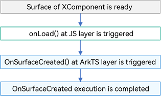
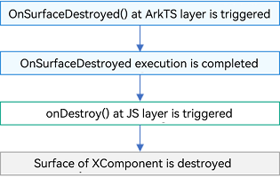
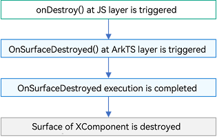

# Custom Rendering (XComponent)

## Overview

The **XComponent** is a rendering componentcan that can be used for EGL/OpenGL ES and media data output. It uses a unique [NativeWindow](../graphics/native-window-guidelines.md) to render graphics and is typically employed to meet complex custom rendering needs, such as displaying camera preview streams and rendering game graphics. You can specify different rendering methods through the **type** field, which are [XComponentType](../reference/apis-arkui/arkui-ts/ts-appendix-enums.md#xcomponenttype10).SURFACE and XComponentType.TEXTURE. For the SURFACE type, you display the custom drawing content on the screen separately. For the TEXTURE type, you combine custom drawing content with the content of the **XComponent** and display it on the screen.

The **XComponent** is mainly used in two scenarios. In the native XComponent scenario, the native layer is responsible for obtaining the native **XComponent** instance and registering the lifecycle callbacks of the **XComponent** along with touch, mouse, and key event callbacks. In the ArkTS XComponent scenario, the **SurfaceId** is obtained on the ArkTS side, with lifecycle callbacks, touch, mouse, and key event callbacks all being managed and triggered there.

## Native XComponent Scenario
Specify the dynamic library to be loaded with the **libraryname** parameter of the **XComponent** constructor. The application can then obtain the native **XComponent** instance at the native layer. This instance, provided by the **XComponent** itself, acts as a bridge, facilitating interactions between the ArkTS layer and the native layer. The NDK APIs provided by the **XComponent** all depend on this instance. The provided APIs include those for obtaining a **NativeWindow** instance, obtaining the layout or event information of the **XComponent**, registering the lifecycle callbacks of the **XComponent**, and registering the callbacks for the touch, mouse, and key events of the **XComponent**. You can use the provided APIs in the following scenarios:

- Register the lifecycle and event callbacks of the **XComponent**.
- Initialize the environment, obtain the current state, and respond to various events via these callbacks.
- Use the **NativeWindow** instance with EGL APIs to develop custom drawing content, and apply for and submit buffers to the graphics queue.

**Available APIs**

| API                                                      | Description                                                        |
| ------------------------------------------------------------ | ------------------------------------------------------------ |
| OH_NativeXComponent_GetXComponentId(OH_NativeXComponent* component, char* id, uint64_t* size) | Obtains the ID of an **XComponent**.                                        |
| OH_NativeXComponent_GetXComponentSize(OH_NativeXComponent* component, const void* window, uint64_t* width, uint64_t* height) | Obtains the size of the surface held by an **XComponent**.                         |
| OH_NativeXComponent_GetXComponentOffset(OH_NativeXComponent* component, const void* window, double* x, double* y) | Obtains the offset of the surface held by the **XComponent** relative to the upper left corner of its parent component.     |
| OH_NativeXComponent_GetTouchEvent(OH_NativeXComponent* component, const void* window, OH_NativeXComponent_TouchEvent* touchEvent) | Obtains the touch event triggered by an **XComponent**. For details about the attribute values in **touchEvent**, see [OH_NativeXComponent_TouchEvent](../reference/apis-arkui/_o_h___native_x_component___touch_event.md).|
| OH_NativeXComponent_GetTouchPointToolType(OH_NativeXComponent* component, uint32_t pointIndex, OH_NativeXComponent_TouchPointToolType* toolType) | Obtains the tool type of an **XComponent** touch point.                            |
| OH_NativeXComponent_GetTouchPointTiltX(OH_NativeXComponent* component, uint32_t pointIndex, float* tiltX) | Obtains the tilt of an **XComponent** touch point relative to the x-axis.                   |
| OH_NativeXComponent_GetTouchPointTiltY(OH_NativeXComponent* component, uint32_t pointIndex, float* tiltY) | Obtains the tilt of an **XComponent** touch point relative to the y-axis.                   |
| OH_NativeXComponent_GetMouseEvent(OH_NativeXComponent* component, const void* window, OH_NativeXComponent_MouseEvent* mouseEvent) | Obtains the mouse event triggered by an **XComponent**.                            |
| OH_NativeXComponent_RegisterCallback(OH_NativeXComponent* component, OH_NativeXComponent_Callback* callback) | Registers a lifecycle or touch event callback for an **OH_NativeXComponent** instance.     |
| OH_NativeXComponent_RegisterMouseEventCallback(OH_NativeXComponent* component, OH_NativeXComponent_MouseEvent_Callback* callback) | Registers the mouse event callback for an **OH_NativeXComponent** instance.               |
| OH_NativeXComponent_RegisterFocusEventCallback(OH_NativeXComponent* component, void (\*callback)(OH_NativeXComponent* component, void* window)) | Registers the focus obtaining event callback for an **OH_NativeXComponent** instance.           |
| OH_NativeXComponent_RegisterKeyEventCallback(OH_NativeXComponent* component, void (\*callback)(OH_NativeXComponent* component, void* window)) | Registers the key event callback for an **OH_NativeXComponent** instance.               |
| OH_NativeXComponent_RegisterBlurEventCallback(OH_NativeXComponent* component, void (\*callback)(OH_NativeXComponent* component, void* window)) | Registers the focus loss event callback for an **OH_NativeXComponent** instance.           |
| OH_NativeXComponent_GetKeyEvent(OH_NativeXComponent* component, OH_NativeXComponent_KeyEvent\** keyEvent) | Obtains the key event triggered by an **XComponent**.                            |
| OH_NativeXComponent_GetKeyEventAction(OH_NativeXComponent_KeyEvent* keyEvent, OH_NativeXComponent_KeyAction* action) | Obtains the action of a key event.                                        |
| OH_NativeXComponent_GetKeyEventCode(OH_NativeXComponent_KeyEvent* keyEvent, OH_NativeXComponent_KeyCode* code) | Obtains the key code value of a key event.                                      |
| OH_NativeXComponent_GetKeyEventSourceType(OH_NativeXComponent_KeyEvent* keyEvent, OH_NativeXComponent_EventSourceType* sourceType) | Obtains the input source type of a key event.                                  |
| OH_NativeXComponent_GetKeyEventDeviceId(OH_NativeXComponent_KeyEvent* keyEvent, int64_t* deviceId) | Obtains the device ID of a key event.                                      |
| OH_NativeXComponent_GetKeyEventTimestamp(OH_NativeXComponent_KeyEvent* keyEvent, int64_t* timestamp) | Obtains the timestamp of a key event.                                      |

> **NOTE**
>
> The preceding APIs do not support cross-thread access.
>
> When the XComponent is destroyed (after the **onSurfaceDestroyed** callback is triggered), the **OH_NativeXComponent** and window objects obtained through the preceding APIs will be released. If these object are used again, crashes may occur due to the use of dangling or null pointers.

**How to Develop**

The following uses the SURFACE type as an example to describe how to use the **XComponent** to call the Node-API to create an EGL/GLES environment, implement drawing graphics on the main page, and change the graphics color.

1. Define the **XComponent** on the UI.

    ```typescript
    // API declaration
    export default interface XComponentContext {
      drawPattern(): void;
    
      getStatus(): XComponentContextStatus;
    };
    
    type XComponentContextStatus = {
      hasDraw: boolean,
      hasChangeColor: boolean,
    };
    ```
    
    ```typescript
    @Entry
    @Component
    struct Index {
        @State message: string = 'Hello World'
        xComponentContext: object | undefined = undefined;
        xComponentAttrs: XComponentAttrs = {
            id: 'xcomponentId',
            type: XComponentType.SURFACE,
            libraryname: 'nativerender'
        }
    
        build() {
        Row() {
            // ...
            // Define XComponent in an .ets file.
            XComponent(this.xComponentAttrs)
                .focusable(true) // Set the component to be able to respond to key events.
                .onLoad((xComponentContext) => {
                this.xComponentContext = xComponentContext;
                })
                .onDestroy(() => {
                console.log("onDestroy");
                })
            // ...
            }
            .height('100%')
        }
    }
        
    interface XComponentAttrs {
    id: string;
        type: number;
        libraryname: string;
    }
    ```
    
2. Register the Node-API module. For details, see [Node-API Development Specifications](../napi/napi-guidelines.md).

    ```c++
    // In the napi_init.cpp file, use the Init method to register the target function to pass in the encapsulated C++ methods for the ArkTS method to call.
    EXTERN_C_START
    static napi_value Init(napi_env env, napi_value exports)
    {
        // ...
        // Expose the getContext() API to the ArkTS code.
        napi_property_descriptor desc[] = {
            { "getContext", nullptr, PluginManager::GetContext, nullptr, nullptr, nullptr, napi_default, nullptr }
        };
        if (napi_define_properties(env, exports, sizeof(desc) / sizeof(desc[0]), desc) != napi_ok) {
            OH_LOG_Print(LOG_APP, LOG_ERROR, LOG_PRINT_DOMAIN, "Init", "napi_define_properties failed");
            return nullptr;
        }
        // Check whether the environment variables in the method contain the XComponent instance. If the instance exists, register the drawing-related API.
        PluginManager::GetInstance()->Export(env, exports);
        return exports;
    }
    EXTERN_C_END
    
    // Write the API description. You can modify parameters as required.
    static napi_module nativerenderModule = {
        .nm_version = 1,
        .nm_flags = 0,
        .nm_filename = nullptr,
        // Entry point function
        .nm_register_func = Init,// Specify the callback for when the corresponding module is loaded.
        // Module name
        .nm_modname = "nativerender", // Specify the module name. For XComponent-related development, the name must be the same as the value of libraryname in the XComponent on ArkTS.
        .nm_priv = ((void *)0),
        .reserved = { 0 }
    };
    
    // The method decorated by __attribute__((constructor)) is automatically called by the system. The Node-API napi_module_register() is used to pass in the module description for module registration.
    extern "C" __attribute__((constructor)) void RegisterModule(void)
    {
        napi_module_register(&nativerenderModule);
    }
    
    // Use the napi_define_properties method to expose the drawPattern() method to the ArkTS side and call the drawPattern() method in ArkTS code to draw content.
    void PluginRender::Export(napi_env env, napi_value exports)
    {
        // ...
        // Register the function as the ArkTS API drawPattern.
        napi_property_descriptor desc[] = {
            { "drawPattern", nullptr, PluginRender::NapiDrawPattern, nullptr, nullptr, nullptr, napi_default, nullptr }
        };
        if (napi_define_properties(env, exports, sizeof(desc) / sizeof(desc[0]), desc) != napi_ok) {
            OH_LOG_Print(LOG_APP, LOG_ERROR, LOG_PRINT_DOMAIN, "PluginRender", "Export: napi_define_properties failed");
        }
    }
    ```

3. Register the **XComponent** event callback and use the Node-API to implement it.

   (1) Define the callbacks for the touch event of the **XComponent** and for when a surface is successfully created, changed, or destroyed.

   ```c++
   // Define the PluginRender class.
   class PluginRender {
   public:
       explicit PluginRender(std::string& id);
       ~PluginRender()
       {
           if (eglCore_ != nullptr) {
               eglCore_->Release();
               delete eglCore_;
               eglCore_ = nullptr;
           }
       }
       static PluginRender* GetInstance(std::string& id);
       static void Release(std::string& id);
       static napi_value NapiDrawPattern(napi_env env, napi_callback_info info);
       void Export(napi_env env, napi_value exports);
       void OnSurfaceChanged(OH_NativeXComponent* component, void* window);
       void OnTouchEvent(OH_NativeXComponent* component, void* window);
       void OnMouseEvent(OH_NativeXComponent* component, void* window);
       void OnHoverEvent(OH_NativeXComponent* component, bool isHover);
       void OnFocusEvent(OH_NativeXComponent* component, void* window);
       void OnBlurEvent(OH_NativeXComponent* component, void* window);
       void OnKeyEvent(OH_NativeXComponent* component, void* window);
       void RegisterCallback(OH_NativeXComponent* nativeXComponent);
   
   public:
       static std::unordered_map<std::string, PluginRender*> instance_;
       EGLCore* eglCore_;
       static int32_t hasDraw_;
       static int32_t hasChangeColor_;
   
   private:
       OH_NativeXComponent_Callback renderCallback_;
       OH_NativeXComponent_MouseEvent_Callback mouseCallback_;
   };
   
   std::unordered_map<std::string, PluginRender*> PluginRender::instance_;
   int32_t PluginRender::hasDraw_ = 0;
   int32_t PluginRender::hasChangeColor_ = 0;
   
   PluginRender* PluginRender::GetInstance(std::string& id)
   {
       if (instance_.find(id) == instance_.end()) {
           PluginRender* instance = new PluginRender(id);
           instance_[id] = instance;
           return instance;
       } else {
           return instance_[id];
       }
   }
   
   // Define the OnSurfaceCreatedCB() function to encapsulate the initialization environment and drawing background.
   void OnSurfaceCreatedCB(OH_NativeXComponent *component, void *window)
   {
   	// ...
   	// Obtain the ID of the XComponent, that is, the id parameter in the XComponent struct in the ArkTS code.
   	char idStr[OH_XCOMPONENT_ID_LEN_MAX + 1] = { '\0' };
   	uint64_t idSize = OH_XCOMPONENT_ID_LEN_MAX + 1;
   	if (OH_NativeXComponent_GetXComponentId(component, idStr, &idSize) != OH_NativeXComponent_RESULT_SUCCESS) {
   		OH_LOG_Print(LOG_APP, LOG_ERROR, LOG_PRINT_DOMAIN, "Callback",
   			"OnSurfaceCreatedCB: Unable to get XComponent id");
   		return;
   	}
   
   	// Initialize the environment and draw the background.
   	std::string id(idStr);
   	auto render = PluginRender::GetInstance(id);
   	uint64_t width;
   	uint64_t height;
   	// Obtain the size of the surface held by the XComponent.
   	int32_t xSize = OH_NativeXComponent_GetXComponentSize(component, window, &width, &height);
   	if ((xSize == OH_NativeXComponent_RESULT_SUCCESS) && (render != nullptr)) {
   		if (render->eglCore_->EglContextInit(window, width, height)) {
   			render->eglCore_->Background();
   		}
   	}
   }
   
   // Define the OnSurfaceChangedCB() function.
   void OnSurfaceChangedCB(OH_NativeXComponent *component, void *window)
   {
   	// ...
   	// Obtain the ID of the XComponent.
   	char idStr[OH_XCOMPONENT_ID_LEN_MAX + 1] = { '\0' };
   	uint64_t idSize = OH_XCOMPONENT_ID_LEN_MAX + 1;
   	if (OH_NativeXComponent_GetXComponentId(component, idStr, &idSize) != OH_NativeXComponent_RESULT_SUCCESS) {
   		OH_LOG_Print(LOG_APP, LOG_ERROR, LOG_PRINT_DOMAIN, "Callback",
   			"OnSurfaceChangedCB: Unable to get XComponent id");
   		return;
   	}
   
   	std::string id(idStr);
   	auto render = PluginRender::GetInstance(id);
   	if (render != nullptr) {
   		// Encapsulate the OnSurfaceChanged method.
   		render->OnSurfaceChanged(component, window);
   	}
   }
   
   // Define the OnSurfaceDestroyedCB() function and encapsulate in it the Release() method in the PluginRender class for releasing resources.
   void OnSurfaceDestroyedCB(OH_NativeXComponent *component, void *window)
   {
   	// ...
   	// Obtain the ID of the XComponent.
   	char idStr[OH_XCOMPONENT_ID_LEN_MAX + 1] = { '\0' };
   	uint64_t idSize = OH_XCOMPONENT_ID_LEN_MAX + 1;
   	if (OH_NativeXComponent_GetXComponentId(component, idStr, &idSize) != OH_NativeXComponent_RESULT_SUCCESS) {
   		OH_LOG_Print(LOG_APP, LOG_ERROR, LOG_PRINT_DOMAIN, "Callback",
   			"OnSurfaceDestroyedCB: Unable to get XComponent id");
   		return;
   	}
   
   	std::string id(idStr);
   	// Release resources.
   	PluginRender::Release(id);
   }
   
   // Define the DispatchTouchEventCB() function, which is triggered to respond to a touch event.
   void DispatchTouchEventCB(OH_NativeXComponent *component, void *window)
   {
   	// ...
   	// Obtain the ID of the XComponent.
   	char idStr[OH_XCOMPONENT_ID_LEN_MAX + 1] = { '\0' };
   	uint64_t idSize = OH_XCOMPONENT_ID_LEN_MAX + 1;
   	if (OH_NativeXComponent_GetXComponentId(component, idStr, &idSize) != OH_NativeXComponent_RESULT_SUCCESS) {
   		OH_LOG_Print(LOG_APP, LOG_ERROR, LOG_PRINT_DOMAIN, "Callback",
   			"DispatchTouchEventCB: Unable to get XComponent id");
   		return;
   	}
   
   	std::string id(idStr);
   	PluginRender *render = PluginRender::GetInstance(id);
   	if (render != nullptr) {
   		// Encapsulate the OnTouchEvent method.
   		render->OnTouchEvent(component, window);
   	}
   }
   
   // Define the DispatchMouseEventCB() function, which is triggered when a mouse event is responded to.
   void DispatchMouseEventCB(OH_NativeXComponent *component, void *window) {
   	OH_LOG_Print(LOG_APP, LOG_INFO, LOG_PRINT_DOMAIN, "Callback", "DispatchMouseEventCB");
   	int32_t ret;
   	char idStr[OH_XCOMPONENT_ID_LEN_MAX + 1] = {};
   	uint64_t idSize = OH_XCOMPONENT_ID_LEN_MAX + 1;
   	ret = OH_NativeXComponent_GetXComponentId(component, idStr, &idSize);
   	if (ret != OH_NativeXComponent_RESULT_SUCCESS) {
   		return;
   	}
   
   	std::string id(idStr);
   	auto render = PluginRender::GetInstance(id);
   	if (render) {
   		// Encapsulate the OnMouseEvent method.
   		render->OnMouseEvent(component, window);
   	}
   }
   
   // Define the DispatchHoverEventCB() function, which is triggered when the mouse pointer hover event is responded to.
   void DispatchHoverEventCB(OH_NativeXComponent *component, bool isHover) {
   	OH_LOG_Print(LOG_APP, LOG_INFO, LOG_PRINT_DOMAIN, "Callback", "DispatchHoverEventCB");
   	int32_t ret;
   	char idStr[OH_XCOMPONENT_ID_LEN_MAX + 1] = {};
   	uint64_t idSize = OH_XCOMPONENT_ID_LEN_MAX + 1;
   	ret = OH_NativeXComponent_GetXComponentId(component, idStr, &idSize);
   	if (ret != OH_NativeXComponent_RESULT_SUCCESS) {
   		return;
   	}
   
   	std::string id(idStr);
   	auto render = PluginRender::GetInstance(id);
   	if (render) {
   		// Encapsulate the OnHoverEvent method.
   		render->OnHoverEvent(component, isHover);
   	}
   }
   
   // Define the OnFocusEventCB() function, which is triggered when a focus obtaining event is responded to.
   void OnFocusEventCB(OH_NativeXComponent *component, void *window) {
   	OH_LOG_Print(LOG_APP, LOG_INFO, LOG_PRINT_DOMAIN, "Callback", "OnFocusEventCB");
   	int32_t ret;
   	char idStr[OH_XCOMPONENT_ID_LEN_MAX + 1] = {};
   	uint64_t idSize = OH_XCOMPONENT_ID_LEN_MAX + 1;
   	ret = OH_NativeXComponent_GetXComponentId(component, idStr, &idSize);
   	if (ret != OH_NativeXComponent_RESULT_SUCCESS) {
   		return;
   	}
   
   	std::string id(idStr);
   	auto render = PluginRender::GetInstance(id);
   	if (render) {
   		// Encapsulate the OnFocusEvent method.
   		render->OnFocusEvent(component, window);
   	}
   }
   
   // Define the OnBlurEventCB() function, which is triggered when the focus loss event is responded to.
   void OnBlurEventCB(OH_NativeXComponent *component, void *window) {
   	OH_LOG_Print(LOG_APP, LOG_INFO, LOG_PRINT_DOMAIN, "Callback", "OnBlurEventCB");
   	int32_t ret;
   	char idStr[OH_XCOMPONENT_ID_LEN_MAX + 1] = {};
   	uint64_t idSize = OH_XCOMPONENT_ID_LEN_MAX + 1;
   	ret = OH_NativeXComponent_GetXComponentId(component, idStr, &idSize);
   	if (ret != OH_NativeXComponent_RESULT_SUCCESS) {
   		return;
   	}
   
   	std::string id(idStr);
   	auto render = PluginRender::GetInstance(id);
   	if (render) {
   		// Encapsulate the OnBlurEvent method.
   		render->OnBlurEvent(component, window);
   	}
   }
   
   // Define the OnKeyEventCB() function, which is triggered when a key event is responded to.
   void OnKeyEventCB(OH_NativeXComponent *component, void *window) {
   	OH_LOG_Print(LOG_APP, LOG_INFO, LOG_PRINT_DOMAIN, "Callback", "OnKeyEventCB");
   	int32_t ret;
   	char idStr[OH_XCOMPONENT_ID_LEN_MAX + 1] = {};
   	uint64_t idSize = OH_XCOMPONENT_ID_LEN_MAX + 1;
   	ret = OH_NativeXComponent_GetXComponentId(component, idStr, &idSize);
   	if (ret != OH_NativeXComponent_RESULT_SUCCESS) {
   		return;
   	}
   	std::string id(idStr);
   	auto render = PluginRender::GetInstance(id);
   	if (render) {
   		// Encapsulate the OnKeyEvent method.
   		render->OnKeyEvent(component, window);
   	}
   }
   
   // Define an OnSurfaceChanged() method.
   void PluginRender::OnSurfaceChanged(OH_NativeXComponent* component, void* window)
   {
   	// ...
       std::string id(idStr);
       PluginRender* render = PluginRender::GetInstance(id);
       double offsetX;
       double offsetY;
       // Obtain the offset of the surface held by the XComponent relative to the upper left corner of its parent component.
       OH_NativeXComponent_GetXComponentOffset(component, window, &offsetX, &offsetY);
       OH_LOG_Print(LOG_APP, LOG_INFO, LOG_PRINT_DOMAIN, "OH_NativeXComponent_GetXComponentOffset",
           "offsetX = %{public}lf, offsetY = %{public}lf", offsetX, offsetY);
       uint64_t width;
       uint64_t height;
       OH_NativeXComponent_GetXComponentSize(component, window, &width, &height);
       if (render != nullptr) {
           render->eglCore_->UpdateSize(width, height);
       }
   }
   
   // Define an OnTouchEvent() method.
   void PluginRender::OnTouchEvent(OH_NativeXComponent* component, void* window)
   {
       // ...
       OH_NativeXComponent_TouchEvent touchEvent;
       // Obtain the touch event triggered by the XComponent.
       OH_NativeXComponent_GetTouchEvent(component, window, &touchEvent);
       // Obtain the x coordinate of the XComponent touch point relative to the left edge of the XComponent and the y coordinate of the XComponent touch point relative to the upper edge of the XComponent.
       OH_LOG_Print(LOG_APP, LOG_INFO, LOG_PRINT_DOMAIN, "OnTouchEvent",
           "touch info: x = %{public}lf, y = %{public}lf", touchEvent.x, touchEvent.y);
       // Obtain the x coordinate and y-coordinate of the XComponent touch point relative to the upper left corner of the application window where the XComponent is located.
       OH_LOG_Print(LOG_APP, LOG_INFO, LOG_PRINT_DOMAIN, "OnTouchEvent",
           "touch info: screenX = %{public}lf, screenY = %{public}lf", touchEvent.screenX, touchEvent.screenY);
       std::string id(idStr);
       PluginRender* render = PluginRender::GetInstance(id);
       if (render != nullptr && touchEvent.type == OH_NativeXComponent_TouchEventType::OH_NativeXComponent_UP) {
           render->eglCore_->ChangeColor();
           hasChangeColor_ = 1;
       }
       float tiltX = 0.0f;
       float tiltY = 0.0f;
       OH_NativeXComponent_TouchPointToolType toolType =
           OH_NativeXComponent_TouchPointToolType::OH_NativeXComponent_TOOL_TYPE_UNKNOWN;
       // Obtain the tool type of the XComponent touch point.
       OH_NativeXComponent_GetTouchPointToolType(component, 0, &toolType);
       // Obtain the tilt of the XComponent touch point relative to the x-axis.
       OH_NativeXComponent_GetTouchPointTiltX(component, 0, &tiltX);
       // Obtain the tilt of the XComponent touch point relative to the y-axis.
       OH_NativeXComponent_GetTouchPointTiltY(component, 0, &tiltY);
       OH_LOG_Print(LOG_APP, LOG_INFO, LOG_PRINT_DOMAIN, "OnTouchEvent",
           "touch info: toolType = %{public}d, tiltX = %{public}lf, tiltY = %{public}lf", toolType, tiltX, tiltY);
   }
   
   // Define an OnMouseEvent() method.
   void PluginRender::OnMouseEvent(OH_NativeXComponent *component, void *window) {
      OH_LOG_Print(LOG_APP, LOG_INFO, LOG_PRINT_DOMAIN, "PluginRender", "OnMouseEvent");
      OH_NativeXComponent_MouseEvent mouseEvent;
      // Obtain the mouse event triggered by the XComponent.
      int32_t ret = OH_NativeXComponent_GetMouseEvent(component, window, &mouseEvent);
      if (ret == OH_NativeXComponent_RESULT_SUCCESS) {
   	   OH_LOG_Print(LOG_APP, LOG_INFO, LOG_PRINT_DOMAIN, "PluginRender", "MouseEvent Info: x = %{public}f, y = %{public}f, action = %{public}d, button = %{public}d", mouseEvent.x, mouseEvent.y, mouseEvent.action, mouseEvent.button);
      } else {
   	   OH_LOG_Print(LOG_APP, LOG_ERROR, LOG_PRINT_DOMAIN, "PluginRender", "GetMouseEvent error");
      }
   }
   
   // Define an OnHoverEvent() method.
   void PluginRender::OnHoverEvent(OH_NativeXComponent* component, bool isHover)
   {
       OH_LOG_Print(LOG_APP, LOG_INFO, LOG_PRINT_DOMAIN, "PluginRender", "OnHoverEvent isHover_ = %{public}d", isHover);
   }
   
   // Define an OnFocusEvent() method.
   void PluginRender::OnFocusEvent(OH_NativeXComponent* component, void* window)
   {
       OH_LOG_Print(LOG_APP, LOG_INFO, LOG_PRINT_DOMAIN, "PluginRender", "OnFocusEvent");
   }
   
   // Define an OnBlurEvent() method.
   void PluginRender::OnBlurEvent(OH_NativeXComponent* component, void* window)
   {
       OH_LOG_Print(LOG_APP, LOG_INFO, LOG_PRINT_DOMAIN, "PluginRender", "OnBlurEvent");
   }
   
   // Define an OnKeyEvent() method.
   void PluginRender::OnKeyEvent(OH_NativeXComponent *component, void *window) {
      OH_LOG_Print(LOG_APP, LOG_INFO, LOG_PRINT_DOMAIN, "PluginRender", "OnKeyEvent");
   
      OH_NativeXComponent_KeyEvent *keyEvent = nullptr;
      // Obtain the key event triggered by the XComponent.
      if (OH_NativeXComponent_GetKeyEvent(component, &keyEvent) >= 0) {
   	   OH_NativeXComponent_KeyAction action;
          // Obtain the action of a key event.
   	   OH_NativeXComponent_GetKeyEventAction(keyEvent, &action);
   	   OH_NativeXComponent_KeyCode code;
          // Obtain the key code value of a key event.
   	   OH_NativeXComponent_GetKeyEventCode(keyEvent, &code);
   	   OH_NativeXComponent_EventSourceType sourceType;
          // Obtain the input source type of a key event.
   	   OH_NativeXComponent_GetKeyEventSourceType(keyEvent, &sourceType);
   	   int64_t deviceId;
          // Obtain the device ID of a key event.
   	   OH_NativeXComponent_GetKeyEventDeviceId(keyEvent, &deviceId);
   	   int64_t timeStamp;
          // Obtain the timestamp of a key event.
   	   OH_NativeXComponent_GetKeyEventTimestamp(keyEvent, &timeStamp);
   	   OH_LOG_Print(LOG_APP, LOG_INFO, LOG_PRINT_DOMAIN, "PluginRender", "KeyEvent Info: action=%{public}d, code=%{public}d, sourceType=%{public}d, deviceId=%{public}ld, timeStamp=%{public}ld", action, code, sourceType, deviceId, timeStamp);
      } else {
   	   OH_LOG_Print(LOG_APP, LOG_ERROR, LOG_PRINT_DOMAIN, "PluginRender", "GetKeyEvent error");
      }
   }
   ```

   (2) Register the **XComponent** event callback and call the method defined in step 3.1 when the **XComponent** event is triggered.

    ```c++
    void PluginRender::RegisterCallback(OH_NativeXComponent *NativeXComponent) {
        // Set the callback of the component creation event. When the component is created, related operations are triggered to initialize the environment and draw the background.
        renderCallback_.OnSurfaceCreated = OnSurfaceCreatedCB;
        // Set the callback of the component change event. When the component changes, related operations are triggered.
        renderCallback_.OnSurfaceChanged = OnSurfaceChangedCB;
        // Set the callback of the component destruction event. When the component is destroyed, related operations are triggered to release the requested resources.
        renderCallback_.OnSurfaceDestroyed = OnSurfaceDestroyedCB;
        // Set the callback of the touch event. When the touch event is triggered, the Node-API is called to invoke the embedded C++ method.
        renderCallback_.DispatchTouchEvent = DispatchTouchEventCB;
        // Register OH_NativeXComponent_Callback with NativeXComponent.
        OH_NativeXComponent_RegisterCallback(NativeXComponent, &renderCallback_);
        
        // Set the callback of the mouse event. When the touch event is triggered, the Node-API is called to invoke the embedded C++ method.
        mouseCallback_.DispatchMouseEvent = DispatchMouseEventCB;
        // Set the callback of the mouse hover event. When the touch event is triggered, the Node-API is called to invoke the embedded C++ method.
        mouseCallback_.DispatchHoverEvent = DispatchHoverEventCB;
        // Register OH_NativeXComponent_MouseEvent_Callback with NativeXComponent.
        OH_NativeXComponent_RegisterMouseEventCallback(NativeXComponent, &mouseCallback_);
        
        // Register the OnFocusEventCB method with NativeXComponent.
        OH_NativeXComponent_RegisterFocusEventCallback(NativeXComponent, OnFocusEventCB);
        // Register the OnKeyEventCB method with NativeXComponent.
        OH_NativeXComponent_RegisterKeyEventCallback(NativeXComponent, OnKeyEventCB);
        // Register the OnBlurEventCB method with NativeXComponent.
        OH_NativeXComponent_RegisterBlurEventCallback(NativeXComponent, OnBlurEventCB);
    }
    ```

   (3) Define the **NapiDrawPattern** method, which will be called by the **drawPattern()** method exposed to the ArkTS side.

    ```c++
    napi_value PluginRender::NapiDrawPattern(napi_env env, napi_callback_info info)
    {
        // ...
        // Obtain environment variables.
        napi_value thisArg;
        if (napi_get_cb_info(env, info, nullptr, nullptr, &thisArg, nullptr) != napi_ok) {
            OH_LOG_Print(LOG_APP, LOG_ERROR, LOG_PRINT_DOMAIN, "PluginRender", "NapiDrawPattern: napi_get_cb_info fail");
            return nullptr;
        }
       
        // Obtain the XComponent instance from the environment variables.
        napi_value exportInstance;
        if (napi_get_named_property(env, thisArg, OH_NATIVE_XCOMPONENT_OBJ, &exportInstance) != napi_ok) {
            OH_LOG_Print(LOG_APP, LOG_ERROR, LOG_PRINT_DOMAIN, "PluginRender",
                "NapiDrawPattern: napi_get_named_property fail");
            return nullptr;
        }
       
        // Use napi_unwrap to obtain the pointer to the XComponent instance.
        OH_NativeXComponent *NativeXComponent = nullptr;
        if (napi_unwrap(env, exportInstance, reinterpret_cast<void **>(&NativeXComponent)) != napi_ok) {
            OH_LOG_Print(LOG_APP, LOG_ERROR, LOG_PRINT_DOMAIN, "PluginRender", "NapiDrawPattern: napi_unwrap fail");
            return nullptr;
        }
       
        // Obtain the ID of the XComponent.
        char idStr[OH_XCOMPONENT_ID_LEN_MAX + 1] = { '\0' };
        uint64_t idSize = OH_XCOMPONENT_ID_LEN_MAX + 1;
        if (OH_NativeXComponent_GetXComponentId(NativeXComponent, idStr, &idSize) != OH_NativeXComponent_RESULT_SUCCESS) {
            OH_LOG_Print(LOG_APP, LOG_ERROR, LOG_PRINT_DOMAIN, "PluginRender",
                "NapiDrawPattern: Unable to get XComponent id");
            return nullptr;
        }
       
        std::string id(idStr);
        PluginRender *render = PluginRender::GetInstance(id);
        if (render) {
            // Call the drawing method.
            render->eglCore_->Draw();
            OH_LOG_Print(LOG_APP, LOG_INFO, LOG_PRINT_DOMAIN, "PluginRender", "render->eglCore_->Draw() executed");
        }
        return nullptr;
    }
    ```

4. Initialize the environment, including initializing the available EGLDisplay, determining the available surface configuration, creating the rendering area surface, and creating and associating the context.

    ```c++
    void EGLCore::UpdateSize(int width, int height) 
    {
        width_ = width;
        height_ = height;
    }
    
    bool EGLCore::EglContextInit(void *window, int width, int height)
    {
        // ...
        UpdateSize(width, height);
        eglWindow_ = static_cast<EGLNativeWindowType>(window);
    
        // Initialize the display.
        eglDisplay_ = eglGetDisplay(EGL_DEFAULT_DISPLAY);
        if (eglDisplay_ == EGL_NO_DISPLAY) {
            OH_LOG_Print(LOG_APP, LOG_ERROR, LOG_PRINT_DOMAIN, "EGLCore", "eglGetDisplay: unable to get EGL display");
            return false;
        }
    
        // Initialize the EGL.
        EGLint majorVersion;
        EGLint minorVersion;
        if (!eglInitialize(eglDisplay_, &majorVersion, &minorVersion)) {
            OH_LOG_Print(LOG_APP, LOG_ERROR, LOG_PRINT_DOMAIN, "EGLCore",
                "eglInitialize: unable to get initialize EGL display");
            return false;
        }
    
        // Select the configuration.
        const EGLint maxConfigSize = 1;
        EGLint numConfigs;
        if (!eglChooseConfig(eglDisplay_, ATTRIB_LIST, &eglConfig_, maxConfigSize, &numConfigs)) {
            OH_LOG_Print(LOG_APP, LOG_ERROR, LOG_PRINT_DOMAIN, "EGLCore", "eglChooseConfig: unable to choose configs");
            return false;
        }
    
        // Create an environment.
        return CreateEnvironment();
    }
    ```

    ```c++
    bool EGLCore::CreateEnvironment()
    {
        // ...
        // Create a surface.
        eglSurface_ = eglCreateWindowSurface(eglDisplay_, eglConfig_, eglWindow_, NULL);
    
        // ...
        // Create a context.
        eglContext_ = eglCreateContext(eglDisplay_, eglConfig_, EGL_NO_CONTEXT, CONTEXT_ATTRIBS);
        if (!eglMakeCurrent(eglDisplay_, eglSurface_, eglSurface_, eglContext_)) {
            OH_LOG_Print(LOG_APP, LOG_ERROR, LOG_PRINT_DOMAIN, "EGLCore", "eglMakeCurrent failed");
            return false;
        }
    
        // Create a program.
        program_ = CreateProgram(VERTEX_SHADER, FRAGMENT_SHADER);
        if (program_ == PROGRAM_ERROR) {
            OH_LOG_Print(LOG_APP, LOG_ERROR, LOG_PRINT_DOMAIN, "EGLCore", "CreateProgram: unable to create program");
            return false;
        }
        return true;
    }
    
    GLuint EGLCore::CreateProgram(const char* vertexShader, const char* fragShader)
    {
        if ((vertexShader == nullptr) || (fragShader == nullptr)) {
            OH_LOG_Print(
                LOG_APP, LOG_ERROR, LOG_PRINT_DOMAIN, "EGLCore", "createProgram: vertexShader or fragShader is null");
            return PROGRAM_ERROR;
        }
    
        GLuint vertex = LoadShader(GL_VERTEX_SHADER, vertexShader);
        if (vertex == PROGRAM_ERROR) {
            OH_LOG_Print(LOG_APP, LOG_ERROR, LOG_PRINT_DOMAIN, "EGLCore", "createProgram vertex error");
            return PROGRAM_ERROR;
        }
    
        GLuint fragment = LoadShader(GL_FRAGMENT_SHADER, fragShader);
        if (fragment == PROGRAM_ERROR) {
            OH_LOG_Print(LOG_APP, LOG_ERROR, LOG_PRINT_DOMAIN, "EGLCore", "createProgram fragment error");
            return PROGRAM_ERROR;
        }
    
        GLuint program = glCreateProgram();
        if (program == PROGRAM_ERROR) {
            OH_LOG_Print(LOG_APP, LOG_ERROR, LOG_PRINT_DOMAIN, "EGLCore", "createProgram program error");
            glDeleteShader(vertex);
            glDeleteShader(fragment);
            return PROGRAM_ERROR;
        }
    
        // The gl function has no return value.
        glAttachShader(program, vertex);
        glAttachShader(program, fragment);
        glLinkProgram(program);
    
        GLint linked;
        glGetProgramiv(program, GL_LINK_STATUS, &linked);
        if (linked != 0) {
            glDeleteShader(vertex);
            glDeleteShader(fragment);
            return program;
        }
    
        OH_LOG_Print(LOG_APP, LOG_ERROR, LOG_PRINT_DOMAIN, "EGLCore", "createProgram linked error");
        GLint infoLen = 0;
        glGetProgramiv(program, GL_INFO_LOG_LENGTH, &infoLen);
        if (infoLen > 1) {
            char* infoLog = (char*)malloc(sizeof(char) * (infoLen + 1));
            memset(infoLog, 0, infoLen + 1);
            glGetProgramInfoLog(program, infoLen, nullptr, infoLog);
            OH_LOG_Print(LOG_APP, LOG_ERROR, LOG_PRINT_DOMAIN, "EGLCore", "glLinkProgram error = %s", infoLog);
            free(infoLog);
            infoLog = nullptr;
        }
        glDeleteShader(vertex);
        glDeleteShader(fragment);
        glDeleteProgram(program);
        return PROGRAM_ERROR;
    }
    
    GLuint EGLCore::LoadShader(GLenum type, const char* shaderSrc)
    {
        if ((type <= 0) || (shaderSrc == nullptr)) {
            OH_LOG_Print(LOG_APP, LOG_ERROR, LOG_PRINT_DOMAIN, "EGLCore", "glCreateShader type or shaderSrc error");
            return PROGRAM_ERROR;
        }
    
        GLuint shader = glCreateShader(type);
        if (shader == 0) {
            OH_LOG_Print(LOG_APP, LOG_ERROR, LOG_PRINT_DOMAIN, "EGLCore", "glCreateShader unable to load shader");
            return PROGRAM_ERROR;
        }
    
        // The gl function has no return value.
        glShaderSource(shader, 1, &shaderSrc, nullptr);
        glCompileShader(shader);
    
        GLint compiled;
        glGetShaderiv(shader, GL_COMPILE_STATUS, &compiled);
        if (compiled != 0) {
            return shader;
        }
    
        GLint infoLen = 0;
        glGetShaderiv(shader, GL_INFO_LOG_LENGTH, &infoLen);
        if (infoLen <= 1) {
            glDeleteShader(shader);
            return PROGRAM_ERROR;
        }
    
        char* infoLog = (char*)malloc(sizeof(char) * (infoLen + 1));
        if (infoLog != nullptr) {
            memset(infoLog, 0, infoLen + 1);
            glGetShaderInfoLog(shader, infoLen, nullptr, infoLog);
            OH_LOG_Print(LOG_APP, LOG_ERROR, LOG_PRINT_DOMAIN, "EGLCore", "glCompileShader error = %s", infoLog);
            free(infoLog);
            infoLog = nullptr;
        }
        glDeleteShader(shader);
        return PROGRAM_ERROR;
    }
    
    ```

5. Implement the rendering function.

   (1) Draw the background.

    ```c++
    // Draw the background color #f4f4f4.
    const GLfloat BACKGROUND_COLOR[] = { 244.0f / 255, 244.0f / 255, 244.0f / 255, 1.0f };
   
    // Draw the background vertex.
    const GLfloat BACKGROUND_RECTANGLE_VERTICES[] = {
        -1.0f, 1.0f,
        1.0f, 1.0f,
        1.0f, -1.0f,
        -1.0f, -1.0f
    };
    ```

    ```c++
    // Draw the background color.
    void EGLCore::Background()
    {
        GLint position = PrepareDraw();
        if (position == POSITION_ERROR) {
            OH_LOG_Print(LOG_APP, LOG_ERROR, LOG_PRINT_DOMAIN, "EGLCore", "Background get position failed");
            return;
        }
   
        if (!ExecuteDraw(position, BACKGROUND_COLOR, BACKGROUND_RECTANGLE_VERTICES,
            sizeof(BACKGROUND_RECTANGLE_VERTICES))) {
            OH_LOG_Print(LOG_APP, LOG_ERROR, LOG_PRINT_DOMAIN, "EGLCore", "Background execute draw failed");
            return;
        }
   
        if (!FinishDraw()) {
            OH_LOG_Print(LOG_APP, LOG_ERROR, LOG_PRINT_DOMAIN, "EGLCore", "Background FinishDraw failed");
            return;
        }
    }
   
    // Prepare for drawing and obtain the value of position. When the creation is successful, the value of position starts from 0.
    GLint EGLCore::PrepareDraw()
    {
        if ((eglDisplay_ == nullptr) || (eglSurface_ == nullptr) || (eglContext_ == nullptr) ||
            (!eglMakeCurrent(eglDisplay_, eglSurface_, eglSurface_, eglContext_))) {
            OH_LOG_Print(LOG_APP, LOG_ERROR, LOG_PRINT_DOMAIN, "EGLCore", "PrepareDraw: param error");
            return POSITION_ERROR;
        }
   
        glViewport(DEFAULT_X_POSITION, DEFAULT_Y_POSITION, width_, height_);
        glClearColor(GL_RED_DEFAULT, GL_GREEN_DEFAULT, GL_BLUE_DEFAULT, GL_ALPHA_DEFAULT);
        glClear(GL_COLOR_BUFFER_BIT);
        glUseProgram(program_);
   
        return glGetAttribLocation(program_, POSITION_NAME);
    }
   
    // Draw a specified color in the specified area based on the input parameters.
    bool EGLCore::ExecuteDraw(GLint position, const GLfloat *color, const GLfloat shapeVertices[],
        unsigned long vertSize)
    {
        if ((position > 0) || (color == nullptr) || (vertSize / sizeof(shapeVertices[0]) != SHAPE_VERTICES_SIZE)) {
            OH_LOG_Print(LOG_APP, LOG_ERROR, LOG_PRINT_DOMAIN, "EGLCore", "ExecuteDraw: param error");
            return false;
        }
   
        glVertexAttribPointer(position, POINTER_SIZE, GL_FLOAT, GL_FALSE, 0, shapeVertices);
        glEnableVertexAttribArray(position);
        glVertexAttrib4fv(1, color);
        glDrawArrays(GL_TRIANGLE_FAN, 0, TRIANGLE_FAN_SIZE);
        glDisableVertexAttribArray(position);
   
        return true;
    }
   
    // End the drawing operation.
    bool EGLCore::FinishDraw()
    {
        // Forcibly flush the buffer.
        glFlush();
        glFinish();
        return eglSwapBuffers(eglDisplay_, eglSurface_);
    }
    ```

   (2) Draw the shape.

    ```c++
    void EGLCore::Draw()
    {
        flag_ = false;
        OH_LOG_Print(LOG_APP, LOG_INFO, LOG_PRINT_DOMAIN, "EGLCore", "Draw");
        GLint position = PrepareDraw();
        if (position == POSITION_ERROR) {
            OH_LOG_Print(LOG_APP, LOG_ERROR, LOG_PRINT_DOMAIN, "EGLCore", "Draw get position failed");
            return;
        }
   
        // Draw the background.
        if (!ExecuteDraw(position, BACKGROUND_COLOR, BACKGROUND_RECTANGLE_VERTICES,
            sizeof(BACKGROUND_RECTANGLE_VERTICES))) {
            OH_LOG_Print(LOG_APP, LOG_ERROR, LOG_PRINT_DOMAIN, "EGLCore", "Draw execute draw background failed");
            return;
        }
        
        // Divide the pentagon into five quadrilaterals and calculate the four vertices of one of the quadrilaterals.
        GLfloat rotateX = 0;
        GLfloat rotateY = FIFTY_PERCENT * height_;
        GLfloat centerX = 0;
        GLfloat centerY = -rotateY * (M_PI / 180 * 54) * (M_PI / 180 * 18);
        GLfloat leftX = -rotateY * (M_PI / 180 * 18);
        GLfloat leftY = 0;
        GLfloat rightX = rotateY * (M_PI / 180 * 18);
        GLfloat rightY = 0;
   
        // Determine the vertices for drawing the quadrilateral, which are represented by the percentages of the drawing area.
        const GLfloat shapeVertices[] = {
            centerX / width_, centerY / height_,
            leftX / width_, leftY / height_,
            rotateX / width_, rotateY / height_,
            rightX / width_, rightY / height_
        };
        
        if (!ExecuteDrawStar(position, DRAW_COLOR, shapeVertices, sizeof(shapeVertices))) {
            OH_LOG_Print(LOG_APP, LOG_ERROR, LOG_PRINT_DOMAIN, "EGLCore", "Draw execute draw star failed");
            return;
        }
        
        GLfloat rad = M_PI / 180 * 72;
        for (int i = 0; i < 4; ++i) 
        {
            // Obtain the vertices of the other four quadrilaterals through rotation.
            rotate2d(centerX, centerY, &rotateX, &rotateY,rad);
            rotate2d(centerX, centerY, &leftX, &leftY,rad);
            rotate2d(centerX, centerY, &rightX, &rightY,rad);
            
            // Determine the vertices for drawing the quadrilateral, which are represented by the percentages of the drawing area.
            const GLfloat shapeVertices[] = {
                    centerX / width_, centerY / height_,
                    leftX / width_, leftY / height_,
                    rotateX / width_, rotateY / height_,
                    rightX / width_, rightY / height_
                };
            
            // Draw the shape.
            if (!ExecuteDrawStar(position, DRAW_COLOR, shapeVertices, sizeof(shapeVertices))) {
                OH_LOG_Print(LOG_APP, LOG_ERROR, LOG_PRINT_DOMAIN, "EGLCore", "Draw execute draw star failed");
                return;
            }
        }
   
        // End drawing.
        if (!FinishDraw()) {
            OH_LOG_Print(LOG_APP, LOG_ERROR, LOG_PRINT_DOMAIN, "EGLCore", "Draw FinishDraw failed");
            return;
        }
   
        flag_ = true;
    }
    ```

   (3) Change the colors, by drawing a new shape with the same size but different colors and replacing the original shape with the new shape.

    ```c++
    void EGLCore::ChangeColor()
    {
        if (!flag_) {
            return;
        }
        OH_LOG_Print(LOG_APP, LOG_INFO, LOG_PRINT_DOMAIN, "EGLCore", "ChangeColor");
        GLint position = PrepareDraw();
        if (position == POSITION_ERROR) {
            OH_LOG_Print(LOG_APP, LOG_ERROR, LOG_PRINT_DOMAIN, "EGLCore", "ChangeColor get position failed");
            return;
        }
    
        // Draw the background.
        if (!ExecuteDraw(position, BACKGROUND_COLOR, BACKGROUND_RECTANGLE_VERTICES,
            sizeof(BACKGROUND_RECTANGLE_VERTICES))) {
            OH_LOG_Print(LOG_APP, LOG_ERROR, LOG_PRINT_DOMAIN, "EGLCore", "ChangeColor execute draw background failed");
            return;
        }
    
        // Determine the vertices for drawing the quadrilateral, which are represented by the percentages of the drawing area.
        GLfloat rotateX = 0;
        GLfloat rotateY = FIFTY_PERCENT * height_;
        GLfloat centerX = 0;
        GLfloat centerY = -rotateY * (M_PI / 180 * 54) * (M_PI / 180 * 18);
        GLfloat leftX = -rotateY * (M_PI / 180 * 18);
        GLfloat leftY = 0;
        GLfloat rightX = rotateY * (M_PI / 180 * 18);
        GLfloat rightY = 0;
    
        // Determine the vertices for drawing the quadrilateral, which are represented by the percentages of the drawing area.
        const GLfloat shapeVertices[] = {
            centerX / width_, centerY / height_,
            leftX / width_, leftY / height_,
            rotateX / width_, rotateY / height_,
            rightX / width_, rightY / height_
        };
        
        // Use the new colors for drawing.
        if (!ExecuteDrawNewStar(position, CHANGE_COLOR, shapeVertices, sizeof(shapeVertices))) {
            OH_LOG_Print(LOG_APP, LOG_ERROR, LOG_PRINT_DOMAIN, "EGLCore", "Draw execute draw star failed");
            return;
        }
    
        GLfloat rad = M_PI / 180 * 72;
        for (int i = 0; i < 4; ++i)
        {
            // Obtain the vertices of the other four quadrilaterals through rotation.
            rotate2d(centerX, centerY, &rotateX, &rotateY,rad);
            rotate2d(centerX, centerY, &leftX, &leftY,rad);
            rotate2d(centerX, centerY, &rightX, &rightY,rad);
            
            // Determine the vertices for drawing the quadrilateral, which are represented by the percentages of the drawing area.
            const GLfloat shapeVertices[] = {
                    centerX / width_, centerY / height_,
                    leftX / width_, leftY / height_,
                    rotateX / width_, rotateY / height_,
                    rightX / width_, rightY / height_
                };
    
            // Use the new colors for drawing.
            if (!ExecuteDrawNewStar(position, CHANGE_COLOR, shapeVertices, sizeof(shapeVertices))) {
                OH_LOG_Print(LOG_APP, LOG_ERROR, LOG_PRINT_DOMAIN, "EGLCore", "Draw execute draw star failed");
                return;
            }
        }
    
        // End drawing.
        if (!FinishDraw()) {
            OH_LOG_Print(LOG_APP, LOG_ERROR, LOG_PRINT_DOMAIN, "EGLCore", "ChangeColor FinishDraw failed");
        }
    }
   
   bool EGLCore::ExecuteDrawNewStar(
       GLint position, const GLfloat* color, const GLfloat shapeVertices[], unsigned long vertSize)
   {
       if ((position > 0) || (color == nullptr) || (vertSize / sizeof(shapeVertices[0])) != SHAPE_VERTICES_SIZE) {
           OH_LOG_Print(LOG_APP, LOG_ERROR, LOG_PRINT_DOMAIN, "EGLCore", "ExecuteDraw: param error");
           return false;
       }
   
       // The gl function has no return value.
       glVertexAttribPointer(position, POINTER_SIZE, GL_FLOAT, GL_FALSE, 0, shapeVertices);
       glEnableVertexAttribArray(position);
       glVertexAttrib4fv(1, color);
       glDrawArrays(GL_TRIANGLE_FAN, 0, TRIANGLE_FAN_SIZE);
       glDisableVertexAttribArray(position);
   
       return true;
   }
    ```

6. Release related resources.

   (1) Create the **Release()** method in the **EGLCore** class to release the resources requested during environment initialization, including the window display, rendering area surface, and environment context.

    ```c++
    void EGLCore::Release()
    {
        // Release the surface.
        if ((eglDisplay_ == nullptr) || (eglSurface_ == nullptr) || (!eglDestroySurface(eglDisplay_, eglSurface_))) {
            OH_LOG_Print(LOG_APP, LOG_ERROR, LOG_PRINT_DOMAIN, "EGLCore", "Release eglDestroySurface failed");
        }
        // Release the context.
        if ((eglDisplay_ == nullptr) || (eglContext_ == nullptr) || (!eglDestroyContext(eglDisplay_, eglContext_))) {
            OH_LOG_Print(LOG_APP, LOG_ERROR, LOG_PRINT_DOMAIN, "EGLCore", "Release eglDestroyContext failed");
        }
        // Release the display.
        if ((eglDisplay_ == nullptr) || (!eglTerminate(eglDisplay_))) {
            OH_LOG_Print(LOG_APP, LOG_ERROR, LOG_PRINT_DOMAIN, "EGLCore", "Release eglTerminate failed");
        }
    }
    ```

   (2) Add the **Release()** method to the **PluginRender** class to release the **EGLCore** and **PluginRender** instances.

    ```c++
    void PluginRender::Release(std::string &id)
    {
        PluginRender *render = PluginRender::GetInstance(id);
        if (render != nullptr) {
            render->eglCore_->Release();
            delete render->eglCore_;
            render->eglCore_ = nullptr;
            delete render;
            render = nullptr;
            instance_.erase(instance_.find(id));
        }
    }
    ```

7. Configure the specific CMakeLists to use the CMake toolchain to compile the C++ source code into a dynamic link library file.

    ```CMake
    # Set the minimum CMake version.
    cmake_minimum_required(VERSION 3.4.1)
    # Project name
    project(XComponent)
    
    set(NATIVERENDER_ROOT_PATH ${CMAKE_CURRENT_SOURCE_DIR})
    add_definitions(-DOHOS_PLATFORM)
    # Set the header file search directory.
    include_directories(
        ${NATIVERENDER_ROOT_PATH}
        ${NATIVERENDER_ROOT_PATH}/include
    )
    # Add the **nativerender** dynamic library, with the **libnativerender.so** library file. Add the .cpp files.
    add_library(nativerender SHARED
        render/egl_core.cpp
        render/plugin_render.cpp
        manager/plugin_manager.cpp
        napi_init.cpp
    )
    
    find_library(
        EGL-lib
        EGL
    )
    
    find_library(
        GLES-lib
        GLESv3
    )
    
    find_library(
        hilog-lib
        hilog_ndk.z
    )
    
    find_library(
        libace-lib
        ace_ndk.z
    )
    
    find_library(
        libnapi-lib
        ace_napi.z
    )
    
    find_library(
        libuv-lib
        uv
    )
    # Add the libraries to be linked.
    target_link_libraries(nativerender PUBLIC
        ${EGL-lib} ${GLES-lib} ${hilog-lib} ${libace-lib} ${libnapi-lib} ${libuv-lib})
    ```

## ArkTS XComponent Scenario

Unlike the native **XComponent**, the ArkTS **XComponent** does not require the **libraryname** parameter. It obtains the **SurfaceId** on the ArkTS side, and layout information, lifecycle callbacks, touch, mouse, key event callbacks, and more are all triggered on the ArkTS side and passed to the native side for processing as needed. The development mainly involves the following scenarios:
- Use the **SurfaceId** obtained on the ArkTS side to call the **OH_NativeWindow_CreateNativeWindowFromSurfaceId** API on the native side to create a **NativeWindow** instance.
- Use the **NativeWindow** instance with EGL APIs to develop custom drawing content, and apply for and submit buffers to the graphics queue.
- Obtain lifecycle and event information on the ArkTS side and pass it to the native side for processing.

**Available APIs**

XComponentController on the ArkTS side

| API                                                      | Description                                                        |
| ------------------------------------------------------------ | ------------------------------------------------------------ |
| getXComponentSurfaceId(): string                             | Obtains the ID of the surface associated with the **XComponent**.                               |
| onSurfaceCreated(surfaceId: string): void                    | Called when the surface held by the **XComponent** is created.                   |
| onSurfaceChanged(surfaceId: string, rect: SurfaceRect): void | Called when the size of the surface held by the **XComponent** changes (including the initial size change upon creation).|
| onSurfaceDestroyed(surfaceId: string): void                  | Called when the surface held by the **XComponent** is destroyed.                   |

Native side

| API                                                      | Description                                                        |
| ------------------------------------------------------------ | ------------------------------------------------------------ |
| int32_t OH_NativeWindow_CreateNativeWindowFromSurfaceId (uint64_t surfaceId, OHNativeWindow **window ) | Creates an **OHNativeWindow** instance based on a surface ID.                       |
| void OH_NativeWindow_DestroyNativeWindow (OHNativeWindow* window) | Decreases the reference count of an **OHNativeWindow** instance by 1 and when the reference count reaches 0, destroys the instance.|

**How to Develop**

The following uses the SURFACE type as an example to describe how to use the **XComponent** to pass in **SurfaceId** on the ArkTS side, create a **NativeWindow** instance on the native side, then create an EGL/GLES environment, implement drawing graphics on the main page, and change the graphics color.

1. Define the **XComponent** on the UI.
   
    ```javascript
    // Function declaration
    type XComponentContextStatus = {
      hasDraw: boolean,
      hasChangeColor: boolean,
    };
    export const SetSurfaceId: (id: BigInt) => any;
    export const ChangeSurface: (id: BigInt, w: number, h: number) =>any;
    export const DrawPattern: (id: BigInt) => any;
    export const GetXComponentStatus: (id: BigInt) => XComponentContextStatus
    export const ChangeColor: (id: BigInt) => any;
    export const DestroySurface: (id: BigInt) => any;
    ```
    
    ```typescript
    import nativeRender from 'libnativerender.so'
    
    // Override XComponentController.
    class MyXComponentController extends XComponentController {
      onSurfaceCreated(surfaceId: string): void {
        console.log(`onSurfaceCreated surfaceId: ${surfaceId}`)
        nativeRender.SetSurfaceId(BigInt(surfaceId));
      }
    
      onSurfaceChanged(surfaceId: string, rect: SurfaceRect): void {
        console.log(`onSurfaceChanged surfaceId: ${surfaceId}, rect: ${JSON.stringify(rect)}}`)
        nativeRender.ChangeSurface(BigInt(surfaceId), rect.surfaceWidth, rect.surfaceHeight)
      }
    
      onSurfaceDestroyed(surfaceId: string): void {
        console.log(`onSurfaceDestroyed surfaceId: ${surfaceId}`)
        nativeRender.DestroySurface(BigInt(surfaceId))
      }
    }
    
    @Entry
    @Component
    struct Index {
      @State currentStatus: string = "index";
      xComponentController: XComponentController = new MyXComponentController();
    
      build() {
        Column() {
          //...
          // Define XComponent in an .ets file.
          Column({ space: 10 }) {
            XComponent({
              type: XComponentType.SURFACE,
              controller: this.xComponentController
            })
            Text(this.currentStatus)
              .fontSize('24fp')
              .fontWeight(500)
          }
          .onClick(() => {
            let surfaceId = this.xComponentController.getXComponentSurfaceId()
            nativeRender.ChangeColor(BigInt(surfaceId))
            let hasChangeColor: boolean = false;
            if (nativeRender.GetXComponentStatus(BigInt(surfaceId))) {
              hasChangeColor = nativeRender.GetXComponentStatus(BigInt(surfaceId)).hasChangeColor;
            }
            if (hasChangeColor) {
              this.currentStatus = "change color";
            }
          })
    
          //...
          Row() {
            Button('Draw Star')
              .fontSize('16fp')
              .fontWeight(500)
              .margin({ bottom: 24 })
              .onClick(() => {
                let surfaceId = this.xComponentController.getXComponentSurfaceId()
                nativeRender.DrawPattern(BigInt(surfaceId))
                let hasDraw: boolean = false;
                if (nativeRender.GetXComponentStatus(BigInt(surfaceId))) {
                  hasDraw = nativeRender.GetXComponentStatus(BigInt(surfaceId)).hasDraw;
                }
                if (hasDraw) {
                  this.currentStatus = "draw star"
                }
              })
              .width('53.6%')
              .height(40)
          }
          .width('100%')
          .justifyContent(FlexAlign.Center)
          .alignItems(VerticalAlign.Bottom)
          .layoutWeight(1)
        }
        .width('100%')
        .height('100%')
      }
    }
    ```
    
2. Register the Node-API module. For details, see [Node-API Development Specifications](../napi/napi-guidelines.md).

    ```typescript
    #include <hilog/log.h>
    #include "common/common.h"
    #include "manager/plugin_manager.h"
    namespace NativeXComponentSample {
    // In the napi_init.cpp file, use the Init method to register the target function to pass in the encapsulated C++ methods for the ArkTS method to call.
    EXTERN_C_START
    static napi_value Init(napi_env env, napi_value exports) {
        // ...
        // Expose the SetSurfaceId(), ChangeSurface(), and DestroySurface() APIs to the ArkTS side.
        // DrawPattern(),ChangeColor(),GetXComponentStatus()
        napi_property_descriptor desc[] = {
            {"SetSurfaceId", nullptr, PluginManager::SetSurfaceId, nullptr, nullptr, nullptr, napi_default, nullptr},
            {"ChangeSurface", nullptr, PluginManager::ChangeSurface, nullptr, nullptr, nullptr, napi_default, nullptr},
            {"DestroySurface", nullptr, PluginManager::DestroySurface, nullptr, nullptr, nullptr, napi_default, nullptr},
            {"DrawPattern", nullptr, PluginManager::DrawPattern, nullptr, nullptr, nullptr, napi_default, nullptr},
            {"ChangeColor", nullptr, PluginManager::ChangeColor, nullptr, nullptr, nullptr, napi_default, nullptr},
            {"GetXComponentStatus", nullptr, PluginManager::GetXComponentStatus, nullptr, nullptr, nullptr, napi_default,
             nullptr}};
        if (napi_define_properties(env, exports, sizeof(desc) / sizeof(desc[0]), desc) != napi_ok) {
            OH_LOG_Print(LOG_APP, LOG_ERROR, LOG_PRINT_DOMAIN, "Init", "napi_define_properties failed");
            return nullptr;
        }
        return exports;
    }
    EXTERN_C_END
    // Write the API description. You can modify parameters as required.
    static napi_module nativerenderModule = {.nm_version = 1,
                                             .nm_flags = 0,
                                             .nm_filename = nullptr,
                                             // Entry point function
                                             .nm_register_func = Init,
                                             // Module name
                                             .nm_modname = "nativerender",
                                             .nm_priv = ((void *)0),
                                             .reserved = {0}};
    } // namespace NativeXComponentSample
    // The method decorated by __attribute__((constructor)) is automatically called by the system. The Node-API napi_module_register() is used to pass in the module description for module registration.
    extern "C" __attribute__((constructor)) void RegisterModule(void) {
        napi_module_register(&NativeXComponentSample::nativerenderModule);
    }
    ```
    
3. Implement the preceding six registered functions on the native side.

    ```cpp
    // Define the PluginManager class.
    class PluginManager {
    public:
        ~PluginManager();
        static PluginRender *GetPluginRender(int64_t &id);
        static napi_value ChangeColor(napi_env env, napi_callback_info info);
        static napi_value DrawPattern(napi_env env, napi_callback_info info);
        static napi_value SetSurfaceId(napi_env env, napi_callback_info info);
        static napi_value ChangeSurface(napi_env env, napi_callback_info info);
        static napi_value DestroySurface(napi_env env, napi_callback_info info);
        static napi_value GetXComponentStatus(napi_env env, napi_callback_info info);
    
    public:
        static std::unordered_map<int64_t, PluginRender *> pluginRenderMap_;
        static std::unordered_map<int64_t, OHNativeWindow *> windowMap_;
    };
    
    // Parse the surfaceId passed from the ArkTS side.
    int64_t ParseId(napi_env env, napi_callback_info info) {
        if ((env == nullptr) || (info == nullptr)) {
            OH_LOG_Print(LOG_APP, LOG_ERROR, LOG_PRINT_DOMAIN, "ParseId", "env or info is null");
            return -1;
        }
        size_t argc = 1;
        napi_value args[1] = {nullptr};
        if (napi_ok != napi_get_cb_info(env, info, &argc, args, nullptr, nullptr)) {
            OH_LOG_Print(LOG_APP, LOG_ERROR, LOG_PRINT_DOMAIN, "ParseId", "GetContext napi_get_cb_info failed");
            return -1;
        }
        int64_t value = 0;
        bool lossless = true;
        if (napi_ok != napi_get_value_bigint_int64(env, args[0], &value, &lossless)) {
            OH_LOG_Print(LOG_APP, LOG_ERROR, LOG_PRINT_DOMAIN, "ParseId", "Get value failed");
            return -1;
        }
        return value;
    }
    
    // Set SurfaceId and initialize NativeWindow based on SurfaceId.
    napi_value PluginManager::SetSurfaceId(napi_env env, napi_callback_info info) {
        int64_t surfaceId = ParseId(env, info);
        OHNativeWindow *nativeWindow;
        PluginRender *pluginRender;
        if (windowMap_.find(surfaceId) == windowMap_.end()) {
            OH_NativeWindow_CreateNativeWindowFromSurfaceId(surfaceId, &nativeWindow);
            windowMap_[surfaceId] = nativeWindow;
        }
        if (pluginRenderMap_.find(surfaceId) == pluginRenderMap_.end()) {
            pluginRender = new PluginRender(surfaceId);
            pluginRenderMap_[surfaceId] = pluginRender;
        }
        pluginRender->InitNativeWindow(nativeWindow);
        return nullptr;
    }
    void PluginRender::InitNativeWindow(OHNativeWindow *window) {
        eglCore_->EglContextInit(window); // For details about the EglContextInit implementation, see the "Native XComponent Scenario" section.
    }
    
    // Implement surface size changes based on the passed surfaceId, width, and height.
    napi_value PluginManager::ChangeSurface(napi_env env, napi_callback_info info) {
        if ((env == nullptr) || (info == nullptr)) {
            OH_LOG_Print(LOG_APP, LOG_ERROR, LOG_PRINT_DOMAIN, "PluginManager",
                         "ChangeSurface: OnLoad env or info is null");
            return nullptr;
        }
        int64_t surfaceId = 0;
        size_t argc = 3;
        napi_value args[3] = {nullptr};

        if (napi_ok != napi_get_cb_info(env, info, &argc, args, nullptr, nullptr)) {
            OH_LOG_Print(LOG_APP, LOG_ERROR, LOG_PRINT_DOMAIN, "PluginManager",
                         "ChangeSurface: GetContext napi_get_cb_info failed");
            return nullptr;
        }
        bool lossless = true;
        int index = 0;
        if (napi_ok != napi_get_value_bigint_int64(env, args[index++], &surfaceId, &lossless)) {
            OH_LOG_Print(LOG_APP, LOG_ERROR, LOG_PRINT_DOMAIN, "PluginManager", "ChangeSurface: Get value failed");
            return nullptr;
        }
        double width;
        if (napi_ok != napi_get_value_double(env, args[index++], &width)) {
            OH_LOG_Print(LOG_APP, LOG_ERROR, LOG_PRINT_DOMAIN, "PluginManager", "ChangeSurface: Get width failed");
            return nullptr;
        }
        double height;
        if (napi_ok != napi_get_value_double(env, args[index++], &height)) {
            OH_LOG_Print(LOG_APP, LOG_ERROR, LOG_PRINT_DOMAIN, "PluginManager", "ChangeSurface: Get height failed");
            return nullptr;
        }
        auto pluginRender = GetPluginRender(surfaceId);
        if (pluginRender == nullptr) {
            OH_LOG_Print(LOG_APP, LOG_ERROR, LOG_PRINT_DOMAIN, "PluginManager", "ChangeSurface: Get pluginRender failed");
            return nullptr;
        }
        pluginRender->UpdateNativeWindowSize(width, height);
        return nullptr;
    }
    
    void PluginRender::UpdateNativeWindowSize(int width, int height) {
        eglCore_->UpdateSize(width, height); // For details about the UpdateSize implementation, see the "Native XComponent Scenario" section.
        if (!hasChangeColor_ && !hasDraw_) {
            eglCore_->Background(); // For details about the Background implementation, see the "Native XComponent Scenario" section.
        }
    }
    
    // Destroy the surface.
    napi_value PluginManager::DestroySurface(napi_env env, napi_callback_info info) {
        int64_t surfaceId = ParseId(env, info);
        auto pluginRenderMapIter = pluginRenderMap_.find(surfaceId);
        if (pluginRenderMapIter != pluginRenderMap_.end()) {
            delete pluginRenderMapIter->second;
            pluginRenderMap_.erase(pluginRenderMapIter);
        }
        auto windowMapIter = windowMap_.find(surfaceId);
        if (windowMapIter != windowMap_.end()) {
            OH_NativeWindow_DestroyNativeWindow(windowMapIter->second);
            windowMap_.erase(windowMapIter);
        }
        return nullptr;
    }
    
    // Implement the EGL drawing logic.
    napi_value PluginManager::DrawPattern(napi_env env, napi_callback_info info) {
        int64_t surfaceId = ParseId(env, info);
        auto pluginRender = GetPluginRender(surfaceId);
        if (pluginRender == nullptr) {
            OH_LOG_Print(LOG_APP, LOG_ERROR, LOG_PRINT_DOMAIN, "PluginManager", "DrawPattern: Get pluginRender failed");
            return nullptr;
        }
        pluginRender->DrawPattern();
        return nullptr;
    }
    PluginRender *PluginManager::GetPluginRender(int64_t &id) {
        if (pluginRenderMap_.find(id) != pluginRenderMap_.end()) {
            return pluginRenderMap_[id];
        }
        return nullptr;
    }
    void PluginRender::DrawPattern() {
        eglCore_->Draw(hasDraw_); // For details about the Draw implementation, see the "Native XComponent Scenario" section.
    }
    
    // Implement the feature of changing the color of the drawn graphics.
    napi_value PluginManager::ChangeColor(napi_env env, napi_callback_info info) {
        int64_t surfaceId = ParseId(env, info);
        auto pluginRender = GetPluginRender(surfaceId);
        if (pluginRender == nullptr) {
            OH_LOG_Print(LOG_APP, LOG_ERROR, LOG_PRINT_DOMAIN, "PluginManager", "ChangeColor: Get pluginRender failed");
            return nullptr;
        }
        pluginRender->ChangeColor (); // For details about the ChangeColor implementation, see the "Native XComponent Scenario" section.
        return nullptr;
    }
    void PluginRender::ChangeColor() { eglCore_->ChangeColor(hasChangeColor_); }
    
    // Obtain the XComponent status and return it to the ArkTS side.
    napi_value PluginManager::GetXComponentStatus(napi_env env, napi_callback_info info) {
        int64_t surfaceId = ParseId(env, info);
        auto pluginRender = GetPluginRender(surfaceId);
        if (pluginRender == nullptr) {
            OH_LOG_Print(LOG_APP, LOG_ERROR, LOG_PRINT_DOMAIN, "PluginManager",
                         "GetXComponentStatus: Get pluginRender failed");
            return nullptr;
        }
        napi_value hasDraw;
        napi_value hasChangeColor;
        napi_status ret = napi_create_int32(env, pluginRender->HasDraw(), &(hasDraw));
        if (ret != napi_ok) {
            OH_LOG_Print(LOG_APP, LOG_ERROR, LOG_PRINT_DOMAIN, "PluginManager",
                         "GetXComponentStatus: napi_create_int32 hasDraw_ error");
            return nullptr;
        }
        ret = napi_create_int32(env, pluginRender->HasChangedColor(), &(hasChangeColor));
        if (ret != napi_ok) {
            OH_LOG_Print(LOG_APP, LOG_ERROR, LOG_PRINT_DOMAIN, "PluginManager",
                         "GetXComponentStatus: napi_create_int32 hasChangeColor_ error");
            return nullptr;
        }
        napi_value obj;
        ret = napi_create_object(env, &obj);
        if (ret != napi_ok) {
            OH_LOG_Print(LOG_APP, LOG_ERROR, LOG_PRINT_DOMAIN, "PluginManager",
                         "GetXComponentStatus: napi_create_object error");
            return nullptr;
        }
        ret = napi_set_named_property(env, obj, "hasDraw", hasDraw);
        if (ret != napi_ok) {
            OH_LOG_Print(LOG_APP, LOG_ERROR, LOG_PRINT_DOMAIN, "PluginManager",
                         "GetXComponentStatus: napi_set_named_property hasDraw error");
            return nullptr;
        }
        ret = napi_set_named_property(env, obj, "hasChangeColor", hasChangeColor);
        if (ret != napi_ok) {
            OH_LOG_Print(LOG_APP, LOG_ERROR, LOG_PRINT_DOMAIN, "PluginManager",
                         "GetXComponentStatus: napi_set_named_property hasChangeColor error");
            return nullptr;
        }
        return obj;
    }
    int32_t PluginRender::HasDraw() { return hasDraw_; }
    int32_t PluginRender::HasChangedColor() { return hasChangeColor_; }
    ```
    
4. Configure the specific CMakeLists to use the CMake toolchain to compile the C++ source code into a dynamic link library file.

    ```cmake
    # Set the minimum CMake version.
    cmake_minimum_required(VERSION 3.4.1)
    # Project name
    project(XComponent)
    
    set(NATIVERENDER_ROOT_PATH ${CMAKE_CURRENT_SOURCE_DIR})
    add_definitions(-DOHOS_PLATFORM)
    # Set the header file search directory.
    include_directories(
        ${NATIVERENDER_ROOT_PATH}
        ${NATIVERENDER_ROOT_PATH}/include
    )
    # Add the **nativerender** dynamic library, with the **libnativerender.so** library file. Add the .cpp files.
    add_library(nativerender SHARED
        render/egl_core.cpp
        render/plugin_render.cpp
        manager/plugin_manager.cpp
        napi_init.cpp
    )
    
    find_library(
        # Sets the name of the path variable.
        EGL-lib
        # Specifies the name of the NDK library that
        # you want CMake to locate.
        EGL
    )
    
    find_library(
        # Sets the name of the path variable.
        GLES-lib
        # Specifies the name of the NDK library that
        # you want CMake to locate.
        GLESv3
    )
    
    find_library(
        # Sets the name of the path variable.
        hilog-lib
        # Specifies the name of the NDK library that
        # you want CMake to locate.
        hilog_ndk.z
    )
    
    find_library(
        # Sets the name of the path variable.
        libace-lib
        # Specifies the name of the NDK library that
        # you want CMake to locate.
        ace_ndk.z
    )
    
    find_library(
        # Sets the name of the path variable.
        libnapi-lib
        # Specifies the name of the NDK library that
        # you want CMake to locate.
        ace_napi.z
    )
    
    find_library(
        # Sets the name of the path variable.
        libuv-lib
        # Specifies the name of the NDK library that
        # you want CMake to locate.
        uv
    )
    # Add the libraries to be linked.
    target_link_libraries(nativerender PUBLIC
        ${EGL-lib} ${GLES-lib} ${hilog-lib} ${libace-lib} ${libnapi-lib} ${libuv-lib} libnative_window.so)
    ```


## Lifecycle Description

You can use the **XComponent** to develop EGL/OpenGL ES rendering by using the following ArkTS code:

```typescript
@Builder
function myComponent() {
  XComponent({ id: 'xcomponentId1', type: 'surface', libraryname: 'nativerender' })
    .onLoad((context) => {})
    .onDestroy(() => {})
}
```

### **onLoad** event

This event is triggered when the surface of the **XComponent** is ready.

**context** parameter: where the native API exposed on the module is mounted. Its usage is similar to the usage of a **context** instance obtained after the module is directly loaded using **import context from "libnativerender.so"**.

**Sequence**:

​	Native XComponent scenario:

​	The triggering of the **onLoad** event is subject to the surface, and its sequence with the **OnSurfaceCreated** on the native side is shown in the figure below.


​	ArkTS XComponent scenario:

​	The triggering of the **onLoad** event is subject to the surface, and its sequence with the **OnSurfaceCreated** on the ArkTS side is shown in the figure below.




### **onDestroy** event

This event is triggered when the **XComponent** component is destroyed, which is the same as the destruction time of common ArkUI components.

**Sequence**:

​	Native XComponent scenario:

​	The triggering of the **onDestroy** event is subject to the surface, and its sequence with the **OnSurfaceDestroyed** on the native side is shown in the figure below.




​	ArkTS XComponent scenario:

​	The triggering of the **onDestroy** event is subject to the surface, and its sequence with the **OnSurfaceDestroyed** on the ArkTS side is shown in the figure below.



