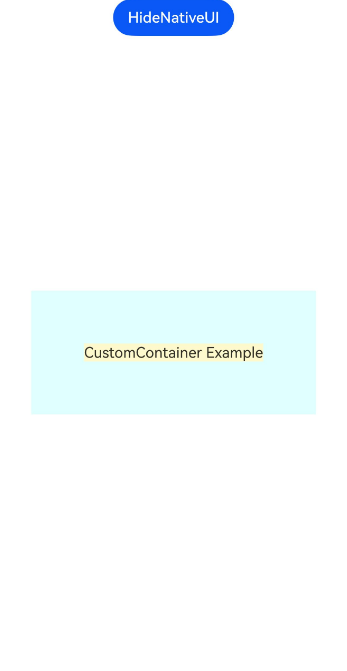
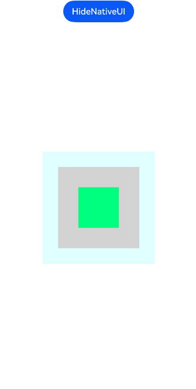

# Building Custom Components


The ArkUI development framework provides capabilities for creating custom UI components through NDK APIs, including custom measurement, layout, and drawing. You can integrate into ArkUI's layout and rendering process by registering custom callback events using the [registerNodeCustomEvent](../reference/apis-arkui/_ark_u_i___native_node_a_p_i__1.md#registernodecustomevent) function and adding custom event listeners for components with the [addNodeCustomEventReceiver](../reference/apis-arkui/_ark_u_i___native_node_a_p_i__1.md#addnodecustomeventreceiver) function. The logic for custom measurement, layout, and drawing is handled within the callback functions of these listeners.


> **NOTE**
>
> - Custom component event registration requires [addNodeCustomEventReceiver](../reference/apis-arkui/_ark_u_i___native_node_a_p_i__1.md#addnodecustomeventreceiver) to declare the listener registration and registerNodeCustomEvent](../reference/apis-arkui/_ark_u_i___native_node_a_p_i__1.md#registernodecustomevent) to declare the required custom event types; listeners can only listen to declared events.
> 
> - IPay attention to the logic of event deregistration, such as calling [removeNodeCustomEventReceiver](../reference/apis-arkui/_ark_u_i___native_node_a_p_i__1.md#removenodecustomeventreceiver) to remove the event listener before the component is destroyed, and [unregisterNodeCustomEvent](../reference/apis-arkui/_ark_u_i___native_node_a_p_i__1.md#unregisternodecustomevent) to notify the ArkUI framework that the custom component events that have been listened to are no longer needed.
> 
> - [addNodeCustomEventReceiver](../reference/apis-arkui/_ark_u_i___native_node_a_p_i__1.md#addnodecustomeventreceiver) can add multiple function pointers, each of which is triggered when the corresponding event occurs. To remove a listener, the corresponding [removeNodeCustomEventReceiver](../reference/apis-arkui/_ark_u_i___native_node_a_p_i__1.md#removenodecustomeventreceiver) function must be called with the exact function pointer used for adding the listener.
> 
> - [registerNodeCustomEventReceiver](../reference/apis-arkui/_ark_u_i___native_node_a_p_i__1.md#registernodecustomeventreceiver) is a global event listener function. Unlike [addNodeCustomEventReceiver](../reference/apis-arkui/_ark_u_i___native_node_a_p_i__1.md#addnodecustomeventreceiver), **registerNodeCustomEventReceiver** can listen for the event triggers of all native components, but it can only accept a single function pointer. If it is called multiple times, only the last function pointer provided will be used for callbacks. To release the listener, use the **unregisterNodeCustomEventReceiver** function.
> 
> - Custom component-related APIs ([measureNode](../reference/apis-arkui/_ark_u_i___native_node_a_p_i__1.md#measurenode), [layoutNode](../reference/apis-arkui/_ark_u_i___native_node_a_p_i__1.md#layoutnode), [setMeasuredSize](../reference/apis-arkui/_ark_u_i___native_node_a_p_i__1.md#setmeasuredsize), [setLayoutPosition](../reference/apis-arkui/_ark_u_i___native_node_a_p_i__1.md#setlayoutposition)) can only be used in the corresponding custom event callbacks ([ARKUI_NODE_CUSTOM_EVENT_ON_MEASURE, ARKUI_NODE_CUSTOM_EVENT_ON_LAYOUT](../reference/apis-arkui/_ark_u_i___native_module.md#arkui_nodecustomeventtype)).


## Custom Layout Container

The following example creates a custom container that uses the maximum size of its child components, plus additional padding, as its own size, while center-aligning the child components.

**Figure 1** Custom container component 



1. Follow the instructions in [Integrating with ArkTS Pages](ndk-access-the-arkts-page.md) to create a project.

2. Create an encapsulated object for the custom container component.
   ```c
   // ArkUICustomContainerNode.h
   // Example of a custom container component
   
   #ifndef MYAPPLICATION_ARKUICUSTOMCONTAINERNODE_H
   #define MYAPPLICATION_ARKUICUSTOMCONTAINERNODE_H
   
   #include "ArkUINode.h"
   
   namespace NativeModule {
   
   class ArkUICustomContainerNode : public ArkUINode {
   public:
       // Create the component using the custom component type ARKUI_NODE_CUSTOM.
       ArkUICustomContainerNode()
           : ArkUINode((NativeModuleInstance::GetInstance()->GetNativeNodeAPI())->createNode(ARKUI_NODE_CUSTOM)) {
           // Register the custom event listener.
           nativeModule_->addNodeCustomEventReceiver(handle_, OnStaticCustomEvent);
           // Declare the custom event and pass itself as custom data.
           nativeModule_->registerNodeCustomEvent(handle_, ARKUI_NODE_CUSTOM_EVENT_ON_MEASURE, 0, this);
           nativeModule_->registerNodeCustomEvent(handle_, ARKUI_NODE_CUSTOM_EVENT_ON_LAYOUT, 0, this);
       }
   
       ~ArkUICustomContainerNode() override {
           // Deregister the custom event listener.
           nativeModule_->removeNodeCustomEventReceiver(handle_, OnStaticCustomEvent);
           // Undeclare the custom event.
           nativeModule_->unregisterNodeCustomEvent(handle_, ARKUI_NODE_CUSTOM_EVENT_ON_MEASURE);
           nativeModule_->unregisterNodeCustomEvent(handle_, ARKUI_NODE_CUSTOM_EVENT_ON_LAYOUT);
       }
   
       void SetPadding(int32_t padding) {
           padding_ = padding;
           // To update a custom property event, you need to proactively call the API for marking the dirty region.
           nativeModule_->markDirty(handle_, NODE_NEED_MEASURE);
       }
   
   private:
       static void OnStaticCustomEvent(ArkUI_NodeCustomEvent *event) {
           // Obtain the component instance object and call the related instance method.
           auto customNode = reinterpret_cast<ArkUICustomContainerNode *>(OH_ArkUI_NodeCustomEvent_GetUserData(event));
           auto type = OH_ArkUI_NodeCustomEvent_GetEventType(event);
           switch (type) {
           case ARKUI_NODE_CUSTOM_EVENT_ON_MEASURE:
               customNode->OnMeasure(event);
               break;
           case ARKUI_NODE_CUSTOM_EVENT_ON_LAYOUT:
               customNode->OnLayout(event);
               break;
           default:
               break;
           }
       }
   
       // Custom measurement logic.
       void OnMeasure(ArkUI_NodeCustomEvent *event) {
           auto layoutConstrain = OH_ArkUI_NodeCustomEvent_GetLayoutConstraintInMeasure(event);
           // Create child node layout constraints, reusing the percentage reference values in the parent component layout.
           auto childLayoutConstrain = OH_ArkUI_LayoutConstraint_Copy(layoutConstrain);
           OH_ArkUI_LayoutConstraint_SetMaxHeight(childLayoutConstrain, 1000);
           OH_ArkUI_LayoutConstraint_SetMaxWidth(childLayoutConstrain, 1000);
           OH_ArkUI_LayoutConstraint_SetMinHeight(childLayoutConstrain, 0);
           OH_ArkUI_LayoutConstraint_SetMinWidth(childLayoutConstrain, 0);
   
           // Measure the child nodes to get the maximum values.
           auto totalSize = nativeModule_->getTotalChildCount(handle_);
           int32_t maxWidth = 0;
           int32_t maxHeight = 0;
           for (uint32_t i = 0; i < totalSize; i++) {
               auto child = nativeModule_->getChildAt(handle_, i);
               // Call the measurement API to measure the native component.
               nativeModule_->measureNode(child, childLayoutConstrain);
               auto size = nativeModule_->getMeasuredSize(child);
               if (size.width > maxWidth) {
                   maxWidth = size.width;
               }
               if (size.height > maxHeight) {
                   maxHeight = size.height;
               }
           }
           // Custom measurement is the sum of all child node sizes plus a fixed margin.
           nativeModule_->setMeasuredSize(handle_, maxWidth + 2 * padding_, maxHeight + 2 * padding_);
       }
   
       void OnLayout(ArkUI_NodeCustomEvent *event) {
           // Obtain the desired position of the parent component and set it.
           auto position = OH_ArkUI_NodeCustomEvent_GetPositionInLayout(event);
           nativeModule_->setLayoutPosition(handle_, position.x, position.y);
   
           // Set child components to be center-aligned.
           auto totalSize = nativeModule_->getTotalChildCount(handle_);
           auto selfSize = nativeModule_->getMeasuredSize(handle_);
           for (uint32_t i = 0; i < totalSize; i++) {
               auto child = nativeModule_->getChildAt(handle_, i);
               // Obtain the child component size.
               auto childSize = nativeModule_->getMeasuredSize(child);
               // Lay out the child components.
               nativeModule_->layoutNode(child, (selfSize.width - childSize.width) / 2,
                                         (selfSize.height - childSize.height) / 2);
           }
       }
   
       int32_t padding_ = 100;
   };
   
   } // namespace NativeModule
   
   #endif // MYAPPLICATION_ARKUICUSTOMCONTAINERNODE_H
   ```

3. Use the custom container to create a sample UI with text, and continue with the [timer module simple implementation](ndk-loading-long-list.md).
   ```c
   // Custom NDK API entry point.
   
   #include "NativeEntry.h"
   
   #include "ArkUICustomContainerNode.h"
   #include "ArkUITextNode.h"
   
   #include <arkui/native_node_napi.h>
   #include <arkui/native_type.h>
   #include <js_native_api.h>
   
   namespace NativeModule {
   
   napi_value CreateNativeRoot(napi_env env, napi_callback_info info) {
       size_t argc = 1;
       napi_value args[1] = {nullptr};
   
       napi_get_cb_info(env, info, &argc, args, nullptr, nullptr);
   
       // Obtain NodeContent.
       ArkUI_NodeContentHandle contentHandle;
       OH_ArkUI_GetNodeContentFromNapiValue(env, args[0], &contentHandle);
       NativeEntry::GetInstance()->SetContentHandle(contentHandle);
   
       // Create a custom container and text component.
       auto node = std::make_shared<ArkUICustomContainerNode>();
       node->SetBackgroundColor(0xFFE0FFFF);
       auto textNode = std::make_shared<ArkUITextNode>();
       textNode->SetTextContent("CustomContainer Example");
       textNode->SetFontSize(16);
       textNode->SetBackgroundColor(0xFFfffacd);
       textNode->SetTextAlign(ARKUI_TEXT_ALIGNMENT_CENTER);
       node->AddChild(textNode);
       CreateNativeTimer(env, textNode.get(), 1, [](void *userData, int32_t count) {
           auto textNode = reinterpret_cast<ArkUITextNode *>(userData);
           textNode->SetCircleColor(0xFF00FF7F);
       });
   
       // Keep the native side object in the management class to maintain its lifecycle.
       NativeEntry::GetInstance()->SetRootNode(node);
       g_env = env;
       return nullptr;
   }
   
   napi_value DestroyNativeRoot(napi_env env, napi_callback_info info) {
       // Release the native side object from the management class.
       NativeEntry::GetInstance()->DisposeRootNode();
       return nullptr;
   }
   
   } // namespace NativeModule
   ```


## Custom Drawing Component

The following example creates a custom drawing component that can draw a custom rectangle and uses the aforementioned custom container for layout arrangement.

**Figure 2** Custom drawing component
 


1. Prepare a project as instructed in [Custom Layout Container](#custom-layout-container).

2. Create an encapsulated object for the custom drawing component.
   ```c
   // ArkUICustomNode.h
   // Example of a custom drawing component
   
   #ifndef MYAPPLICATION_ARKUICUSTOMNODE_H
   #define MYAPPLICATION_ARKUICUSTOMNODE_H
   
   #include <native_drawing/drawing_brush.h>
   #include <native_drawing/drawing_canvas.h>
   #include <native_drawing/drawing_path.h>
   
   #include "ArkUINode.h"
   
   namespace NativeModule {
   
   class ArkUICustomNode : public ArkUINode {
   public:
       // Create the component using the custom component type ARKUI_NODE_CUSTOM.
       ArkUICustomNode()
           : ArkUINode((NativeModuleInstance::GetInstance()->GetNativeNodeAPI())->createNode(ARKUI_NODE_CUSTOM)) {
           // Register the custom event listener.
           nativeModule_->addNodeCustomEventReceiver(handle_, OnStaticCustomEvent);
           // Declare the custom event and pass itself as custom data.
           nativeModule_->registerNodeCustomEvent(handle_, ARKUI_NODE_CUSTOM_EVENT_ON_DRAW, 0, this);
       }
   
       ~ArkUICustomNode() override {
           // Deregister the custom event listener.
           nativeModule_->removeNodeCustomEventReceiver(handle_, OnStaticCustomEvent);
           // Undeclare the custom event.
           nativeModule_->unregisterNodeCustomEvent(handle_, ARKUI_NODE_CUSTOM_EVENT_ON_DRAW);
       }
   
       void SetRectColor(uint32_t color) {
           color_ = color;
           // Custom drawing property changes require proactive notification to the framework.
           nativeModule_->markDirty(handle_, NODE_NEED_RENDER);
       }
   
   private:
       static void OnStaticCustomEvent(ArkUI_NodeCustomEvent *event) {
           // Obtain the component instance object and call the related instance method.
           auto customNode = reinterpret_cast<ArkUICustomNode *>(OH_ArkUI_NodeCustomEvent_GetUserData(event));
           auto type = OH_ArkUI_NodeCustomEvent_GetEventType(event);
           switch (type) {
           case ARKUI_NODE_CUSTOM_EVENT_ON_DRAW:
               customNode->OnDraw(event);
               break;
           default:
               break;
           }
       }
   
       // Custom drawing logic
       void OnDraw(ArkUI_NodeCustomEvent *event) {
           auto drawContext = OH_ArkUI_NodeCustomEvent_GetDrawContextInDraw(event);
           // Obtain the graphics drawing object.
           auto drawCanvas = reinterpret_cast<OH_Drawing_Canvas *>(OH_ArkUI_DrawContext_GetCanvas(drawContext));
           // Obtain the component size.
           auto size = OH_ArkUI_DrawContext_GetSize(drawContext);
           // Draw custom content.
           auto path = OH_Drawing_PathCreate();
           OH_Drawing_PathMoveTo(path, size.width / 4, size.height / 4);
           OH_Drawing_PathLineTo(path, size.width * 3 / 4, size.height / 4);
           OH_Drawing_PathLineTo(path, size.width * 3 / 4, size.height * 3 / 4);
           OH_Drawing_PathLineTo(path, size.width / 4, size.height * 3 / 4);
           OH_Drawing_PathLineTo(path, size.width / 4, size.height / 4);
           OH_Drawing_PathClose(path);
           auto brush = OH_Drawing_BrushCreate();
           OH_Drawing_BrushSetColor(brush, color_);
           OH_Drawing_CanvasAttachBrush(drawCanvas, brush);
           OH_Drawing_CanvasDrawPath(drawCanvas, path);
           // Release resources.
           OH_Drawing_BrushDestroy(brush);
           OH_Drawing_PathDestroy(path);
       }
   
       uint32_t color_ = 0xFFFFE4B5;
   };
   
   } // namespace NativeModule
   
   #endif // MYAPPLICATION_ARKUICUSTOMNODE_H
   ```

3. Create a sample UI using the custom drawing component and the custom container, and continue with the [timer module simple implementation](ndk-loading-long-list.md).
   ```c
   // Custom NDK API entry point.
   
   #include "NativeEntry.h"
   
   #include "ArkUICustomContainerNode.h"
   #include "ArkUICustomNode.h"
   
   #include <arkui/native_node_napi.h>
   #include <arkui/native_type.h>
   #include <js_native_api.h>
   
   namespace NativeModule {
   
   napi_value CreateNativeRoot(napi_env env, napi_callback_info info) {
       size_t argc = 1;
       napi_value args[1] = {nullptr};
   
       napi_get_cb_info(env, info, &argc, args, nullptr, nullptr);
   
       // Obtain NodeContent.
       ArkUI_NodeContentHandle contentHandle;
       OH_ArkUI_GetNodeContentFromNapiValue(env, args[0], &contentHandle);
       NativeEntry::GetInstance()->SetContentHandle(contentHandle);
   
       // Create a custom container and a custom drawing component.
       auto node = std::make_shared<ArkUICustomContainerNode>();
       node->SetBackgroundColor(0xFFE0FFFF);
       auto customNode = std::make_shared<ArkUICustomNode>();
       customNode->SetBackgroundColor(0xFFD3D3D3);
       customNode->SetWidth(150);
       customNode->SetHeight(150);
       node->AddChild(customNode);
       CreateNativeTimer(env, customNode.get(), 1, [](void *userData, int32_t count) {
           auto customNode = reinterpret_cast<ArkUICustomNode *>(userData);
           customNode->SetRectColor(0xFF00FF7F);
       });
   
       // Keep the native side object in the management class to maintain its lifecycle.
       NativeEntry::GetInstance()->SetRootNode(node);
       g_env = env;
       return nullptr;
   }
   
   napi_value DestroyNativeRoot(napi_env env, napi_callback_info info) {
       // Release the native side object from the management class.
       NativeEntry::GetInstance()->DisposeRootNode();
       return nullptr;
   }
   
   } // namespace NativeModule
   
   ```
