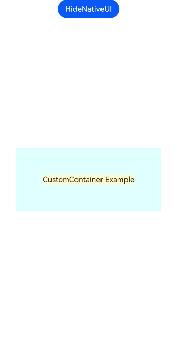
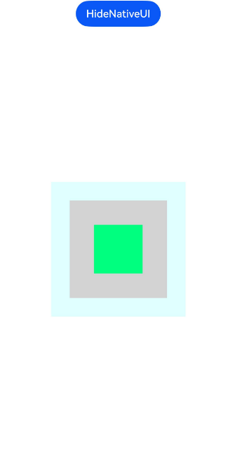
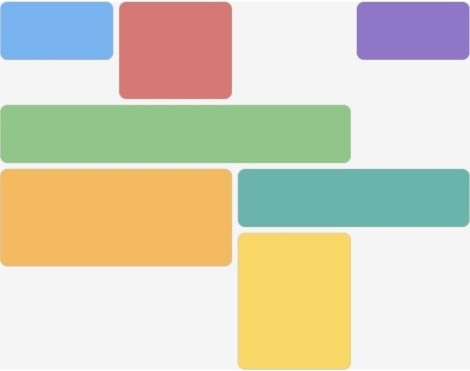

# Building Custom Components
<!--Kit: ArkUI-->
<!--Subsystem: ArkUI-->
<!--Owner: @wangyang2022-->
<!--Designer: @wangyang2022-->
<!--Tester: @sally__-->
<!--Adviser: @Brilliantry_Rui-->
<!-- md-trans-meta sourceCommit=1f32bcbdd4ae62e5f571fb73a9473dd94b7e4c93 translatedAt=2026-08-05T01:28:02.914Z pushedAt=2026-08-05T06:50:13.671Z -->

The ArkUI development framework provides capabilities for creating custom UI components through NDK APIs, including custom measurement, layout, and drawing. You can integrate into ArkUI's layout and rendering process by registering custom callback events using the [registerNodeCustomEvent](../reference/apis-arkui/capi-arkui-nativemodule-arkui-nativenodeapi-1.md#registernodecustomevent) function and adding custom event listeners for components with the [addNodeCustomEventReceiver](../reference/apis-arkui/capi-arkui-nativemodule-arkui-nativenodeapi-1.md#addnodecustomeventreceiver) function. The logic for custom measurement, layout, and drawing is handled within the callback functions of these listeners.

> **NOTE**
>
> - Custom component event registration requires [addNodeCustomEventReceiver](../reference/apis-arkui/capi-arkui-nativemodule-arkui-nativenodeapi-1.md#addnodecustomeventreceiver) to declare listener registration and [registerNodeCustomEvent](../reference/apis-arkui/capi-arkui-nativemodule-arkui-nativenodeapi-1.md#registernodecustomevent) to declare the required custom event types. A listener can only listen for declared events.
>
> - Pay attention to the unregistration logic for events. For example, call [removeNodeCustomEventReceiver](../reference/apis-arkui/capi-arkui-nativemodule-arkui-nativenodeapi-1.md#removenodecustomeventreceiver) to remove the event listener before the component is destroyed, and call [unregisterNodeCustomEvent](../reference/apis-arkui/capi-arkui-nativemodule-arkui-nativenodeapi-1.md#unregisternodecustomevent) to notify the ArkUI framework that the listened custom component events no longer need to be monitored.
>
> - [addNodeCustomEventReceiver](../reference/apis-arkui/capi-arkui-nativemodule-arkui-nativenodeapi-1.md#addnodecustomeventreceiver) can add multiple function pointers, each of which is triggered when the corresponding event fires. The corresponding [removeNodeCustomEventReceiver](../reference/apis-arkui/capi-arkui-nativemodule-arkui-nativenodeapi-1.md#removenodecustomeventreceiver) must pass the corresponding function pointer to remove the listener.
>
> - [registerNodeCustomEventReceiver](../reference/apis-arkui/capi-arkui-nativemodule-arkui-nativenodeapi-1.md#registernodecustomeventreceiver) is a global listener function. Unlike [addNodeCustomEventReceiver](../reference/apis-arkui/capi-arkui-nativemodule-arkui-nativenodeapi-1.md#addnodecustomeventreceiver), [registerNodeCustomEventReceiver](../reference/apis-arkui/capi-arkui-nativemodule-arkui-nativenodeapi-1.md#registernodecustomeventreceiver) can listen for custom event triggers of all native components, but it accepts only one function pointer. If called multiple times, the last function pointer is used for the callback. Use `unregisterNodeCustomEventReceiver` to unregister when releasing.
>
> - Custom component related APIs ([measureNode](../reference/apis-arkui/capi-arkui-nativemodule-arkui-nativenodeapi-1.md#measurenode), [layoutNode](../reference/apis-arkui/capi-arkui-nativemodule-arkui-nativenodeapi-1.md#layoutnode), [setMeasuredSize](../reference/apis-arkui/capi-arkui-nativemodule-arkui-nativenodeapi-1.md#setmeasuredsize), [setLayoutPosition](../reference/apis-arkui/capi-arkui-nativemodule-arkui-nativenodeapi-1.md#setlayoutposition)) are only allowed to be used in the corresponding custom event callbacks (`ARKUI_NODE_CUSTOM_EVENT_ON_MEASURE`, `ARKUI_NODE_CUSTOM_EVENT_ON_LAYOUT`; see [ArkUI_NodeCustomEventType](../reference/apis-arkui/capi-native-node-node-attributes-custom-attributes-h.md#arkui_nodecustomeventtype)).

## Custom Layout Container

The following example creates a custom container that uses the maximum size of its child components, plus additional padding, as its own size, while center-aligning the child components.

**Figure 1** Custom container component



1. Follow the instructions in [Integrating with ArkTS Pages](ndk-access-the-arkts-page.md) to create a project.

2. Create an encapsulated object for the custom container component.
   <!-- @[custom-components](https://gitcode.com/openharmony/applications_app_samples/blob/master/code/DocsSample/ArkUISample/NativeType/CustomContainerSample/entry/src/main/cpp/ArkUICustomContainerNode.h) -->  

   ``` C
   // ArkUICustomContainerNode.h
   // Example of a custom container component
   
   #ifndef MYAPPLICATION_ARKUICUSTOMCONTAINERNODE_H
   #define MYAPPLICATION_ARKUICUSTOMCONTAINERNODE_H
   
   #include "ArkUINode.h"
   
   namespace NativeModule {
   
       class ArkUICustomContainerNode : public ArkUINode {
       public:
           // Create the component using the custom component type ARKUI_NODE_CUSTOM.
           ArkUICustomContainerNode()
               : ArkUINode((NativeModuleInstance::GetInstance()->GetNativeNodeAPI())->createNode(ARKUI_NODE_CUSTOM))
           {
               // Register the custom event listener.
               nativeModule_->addNodeCustomEventReceiver(handle_, OnStaticCustomEvent);
               // Declare the custom event and pass itself as custom data.
               nativeModule_->registerNodeCustomEvent(handle_, ARKUI_NODE_CUSTOM_EVENT_ON_MEASURE, 0, this);
               nativeModule_->registerNodeCustomEvent(handle_, ARKUI_NODE_CUSTOM_EVENT_ON_LAYOUT, 0, this);
           }
   
           ~ArkUICustomContainerNode() override
           {
               // Unregister the custom event listener.
               nativeModule_->removeNodeCustomEventReceiver(handle_, OnStaticCustomEvent);
               // Remove the declaration of the custom event.
               nativeModule_->unregisterNodeCustomEvent(handle_, ARKUI_NODE_CUSTOM_EVENT_ON_MEASURE);
               nativeModule_->unregisterNodeCustomEvent(handle_, ARKUI_NODE_CUSTOM_EVENT_ON_LAYOUT);
           }
   
           void SetPadding(int32_t padding)
           {
               padding_ = padding;
               // To update a custom property event, you need to proactively call the API for marking the dirty region.
               nativeModule_->markDirty(handle_, NODE_NEED_MEASURE);
           }
   
       private:
           static void OnStaticCustomEvent(ArkUI_NodeCustomEvent *event)
           {
               // Obtain the component instance object and call the related instance method.
               auto customNode = reinterpret_cast<ArkUICustomContainerNode *>(OH_ArkUI_NodeCustomEvent_GetUserData(event));
               auto type = OH_ArkUI_NodeCustomEvent_GetEventType(event);
               switch (type) {
                   case ARKUI_NODE_CUSTOM_EVENT_ON_MEASURE:
                       customNode->OnMeasure(event);
                       break;
                   case ARKUI_NODE_CUSTOM_EVENT_ON_LAYOUT:
                       customNode->OnLayout(event);
                       break;
                   default:
                       break;
               }
           }
   
           // Custom measurement logic.
           void OnMeasure(ArkUI_NodeCustomEvent *event)
           {
               auto layoutConstrain = OH_ArkUI_NodeCustomEvent_GetLayoutConstraintInMeasure(event);
               // Create child node layout constraints, reusing the percentage reference values in the parent component layout.
               auto childLayoutConstrain = OH_ArkUI_LayoutConstraint_Copy(layoutConstrain);
               int32_t maxConstrain = 1000;
               OH_ArkUI_LayoutConstraint_SetMaxHeight(childLayoutConstrain, maxConstrain);
               OH_ArkUI_LayoutConstraint_SetMaxWidth(childLayoutConstrain, maxConstrain);
               OH_ArkUI_LayoutConstraint_SetMinHeight(childLayoutConstrain, 0);
               OH_ArkUI_LayoutConstraint_SetMinWidth(childLayoutConstrain, 0);
   
               // Measure the child nodes to get the maximum values.
               auto totalSize = nativeModule_->getTotalChildCount(handle_);
               int32_t maxWidth = 0;
               int32_t maxHeight = 0;
               for (uint32_t i = 0; i < totalSize; i++) {
                   auto child = nativeModule_->getChildAt(handle_, i);
                   // Call the measurement API to measure the native component.
                   nativeModule_->measureNode(child, childLayoutConstrain);
                   auto size = nativeModule_->getMeasuredSize(child);
                   if (size.width > maxWidth) {
                       maxWidth = size.width;
                   }
                   if (size.height > maxHeight) {
                       maxHeight = size.height;
                   }
               }
               // The custom measurement result equals the sum of all child node sizes plus a fixed margin. The final size of the custom node will be set to this calculated value.
               const int paddingMultiplier = 2;
               nativeModule_->setMeasuredSize(handle_, maxWidth + paddingMultiplier * padding_,
                                              maxHeight + paddingMultiplier * padding_);
               OH_ArkUI_LayoutConstraint_Dispose(childLayoutConstrain);
           }
   
           void OnLayout(ArkUI_NodeCustomEvent *event)
           {
               // Obtain the desired position of the parent component and set it.
               auto position = OH_ArkUI_NodeCustomEvent_GetPositionInLayout(event);
               nativeModule_->setLayoutPosition(handle_, position.x, position.y);
   
               // Set child components to be center-aligned.
               auto totalSize = nativeModule_->getTotalChildCount(handle_);
               auto selfSize = nativeModule_->getMeasuredSize(handle_);
               for (uint32_t i = 0; i < totalSize; i++) {
                   auto child = nativeModule_->getChildAt(handle_, i);
                   // Obtain the child component size.
                   auto childSize = nativeModule_->getMeasuredSize(child);
                   // Lay out the child components.
                   int32_t horizontalMargin = (selfSize.width - childSize.width) / 2;
                   int32_t verticalMargin = (selfSize.height - childSize.height) / 2;
                   nativeModule_->layoutNode(child, horizontalMargin, verticalMargin);
               }
           }
   
           int32_t padding_ = 100;
       };
   
   } // namespace NativeModule
   
   #endif // MYAPPLICATION_ARKUICUSTOMCONTAINERNODE_H
   ```

3. Use the custom container to create a sample UI with text.
   <!-- @[entrance](https://gitcode.com/openharmony/applications_app_samples/blob/master/code/DocsSample/ArkUISample/NativeType/CustomContainerSample/entry/src/main/cpp/NativeEntry.cpp) -->  
   
   ``` C++
   #include "NativeEntry.h"
   
   #include "ArkUICustomContainerNode.h"
   #include "ArkUITextNode.h"
   #include "UITimer.h"
   
   #include <arkui/native_node_napi.h>
   #include <arkui/native_type.h>
   #include <js_native_api.h>
   
   namespace NativeModule {
       namespace {
           napi_env g_env;
       } // namespace
   
       napi_value CreateNativeRoot(napi_env env, napi_callback_info info)
       {
           size_t argc = 1;
           napi_value args[1] = {nullptr};
   
           napi_get_cb_info(env, info, &argc, args, nullptr, nullptr);
   
           ArkUI_NodeContentHandle contentHandle;
           OH_ArkUI_GetNodeContentFromNapiValue(env, args[0], &contentHandle);
           NativeEntry::GetInstance()->SetContentHandle(contentHandle);
   
           // Create a custom container and text component.
           auto node = std::make_shared<ArkUICustomContainerNode>();
           node->SetBackgroundColor(0xFFE0FFFF);
           auto textNode = std::make_shared<ArkUITextNode>();
           textNode->SetTextContent("CustomContainer Example");
           const int32_t fontSize = 16;
           textNode->SetFontSize(fontSize);
           textNode->SetBackgroundColor(0xFFfffacd);
           textNode->SetTextAlign(ARKUI_TEXT_ALIGNMENT_CENTER);
           node->AddChild(textNode);
           auto onClick = [](ArkUI_NodeEvent *event) {
               auto textNode = (ArkUITextNode *)OH_ArkUI_NodeEvent_GetUserData(event);
               textNode->SetFontColor(0xFF00FF7F);
           };
           textNode->RegisterOnClick(onClick, textNode.get());
   
           // Keep the native side object in the management class to maintain its lifecycle.
           NativeEntry::GetInstance()->SetRootNode(node);
           g_env = env;
           return nullptr;
       }
   
       napi_value DestroyNativeRoot(napi_env env, napi_callback_info info)
       {
           // Release the native side object from the management class.
           NativeEntry::GetInstance()->DisposeRootNode();
           return nullptr;
       }
   
   } // namespace NativeModule
   ```

4. Update the **CMakeLists.txt** file and add the required link libraries.
   ```cpp
     # CMakeLists.txt

     # the minimum version of CMake.
     cmake_minimum_required(VERSION 3.4.1)
     project(testndk)

     set(NATIVERENDER_ROOT_PATH ${CMAKE_CURRENT_SOURCE_DIR})

     include_directories(${NATIVERENDER_ROOT_PATH}
                          ${NATIVERENDER_ROOT_PATH}/include)

     add_library(entry SHARED NativeEntry.cpp napi_init.cpp)
     # target_link_libraries(entry PUBLIC libace_napi.z.so, libace_ndk.z.so, libhilog_ndk.z.so)

     find_library(
          # Sets the name of the path variable.
          hilog-lib
          # Specifies the name of the NDK library that
          # you want CMake to locate.
          hilog_ndk.z
      )

     find_library(
          # Sets the name of the path variable.
          libace-lib
          # Specifies the name of the NDK library that
          # you want CMake to locate.
          ace_ndk.z
      )

     find_library(
          # Sets the name of the path variable.
          libnapi-lib
          # Specifies the name of the NDK library that
          # you want CMake to locate.
          ace_napi.z
      )

      find_library(
           # Sets the name of the path variable.
           libuv-lib
           uv
       )

     target_link_libraries(entry PUBLIC
          ${hilog-lib} ${libace-lib} ${libnapi-lib} ${libuv-lib} )
   ```

## Custom Drawing Component

The following example creates a custom drawing component that can draw a custom rectangle and uses the aforementioned custom container for layout arrangement.

**Figure 2** Custom drawing component



1. Prepare a project as instructed in [Custom Layout Container](#custom-layout-container).

2. Create an encapsulated object for the custom drawing component.
   <!-- @[custom-draw](https://gitcode.com/openharmony/applications_app_samples/blob/master/code/DocsSample/ArkUISample/NativeType/CustomDrawSample/entry/src/main/cpp/ArkUICustomNode.h) -->  
   
   ``` C
   // ArkUICustomNode.h
   // Example of a custom drawing component
   
   #ifndef MYAPPLICATION_ARKUICUSTOMNODE_H
   #define MYAPPLICATION_ARKUICUSTOMNODE_H
   
   #include <native_drawing/drawing_brush.h>
   #include <native_drawing/drawing_canvas.h>
   #include <native_drawing/drawing_path.h>
   
   #include "ArkUINode.h"
   
   namespace NativeModule {
   
       class ArkUICustomNode : public ArkUINode {
       public:
           // Create the component using the custom component type ARKUI_NODE_CUSTOM.
           ArkUICustomNode()
               : ArkUINode((NativeModuleInstance::GetInstance()->GetNativeNodeAPI())->createNode(ARKUI_NODE_CUSTOM))
           {
               // Register the custom event listener.
               nativeModule_->addNodeCustomEventReceiver(handle_, OnStaticCustomEvent);
               // Declare the custom event and pass itself as custom data.
               nativeModule_->registerNodeCustomEvent(handle_, ARKUI_NODE_CUSTOM_EVENT_ON_DRAW, 0, this);
           }
   
           ~ArkUICustomNode() override
           {
               // Unregister the custom event listener.
               nativeModule_->removeNodeCustomEventReceiver(handle_, OnStaticCustomEvent);
               // Remove the declaration of the custom event.
               nativeModule_->unregisterNodeCustomEvent(handle_, ARKUI_NODE_CUSTOM_EVENT_ON_DRAW);
           }
   
           void SetRectColor(uint32_t color)
           {
               color_ = color;
               // Custom drawing property changes require proactive notification to the framework.
               nativeModule_->markDirty(handle_, NODE_NEED_RENDER);
           }
   
       private:
           static void OnStaticCustomEvent(ArkUI_NodeCustomEvent *event)
           {
               // Obtain the component instance object and call the related instance method.
               auto customNode = reinterpret_cast<ArkUICustomNode *>(OH_ArkUI_NodeCustomEvent_GetUserData(event));
               auto type = OH_ArkUI_NodeCustomEvent_GetEventType(event);
               switch (type) {
                   case ARKUI_NODE_CUSTOM_EVENT_ON_DRAW:
                       customNode->OnDraw(event);
                       break;
                   default:
                       break;
               }
           }
   
           // Custom drawing logic
           void OnDraw(ArkUI_NodeCustomEvent *event)
           {
               auto drawContext = OH_ArkUI_NodeCustomEvent_GetDrawContextInDraw(event);
               // Obtain the graphics drawing object.
               auto drawCanvas = reinterpret_cast<OH_Drawing_Canvas *>(OH_ArkUI_DrawContext_GetCanvas(drawContext));
               // Obtain the component size.
               auto size = OH_ArkUI_DrawContext_GetSize(drawContext);
               // Draw custom content.
               auto path = OH_Drawing_PathCreate();
               const float kQuarter = 0.25f;
               const float kThreeQuarters = 0.75f;
               OH_Drawing_PathMoveTo(path, size.width * kQuarter, size.height * kQuarter);
               OH_Drawing_PathLineTo(path, size.width * kThreeQuarters, size.height * kQuarter);
               OH_Drawing_PathLineTo(path, size.width * kThreeQuarters, size.height * kThreeQuarters);
               OH_Drawing_PathLineTo(path, size.width * kQuarter, size.height * kThreeQuarters);
               OH_Drawing_PathLineTo(path, size.width * kQuarter, size.height * kQuarter);
               OH_Drawing_PathClose(path);
               auto brush = OH_Drawing_BrushCreate();
               OH_Drawing_BrushSetColor(brush, color_);
               OH_Drawing_CanvasAttachBrush(drawCanvas, brush);
               OH_Drawing_CanvasDrawPath(drawCanvas, path);
               OH_Drawing_CanvasDetachBrush(drawCanvas);
               // 释放资源
               OH_Drawing_BrushDestroy(brush);
               OH_Drawing_PathDestroy(path);
           }
   
           uint32_t color_ = 0xFFFFE4B5;
       };
   
   } // namespace NativeModule
   
   #endif // MYAPPLICATION_ARKUICUSTOMNODE_H
   ```

3. Use the custom drawing component and custom container to create a sample UI.
   <!-- @[entrance](https://gitcode.com/openharmony/applications_app_samples/blob/master/code/DocsSample/ArkUISample/NativeType/CustomDrawSample/entry/src/main/cpp/NativeEntry.cpp) -->  
   
   ``` C++
   
   #include "NativeEntry.h"
   
   #include "ArkUICustomContainerNode.h"
   #include "ArkUICustomNode.h"
   
   #include <arkui/native_node_napi.h>
   #include <arkui/native_type.h>
   #include <js_native_api.h>
   #include "UITimer.h"
   
   namespace NativeModule {
       namespace {
           napi_env g_env;
       } // namespace
   
       napi_value CreateNativeRoot(napi_env env, napi_callback_info info)
       {
           size_t argc = 1;
           napi_value args[1] = {nullptr};
   
           napi_get_cb_info(env, info, &argc, args, nullptr, nullptr);
   
           // Obtain NodeContent.
           ArkUI_NodeContentHandle contentHandle;
           OH_ArkUI_GetNodeContentFromNapiValue(env, args[0], &contentHandle);
           NativeEntry::GetInstance()->SetContentHandle(contentHandle);
   
           // Create a custom container and a custom drawing component.
           auto node = std::make_shared<ArkUICustomContainerNode>();
           node->SetBackgroundColor(0xFFE0FFFF);
           auto customNode = std::make_shared<ArkUICustomNode>();
           customNode->SetBackgroundColor(0xFFD3D3D3);
           const int width = 150;
           const int height = 150;
           customNode->SetWidth(width);
           customNode->SetHeight(height);
           node->AddChild(customNode);
           auto onClick = [](ArkUI_NodeEvent *event) {
               auto customNode = (ArkUICustomNode *)OH_ArkUI_NodeEvent_GetUserData(event);
               customNode->SetRectColor(0xFF00FF7F);
           };
           customNode->RegisterOnClick(onClick, customNode.get());
   
           // Keep the native side object in the management class to maintain its lifecycle.
           NativeEntry::GetInstance()->SetRootNode(node);
           g_env = env;
           return nullptr;
       }
   
       napi_value DestroyNativeRoot(napi_env env, napi_callback_info info)
       {
           // Release the native side object from the management class.
           NativeEntry::GetInstance()->DisposeRootNode();
           return nullptr;
       }
   
   } // namespace NativeModule
   ```

4. Update the **CMakeLists.txt** file and add the required link libraries.
   ```cpp
     # CMakeLists.txt

     # the minimum version of CMake.
     cmake_minimum_required(VERSION 3.4.1)
     project(testndk)

     set(NATIVERENDER_ROOT_PATH ${CMAKE_CURRENT_SOURCE_DIR})

     include_directories(${NATIVERENDER_ROOT_PATH}
                          ${NATIVERENDER_ROOT_PATH}/include)

     add_library(entry SHARED NativeEntry.cpp napi_init.cpp)
     # target_link_libraries(entry PUBLIC libace_napi.z.so, libace_ndk.z.so, libhilog_ndk.z.so)

     find_library(
          # Sets the name of the path variable.
          hilog-lib
          # Specifies the name of the NDK library that
          # you want CMake to locate.
          hilog_ndk.z
      )

     find_library(
          # Sets the name of the path variable.
          libace-lib
          # Specifies the name of the NDK library that
          # you want CMake to locate.
          ace_ndk.z
      )

     find_library(
          # Sets the name of the path variable.
          libnapi-lib
          # Specifies the name of the NDK library that
          # you want CMake to locate.
          ace_napi.z
      )

      find_library(
           # Sets the name of the path variable.
           libuv-lib
           uv
       )

     target_link_libraries(entry PUBLIC
          ${hilog-lib} ${libace-lib} ${libnapi-lib} ${libuv-lib} libnative_drawing.so)
   ```

## Irregular Grid Layout Example

The following example creates an irregular grid layout container that supports grid cells of different sizes, achieving a waterfall-like layout effect. For the complete example, see <!--RP1-->[CustomDrawIrregularSample](https://gitcode.com/openharmony/applications_app_samples/tree/master/code/DocsSample/ArkUISample/NativeType/CustomDrawIrregularSample)<!--RP1End-->.

**Figure 3** Irregular grid layout effect



1. Prepare the prerequisite project according to the [Custom Layout Container](#custom-layout-container) section.

2. Create the irregular grid layout container component encapsulation object.
   <!-- @[irregular-grid](https://gitcode.com/openharmony/applications_app_samples/blob/master/code/DocsSample/ArkUISample/NativeType/CustomDrawIrregularSample/entry/src/main/cpp/ArkUIIrregularGridNode.h) -->  
   
   ``` C
    // ArkUIIrregularGridNode.h
    // Irregular grid layout container example

    #ifndef MYAPPLICATION_ARKUIIRREGULARGRIDNODE_H
    #define MYAPPLICATION_ARKUIIRREGULARGRIDNODE_H

    #include "ArkUINode.h"
    #include <vector>
    #include <map>

    namespace NativeModule {

    // Grid cell configuration
    struct GridItemConfig {
        int32_t rowSpan = 1;    // Number of rows occupied.
        int32_t columnSpan = 1; // Number of columns occupied.
    };

    class ArkUIIrregularGridNode : public ArkUINode {
    public:
        // Create a component using the custom component type ARKUI_NODE_CUSTOM.
        ArkUIIrregularGridNode()
            : ArkUINode((NativeModuleInstance::GetInstance()->GetNativeNodeAPI())->createNode(ARKUI_NODE_CUSTOM))
        {
            // Register the custom event listener.
            nativeModule_->addNodeCustomEventReceiver(handle_, OnStaticCustomEvent);
            // Declare a custom event and pass itself as custom data.
            nativeModule_->registerNodeCustomEvent(handle_, ARKUI_NODE_CUSTOM_EVENT_ON_MEASURE, 0, this);
            nativeModule_->registerNodeCustomEvent(handle_, ARKUI_NODE_CUSTOM_EVENT_ON_LAYOUT, 0, this);
        }

        ~ArkUIIrregularGridNode() override
        {
            // Unregister the custom event listener.
            nativeModule_->removeNodeCustomEventReceiver(handle_, OnStaticCustomEvent);
            // Undeclare the custom event.
            nativeModule_->unregisterNodeCustomEvent(handle_, ARKUI_NODE_CUSTOM_EVENT_ON_MEASURE);
            nativeModule_->unregisterNodeCustomEvent(handle_, ARKUI_NODE_CUSTOM_EVENT_ON_LAYOUT);
        }

        // Set the column count.
        void SetColumnCount(int32_t count)
        {
            columnCount_ = count;
            nativeModule_->markDirty(handle_, NODE_NEED_MEASURE);
        }

        // Set the grid gap.
        void SetGap(int32_t gap)
        {
            gap_ = gap;
            nativeModule_->markDirty(handle_, NODE_NEED_MEASURE);
        }

        // Set the grid configuration of child components.
        void SetItemConfig(ArkUI_NodeHandle child, int32_t rowSpan, int32_t columnSpan)
        {
            GridItemConfig config;
            config.rowSpan = rowSpan;
            config.columnSpan = columnSpan;
            itemConfigs_[child] = config;
            nativeModule_->markDirty(handle_, NODE_NEED_MEASURE);
        }

    private:
        static void OnStaticCustomEvent(ArkUI_NodeCustomEvent *event)
        {
            // Obtain the component instance object and call the relevant instance methods.
            auto customNode = reinterpret_cast<ArkUIIrregularGridNode *>(OH_ArkUI_NodeCustomEvent_GetUserData(event));
            auto type = OH_ArkUI_NodeCustomEvent_GetEventType(event);
            switch (type) {
                case ARKUI_NODE_CUSTOM_EVENT_ON_MEASURE:
                    customNode->OnMeasure(event);
                    break;
                case ARKUI_NODE_CUSTOM_EVENT_ON_LAYOUT:
                    customNode->OnLayout(event);
                    break;
                default:
                    break;
            }
        }

        // Measure a single child component and update column height information.
        void MeasureChild(ArkUI_NodeHandle child, int32_t cellWidth,
            ArkUI_LayoutConstraint *childConstraint, std::vector<int32_t> &columnHeights)
        {
            GridItemConfig config = {1, 1};
            auto it = itemConfigs_.find(child);
            if (it != itemConfigs_.end()) {
                config = it->second;
            }
            if (config.columnSpan > columnCount_) {
                config.columnSpan = columnCount_;
            }

            int32_t startColumn = FindLowestColumn(columnHeights, config.columnSpan);
            int32_t startY = 0;
            for (int32_t col = startColumn; col < startColumn + config.columnSpan && col < columnCount_; col++) {
                if (columnHeights[col] > startY) {
                    startY = columnHeights[col];
                }
            }

            int32_t itemWidth = cellWidth * config.columnSpan + gap_ * (config.columnSpan - 1);
            OH_ArkUI_LayoutConstraint_SetMaxWidth(childConstraint, itemWidth);
            OH_ArkUI_LayoutConstraint_SetMinWidth(childConstraint, itemWidth);
            nativeModule_->measureNode(child, childConstraint);
            auto size = nativeModule_->getMeasuredSize(child);

            LayoutItemInfo info;
            info.x = startColumn * (cellWidth + gap_);
            info.y = startY;
            info.width = size.width;
            info.height = size.height;
            layoutInfo_.push_back(info);

            int32_t newHeight = startY + size.height + gap_;
            for (int32_t col = startColumn; col < startColumn + config.columnSpan && col < columnCount_; col++) {
                columnHeights[col] = newHeight;
            }
        }

        // Custom measurement logic: irregular grid layout.
        void OnMeasure(ArkUI_NodeCustomEvent *event)
        {
            auto layoutConstrain = OH_ArkUI_NodeCustomEvent_GetLayoutConstraintInMeasure(event);
            int32_t maxWidth = OH_ArkUI_LayoutConstraint_GetMaxWidth(layoutConstrain);

            int32_t totalGap = gap_ * (columnCount_ - 1);
            int32_t cellWidth = (maxWidth - totalGap) / columnCount_;

            auto childConstraint = OH_ArkUI_LayoutConstraint_Copy(layoutConstrain);
            std::vector<int32_t> columnHeights(columnCount_, 0);
            layoutInfo_.clear();

            auto totalSize = nativeModule_->getTotalChildCount(handle_);
            for (uint32_t i = 0; i < totalSize; i++) {
                auto child = nativeModule_->getChildAt(handle_, i);
                MeasureChild(child, cellWidth, childConstraint, columnHeights);
            }

            int32_t maxHeight = 0;
            for (int32_t height : columnHeights) {
                if (height > maxHeight) {
                    maxHeight = height;
                }
            }
            if (maxHeight > gap_) {
                maxHeight -= gap_;
            }

            nativeModule_->setMeasuredSize(handle_, maxWidth, maxHeight);
            OH_ArkUI_LayoutConstraint_Dispose(childConstraint);
        }

        void OnLayout(ArkUI_NodeCustomEvent *event)
        {
            // Obtain the expected position from the parent component and set it.
            auto position = OH_ArkUI_NodeCustomEvent_GetPositionInLayout(event);
            nativeModule_->setLayoutPosition(handle_, position.x, position.y);

            // Lay out child components.
            auto totalSize = nativeModule_->getTotalChildCount(handle_);
            for (uint32_t i = 0; i < totalSize && i < layoutInfo_.size(); i++) {
                auto child = nativeModule_->getChildAt(handle_, i);
                nativeModule_->layoutNode(child, layoutInfo_[i].x, layoutInfo_[i].y);
            }
        }

        // Find the shortest column that can accommodate an item with the specified column span.
        int32_t FindLowestColumn(const std::vector<int32_t>& columnHeights, int32_t columnSpan)
        {
            int32_t lowestColumn = 0;
            int32_t lowestHeight = INT32_MAX;

            // Iterate over all possible starting columns.
            for (int32_t col = 0; col <= columnCount_ - columnSpan; col++) {
                // Find the tallest column in this range.
                int32_t maxHeightInRange = 0;
                for (int32_t i = col; i < col + columnSpan; i++) {
                    if (columnHeights[i] > maxHeightInRange) {
                        maxHeightInRange = columnHeights[i];
                    }
                }

                // If the highest point in this range is lower than the current lowest point, update the lowest column.
                if  {
                    lowestHeight = maxHeightInRange;
                    lowestColumn = col;
                }
            }

            return lowestColumn;
        }

        struct LayoutItemInfo {
            int32_t x;
            int32_t y;
            int32_t width;
            int32_t height;
        };

        int32_t columnCount_ = 3;
        int32_t gap_ = 10;
        std::map<ArkUI_NodeHandle, GridItemConfig> itemConfigs_;
        std::vector<LayoutItemInfo> layoutInfo_;
    };

    } // namespace NativeModule

    #endif // MYAPPLICATION_ARKUIIRREGULARGRIDNODE_H
   ```

3. Use the irregular grid layout container to create a sample UI.

   <!-- @[irregular-grid-entrance](https://gitcode.com/openharmony/applications_app_samples/blob/master/code/DocsSample/ArkUISample/NativeType/CustomDrawIrregularSample/entry/src/main/cpp/NativeEntry.cpp) -->  
   
   ``` C++
    #include "NativeEntry.h"

    #include "ArkUIIrregularGridNode.h"
    #include "ArkUINode.h"

    #include <arkui/native_node_napi.h>
    #include <arkui/native_type.h>
    #include <js_native_api.h>
    #include <utility>
    #include <vector>

    namespace NativeModule {
    namespace {
    napi_env g_env = nullptr;

    constexpr uint32_t GRID_BACKGROUND_COLOR = 0xFFF5F5F5;
    constexpr int32_t GRID_COLUMN_COUNT = 4;
    constexpr int32_t GRID_GAP = 8;
    constexpr float GRID_ITEM_RADIUS = 8.0f;
    constexpr float GRID_ITEM_BORDER_WIDTH = 1.0f;
    constexpr uint32_t GRID_ITEM_BORDER_COLOR = 0xFFCCCCCC;
    constexpr float GRID_ITEM_BASE_HEIGHT = 60.0f;
    constexpr float GRID_ITEM_HEIGHT_STEP = 40.0f;

    using GridItemSize = std::pair<int32_t, int32_t>;

    const std::vector<GridItemSize>& GetGridItemSizes()
    {
        static const std::vector<GridItemSize> itemSizes = {
            {1, 1}, // Small square
            {2, 1}, // Vertical bar
            {1, 3}, // Horizontal bar
            {2, 2}, // Large square
            {1, 1}, // Small square
            {1, 2}, // Horizontal bar
            {3, 1}, // Very long vertical bar
        };
        return itemSizes;
    }

    const std::vector<uint32_t>& GetGridItemColors()
    {
        static const std::vector<uint32_t> colors = {
            0xFF64B5F6, // Blue
            0xFFE57373, // Red
            0xFF81C784, // Green
            0xFFFFB74D, // Orange
            0xFF9575CD, // Purple
            0xFF4DB6AC, // Cyan
            0xFFFFD54F, // Yellow
            0xFFF06292, // Pink
            0xFF7986CB, // Indigo
            0xFFA1887F, // Brown
        };
        return colors;
    }

    void SetNodeColorAttribute(ArkUI_NativeNodeAPI_1* nodeAPI, ArkUI_NodeHandle node, uint32_t color)
    {
        ArkUI_NumberValue bgColor[] = {{.u32 = color}};
        ArkUI_AttributeItem bgColorItem = {bgColor, 1};
        nodeAPI->setAttribute(node, NODE_BACKGROUND_COLOR, &bgColorItem);
    }

    void SetNodeBorderRadiusAttribute(ArkUI_NativeNodeAPI_1* nodeAPI, ArkUI_NodeHandle node, float radius)
    {
        ArkUI_NumberValue radiusValue[] = {{.f32 = radius}};
        ArkUI_AttributeItem radiusItem = {radiusValue, 1};
        nodeAPI->setAttribute(node, NODE_BORDER_RADIUS, &radiusItem);
    }

    void SetNodeBorderStyle(ArkUI_NativeNodeAPI_1* nodeAPI, ArkUI_NodeHandle node)
    {
        ArkUI_NumberValue borderWidth[] = {{.f32 = GRID_ITEM_BORDER_WIDTH}};
        ArkUI_AttributeItem borderWidthItem = {borderWidth, 1};
        nodeAPI->setAttribute(node, NODE_BORDER_WIDTH, &borderWidthItem);

        ArkUI_NumberValue borderColor[] = {{.u32 = GRID_ITEM_BORDER_COLOR}};
        ArkUI_AttributeItem borderColorItem = {borderColor, 1};
        nodeAPI->setAttribute(node, NODE_BORDER_COLOR, &borderColorItem);
    }

    void SetNodeHeightByRowSpan(ArkUI_NativeNodeAPI_1* nodeAPI, ArkUI_NodeHandle node, int32_t rowSpan)
    {
        float minHeight = GRID_ITEM_BASE_HEIGHT + (rowSpan - 1) * GRID_ITEM_HEIGHT_STEP;
        ArkUI_NumberValue minHeightValue[] = {{.f32 = minHeight}};
        ArkUI_AttributeItem minHeightItem = {minHeightValue, 1};
        nodeAPI->setAttribute(node, NODE_HEIGHT, &minHeightItem);
    }

    void AddGridItems(
        ArkUI_NativeNodeAPI_1* nodeAPI,
        const std::shared_ptr<ArkUIIrregularGridNode>& gridNode,
        const std::vector<GridItemSize>& itemSizes,
        const std::vector<uint32_t>& colors)
    {
        for (size_t i = 0; i < itemSizes.size(); ++i) {
            auto itemNode = nodeAPI->createNode(ARKUI_NODE_STACK);
            SetNodeColorAttribute(nodeAPI, itemNode, colors[i % colors.size()]);
            SetNodeBorderRadiusAttribute(nodeAPI, itemNode, GRID_ITEM_RADIUS);
            SetNodeBorderStyle(nodeAPI, itemNode);
            SetNodeHeightByRowSpan(nodeAPI, itemNode, itemSizes[i].first);
            gridNode->SetItemConfig(itemNode, itemSizes[i].first, itemSizes[i].second);
            nodeAPI->addChild(gridNode->GetHandle(), itemNode);
        }
    }
    } // namespace

    napi_value CreateNativeRoot(napi_env env, napi_callback_info info)
    {
        size_t argc = 1;
        napi_value args[1] = {nullptr};
        napi_get_cb_info(env, info, &argc, args, nullptr, nullptr);

        ArkUI_NodeContentHandle contentHandle;
        OH_ArkUI_GetNodeContentFromNapiValue(env, args[0], &contentHandle);
        NativeEntry::GetInstance()->SetContentHandle(contentHandle);

        auto gridNode = std::make_shared<ArkUIIrregularGridNode>();
        gridNode->SetBackgroundColor(GRID_BACKGROUND_COLOR);
        gridNode->SetColumnCount(GRID_COLUMN_COUNT);
        gridNode->SetGap(GRID_GAP);

        auto* nodeAPI = NativeModuleInstance::GetInstance()->GetNativeNodeAPI();
        AddGridItems(nodeAPI, gridNode, GetGridItemSizes(), GetGridItemColors());

        // Keep the native-side object in the management class to maintain its lifecycle.
        NativeEntry::GetInstance()->SetRootNode(gridNode);
        g_env = env;
        return nullptr;
    }

    napi_value DestroyNativeRoot(napi_env env, napi_callback_info info)
    {
        // Release the native-side object from the management class.
        NativeEntry::GetInstance()->DisposeRootNode();
        return nullptr;
    }

    } // namespace NativeModule
   ```

   <!--no_check-->