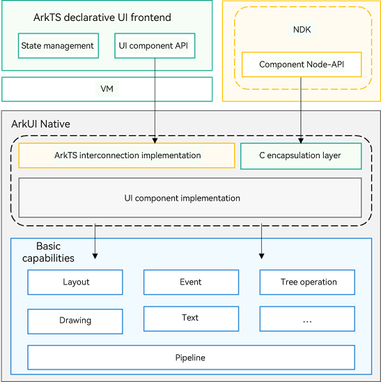
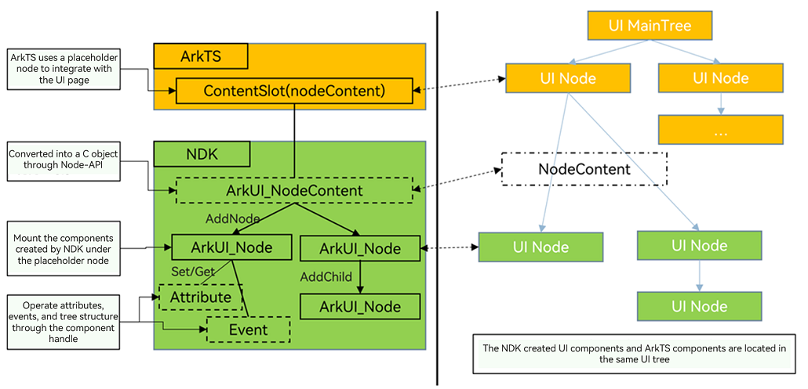

# NDK API Overview

The ArkUI framework offers NDK APIs for building UIs with C/C++, including component creation, UI tree control, attribute configuration, and event handling. While ArkTS and the ArkUI declarative framework are recommended for most UI development, use the ArkUI NDK APIs when:

- You need to dynamically create and mount UI components for bridging to your own UI framework.

- You want to enhance UI performance by finely controlling component creation and attributes to reduce latency and handle high loads.

- You aim to reuse C or C++ UI libraries developed by yourself or others.

The ArkUI NDK APIs provide the following capabilities:

- **Layout**

  Layout defines the size and position of components on the UI. The ArkUI NDK APIs offer linear, stacking, flexbox, relative layouts, and scrollable and carousel containers.

- **Component**

  Components are essential for UI, shaping the appearance on the screen. They include both built-in components and custom components with user-defined layout and drawing behaviors. Built-in components, such as buttons, radio buttons, images, and text, can be quickly created and have their attributes and events set using the ArkUI NDK APIs. Customization capabilities for UI components encompass layout measurement and drawing, enabling the construction of distinctive UI components.

- **Dialog box**

  Dialog boxes are vital for UI interactions. ArkUI NDK APIs enable the creation and display of custom dialog boxes with user-defined content.

- **Animation**

  Animations are one of the key elements of UI. The ArkUI NDK provides explicit animation APIs for crafting property animations that enhance the user experience with efficient and sophisticated effects.

- **Interaction event**

  Interaction events are important for interactions between the UI and users. The ArkUI NDK allows users to interact with your application UI, with support for various universal events and gesture events. Universal events include touch events, mouse events, and focus events. Gesture events accept single gestures (tap, long press, pan, pinch, rotation, and swipe), and a combination of gestures.

## Overall Architecture

**Figure 1** Relationship between NDK APIs and the ArkTS declarative UI 

**Figure 2** Schematic diagram of component mounting through NDK APIs 

- The ArkTS declarative UI frontend and the NDK APIs both expose ArkUI's underlying capabilities. Compared with the ArkTS declarative UI frontend, NDK APIs not only strip away the declarative UI syntax such as state management but also streamline component capabilities, encapsulating the core functions of ArkUI components through C APIs.

- NDK-created UI components must be mounted through ArkTS placeholder components. Once mounted, they coexist with ArkTS components on the same UI tree, following uniform layout and event-handling rules.

## How to Develop

Using the NDK for UI development involves the following tasks.

| Task| Description|
| -------- | -------- |
| [Getting Started with the NDK](../napi/ndk-development-overview.md)| Introduces the suitable scenarios and essential knowledge for the NDK.|
| [Integrating with ArkTS Pages](ndk-access-the-arkts-page.md)| Explains how to mount the NDK-developed UI onto ArkTS pages for rendering and display.|
| [Listening for Component Events](ndk-listen-to-component-events.md)| Describes how to register event listeners for components and add gesture interactions.|
| [Using Animations](ndk-use-animation.md)| Introduces how to add animations on the native side.|
| [Building Layouts](ndk-loading-long-list.md) | Describes how to use container components to build layouts on the native side.|
| [Building Dialog Boxes](ndk-build-pop-up-window.md)| Introduces how to build dialog boxes.|
| [Building Custom Components](ndk-build-custom-components.md)| Describes how to build custom components with the NDK to achieve unique UI elements.|
| [Embedding ArkTS Components](ndk-embed-arkts-components.md)| Explains how to build pages on the native side that include ArkTS components.|
| [Integrating Accessibility Through XComponent](ndk-accessibility-xcomponent.md)| Describes how to connect third-party systems to the UI platform through **XComponent**.|
| [Implementing Custom Drawing](arkts-user-defined-draw.md)| Describes how to use custom drawing capabilities to render custom content.|
| [Querying and Operating Custom Nodes](ndk-node-query-operate.md) | Introduces how to query and operate custom nodes.|
| [Launching EmbeddedUIExtensionAbility with EmbeddedComponent](ndk-embedded-component.md) | Introduces how to launch **EmbeddedUIExtensionAbility** with **EmbeddedComponent** on the native side. This is mainly used in modular development scenarios with process isolation requirements.|
| [Using Text](ndk-styled-string.md) | Describes how to render styled text using the **Text** component and how to listen for text box events.|
| [Ensuring Functionality in Multi-Instance Scenarios](ndk-scope-task.md) | Introduces how to ensure the normal functionality of API calls in NDK multi-threaded scenarios.|

## Precautions

When using NDK APIs to develop UIs, ensure that all UI API calls are made on the application's main thread to prevent multi-threading issues, which can lead to crashes.
<!--no_check-->