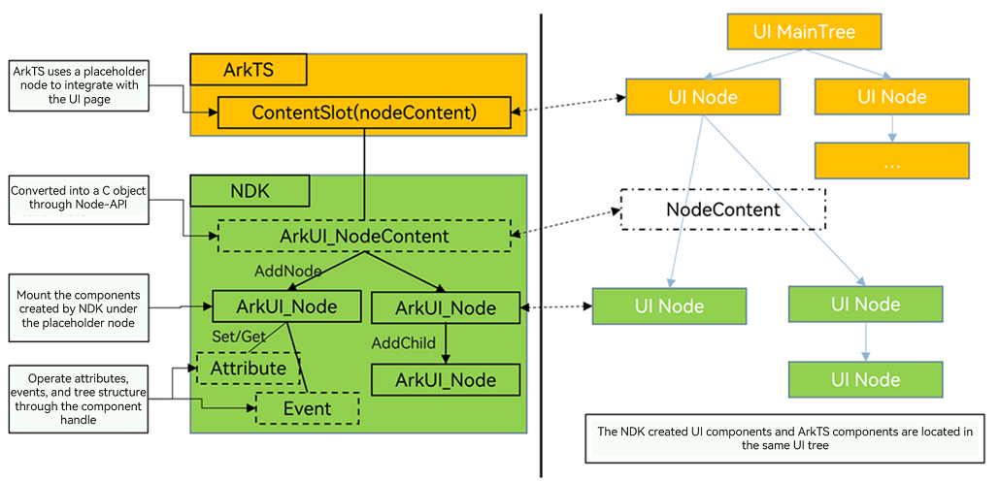

# NDK-Based UI Development Overview

<!--Kit: ArkUI-->
<!--Subsystem: ArkUI-->
<!--Owner: @xiang-shouxing-->
<!--Designer: @xiang-shouxing-->
<!--Tester: @sally__-->
<!--Adviser: @Brilliantry_Rui-->
<!-- md-trans-meta sourceCommit=4cd6ff07550739998f1b5508c7b8a32b6b4ff448 translatedAt=2026-08-05T01:28:22.026Z pushedAt=2026-08-05T06:56:52.846Z -->

The ArkUI framework offers [NDK APIs](../napi/ndk-development-overview.md) for building UIs with C/C++, including component creation, UI tree control, attribute configuration, and event listening. While ArkTS and the ArkUI declarative framework are recommended for most UI development, use the ArkUI NDK APIs when:

- You need to dynamically create and mount UI components for bridging to your own UI framework.

- You aim to reuse C or C++ UI libraries developed by yourself or others.

The ArkUI NDK APIs provide the following capabilities:

- **Layout**

  Layout defines the size and position of components on the UI. The ArkUI NDK APIs offer linear, stacking, flexbox, relative layouts, and scrollable and carousel containers.

- **Component**

  Components are essential for UI, shaping the appearance on the screen. They include both built-in components and custom components with user-defined layout and drawing behaviors. Built-in components, such as buttons, radio buttons, images, and text, can be quickly created and have their attributes and events set using the ArkUI NDK APIs. Customization capabilities for UI components encompass layout measurement and drawing, enabling the construction of distinctive UI components.

- **Dialog box**

  Dialog boxes are vital for UI interactions. ArkUI NDK APIs enable the creation and display of custom dialog boxes with user-defined content.

- **Animation**

  Animations are one of the key elements of UI. The ArkUI NDK provides explicit animation APIs for crafting property animations that enhance user experience with efficient and sophisticated effects.

- **Interaction event**

  Interaction events are essential elements for UI and user interaction. The ArkUI NDK interface provides a variety of interaction events, including common events such as touch events, mouse events, and focus events, as well as gesture events that are further recognized based on these common events. Gesture events include single gestures such as tap, long press, drag, pinch, rotate, and swipe, as well as combined gesture events formed by combining single gestures.

## Overall Architecture

**Figure 1** Relationship between NDK APIs and the ArkTS declarative UI 

**Figure 2** Schematic diagram of component mounting through NDK APIs 

- The ArkTS declarative UI frontend and the NDK APIs both expose ArkUI's underlying capabilities. Compared to the ArkTS declarative UI frontend, NDK APIs not only strip away the declarative UI syntax such as state management but also streamline component capabilities, encapsulating the core functions of ArkUI components through C APIs.

- NDK-created UI components must be mounted through ArkTS placeholder components. Once mounted, they coexist with ArkTS components on the same UI tree, following uniform layout and event-handling rules.

## How to Develop

Using the NDK for UI development involves the following tasks.

| Task | Description |
| -------- | -------- |
| [NDK Development Guide](../napi/ndk-development-overview.md) | Describes the applicable scenarios and essential basics of NDK. |
| [Accessing ArkTS Pages](ndk-access-the-arkts-page.md) | Describes how to mount a UI built with NDK APIs onto an ArkTS main page for rendering and display. |
| [Adding Event Responses](ndk-add-event-response.md) | Describes how to add event listening and event handling logic on the native side. |
| [Using Animations](ndk-use-animation.md) | Describes how to add animations on the native side. |
| [Building Layouts](ndk-loading-long-list.md) | Describes how to use container components to build layouts on the native side. |
| [Building Pop-up Windows](ndk-build-pop-up-window.md) | Describes how to use pop-up window APIs to build a UI for pop-up display. |
| [Building Form Components](ndk-build-form-components.md) | Describes how to use NDK APIs to create form components such as buttons, sliders, toggles, check boxes, and radio buttons. |
| [Building Custom Components](ndk-build-custom-components.md) | Describes how to use NDK API capabilities to build custom components for differentiated UI components. |
| [Embedding ArkTS Components](ndk-embed-arkts-components.md) | Describes how to build an interface with ArkTS components on the native side. |
| [Building Render Nodes](ndk-embed-render-components.md) | Describes how to build render nodes on the native side. |
| [Accessing Accessibility Through Self-Drawing](ndk-accessibility-xcomponent.md) | Describes how a third-party UI framework integrated through the self-drawing mechanism connects to system accessibility by obtaining an AccessibilityProvider. |
| [Custom Drawing](arkts-user-defined-draw.md) | Describes how to use custom drawing capabilities to draw custom content. |
| [Querying and Manipulating Custom Nodes](ndk-node-query-operate.md) | Describes how to query and manipulate custom nodes. |
| [Launching EmbeddedUIExtensionAbility Through EmbeddedComponent](ndk-embedded-component.md) | Describes how to launch an EmbeddedUIExtensionAbility through EmbeddedComponent on the native side. This is primarily used in modular development scenarios that require process isolation. |
| [Using Text](ndk-styled-string.md) | Describes how the Text component works with the font engine. |
| [Ensuring Proper Functionality in NDK Multi-Instance Scenarios](ndk-scope-task.md) | Describes how to ensure proper API call functionality in NDK multi-instance scenarios. |
| [Building UI Pages in Parallel Using Multi-Threaded NDK APIs](ndk-build-on-multi-thread.md) | Describes how to use NDK for multi-threaded UI component creation. |

## Precautions

When using NDK APIs to develop UIs, ensure that all UI API calls are made on the application's main thread to prevent multi-threading issues, which can lead to crashes.