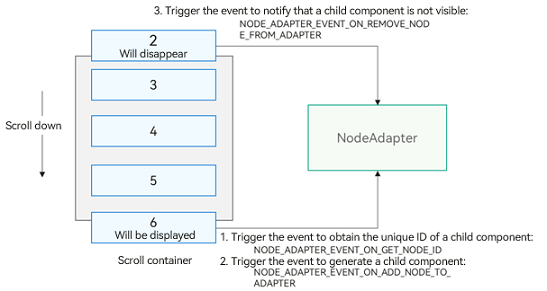

# Developing a Long List with Lazy Loading

For the **List**, **Grid**, **WaterFlow**, and **Swiper** components, the [NodeAdapter](../reference/apis-arkui/_ark_u_i___native_module.md#arkui_nodeadapterhandle) object is provided as an alternative to the ArkTS **LazyForEach** feature for on-demand child component generation. The specific attribute enumeration values are as follows:

- **List**: **NODE_LIST_NODE_ADAPTER**
- **Grid**: **NODE_GRID_NODE_ADAPTER**
- **WaterFlow**: **NODE_WATER_FLOW_NODE_ADAPTER**
- **Swiper**: **NODE_SWIPER_NODE_ADAPTER**

Key specifications of **NodeAdapter** include:


- Nodes with **NodeAdapter** set do not support direct child addition APIs like **addChild**. Child components are managed entirely by **NodeAdapter**. If a parent component already has child nodes, setting **NodeAdapter** will fail and return an error code.

- **NodeAdapter** uses events to notify you to generate components on demand. You must register an [event listener](../reference/apis-arkui/_ark_u_i___native_module.md#oh_arkui_nodeadapter_registereventreceiver) and handle logic within listener events, which are defined by [ArkUI_NodeAdapterEventType](../reference/apis-arkui/_ark_u_i___native_module.md#arkui_nodeadaptereventtype). **NodeAdapter** does not automatically release off-screen component objects; you must manage object release or caching during the [NODE_ADAPTER_EVENT_ON_REMOVE_NODE_FROM_ADAPTER](../reference/apis-arkui/_ark_u_i___native_module.md#arkui_nodeadaptereventtype) event. The following image illustrates the event triggering mechanism in a typical list scrolling scenario.
  


The following example optimizes the code in the [Integrating with ArkTS Pages](ndk-access-the-arkts-page.md) section, by introducing a lazy loading mechanism for a text list:


1. Integrate ArkTS into your project. For details, see [Integrating with ArkTS Pages](ndk-access-the-arkts-page.md).

2. Implement lazy loading adapter functionality.
   ```
   // ArkUIListItemAdapter
   // Code for lazy loading functionality in a text list.
   
   #ifndef MYAPPLICATION_ARKUILISTITEMADAPTER_H
   #define MYAPPLICATION_ARKUILISTITEMADAPTER_H
   
   #include <arkui/native_node.h>
   #include <stack>
   #include <string>
   #include <unordered_set>
   
   #include "ArkUIListItemNode.h"
   #include "ArkUITextNode.h"
   #include "nativeModule.h"
   
   namespace NativeModule {
   
   class ArkUIListItemAdapter {
   public:
       ArkUIListItemAdapter()
           : module_(NativeModuleInstance::GetInstance()->GetNativeNodeAPI()), handle_(OH_ArkUI_NodeAdapter_Create()) { // Use the NodeAdapter creation function.
           // Initialize lazy loading data.
           for (int32_t i = 0; i < 1000; i++) {
               data_.emplace_back(std::to_string(i));
           }
           // Set lazy loading data.
           OH_ArkUI_NodeAdapter_SetTotalNodeCount(handle_, data_.size());
           // Register the event receiver for lazy loading.
           OH_ArkUI_NodeAdapter_RegisterEventReceiver(handle_, this, OnStaticAdapterEvent);
       }
   
       ~ArkUIListItemAdapter() {
           // Release created components.
           while (!cachedItems_.empty()) {
               cachedItems_.pop();
           }
           items_.clear();
           // Release adapter resources.
           OH_ArkUI_NodeAdapter_UnregisterEventReceiver(handle_);
           OH_ArkUI_NodeAdapter_Dispose(handle_);
       }
   
       ArkUI_NodeAdapterHandle GetHandle() const { return handle_; }
   
       void RemoveItem(int32_t index) {
           // Remove the item at the specified index.
           data_.erase(data_.begin() + index);
           // If the index change affects the visibility of items in the visible area, the NODE_ADAPTER_EVENT_ON_REMOVE_NODE_FROM_ADAPTER event will be triggered to remove the element.
           // If items are added, the NODE_ADAPTER_EVENT_ON_GET_NODE_ID and NODE_ADAPTER_EVENT_ON_ADD_NODE_TO_ADAPTER events will be triggered accordingly.
           OH_ArkUI_NodeAdapter_RemoveItem(handle_, index, 1);
           // Update the new total count.
           OH_ArkUI_NodeAdapter_SetTotalNodeCount(handle_, data_.size());
       }
   
       void InsertItem(int32_t index, const std::string &value) {
           data_.insert(data_.begin() + index, value);
           // If the index change affects the visibility of elements in the visible area, the NODE_ADAPTER_EVENT_ON_GET_NODE_ID and NODE_ADAPTER_EVENT_ON_ADD_NODE_TO_ADAPTER events will be triggered.
           // If items are removed, the NODE_ADAPTER_EVENT_ON_REMOVE_NODE_FROM_ADAPTER event will be triggered accordingly.
           OH_ArkUI_NodeAdapter_InsertItem(handle_, index, 1);
           // Update the new total count.
           OH_ArkUI_NodeAdapter_SetTotalNodeCount(handle_, data_.size());
       }
   
       void MoveItem(int32_t oldIndex, int32_t newIndex) {
           auto temp = data_[oldIndex];
           data_.insert(data_.begin() + newIndex, temp);
           data_.erase(data_.begin() + oldIndex);
           // If the move changes the visibility of items within the visible area, the corresponding events will be triggered.
           OH_ArkUI_NodeAdapter_MoveItem(handle_, oldIndex, newIndex);
       }
   
       void ReloadItem(int32_t index, const std::string &value) {
           data_[index] = value;
           // If the index is within the visible area, first trigger the NODE_ADAPTER_EVENT_ON_REMOVE_NODE_FROM_ADAPTER event to remove the old item,
           // then trigger the NODE_ADAPTER_EVENT_ON_GET_NODE_ID and NODE_ADAPTER_EVENT_ON_ADD_NODE_TO_ADAPTER events.
           OH_ArkUI_NodeAdapter_ReloadItem(handle_, index, 1);
       }
   
       void ReloadAllItem() {
           std::reverse(data_.begin(), data_.end());
           // In the scenario where all items are reloaded, the NODE_ADAPTER_EVENT_ON_GET_NODE_ID event will be triggered to obtain new component IDs,
           // compare the new component IDs, and reuse those whose IDs have not changed,
           // for items with new IDs, trigger the NODE_ADAPTER_EVENT_ON_ADD_NODE_TO_ADAPTER event to create new components,
           // then identify any unused IDs from the old data and call NODE_ADAPTER_EVENT_ON_REMOVE_NODE_FROM_ADAPTER to remove the old items.
           OH_ArkUI_NodeAdapter_ReloadAllItems(handle_);
       }
   
   private:
       static void OnStaticAdapterEvent(ArkUI_NodeAdapterEvent *event) {
           // Obtain the instance object and invoke its event callback.
           auto itemAdapter = reinterpret_cast<ArkUIListItemAdapter *>(OH_ArkUI_NodeAdapterEvent_GetUserData(event));
           itemAdapter->OnAdapterEvent(event);
       }
   
       void OnAdapterEvent(ArkUI_NodeAdapterEvent *event) {
           auto type = OH_ArkUI_NodeAdapterEvent_GetType(event);
           switch (type) {
           case NODE_ADAPTER_EVENT_ON_GET_NODE_ID:
               OnNewItemIdCreated(event);
               break;
           case NODE_ADAPTER_EVENT_ON_ADD_NODE_TO_ADAPTER:
               OnNewItemAttached(event);
               break;
           case NODE_ADAPTER_EVENT_ON_REMOVE_NODE_FROM_ADAPTER:
               OnItemDetached(event);
               break;
           default:
               break;
           }
       }
   
       // Assign IDs to items that need to be displayed, used for element diffing in the ReloadAllItems scenario.
       void OnNewItemIdCreated(ArkUI_NodeAdapterEvent *event) {
           auto index = OH_ArkUI_NodeAdapterEvent_GetItemIndex(event);
           static std::hash<std::string> hashId = std::hash<std::string>();
           auto id = hashId(data_[index]);
           OH_ArkUI_NodeAdapterEvent_SetNodeId(event, id);
       }
   
       // Handle the display of new items in the visible area.
       void OnNewItemAttached(ArkUI_NodeAdapterEvent *event) {
           auto index = OH_ArkUI_NodeAdapterEvent_GetItemIndex(event);
           ArkUI_NodeHandle handle = nullptr;
           if (!cachedItems_.empty()) {
               // Use and update the recycled item from the cache.
               auto recycledItem = cachedItems_.top();
               auto textItem = std::dynamic_pointer_cast<ArkUITextNode>(recycledItem->GetChildren().back());
               textItem->SetTextContent(data_[index]);
               handle = recycledItem->GetHandle();
               // Release the reference from the cache.
               cachedItems_.pop();
           } else {
               // Create a new item.
               auto listItem = std::make_shared<ArkUIListItemNode>();
               auto textNode = std::make_shared<ArkUITextNode>();
               textNode->SetTextContent(data_[index]);
               textNode->SetFontSize(16);
               textNode->SetPercentWidth(1);
               textNode->SetHeight(100);
               textNode->SetBackgroundColor(0xFFfffacd);
               textNode->SetTextAlign(ARKUI_TEXT_ALIGNMENT_CENTER);
               listItem->AddChild(textNode);
               listItem->RegisterOnClick([index]() { OH_LOG_INFO(LOG_APP, "on %{public}d list item click", index); });
               handle = listItem->GetHandle();
               // Keep a reference to the text list item.
               items_.emplace(handle, listItem);
           }
           // Set the item to be displayed.
           OH_ArkUI_NodeAdapterEvent_SetItem(event, handle);
       }
   
       // Remove an item from the visible area.
       void OnItemDetached(ArkUI_NodeAdapterEvent *event) {
           auto item = OH_ArkUI_NodeAdapterEvent_GetRemovedNode(event);
           // Place the item in the cache pool for recycling and reuse.
           cachedItems_.emplace(items_[item]);
       }
   
   
       std::vector<std::string> data_;
       ArkUI_NativeNodeAPI_1 *module_ = nullptr;
       ArkUI_NodeAdapterHandle handle_ = nullptr;
   
       // Manage items generated by the NodeAdapter.
       std::unordered_map<ArkUI_NodeHandle, std::shared_ptr<ArkUIListItemNode>> items_;
   
       // Manage the component reuse pool.
       std::stack<std::shared_ptr<ArkUIListItemNode>> cachedItems_;
   };
   
   } // namespace NativeModule
   
   #endif // MYAPPLICATION_ARKUILISTITEMADAPTER_H
   ```

3. Enhance the encapsulated list class object used in the [Integrating with ArkTS Pages](ndk-access-the-arkts-page.md) section with additional lazy loading capabilities.
   ```
   // ArkUIListNode.h
   // Encapsulated list class object.
   
   #ifndef MYAPPLICATION_ARKUILISTNODE_H
   #define MYAPPLICATION_ARKUILISTNODE_H
   
   #include "ArkUIListItemAdapter.h"
   #include "ArkUINode.h"
   #include <hilog/log.h>
   
   namespace NativeModule {
   class ArkUIListNode : public ArkUINode {
   public:
       ArkUIListNode()
           : ArkUINode((NativeModuleInstance::GetInstance()->GetNativeNodeAPI())->createNode(ARKUI_NODE_LIST)) {}
   
       ~ArkUIListNode() override {
           nativeModule_->unregisterNodeEvent(handle_, NODE_LIST_ON_SCROLL_INDEX);
           if (adapter_) {
               // Unmount UI components associated with the adapter upon destruction.
               nativeModule_->resetAttribute(handle_, NODE_LIST_NODE_ADAPTER);
               adapter_.reset();
           }
       }
   
       void SetScrollBarState(bool isShow) {
           assert(handle_);
           ArkUI_ScrollBarDisplayMode displayMode =
               isShow ? ARKUI_SCROLL_BAR_DISPLAY_MODE_ON : ARKUI_SCROLL_BAR_DISPLAY_MODE_OFF;
           ArkUI_NumberValue value[] = {{.i32 = displayMode}};
           ArkUI_AttributeItem item = {value, 1};
           nativeModule_->setAttribute(handle_, NODE_SCROLL_BAR_DISPLAY_MODE, &item);
       }
   
       void RegisterOnScrollIndex(const std::function<void(int32_t index)> &onScrollIndex) {
           assert(handle_);
           onScrollIndex_ = onScrollIndex;
           nativeModule_->registerNodeEvent(handle_, NODE_LIST_ON_SCROLL_INDEX, 0, nullptr);
       }
       // Import the lazy loading module.
       void SetLazyAdapter(const std::shared_ptr<ArkUIListItemAdapter> &adapter) {
           assert(handle_);
           ArkUI_AttributeItem item{nullptr, 0, nullptr, adapter->GetHandle()};
           nativeModule_->setAttribute(handle_, NODE_LIST_NODE_ADAPTER, &item);
           adapter_ = adapter;
       }
   
   protected:
       void OnNodeEvent(ArkUI_NodeEvent *event) override {
           auto eventType = OH_ArkUI_NodeEvent_GetEventType(event);
           switch (eventType) {
           case NODE_LIST_ON_SCROLL_INDEX: {
               auto index = OH_ArkUI_NodeEvent_GetNodeComponentEvent(event)->data[0];
               if (onScrollIndex_) {
                   onScrollIndex_(index.i32);
               }
           }
           default: {
           }
           }
       }
   
   private:
       std::function<void(int32_t index)> onScrollIndex_;
   
       std::shared_ptr<ArkUIListItemAdapter> adapter_;
   };
   } // namespace NativeModule
   
   #endif // MYAPPLICATION_ARKUILISTNODE_H
   ```

4. Write code for lazy loading of a list.
   ```
   // ArkUILazyTextListExample
   // Sample code for lazy loading a list.
   
   #ifndef MYAPPLICATION_LAZYTEXTLISTEXAMPLE_H
   #define MYAPPLICATION_LAZYTEXTLISTEXAMPLE_H
   
   #include "ArkUIBaseNode.h"
   #include "ArkUIListNode.h"
   #include "UITimer.h"
   #include <thread>
   #include <uv.h>
   
   namespace NativeModule {
   
   std::shared_ptr<ArkUIBaseNode> CreateLazyTextListExample(napi_env env) {
       // Create components and mount them.
       // 1: Create a List component.
       auto list = std::make_shared<ArkUIListNode>();
       list->SetPercentWidth(1);
       list->SetPercentHeight(1);
       // 2: Create ListItem child components for lazy loading and mount them to the List component.
       auto adapter = std::make_shared<ArkUIListItemAdapter>();
       list->SetLazyAdapter(adapter);
   
       // 3: Simulate lazy loading operations.
       CreateNativeTimer(env, adapter.get(), 4, [](void *userdata, int32_t count) {
           auto adapter = reinterpret_cast<ArkUIListItemAdapter *>(userdata);
           switch (count) {
           case 0: {
               // Remove the 0th item.
               adapter->RemoveItem(0);
               break;
           }
           case 1: {
               // Insert the 0th item.
               adapter->InsertItem(0, "0");
               break;
           }
           case 2: {
               // Move an item to a new position.
               adapter->MoveItem(0, 2);
               break;
           }
           case 3: {
               // Reload a single item.
               adapter->ReloadItem(0, "1112");
               break;
           }
           case 4: {
               // Reload all items.
               adapter->ReloadAllItem();
               break;
           }
           default: {
           }
           }
       });
   
       // 3: Register list-related listening events.
       list->RegisterOnScrollIndex([](int32_t index) { OH_LOG_INFO(LOG_APP, "on list scroll index: %{public}d", index); });
       // 4: Register the appear event.
       list->RegisterOnAppear([]() { OH_LOG_INFO(LOG_APP, "on list mount to tree"); });
       // 4: Register the disappear event.
       list->RegisterOnDisappear([]() { OH_LOG_INFO(LOG_APP, "on list unmount from tree"); });
       return list;
   }
   } // namespace NativeModule
   
   #endif // MYAPPLICATION_LAZYTEXTLISTEXAMPLE_H
   ```

5. Implement a simple timer module.
   ```
   // UITimer.h
   // Timer module.
   
   #ifndef MYAPPLICATION_UITIMER_H
   #define MYAPPLICATION_UITIMER_H
   
   #include <hilog/log.h>
   #include <js_native_api.h>
   #include <js_native_api_types.h>
   #include <node_api.h>
   #include <node_api_types.h>
   #include <string>
   #include <thread>
   #include <uv.h>
   
   namespace NativeModule {
   
   struct UIData {
       void *userData = nullptr;
       int32_t count = 0;
       int32_t totalCount = 0;
       void (*func)(void *userData, int32_t count) = nullptr;
   };
   
   napi_threadsafe_function threadSafeFunction = nullptr;
   
   void CreateNativeTimer(napi_env env, void *userData, int32_t totalCount, void (*func)(void *userData, int32_t count)) {
       napi_value name;
       std::string str = "UICallback";
       napi_create_string_utf8(env, str.c_str(), str.size(), &name);
       // UI main thread callback function.
       napi_create_threadsafe_function(
           env, nullptr, nullptr, name, 0, 1, nullptr, nullptr, nullptr,
           [](napi_env env, napi_value value, void *context, void *data) {
               auto userdata = reinterpret_cast<UIData *>(data);
               userdata->func(userdata->userData, userdata->count);
               delete userdata;
           },
           &threadSafeFunction);
       // Start the timer to simulate data changes.
       std::thread timerThread([data = userData, totalCount, func]() {
           uv_loop_t *loop = uv_loop_new();
           uv_timer_t *timer = new uv_timer_t();
           uv_timer_init(loop, timer);
           timer->data = new UIData{data, 0, totalCount, func};
           uv_timer_start(
               timer,
               [](uv_timer_t *handle) {
                   OH_LOG_INFO(LOG_APP, "on timeout");
                   napi_acquire_threadsafe_function(threadSafeFunction);
                   auto *customData = reinterpret_cast<UIData *>(handle->data);
                   // Create callback data.
                   auto *callbackData =
                       new UIData{customData->userData, customData->count, customData->totalCount, customData->func};
                   napi_call_threadsafe_function(threadSafeFunction, callbackData, napi_tsfn_blocking);
                   customData->count++;
                   if (customData->count > customData->totalCount) {
                       uv_timer_stop(handle);
                       delete handle;
                       delete customData;
                   }
               },
               4000, 4000);
           uv_run(loop, UV_RUN_DEFAULT);
           uv_loop_delete(loop);
       });
       timerThread.detach();
   }
   } // namespace NativeModule
   
   #endif // MYAPPLICATION_UITIMER_H
   ```

6. Mount the lazy loading example code onto the **ContentSlot** as described in the [Integrating with ArkTS Pages](ndk-access-the-arkts-page.md) section.
   ```
   // NDK API entry mount file.
   
   #include "NativeEntry.h"
   
   #include "ArkUIMixedRefresh.h"
   #include "LazyTextListExample.h"
   #include "MixedRefreshExample.h"
   #include "TextListExample.h"
   
   #include <arkui/native_node_napi.h>
   #include <arkui/native_type.h>
   #include <js_native_api.h>
   #include <uv.h>
   
   namespace NativeModule {
   namespace {
   napi_env g_env;
   }
   
   napi_env GetNapiEnv() { return g_env; }
   
   napi_value CreateNativeRoot(napi_env env, napi_callback_info info) {
       size_t argc = 1;
       napi_value args[1] = {nullptr};
   
       napi_get_cb_info(env, info, &argc, args, nullptr, nullptr);
   
       // Obtain NodeContent.
       ArkUI_NodeContentHandle contentHandle;
       OH_ArkUI_GetNodeContentFromNapiValue(env, args[0], &contentHandle);
       NativeEntry::GetInstance()->SetContentHandle(contentHandle);
   
       // Create a lazy-loaded text list.
       auto node = CreateLazyTextListExample(env);
   
       // Keep the native side object in the management class to maintain its lifecycle.
       NativeEntry::GetInstance()->SetRootNode(node);
       g_env = env;
       return nullptr;
   }
   
   napi_value DestroyNativeRoot(napi_env env, napi_callback_info info) {
       // Release the native side object from the management class.
       NativeEntry::GetInstance()->DisposeRootNode();
       return nullptr;
   }
   
   } // namespace NativeModule
   ```
