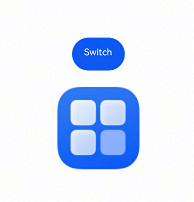

# Querying and Operating Custom Nodes

<!--Kit: ArkUI-->
<!--Subsystem: ArkUI-->
<!--Owner: @wangyang2022-->
<!--Designer: @wangyang2022-->
<!--Tester: @sally__-->
<!--Adviser: @Brilliantry_Rui-->
<!-- md-trans-meta sourceCommit=4cd6ff07550739998f1b5508c7b8a32b6b4ff448 translatedAt=2026-08-05T10:07:54.621Z pushedAt=2026-08-06T06:21:34.428Z -->

The NDK provides comprehensive capabilities for node query, traversal, and operations. You can use the following APIs to efficiently access and manipulate nodes.

The following scenarios are based on the project configuration described in [Integrating with ArkTS Pages](ndk-access-the-arkts-page.md).

## Querying Node uniqueId and Obtaining Node Information by uniqueId

**uniqueId** is a system-allocated unique identifier for each node.

Since API version 20, you can use the [OH_ArkUI_NodeUtils_GetNodeUniqueId](../reference/apis-arkui/capi-native-node-h.md#oh_arkui_nodeutils_getnodeuniqueid) API to obtain the **uniqueId** value of a target node, and the [OH_ArkUI_NodeUtils_GetNodeHandleByUniqueId](../reference/apis-arkui/capi-native-node-h.md#oh_arkui_nodeutils_getnodehandlebyuniqueid) API to obtain the node pointer using the obtained **uniqueId** value.

<!-- @[ndknodequeryoperate1_start](https://gitcode.com/openharmony/applications_app_samples/blob/master/code/DocsSample/ArkUISample/NdkNodeQueryOperate/entry/src/main/cpp/InquireUniqueId.cpp) -->  

```cpp
const unsigned int VALUE_1 = 480;
const unsigned int VALUE_2 = 300;
const unsigned int VALUE_3 = 50;
    std::shared_ptr<ArkUIBaseNode> InquireUniqueId::GetNodeUniqueId()
    {
        ArkUI_NativeNodeAPI_1* nodeAPI = NativeModuleInstance::GetInstance()->GetNativeNodeAPI();
        ArkUI_NodeHandle testNode = nodeAPI->createNode(ARKUI_NODE_COLUMN);
        ArkUI_NumberValue value[] = {VALUE_1};
        ArkUI_AttributeItem item = {value, sizeof(value) / sizeof(ArkUI_NumberValue)};
        value[0].f32 = VALUE_2;
        nodeAPI->setAttribute(testNode, NODE_WIDTH, &item);
        nodeAPI->setAttribute(testNode, NODE_HEIGHT, &item);
        struct IdList {
            int32_t id = -1;
        };
        static IdList idl;
        int32_t uid = -1;
        OH_ArkUI_NodeUtils_GetNodeUniqueId(testNode, &uid);
        idl.id = uid;
        auto button = nodeAPI->createNode(ARKUI_NODE_BUTTON);
        value[0].f32 = VALUE_3;
        nodeAPI->setAttribute(button, NODE_WIDTH, &item);
        nodeAPI->setAttribute(button, NODE_HEIGHT, &item);
        nodeAPI->addChild(testNode, button);
        nodeAPI->registerNodeEvent(button, NODE_ON_CLICK, 1, &idl);
        OH_LOG_Print(LOG_APP, LOG_WARN, LOG_PRINT, "GetNodeUniqueId", "GetNodeHandleByUniqueId success1");
        nodeAPI->registerNodeEventReceiver([](ArkUI_NodeEvent *event) {
            auto targetId = OH_ArkUI_NodeEvent_GetTargetId(event);
            if (targetId == 1) {
                auto idl = (IdList *)OH_ArkUI_NodeEvent_GetUserData(event);
                ArkUI_NodeHandle Test_Column;
                auto ec = OH_ArkUI_NodeUtils_GetNodeHandleByUniqueId(idl->id, &Test_Column);
                if (ec == 0) {
                    OH_LOG_Print(LOG_APP, LOG_WARN, LOG_PRINT, "GetNodeUniqueId", "GetNodeHandleByUniqueId success");
                }
            }
        });
```

## Obtaining Node Information Using Custom IDs

Use the [OH_ArkUI_NodeUtils_GetAttachedNodeHandleById](../reference/apis-arkui/capi-native-node-h.md#oh_arkui_nodeutils_getattachednodehandlebyid) API to obtain the target node pointer based on a custom ID.

1. Access native components in ArkTS:

   <!-- @[ndknodequeryoperate2_start](https://gitcode.com/openharmony/applications_app_samples/blob/master/code/DocsSample/ArkUISample/NdkNodeQueryOperate/entry/src/main/ets/pages/GetNodeById.ets) -->  
   
   ``` TypeScript
   import nativeNode from 'libentry.so';
   import { NodeContent } from '@kit.ArkUI';
   
   @Entry
   @Component
   struct GetNodeById {
     private rootSlot = new NodeContent();
   
     aboutToAppear(): void {
       nativeNode.createUserIdNode(this.rootSlot);
     }
   
     build() {
       Scroll() {
         Column({ space: 15 }) {
           Column() {
             ContentSlot(this.rootSlot)
           }
         }
         .width('100%')
       }.scrollBarColor(Color.Transparent)
     }
   }
   ```

2. Create **GetNodeByIdExample.h** to create a **Text** node with an **id** attribute and obtain it using **OH_ArkUI_NodeUtils_GetAttachedNodeHandleById**:

   <!-- @[ndknodequeryoperate3_start](https://gitcode.com/openharmony/applications_app_samples/blob/master/code/DocsSample/ArkUISample/NdkNodeQueryOperate/entry/src/main/cpp/GetNodeByIdExample.h) -->  
   
   ```c
   // GetNodeByIdExample.h
   #ifndef MYAPPLICATION_GETNODEBYID_H
   #define MYAPPLICATION_GETNODEBYID_H

   #include "ArkUINode.h"
   #include <hilog/log.h>

   namespace NativeModule {

   std::shared_ptr<ArkUIBaseNode> CreateGetNodeByIdExample()
   {
      auto nodeAPI = NativeModuleInstance::GetInstance()->GetNativeNodeAPI();
      
      // Create the root node Scroll.
      ArkUI_NodeHandle scroll = nodeAPI->createNode(ARKUI_NODE_SCROLL);
      ArkUI_NumberValue length_value[] = {{.f32 = 480}};
      ArkUI_AttributeItem length_item = {length_value, sizeof(length_value) / sizeof(ArkUI_NumberValue)};
      nodeAPI->setAttribute(scroll, NODE_WIDTH, &length_item);
      ArkUI_NumberValue length_value1[] = {{.f32 = 650}};
      ArkUI_AttributeItem length_item1 = {length_value1, sizeof(length_value1) / sizeof(ArkUI_NumberValue)};
      nodeAPI->setAttribute(scroll, NODE_HEIGHT, &length_item1);
      ArkUI_AttributeItem scroll_id = {.string = "Scroll_CAPI"};
      nodeAPI->setAttribute(scroll, NODE_ID, &scroll_id);
      
      // Create a Column.
      ArkUI_NodeHandle column = nodeAPI->createNode(ARKUI_NODE_COLUMN);
      ArkUI_NumberValue value[] = {480};
      ArkUI_AttributeItem item = {value, sizeof(value) / sizeof(ArkUI_NumberValue)};
      nodeAPI->setAttribute(column, NODE_WIDTH, &item);
      ArkUI_NumberValue column_bc[] = {{.u32 = 0xFFF00BB}};
      ArkUI_AttributeItem column_item = {column_bc, 1};
      nodeAPI->setAttribute(column, NODE_BACKGROUND_COLOR, &column_item);
      ArkUI_AttributeItem column_id = {.string = "Column_CAPI"};
      nodeAPI->setAttribute(column, NODE_ID, &column_id);
      
      // Create a Text.
      ArkUI_NodeHandle text0 = nodeAPI->createNode(ARKUI_NODE_TEXT);
      ArkUI_NumberValue text_width[] = {300};
      ArkUI_AttributeItem text_item0 = {text_width, sizeof(text_width) / sizeof(ArkUI_NumberValue)};
      nodeAPI->setAttribute(text0, NODE_WIDTH, &text_item0);
      ArkUI_NumberValue text_height[] = {50};
      ArkUI_AttributeItem text_item1 = {text_height, sizeof(text_height) / sizeof(ArkUI_NumberValue)};
      nodeAPI->setAttribute(text0, NODE_HEIGHT, &text_item1);
      ArkUI_AttributeItem text_item = {.string = "Sample Text node"};
      nodeAPI->setAttribute(text0, NODE_TEXT_CONTENT, &text_item);
      ArkUI_NumberValue margin[] = {10};
      ArkUI_AttributeItem item_margin = {margin, sizeof(margin) / sizeof(ArkUI_NumberValue)};
      nodeAPI->setAttribute(text0, NODE_MARGIN, &item_margin);
      ArkUI_AttributeItem text0_id = {.string = "Text0_CAPI"};
      nodeAPI->setAttribute(text0, NODE_ID, &text0_id);
       
      // Create a Row.
      ArkUI_NodeHandle row0 = nodeAPI->createNode(ARKUI_NODE_ROW);
      ArkUI_NumberValue width_value[] = {{.f32=330}};
      ArkUI_AttributeItem width_item = {width_value, sizeof(width_value) / sizeof(ArkUI_NumberValue)};
      nodeAPI->setAttribute(row0, NODE_WIDTH, &width_item);
      nodeAPI->setAttribute(row0, NODE_HEIGHT, &text_item1);
      nodeAPI->setAttribute(row0, NODE_MARGIN, &item_margin);
       
      // Create a Button.
      ArkUI_NodeHandle bt0 = nodeAPI->createNode(ARKUI_NODE_BUTTON);
      ArkUI_NumberValue btn_width[] = {150};
      ArkUI_AttributeItem btn_item0 = {btn_width, sizeof(btn_width) / sizeof(ArkUI_NumberValue)};
      nodeAPI->setAttribute(bt0, NODE_WIDTH, &btn_item0);
      nodeAPI->setAttribute(bt0, NODE_HEIGHT, &text_item1);
      nodeAPI->setAttribute(bt0, NODE_MARGIN, &item_margin);
      ArkUI_AttributeItem bt0_item = {.string = "GetAttachedNodeHandleById"};
      nodeAPI->setAttribute(bt0, NODE_BUTTON_LABEL, &bt0_item);
      nodeAPI->registerNodeEvent(bt0, NODE_ON_CLICK, 0, text0);
       
      // Register an event.
      auto onClick = [](ArkUI_NodeEvent *event) {
          auto nodeAPI = NativeModuleInstance::GetInstance()->GetNativeNodeAPI();
       
          if (OH_ArkUI_NodeEvent_GetTargetId(event) == 0) {  // GetAttachedNodeHandleById
              auto text0 = (ArkUI_NodeHandle)OH_ArkUI_NodeEvent_GetUserData(event);
              ArkUI_NodeHandle node = nullptr;
              auto res = OH_ArkUI_NodeUtils_GetAttachedNodeHandleById("Text0_CAPI", &node);
              if (res == ARKUI_ERROR_CODE_NO_ERROR && node == text0) {
                  OH_LOG_Print(LOG_APP, LOG_INFO, 0xFF00, "GetNodeByIdExample", "get Text0_CAPI success");
              } else {
                  OH_LOG_Print(LOG_APP, LOG_ERROR, 0xFF00, "GetNodeByIdExample", "get Text0_CAPI failed");
              }
          }
      };
      nodeAPI->registerNodeEventReceiver(onClick);
           
      // Add a node.
      nodeAPI->addChild(scroll, column);
      nodeAPI->addChild(column, text0);
      nodeAPI->addChild(column, row0);
      nodeAPI->addChild(row0, bt0);
      
      return std::make_shared<ArkUINode>(scroll);
   }
   } // namespace NativeModule

   #endif // MYAPPLICATION_GETNODEBYID_H
   ```

3. Mount the native node in **NativeEntry.cpp**.

   <!-- @[ndknodequeryoperate3_start](https://gitcode.com/openharmony/applications_app_samples/blob/master/code/DocsSample/ArkUISample/NdkNodeQueryOperate/entry/src/main/cpp/NativeEntry.cpp) -->  
   
   ```cpp
   // NativeEntry.cpp
   #include <arkui/native_node_napi.h>
   #include <hilog/log.h>
   #include <js_native_api.h>
   #include "NativeEntry.h"
   #include "MoveToExample.h"
   #include "GetNodeByIdExample.h"
   
   
   namespace NativeModule {
   // ...
   static napi_value CreateNativeRoot(napi_env env, napi_callback_info info, const char *who, MakeNodeFn makeNodeFn)
   {
       size_t argc = 1;
       napi_value args[1] = {nullptr};
   
       napi_get_cb_info(env, info, &argc, args, nullptr, nullptr);
   
       // Obtain NodeContent.
       ArkUI_NodeContentHandle contentHandle;
       OH_ArkUI_GetNodeContentFromNapiValue(env, args[0], &contentHandle);
       if (contentHandle == nullptr) {
           OH_LOG_Print(LOG_APP, LOG_INFO, LOG_PRINT_DOMAIN, K_LOG_DOMAIN,
                        "%{public}s nodeContentHandle is null", who);
           return nullptr;
       }
       NativeEntry::GetInstance()->SetContentHandle(contentHandle);
   
       // Create a node.
       auto node = makeNodeFn();
   
       // Keep the native-side object in the management class to maintain its lifecycle.
       NativeEntry::GetInstance()->SetRootNode(node);
       return nullptr;
   }
   
   napi_value DestroyNativeRoot(napi_env env, napi_callback_info info)
   {
       // Release the native-side object from the management class.
       NativeEntry::GetInstance()->DisposeRootNode();
       return nullptr;
   }
   // ...
   } // namespace NativeModule
   ```

4. Run the program and click the button to verify successful node retrieval.

## Moving a Node

Use the [OH_ArkUI_NodeUtils_MoveTo](../reference/apis-arkui/capi-native-node-h.md#oh_arkui_nodeutils_moveto) API to move a native node to a new parent node, modifying the node tree structure as needed.

> **NOTE**
>
> Currently, only the following [ArkUI_NodeType](../reference/apis-arkui/capi-native-node-h.md#arkui_nodetype) nodes can be moved: ARKUI_NODE_STACK, ARKUI_NODE_XCOMPONENT, and ARKUI_NODE_EMBEDDED_COMPONENT. This API does not work for other node types.

1. Access native components in ArkTS:

   <!-- @[ndknodequeryoperate4_start](https://gitcode.com/openharmony/applications_app_samples/blob/master/code/DocsSample/ArkUISample/NdkNodeQueryOperate/entry/src/main/ets/pages/MoveTo.ets) -->  
   
   ``` TypeScript
   // MoveTo.ets
   import nativeNode from 'libentry.so';
   import { NodeContent } from '@kit.ArkUI';
   
   @Entry
   @Component
   struct MoveTo {
     private rootSlot = new NodeContent();
   
     aboutToAppear(): void {
       nativeNode.createMoveToNode(this.rootSlot);
     }
   
     build() {
       Scroll() {
         Column({ space: 15 }) {
           Column() {
             ContentSlot(this.rootSlot)
           }
         }
         .width('100%')
       }.scrollBarColor(Color.Transparent)
     }
   }
   ```

2. Create **MoveTo.h** to create **Stack** nodes and move them using **OH_ArkUI_NodeUtils_MoveTo**:

   <!-- @[ndknodequeryoperate5_start](https://gitcode.com/openharmony/applications_app_samples/blob/master/code/DocsSample/ArkUISample/NdkNodeQueryOperate/entry/src/main/cpp/MoveToExample.h) -->  

   ```c
   // MoveToExample.h
   #ifndef MYAPPLICATION_MOVETO_H
   #define MYAPPLICATION_MOVETO_H

   #include "ArkUINode.h"
   #include <hilog/log.h>

   namespace NativeModule {

   std::shared_ptr<ArkUIBaseNode> CreateMoveToExample()
   {
    auto nodeAPI = NativeModuleInstance::GetInstance()->GetNativeNodeAPI();
   
    // Create the incoming event node struct.
    struct A {
        ArkUI_NodeHandle node;
        ArkUI_NodeHandle targetParent;
    };
    A* a = new A;
   
    // Create the root node Scroll.
    ArkUI_NodeHandle scroll = nodeAPI->createNode(ARKUI_NODE_SCROLL);
    ArkUI_NumberValue length_value[] = {{.f32 = 480}};
    ArkUI_AttributeItem length_item = {length_value, sizeof(length_value) / sizeof(ArkUI_NumberValue)};
    nodeAPI->setAttribute(scroll, NODE_WIDTH, &length_item);
    ArkUI_NumberValue length_value1[] = {{.f32 = 650}};
    ArkUI_AttributeItem length_item1 = {length_value1, sizeof(length_value1) / sizeof(ArkUI_NumberValue)};
    nodeAPI->setAttribute(scroll, NODE_HEIGHT, &length_item1);
    ArkUI_AttributeItem scroll_id = {.string = "Scroll_CAPI"};
    nodeAPI->setAttribute(scroll, NODE_ID, &scroll_id);
   
    // Create a Column.
    ArkUI_NodeHandle column = nodeAPI->createNode(ARKUI_NODE_COLUMN);
    ArkUI_NumberValue value[] = {480};
    ArkUI_AttributeItem item = {value, sizeof(value) / sizeof(ArkUI_NumberValue)};
    nodeAPI->setAttribute(column, NODE_WIDTH, &item);
    ArkUI_AttributeItem column_id = {.string = "Column_CAPI"};
    nodeAPI->setAttribute(column, NODE_ID, &column_id);
   
    // Create a Row.
    ArkUI_NumberValue text_height[] = {50};
    ArkUI_AttributeItem text_item1 = {text_height, sizeof(text_height) / sizeof(ArkUI_NumberValue)};
    ArkUI_NumberValue margin[] = {10};
    ArkUI_AttributeItem item_margin = {margin, sizeof(margin) / sizeof(ArkUI_NumberValue)};
    ArkUI_NodeHandle row0 = nodeAPI->createNode(ARKUI_NODE_ROW);
    ArkUI_NumberValue width_value[] = {{.f32=330}};
    ArkUI_AttributeItem width_item = {width_value, sizeof(width_value) / sizeof(ArkUI_NumberValue)};
    nodeAPI->setAttribute(row0, NODE_WIDTH, &width_item);
    nodeAPI->setAttribute(row0, NODE_HEIGHT, &text_item1);
    nodeAPI->setAttribute(row0, NODE_MARGIN, &item_margin);

    ArkUI_NodeHandle row1 = nodeAPI->createNode(ARKUI_NODE_ROW);
    nodeAPI->setAttribute(row1, NODE_WIDTH, &width_item);
    nodeAPI->setAttribute(row1, NODE_HEIGHT, &text_item1);
    nodeAPI->setAttribute(row1, NODE_MARGIN, &item_margin);
    a->targetParent = row1;

    ArkUI_NodeHandle row2 = nodeAPI->createNode(ARKUI_NODE_ROW);
    nodeAPI->setAttribute(row2, NODE_WIDTH, &width_item);
    nodeAPI->setAttribute(row2, NODE_HEIGHT, &text_item1);
    nodeAPI->setAttribute(row2, NODE_MARGIN, &item_margin);

    // Create a Stack.
    ArkUI_NodeHandle stack0 = nodeAPI->createNode(ARKUI_NODE_STACK);
    ArkUI_NumberValue stack_value[] = {{.f32=50}};
    ArkUI_AttributeItem stack_item1 = {stack_value, sizeof(stack_value) / sizeof(ArkUI_NumberValue)};
    nodeAPI->setAttribute(stack0, NODE_WIDTH, &stack_item1);
    nodeAPI->setAttribute(stack0, NODE_HEIGHT, &stack_item1);
    ArkUI_NumberValue stack_bc[] = {{.u32 = 0xFFFFB6C1}};
    ArkUI_AttributeItem stack_item2 = {stack_bc, 1};
    nodeAPI->setAttribute(stack0, NODE_BACKGROUND_COLOR, &stack_item2);
    a->node = stack0;

    ArkUI_NodeHandle stack1 = nodeAPI->createNode(ARKUI_NODE_STACK);
    nodeAPI->setAttribute(stack1, NODE_WIDTH, &stack_item1);
    nodeAPI->setAttribute(stack1, NODE_HEIGHT, &stack_item1);
    ArkUI_NumberValue stack_bc1[] = {{.u32 = 0xFF6495ED}};
    ArkUI_AttributeItem stack_item3 = {stack_bc1, 1};
    nodeAPI->setAttribute(stack1, NODE_BACKGROUND_COLOR, &stack_item3);

    ArkUI_NodeHandle stack2 = nodeAPI->createNode(ARKUI_NODE_STACK);
    nodeAPI->setAttribute(stack2, NODE_WIDTH, &stack_item1);
    nodeAPI->setAttribute(stack2, NODE_HEIGHT, &stack_item1);
    ArkUI_NumberValue stack_bc2[] = {{.u32 = 0xFF90EE90}};
    ArkUI_AttributeItem stack_item4 = {stack_bc2, 1};
    nodeAPI->setAttribute(stack2, NODE_BACKGROUND_COLOR, &stack_item4);

    ArkUI_NodeHandle stack3 = nodeAPI->createNode(ARKUI_NODE_STACK);
    nodeAPI->setAttribute(stack3, NODE_WIDTH, &stack_item1);
    nodeAPI->setAttribute(stack3, NODE_HEIGHT, &stack_item1);
    nodeAPI->setAttribute(stack3, NODE_BACKGROUND_COLOR, &stack_item2);

    ArkUI_NodeHandle stack4 = nodeAPI->createNode(ARKUI_NODE_STACK);
    nodeAPI->setAttribute(stack4, NODE_WIDTH, &stack_item1);
    nodeAPI->setAttribute(stack4, NODE_HEIGHT, &stack_item1);
    nodeAPI->setAttribute(stack4, NODE_BACKGROUND_COLOR, &stack_item3);
    
    ArkUI_NodeHandle stack5 = nodeAPI->createNode(ARKUI_NODE_STACK);
    nodeAPI->setAttribute(stack5, NODE_WIDTH, &stack_item1);
    nodeAPI->setAttribute(stack5, NODE_HEIGHT, &stack_item1);
    nodeAPI->setAttribute(stack5, NODE_BACKGROUND_COLOR, &stack_item4);

    // Create a Button.
    ArkUI_NodeHandle bt0 = nodeAPI->createNode(ARKUI_NODE_BUTTON);
    ArkUI_NumberValue btn_width[] = {150};
    ArkUI_AttributeItem btn_item0 = {btn_width, sizeof(btn_width) / sizeof(ArkUI_NumberValue)};
    nodeAPI->setAttribute(bt0, NODE_WIDTH, &btn_item0);
    nodeAPI->setAttribute(bt0, NODE_HEIGHT, &text_item1);
    nodeAPI->setAttribute(bt0, NODE_MARGIN, &item_margin);
    ArkUI_AttributeItem bt0_item = {.string = "MoveTo"};
    nodeAPI->setAttribute(bt0, NODE_BUTTON_LABEL, &bt0_item);
    nodeAPI->registerNodeEvent(bt0, NODE_ON_CLICK, 0, a);
   
    // Register the event.
    auto onClick = [](ArkUI_NodeEvent *event) {
        auto nodeAPI = NativeModuleInstance::GetInstance()->GetNativeNodeAPI();
           
        if (OH_ArkUI_NodeEvent_GetTargetId(event) == 0) {  // MoveTo
            ArkUI_NodeHandle eventNode = OH_ArkUI_NodeEvent_GetNodeHandle(event);
            A* a = (A*)OH_ArkUI_NodeEvent_GetUserData(event);
            if (a != nullptr) {
                OH_ArkUI_NodeUtils_MoveTo(a->node, a->targetParent, 2);
                nodeAPI->unregisterNodeEvent(eventNode, NODE_ON_CLICK);
                delete a;
            }
        }
    };
    nodeAPI->registerNodeEventReceiver(onClick);
   
    // Add the node.
    nodeAPI->addChild(scroll, column);
    nodeAPI->addChild(column, row0);
    nodeAPI->addChild(column, row1);
    nodeAPI->addChild(column, row2);
    nodeAPI->addChild(row0, stack0);
    nodeAPI->addChild(row0, stack1);
    nodeAPI->addChild(row0, stack2);
    nodeAPI->addChild(row1, stack3);
    nodeAPI->addChild(row1, stack4);
    nodeAPI->addChild(row1, stack5);
    nodeAPI->addChild(row2, bt0);
   
    return std::make_shared<ArkUINode>(scroll);
   }
   } // namespace NativeModule
   
   #endif // MYAPPLICATION_MOVETO_H
   ```

3. Mount the native node in **NativeEntry.cpp**.

   <!-- @[ndknodequeryoperate3_start](https://gitcode.com/openharmony/applications_app_samples/blob/master/code/DocsSample/ArkUISample/NdkNodeQueryOperate/entry/src/main/cpp/NativeEntry.cpp) -->  

   ```cpp
   // NativeEntry.cpp
   #include <arkui/native_node_napi.h>
   #include <hilog/log.h>
   #include <js_native_api.h>
   #include "NativeEntry.h"
   #include "MoveToExample.h"
   #include "GetNodeByIdExample.h"


   namespace NativeModule {
   // ...
   static napi_value CreateNativeRoot(napi_env env, napi_callback_info info, const char *who, MakeNodeFn makeNodeFn)
   {
    size_t argc = 1;
    napi_value args[1] = {nullptr};

    napi_get_cb_info(env, info, &argc, args, nullptr, nullptr);

    // Obtain NodeContent
    ArkUI_NodeContentHandle contentHandle;
    OH_ArkUI_GetNodeContentFromNapiValue(env, args[0], &contentHandle);
    if (contentHandle == nullptr) {
        OH_LOG_Print(LOG_APP, LOG_INFO, LOG_PRINT_DOMAIN, K_LOG_DOMAIN,
                     "%{public}s nodeContentHandle is null", who);
        return nullptr;
    }
    NativeEntry::GetInstance()->SetContentHandle(contentHandle);
   
    // Create a node
    auto node = makeNodeFn();
   
    // Keep the native-side object in the management class to maintain its lifecycle.
    NativeEntry::GetInstance()->SetRootNode(node);
    return nullptr;
   }
   
   napi_value DestroyNativeRoot(napi_env env, napi_callback_info info)
   {
    // Release the native-side object from the management class.
    NativeEntry::GetInstance()->DisposeRootNode();
    return nullptr;
   }
   // ...
   } // namespace NativeModule
   ```

4. Run the program and click the button to observe the **Stack** node moving to the target position.

   

## Updating Node Attributes in the Current Frame

Since API version 21, use the [OH_ArkUI_NativeModule_InvalidateAttributes](../reference/apis-arkui/capi-native-node-h.md#oh_arkui_nativemodule_invalidateattributes) API to update node attributes within the current frame, preventing flickering during component switching.

1. Access native components in ArkTS:

   <!-- @[ndknodequeryoperate6_start](https://gitcode.com/openharmony/applications_app_samples/blob/master/code/DocsSample/ArkUISample/NdkNodeQueryOperate/entry/src/main/ets/pages/Attribute.ets) -->  
   
   ``` TypeScript
   
   import testNapi from 'libentry.so';
   import { NodeContent } from '@kit.ArkUI';
   
   @Component
   struct ImageContent {
     private nodeContent: NodeContent = new NodeContent();
   
     aboutToAppear() {
       // Create a node through the C API and add it to the nodeContent manager.
       testNapi.createNativeNode(this.nodeContent);
     }
     build() {
       Column() {
         // Display the native components stored in the nodeContent manager.
         ContentSlot(this.nodeContent)
       }
     }
   }
   
   @Entry
   @Component
   struct Index {
     @State message: string = 'Hello World';
     @State showParent: boolean = true;
     build() {
       Row() {
         Column() {
           // Replace $r('app.string.Switch') with the resource file you use.
           Button($r('app.string.Switch')).onClick(()=>{
             this.showParent = !this.showParent;
           }).margin(20)
           if(this.showParent) {
             ImageContent()
           } else {
             ImageContent()
           }
         }
         .width('100%')
       }
       .height('100%')
     }
   }
   ```

2. Create **Attribute_util.h** for setting component attributes:

   <!-- @[ndknodequeryoperate7_start](https://gitcode.com/openharmony/applications_app_samples/blob/master/code/DocsSample/ArkUISample/NdkNodeQueryOperate/entry/src/main/cpp/Attribute_util.h) -->  
   
   ```c
   #ifndef MYAPPLICATION_ATTRIBUTE_UTIL_H
   #define MYAPPLICATION_ATTRIBUTE_UTIL_H
   
   #include <arkui/native_node.h>
   #include <cstdint>
   #include <string>
   class AttributeUtil {
   public:
       ArkUI_NativeNodeAPI_1 *api_;
       ArkUI_NodeHandle node_;
       AttributeUtil(ArkUI_NodeHandle node, ArkUI_NativeNodeAPI_1 *api)
       {
           this->node_ = node;
           api_ = api;
       }
       int32_t Width(float width)
       {
           ArkUI_NumberValue NODE_WIDTH_value[] = {width};
           ArkUI_AttributeItem NODE_WIDTH_Item = {NODE_WIDTH_value, 1};
           return api_->setAttribute(node_, NODE_WIDTH, &NODE_WIDTH_Item);
       }
       int32_t Height(float height)
       {
           ArkUI_NumberValue NODE_HEIGHT_value[] = {height};
           ArkUI_AttributeItem NODE_HEIGHT_Item = {NODE_HEIGHT_value, 1};
           return api_->setAttribute(node_, NODE_HEIGHT, &NODE_HEIGHT_Item);
       }
       int32_t ImageSrc(std::string src)
       {
           ArkUI_AttributeItem NODE_IMAGE_SRC_VALUE = {.string = src.c_str()};
           return api_->setAttribute(node_, NODE_IMAGE_SRC, &NODE_IMAGE_SRC_VALUE);
       }
       int32_t ImageSyncLoad()
       {
           ArkUI_NumberValue NODE_IMAGE_SYNC_LOAD_value[] = {{.i32 = 1}};
           ArkUI_AttributeItem NODE_IMAGE_SYNC_LOAD_item = {NODE_IMAGE_SYNC_LOAD_value, 1};
           return api_->setAttribute(node_, NODE_IMAGE_SYNC_LOAD, &NODE_IMAGE_SYNC_LOAD_item);
       }
   };
   #endif // MYAPPLICATION_ATTRIBUTE_UTIL_H
   ```

3. Mount the native node in `napi_init.cpp`.

   <!-- @[ndknodequeryoperate7_start](https://gitcode.com/openharmony/applications_app_samples/blob/master/code/DocsSample/ArkUISample/NdkNodeQueryOperate/entry/src/main/cpp/napi_init.cpp) -->  
   
   ```cpp
   #include "Attribute_util.h"
   #include "napi/native_api.h"
   #include <arkui/native_interface.h>
   #include <arkui/native_node.h>
   #include <arkui/native_node_napi.h>
   #include <hilog/log.h>
   #include <js_native_api.h>
   #include <js_native_api_types.h>
   // ...
   const unsigned int NUMBER_2 = 2;
   const unsigned int NUMBER_WIDTH = 100;
   const unsigned int NUMBER_HEIGHT = 100;
   
   static napi_value Add(napi_env env, napi_callback_info info)
   {
       size_t argc = NUMBER_2;
       napi_value args[NUMBER_2] = {nullptr};
   
       napi_get_cb_info(env, info, &argc, args, nullptr, nullptr);
   
       napi_valuetype valuetype0;
       napi_typeof(env, args[0], &valuetype0);
   
       napi_valuetype valuetype1;
       napi_typeof(env, args[1], &valuetype1);
   
       double value0;
       napi_get_value_double(env, args[0], &value0);
   
       double value1;
       napi_get_value_double(env, args[1], &value1);
   
       napi_value sum;
       napi_create_double(env, value0 + value1, &sum);
   
       return sum;
   }
   
   static ArkUI_NativeNodeAPI_1 *nodeAPI = nullptr;
   
   static napi_value NAPI_Global_createNativeNode(napi_env env, napi_callback_info info)
   {
       size_t argc = 1;
       napi_value args[1] = {nullptr};
       napi_get_cb_info(env, info, &argc, args, nullptr, nullptr);
       ArkUI_NodeContentHandle contentHandle;
       OH_ArkUI_GetNodeContentFromNapiValue(env, args[0], &contentHandle);
       OH_ArkUI_GetModuleInterface(ARKUI_NATIVE_NODE, ArkUI_NativeNodeAPI_1, nodeAPI);
       // Create an Image component.
       auto imageNode = nodeAPI->createNode(ARKUI_NODE_IMAGE);
       AttributeUtil imageNodeAttr(imageNode, nodeAPI);
       // Set the attributes of the Image component.
       imageNodeAttr.ImageSrc("resources/base/media/startIcon.png");
       imageNodeAttr.ImageSyncLoad();
       imageNodeAttr.Width(NUMBER_WIDTH);
       imageNodeAttr.Height(NUMBER_HEIGHT);
       // Update the  attributes in the current frame.
       OH_ArkUI_NativeModule_InvalidateAttributes(imageNode);
       // Mount the Image component to the component tree.
       OH_ArkUI_NodeContent_AddNode(contentHandle, imageNode);
       return nullptr;
   }
   
   EXTERN_C_START
   static napi_value Init(napi_env env, napi_value exports)
   {
       napi_property_descriptor desc[] = {
           {"add", nullptr, Add, nullptr, nullptr, nullptr, napi_default, nullptr},
           {"createNativeNode", nullptr, NAPI_Global_createNativeNode, nullptr, nullptr, nullptr, napi_default, nullptr},
           // ...
       };
       napi_define_properties(env, exports, sizeof(desc) / sizeof(desc[0]), desc);
       return exports;
   }
   EXTERN_C_END
   
   static napi_module demoModule = {
       .nm_version = 1,
       .nm_flags = 0,
       .nm_filename = nullptr,
       .nm_register_func = Init,
       .nm_modname = "entry",
       .nm_priv = ((void*)0),
       .reserved = { 0 },
   };
   
   extern "C" __attribute__((constructor)) void RegisterEntryModule(void)
   {
       napi_module_register(&demoModule);
   }
   ```

4. Run the program and click the button to verify proper image display.

   

## Obtaining Child Nodes with Different Expansion Modes

The NDK supports obtaining valid node information under target nodes using different expansion modes, such as in **LazyForEach** scenarios with multiple child nodes.

Since API version 20: Use [OH_ArkUI_NodeUtils_GetFirstChildIndexWithoutExpand](../reference/apis-arkui/capi-native-node-h.md#oh_arkui_nodeutils_getfirstchildindexwithoutexpand) to obtain the first child node index. Use [OH_ArkUI_NodeUtils_GetLastChildIndexWithoutExpand](../reference/apis-arkui/capi-native-node-h.md#oh_arkui_nodeutils_getlastchildindexwithoutexpand) to obtain the last child node index. Use [OH_ArkUI_NodeUtils_GetChildWithExpandMode](../reference/apis-arkui/capi-native-node-h.md#oh_arkui_nodeutils_getchildwithexpandmode) to obtain child nodes with specific indices in different expansion modes.

> **NOTE**
>
> For details about node expansion modes, see [ArkUI_ExpandMode](../reference/apis-arkui/capi-native-type-h.md#arkui_expandmode). The **ARKUI_LAZY_EXPAND** mode is recommended for intelligent scenario detection.

1. Create the **LazyForEach** scenario in ArkTS.

    ```ts
    import { NodeController, FrameNode, UIContext, BuilderNode, ExpandMode, LengthUnit } from '@kit.ArkUI';
    
    const TEST_TAG: string = "FrameNode ";
    
    // BasicDataSource implements the IDataSource API to manage listeners and notify LazyForEach of data updates.
    class BasicDataSource implements IDataSource {
      private listeners: DataChangeListener[] = [];
      private originDataArray: string[] = [];
    
      public totalCount(): number {
        return 0;
      }
    
      public getData(index: number): string {
        return this.originDataArray[index];
      }
    
      // This method is called by the framework to register a listener to the LazyForEach data source.
      registerDataChangeListener(listener: DataChangeListener): void {
        if (this.listeners.indexOf(listener) < 0) {
          console.info('add listener');
          this.listeners.push(listener);
        }
      }
    
      // This method is called by the framework to unregister the listener from the LazyForEach data source.
      unregisterDataChangeListener(listener: DataChangeListener): void {
        const pos = this.listeners.indexOf(listener);
        if (pos >= 0) {
          console.info('remove listener');
          this.listeners.splice(pos, 1);
        }
      }
    
      // Notify LazyForEach that all child components need to be reloaded.
      notifyDataReload(): void {
        this.listeners.forEach(listener => {
          listener.onDataReloaded();
        })
      }
    
      // Notify LazyForEach that a child component needs to be added for the data item with the specified index.
      notifyDataAdd(index: number): void {
        this.listeners.forEach(listener => {
          listener.onDataAdd(index);
          // Method 2: listener.onDatasetChange([{type: DataOperationType.ADD, index: index}]);
        })
      }
    
      // Notify LazyForEach that the data item with the specified index has changed and the child component needs to be rebuilt.
      notifyDataChange(index: number): void {
        this.listeners.forEach(listener => {
          listener.onDataChange(index);
          // Method 2: listener.onDatasetChange([{type: DataOperationType.CHANGE, index: index}]);
        })
      }
    
      // Notify LazyForEach that the child component needs to be deleted from the data item with the specified index.
      notifyDataDelete(index: number): void {
        this.listeners.forEach(listener => {
          listener.onDataDelete(index);
          // Method 2: listener.onDatasetChange([{type: DataOperationType.DELETE, index: index}]);
        })
      }
    
      // Notify LazyForEach that data needs to be swapped between the from and to positions.
      notifyDataMove(from: number, to: number): void {
        this.listeners.forEach(listener => {
          listener.onDataMove(from, to);
          // Method 2: listener.onDatasetChange ()
          //         [{type: DataOperationType.EXCHANGE, index: {start: from, end: to}}]);
        })
      }
    
      notifyDatasetChange(operations: DataOperation[]): void {
        this.listeners.forEach(listener => {
          listener.onDatasetChange(operations);
        })
      }
    }
    
    class MyDataSource extends BasicDataSource {
      private dataArray: string[] = []
    
      public totalCount(): number {
        return this.dataArray.length;
      }
    
      public getData(index: number): string {
        return this.dataArray[index];
      }
    
      public addData(index: number, data: string): void {
        this.dataArray.splice(index, 0, data);
        this.notifyDataAdd(index);
      }
    
      public pushData(data: string): void {
        this.dataArray.push(data);
        this.notifyDataAdd(this.dataArray.length - 1);
      }
    }
    
    class Params {
      data: MyDataSource | null = null;
      scroller: Scroller | null = null;
      constructor(data: MyDataSource, scroller: Scroller) {
        this.data = data;
        this.scroller = scroller;
      }
    }
    
    @Builder
    function buildData(params: Params) {
      List({ scroller: params.scroller }) {
        LazyForEach(params.data, (item: string) => {
          ListItem() {
            Column() {
              Text(item)
                .fontSize(20)
                .onAppear(() => {
                  console.info(TEST_TAG + " node appear: " + item)
                })
                .backgroundColor(Color.Pink)
                .margin({
                  top: 30,
                  bottom: 30,
                  left: 10,
                  right: 10
                })
            }
          }
          .id(item)
        }, (item: string) => item)
      }
      .cachedCount(5)
      .listDirection(Axis.Horizontal)
    }
    
    class MyNodeController extends NodeController {
      private rootNode: FrameNode | null = null;
      private uiContext: UIContext | null = null;
      private data: MyDataSource = new MyDataSource();
      private scroller: Scroller = new Scroller();
    
      makeNode(uiContext: UIContext): FrameNode | null {
        this.uiContext = uiContext;
        for (let i = 0; i <= 20; i++) {
          this.data.pushData(`N${i}`);
        }
        const params: Params = new Params(this.data, this.scroller);
        const dataNode: BuilderNode<[Params]> = new BuilderNode(uiContext);
        dataNode.build(wrapBuilder<[Params]>(buildData), params);
        this.rootNode = dataNode.getFrameNode();
        const scrollToIndexOptions: ScrollToIndexOptions = {
          extraOffset: {
            value: 20, unit: LengthUnit.VP
          }
        };
        this.scroller.scrollToIndex(6, true, ScrollAlign.START, scrollToIndexOptions);
        return this.rootNode;
      }

      //Obtain the index of the first active node in the non-expansion scenario.
      getFirstChildIndexWithoutExpand() {
        console.info(`${TEST_TAG} getFirstChildIndexWithoutExpand: ${this.rootNode!.getFirstChildIndexWithoutExpand()}`);
      }

      //Obtain the index of the last active node in the non-expansion scenario.
      getLastChildIndexWithoutExpand() {
        console.info(`${TEST_TAG} getLastChildIndexWithoutExpand: ${this.rootNode!.getLastChildIndexWithoutExpand()}`);
      }

      // Obtain the node in non-expansion mode.
      getChildWithNotExpand() {
        const childNode = this.rootNode!.getChild(3, ExpandMode.NOT_EXPAND);
        console.info(TEST_TAG + " getChild(3, ExpandMode.NOT_EXPAND): " + childNode?.getId());
        if (childNode?.getId() === "N9") {
          console.info(TEST_TAG + " getChild(3, ExpandMode.NOT_EXPAND)  result: success.");
        } else {
          console.info(TEST_TAG + " getChild(3, ExpandMode.NOT_EXPAND)  result: fail.");
        }
      }
      
      // Obtain the node in expansion mode.
      getChildWithExpand() {
        const childNode = this.rootNode!.getChild(3, ExpandMode.EXPAND);
        console.info(TEST_TAG + " getChild(3, ExpandMode.EXPAND): " + childNode?.getId());
        if (childNode?.getId() === "N3") {
          console.info(TEST_TAG + " getChild(3, ExpandMode.EXPAND)  result: success.");
        } else {
          console.info(TEST_TAG + " getChild(3, ExpandMode.EXPAND)  result: fail.");
        }
      }
      
      getChildWithLazyExpand() {
        const childNode = this.rootNode!.getChild(3, ExpandMode.LAZY_EXPAND);
        console.info(TEST_TAG + " getChild(3, ExpandMode.LAZY_EXPAND): " + childNode?.getId());
        if (childNode?.getId() === "N3") {
          console.info(TEST_TAG + " getChild(3, ExpandMode.LAZY_EXPAND)  result: success.");
        } else {
          console.info(TEST_TAG + " getChild(3, ExpandMode.LAZY_EXPAND)  result: fail.");
        }
      }
    }
    
    @Entry
    @Component
    struct Index {
      private myNodeController: MyNodeController = new MyNodeController();
      private scroller: Scroller = new Scroller();
    
      build() {
        Scroll(this.scroller) {
          Column({ space: 8 }) {
            Column() {
              Text("This is a NodeContainer.")
                .textAlign(TextAlign.Center)
                .borderRadius(10)
                .backgroundColor(0xFFFFFF)
                .width('100%')
                .fontSize(16)
              NodeContainer(this.myNodeController)
                .borderWidth(1)
                .width(300)
                .height(100)
            }
    
            Button("getFirstChildIndexWithoutExpand")
                .width(300)
                .onClick(() => {
                  this.myNodeController.getFirstChildIndexWithoutExpand();
                })
              Button("getLastChildIndexWithoutExpand")
                .width(300)
                .onClick(() => {
                  this.myNodeController.getLastChildIndexWithoutExpand();
                })
              Button("getChildWithNotExpand")
                .width(300)
                .onClick(() => {
                  this.myNodeController.getChildWithNotExpand();
                })
              Button("getChildWithExpand")
                .width(300)
                .onClick(() => {
                  this.myNodeController.getChildWithExpand();
                })
              Button("getChildWithLazyExpand")
                .width(300)
                .onClick(() => {
                  this.myNodeController.getChildWithLazyExpand();
                })
            }
            .width("100%")
          }
          .scrollable(ScrollDirection.Vertical) // The scrollbar scrolls in the vertical direction.
        }
      }
    ```

2. On the NDK side, obtain the ArkTS component through the [OH_ArkUI_NodeUtils_GetAttachedNodeHandleById](../reference/apis-arkui/capi-native-node-h.md#oh_arkui_nodeutils_getattachednodehandlebyid) API, and obtain the corresponding child component information in lazy expansion mode.

   <!-- @[ndknodequeryoperate9_start](https://gitcode.com/openharmony/applications_app_samples/blob/master/code/DocsSample/ArkUISample/NdkNodeQueryOperate/entry/src/main/cpp/ShowSubcomponentInfo.h) -->  
   
   ```c
   ArkUI_NodeHandle childNode = nullptr;
   OH_ArkUI_NodeUtils_GetAttachedNodeHandleById("N3", &childNode);
       
   uint32_t index = 0;
   OH_ArkUI_NodeUtils_GetFirstChildIndexWithoutExpand(childNode, &index);
   uint32_t index1 = 0;
   OH_ArkUI_NodeUtils_GetLastChildIndexWithoutExpand(childNode, &index1);
   ArkUI_NodeHandle child = nullptr;
   auto result = OH_ArkUI_NodeUtils_GetChildWithExpandMode(childNode, 3, &child, 0);
   OH_LOG_Print(LOG_APP, LOG_INFO, 0xFF00, "Manager",
       "firstChildIndex - lastChildIndex == %{public}d -- %{public}d, -- getResult = %{public}d",
       index, index1, result);
   ```

3. Check whether the result code returned in the log matches the expected value to determine whether the corresponding child node is obtained successfully.

## Checking Whether a Node Is in Render State

Starting from API version 23, you can use [OH_ArkUI_NativeModule_IsInRenderState](../reference/apis-arkui/capi-native-node-h.md#oh_arkui_nativemodule_isinrenderstate) to determine whether a node is in the render tree.

1. Access native components in ArkTS:

   ```ts
   //Index.ets
   
   import testNapi from 'libentry.so';
   import { NodeContent } from '@kit.ArkUI';
   
   @Component
   struct TestContent {
     private nodeContent: NodeContent = new NodeContent();
   
     aboutToAppear() {
       // Create a node through the C API and add it to the nodeContent manager.
       testNapi.createNativeNode(this.nodeContent);
     }
     build() {
       Column() {
         // Display the native components stored in the nodeContent manager.
         ContentSlot(this.nodeContent)
       }
     }
   }
   
   @Entry
   @Component
   struct Index {
     @State message: string = 'Hello World';
     @State showParent: boolean = true;
     build() {
       Row() {
         Column() {
           TestContent()
         }
         .width('100%')
       }
       .height('100%')
     }
   }   
   ```

2. Create `Attribute_util.h` for setting component attributes.

   ```C++
   #ifndef MYAPPLICATION_ATTRIBUTE_UTIL_H
   #define MYAPPLICATION_ATTRIBUTE_UTIL_H
   #include <arkui/native_node.h>
   #include <cstdint>
   #include <string>
     class AttributeUtil {
       public:
       ArkUI_NativeNodeAPI_1 *api_;
       ArkUI_NodeHandle node_;
       AttributeUtil(ArkUI_NodeHandle node, ArkUI_NativeNodeAPI_1 *api) {
       this->node_ = node;
       api_ = api;
     }
   int32_t width(float width) {
     ArkUI_NumberValue NODE_WIDTH_value[] = {width};
     ArkUI_AttributeItem NODE_WIDTH_Item = {NODE_WIDTH_value, 1};
     return api_->setAttribute(node_, NODE_WIDTH, &NODE_WIDTH_Item);
   }
   int32_t height(float height) {
     ArkUI_NumberValue NODE_HEIGHT_value[] = {height};
     ArkUI_AttributeItem NODE_HEIGHT_Item = {NODE_HEIGHT_value, 1};
     return api_->setAttribute(node_, NODE_HEIGHT, &NODE_HEIGHT_Item);
   }
   
   int32_t buttonLabel(std::string text) {
     ArkUI_AttributeItem NODE_TRANSLATE_ITEM_LABEL = {.string = text.c_str()};
     return api_->setAttribute(node_, NODE_BUTTON_LABEL, &NODE_TRANSLATE_ITEM_LABEL);
   }
   
   int32_t text(std::string str) {
     ArkUI_AttributeItem TEXT_ITEM = {.string = str.c_str()};
     return api_->setAttribute(node_, NODE_TEXT_CONTENT, &TEXT_ITEM);
   }
   
   int32_t visibility(int isShow) {
     ArkUI_NumberValue NODE_VISIBILITY_ITEM_VALUE = {.i32 = isShow};
     ArkUI_AttributeItem NODE_VISIBILITY_ITEM = {&NODE_VISIBILITY_ITEM_VALUE, 1};
     return api_->setAttribute(node_, NODE_VISIBILITY, &NODE_VISIBILITY_ITEM);
   }
   
   int32_t margin(float value) {
     ArkUI_NumberValue NODE_MARGIN_ITEM_VALUE = {.f32 = value};
     ArkUI_AttributeItem NODE_MARGIN_ITEM = {&NODE_MARGIN_ITEM_VALUE, 1};
     return api_->setAttribute(node_, NODE_MARGIN, &NODE_MARGIN_ITEM);
   }
   };
   
   #endif // MYAPPLICATION_ATTRIBUTE_UTIL_H  
   ```

3. Mount the native node in `napi_init.cpp`.

   ```C++
   #include "napi/native_api.h"
   #include "Attribute_util.h"
   #include <arkui/native_interface.h>
   #include <arkui/native_node.h>
   #include <arkui/native_node_napi.h>
   #include <hilog/log.h>
   
   static ArkUI_NativeNodeAPI_1 *nodeAPI = nullptr;
   static ArkUI_NodeHandle textNode = nullptr;
   static bool showText = false;
   
   namespace Event {
     void onClickFunc(ArkUI_NodeEvent *event) {
       AttributeUtil textAttr(textNode, nodeAPI);
       if (showText) {
         textAttr.visibility(0);
       } else {
         textAttr.visibility(1);
       }
       showText = !showText;
       bool isOnRenderTree = false;
       OH_ArkUI_NativeModule_IsInRenderState(textNode, &isOnRenderTree);
       OH_LOG_Print(LOG_APP, LOG_INFO, 1, "event","on render tree state is %{public}d", isOnRenderTree);
     }
   } // namespace Event
   
   
   static napi_value NAPI_Global_createNativeNode(napi_env env, napi_callback_info info) {
     size_t argc = 1;
     napi_value args[1] = {nullptr};
     napi_get_cb_info(env, info, &argc, args, nullptr, nullptr);
     ArkUI_NodeContentHandle contentHandle;
     OH_ArkUI_GetNodeContentFromNapiValue(env, args[0], &contentHandle);
     OH_ArkUI_GetModuleInterface(ARKUI_NATIVE_NODE, ArkUI_NativeNodeAPI_1, nodeAPI);
     auto columnTest = nodeAPI->createNode(ARKUI_NODE_COLUMN);
     AttributeUtil columnAttr(columnTest, nodeAPI);
     columnAttr.width(300);
     columnAttr.height(300);
     auto buttonNode = nodeAPI->createNode(ARKUI_NODE_BUTTON);
     nodeAPI->addChild(columnTest, buttonNode);
     AttributeUtil buttonAttr(buttonNode, nodeAPI);
     buttonAttr.width(200);
     buttonAttr.height(30);
     buttonAttr.margin(20);
     buttonAttr.buttonLabel("change text visibility");
     nodeAPI->registerNodeEvent(buttonNode, NODE_ON_CLICK, 1, nullptr);
     nodeAPI->registerNodeEventReceiver(Event::onClickFunc);
     textNode = nodeAPI->createNode(ARKUI_NODE_TEXT);
     nodeAPI->addChild(columnTest, textNode);
     AttributeUtil textAttr(textNode, nodeAPI);
     textAttr.text("hello world");
     OH_ArkUI_NodeContent_AddNode(contentHandle, columnTest);
     return nullptr;
   }
   EXTERN_C_START
   static napi_value Init(napi_env env, napi_value exports) {
     napi_property_descriptor desc[] = {
       {"createNativeNode", nullptr, NAPI_Global_createNativeNode, nullptr, nullptr, nullptr, napi_default, nullptr}};
   napi_define_properties(env, exports, sizeof(desc) / sizeof(desc[0]), desc);
   return exports;
   }
   EXTERN_C_END
   
   static napi_module demoModule = {
     .nm_version = 1,
     .nm_flags = 0,
     .nm_filename = nullptr,
     .nm_register_func = Init,
     .nm_modname = "entry",
     .nm_priv = ((void *)0),
     .reserved = {0},
   };
   
   extern "C" __attribute__((constructor)) void RegisterEntryModule(void) { napi_module_register(&demoModule); }

    ```

4. Run the program, click **change text visibility**, and verify whether the text node is present in the render tree.

   