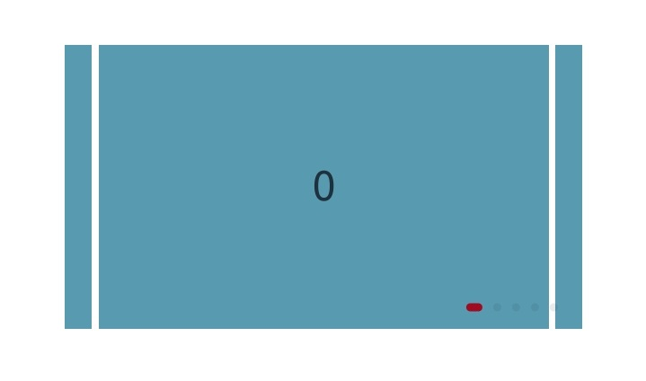

# Using the Swiper Container

<!--Kit: ArkUI-->
<!--Subsystem: ArkUI-->
<!--Owner: @Hu_ZeQi-->
<!--Designer: @fangzhiyuan1-->
<!--Tester: @Giacinta-->
<!--Adviser: @Brilliantry_Rui-->
<!-- md-trans-meta sourceCommit=d1e4d0c1349312557d4315ff2b1c5d57de74d862 translatedAt=2026-08-05T10:07:59.137Z pushedAt=2026-08-06T06:18:49.979Z -->

## Overview

The ArkUI development framework supports using the **Swiper** container in NDK APIs, providing the capability to display child components in a sliding carousel. This document introduces the development guide for NDK APIs. For the ArkTS guide, see [Creating a Swiper (Swiper)](arkts-layout-development-create-looping.md).

For building UIs using NDK APIs and basic NDK usage, refer to [Integrating with ArkTS Pages](ndk-access-the-arkts-page.md). After the page is built and the [Swiper is created](#creating-a-swiper), you can optimize the page display by [setting common attributes](#setting-common-attributes) and [setting the navigation indicator](#setting-the-navigation-indicator). When pages switch, you can obtain page switching information by [listening for events](#listening-for-events).

## Creating a Swiper

In this example, a UI component node of the ARKUI_NODE_SWIPER type is created by calling [createNode](../reference/apis-arkui/capi-arkui-nativemodule-arkui-nativenodeapi-1.md#createnode) for subsequent operations such as setting attributes. Multiple **Text** components are mounted under the **Swiper** component as content display through [addChild](../reference/apis-arkui/capi-arkui-nativemodule-arkui-nativenodeapi-1.md#addchild).

This example only shows the core function code. For the complete example, see the project <!--RP1-->[NDKSwiperSample](https://gitcode.com/openharmony/applications_app_samples/tree/master/code/DocsSample/ArkUISample/NDKSwiperSample)<!--RP1End-->.

<!-- @[swiper_create](https://gitcode.com/openharmony/applications_app_samples/blob/master/code/DocsSample/ArkUISample/NDKSwiperSample/entry/src/main/cpp/NativeEntry.cpp) -->

``` C++
ArkUI_NativeNodeAPI_1 *nodeApi = nullptr;
OH_ArkUI_GetModuleInterface(ARKUI_NATIVE_NODE, ArkUI_NativeNodeAPI_1, nodeApi);
ArkUI_NodeHandle swiper = nodeApi->createNode(ARKUI_NODE_SWIPER);
AddChild(swiper, nodeApi);
```

## Setting Common Attributes

This example adjusts the page display effect by setting attributes in [ArkUI_NodeAttributeType](../reference/apis-arkui/capi-native-node-h.md#arkui_nodeattributetype). The common attributes are as follows:

| Enum item | Description |
|---------|----------|
| NODE_HEIGHT_PERCENT  | Height percentage of the component. |
| NODE_WIDTH_PERCENT   | Width percentage of the component. |
| NODE_SWIPER_PREV_MARGIN   | Previous margin size, that is, the size of the previous item of the currently visible item displayed within the viewport. |
| NODE_SWIPER_NEXT_MARGIN   | Next margin size, that is, the size of the next item of the currently visible item displayed within the viewport. |
| NODE_SWIPER_ITEM_SPACE    | Display spacing between child items. |
| NODE_SWIPER_AUTO_PLAY     | Whether to enable auto-play. |

This example only shows the core function code. For the complete example, see the project <!--RP1-->[NDKSwiperSample](https://gitcode.com/openharmony/applications_app_samples/tree/master/code/DocsSample/ArkUISample/NDKSwiperSample)<!--RP1End-->.

<!-- @[swiper_attribute](https://gitcode.com/openharmony/applications_app_samples/blob/master/code/DocsSample/ArkUISample/NDKSwiperSample/entry/src/main/cpp/NativeEntry.cpp) -->

``` C++
// Set common attributes.
ArkUI_NumberValue value[] = {0};
ArkUI_AttributeItem item = {.value = value, .size = 1};
value[0].f32 = SWIPER_HEIGHT_PERCENT;
nodeApi->setAttribute(swiper, NODE_HEIGHT_PERCENT, &item);
value[0].f32 = SWIPER_WIDTH_PERCENT;
nodeApi->setAttribute(swiper, NODE_WIDTH_PERCENT, &item);

value[0].f32 = PREV_AND_NEXT_MARGIN;
nodeApi->setAttribute(swiper, NODE_SWIPER_PREV_MARGIN, &item);
nodeApi->setAttribute(swiper, NODE_SWIPER_NEXT_MARGIN, &item);
value[0].f32 = ITEM_SPACE;
nodeApi->setAttribute(swiper, NODE_SWIPER_ITEM_SPACE, &item);
value[0].i32 = 1;
nodeApi->setAttribute(swiper, NODE_SWIPER_AUTO_PLAY, &item);
```

## Setting the Navigation Indicator

In this example, a dot-type navigation indicator is created by [OH_ArkUI_SwiperIndicator_Create](../reference/apis-arkui/capi-swiper-h.md#oh_arkui_swiperindicator_create)(ARKUI_SWIPER_INDICATOR_TYPE_DOT), and the distance of the navigation indicator from the right edge of the **Swiper** component and the color of the selected dot are set through the [OH_ArkUI_SwiperIndicator_SetEndPosition](../reference/apis-arkui/capi-swiper-h.md#oh_arkui_swiperindicator_setendposition) and [OH_ArkUI_SwiperIndicator_SetSelectedColor](../reference/apis-arkui/capi-swiper-h.md#oh_arkui_swiperindicator_setselectedcolor) interfaces, respectively.

This example only shows the core function code. For the complete example, refer to the project <!--RP1-->[NDKSwiperSample](https://gitcode.com/openharmony/applications_app_samples/tree/master/code/DocsSample/ArkUISample/NDKSwiperSample)<!--RP1End-->.

<!-- @[indicator_attribute](https://gitcode.com/openharmony/applications_app_samples/blob/master/code/DocsSample/ArkUISample/NDKSwiperSample/entry/src/main/cpp/NativeEntry.cpp) -->

``` C++
// Set navigation indicator attributes.
ArkUI_SwiperIndicator *swiperIndicatorStyle = OH_ArkUI_SwiperIndicator_Create(ARKUI_SWIPER_INDICATOR_TYPE_DOT);
OH_ArkUI_SwiperIndicator_SetEndPosition(swiperIndicatorStyle, 0);
OH_ArkUI_SwiperIndicator_SetSelectedColor(swiperIndicatorStyle, INDICATOR_COLOR_SELECTED);

ArkUI_NumberValue value[] = {0};
ArkUI_AttributeItem item = {.value = value, .size = 1, .object = swiperIndicatorStyle};
value[0].i32 = ARKUI_SWIPER_INDICATOR_TYPE_DOT;
nodeApi->setAttribute(swiper, NODE_SWIPER_INDICATOR, &item);

OH_ArkUI_SwiperIndicator_Dispose(swiperIndicatorStyle);
```

The display effect is as follows.



## Listening for Events

In this example, the supported event types [ArkUI_NodeEventType](../reference/apis-arkui/capi-native-node-h.md#arkui_nodeeventtype) of the **Swiper** component are registered through [registerNodeEvent](../reference/apis-arkui/capi-arkui-nativemodule-arkui-nativenodeapi-1.md#registernodeevent). In the listener callback registered through [registerNodeEventReceiver](../reference/apis-arkui/capi-arkui-nativemodule-arkui-nativenodeapi-1.md#registernodeeventreceiver), you can determine the callback type and parse the corresponding callback content. The callbacks involved are as follows:

| Enum Item | Description |
|---------|----------|
| NODE_SWIPER_EVENT_ON_CHANGE  | Page index displayed after a switch. |
| NODE_SWIPER_EVENT_ON_ANIMATION_START   | Currently displayed page index when the page switching animation starts, or page index to switch to when the animation ends. |

This example only shows the core function code. For the complete example, see <!--RP1-->[NDKSwiperSample](https://gitcode.com/openharmony/applications_app_samples/tree/master/code/DocsSample/ArkUISample/NDKSwiperSample)<!--RP1End-->.

<!-- @[swiper_event](https://gitcode.com/openharmony/applications_app_samples/blob/master/code/DocsSample/ArkUISample/NDKSwiperSample/entry/src/main/cpp/NativeEntry.cpp) -->

``` C++
// Register page-switch event listener.
nodeApi->registerNodeEvent(swiper, NODE_SWIPER_EVENT_ON_CHANGE, 0, nullptr);
nodeApi->registerNodeEvent(swiper, NODE_SWIPER_EVENT_ON_ANIMATION_START, 1, nullptr);
nodeApi->registerNodeEventReceiver([](ArkUI_NodeEvent *event) {
    ArkUI_NodeEventType eventType = OH_ArkUI_NodeEvent_GetEventType(event);
    if (eventType == NODE_SWIPER_EVENT_ON_CHANGE) {
        auto componentEvent = OH_ArkUI_NodeEvent_GetNodeComponentEvent(event);
        if (componentEvent) {
            auto index = componentEvent->data[0].i32;
            OH_LOG_Print(LOG_APP, LOG_INFO, LOG_PRINT_DOMAIN, "NDKSwiper",
                         "NODE_SWIPER_EVENT_ON_CHANGE index = %{public}d", index);
        }
    }
    if (eventType == NODE_SWIPER_EVENT_ON_ANIMATION_START) {
        auto componentEvent = OH_ArkUI_NodeEvent_GetNodeComponentEvent(event);
        if (componentEvent) {
            auto currentIndex = componentEvent->data[0].i32;
            auto targetIndex = componentEvent->data[1].i32;
            OH_LOG_Print(LOG_APP, LOG_INFO, LOG_PRINT_DOMAIN, "NDKSwiper",
                         "NODE_SWIPER_EVENT_ON_ANIMATION_START currentIndex = %{public}d, targetIndex = %{public}d",
                         currentIndex, targetIndex);
        }
    }
});
```