# ForEach: Rendering Repeated Content

<!--Kit: ArkUI-->
<!--Subsystem: ArkUI-->
<!--Owner: @maorh-->
<!--Designer: @keerecles-->
<!--Tester: @TerryTsao-->
<!--Adviser: @zhang_yixin13-->
<!-- md-trans-meta sourceCommit=82cbd61bf5a97c687ddb974e4186cc744a8f06f2 translatedAt=2026-08-03T09:16:50.446Z pushedAt=2026-08-03T09:32:45.105Z -->

**ForEach** enables array-based rendering of repeated content. It must be used in a container component, and the component it returns must be one allowed inside the container component. For example, the [ListItem](../../reference/apis-arkui/arkui-ts/ts-container-listitem.md) component requires the parent container component of **ForEach** to be [List](../../reference/apis-arkui/arkui-ts/ts-container-list.md).

For details about API parameters, see [ForEach](../../reference/apis-arkui/arkui-ts/ts-rendering-control-foreach.md).

> **NOTE**
>
> This API can be used in ArkTS widgets since API version 9.

## Key Generation Rules

During **ForEach** rendering, the system generates a unique and persistent key for each array element to identify the corresponding component. When the key changes, the ArkUI framework considers that the array element has been replaced or modified and creates a component based on the new key.

**ForEach** provides a parameter named **keyGenerator**, which is a function that allows you to customize key generation rules. If no **keyGenerator** function is defined, the ArkUI framework uses the default key generation format **(item: Object, index: number) => { return index + '__' + JSON.stringify(item); }**.

The ArkUI framework follows specific rules for key generation in **ForEach**, which are primarily related to the **itemGenerator** function and the second parameter **index** of the **keyGenerator** function. The specific key generation rule judgment logic is shown in the following figure.

**Figure 1** ForEach key generation rules 
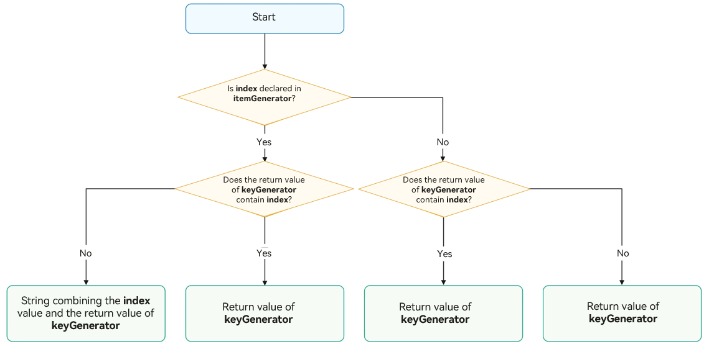

> **NOTE**
>
> 1. The ArkUI framework issues runtime warnings for duplicate keys. If duplicate keys exist during UI re-rendering, the framework may not work properly. For details, see [Unexpected Rendering Results](#unexpected-rendering-results).
> 2. Do not use the data item **index** as the key, as this can cause [unexpected rendering results](#unexpected-rendering-results) and [reduced rendering performance](#reduced-rendering-performance).
> 3. If the **index** parameter is declared in the **itemGenerator** function but omitted from the **keyGenerator** function, the framework automatically appends the index to the **keyGenerator** function's return value to form the final key. This behavior can lead to the duplicate key issues described previously. To avoid this issue, ensure the **index** parameter is explicitly declared in the **keyGenerator** function.

Key value generation example:

```ts
interface ChildItemType {
  str: string;
  num: number;
}

@Entry
@Component
struct Index {
  @State simpleList: Array<ChildItemType> = [
    { str: 'one', num: 1 },
    { str: 'two', num: 2 },
    { str: 'three', num: 3 }
  ];

  build() {
    Row() {
      Column() {
        ForEach(this.simpleList, (item: ChildItemType, index: number) => {
          ChildItem({ str: item.str, num: index }) // Use the index parameter in the component generation function.
        }, (item: ChildItemType, index: number) => {
          return item.str; // It is recommended that the UI-related data property str be used in the key generation function.
        })
      }
      .width('100%')
      .height('100%')
    }
    .height('100%')
    .backgroundColor(0xF1F3F5)
  }
}

@Component
struct ChildItem {
  @Prop str: string = '';
  @Prop num: number = 0;

  build() {
    Text(this.str)
      .fontSize(50)
  }
}
```

In the preceding example, when the component generation function declares **index**, you are advised to do the same thing in the key generation function to avoid reduced rendering performance and unexpected rendering results. In addition, it is recommended that you use UI-related data attributes in the key generation function. In this example, the data attribute **str** is related to the UI display, so you can use **str** as the return value of the key generation function.

## Component Creation Rules

After the key generation rules are determined, the **itemGenerator** function – the second parameter in **ForEach** – creates a component for each array item of the data source based on the rules. Component creation involves two scenarios: [initial rendering](#initial-rendering) and [non-initial rendering](#non-initial-rendering).

### Initial Rendering

When used for initial rendering, **ForEach** generates a unique key for each array item of the data source based on the key generation rules, and creates a component.

<!-- @[foreach_one](https://gitcode.com/openharmony/applications_app_samples/blob/master/code/DocsSample/ArkUISample/RenderingControl/entry/src/main/ets/pages/RenderingForeach/ForEach1.ets) -->

``` TypeScript
@Entry
@Component
struct ForEachFirstRender {
  @State simpleList: Array<string> = ['one', 'two', 'three'];

  build() {
    Row() {
      Column() {
        ForEach(this.simpleList, (item: string) => {
          ForEachChildItem({ item: item })
        }, (item: string) => item) // Ensure that the key is unique.
      }
      .width('100%')
      .height('100%')
    }
    .height('100%')
    .backgroundColor(0xF1F3F5)
  }
}

@Component
struct ForEachChildItem {
  @Prop item: string;

  build() {
    Text(this.item)
      .fontSize(50)
  }
}
```

The figure below shows the effect.

**Figure 2** Initial rendering result for the ForEach data items without duplicate keys 


In the preceding code, the return value of the **keyGenerator** function is **item**. During **ForEach** rendering, keys (**one**, **two**, and **three**) are generated in sequence for the array items, and the corresponding **ForEachChildItem** components are created and rendered to the UI.

When the keys generated for different array items are the same, the behavior of the framework is undefined. For example, in the following code, when data items with the same key **two** are rendered by **ForEach**, only one **SameKeyChildItem** component, instead of multiple components with the same key, is created.

<!-- @[foreach_two](https://gitcode.com/openharmony/applications_app_samples/blob/master/code/DocsSample/ArkUISample/RenderingControl/entry/src/main/ets/pages/RenderingForeach/ForEach2.ets) -->

``` TypeScript
@Entry
@Component
struct ForEachSameKey {
  @State simpleList: Array<string> = ['one', 'two', 'two', 'three'];

  build() {
    Row() {
      Column() {
        ForEach(this.simpleList, (item: string) => {
          SameKeyChildItem({ item: item })
        }, (item: string) => item)
      }
      .width('100%')
      .height('100%')
    }
    .height('100%')
    .backgroundColor(0xF1F3F5)
  }
}

@Component
struct SameKeyChildItem {
  @Prop item: string;

  build() {
    Text(this.item)
      .fontSize(50)
  }
}
```

The figure below shows the effect.

**Figure 3** Initial rendering result for the ForEach data source with duplicate keys 


In this example, the final key value generation rule is **item**. When **ForEach** iterates over the data source **simpleList**, it creates a component with the key **two** and records it when it encounters the **two** at index 1. When it encounters the **two** at index 2, as the key for the current item is also **two**, no new component is created.

### Non-Initial Rendering

When **ForEach** is used for re-rendering (non-initial rendering), it checks whether the newly generated key already exists in the previous rendering. If the key does not exist, a new component is created. If the key exists, no new component is created, and the component corresponding to the key is re-rendered. For example, in the following code snippet, changing the value of the array's third item to **"new three"** through clicking triggers non-initial rendering by **ForEach**.

<!-- @[foreach_three](https://gitcode.com/openharmony/applications_app_samples/blob/master/code/DocsSample/ArkUISample/RenderingControl/entry/src/main/ets/pages/RenderingForeach/ForEach3.ets) -->

``` TypeScript
@Entry
@Component
struct ForEachNotFirstRender {
  @State simpleList: Array<string> = ['one', 'two', 'three'];

  build() {
    Row() {
      Column() {
        Text('Click to change the value of the third array item')
          .fontSize(24)
          .fontColor(Color.Red)
          .onClick(() => {
            this.simpleList[2] = 'new three';
          })

        ForEach(this.simpleList, (item: string) => {
          NotFirstRenderChildItem({ item: item })
            .margin({ top: 20 })
        }, (item: string) => item)
      }
      .justifyContent(FlexAlign.Center)
      .width('100%')
      .height('100%')
    }
    .height('100%')
    .backgroundColor(0xF1F3F5)
  }
}

@Component
struct NotFirstRenderChildItem {
  @Prop item: string;

  build() {
    Text(this.item)
      .fontSize(30)
  }
}
```

The figure below shows the effect.

**Figure 4** Re-rendering with ForEach 


This example demonstrates that [\@State](../state-management/arkts-state.md) can observe changes to the items of a primitive data type array, such as **simpleList**.

1. When any item in **simpleList** changes, **ForEach** is triggered for re-rendering.

2. **ForEach** iterates through the new data source **['one', 'two', 'new three']** and generates the corresponding keys **one**, **two**, and **new three**.

3. For keys **one** and **two** that exist in the previous rendering, **ForEach** reuses the corresponding components and re-renders them. For the third array item **"new three"**, since its generated key **new three** does not exist in the previous rendering, **ForEach** creates a component for it.

## Use Cases

**ForEach** is typically used in several cases: [static data source](#static-data-source), [changes of data source array items](#changes-of-data-source-array-items) (for example, insertions or deletions), and [property changes in data source array items](#property-changes-in-data-source-array-items).

### Static Data Source

If the data source remains unchanged, it can be of a primitive data type. For example, when implementing loading states, you can render skeleton screens using a static list.

<!-- @[article_skeleton_view](https://gitcode.com/openharmony/applications_app_samples/blob/master/code/DocsSample/ArkUISample/RenderingControl/entry/src/main/ets/pages/RenderingForeach/ArticleSkeletonView.ets) -->

``` TypeScript
@Entry
@Component
struct ArticleList {
  @State simpleList: Array<number> = [1, 2, 3, 4, 5];

  build() {
    Column() {
      ForEach(this.simpleList, (item: number) => {
        ArticleSkeletonView()
          .margin({ top: 20 })
      }, (item: number) => item.toString())
    }
    .padding(20)
    .width('100%')
    .height('100%')
  }
}

@Builder
function textArea(width: number | Resource | string = '100%', height: number | Resource | string = '100%') {
  Row()
    .width(width)
    .height(height)
    .backgroundColor('#FFF2F3F4')
}

@Component
struct ArticleSkeletonView {
  build() {
    Row() {
      Column() {
        textArea(80, 80)
      }
      .margin({ right: 20 })

      Column() {
        textArea('60%', 20)
        textArea('50%', 20)
      }
      .alignItems(HorizontalAlign.Start)
      .justifyContent(FlexAlign.SpaceAround)
      .height('100%')
    }
    .padding(20)
    .borderRadius(12)
    .backgroundColor('#FFECECEC')
    .height(120)
    .width('100%')
    .justifyContent(FlexAlign.SpaceBetween)
  }
}
```

The figure below shows the effect.

**Figure 5** Skeleton screen 


In this example, the data item is used as the key generation rule. Because the array items of the data source **simpleList** are different, the uniqueness of the keys can be ensured.

### Changes of Data Source Array Items

If data source array item changes, for example, when an array item is inserted or deleted, or has its index changed, the data source should be of the object array type, and a unique ID of the object is used as the key.

<!-- @[article_list_view_one](https://gitcode.com/openharmony/applications_app_samples/blob/master/code/DocsSample/ArkUISample/RenderingControl/entry/src/main/ets/pages/RenderingForeach/ArticleListView.ets) -->

``` TypeScript
class ArticleChangeSource {
  public id: string;
  public title: string;
  public brief: string;

  constructor(id: string, title: string, brief: string) {
    this.id = id;
    this.title = title;
    this.brief = brief;
  }
}

@Entry
@Component
struct ArticleListViewChangeSource {
  isListReachEnd: boolean = false;
  @State articleList: Array<ArticleChangeSource> = [
    new ArticleChangeSource('001', 'Article 1', 'Abstract'),
    new ArticleChangeSource('002', 'Article 2', 'Abstract'),
    new ArticleChangeSource('003', 'Article 3', 'Abstract'),
    new ArticleChangeSource('004', 'Article 4', 'Abstract'),
    new ArticleChangeSource('005', 'Article 5', 'Abstract'),
    new ArticleChangeSource('006', 'Article 6', 'Abstract')
  ];

  loadMoreArticles() {
    this.articleList.push(new ArticleChangeSource('007', 'New Article', 'Abstract'));
  }

  build() {
    Column({ space: 5 }) {
      List() {
        ForEach(this.articleList, (item: ArticleChangeSource) => {
          ListItem() {
            ArticleCardChangeSource({ article: item })
              .margin({ top: 20 })
          }
        }, (item: ArticleChangeSource) => item.id)
      }
      .onReachEnd(() => {
        this.isListReachEnd = true;
      })
      .parallelGesture(
        PanGesture({ direction: PanDirection.Up, distance: 80 })
          .onActionStart(() => {
            if (this.isListReachEnd) {
              this.loadMoreArticles();
              this.isListReachEnd = false;
            }
          })
      )
      .padding(20)
      .scrollBar(BarState.Off)
    }
    .width('100%')
    .height('100%')
    .backgroundColor(0xF1F3F5)
  }
}

@Component
struct ArticleCardChangeSource {
  @Prop article: ArticleChangeSource;

  build() {
    Row() {
      // 'app.media.startIcon' is only an example. Replace it with the actual value. Otherwise, the image source fails to be created and subsequent operations cannot be performed.
      Image($r('app.media.startIcon'))
        .width(80)
        .height(80)
        .margin({ right: 20 })

      Column() {
        Text(this.article.title)
          .fontSize(20)
          .margin({ bottom: 8 })
        Text(this.article.brief)
          .fontSize(16)
          .fontColor(Color.Gray)
          .margin({ bottom: 8 })
      }
      .alignItems(HorizontalAlign.Start)
      .width('80%')
      .height('100%')
    }
    .padding(20)
    .borderRadius(12)
    .backgroundColor('#FFECECEC')
    .height(120)
    .width('100%')
    .justifyContent(FlexAlign.SpaceBetween)
  }
}
```

The following figure shows the initial screen (on the left) and the screen after a pull-to-refresh gesture (on the right).

**Figure 6** Effect when the data source is changed 
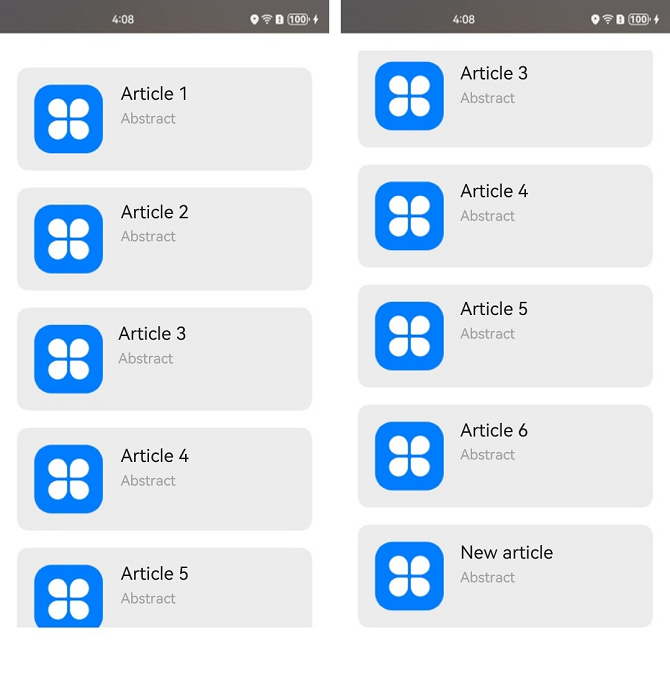

In this example, the **ArticleCardChangeSource** component serves as a child component of the **ArticleListViewChangeSource** component and receives an **ArticleChangeSource** object through the [\@Prop](../state-management/arkts-prop.md) decorator to render article cards.

1. When the list scrolls to the bottom with a swipe distance exceeding 80 vp, the **loadMoreArticles()** function is invoked. This function appends new elements to the **articleList** data source, increasing its length.

2. Because the data source is decorated by @State, the ArkUI framework can detect changes in the data source length and trigger **ForEach** for re-rendering.

### Property Changes in Data Source Array Items

When the items in the data source decorated with @State are of a complex data type (for example, objects), the ArkUI framework cannot detect changes to the properties of the items in the data source. As a result, modifying certain properties of the items will not trigger re-rendering of **ForEach**. To re-render the **ForEach** child component, you need to use the [\@Observed and \@ObjectLink](../state-management/arkts-observed-and-objectlink.md) decorators. The following example illustrates a typical use case, where clicking the like icon on an article card updates the like count of the article.

<!-- @[article_list_view_two](https://gitcode.com/openharmony/applications_app_samples/blob/master/code/DocsSample/ArkUISample/RenderingControl/entry/src/main/ets/pages/RenderingForeach/ArticleListView2.ets) -->

``` TypeScript
@Observed
class ArticleChangeChild {
  public id: string;
  public title: string;
  public brief: string;
  public isLiked: boolean;
  public likesCount: number;

  constructor(id: string, title: string, brief: string, isLiked: boolean, likesCount: number) {
    this.id = id;
    this.title = title;
    this.brief = brief;
    this.isLiked = isLiked;
    this.likesCount = likesCount;
  }
}

@Entry
@Component
struct ArticleListChangeView {
  @State articleList: Array<ArticleChangeChild> = [
    new ArticleChangeChild('001', 'Article 0', 'Abstract', false, 100),
    new ArticleChangeChild('002', 'Article 1', 'Abstract', false, 100),
    new ArticleChangeChild('003', 'Article 2', 'Abstract', false, 100),
    new ArticleChangeChild('004', 'Article 4', 'Abstract', false, 100),
    new ArticleChangeChild('005', 'Article 5', 'Abstract', false, 100),
    new ArticleChangeChild('006', 'Article 6', 'Abstract', false, 100),
  ];

  build() {
    List() {
      ForEach(this.articleList, (item: ArticleChangeChild) => {
        ListItem() {
          ArticleCardChangeChild({
            article: item
          })
            .margin({ top: 20 })
        }
      }, (item: ArticleChangeChild) => item.id)
    }
    .padding(20)
    .scrollBar(BarState.Off)
    .backgroundColor(0xF1F3F5)
  }
}

@Component
struct ArticleCardChangeChild {
  @ObjectLink article: ArticleChangeChild;

  handleLiked() {
    this.article.isLiked = !this.article.isLiked;
    this.article.likesCount = this.article.isLiked ? this.article.likesCount + 1 : this.article.likesCount - 1;
  }

  build() {
    Row() {
      // 'app.media.startIcon' is only an example. Replace it with the actual value. Otherwise, the image source fails to be created and subsequent operations cannot be performed.
      Image($r('app.media.startIcon'))
        .width(80)
        .height(80)
        .margin({ right: 20 })

      Column() {
        Text(this.article.title)
          .fontSize(20)
          .margin({ bottom: 8 })
        Text(this.article.brief)
          .fontSize(16)
          .fontColor(Color.Gray)
          .margin({ bottom: 8 })

        Row() {
          // Here 'app.media.iconLiked' and 'app.media.iconUnLiked' are only examples. Replace them with your own resources. Otherwise, failure to create the imageSource will cause subsequent operations to fail.
          Image(this.article.isLiked ? $r('app.media.iconLiked') : $r('app.media.iconUnLiked'))
            .width(24)
            .height(24)
            .margin({ right: 8 })
          Text(this.article.likesCount.toString())
            .fontSize(16)
        }
        .onClick(() => this.handleLiked())
        .justifyContent(FlexAlign.Center)
      }
      .alignItems(HorizontalAlign.Start)
      .width('80%')
      .height('100%')
    }
    .padding(20)
    .borderRadius(12)
    .backgroundColor('#FFECECEC')
    .height(120)
    .width('100%')
    .justifyContent(FlexAlign.SpaceBetween)
  }
}
```

The following figure shows the initial screen (on the left) and the screen after the like icon of Article 1 is clicked (on the right).

**Figure 7** Effect when properties of data source array items are changed 
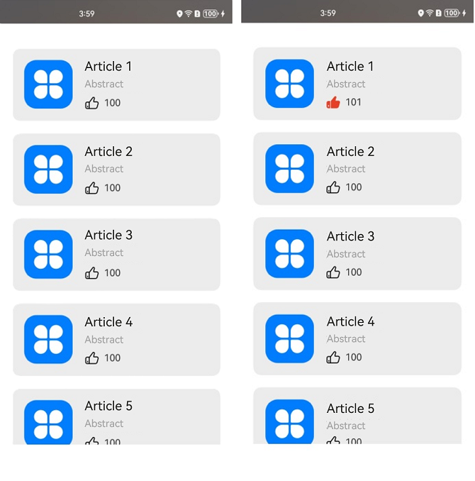

In this example, the **ArticleChangeChild** class is decorated by the @Observed decorator. The parent component **ArticleListChangeView** passes an **ArticleChangeChild** instance to the child component **ArticleCardChangeChild**, which receives the instance using the @ObjectLink decorator.

1. When the like icon of **Article 1** is clicked, the **handleLiked** function of the **ArticleCardChangeChild** component is triggered. This function changes the values of the **isLiked** and **likesCount** properties of the **ArticleChangeChild** instance in the component pertaining to **Article 1**.

2. The **ArticleChangeChild** instance is an @ObjectLink decorated state variable. Changes to its property values trigger the re-rendering of the **ArticleCardChangeChild** component, which then reads the new values of **isLiked** and **likesCount**.

### Drag-and-Drop Sorting

By using **ForEach** within a **List** component and setting up the [onMove](../../reference/apis-arkui/arkui-ts/ts-universal-attributes-drag-sorting.md#onmove) event, you can implement drag-and-drop sorting. When the drag-and-drop gesture is released, if any component's position changes, the **onMove** event is triggered, which reports the original index and target index of the relocated component. In the **onMove** event, the data source must be updated based on the reported start index and target index. Before and after the data source is modified, the key value of each item must remain unchanged to ensure that the drop animation can be executed properly.

<!-- @[foreach_sort](https://gitcode.com/openharmony/applications_app_samples/blob/master/code/DocsSample/ArkUISample/RenderingControl/entry/src/main/ets/pages/RenderingForeach/ForEachSort.ets) -->

``` TypeScript
@Entry
@Component
struct ForEachSort {
  @State arr: Array<string> = [];

  build() {
    Column() {
      // Clicking this button triggers re-rendering of ForEach.
      Button('Add one item')
        .onClick(() => {
          this.arr.push('10');
        })
        .width(300)
        .margin(10)

      List() {
        ForEach(this.arr, (item: string) => {
          ListItem() {
            Text(item.toString())
              .fontSize(16)
              .textAlign(TextAlign.Center)
              .size({ height: 100, width: '100%' })
          }.margin(10)
          .borderRadius(10)
          .backgroundColor('#FFFFFFFF')
        }, (item: string) => item)
          .onMove((from: number, to: number) => {
            // The following two lines ensure that the order of components on the screen matches the order of items in the array arr.
            // If these lines are commented out, after the first drag-and-drop sorting and subsequent addition of an item to the end of arr, the on-screen component order will align with the arr item sequence—rather than the order established by the initial drag-and-drop. This results in the loss of drag-and-drop sorting after re-rendering.
            let tmp = this.arr.splice(from, 1);
            this.arr.splice(to, 0, tmp[0]);
          })
      }
      .width('100%')
      .height('100%')
      .backgroundColor('#FFDCDCDC')
    }
  }

  aboutToAppear(): void {
    for (let i = 0; i < 10; i++) {
      this.arr.push(i.toString());
    }
  }
}
```

**Figure 8** Effect of ForEach drag-and-drop sorting 
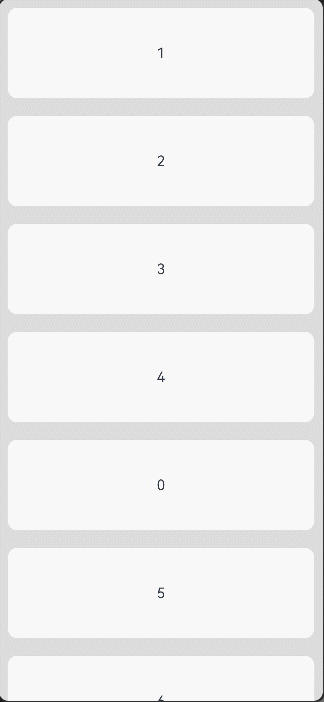  

If the two lines in the **onMove** event handler are commented out, the effect of clicking **Add one item** and triggering re-rendering is shown in the following figure. 

**Figure 9** ForEach drag-and-drop sorting effect not preserved after re-rendering 
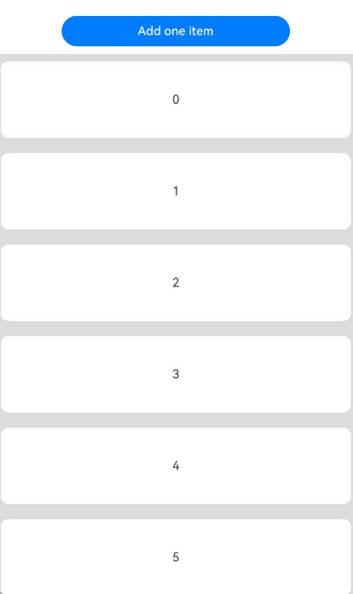

## Recommendations

- To ensure key uniqueness for object data, use a unique **id** property from the object data as the key.

- Do not use the data item **index** as the key, as this can cause [unexpected rendering results](#unexpected-rendering-results) and [reduced rendering performance](#reduced-rendering-performance). If **index** must be used (for example, for conditional rendering based on **index**), be aware that data source changes will cause **ForEach** to re-create components, incurring a performance cost.

- For arrays of primitive data types, which do not have a unique ID property: If using the data item itself as the key, ensure that no duplicate values exist. For mutable data sources, convert the array to objects with unique ID properties, then use the ID as the key.

- The **index** parameter serves as a fallback to ensure key uniqueness. When modifying a data item, since the **item** parameter in **itemGenerator** is immutable, use **index** to update the data source and trigger UI re-rendering.

- Within [List](../../reference/apis-arkui/arkui-ts/ts-container-list.md), [Grid](../../reference/apis-arkui/arkui-ts/ts-container-grid.md), [Swiper](../../reference/apis-arkui/arkui-ts/ts-container-swiper.md), and [WaterFlow](../../reference/apis-arkui/arkui-ts/ts-container-waterflow.md) scrollable containers, avoid using **ForEach** together with [LazyForEach](./arkts-rendering-control-lazyforeach.md).

- When dealing with a large number of child components, **ForEach** can lead to performance issues such as lag or jank. In such cases, consider using [LazyForEach](./arkts-rendering-control-lazyforeach.md) instead. For details about the best practice, see [Performance Optimization Using LazyForEach](https://developer.huawei.com/consumer/en/doc/best-practices/bpta-lazyforeach-optimization).

- When array items are objects, do not replace old items with new objects of the same content. If an item changes but the key remains the same, the framework may not detect the change, leading to [unrendered data updates](#data-changes-failing-to-trigger-rendering).

## Common Pitfalls

Incorrect usage of **ForEach** keys can lead to functional and performance issues, causing unexpected rendering behavior. For detailed examples, see [Unexpected Rendering Results](#unexpected-rendering-results) and [Reduced Rendering Performance](#reduced-rendering-performance).

### Unexpected Rendering Results

In this example, the **KeyGenerator** function, which is the third parameter of **ForEach**, is set to use the string-type **index** property of the data source as the key generation rule. When the **Insert Item After First Item** text component in the parent component **ForEachAbnormal** is clicked, an unexpected result is displayed.

<!-- @[foreach_abnormal](https://gitcode.com/openharmony/applications_app_samples/blob/master/code/DocsSample/ArkUISample/RenderingControl/entry/src/main/ets/pages/RenderingForeach/AbnormalExample.ets) -->

``` TypeScript
@Entry
@Component
struct ForEachAbnormal {
  @State simpleList: Array<string> = ['one', 'two', 'three'];

  build() {
    Column() {
      Button() {
        Text('Insert Item After First Item').fontSize(30)
      }
      .onClick(() => {
        this.simpleList.splice(1, 0, 'new item');
      })

      ForEach(this.simpleList, (item: string) => {
        ForEachAbnormalChildItem({ item: item })
      }, (item: string, index: number) => index.toString())
    }
    .justifyContent(FlexAlign.Center)
    .width('100%')
    .height('100%')
    .backgroundColor(0xF1F3F5)
  }
}

@Component
struct ForEachAbnormalChildItem {
  @Prop item: string;

  build() {
    Text(this.item)
      .fontSize(30)
  }
}
```

The following figure shows the initial screen and the screen after **Insert Item After First Item** is clicked.

**Figure 10** Unexpected rendering result 
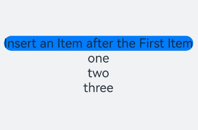

When **ForEach** is used for initial rendering, the created keys are **0**, **1**, and **2** in sequence.

After a new item is inserted, the data source **simpleList** changes to ['one','new item', 'two', 'three']. The ArkUI framework detects changes in the length of the @State decorated data source and triggers **ForEach** for re-rendering.

**ForEach** traverses items in the new data source. When it reaches array item **one**, it generates key **0** for the item, and because the same key already exists, no new component is created. When **ForEach** reaches array item **new item**, it generates key **1** for the item, and because the same key already exists, no new component is created. When **ForEach** reaches array item **two**, it generates key **2** for the item, and because the same key already exists, no new component is created. When **ForEach** reaches array item **three**, it generates key **3** for the item, and because no same key exists, a new component **three** is created.

In the preceding example, the final key generation rule includes **index**. While the expected rendering result is **['one','new item', 'two', 'three']**, the actual rendering result is **['one', 'two', 'three', 'three']**. Therefore, to avoid unexpected rendering results, avoid using index-based keys for **ForEach**.

### Reduced Rendering Performance

In this example, the **KeyGenerator** function, which is the third parameter of **ForEach**, is omitted. According to the description in [Key Generation Rules](#key-generation-rules), the framework uses the default key format **index + '__' + JSON.stringify(item)**. Clicking the **Insert Item After First Item** button triggers component re-creation for the second array item and all subsequent items.

<!-- @[bad_performance](https://gitcode.com/openharmony/applications_app_samples/blob/master/code/DocsSample/ArkUISample/RenderingControl/entry/src/main/ets/pages/RenderingForeach/BadPerformance.ets) -->

``` TypeScript
import { hilog } from '@kit.PerformanceAnalysisKit';
const TAG = '[Sample_RenderingControl]';
const DOMAIN = 0xF811;

@Entry
@Component
struct ReducedRenderingPerformance {
  @State simpleList: Array<string> = ['one', 'two', 'three'];

  build() {
    Column() {
      Button() {
        Text('Insert Item After First Item').fontSize(30)
      }
      .onClick(() => {
        this.simpleList.splice(1, 0, 'new item');
        hilog.info(DOMAIN, 'testTag', `[onClick]: simpleList is [${this.simpleList.join(', ')}]`);
      })

      ForEach(this.simpleList, (item: string) => {
        ReducedChildItem({ item: item })
      })
    }
    .justifyContent(FlexAlign.Center)
    .width('100%')
    .height('100%')
    .backgroundColor(0xF1F3F5)
  }
}

@Component
struct ReducedChildItem {
  @Prop item: string;

  aboutToAppear() {
    hilog.info(DOMAIN, TAG, `[aboutToAppear]: item is ${this.item}`);
  }

  build() {
    Text(this.item)
      .fontSize(50)
  }
}
```

The following figure shows the initial screen and the screen after **Insert Item After First Item** is clicked.

**Figure 11** Reduced rendering performance 
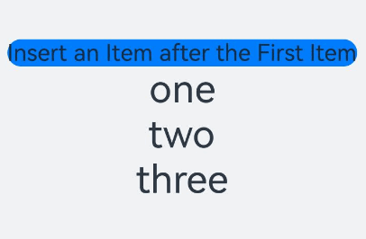

After **Insert Item After First Item** is clicked, DevEco Studio displays logs as shown in the figure below.

**Figure 12** Logs indicating reduced rendering performance 
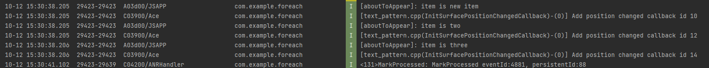

After a new item is inserted, **ForEach** creates the corresponding **ReducedChildItem** components for the **new item**, **two**, and **three** array items, and executes the [aboutToAppear()](../../reference/apis-arkui/arkui-ts/ts-custom-component-lifecycle.md#abouttoappear) callback. Here are the reasons:

1. During initial rendering, **ForEach** generates keys **0__one**, **1__two**, and **2__three**.

2. After a new item is inserted, the data source **simpleList** changes to ['one','new item', 'two', 'three']. The ArkUI framework detects changes in the length of the @State decorated data source and triggers **ForEach** for re-rendering.

3. **ForEach** traverses items in the new data source. When it reaches array item **one**, it generates key **0__one** for the item, and because the same key already exists, no new component is created. When **ForEach** reaches array item **new item**, it generates key **1__new item** for the item, and because no same key exists, a new component **new item** is created. When **ForEach** reaches array item **two**, it generates key **2__two** for the item, and because no same key exists, a new component **two** is created. When **ForEach** reaches array item **three**, it generates key **3__three** for the item, and because no same key exists, a new component **three** is created.

Although the UI rendering results in this example meet expectations, **ForEach** will re-create components for the inserted item and all subsequent items every time a new item is inserted into the middle of the array. When the data source is large or components are complex, this inability to reuse components leads to performance degradation. Therefore, avoid omitting the third parameter (**KeyGenerator**) and do not use the data index (**index**) as the key.

The correct way to use **ForEach** for optimal rendering and efficiency is as follows:

<!-- @[foreach_true](https://gitcode.com/openharmony/applications_app_samples/blob/master/code/DocsSample/ArkUISample/RenderingControl/entry/src/main/ets/pages/RenderingForeach/ForEach1.ets) -->

``` TypeScript
ForEach(this.simpleList, (item: string) => {
  ForEachChildItem({ item: item })
}, (item: string) => item) // Ensure that the key is unique.
```

With the use of **KeyGenerator** function, different keys are generated for different data items of the data source, and the same key is generated for the same data item each time.

### Data Changes Failing to Trigger Rendering

When the **Like/Unlike first article** button is clicked, the first component toggles the like gesture and updates the like count. However, if the **Replace first article** button is clicked first, the **Like/Unlike first article** button does not take effect. The reason is that replacing **articleList[0]** changes the state variable **articleList**, triggering re-rendering of **ForEach**. However, since the key for the new articleList[0] remains unchanged, **ForEach** does not update the data to the child component. As a result, the first component remains bound to the old **articleList[0]**. When the property of the new **articleList[0]** is changed, the first component cannot detect the change and does not trigger re-rendering. Clicking the like icon can trigger rendering because the component detects the property change of the bound array item and re-renders.

<!-- @[article_list_view_three](https://gitcode.com/openharmony/applications_app_samples/blob/master/code/DocsSample/ArkUISample/RenderingControl/entry/src/main/ets/pages/RenderingForeach/ArticleListView3.ets) -->

``` TypeScript
@Observed
class ArticleChangeData {
  public id: string;
  public title: string;
  public brief: string;
  public isLiked: boolean;
  public likesCount: number;

  constructor(id: string, title: string, brief: string, isLiked: boolean, likesCount: number) {
    this.id = id;
    this.title = title;
    this.brief = brief;
    this.isLiked = isLiked;
    this.likesCount = likesCount;
  }
}

@Entry
@Component
struct ArticleListChangeData {
  @State articleList: Array<ArticleChangeData> = [
    new ArticleChangeData('001', 'Article 0', 'Abstract', false, 100),
    new ArticleChangeData('002', 'Article 1', 'Abstract', false, 100),
    new ArticleChangeData('003', 'Article 2', 'Abstract', false, 100),
    new ArticleChangeData('004', 'Article 4', 'Abstract', false, 100),
    new ArticleChangeData('005', 'Article 5', 'Abstract', false, 100),
    new ArticleChangeData('006', 'Article 6', 'Abstract', false, 100),
  ];

  build() {
    Column() {
      Button('Replace first article')
        .onClick(() => {
          this.articleList[0] = new ArticleChangeData('001', 'Article 0', 'Abstract', false, 100);
        })
        .width(300)
        .margin(10)

      Button('Like/Unlike first article')
        .onClick(() => {
          this.articleList[0].isLiked = !this.articleList[0].isLiked;
          this.articleList[0].likesCount =
            this.articleList[0].isLiked ? this.articleList[0].likesCount + 1 : this.articleList[0].likesCount - 1;
        })
        .width(300)
        .margin(10)

      List() {
        ForEach(this.articleList, (item: ArticleChangeData) => {
          ListItem() {
            ArticleCardChangeData({
              article: item
            })
              .margin({ top: 20 })
          }
        }, (item: ArticleChangeData) => item.id)
      }
      .padding(20)
      .scrollBar(BarState.Off)
      .backgroundColor(0xF1F3F5)
    }
  }
}

@Component
struct ArticleCardChangeData {
  @ObjectLink article: ArticleChangeData;

  handleLiked() {
    this.article.isLiked = !this.article.isLiked;
    this.article.likesCount = this.article.isLiked ? this.article.likesCount + 1 : this.article.likesCount - 1;
  }

  build() {
    Row() {
      // 'app.media.startIcon' is only an example. Replace it with the actual value. Otherwise, the image source fails to be created and subsequent operations cannot be performed.
      Image($r('app.media.startIcon'))
        .width(80)
        .height(80)
        .margin({ right: 20 })

      Column() {
        Text(this.article.title)
          .fontSize(20)
          .margin({ bottom: 8 })
        Text(this.article.brief)
          .fontSize(16)
          .fontColor(Color.Gray)
          .margin({ bottom: 8 })

        Row() {
          // 'app.media.iconLiked' and 'app.media.iconUnLiked' are examples only. Replace them with your own resources. Otherwise, imageSource creation failure will prevent subsequent normal execution.
          Image(this.article.isLiked ? $r('app.media.iconLiked') : $r('app.media.iconUnLiked'))
            .width(24)
            .height(24)
            .margin({ right: 8 })
          Text(this.article.likesCount.toString())
            .fontSize(16)
        }
        .onClick(() => this.handleLiked())
        .justifyContent(FlexAlign.Center)
      }
      .alignItems(HorizontalAlign.Start)
      .width('80%')
      .height('100%')
    }
    .padding(20)
    .borderRadius(12)
    .backgroundColor('#FFECECEC')
    .height(120)
    .width('100%')
    .justifyContent(FlexAlign.SpaceBetween)
  }
}
```

**Figure 13** Data changes failing to trigger rendering 
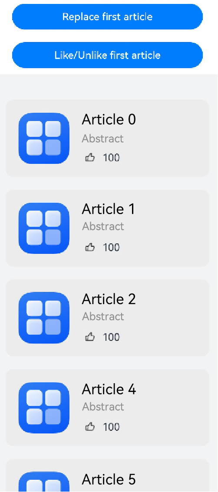

### Unnecessary Memory Consumption

If no **keyGenerator** function is defined, the ArkUI framework uses the default key generation format **(item: Object, index: number) => { return index + '__' + JSON.stringify(item); }**. When **item** is a complex object, serializing it to a JSON string results in a long string that consumes more memory.

<!-- @[non_necessary_mem](https://gitcode.com/openharmony/applications_app_samples/blob/master/code/DocsSample/ArkUISample/RenderingControl/entry/src/main/ets/pages/RenderingForeach/NonNecessaryMem.ets) -->

``` TypeScript
class MemoryData {
  public longStr: string;
  public key: string;

  constructor(longStr: string, key: string) {
    this.longStr = longStr;
    this.key = key;
  }
}

@Entry
@Component
struct NonNecessaryMemory {
  @State simpleList: Array<MemoryData> = [];

  aboutToAppear(): void {
    let longStr = '';
    for (let i = 0; i < 2000; i++) {
      longStr += i.toString();
    }
    for (let index = 0; index < 3000; index++) {
      let data: MemoryData = new MemoryData(longStr, 'a' + index.toString());
      this.simpleList.push(data);
    }
  }

  build() {
    List() {
      ForEach(this.simpleList, (item: MemoryData) => {
        ListItem() {
          Text(item.key)
        }
      }
        // If the keyGenerator function is not defined, the ArkUI framework uses the default key value generation function.
        , (item: MemoryData) => {
          return item.key;
        }
      )
    }.height('100%')
    .width('100%')
  }
}
```

A comparison of memory usage (which can be obtained using Realtime Monitor in the Profiler of DevEco Studio) between the default and custom **keyGenerator** implementations shows a reduction of approximately 70 MB when a custom function is used. 

**Figure 14** Memory usage with default key generation 
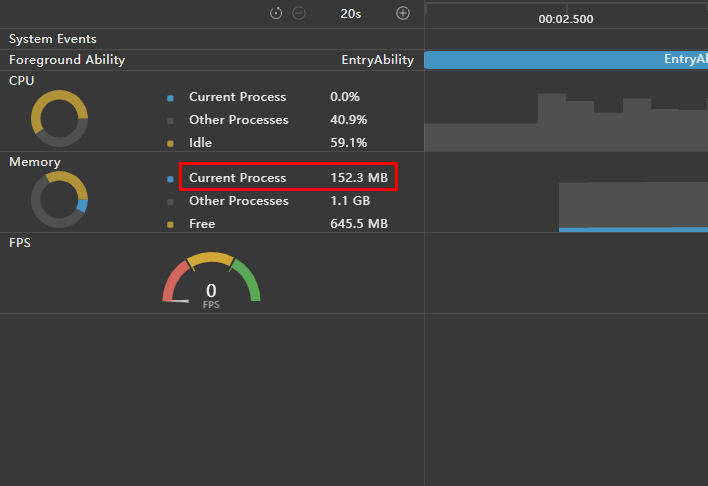

**Figure 15** Memory usage with custom key generation 
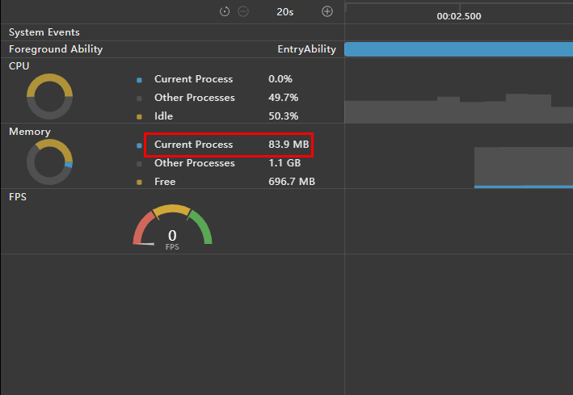

### Key Generation Failure

If no **keyGenerator** function is defined, the ArkUI framework uses the default key generation format **(item: Object, index: number) => { return index + '__' + JSON.stringify(item); }**. However, **JSON.stringify** cannot serialize certain data types, leading to application crashes with jscrash errors and exit. For example, **bigint** values are not serializable by **JSON.stringify**.

<!-- @[crash_normal_example](https://gitcode.com/openharmony/applications_app_samples/blob/master/code/DocsSample/ArkUISample/RenderingControl/entry/src/main/ets/pages/RenderingForeach/CrashNormalExample.ets) -->

``` TypeScript
class KeyData {
  public content: bigint;

  constructor(content: bigint) {
    this.content = content;
  }
}

@Entry
@Component
struct GenerationKeyExample {
  @State simpleList: Array<KeyData> = [new KeyData(1234567890123456789n), new KeyData(2345678910987654321n)];

  build() {
    Row() {
      Column() {
        ForEach(this.simpleList, (item: KeyData) => {
          GenerationKeyChildItem({ item: item.content.toString() })
        }
          // If the keyGenerator function is not defined, the ArkUI framework uses the default key value generation function.
          // JSON serialization fails because the content property is of the bigint type.
          , (item: KeyData) => item.content.toString()
        )
      }
      .width('100%')
      .height('100%')
    }
    .height('100%')
    .backgroundColor(0xF1F3F5)
  }
}

@Component
struct GenerationKeyChildItem {
  @Prop item: string;

  build() {
    Text(this.item)
      .fontSize(50)
  }
}
```

The figure below shows the expected behavior with a custom key generator. The application starts properly.

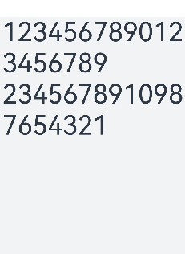  

Crash scenario with default key generation:

``` js
Error message:@Component 'Parent'[4]: ForEach id 7: use of default id generator function not possible on provided data structure. Need to specify id generator function (ForEach 3rd parameter). Application Error!
Stacktrace:
    ...
    at anonymous (entry/src/main/ets/pages/Index.ets:18:52)
```