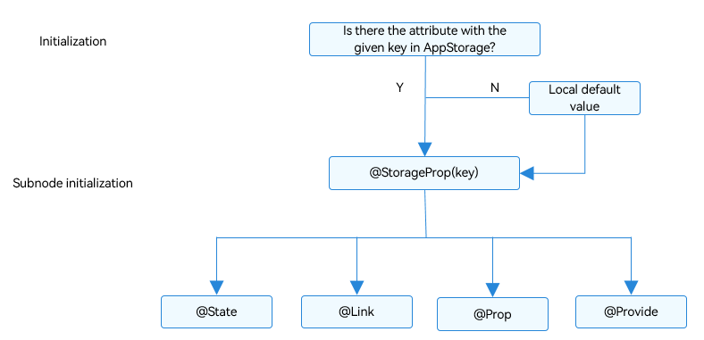

# AppStorage: Storing Application-wide UI State
<!--Kit: ArkUI-->
<!--Subsystem: ArkUI-->
<!--Owner: @zzq212050299-->
<!--Designer: @s10021109-->
<!--Tester: @TerryTsao-->
<!--Adviser: @zhang_yixin13-->

Before reading this document, it is recommend that you review the [State Management Overview](./arkts-state-management-overview.md) to understand the role of AppStorage within the state management framework.

AppStorage is a global UI state storage center bound to the application process. Created by the UI framework at application launch, it stores UI state data in runtime memory to enable application-level global state sharing.

Serving as the application's "central hub," AppStorage acts as the intermediary bridge between persistent data ([PersistentStorage](arkts-persiststorage.md)), environment variables ([Environment](arkts-environment.md)), and UI interactions. Its primary value lies in providing you with cross-ability UI state sharing capabilities.

AppStorage provides APIs for manual create, retrieve, update, delete (CRUD) operations outside custom components. For details, see [AppStorage API Reference](../../reference/apis-arkui/arkui-ts/ts-state-management.md#appstorage). For best practices, see [State Management](https://developer.huawei.com/consumer/en/doc/best-practices/bpta-status-management).

## Overview

AppStorage is a singleton created at application startup, serving as the central repository for application-wide UI state data. This state data is accessible at the application level. AppStorage maintains all properties throughout the application lifecycle.

Properties are accessed through unique string keys. They can be synchronized with UI components and accessed within the application's service logic.

AppStorage enables UI state sharing among multiple [UIAbility](../../reference/apis-ability-kit/js-apis-app-ability-uiAbility.md) instances within the application's [main thread](../../application-models/thread-model-stage.md).

Properties in AppStorage support two-way synchronization and offer extended features, such as data persistence (see [PersistentStorage](arkts-persiststorage.md)). These UI states are implemented through service logic and decoupled from the UI. To use these UI states in the UI, the [@StorageProp](#storageprop) and [@StorageLink](#storagelink) decorators are required.

## \@StorageProp

As mentioned above, to bind AppStorage properties with custom components, the @StorageProp and @StorageLink decorators are required. Component variables decorated with \@StorageProp(key) or \@StorageLink(key) use the key to identify the corresponding property in AppStorage.

During custom component initialization, the variable decorated with \@StorageProp(key) or \@StorageLink(key) is initialized using the value of the property corresponding to the specified key in AppStorage. Due to differences in application logic, it cannot be guaranteed that the corresponding property has been stored in the AppStorage instance before component initialization. Therefore, local initialization of variables decorated with \@StorageProp(key) or \@StorageLink(key) is necessary.

\@StorageProp(key) establishes one-way data synchronization with the property corresponding to **key** in AppStorage:

1. When a local modification is made, the change will not be written back to AppStorage.
2. When the property corresponding to **key** in AppStorage is modified, the change will be synchronized to all properties bound to that key in AppStorage, overwriting any local modifications.

> **NOTE**
>
> This decorator can be used in atomic services since API version 11.

### Usage Rules

| \@StorageProp Decorator| Description                                                        |
| ----------------------- | ------------------------------------------------------------ |
| Parameters             | **key**: constant string, mandatory (the string must be quoted)                 |
| Allowed variable types     | Object, class, string, number, Boolean, enum, and array of these types.<br>(Applicable to API version 12 or later) **Map**, **Set**, **Date**, **undefined**, and **null**. For details about the scenarios of nested objects, see [Observed Changes and Behavior](#observed-changes-and-behavior).<br>(Applicable to API version 12 or later) Union type of the preceding types, for example, **string \| number, string \| undefined**, or **ClassA \| null**. For details, see [Using Union Types in AppStorage](#using-union-types-in-appstorage).<br>**Notice**<br>The variable type must be specified. Whenever possible, use the same type as that of the corresponding property in AppStorage. Otherwise, implicit type conversion occurs, causing application behavior exceptions.<br>When **undefined** or **null** is used, you are advised to explicitly specify the type to pass the TypeScript type check. For example, **@StorageProp('AA') a: number \| null = null** is supported, but **@StorageProp('AA') a: number = null** is not.<br>**any** is not supported.|
| Synchronization type               | One-way: from the property in AppStorage to the component variable.<br>The component variable can be changed locally, but an update from AppStorage will overwrite local changes.|
| Initial value for the decorated variable     | Mandatory. If the property does not exist in AppStorage, it will be created and initialized with this value.|

### Variable Transfer/Access Rules

| Transfer/Access     | Description                                      |
| ---------- | ---------------------------------------- |
| Initialization and update from the parent component| Prohibited. Only initialization using the property corresponding to the key in AppStorage is supported. If the corresponding key does not exist, initialization uses the local default value.|
| Child component initialization    | Supported. Can be used to initialize variables decorated with [\@State](./arkts-state.md), [\@Link](./arkts-link.md), [\@Prop](./arkts-prop.md), or [\@Provide](./arkts-provide-and-consume.md).|
| Access from outside the component | No                                      |

  **Figure 1** \@StorageProp initialization rule 



### Observed Changes and Behavior

**Observed Changes**

- When the decorated variable is of the Boolean, string, or number type, its value change can be observed.

- When the decorated variable is of the class or object type, the complete object reassignment and property-level changes can be observed. For details, see [Using AppStorage from Inside the UI](#using-appstorage-from-inside-the-ui).

- When the decorated object is an array, changes including array item addition, deletion, and updates can be observed.

- When the decorated object is of the Date type, the following changes can be observed: (1) complete **Date** object reassignment; (2) property changes caused by calling **setFullYear**, **setMonth**, **setDate**, **setHours**, **setMinutes**, **setSeconds**, **setMilliseconds**, **setTime**, **setUTCFullYear**, **setUTCMonth**, **setUTCDate**, **setUTCHours**, **setUTCMinutes**, **setUTCSeconds**, or **setUTCMilliseconds**. For details, see [Decorating Variables of the Date Type](#decorating-variables-of-the-date-type).

- When the decorated object is of the **Map** type, the following changes can be observed: (1) complete **Map** object reassignment; (2) changes caused by calling **set**, **clear**, or **delete**. For details, see [Decorating Variables of the Map Type](#decorating-variables-of-the-map-type).

- When the decorated object is of the **Set** type, the following changes can be observed: (1) complete **Set** object reassignment; (2) changes caused by calling **add**, **clear**, or **delete**. For details, see [Decorating Variables of the Set Type](#decorating-variables-of-the-set-type).

**Framework Behavior**

1. When a variable decorated with \@StorageProp(key) is modified, the change will not be written back to the corresponding property in AppStorage. The change will trigger a re-render of the custom component and only applies to the private member variable of the current component. Other data bound to the same key will not be synchronized.

2. When the property corresponding to the given key in AppStorage changes, all variables decorated with \@StorageProp(key) will be synchronized and updated, and any local changes will be overwritten.

## \@StorageLink

> **NOTE**
>
> This decorator can be used in atomic services since API version 11.

\@StorageLink(key) creates a two-way data synchronization between the variable it decorates and the property with the given key in AppStorage.

1. Local changes are synchronized to AppStorage.

2. Any change in AppStorage is synchronized to the properties bound to the given key in all scenarios, including one-way bound variables (\@StorageProp decorated variables and one-way bound variables created through [@Prop](./arkts-prop.md)), two-way bound variables (\@StorageLink decorated variables and two-way bound variables created through **link**), and other instances (such as PersistentStorage).

### Usage Rules

| \@StorageLink Decorator| Description                                                        |
| ----------------------- | ------------------------------------------------------------ |
| Parameters             | **key**: constant string, mandatory (the string must be quoted)                 |
| Allowed variable types     | Object, class, string, number, Boolean, enum, and array of these types.<br>(Applicable to API version 12 or later) **Map**, **Set**, **Date**, **undefined**, and **null**. For details about the scenarios of nested objects, see [Observed Changes and Behavior](#observed-changes-and-behavior-1).<br>(Applicable to API version 12 or later) Union type of the preceding types, for example, **string \| number, string \| undefined**, or **ClassA \| null**. For details, see [Using Union Types in AppStorage](#using-union-types-in-appstorage).<br>**Notice**<br>The variable type must be specified. Whenever possible, use the same type as that of the corresponding property in AppStorage. Otherwise, implicit type conversion occurs, causing application behavior exceptions.<br>When **undefined** or **null** is used, you are advised to explicitly specify the type to pass the TypeScript type check. For example, **@StorageLink('AA') a: number \| null = null** is supported, but **@StorageLink('AA') a: number = null** is not.<br>**any** is not supported.|
| Synchronization type               | Two-way: from the property in AppStorage to the custom component variable and vice versa|
| Initial value for the decorated variable     | Mandatory. If the property does not exist in AppStorage, it will be created and initialized with this value.|


### Variable Transfer/Access Rules

| Transfer/Access     | Description                                      |
| ---------- | ---------------------------------------- |
| Initialization and update from the parent component| Forbidden.                                     |
| Child component initialization    | Supported. The \@StorageLink decorated variable can be used to initialize a regular variable or an \@State, \@Link, \@Prop, or \@Provide decorated variable in the child component.|
| Access from outside the component | No                                      |

  **Figure 2** \@StorageLink initialization rule 


### Observed Changes and Behavior

**Observed Changes**

- When the decorated variable is of the Boolean, string, or number type, its value change can be observed.

- When the decorated variable is of the class or object type, the complete object reassignment and property-level changes can be observed. For details, see [Using AppStorage from Inside the UI](#using-appstorage-from-inside-the-ui).

- When the decorated object is an array, changes including array item addition, deletion, and updates can be observed.

- When the decorated object is of the **Date** type, the following changes can be observed: (1) complete **Date** object reassignment; (2) property changes caused by calling **setFullYear**, **setMonth**, **setDate**, **setHours**, **setMinutes**, **setSeconds**, **setMilliseconds**, **setTime**, **setUTCFullYear**, **setUTCMonth**, **setUTCDate**, **setUTCHours**, **setUTCMinutes**, **setUTCSeconds**, or **setUTCMilliseconds**. For details, see [Decorating Variables of the Date Type](#decorating-variables-of-the-date-type).

- When the decorated object is of the **Map** type, the following changes can be observed: (1) complete **Map** object reassignment; (2) changes caused by calling **set**, **clear**, or **delete**. For details, see [Decorating Variables of the Map Type](#decorating-variables-of-the-map-type).

- When the decorated object is of the **Set** type, the following changes can be observed: (1) complete **Set** object reassignment; (2) changes caused by calling **add**, **clear**, or **delete**. For details, see [Decorating Variables of the Set Type](#decorating-variables-of-the-set-type).

**Framework Behavior**

1. Changes to variables decorated with \@StorageLink(key) are automatically written back to the corresponding property in AppStorage.

2. When the value of a key in AppStorage changes, all data bound to that key (including both two-way binding with \@StorageLink and one-way binding with \@StorageProp) will be synchronized.

3. When a variable decorated by \@StorageLink(key) is updated, the change is synchronized back to the corresponding key in AppStorage and triggers re-rendering of the owning custom component.


## Constraints

1. The parameter of \@StorageProp and \@StorageLink must be of the string type. Otherwise, an error is reported during compilation.

    ```ts
    AppStorage.setOrCreate('propA', 47);

    // Incorrect format. An error is reported during compilation.
    @StorageProp() storageProp: number = 1;
    @StorageLink() storageLink: number = 2;

    // Correct usage.
    @StorageProp('propA') storageProp: number = 1;
    @StorageLink('propA') storageLink: number = 2;
    ```

2. \@StorageProp and \@StorageLink cannot decorate variables of the function type. Otherwise, the framework throws a runtime error.

3. When using AppStorage together with [PersistentStorage](arkts-persiststorage.md) and [Environment](arkts-environment.md), pay attention to the following:

    1. If a property exists in AppStorage before PersistentStorage.[persistProp](../../reference/apis-arkui/arkui-ts/ts-state-management.md#persistpropdeprecated) is called, the value in AppStorage will overwrite the value in PersistentStorage. As such, when possible, initialize PersistentStorage properties first. For an example with incorrect usage, see [Accessing a Property in AppStorage Before PersistentStorage](arkts-persiststorage.md#accessing-a-property-in-appstorage-before-persistentstorage).

    2. If a property has already been created in AppStorage, subsequent calls to Environment.[envProp](../../reference/apis-arkui/arkui-ts/ts-state-management.md#envprop10) to create a property with the same name will fail. Since AppStorage already contains a property with that name, the Environment variable will not be written to AppStorage. Therefore, avoid using the preset Environment variable names in AppStorage.

4. Changes to variables decorated with state decorators will trigger UI re-rendering. If a variable is modified only for message passing (not for UI updates), using the **emitter** API is recommended. For the example, see [Avoiding @StorageLink for Event Notification](#avoiding-storagelink-for-event-notification).

5. AppStorage is shared within the same process. Since the UIAbility and <!--Del-->[<!--DelEnd-->UIExtensionAbility<!--Del-->](../../application-models/uiextensionability.md)<!--DelEnd--> run in separate processes, the UIExtensionAbility does not share the AppStorage of the main process.

## Use Scenarios

### Using AppStorage and LocalStorage in Application Logic

AppStorage is implemented as a singleton, with all its APIs exposed as static methods. How these APIs work resembles the non-static APIs of LocalStorage.

```ts
AppStorage.setOrCreate('propA', 47);

let storage: LocalStorage = new LocalStorage();
storage.setOrCreate('propA',17);
let propA: number | undefined = AppStorage.get('propA'); // propA in AppStorage == 47, propA in LocalStorage == 17
let link1: SubscribedAbstractProperty<number> = AppStorage.link('propA'); // link1.get() == 47
let link2: SubscribedAbstractProperty<number> = AppStorage.link('propA'); // link2.get() == 47
let prop: SubscribedAbstractProperty<number> = AppStorage.prop('propA'); // prop.get() == 47

link1.set(48); // Two-way synchronization: link1.get() == link2.get() == prop.get() == 48
prop.set(1); // One-way synchronization: prop.get() == 1; but link1.get() == link2.get() == 48
link1.set(49); // Two-way synchronization: link1.get() == link2.get() == prop.get() == 49

storage.get<number>('propA') // == 17
storage.set('propA', 101);
storage.get<number>('propA') // == 101

AppStorage.get<number>('propA') // == 49
link1.get() // == 49
link2.get() // == 49
prop.get() // == 49
```


### Using AppStorage from Inside the UI

@StorageLink works in conjunction with AppStorage to establish two-way data synchronization using properties stored in AppStorage.
@StorageProp works in conjunction with AppStorage to establish one-way data synchronization using properties stored in AppStorage.

```ts
class Data {
  code: number;

  constructor(code: number) {
    this.code = code;
  }
}

AppStorage.setOrCreate('propA', 47);
AppStorage.setOrCreate('propB', new Data(50));
let storage = new LocalStorage();
storage.setOrCreate('linkA', 48);
storage.setOrCreate('linkB', new Data(100));

@Entry(storage)
@Component
struct Index {
  @StorageLink('propA') storageLink: number = 1;
  @StorageProp('propA') storageProp: number = 1;
  @StorageLink('propB') storageLinkObject: Data = new Data(1);
  @StorageProp('propB') storagePropObject: Data = new Data(1);

  build() {
    Column({ space: 20 }) {
      // StorageLink establishes a two-way synchronization with AppStorage; local changes will be synchronized back to the value of key 'propA' in AppStorage.
      Text(`storageLink ${this.storageLink}`)
        .onClick(() => {
          this.storageLink += 1;
        })

      // @StorageProp establishes a one-way synchronization with AppStorage; local changes will not be synchronized back to the value of key 'propA' in AppStorage.
      // However, its value can be updated using the set/setOrCreate APIs of AppStorage.
      Text(`storageProp ${this.storageProp}`)
        .onClick(() => {
          this.storageProp += 1;
        })

      // Although AppStorage APIs can obtain values, they do not have the capability to refresh the UI (the value change can be seen in logs).
      // A connection with the custom component can only be established to refresh the UI by relying on @StorageLink/@StorageProp.
      Text(`change by AppStorage: ${AppStorage.get<number>('propA')}`)
        .onClick(() => {
          console.info(`Appstorage.get: ${AppStorage.get<number>('propA')}`);
          AppStorage.set<number>('propA', 100);
        })

      Text(`storageLinkObject ${this.storageLinkObject.code}`)
        .onClick(() => {
          this.storageLinkObject.code += 1;
        })

      Text(`storagePropObject ${this.storagePropObject.code}`)
        .onClick(() => {
          this.storagePropObject.code += 1;
        })
    }
  }
}
```

### Using Union Types in AppStorage

The following example demonstrates how to use union types in LocalStorage. The type of variable **linkA** is **number | null**, and the type of variable **linkB** is **number | undefined**. The **Text** components display **null** and **undefined** upon initialization, numbers when clicked, and **null** and **undefined** when clicked again.

```ts
@Component
struct StorageLinkComponent {
  @StorageLink('linkA') linkA: number | null = null;
  @StorageLink('linkB') linkB: number | undefined = undefined;

  build() {
    Column() {
      Text('@StorageLink initialization, @StorageLink value')
      Text(this.linkA + '').fontSize(20).onClick(() => {
        this.linkA ? this.linkA = null : this.linkA = 1;
      })
      Text(this.linkB + '').fontSize(20).onClick(() => {
        this.linkB ? this.linkB = undefined : this.linkB = 1;
      })
    }
    .borderWidth(3).borderColor(Color.Red)
  }
}

@Component
struct StoragePropComponent {
  @StorageProp('propA') propA: number | null = null;
  @StorageProp('propB') propB: number | undefined = undefined;

  build() {
    Column() {
      Text('@StorageProp initialization, @StorageProp value')
      Text(this.propA + '').fontSize(20).onClick(() => {
        this.propA ? this.propA = null : this.propA = 1;
      })
      Text(this.propB + '').fontSize(20).onClick(() => {
        this.propB ? this.propB = undefined : this.propB = 1;
      })
    }
    .borderWidth(3).borderColor(Color.Blue)
  }
}

@Entry
@Component
struct Index {
  build() {
    Row() {
      Column() {
        StorageLinkComponent()
        StoragePropComponent()
      }
      .width('100%')
    }
    .height('100%')
  }
}
```

### Decorating Variables of the Date Type

> **NOTE**
>
> AppStorage supports the Date type since API version 12.

In this example, the **selectedDate** variable decorated with @StorageLink is of the Date type. After the button is clicked, the value of **selectedDate** changes, and the UI is re-rendered.

```ts
@Entry
@Component
struct DateSample {
  @StorageLink('date') selectedDate: Date = new Date('2021-08-08');

  build() {
    Column() {
      Button('set selectedDate to 2023-07-08')
        .margin(10)
        .onClick(() => {
          AppStorage.setOrCreate('date', new Date('2023-07-08'));
        })
      Button('increase the year by 1')
        .margin(10)
        .onClick(() => {
          this.selectedDate.setFullYear(this.selectedDate.getFullYear() + 1);
        })
      Button('increase the month by 1')
        .margin(10)
        .onClick(() => {
          this.selectedDate.setMonth(this.selectedDate.getMonth() + 1);
        })
      Button('increase the day by 1')
        .margin(10)
        .onClick(() => {
          this.selectedDate.setDate(this.selectedDate.getDate() + 1);
        })
      DatePicker({
        start: new Date('1970-1-1'),
        end: new Date('2100-1-1'),
        selected: $$this.selectedDate
      })
    }.width('100%')
  }
}
```

### Decorating Variables of the Map Type

> **NOTE**
>
> AppStorage supports the Map type since API version 12.

In this example, the **message** variable decorated with @StorageLink is of the Map\<number, string\> type. After the button is clicked, the value of **message** changes, and the UI is re-rendered.

```ts
@Entry
@Component
struct MapSample {
  @StorageLink('map') message: Map<number, string> = new Map([[0, 'a'], [1, 'b'], [3, 'c']]);

  build() {
    Row() {
      Column() {
        ForEach(Array.from(this.message.entries()), (item: [number, number]) => {
          Text(`${item[0]}`).fontSize(30)
          Text(`${item[1]}`).fontSize(30)
          Divider()
        })
        Button('init map').onClick(() => {
          this.message = new Map([[0, 'a'], [1, 'b'], [3, 'c']]);
        })
        Button('set new one').onClick(() => {
          this.message.set(4, 'd');
        })
        Button('clear').onClick(() => {
          this.message.clear();
        })
        Button('replace the existing one').onClick(() => {
          this.message.set(0, 'aa');
        })
        Button('delete the existing one').onClick(() => {
          AppStorage.get<Map<number, string>>('map')?.delete(0);
        })
      }
      .width('100%')
    }
    .height('100%')
  }
}
```

### Decorating Variables of the Set Type

> **NOTE**
>
> AppStorage supports the Set type since API version 12.

In this example, the **memberSet** variable decorated with @StorageLink is of the Set\<number\> type. After the button is clicked, the value of **memberSet** changes, and the UI is re-rendered.

```ts
@Entry
@Component
struct SetSample {
  @StorageLink('set') memberSet: Set<number> = new Set([0, 1, 2, 3, 4]);

  build() {
    Row() {
      Column() {
        ForEach(Array.from(this.memberSet.entries()), (item: [number, string]) => {
          Text(`${item[0]}`)
            .fontSize(30)
          Divider()
        })
        Button('init set')
          .onClick(() => {
            this.memberSet = new Set([0, 1, 2, 3, 4]);
          })
        Button('set new one')
          .onClick(() => {
            AppStorage.get<Set<number>>('set')?.add(5);
          })
        Button('clear')
          .onClick(() => {
            this.memberSet.clear();
          })
        Button('delete the first one')
          .onClick(() => {
            this.memberSet.delete(0);
          })
      }
      .width('100%')
    }
    .height('100%')
  }
}
```

## AppStorage Usage Recommendations

### Avoiding @StorageLink for Event Notification

For performance considerations, using the two-way synchronization mechanism between @StorageLink and AppStorage for event notification is not recommended: (1) Variables in AppStorage may be bound to components across multiple pages, while event notifications typically do not need to be broadcast to all these components. (2) When @StorageLink decorated variables are used in UI, changes trigger component re-renders, causing performance overhead even when no visual updates are required.

In the following example, any click event in the **TapImage** component will trigger a change of the **tapIndex** property. As @StorageLink establishes a two-way data synchronization with AppStorage, the local change is synchronized to AppStorage. As a result, all custom components bound to the **tapIndex** property in AppStorage are notified of the change. After @Watch observes the change to **tapIndex**, the state variable **tapColor** is updated, triggering UI re-rendering. (Because **tapIndex** is not directly bound to the UI, its change does not directly trigger UI re-rendering.)

When using this mechanism for event notification, make sure the property in AppStorage is not directly bound to the UI and control the complexity of the [@Watch](./arkts-watch.md) function：If the @Watch function execution time is too long, it will impact UI re-rendering efficiency.

```ts
// xxx.ets
class ViewData {
  title: string;
  uri: Resource;
  color: Color = Color.Black;

  constructor(title: string, uri: Resource) {
    this.title = title;
    this.uri = uri;
  }
}

@Entry
@Component
struct Gallery {
  // 'app.media.icon' is only an example. Replace it with the actual one in use. Otherwise, the imageSource instance fails to be created, and subsequent operations cannot be performed.
  dataList: Array<ViewData> = [new ViewData('flower', $r('app.media.icon')), new ViewData('OMG', $r('app.media.icon')), new ViewData('OMG', $r('app.media.icon'))];
  scroller: Scroller = new Scroller();

  build() {
    Column() {
      Grid(this.scroller) {
        ForEach(this.dataList, (item: ViewData, index?: number) => {
          GridItem() {
            TapImage({
              uri: item.uri,
              index: index
            })
          }.aspectRatio(1)

        }, (item: ViewData, index?: number) => {
          return JSON.stringify(item) + index;
        })
      }.columnsTemplate('1fr 1fr')
    }

  }
}

@Component
export struct TapImage {
  @StorageLink('tapIndex') @Watch('onTapIndexChange') tapIndex: number = -1;
  @State tapColor: Color = Color.Black;
  private index: number = 0;
  private uri: Resource = {
    id: 0,
    type: 0,
    moduleName: '',
    bundleName: ''
  };

  // Check whether the component is selected.
  onTapIndexChange() {
    if (this.tapIndex >= 0 && this.index === this.tapIndex) {
      console.info(`tapindex: ${this.tapIndex}, index: ${this.index}, red`);
      this.tapColor = Color.Red;
    } else {
      console.info(`tapindex: ${this.tapIndex}, index: ${this.index}, black`);
      this.tapColor = Color.Black;
    }
  }

  build() {
    Column() {
      Image(this.uri)
        .objectFit(ImageFit.Cover)
        .onClick(() => {
          this.tapIndex = this.index;
        })
        .border({ width: 5, style: BorderStyle.Dotted, color: this.tapColor })
    }

  }
}
```

Compared with the use of @StorageLink, the use of **emit** allows you to subscribe to events and receive event callbacks, thereby reducing overhead and improving code readability.

> **NOTE**
>
> The **emit** API is not available in DevEco Studio Previewer.


```ts
// xxx.ets
import { emitter } from '@kit.BasicServicesKit';

let nextId: number = 0;

class ViewData {
  title: string;
  uri: Resource;
  color: Color = Color.Black;
  id: number;

  constructor(title: string, uri: Resource) {
    this.title = title;
    this.uri = uri;
    this.id = nextId++;
  }
}

@Entry
@Component
struct Gallery {
  // 'app.media.icon' is only an example. Replace it with the actual one in use. Otherwise, the imageSource instance fails to be created, and subsequent operations cannot be performed.
  dataList: Array<ViewData> = [new ViewData('flower', $r('app.media.icon')), new ViewData('OMG', $r('app.media.icon')), new ViewData('OMG', $r('app.media.icon'))];
  scroller: Scroller = new Scroller();
  private preIndex: number = -1;

  build() {
    Column() {
      Grid(this.scroller) {
        ForEach(this.dataList, (item: ViewData) => {
          GridItem() {
            TapImage({
              uri: item.uri,
              index: item.id
            })
          }.aspectRatio(1)
          .onClick(() => {
            if (this.preIndex === item.id) {
              return;
            }
            let innerEvent: emitter.InnerEvent = { eventId: item.id };
            // Selected: from black to red
            let eventData: emitter.EventData = {
              data: {
                'colorTag': 1
              }
            };
            emitter.emit(innerEvent, eventData);

            if (this.preIndex != -1) {
              console.info(`preIndex: ${this.preIndex}, index: ${item.id}, black`);
              let innerEvent: emitter.InnerEvent = { eventId: this.preIndex };
              // Deselected: from red to black
              let eventData: emitter.EventData = {
                data: {
                  'colorTag': 0
                }
              };
              emitter.emit(innerEvent, eventData);
            }
            this.preIndex = item.id;
          })
        }, (item: ViewData) => JSON.stringify(item))
      }.columnsTemplate('1fr 1fr')
    }

  }
}

@Component
export struct TapImage {
  @State tapColor: Color = Color.Black;
  private index: number = 0;
  private uri: Resource = {
    id: 0,
    type: 0,
    moduleName: '',
    bundleName: ''
  };

  onTapIndexChange(colorTag: emitter.EventData) {
    if (colorTag.data != null) {
      this.tapColor = colorTag.data.colorTag ? Color.Red : Color.Black
    }
  }

  aboutToAppear() {
    // Define the event ID.
    let innerEvent: emitter.InnerEvent = { eventId: this.index };
    emitter.on(innerEvent, data => {
      this.onTapIndexChange(data);
    });
  }

  build() {
    Column() {
      Image(this.uri)
        .objectFit(ImageFit.Cover)
        .border({ width: 5, style: BorderStyle.Dotted, color: this.tapColor })
    }
  }
}
```

The preceding notification logic is simple. It can be simplified into a ternary expression as follows:

```ts
// xxx.ets
class ViewData {
  title: string;
  uri: Resource;
  color: Color = Color.Black;

  constructor(title: string, uri: Resource) {
    this.title = title;
    this.uri = uri;
  }
}

@Entry
@Component
struct Gallery {
  // 'app.media.icon' is only an example. Replace it with the actual one in use. Otherwise, the imageSource instance fails to be created, and subsequent operations cannot be performed.
  dataList: Array<ViewData> = [new ViewData('flower', $r('app.media.icon')), new ViewData('OMG', $r('app.media.icon')), new ViewData('OMG', $r('app.media.icon'))];
  scroller: Scroller = new Scroller();

  build() {
    Column() {
      Grid(this.scroller) {
        ForEach(this.dataList, (item: ViewData, index?: number) => {
          GridItem() {
            TapImage({
              uri: item.uri,
              index: index
            })
          }.aspectRatio(1)

        }, (item: ViewData, index?: number) => {
          return JSON.stringify(item) + index;
        })
      }.columnsTemplate('1fr 1fr')
    }

  }
}

@Component
export struct TapImage {
  @StorageLink('tapIndex') tapIndex: number = -1;
  private index: number = 0;
  private uri: Resource = {
    id: 0,
    type: 0,
    moduleName: '',
    bundleName: ''
  };

  build() {
    Column() {
      Image(this.uri)
        .objectFit(ImageFit.Cover)
        .onClick(() => {
          this.tapIndex = this.index;
        })
        .border({
          width: 5,
          style: BorderStyle.Dotted,
          color: (this.tapIndex >= 0 && this.index === this.tapIndex) ? Color.Red : Color.Black
        })
    }
  }
}
```


### Notes on Update Rules When @StorageProp Is Used with AppStorage APIs

When a key's value is updated using the **setOrCreate** or** set** API, if the new value is identical to the existing one, **setOrCreate** will not trigger updates for \@StorageLink or \@StorageProp. In addition, since \@StorageProp keeps its own local data copy, modifying this local value directly will not synchronize the change back to AppStorage. This can lead to a common misunderstanding: You may assume you have updated the value via AppStorage, only to find that the @StorageProp value remains unchanged in practice.
Example:

```ts
AppStorage.setOrCreate('propA', false);

@Entry
@Component
struct Index {
  @StorageProp('propA') @Watch('onChange') propA: boolean = false;

  onChange() {
    console.info(`propA change`);
  }

  aboutToAppear(): void {
    this.propA = true;
  }

  build() {
    Column() {
      Text(`${this.propA}`)
      Button('change')
        .onClick(() => {
          AppStorage.setOrCreate('propA', false);
          console.info(`propA: ${this.propA}`);
        })
    }
  }
}
```

In the preceding example, the value of **PropA** has been changed to **true** locally before the click event, while the value stored in AppStorage remains **false**. When the click event attempts to update the value of **PropA** to **false** through the **setOrCreate** API, no synchronization is triggered because the value in AppStorage is already **false** (matching the new value). As a result, the value of the @StorageProp decorated variable remains **true**.

To achieve synchronization, there are two approaches:
1. Change \@StorageProp to \@StorageLink.
2. Use **AppStorage.setOrCreate('propA', true)** to change the local value.
