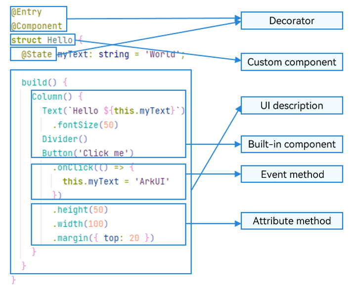

# Basic Syntax Overview

With a basic understanding of the ArkTS language, let's examine its structural composition through a practical example.

The following demonstration shows a text element that changes from **Hello World** to **Hello ArkUI** when a button is clicked.

  **Figure 1** Example 

In this example, the basic composition of ArkTS is as follows.

  **Figure 2** Basic composition of ArkTS 

> **NOTE**
>
> Custom variables must not share names with universal attributes or events.

- Decorator: design pattern used to decorate classes, structs, methods, and variables to assign special meanings to them. In the preceding figure, the [@Component](arkts-create-custom-components.md#component) decorator marks a custom component, the [@Entry](arkts-create-custom-components.md#entry) decorator indicates that the custom component is an entry component, and the [@State](arkts-state.md) decorator indicates the state variables in the component, whose changes trigger UI re-renders.

- [UI description](arkts-declarative-ui-description.md): declarative description of the UI structure, such as the code block of **build()**.

- [Custom component](arkts-create-custom-components.md): reusable UI unit that can be used with other components, such as the **struct Hello** decorated by @Component.

- Built-in component: default basic or container component preset in ArkTS, which can be directly invoked, such as **Column**, **Text**, **Divider**, and **Button** components in the sample code.

- [Attribute method](../../reference/apis-arkui/arkui-ts/ts-component-general-attributes.md): chainable method for configuring a component attribute, such as **fontSize()**, **width()**, **height()**, and **backgroundColor()**.

- [Event method](../../reference/apis-arkui/arkui-ts/ts-component-general-events.md): chainable method for defining interaction logic, for example, **onClick()** for the **Button** component.

ArkTS introduces several advanced syntax features designed to improve developer productivity and code maintainability.

- [@Builder](arkts-builder.md)/[@BuilderParam](arkts-builderparam.md): specialized mechanism for encapsulating UI descriptions, enabling fine-grained reuse of UI descriptions.

- [@Extend](arkts-extend.md)/[@Styles](arkts-style.md): decorator that extends built-in components and encapsulates attribute styles to combine built-in components more flexibly.

- [stateStyles](arkts-statestyles.md): feature that implements polymorphic styles that dynamically adapt to a component's internal state.
