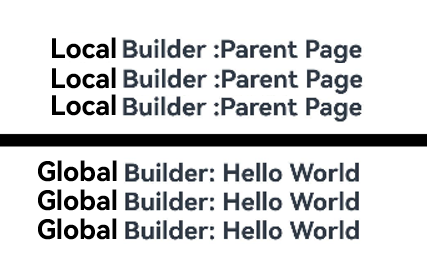
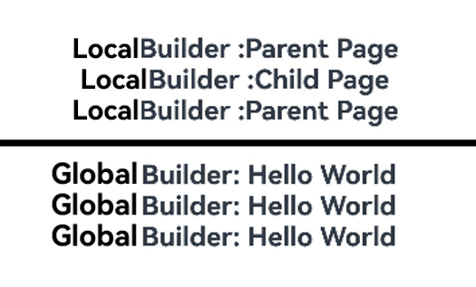

# \@BuilderParam Decorator: Referencing the \@Builder Function
<!--Kit: ArkUI-->
<!--Subsystem: ArkUI-->
<!--Owner: @zhangboren-->
<!--Designer: @zhangboren-->
<!--Tester: @TerryTsao-->
<!--Adviser: @zhang_yixin13-->
<!-- md-trans-meta sourceCommit=2fe87adc16af5a903a1eb4a9624e4d36fa962e3d translatedAt=2026-07-25T08:56:39.016Z pushedAt=2026-07-25T09:19:19.486Z -->

When a developer creates a [custom component](./arkts-create-custom-components.md) and needs to add specific functions (such as [Navigation](../../reference/apis-arkui/arkui-ts/ts-basic-components-navigation.md)) to it, embedding event methods directly in the component causes all instances of that custom component to include this function. To address this issue, ArkUI introduces the [\@BuilderParam](../../reference/apis-arkui/arkui-ts/ts-universal-builderparam-dynamic.md#builderparam) decorator. \@BuilderParam is used to decorate variables that point to \@Builder methods. When initializing a custom component, you can use different methods (such as parameter modification, trailing closure, borrowing arrow functions, etc.) to pass parameters and assign values to the custom builder function decorated by \@BuilderParam. Inside the custom component, the specific function is added by calling \@BuilderParam.

Before reading this topic, you are advised to read [\@Builder](./arkts-builder.md).

> **NOTE**
>
> The initial APIs of this module are supported since API version 7.
>
> This decorator can be used in ArkTS widgets since API version 9.
>
> This decorator can be used in atomic services since API version 11.


## How to Use


### Initializing \@BuilderParam Decorated Methods

An \@BuilderParam decorated method can be initialized only by an \@Builder function reference.

- Use the custom build function of the custom component or the global custom build function to initialize the method decorated by \@BuilderParam locally.

  <!-- @[builder_param_init_method](https://gitcode.com/openharmony/applications_app_samples/blob/master/code/DocsSample/ArkUISample/ParadigmStateRestock/entry/src/main/ets/pages/builderParam/BuilderParamInitMethod.ets) -->

  ``` TypeScript
  @Builder
  function overBuilder() {
  }
  
  @Component
  struct Child {
    @Builder
    doNothingBuilder() {
    }
  
    // Use the custom build function of the custom component to initialize the method decorated by \@BuilderParam.
    @BuilderParam customBuilderParam: () => void = this.doNothingBuilder;
    // Use the global custom build function to initialize the method decorated by \@BuilderParam.
    @BuilderParam customOverBuilderParam: () => void = overBuilder;
  
    build() {
    }
  }
  ```


- Initialization from the parent component

  <!-- @[builder_param_init_method_demo01](https://gitcode.com/openharmony/applications_app_samples/blob/master/code/DocsSample/ArkUISample/ParadigmStateRestock/entry/src/main/ets/pages/builderParam/BuilderParamInitMethodDemo01.ets) -->  

  ``` TypeScript
  @Component
  struct Child {
    @Builder
    customBuilder() {
    }
  
    @BuilderParam customBuilderParam: () => void = this.customBuilder;
  
    build() {
      Column() {
        this.customBuilderParam()
      }
    }
  }
  
  @Entry
  @Component
  struct Parent {
    @Builder
    componentBuilder() {
      Text('Parent builder')
    }
  
    build() {
      Column() {
        // Use a parent component's custom builder function to initialize a method decorated with @BuilderParam in a child component.
        Child({ customBuilderParam: this.componentBuilder })
      }
    }
  }
  ```

Effect


- **this** in the function body must point to the correct object.

  Example:

  <!-- @[builder_param_init_method_demo02](https://gitcode.com/openharmony/applications_app_samples/blob/master/code/DocsSample/ArkUISample/ParadigmStateRestock/entry/src/main/ets/pages/builderParam/BuilderParamInitMethodDemo02.ets) -->

  ``` TypeScript
  @Component
  struct Child {
    label: string = 'Child';
  
    @Builder
    customBuilder() {
    }
  
    @Builder
    customChangeThisBuilder() {
    }
  
    @BuilderParam customBuilderParam: () => void = this.customBuilder;
    @BuilderParam customChangeThisBuilderParam: () => void = this.customChangeThisBuilder;
  
    build() {
      Column() {
        this.customBuilderParam()
        this.customChangeThisBuilderParam()
      }
    }
  }
  
  @Entry
  @Component
  struct Parent {
    label: string = 'Parent';
  
    @Builder
    componentBuilder() {
      Text(`${this.label}`)
    }
  
    build() {
      Column() {
        // When this.componentBuilder() is called, this points to the Parent component decorated by the @Entry. That is, the value of the label variable is Parent.
        this.componentBuilder()
        Child({
          // Pass this.componentBuilder to @BuilderParam customBuilderParam of the Child component. this points to the Child, that is, the value of the label variable is Child.
          customBuilderParam: this.componentBuilder,
          // Pass ():void=>{this.componentBuilder()} to @BuilderParam customChangeThisBuilderParam of the Child component.
          // this of the arrow function points to the host object, so the value of the label variable is Parent.
          customChangeThisBuilderParam: (): void => {
            this.componentBuilder()
          }
        })
      }
    }
  }
  ```

Effect


## Constraints

- The variable decorated with \@BuilderParam can be initialized only through the \@Builder function. For details, see [Initialized Value of @BuilderParam Must Be @Builder](#initialized-value-of-builderparam-must-be-builder).

- When the [\@Require decorator](./arkts-require.md) and \@BuilderParam decorator are used together, the \@BuilderParam decorator must be initialized. For details, see [Using @Require and @BuilderParam Together](#using-require-and-builderparam-together).

- In the scenario where a custom component is followed by a closure, the child component has only one \@BuilderParam to receive the closure, and the method decorated by this \@BuilderParam cannot have parameters. For details, see [Component Initialization Through Trailing Closure](#component-initialization-through-trailing-closure).

## Use Cases

### Component Initialization Through Parameters

The method decorated with \@BuilderParam may be either parameterized or parameterless, but it must match the type of the \@Builder method it points to.

<!-- @[builder_param_scene_init_component](https://gitcode.com/openharmony/applications_app_samples/blob/master/code/DocsSample/ArkUISample/ParadigmStateRestock/entry/src/main/ets/pages/builderParam/BuilderParamSceneInitComponent.ets) -->

``` TypeScript
class Tmp {
  public label: string = '';
}

@Builder
function overBuilder($$: Tmp) {
  Text($$.label)
    .width('100%')
    .height(50)
    .backgroundColor(Color.Green)
}

@Component
struct Child {
  label: string = 'Child';

  @Builder
  customBuilder() {
  }

  // Without parameters. The pointed customBuilder does not carry parameters either.
  @BuilderParam customBuilderParam: () => void = this.customBuilder;
  // With parameters. The pointed overBuilder also carries parameters.
  @BuilderParam customOverBuilderParam: ($$: Tmp) => void = overBuilder;

  build() {
    Column() {
      this.customBuilderParam()
      this.customOverBuilderParam({ label: 'global Builder label' })
    }
  }
}

@Entry
@Component
struct Parent {
  label: string = 'Parent';

  @Builder
  componentBuilder() {
    Text(`${this.label}`)
  }

  build() {
    Column() {
      this.componentBuilder()
      Child({ customBuilderParam: this.componentBuilder, customOverBuilderParam: overBuilder })
    }
  }
}
```
Effect


### Component Initialization Through Trailing Closure

In a custom component, the \@BuilderParam decorated attribute can be initialized using a trailing closure. During initialization, a component must be followed by a pair of braces ({}) to form a trailing closure.

> **NOTE**
>
>  - In this scenario, the custom component has only one attribute decorated with \@BuilderParam.
>
>  - In this scenario, the custom component does not support common attributes.

You can pass the content in the trailing closure to \@BuilderParam as an \@Builder decorated method.

Example 1:

<!-- @[builder_param_scene_trailing_closure_01](https://gitcode.com/openharmony/applications_app_samples/blob/master/code/DocsSample/ArkUISample/ParadigmStateRestock/entry/src/main/ets/pages/builderParam/BuilderParamSceneTrailingClosure01.ets) -->

``` TypeScript
@Component
struct CustomContainer {
  @Prop header: string = '';

  @Builder
  closerBuilder() {
  }

  // Use the trailing closure {} (decorated by @Builder) of the parent component to initialize the @BuilderParam-decorated method of the child component.
  @BuilderParam closer: () => void = this.closerBuilder;

  build() {
    Column() {
      Text(this.header)
        .fontSize(30)
      this.closer()
    }
  }
}

@Builder
function specificParam(label1: string, label2: string) {
  Column() {
    Text(label1)
      .fontSize(30)
    Text(label2)
      .fontSize(30)
  }
}

@Entry
@Component
struct CustomContainerUser {
  @State text: string = 'header';

  build() {
    Column() {
      // Create the CustomContainer component. During initialization, append a pair of braces ({}) to the component name to form a trailing closure.
      // Used as the parameter passed to CustomContainer @BuilderParam closer: () => void.
      CustomContainer({ header: this.text }) {
        Column() {
          specificParam('testA', 'testB')
        }.backgroundColor(Color.Yellow)
        .onClick(() => {
          this.text = 'changeHeader';
        })
      }
    }
  }
}
```
Effect


You can use global or local \@Builder to initialize the methods decorated by \@BuilderParam in the custom component decorated by [\@ComponentV2](./arkts-create-custom-components.md#componentv2) in the form of trailing closures.

Example 2:

<!-- @[builder_param_scene_trailing_closure_02](https://gitcode.com/openharmony/applications_app_samples/blob/master/code/DocsSample/ArkUISample/ParadigmStateRestock/entry/src/main/ets/pages/builderParam/BuilderParamSceneTrailingClosure02.ets) -->

``` TypeScript
@ComponentV2
struct ChildPage {
  @Require @Param message: string = '';

  @Builder
  customBuilder() {
  }

  @BuilderParam customBuilderParam: () => void = this.customBuilder;

  build() {
    Column() {
      Text(this.message)
        .fontSize(30)
        .fontWeight(FontWeight.Bold)
      this.customBuilderParam()
    }
  }
}

const builderValue: string = 'Hello World';

@Builder
function overBuilder() {
  Row() {
    Text(`Global Builder: ${builderValue}`)
      .fontSize(20)
      .fontWeight(FontWeight.Bold)
  }
}

@Entry
@ComponentV2
struct ParentPage {
  @Local label: string = 'Parent Page';

  @Builder
  componentBuilder() {
    Row() {
      Text(`Local Builder: ${this.label}`)
        .fontSize(20)
        .fontWeight(FontWeight.Bold)
    }
  }

  build() {
    Column() {
      ChildPage({ message: this.label }) {
        Column() { // Use the local @Builder. Column component is followed by braces ({}) to form a trailing closure to initialize the custom component @BuilderParam.
          this.componentBuilder();
        }
      }

      Line()
        .width('100%')
        .height(10)
        .backgroundColor('#000000').margin(10)
      ChildPage({ message: this.label }) { // Use the global @Builder. Component is followed by braces ({}) to form a trailing closure to initialize the custom component @BuilderParam.
        Column() {
          overBuilder();
        }
      }
    }
  }
}
```
Effect


### Using \@BuilderParam to Isolate the Calls of Multiple Components to the \@Builder Redirection Logic

When the system component encapsulated by \@Builder contains the redirection logic, all custom components that call \@Builder have the redirection function. To disable the redirection function of a specific component, you can use \@BuilderParam to isolate the redirection logic.

> **NOTE**
>
> In the sample code, the **Navigation** component is used for navigation. For details about the implementation logic, see the [Navigation](../arkts-navigation-architecture.md) guide.

<!-- @[builder_param_scene_jump_logic](https://gitcode.com/openharmony/applications_app_samples/blob/master/code/DocsSample/ArkUISample/ParadigmStateRestock/entry/src/main/ets/pages/BuilderParamSceneJumpLogic.ets) -->

``` TypeScript
import { HelloWorldPageBuilder } from './helloworld';
import { hilog } from '@kit.PerformanceAnalysisKit';

const DOMAIN = 0x0000;

class NavigationParams {
  public pathStack: NavPathStack = new NavPathStack();
  public boo: boolean = true;
}

@Builder
function navigationAction(params: NavigationParams) {
  Column() {
    Navigation(params.pathStack) {
      Button('router to page', { stateEffect: true, type: ButtonType.Capsule })
        .width('80%')
        .height(40)
        .margin(20)
        .onClick(() => {
          // Modify the @BuilderParam parameter to determine whether to perform redirection.
          if (params.boo) {
            params.pathStack.pushPath({ name: 'HelloWorldPage' });
          } else {
            hilog.info(DOMAIN, 'testTag', '%{public}s', '@BuilderParam setting does not jump');
          }
        })
    }
    .navDestination(HelloWorldPageBuilder)
    .hideTitleBar(true)
    .height('100%')
    .width('100%')
  }
  .height('25%')
  .width('100%')
}

@Entry
@Component
struct ParentPage {
  @State info: NavigationParams = new NavigationParams();

  build() {
    Column() {
      Text('ParentPage')
      navigationAction({ pathStack: this.info.pathStack, boo: true })
      ChildPageOne()
      ChildPage_BuilderParam({ eventBuilder: navigationAction })
    }
    .height('100%')
    .width('100%')
  }
}

@Component
struct ChildPageOne {
  @State info: NavigationParams = new NavigationParams();

  build() {
    Column() {
      Text('ChildPage')
      navigationAction({ pathStack: this.info.pathStack, boo: true })
    }
  }
}

@Component
struct ChildPage_BuilderParam {
  @State info: NavigationParams = new NavigationParams();
  @BuilderParam eventBuilder: (param: NavigationParams) => void = navigationAction;

  build() {
    Column() {
      Text('ChildPage_BuilderParam')
      // Modify the transferred global @Builder parameters to disable the redirection function.
      this.eventBuilder({ pathStack: this.info.pathStack, boo: false })
    }
  }
}
```


<!-- @[builder_param_scene_jump_logic_comp](https://gitcode.com/openharmony/applications_app_samples/blob/master/code/DocsSample/ArkUISample/ParadigmStateRestock/entry/src/main/ets/pages/helloworld.ets) --> 

``` TypeScript
@Builder
export function HelloWorldPageBuilder() {
  HelloWorldPage()
}

@Component
struct HelloWorldPage {
  @State message: string = 'Hello World';
  @State pathStack: NavPathStack = new NavPathStack();

  build() {
    // Child page for redirection.
    NavDestination() {
      Column() {
        Text(this.message)
          .fontSize(20)
          .fontWeight(FontWeight.Bold)
      }
    }
    .height('100%')
    .width('100%')
  }
}
```


**router_map.json**
This file is stored in the **resources/base/profile** directory of the project.
```ts
{
  "routerMap": [
    {
      "name": "HelloWorldPage",
      "buildFunction": "HelloWorldPageBuilder",
      "pageSourceFile": "src/main/ets/pages/helloworld.ets"
    }
  ]
}
```
**module.json5**
This file is located in the root directory of the application module, for example, **entry/src/main/module.json5**.

```ts
{
  "module": {
    "routerMap": "$profile:router_map",
    ......
  }
}   
```

Effect


### \@BuilderParam Initialization Through Global and Local \@Builder

In a custom component, the variable decorated with \@BuilderParam is used to receive the content passed by the parent component through \@Builder for initialization. Because the \@Builder of the parent component can use the arrow function to change the current this direction, the variable decorated with \@BuilderParam displays different content.

<!-- @[builder_param_scene_global_local_init](https://gitcode.com/openharmony/applications_app_samples/blob/master/code/DocsSample/ArkUISample/ParadigmStateRestock/entry/src/main/ets/pages/builderParam/BuilderParamSceneGlobalLocalInit.ets) -->

``` TypeScript
@Component
struct ChildPage {
  label: string = 'Child Page';

  @Builder
  customBuilder() {
  }

  @BuilderParam customBuilderParam: () => void = this.customBuilder;
  @BuilderParam customChangeThisBuilderParam: () => void = this.customBuilder;

  build() {
    Column() {
      this.customBuilderParam()
      this.customChangeThisBuilderParam()
    }
  }
}

const builderValue: string = 'Hello World';

@Builder
function overBuilder() {
  Row() {
    Text(`Global Builder: ${builderValue}`)
      .fontSize(20)
      .fontWeight(FontWeight.Bold)
  }
}

@Entry
@Component
struct ParentPage {
  label: string = 'Parent Page';

  @Builder
  componentBuilder() {
    Row() {
      Text(`Local Builder: ${this.label}`)
        .fontSize(20)
        .fontWeight(FontWeight.Bold)
    }
  }

  build() {
    Column() {
      // When this.componentBuilder() is called, this points to the ParentPage component decorated by the @Entry. Therefore, the value of the label variable is 'Parent Page'.
      this.componentBuilder()
      ChildPage({
        // Pass this.componentBuilder to @BuilderParam customBuilderParam of the child component ChildPage.
        // this points to ChildPage, that is, the value of the label variable is 'Child Page'.
        customBuilderParam: this.componentBuilder,
        // Pass ():void=>{this.componentBuilder()} to @BuilderParam customChangeThisBuilderParam of the ChildPage component.
        // this of the arrow function points to the host object, so the value of the label variable is 'Parent Page'.
        customChangeThisBuilderParam: (): void => {
          this.componentBuilder()
        }
      })
      Line()
        .width('100%')
        .height(10)
        .backgroundColor('#000000').margin(10)
      // When the global overBuilder() is called, this points to the entire current page. Therefore, the displayed content is 'Hello World'.
      overBuilder()
      ChildPage({
        // Pass the global overBuilder to @BuilderParam customBuilderParam of the child component ChildPage.
        // this points to the entire current page. Therefore, the displayed content is 'Hello World'.
        customBuilderParam: overBuilder,
        // Transfer the global overBuilder to @BuilderParam customChangeThisBuilderParam of the child component ChildPage.
        // this points to the entire current page. Therefore, the displayed content is 'Hello World'.
        customChangeThisBuilderParam: overBuilder
      })
    }
  }
}
```
Effect



### Using @BuilderParam in a @ComponentV2 Decorated Custom Component

Use the global or local @Builder to initialize the @BuilderParam attribute in the custom component decorated with @ComponentV2.

<!-- @[builder_param_scene_in_component_v2](https://gitcode.com/openharmony/applications_app_samples/blob/master/code/DocsSample/ArkUISample/ParadigmStateRestock/entry/src/main/ets/pages/builderParam/BuilderParamSceneInComponentV2.ets) -->

``` TypeScript
@ComponentV2
struct ChildPage {
  @Param label: string = 'Child Page';

  @Builder
  customBuilder() {
  }

  @BuilderParam customBuilderParam: () => void = this.customBuilder;
  @BuilderParam customChangeThisBuilderParam: () => void = this.customBuilder;

  build() {
    Column() {
      this.customBuilderParam()
      this.customChangeThisBuilderParam()
    }
  }
}

const builderValue: string = 'Hello World';

@Builder
function overBuilder() {
  Row() {
    Text(`Global Builder: ${builderValue}`)
      .fontSize(20)
      .fontWeight(FontWeight.Bold)
  }
}

@Entry
@ComponentV2
struct ParentPage {
  @Local label: string = 'Parent Page';

  @Builder
  componentBuilder() {
    Row() {
      Text(`Local Builder: ${this.label}`)
        .fontSize(20)
        .fontWeight(FontWeight.Bold)
    }
  }

  build() {
    Column() {
      // When this.componentBuilder() is called, this points to the ParentPage component decorated by the @Entry. Therefore, the value of the label variable is 'Parent Page'.
      this.componentBuilder()
      ChildPage({
        // Pass this.componentBuilder to @BuilderParam customBuilderParam of the child component ChildPage.
        // this points to ChildPage, that is, the value of the label variable is 'Child Page'.
        customBuilderParam: this.componentBuilder,
        // Pass ():void=>{this.componentBuilder()} to the @BuilderParam customChangeThisBuilderParam of the child component ChildPage.
        // this of the arrow function points to the host object, so the value of the label variable is 'Parent Page'.
        customChangeThisBuilderParam: (): void => {
          this.componentBuilder()
        }
      })
      Line()
        .width('100%')
        .height(5)
        .backgroundColor('#000000').margin(10)
      // When the global overBuilder() is called, this points to the entire current page. Therefore, the displayed content is 'Hello World'.
      overBuilder()
      ChildPage({
        // Pass the global overBuilder to @BuilderParam customBuilderParam of the child component ChildPage.
        // this points to the entire current page. Therefore, the displayed content is 'Hello World'.
        customBuilderParam: overBuilder,
        // Transfer the global overBuilder to @BuilderParam customChangeThisBuilderParam of the child component ChildPage.
        // this points to the entire current page. Therefore, the displayed content is 'Hello World'.
        customChangeThisBuilderParam: overBuilder
      })
    }
  }
}
```
Effect




## FAQs

### UI Re-rendering Fails When Content Is Changed

When the custom component **ChildPage** is called, the \@Builder parameter is transferred through **this.componentBuilder**. **this** points to the internal part of the custom component. Therefore, when the value of **label** is changed in the parent component, **ChildPage** cannot detect the change.

[Incorrect usage]

<!-- @[builder_param_problem_not_refresh_opposite](https://gitcode.com/openharmony/applications_app_samples/blob/master/code/DocsSample/ArkUISample/ParadigmStateRestock/entry/src/main/ets/pages/builderParam/BuilderParamProblemNotRefreshOpposite.ets) -->

``` TypeScript
@Component
struct ChildPage {
  @State label: string = 'Child Page';

  @Builder
  customBuilder() {
  }

  @BuilderParam customChangeThisBuilderParam: () => void = this.customBuilder;

  build() {
    Column() {
      this.customChangeThisBuilderParam()
    }
  }
}

@Entry
@Component
struct ParentPage {
  @State label: string = 'Parent Page';

  @Builder
  componentBuilder() {
    Row() {
      Text(`Builder :${this.label}`)
        .fontSize(20)
        .fontWeight(FontWeight.Bold)
    }
  }

  build() {
    Column() {
      ChildPage({
        // this points to the ChildPage component.
        customChangeThisBuilderParam: this.componentBuilder
      })
      // Replace $r('app.string.builderOpp_text1') with the actual resource file. In this example, the value of the resource file is "Click to change the label content."
      Button($r('app.string.builderOpp_text1'))
        .onClick(() => {
          this.label = 'Hello World';
        })
    }
  }
}
```

Use the arrow function to transfer \@Builder to the custom component **ChildPage**. The value of **this** points to the parent component **ParentPage**. When the value of **label** is changed in the parent component, **ChildPage** detects the change and renders the UI again.

[Correct usage]

<!-- @[builder_param_problem_not_refresh_positive](https://gitcode.com/openharmony/applications_app_samples/blob/master/code/DocsSample/ArkUISample/ParadigmStateRestock/entry/src/main/ets/pages/builderParam/BuilderParamProblemNotRefreshPositive.ets) -->

``` TypeScript
@Component
struct ChildPage {
  @State label: string = 'Child Page';

  @Builder
  customBuilder() {
  }

  @BuilderParam customChangeThisBuilderParam: () => void = this.customBuilder;

  build() {
    Column() {
      this.customChangeThisBuilderParam()
    }
  }
}

@Entry
@Component
struct ParentPage {
  @State label: string = 'Parent Page';

  @Builder
  componentBuilder() {
    Row() {
      Text(`Builder :${this.label}`)
        .fontSize(20)
        .fontWeight(FontWeight.Bold)
    }
  }

  build() {
    Column() {
      ChildPage({
        customChangeThisBuilderParam: () => {
          this.componentBuilder()
        }
      })
      // Replace $r('app.string.builderOpp_text1') with the actual resource file. In this example, the value of the resource file is "Click to change the label content."
      Button($r('app.string.builderOpp_text1'))
        .onClick(() => {
          this.label = 'Hello World';
        })
    }
  }
}
```

### Using @Require and @BuilderParam Together

The variables decorated by the \@Require decorator need to be initialized. If the variables are not initialized, a compilation error is reported.

[Incorrect usage]

```ts
@Builder
function globalBuilder() {
  Text('Hello World')
}

@Entry
@Component
struct CustomBuilderDemo {
  build() {
    Column() {
      // The @Require decorated variable ChildBuilder is not assigned, causing compilation and editing errors.
      ChildPage()
    }
  }
}

@Component
struct ChildPage {
  @Require @BuilderParam ChildBuilder: () => void = globalBuilder;

  build() {
    Column() {
      this.ChildBuilder()
    }
  }
}
```

The variables decorated with \@Require must be initialized from outside.

[Correct usage]

<!-- @[builder_param_problem_combined_positive](https://gitcode.com/openharmony/applications_app_samples/blob/master/code/DocsSample/ArkUISample/ParadigmStateRestock/entry/src/main/ets/pages/builderParam/BuilderParamProblemCombinedPositive.ets) --> 

``` TypeScript
@Builder
function globalBuilder() {
  Text('Hello World')
}

@Entry
@Component
struct CustomBuilderDemo {
  build() {
    Column() {
      // childBuilder is decorated with @Require and must be initialized from external systems.
      ChildPage({ childBuilder: globalBuilder })
    }
  }
}

@Component
struct ChildPage {
  @Require @BuilderParam childBuilder: () => void = globalBuilder;

  build() {
    Column() {
      this.childBuilder()
    }
  }
}
```

### Initialized Value of @BuilderParam Must Be @Builder

When the \@State decorator is used to decorate a variable and the \@BuilderParam and **ChildBuilder** variables of the child component are initialized, an error message is displayed during compilation.

[Incorrect usage]

```ts
@Builder
function globalBuilder() {
  Text('Hello World')
}

@Entry
@Component
struct CustomBuilderDemo {
  @State message: string = '';

  build() {
    Column() {
      // When the ChildBuilder variable decorated with @BuilderParam receives a variable decorated with @State, compilation and editing errors will occur.
      ChildPage({ ChildBuilder: this.message })
    }
  }
}

@Component
struct ChildPage {
  @BuilderParam ChildBuilder: () => void = globalBuilder;

  build() {
    Column() {
      this.ChildBuilder()
    }
  }
}
```

Use the **globalBuilder()** method decorated by the global \@Builder to initialize the **ChildBuilder** variable decorated by the \@BuilderParam of the child component. No error is reported during compilation, and the function is normal.

[Correct usage]

<!-- @[builder_param_problem_must_builder_positive](https://gitcode.com/openharmony/applications_app_samples/blob/master/code/DocsSample/ArkUISample/ParadigmStateRestock/entry/src/main/ets/pages/builderParam/BuilderParamProblemMustBuilderPositive.ets) --> 

``` TypeScript
@Builder
function globalBuilder() {
  Text('Hello World')
}

@Entry
@Component
struct CustomBuilderDemo {
  build() {
    Column() {
      // Correct usage.
      ChildPage({ childBuilder: globalBuilder })
    }
  }
}

@Component
struct ChildPage {
  @BuilderParam childBuilder: () => void = globalBuilder;

  build() {
    Column() {
      this.childBuilder()
    }
  }
}
```

<!--no_check-->