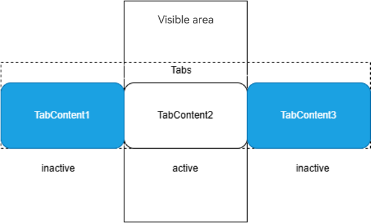
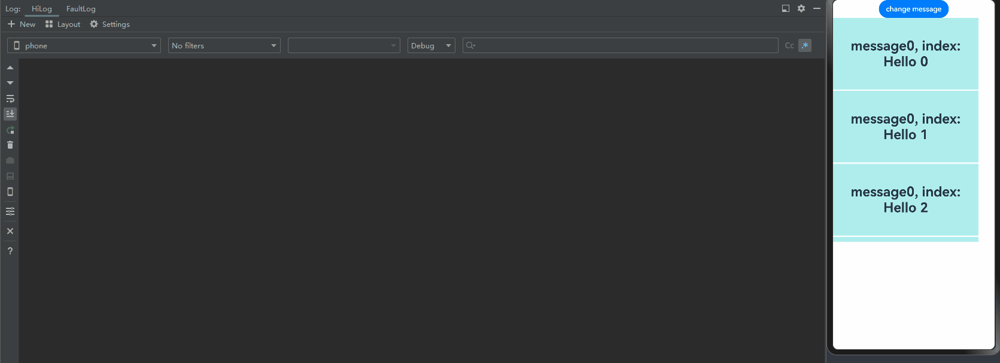
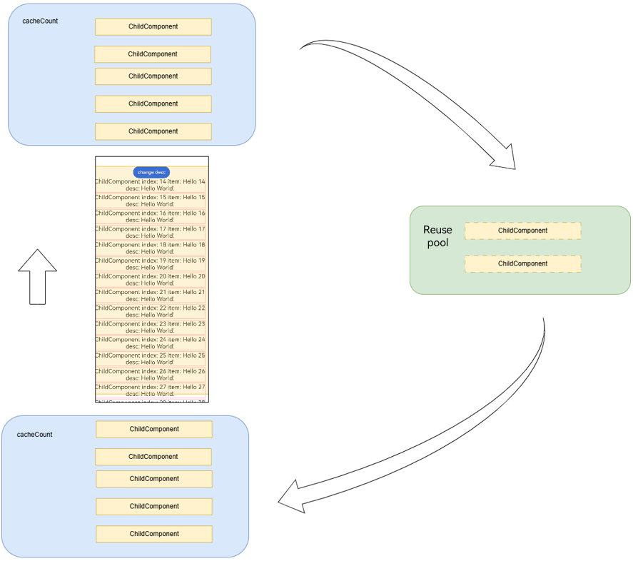
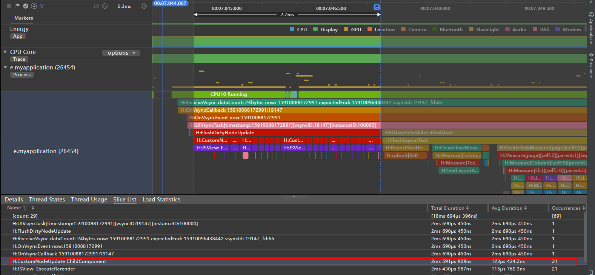
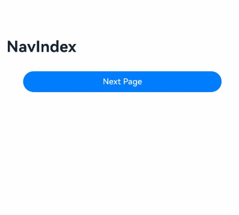
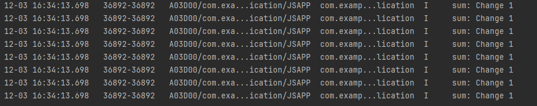
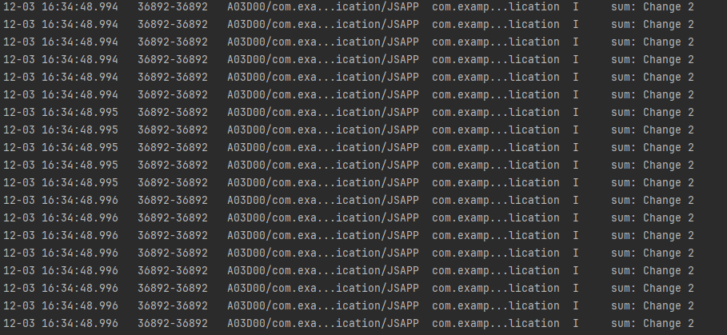
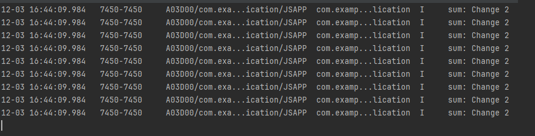

# Freezing a Custom Component

Freezing a custom component is designed to optimize the performance of complex UI pages, especially for scenarios where multiple page stacks, long lists, or grid layouts are involved. In these cases, when the state variable is bound to multiple UI components, the change of the state variables may trigger the re-render of a large number of UI components, resulting in frame freezing and response delay. To improve the UI re-render performance, you can try to use the custom component freezing function.

Principles of freezing a component are as follows:
1. Setting the **freezeWhenInactive** attribute to activate the component freezing mechanism.
2. After this function is enabled, the system re-renders only the activated custom components. In this way, the UI framework can narrow down the re-render scope to the (activated) custom components that are visible to users, improving the re-render efficiency in complex UI scenarios.
3. When an inactive custom component turns into the active state, the state management framework performs necessary re-render operations on the custom component to ensure that the UI is correctly displayed.

In short, component freezing aims to optimize UI re-render performance on complex UIs. When there are multiple invisible custom components, such as multiple page stacks, long lists, or grids, you can freeze the components to re-render visible custom components as required, and the re-render of the invisible custom components is delayed until they become visible.

Note that the active or inactive state of a component is not equivalent to its visibility. Component freezing applies only to the following scenarios:

1. Page routing: The current top page of the navigation stack is in the active state, and the non-top invisible page is in the inactive state.
2. TabContent: Only the custom component in the currently displayed TabContent is in the active state.
3. LazyForEach: Only the custom component in the currently displayed LazyForEach is in the active state, and the component of the cache node is in the inactive state.
4. Navigation: Only the custom component in the currently displayed NavDestination is in the active state.
5. Component reuse: The component that enters the reuse pool is in the inactive state, and the node attached from the reuse pool is in the active state.
6. Mixed use: For example, if **LazyForEach** is used under **TabContent**, all nodes in **LazyForEach** of API version 17 or earlier are set to the active state since when switching tabs. Since API version 18, only the on-screen nodes of **LazyForEach** are set to the active state, and other nodes are set to the inactive state.

Before reading this topic, you are advised to read [Creating a Custom Component](./arkts-create-custom-components.md) to learn about the basic syntax.

> **NOTE**
>
> Custom component freezing is supported since API version 11.
>
> Mixed use of custom component freezing is supported since API version 18.

## Use Scenarios

### Page Routing

> **NOTE**
>
> This example uses router for page redirection but you are advised to use the **Navigation** component instead, because **Navigation** provides more functions and more flexible customization capabilities. For details, see the use cases of [Navigation](#navigation).

When page 1 calls the **router.pushUrl** API to jump to page 2, page 1 is hidden and invisible. In this case, if the state variable on page 1 is updated, page 1 is not re-rendered.
For details, see the following.


Page 1

```ts
import { router } from '@kit.ArkUI';

@Entry
@Component({ freezeWhenInactive: true })
struct Page1 {
  @StorageLink('PropA') @Watch("first") storageLink: number = 47;

  first() {
    console.info("first page " + `${this.storageLink}`)
  }

  build() {
    Column() {
      Text(`From first Page ${this.storageLink}`).fontSize(50)
      Button('first page storageLink + 1').fontSize(30)
        .onClick(() => {
          this.storageLink += 1
        })
      Button('go to next page').fontSize(30)
        .onClick(() => {
          router.pushUrl({ url: 'pages/Page2' })
        })
    }
  }
}
```

Page 2

```ts
import { router } from '@kit.ArkUI';

@Entry
@Component({ freezeWhenInactive: true })
struct Page2 {
  @StorageLink('PropA') @Watch("second") storageLink2: number = 1;

  second() {
    console.info("second page: " + `${this.storageLink2}`)
  }

  build() {
    Column() {

      Text(`second Page ${this.storageLink2}`).fontSize(50)
      Button('Change Divider.strokeWidth')
        .onClick(() => {
          router.back()
        })

      Button('second page storageLink2 + 2').fontSize(30)
        .onClick(() => {
          this.storageLink2 += 2
        })

    }
  }
}
```

In the preceding example:

1. When the button **first page storageLink + 1** on page 1 is clicked, the **storageLink** state variable is updated, and the @Watch decorated **first** method is called.

2. Through **router.pushUrl({url:'pages/second'})**, page 2 is displayed, and page 1 is hidden with its state changing from active to inactive.

3. When the button **this.storageLink2 += 2** on page 2 is clicked, only the @Watch decorated **second** method of page 2 is called, because page 1 has been frozen when inactive.

4. When the **back** button is clicked, page 2 is destroyed, and page 1 changes from inactive to active. At this time, if the state variable of page 1 is updated, the @Watch decorated **first** method of page 1 is called again.


### TabContent

- You can freeze invisible **TabContent** components in the **Tabs** container so that they do not trigger UI re-rendering.

- During initial rendering, only the **TabContent** component that is being displayed is created. All **TabContent** components are created only after all of them have been switched to.

For details, see the following.


```ts
@Entry
@Component
struct TabContentTest {
  @State @Watch("onMessageUpdated") message: number = 0;
  private data: number[] = [0, 1]

  onMessageUpdated() {
    console.info(`TabContent message callback func ${this.message}`)
  }

  build() {
    Row() {
      Column() {
        Button('change message').onClick(() => {
          this.message++
        })

        Tabs() {
          ForEach(this.data, (item: number) => {
            TabContent() {
              FreezeChild({ message: this.message, index: item })
            }.tabBar(`tab${item}`)
          }, (item: number) => item.toString())
        }
      }
      .width('100%')
    }
    .height('100%')
  }
}

@Component({ freezeWhenInactive: true })
struct FreezeChild {
  @Link @Watch("onMessageUpdated") message: number
  private index: number = 0

  onMessageUpdated() {
    console.info(`FreezeChild message callback func ${this.message}, index: ${this.index}`)
  }

  build() {
    Text("message" + `${this.message}, index: ${this.index}`)
      .fontSize(50)
      .fontWeight(FontWeight.Bold)
  }
}
```

In the preceding example:

1. When **change message** is clicked, the value of **message** changes, and the @Watch decorated **onMessageUpdated** method of the **TabContent** component being displayed is called.

2. When you click **two** to switch to another **TabContent** component, it switches from inactive to active, and the corresponding @Watch decorated **onMessageUpdated** method is called.

3. When **change message** is clicked again, the value of **message** changes, and only the @Watch decorated **onMessageUpdated** method of the **TabContent** component being displayed is called.


### LazyForEach

- You can freeze custom components cached in **LazyForEach** so that they do not trigger UI re-rendering.

```ts
// Basic implementation of IDataSource used to listening for data.
class BasicDataSource implements IDataSource {
  private listeners: DataChangeListener[] = [];
  private originDataArray: string[] = [];

  public totalCount(): number {
    return 0;
  }

  public getData(index: number): string {
    return this.originDataArray[index];
  }

  // This method is called by the framework to add a listener to the LazyForEach data source.
  registerDataChangeListener(listener: DataChangeListener): void {
    if (this.listeners.indexOf(listener) < 0) {
      console.info('add listener');
      this.listeners.push(listener);
    }
  }

  // This method is called by the framework to remove the listener from the LazyForEach data source.
  unregisterDataChangeListener(listener: DataChangeListener): void {
    const pos = this.listeners.indexOf(listener);
    if (pos >= 0) {
      console.info('remove listener');
      this.listeners.splice(pos, 1);
    }
  }

  // Notify LazyForEach that all child components need to be reloaded.
  notifyDataReload(): void {
    this.listeners.forEach(listener => {
      listener.onDataReloaded();
    })
  }

  // Notify LazyForEach that a child component needs to be added for the data item with the specified index.
  notifyDataAdd(index: number): void {
    this.listeners.forEach(listener => {
      listener.onDataAdd(index);
    })
  }

  // Notify LazyForEach that the data item with the specified index has changed and the child component needs to be rebuilt.
  notifyDataChange(index: number): void {
    this.listeners.forEach(listener => {
      listener.onDataChange(index);
    })
  }

  // Notify LazyForEach that the child component that matches the specified index needs to be deleted.
  notifyDataDelete(index: number): void {
    this.listeners.forEach(listener => {
      listener.onDataDelete(index);
    })
  }
}

class MyDataSource extends BasicDataSource {
  private dataArray: string[] = [];

  public totalCount(): number {
    return this.dataArray.length;
  }

  public getData(index: number): string {
    return this.dataArray[index];
  }

  public addData(index: number, data: string): void {
    this.dataArray.splice(index, 0, data);
    this.notifyDataAdd(index);
  }

  public pushData(data: string): void {
    this.dataArray.push(data);
    this.notifyDataAdd(this.dataArray.length - 1);
  }
}

@Entry
@Component
struct LforEachTest {
  private data: MyDataSource = new MyDataSource();
  @State @Watch("onMessageUpdated") message: number = 0;

  onMessageUpdated() {
    console.info(`LazyforEach message callback func ${this.message}`)
  }

  aboutToAppear() {
    for (let i = 0; i <= 20; i++) {
      this.data.pushData(`Hello ${i}`)
    }
  }

  build() {
    Column() {
      Button('change message').onClick(() => {
        this.message++
      })
      List({ space: 3 }) {
        LazyForEach(this.data, (item: string) => {
          ListItem() {
            FreezeChild({ message: this.message, index: item })
          }
        }, (item: string) => item)
      }.cachedCount(5).height(500)
    }

  }
}

@Component({ freezeWhenInactive: true })
struct FreezeChild {
  @Link @Watch("onMessageUpdated") message: number;
  private index: string = "";

  aboutToAppear() {
    console.info(`FreezeChild aboutToAppear index: ${this.index}`)
  }

  onMessageUpdated() {
    console.info(`FreezeChild message callback func ${this.message}, index: ${this.index}`)
  }

  build() {
    Text("message" + `${this.message}, index: ${this.index}`)
      .width('90%')
      .height(160)
      .backgroundColor(0xAFEEEE)
      .textAlign(TextAlign.Center)
      .fontSize(30)
      .fontWeight(FontWeight.Bold)
  }
}
```

In the preceding example:

1. When **change message** is clicked, the value of **message** changes, the @Watch decorated **onMessageUpdated** method of the list items being displayed is called, and that of the cached list items is not called. (If the component is not frozen, the @Watch decorated **onMessageUpdated** method of both list items that are being displayed and cached list items is called.)

2. When a list item moves from outside the list content area into the list content area, it switches from inactive to active, and the corresponding @Watch decorated **onMessageUpdated** method is called.

3. When **change message** is clicked again, the value of **message** changes, and only the @Watch decorated **onMessageUpdated** method of the list items being displayed is called.



### Navigation

- When the navigation destination page is invisible, its child custom components are set to the inactive state and will not be re-rendered. When return to this page, its child custom components are restored to the active state and the @Watch callback is triggered to re-render the page.

- In the following example, **NavigationContentMsgStack** is set to the inactive state, which does not respond to the change of the state variables, and does not trigger component re-rendering.

```ts
@Entry
@Component
struct MyNavigationTestStack {
  @Provide('pageInfo') pageInfo: NavPathStack = new NavPathStack();
  @State @Watch("info") message: number = 0;
  @State logNumber: number = 0;

  info() {
    console.info(`freeze-test MyNavigation message callback ${this.message}`);
  }

  @Builder
  PageMap(name: string) {
    if (name === 'pageOne') {
      pageOneStack({ message: this.message, logNumber: this.logNumber })
    } else if (name === 'pageTwo') {
      pageTwoStack({ message: this.message, logNumber: this.logNumber })
    } else if (name === 'pageThree') {
      pageThreeStack({ message: this.message, logNumber: this.logNumber })
    }
  }

  build() {
    Column() {
      Button('change message')
        .onClick(() => {
          this.message++;
        })
      Navigation(this.pageInfo) {
        Column() {
          Button('Next Page', { stateEffect: true, type: ButtonType.Capsule })
            .width('80%')
            .height(40)
            .margin(20)
            .onClick(() => {
              this.pageInfo.pushPath({ name: 'pageOne' }); // Push the navigation destination page specified by name to the navigation stack.
            })
        }
      }.title('NavIndex')
      .navDestination(this.PageMap)
      .mode(NavigationMode.Stack)
    }
  }
}

@Component
struct pageOneStack {
  @Consume('pageInfo') pageInfo: NavPathStack;
  @State index: number = 1;
  @Link message: number;
  @Link logNumber: number;

  build() {
    NavDestination() {
      Column() {
        NavigationContentMsgStack({ message: this.message, index: this.index, logNumber: this.logNumber })
        Text("cur stack size:" + `${this.pageInfo.size()}`)
          .fontSize(30)
          .fontWeight(FontWeight.Bold)
        Button('Next Page', { stateEffect: true, type: ButtonType.Capsule })
          .width('80%')
          .height(40)
          .margin(20)
          .onClick(() => {
            this.pageInfo.pushPathByName('pageTwo', null);
          })
        Button('Back Page', { stateEffect: true, type: ButtonType.Capsule })
          .width('80%')
          .height(40)
          .margin(20)
          .onClick(() => {
            this.pageInfo.pop();
          })
      }.width('100%').height('100%')
    }.title('pageOne')
    .onBackPressed(() => {
      this.pageInfo.pop();
      return true;
    })
  }
}

@Component
struct pageTwoStack {
  @Consume('pageInfo') pageInfo: NavPathStack;
  @State index: number = 2;
  @Link message: number;
  @Link logNumber: number;

  build() {
    NavDestination() {
      Column() {
        NavigationContentMsgStack({ message: this.message, index: this.index, logNumber: this.logNumber })
        Text("cur stack size:" + `${this.pageInfo.size()}`)
          .fontSize(30)
          .fontWeight(FontWeight.Bold)
        Button('Next Page', { stateEffect: true, type: ButtonType.Capsule })
          .width('80%')
          .height(40)
          .margin(20)
          .onClick(() => {
            this.pageInfo.pushPathByName('pageThree', null);
          })
        Button('Back Page', { stateEffect: true, type: ButtonType.Capsule })
          .width('80%')
          .height(40)
          .margin(20)
          .onClick(() => {
            this.pageInfo.pop();
          })
      }.width('100%').height('100%')
    }.title('pageTwo')
    .onBackPressed(() => {
      this.pageInfo.pop();
      return true;
    })
  }
}

@Component
struct pageThreeStack {
  @Consume('pageInfo') pageInfo: NavPathStack;
  @State index: number = 3;
  @Link message: number;
  @Link logNumber: number;

  build() {
    NavDestination() {
      Column() {
        NavigationContentMsgStack({ message: this.message, index: this.index, logNumber: this.logNumber })
        Text("cur stack size:" + `${this.pageInfo.size()}`)
          .fontSize(30)
          .fontWeight(FontWeight.Bold)
        Button('Next Page', { stateEffect: true, type: ButtonType.Capsule })
          .width('80%')
          .height(40)
          .margin(20)
          .onClick(() => {
            this.pageInfo.pushPathByName('pageOne', null);
          })
        Button('Back Page', { stateEffect: true, type: ButtonType.Capsule })
          .width('80%')
          .height(40)
          .margin(20)
          .onClick(() => {
            this.pageInfo.pop();
          })
      }.width('100%').height('100%')
    }.title('pageThree')
    .onBackPressed(() => {
      this.pageInfo.pop();
      return true;
    })
  }
}

@Component({ freezeWhenInactive: true })
struct NavigationContentMsgStack {
  @Link @Watch("info") message: number;
  @Link index: number;
  @Link logNumber: number;

  info() {
    console.info(`freeze-test NavigationContent message callback ${this.message}`);
    console.info(`freeze-test ---- called by content ${this.index}`);
    this.logNumber++;
  }

  build() {
    Column() {
      Text("msg:" + `${this.message}`)
        .fontSize(30)
        .fontWeight(FontWeight.Bold)
      Text("log number:" + `${this.logNumber}`)
        .fontSize(30)
        .fontWeight(FontWeight.Bold)
    }
  }
}
```

In the preceding example:

1. When **change message** is clicked, the value of **message** changes, and the @Watch decorated **info** method of the **MyNavigationTestStack** component being displayed is called.

2. When **Next Page** is clicked, **PageOne** is displayed, and the **PageOneStack** node is created.

3. When **change message** is clicked again, the value of **message** changes, and only the @Watch decorated **info** method of the **NavigationContentMsgStack** child component in **pageOneStack** is called.

4. When **Next Page** is clicked again, **PageTwo** is displayed, and the **pageTwoStack** node is created.

5. When **change message** is clicked again, the value of **message** changes, and only the @Watch decorated **info** method of the **NavigationContentMsgStack** child component in **pageTwoStack** is called.

6. When **Next Page** is clicked again, **PageThree** is displayed, and the **pageThreeStack** node is created.

7. When **change message** is clicked again, the value of **message** changes, and only the @Watch decorated **info** method of the **NavigationContentMsgStack** child component in **pageThreeStack** is called.

8. When **Back Page** is clicked, **PageTwo** is displayed, and only the @Watch decorated **info** method of the **NavigationContentMsgStack** child component in **pageTwoStack** is called.

9. When **Back Page** is clicked again, **PageOne** is displayed, and only the @Watch decorated **info** method of the **NavigationContentMsgStack** child component in **pageOneStack** is called.

10. When **Back Page** is clicked again, the initial page is displayed, and no method is called.


### Reusing Components

[Components reuse](./arkts-reusable.md) existing nodes in the cache pool instead of creating new nodes to optimize UI performance and improve application smoothness. Although the nodes in the reuse pool are not displayed in the UI component tree, the change of the state variable still triggers the UI re-render. To solve the problem that components in the reuse pool are re-rendered abnormally, you can perform component freezing.

#### Mixed Use of Component Reuse, if, and Component Freezing
The following example shows that when the state variable bound to the **if** component changes to **false**, the detach of **ChildComponent** is triggered. Because **ChildComponent** is marked as component reuse, it is not destroyed but enters the reuse pool, in this case, if the component freezing is enabled at the same time, the component will not be re-rendered in the reuse pool.
The procedure is as follows:
1. Click **change flag** and change the value of **flag** to **false**.
    -  When **ChildComponent** marked with \@Reusable is detached, it is not destroyed. Instead, it enters the reuse pool, triggers the **aboutToRecycle** lifecycle, and sets the component state to inactive.
    - **ChildComponent** also enables component freezing. When **ChildComponent** is in the inactive state, it does not respond to any UI re-render caused by state variable changes.
2. Click **change desc** to trigger the change of the member variable **desc** of **Page**.
    - The change of \@State decorated **desc** will be notified to \@Link decorated **desc** of **ChildComponent**.
    - However, **ChildComponent** is in the inactive state and the component freezing is enabled. Therefore, the change does not trigger the callback of @Watch('descChange') and the re-render of the `ChildComponent` UI. If component freezing is not enabled, the current @Watch('descChange') callback is returned immediately, and **ChildComponent** in the reuse pool is re-rendered accordingly.
3. Click **change flag** again and change the value of **flag** to **true**.
    - **ChildComponent** is attached to the component tree from the reuse pool.
    - Return the **aboutToReuse** lifecycle callback and synchronize the latest **count** value to **ChildComponent**. The value of **desc** is synchronized from @State to @Link. Therefore, you do not need to manually assign a value to **aboutToReuse**.
    - Set **ChildComponent** to the active state and re-render the component that is not re-rendered when **ChildComponent** is inactive, for example, **Text (ChildComponent desc: ${this.desc})**.


```ts
@Reusable
@Component({freezeWhenInactive: true})
struct ChildComponent {
  @Link @Watch('descChange') desc: string;
  @State count: number = 0;
  descChange() {
    console.info(`ChildComponent messageChange ${this.desc}`);
  }

  aboutToReuse(params: Record<string, ESObject>): void {
    this.count = params.count as number;
  }

  aboutToRecycle(): void {
    console.info(`ChildComponent has been recycled`);
  }
  build() {
    Column() {
      Text(`ChildComponent desc: ${this.desc}`)
        .fontSize(20)
      Text(`ChildComponent count ${this.count}`)
        .fontSize(20)
    }.border({width: 2, color: Color.Pink})
  }
}

@Entry
@Component
struct Page {
  @State desc: string = 'Hello World';
  @State flag: boolean = true;
  @State count: number = 0;
  build() {
    Column() {
      Button(`change desc`).onClick(() => {
        this.desc += '!';
      })
      Button(`change flag`).onClick(() => {
        this.count++;
        this.flag =! this.flag;
      })
      if (this.flag) {
        ChildComponent({desc: this.desc, count: this.count})
      }
    }
    .height('100%')
  }
}
```
#### Mixed Use of LazyForEach, Component Reuse, and Component Freezing
In the scrolling scenario of a long list with a large amount of data, you can use **LazyForEach** to create components as required. In addition, you can reuse components to reduce the overhead caused by component creation and destruction during scrolling.
However, if you set [reuseId](../../performance/component-recycle.md#available-apis) based on the reuse type or assign a large value to **cacheCount** to ensure the scrolling performance, more nodes will be cached in the reuse pool or **LazyForEach**.
In this case, if you trigger the re-render of all subnodes in **List**, the number of re-renders is too large. In this case, you can freeze the component.

Example:
1. Swipe the list to the position whose index is 14. There are 15 **ChildComponent** in the visible area on the current page.
2. During swiping:
    - **ChildComponent** in the upper part of the list is swiped out of the visible area. In this case, **ChildComponent** enters the cache area of LazyForEach and is set to inactive. After the component slides out of the **LazyForEach** cache area, the component is not destructed and enters the reuse pool because the component is marked for reuse. In this case, the component is set to inactive again.
    - The cache node of **LazyForEach** at the bottom of the list enters the list. In this case, the system attempts to create a node to enter the cache of **LazyForEach**. If a node that can be reused is found, the system takes out the existing node from the reuse pool and triggers the **aboutToReuse** lifecycle callback, in this case, the node enters the cache area of **LazyForEach** and the state of the node is still inactive.
3. Click **change desc** to trigger the change of the member variable **desc** of **Page**.
    - The change of \@State decorated **desc** will be notified to \@Link decorated **desc** of **ChildComponent**.
    - **ChildComponent** in the invisible area is in the inactive state, and the component freezing is enabled. Therefore, this change triggers the @Watch('descChange') callback of the 15 nodes in the visible area and re-renders these nodes. Nodes cached in **LazyForEach** and the reuse pool are not re-rendered, and the \@Watch callback is not triggered.
    

For details, see the following.

You can listen for the changes by \@Trace, only 15 **ChildComponent** nodes are re-rendered.

A complete sample code is as follows:
```ts
import { hiTraceMeter } from '@kit.PerformanceAnalysisKit';
// Basic implementation of IDataSource used to listening for data.
class BasicDataSource implements IDataSource {
  private listeners: DataChangeListener[] = [];
  private originDataArray: string[] = [];

  public totalCount(): number {
    return 0;
  }

  public getData(index: number): string {
    return this.originDataArray[index];
  }

  // This method is called by the framework to add a listener to the LazyForEach data source.
  registerDataChangeListener(listener: DataChangeListener): void {
    if (this.listeners.indexOf(listener) < 0) {
      console.info('add listener');
      this.listeners.push(listener);
    }
  }

  // This method is called by the framework to remove the listener from the LazyForEach data source.
  unregisterDataChangeListener(listener: DataChangeListener): void {
    const pos = this.listeners.indexOf(listener);
    if (pos >= 0) {
      console.info('remove listener');
      this.listeners.splice(pos, 1);
    }
  }

  // Notify LazyForEach that all child components need to be reloaded.
  notifyDataReload(): void {
    this.listeners.forEach(listener => {
      listener.onDataReloaded();
    })
  }

  // Notify LazyForEach that a child component needs to be added for the data item with the specified index.
  notifyDataAdd(index: number): void {
    this.listeners.forEach(listener => {
      listener.onDataAdd(index);
    })
  }

  // Notify LazyForEach that the data item with the specified index has changed and the child component needs to be rebuilt.
  notifyDataChange(index: number): void {
    this.listeners.forEach(listener => {
      listener.onDataChange(index);
    })
  }

  // Notify LazyForEach that the child component that matches the specified index needs to be deleted.
  notifyDataDelete(index: number): void {
    this.listeners.forEach(listener => {
      listener.onDataDelete(index);
    })
  }

  // Notify LazyForEach that data needs to be swapped between the from and to positions.
  notifyDataMove(from: number, to: number): void {
    this.listeners.forEach(listener => {
      listener.onDataMove(from, to);
    })
  }
}

class MyDataSource extends BasicDataSource {
  private dataArray: string[] = [];

  public totalCount(): number {
    return this.dataArray.length;
  }

  public getData(index: number): string {
    return this.dataArray[index];
  }

  public addData(index: number, data: string): void {
    this.dataArray.splice(index, 0, data);
    this.notifyDataAdd(index);
  }

  public pushData(data: string): void {
    this.dataArray.push(data);
    this.notifyDataAdd(this.dataArray.length - 1);
  }
}

@Reusable
@Component({freezeWhenInactive: true})
struct ChildComponent {
  @Link @Watch('descChange') desc: string;
  @State item: string = '';
  @State index: number = 0;
  descChange() {
    console.info(`ChildComponent messageChange ${this.desc}`);
  }

  aboutToReuse(params: Record<string, ESObject>): void {
    this.item = params.item;
    this.index = params.index;
  }

  aboutToRecycle(): void {
    console.info(`ChildComponent has been recycled`);
  }
  build() {
    Column() {
      Text(`ChildComponent index: ${this.index} item: ${this.item}`)
        .fontSize(20)
      Text(`desc: ${this.desc}`)
        .fontSize(20)
    }.border({width: 2, color: Color.Pink})
  }
}

@Entry
@Component
struct Page {
  @State desc: string = 'Hello World';
  private data: MyDataSource = new MyDataSource();

  aboutToAppear() {
    for (let i = 0; i < 50; i++) {
      this.data.pushData(`Hello ${i}`);
    }
  }

  build() {
    Column() {
      Button(`change desc`).onClick(() => {
        hiTraceMeter.startTrace('change decs', 1);
        this.desc += '!';
        hiTraceMeter.finishTrace('change decs', 1);
      })
      List({ space: 3 }) {
        LazyForEach(this.data, (item: string, index: number) => {
          ListItem() {
            ChildComponent({index: index, item: item, desc: this.desc}).reuseId(index % 10 < 5 ? "1": "0")
          }
        }, (item: string) => item)
      }.cachedCount(5)
    }
    .height('100%')
  }
}
```
#### Mixed Use of LazyForEach, if, Component Reuse, and Component Freezing

 Under the same parent custom component, reusable nodes may enter the reuse pool in different ways. For example:
- Detaching from the cache area of LazyForEach by swiping.
- Notifying the subnodes to detach by switching the if condition.

In the following example:
1. When you swipe the list to the position whose index is 14, there are 10 **ChildComponent**s in the visible area on the page, among which nine are subnodes of **LazyForEach** and one is a subnode of **if**.
2. Click **change flag**. The **if** condition is changed to **false**, and its subnode **ChildComponent** enters the reuse pool. Nine nodes are displayed on the page.
3. In this case, the nodes detached through **LazyForEach** or **if** all enter the reuse pool under the **Page** node.
4. Click **change desc** to update only the nine **ChildComponent** nodes on the page. For details, see figures below.
5. Click **change flag** again. The **if** condition changes to **true**, and **ChildComponent** is attached from the reuse pool to the component tree again. The state of **ChildComponent** changes to active.
6. Click **change desc** again. The nodes attached through **if** and **LazyForEach** from the reuse pool can be re-rendered.

Trace for component freezing enabled


Trace for component freezing disabled




A complete example is as follows:
```
import { hiTraceMeter } from '@kit.PerformanceAnalysisKit';
class BasicDataSource implements IDataSource {
  private listeners: DataChangeListener[] = [];
  private originDataArray: string[] = [];

  public totalCount(): number {
    return 0;
  }

  public getData(index: number): string {
    return this.originDataArray[index];
  }

  // This method is called by the framework to add a listener to the LazyForEach data source.
  registerDataChangeListener(listener: DataChangeListener): void {
    if (this.listeners.indexOf(listener) < 0) {
      console.info('add listener');
      this.listeners.push(listener);
    }
  }

  // This method is called by the framework to remove the listener from the LazyForEach data source.
  unregisterDataChangeListener(listener: DataChangeListener): void {
    const pos = this.listeners.indexOf(listener);
    if (pos >= 0) {
      console.info('remove listener');
      this.listeners.splice(pos, 1);
    }
  }

  // Notify LazyForEach that all child components need to be reloaded.
  notifyDataReload(): void {
    this.listeners.forEach(listener => {
      listener.onDataReloaded();
    })
  }

  // Notify LazyForEach that a child component needs to be added for the data item with the specified index.
  notifyDataAdd(index: number): void {
    this.listeners.forEach(listener => {
      listener.onDataAdd(index);
    })
  }

  // Notify LazyForEach that the data item with the specified index has changed and the child component needs to be rebuilt.
  notifyDataChange(index: number): void {
    this.listeners.forEach(listener => {
      listener.onDataChange(index);
    })
  }

  // Notify LazyForEach that the child component that matches the specified index needs to be deleted.
  notifyDataDelete(index: number): void {
    this.listeners.forEach(listener => {
      listener.onDataDelete(index);
    })
  }

  // Notify LazyForEach that data needs to be swapped between the from and to positions.
  notifyDataMove(from: number, to: number): void {
    this.listeners.forEach(listener => {
      listener.onDataMove(from, to);
    })
  }
}

class MyDataSource extends BasicDataSource {
  private dataArray: string[] = [];

  public totalCount(): number {
    return this.dataArray.length;
  }

  public getData(index: number): string {
    return this.dataArray[index];
  }

  public addData(index: number, data: string): void {
    this.dataArray.splice(index, 0, data);
    this.notifyDataAdd(index);
  }

  public pushData(data: string): void {
    this.dataArray.push(data);
    this.notifyDataAdd(this.dataArray.length - 1);
  }
}

@Reusable
@Component({freezeWhenInactive: true})
struct ChildComponent {
  @Link @Watch('descChange') desc: string;
  @State item: string = '';
  @State index: number = 0;
  descChange() {
    console.info(`ChildComponent messageChange ${this.desc}`);
  }

  aboutToReuse(params: Record<string, ESObject>): void {
    this.item = params.item;
    this.index = params.index;
  }

  aboutToRecycle(): void {
    console.info(`ChildComponent has been recycled`);
  }
  build() {
    Column() {
      Text(`ChildComponent index: ${this.index} item: ${this.item}`)
        .fontSize(20)
      Text(`desc: ${this.desc}`)
        .fontSize(20)
    }.border({width: 2, color: Color.Pink})
  }
}

@Entry
@Component
struct Page {
  @State desc: string = 'Hello World';
  @State flag: boolean = true;
  private data: MyDataSource = new MyDataSource();

  aboutToAppear() {
    for (let i = 0; i < 50; i++) {
      this.data.pushData(`Hello ${i}`);
    }
  }

  build() {
    Column() {
      Button(`change desc`).onClick(() => {
        hiTraceMeter.startTrace('change decs', 1);
        this.desc += '!';
        hiTraceMeter.finishTrace('change decs', 1);
      })

      Button(`change flag`).onClick(() => {
        hiTraceMeter.startTrace('change flag', 1);
        this.flag = !this.flag;
        hiTraceMeter.finishTrace('change flag', 1);
      })

      List({ space: 3 }) {
        LazyForEach(this.data, (item: string, index: number) => {
          ListItem() {
            ChildComponent({index: index, item: item, desc: this.desc}).reuseId(index % 10 < 5 ? "1": "0")
          }
        }, (item: string) => item)
      }
      .cachedCount(5)
      .height('60%')

      if (this.flag) {
        ChildComponent({index: -1, item: 'Hello', desc: this.desc}).reuseId( "1")
      }
    }
    .height('100%')
  }
}
```

### Mixing the Use of Components

In the scenario where mixed use of component freezing is supported, the freezing behavior varies according to the API version. Set the component freezing flag for the parent component. In API version 17 or earlier, when the parent component is unfrozen, all nodes of its child components are unfrozen. Since API version 18, when the parent component is unfrozen, only the on-screen nodes of the child component are unfrozen. 

#### Mixed Use of Navigation and TabContent

The sample code is as follows:

```ts
// index.ets
@Component
struct ChildOfParamComponent {
  @Prop @Watch('onChange') child_val: number;

  onChange() {
    console.log(`Appmonitor ChildOfParamComponent: child_val changed:${this.child_val}`);
  }

  build() {
    Column() {
      Text(`Child Param: ${this.child_val}`);
    }
  }
}

@Component
struct ParamComponent {
  @Prop @Watch('onChange')  paramVal: number;

  onChange() {
    console.log(`Appmonitor ParamComponent: paramVal changed:${this.paramVal}`);
  }

  build() {
    Column() {
      Text(`val: ${this.paramVal}`)
      ChildOfParamComponent({child_val: this.paramVal});
    }
  }
}


@Component
struct DelayComponent {
  @Prop @Watch('onChange') delayVal: number;

  onChange() {
    console.log(`Appmonitor ParamComponent: delayVal changed:${this.delayVal}`);
  }


  build() {
    Column() {
      Text(`Delay Param: ${this.delayVal}`);
    }
  }
}

@Component ({freezeWhenInactive: true})
struct TabsComponent {
  private controller: TabsController = new TabsController();
  @State @Watch('onChange') tabState: number = 47;

  onChange() {
    console.log(`Appmonitor TabsComponent: tabState changed:${this.tabState}`);
  }

  build() {
    Column({space: 10}) {
      Button(`Incr state ${this.tabState}`)
        .fontSize(25)
        .onClick(() => {
          console.log('Button increment state value');
          this.tabState = this.tabState + 1;
        })

      Tabs({ barPosition: BarPosition.Start, index: 0, controller: this.controller}) {
        TabContent() {
          ParamComponent({paramVal: this.tabState});
        }.tabBar('Update')
        TabContent() {
          DelayComponent({delayVal: this.tabState});
        }.tabBar('DelayUpdate')
      }
      .vertical(false)
      .scrollable(true)
      .barMode(BarMode.Fixed)
      .barWidth(400).barHeight(150).animationDuration(400)
      .width('100%')
      .height(200)
      .backgroundColor(0xF5F5F5)
    }
  }
}

@Entry
@Component
struct MyNavigationTestStack {
  @Provide('pageInfo') pageInfo: NavPathStack = new NavPathStack();

  @Builder
  PageMap(name: string) {
    if (name === 'pageOne') {
      pageOneStack()
    } else if (name === 'pageTwo') {
      pageTwoStack()
    }
  }

  build() {
    Column() {
      Navigation(this.pageInfo) {
        Column() {
          Button('Next Page', { stateEffect: true, type: ButtonType.Capsule })
            .width('80%')
            .height(40)
            .margin(20)
            .onClick(() => {
              this.pageInfo.pushPath({ name: 'pageOne' }); // Push the navigation destination page specified by name to the navigation stack.
            })
        }
      }.title('NavIndex')
      .navDestination(this.PageMap)
      .mode(NavigationMode.Stack)
    }
  }
}

@Component
struct pageOneStack {
  @Consume('pageInfo') pageInfo: NavPathStack;

  build() {
    NavDestination() {
      Column() {
        TabsComponent();

        Button('Next Page', { stateEffect: true, type: ButtonType.Capsule })
          .width('80%')
          .height(40)
          .margin(20)
          .onClick(() => {
            this.pageInfo.pushPathByName('pageTwo', null);
          })
      }.width('100%').height('100%')
    }.title('pageOne')
    .onBackPressed(() => {
      this.pageInfo.pop();
      return true;
    })
  }
}

@Component
struct pageTwoStack {
  @Consume('pageInfo') pageInfo: NavPathStack;

  build() {
    NavDestination() {
      Column() {
        Button('Back Page', { stateEffect: true, type: ButtonType.Capsule })
          .width('80%')
          .height(40)
          .margin(20)
          .onClick(() => {
            this.pageInfo.pop();
          })
      }.width('100%').height('100%')
    }.title('pageTwo')
    .onBackPressed(() => {
      this.pageInfo.pop();
      return true;
    })
  }
}
```

Final effect



Click the **Next Page** button to enter the **pageOne** page. There are two tabs on the page and the **Update** tab is displayed by default. Enable component freezing. If the **Tabcontent** tab is not selected, the state variable is not refreshed.

Click the **Incr state** button to query **Appmonitor** in the log. Three records are displayed.


Switch to the **DelayUpdate** tab and click the **Incr state** button to query **Appmonitor** in the log. Two records are displayed. The state variable in the **DelayUpdate** tab does not refresh the state variable related to the **Update** tab.


For API version 17 or earlier:

Click **Next page** to enter the next page and then return. The tab is **DelayUpdate** by default. Click **Incr state** to query **Appmonitor** in the log and four records are displayed. When the page route is returned, all tabs of **Tabcontent** are unfrozen.


For API version 18 or later:

Click **Next page** to enter the next page and then return. The tab is **DelayUpdate** by default. Click **Incr state** to query **Appmonitor** in the log and two records are displayed. When the page route is returned, only the nodes with the corresponding tabs are unfrozen.


#### Page and LazyForEach

When **Navigation** and **TabContent** are used together, the child nodes of **TabContent** are unlocked because the child component is recursively unfrozen from the parent component when the previous page is displayed. In addition, the page lifecycle **OnPageShow** shows a similar behavior. **OnPageShow** sets the root node of the current page to the active state. As a subnode of the page, **TabContent** is also set to the active state. When the screen is turned off or on, the page lifecycles **OnPageHide** and **OnPageShow** are triggered respectively. Therefore, when **LazyForEach** is used on the page, manual screen-off and screen-on can also implement the page routing effect. The sample code is as follows:

```ts
import { hiTraceMeter } from '@kit.PerformanceAnalysisKit';
// Basic implementation of IDataSource used to listening for data.
class BasicDataSource implements IDataSource {
  private listeners: DataChangeListener[] = [];
  private originDataArray: string[] = [];

  public totalCount(): number {
    return 0;
  }

  public getData(index: number): string {
    return this.originDataArray[index];
  }

  // This method is called by the framework to add a listener to the LazyForEach data source.
  registerDataChangeListener(listener: DataChangeListener): void {
    if (this.listeners.indexOf(listener) < 0) {
      console.info('add listener');
      this.listeners.push(listener);
    }
  }

  // This method is called by the framework to remove the listener from the LazyForEach data source.
  unregisterDataChangeListener(listener: DataChangeListener): void {
    const pos = this.listeners.indexOf(listener);
    if (pos >= 0) {
      console.info('remove listener');
      this.listeners.splice(pos, 1);
    }
  }

  // Notify LazyForEach that all child components need to be reloaded.
  notifyDataReload(): void {
    this.listeners.forEach(listener => {
      listener.onDataReloaded();
    })
  }

  // Notify LazyForEach that a child component needs to be added for the data item with the specified index.
  notifyDataAdd(index: number): void {
    this.listeners.forEach(listener => {
      listener.onDataAdd(index);
    })
  }

  // Notify LazyForEach that the data item with the specified index has changed and the child component needs to be rebuilt.
  notifyDataChange(index: number): void {
    this.listeners.forEach(listener => {
      listener.onDataChange(index);
    })
  }

  // Notify LazyForEach that the child component that matches the specified index needs to be deleted.
  notifyDataDelete(index: number): void {
    this.listeners.forEach(listener => {
      listener.onDataDelete(index);
    })
  }

  // Notify LazyForEach that data needs to be swapped between the from and to positions.
  notifyDataMove(from: number, to: number): void {
    this.listeners.forEach(listener => {
      listener.onDataMove(from, to);
    })
  }
}

class MyDataSource extends BasicDataSource {
  private dataArray: string[] = [];

  public totalCount(): number {
    return this.dataArray.length;
  }

  public getData(index: number): string {
    return this.dataArray[index];
  }

  public addData(index: number, data: string): void {
    this.dataArray.splice(index, 0, data);
    this.notifyDataAdd(index);
  }

  public pushData(data: string): void {
    this.dataArray.push(data);
    this.notifyDataAdd(this.dataArray.length - 1);
  }
}

@Reusable
@Component({freezeWhenInactive: true})
struct ChildComponent {
  @State desc: string = '';
  @Link @Watch('sumChange') sum: number;

  sumChange() {
    console.info(`sum: Change ${this.sum}`);
  }

  aboutToReuse(params: Record<string, Object>): void {
    this.desc = params.desc as string;
    this.sum = params.sum as number;
  }

  aboutToRecycle(): void {
    console.info(`ChildComponent has been recycled`);
  }
  build() {
    Column() {
      Divider()
        .color('#ff11acb8')
      Text('Child component:' + this.desc)
        .fontSize(30)
        .fontWeight(30)
      Text(`${this.sum}`)
        .fontSize(30)
        .fontWeight(30)
    }
  }
}

@Entry
@Component ({freezeWhenInactive: true})
struct Page {
  private data: MyDataSource = new MyDataSource();
  @State sum: number = 0;
  @State desc: string = '';

  aboutToAppear() {
    for (let index = 0; index < 20; index++) {
      this.data.pushData(index.toString());
    }
  }

  build() {
    Column() {
      Button(`add sum`).onClick(() => {
        this.sum++;
      })
        .fontSize(30)
        .margin(20)
      List() {
        LazyForEach(this.data, (item: string) => {
          ListItem() {
            ChildComponent({desc: item, sum: this.sum});
          }
          .width('100%')
          .height(100)
        }, (item: string) => item)
      }.cachedCount(5)
    }
    .height('100%')
    .width('100%')
  }
}
```

As described in the mixed use scenario, the nodes of **LazyForEach** include the on-screen node and **cachedCount** node.


Swipe down **LazyForEach** to add nodes to **cachedCount**. Click the **add sum** button to search for the log "sum: Change." and eight records are displayed.



For API version 17 or earlier:

Turn off and on the screen to trigger **OnPageShow** and then click **add sum**. The number of printed records is equal to the number of on-screen nodes and the **cachedCount** nodes.



For API version 18 or later:

Turn off and on the screen to trigger **OnPageShow** and then click **add sum**. Only the number of on-screen nodes is displayed, and the **cachedCount** nodes are not unfrozen.



## Constraints

As shown in the following example, the custom node [BuilderNode](../../reference/apis-arkui/js-apis-arkui-builderNode.md) is used in **FreezeBuildNode**. **BuilderNode** can dynamically mount components using commands and component freezing strongly depends on the parent-child relationship to determine whether it is enabled. In this case, if the parent component is frozen and **BuilderNode** is enabled at the middle level of the component tree, the child component of the **BuilderNode** cannot be frozen.

```
import { BuilderNode, FrameNode, NodeController, UIContext } from '@kit.ArkUI';

// Define a Params class to pass parameters.
class Params {
  index: number = 0;

  constructor(index: number) {
    this.index = index;
  }
}

// Define a buildNodeChild component that contains a message attribute and an index attribute.
@Component
struct buildNodeChild {
  @StorageProp("buildNodeTest") @Watch("onMessageUpdated") message: string = "hello world";
  @State index: number = 0;

  // Call this method when message is updated.
  onMessageUpdated() {
    console.log(`FreezeBuildNode builderNodeChild message callback func ${this.message},index: ${this.index}`);
  }

  build() {
    Text(`buildNode Child message: ${this.message}`).fontSize(30)
  }
}

// Define a buildText function that receives a Params parameter and constructs a Column component.
@Builder
function buildText(params: Params) {
  Column() {
    buildNodeChild({ index: params.index })
  }
}

// Define a TextNodeController class that is inherited from NodeController.
class TextNodeController extends NodeController {
  private textNode: BuilderNode<[Params]> | null = null;
  private index: number = 0;

  // The constructor receives an index parameter.
  constructor(index: number) {
    super();
    this.index = index;
  }

  // Create and return a FrameNode.
  makeNode(context: UIContext): FrameNode | null {
    this.textNode = new BuilderNode(context);
    this.textNode.build(wrapBuilder<[Params]>(buildText), new Params(this.index));
    return this.textNode.getFrameNode();
  }
}

// Define an index component that contains a message attribute and a data array.
@Entry
@Component
struct Index {
  @StorageLink("buildNodeTest") message: string = "hello";
  private data: number[] = [0, 1];

  build() {
    Row() {
      Column() {
        Button("change").fontSize(30)
          .onClick(() => {
            this.message += 'a';
          })

        Tabs() {
          ForEach(this.data, (item: number) => {
            TabContent() {
              FreezeBuildNode({ index: item })
            }.tabBar(`tab${item}`)
          }, (item: number) => item.toString())
        }
      }
    }
    .width('100%')
    .height('100%')
  }
}

// Define a FreezeBuildNode component that contains a message attribute and an index attribute.
@Component({ freezeWhenInactive: true })
struct FreezeBuildNode {
  @StorageProp("buildNodeTest") @Watch("onMessageUpdated") message: string = "1111";
  @State index: number = 0;

  // Call this method when message is updated.
  onMessageUpdated() {
    console.log(`FreezeBuildNode message callback func ${this.message}, index: ${this.index}`);
  }

  build() {
    NodeContainer(new TextNodeController(this.index))
      .width('100%')
      .height('100%')
      .backgroundColor('#FFF0F0F0')
  }
}
```

In the preceding example:

Click **Button("change")** to change the value of **message**. The **onMessageUpdated** method registered in @Watch of the **TabContent** component that is being displayed is triggered, and that under the **BuilderNode** node of **TabContent** that is not displayed is also triggered.


