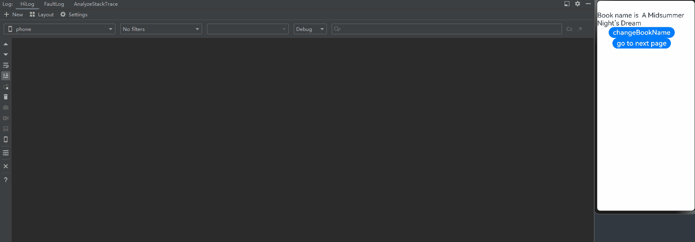
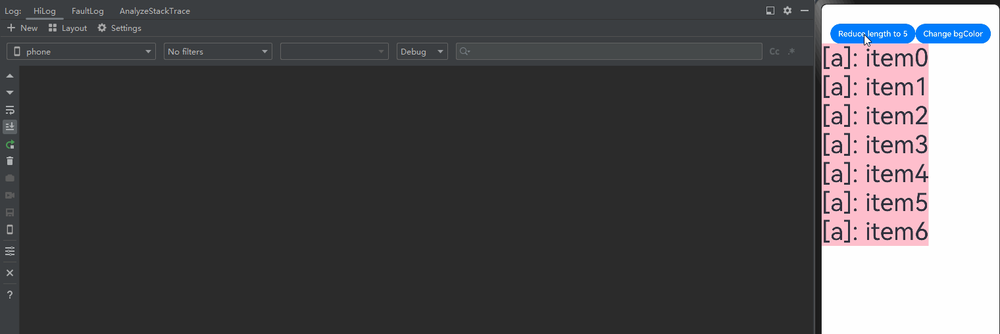

# Freezing a Custom Component
<!--Kit: ArkUI-->
<!--Subsystem: ArkUI-->
<!--Owner: @liwenzhen3-->
<!--Designer: @s10021109-->
<!--Tester: @TerryTsao-->
<!--Adviser: @zhang_yixin13-->

When a custom component decorated by @ComponentV2 is inactive, it can be frozen so that its state variables do not respond to updates. This means that the [@Monitor](./arkts-new-monitor.md) decorated callback will not be triggered, and any nodes associated with these state variables will not be re-rendered. This freezing mechanism offers significant performance benefits in complex UI scenarios. It prevents inactive components from performing unnecessary updates when their state variables update, thereby reducing resource consumption. You can use the **freezeWhenInactive** attribute to specify whether to enable the freezing feature. If no parameter is passed in, this feature is disabled. The freezing feature is supported in the following scenarios and components: [page navigation and routing](../../reference/apis-arkui/js-apis-router.md), [TabContent](../../reference/apis-arkui/arkui-ts/ts-container-tabcontent.md), [Navigation](../../reference/apis-arkui/arkui-ts/ts-basic-components-navigation.md), [Repeat](../../reference/apis-arkui/arkui-ts/ts-rendering-control-repeat.md).

To implement this feature, a solid understanding of the basic syntax for @ComponentV2 is required. Therefore, you are advised to read the [\@ComponentV2 documentation](./arkts-new-componentV2.md) before proceeding.

> **NOTE**
>
> Freezing of @ComponentV2 decorated custom components is supported since API version 12.
>
> Custom component freezing across mixed scenarios is supported since API version 18.
>
> Unlike @Component decorated components, @ComponentV2 decorated components do not support freezing cached items in the **LazyForEach** scenario.

## Use Scenarios

### Page Navigation and Routing

> **NOTE**
>
> While this example demonstrates page navigation and routing using **router** APIs, you are advised to use the **Navigation** component instead, which offers enhanced functionality and greater customization flexibility. For details, see the use cases of [Navigation](#navigation).

- When page 1 navigates to page 2 using **router.pushUrl**, it enters the hidden state, where updating its state variables will not trigger UI re-rendering.
The figure below shows these pages.


Page 1 implementation:

```ts
@ObservedV2
export class Book {
  @Trace name: string = "100";

  constructor(page: string) {
    this.name = page;
  }
}

@Entry
@ComponentV2({ freezeWhenInactive: true })
export struct Page1 {
  @Local bookTest: Book = new Book("A Midsummer Night's Dream");

  @Monitor("bookTest.name")
  onMessageChange(monitor: IMonitor) {
    console.info(`The book name change from ${monitor.value()?.before} to ${monitor.value()?.now}`);
  }

  build() {
    Column() {
      Text(`Book name is  ${this.bookTest.name}`).fontSize(25)
      Button('changeBookName').fontSize(25)
        .onClick(() => {
          this.bookTest.name = "The Old Man and the Sea";
        })
      Button('go to next page').fontSize(25)
        .onClick(() => {
          this.getUIContext().getRouter().pushUrl({ url: 'pages/Page2' });
          setTimeout(() => {
            this.bookTest = new Book("Jane Austen's Pride and Prejudice");
          }, 1000)
        })
    }
  }
}
```

Page 2 implementation:

```ts
@Entry
@ComponentV2
struct Page2 {
  build() {
    Column() {
      Text(`This is the page2`).fontSize(25)
      Button('Back')
        .onClick(() => {
          this.getUIContext().getRouter().back();
        })
    }
  }
}
```

In the preceding example:

1. After the **changeBookName** button on page 1 is clicked, the **name** property of the **bookTest** variable is changed, triggering the **onMessageChange** method registered in @Monitor.

2. After the **go to next page** button on page 1 is displayed, the application navigates to page 2, and the **bookTest** state variable is updated after a 1s delay. When **bookTest** is updated, page 1 is already in the inactive state, where the [@Local](./arkts-new-local.md) decorated state variable **bookTest** does not respond to updates. Therefore, the @Monitor is not called, and no UI re-rendering occurs for nodes bound to this state variable.

The trace information is shown below.


3. After the **Back** button is clicked, page 2 is destroyed, and the state of page 1 changes from inactive to active. The update of the **bookTest** state variable is now observed. As a result, the **onMessageChange** method registered in @Monitor is called, and the bound **Text** component updates its display content.



### TabContent

- You can freeze invisible **TabContent** components in the **Tabs** container so that they do not trigger UI re-rendering.

- During initial rendering, only the **TabContent** component that is being displayed is created. The remaining **TabContent** components are created only when the corresponding tab is switched to.

The figure below shows this mechanism.


```ts
@Entry
@ComponentV2
struct TabContentTest {
  @Local message: number = 0;
  @Local data: number[] = [0, 1];

  build() {
    Row() {
      Column() {
        Button('change message').onClick(() => {
          this.message++;
        })

        Tabs() {
          ForEach(this.data, (item: number) => {
            TabContent() {
              FreezeChild({ message: this.message, index: item })
            }.tabBar(`tab${item}`)
          }, (item: number) => item.toString())
        }
      }
      .width('100%')
    }
    .height('100%')
  }
}

@ComponentV2({ freezeWhenInactive: true })
struct FreezeChild {
  @Param message: number = 0;
  @Param index: number = 0;

  @Monitor('message') onMessageUpdated(mon: IMonitor) {
    console.info(`FreezeChild message callback func ${this.message}, index: ${this.index}`);
  }

  build() {
    Text("message" + `${this.message}, index: ${this.index}`)
      .fontSize(50)
      .fontWeight(FontWeight.Bold)
  }
}
```

In the preceding example:

1. When **change message** is clicked, the value of **message** changes, triggering the @Monitor decorated **onMessageUpdated** callback of the **TabContent** component being displayed.

2. When **tab1** in **TabBar** is clicked to navigate to another **TabContent** component, the component switches from inactive to active, triggering the corresponding @Monitor decorated **onMessageUpdated** callback.

3. When **change message** is clicked again, the value of **message** changes, triggering only the @Monitor decorated **onMessageUpdated** callback of the **TabContent** component being displayed. Other inactive **TabContent** components do not trigger @Monitor decorated callbacks.


### Navigation

- When a **NavDestination** component becomes invisible, its child custom components are set to the inactive state, where re-rendering is suspended. When this **NavDestination** component is visible again, its child custom components are restored to the active state and the @Monitor decorated callback is triggered for UI re-rendering.

```ts
@Entry
@ComponentV2
struct MyNavigationTestStack {
  @Provider('pageInfo') pageInfo: NavPathStack = new NavPathStack();
  @Local message: number = 0;

  @Monitor('message') info() {
    console.info(`freeze-test MyNavigation message callback ${this.message}`);
  }

  @Builder
  PageMap(name: string) {
    if (name === 'pageOne') {
      PageOneStack({ message: this.message })
    } else if (name === 'pageTwo') {
      PageTwoStack({ message: this.message })
    } else if (name === 'pageThree') {
      PageThreeStack({ message: this.message })
    }
  }

  build() {
    Column() {
      Button('change message')
        .onClick(() => {
          this.message++;
        })
      Navigation(this.pageInfo) {
        Column() {
          Button('Next Page', { stateEffect: true, type: ButtonType.Capsule })
            .onClick(() => {
              this.pageInfo.pushPath({ name: 'pageOne' }); // Push the navigation destination page specified by name to the navigation stack.
            })
        }
      }.title('NavIndex')
      .navDestination(this.PageMap)
      .mode(NavigationMode.Stack)
    }
  }
}

@ComponentV2
struct PageOneStack {
  @Consumer('pageInfo') pageInfo: NavPathStack = new NavPathStack();
  @Local index: number = 1;
  @Param message: number = 0;

  build() {
    NavDestination() {
      Column() {
        NavigationContentMsgStack({ message: this.message, index: this.index })
        Text("cur stack size:" + `${this.pageInfo.size()}`)
          .fontSize(30)
        Button('Next Page', { stateEffect: true, type: ButtonType.Capsule })
          .onClick(() => {
            this.pageInfo.pushPathByName('pageTwo', null);
          })
        Button('Back Page', { stateEffect: true, type: ButtonType.Capsule })
          .onClick(() => {
            this.pageInfo.pop();
          })
      }.width('100%').height('100%')
    }.title('pageOne')
    .onBackPressed(() => {
      this.pageInfo.pop();
      return true;
    })
  }
}

@ComponentV2
struct PageTwoStack {
  @Consumer('pageInfo') pageInfo: NavPathStack = new NavPathStack();
  @Local index: number = 2;
  @Param message: number = 0;

  build() {
    NavDestination() {
      Column() {
        NavigationContentMsgStack({ message: this.message, index: this.index })
        Text("cur stack size:" + `${this.pageInfo.size()}`)
          .fontSize(30)
        Button('Next Page', { stateEffect: true, type: ButtonType.Capsule })
          .onClick(() => {
            this.pageInfo.pushPathByName('pageThree', null);
          })
        Button('Back Page', { stateEffect: true, type: ButtonType.Capsule })
          .onClick(() => {
            this.pageInfo.pop();
          })
      }
    }.title('pageTwo')
    .onBackPressed(() => {
      this.pageInfo.pop();
      return true;
    })
  }
}

@ComponentV2
struct PageThreeStack {
  @Consumer('pageInfo') pageInfo: NavPathStack = new NavPathStack();
  @Local index: number = 3;
  @Param message: number = 0;

  build() {
    NavDestination() {
      Column() {
        NavigationContentMsgStack({ message: this.message, index: this.index })
        Text("cur stack size:" + `${this.pageInfo.size()}`)
          .fontSize(30)
        Button('Next Page', { stateEffect: true, type: ButtonType.Capsule })
          .height(40)
          .onClick(() => {
            this.pageInfo.pushPathByName('pageOne', null);
          })
        Button('Back Page', { stateEffect: true, type: ButtonType.Capsule })
          .height(40)
          .onClick(() => {
            this.pageInfo.pop();
          })
      }
    }.title('pageThree')
    .onBackPressed(() => {
      this.pageInfo.pop();
      return true;
    })
  }
}

@ComponentV2({ freezeWhenInactive: true })
struct NavigationContentMsgStack {
  @Param message: number = 0;
  @Param index: number = 0;

  @Monitor('message') info() {
    console.info(`freeze-test NavigationContent message callback ${this.message}`);
    console.info(`freeze-test ---- called by content ${this.index}`);
  }

  build() {
    Column() {
      Text("msg:" + `${this.message}`)
        .fontSize(30)
    }
  }
}
```

In the preceding example:

1. When **change message** is clicked, the value of **message** changes, triggering the @Monitor decorated **info** method of the **MyNavigationTestStack** component being displayed.

2. When **Next Page** is clicked, the page is switched to **PageOne** and the **PageOneStack** node is created.

3. When **change message** is clicked again, the value of **message** changes, triggering only the @Monitor decorated **info** method of the **NavigationContentMsgStack** child component in **PageOneStack**.

4. When **Next Page** is clicked, the page is switched to **PageTwo** and the **PageTwoStack** node is created. The state of the **PageOneStack** node changes from active to inactive.

5. When **change message** is clicked again, the value of **message** changes, triggering only the @Monitor decorated **info** method of the **NavigationContentMsgStack** child component in **PageTwoStack**. The child custom components in **NavDestination** that are not at the top of the navigation stack are in the inactive state, and their @Monitor decorated methods are not triggered.

6. When **Next Page** is clicked, the page is switched to **PageThree** and the **PageThreeStack** node is created. The state of the **PageTwoStack** node changes from active to inactive.

7. When **change message** is clicked again, the value of **message** changes, triggering only the @Monitor decorated **info** method of the **NavigationContentMsgStack** child component in **PageThreeStack**. The child custom components in **NavDestination** that are not at the top of the navigation stack are in the inactive state, and their @Monitor decorated methods are not triggered.

8. After **Back Page** is clicked to return to **PageTwo**, the state of the **PageTwoStack** node changes from inactive to active, triggering the @Monitor decorated **info** method of the **NavigationContentMsgStack** child component.

9. After **Back Page** is clicked again to return to **PageOne**, the state of the **PageOneStack** node changes from inactive to active, triggering the @Monitor decorated **info** method of the **NavigationContentMsgStack** child component.

10. When **Back Page** is clicked once more, the UI is switched to the initial page.


### Repeat

> **NOTE**
>
> Repeat supports custom component freezing since API version 18.

Freezing custom components in the cache pool of **Repeat** prevents unnecessary component re-renders. Before proceeding, reviewing the [Node Update and Reuse Mechanism](./arkts-new-rendering-control-repeat.md#node-update-and-reuse-mechanism) is recommended.

```ts
@Entry
@ComponentV2
struct RepeatVirtualScrollFreeze {
  @Local simpleList: Array<string> = [];
  @Local bgColor: Color = Color.Pink;

  aboutToAppear(): void {
    for (let i = 0; i < 7; i++) {
      this.simpleList.push(`item${i}`);
    }
  }

  build() {
    Column() {
      Row() {
        Button(`Reduce length to 5`)
          .onClick(() => {
            this.simpleList = this.simpleList.slice(0, 5);
          })
        Button(`Change bgColor`)
          .onClick(() => {
            this.bgColor = this.bgColor == Color.Pink ? Color.Blue : Color.Pink;
          })
      }

      List() {
        Repeat(this.simpleList)
          .each((obj: RepeatItem<string>) => {
          })
          .key((item: string, index: number) => item)
          .virtualScroll({ totalCount: this.simpleList.length })
          .templateId(() => `a`)
          .template(`a`, (ri) => {
            ChildComponent({
              message: ri.item,
              bgColor: this.bgColor
            })
          }, { cachedCount: 2 })
      }
      .cachedCount(0)
      .height(500)
    }
    .height(`100%`)
  }
}

// Enable component freezing.
@ComponentV2({ freezeWhenInactive: true })
struct ChildComponent {
  @Param @Require message: string = ``;
  @Param @Require bgColor: Color = Color.Pink;
  @Monitor(`bgColor`)
  onBgColorChange(monitor: IMonitor) {
    // When the value of bgColor changes, the components in the cache pool are not re-rendered, so no log is printed.
    console.info(`repeat---bgColor change from ${monitor.value()?.before} to ${monitor.value()?.now}`);
  }

  build() {
    Text(`[a]: ${this.message}`)
      .fontSize(50)
      .backgroundColor(this.bgColor)
  }
}
```

In the preceding example:

After **Reduce length to 5** is clicked, the two removed components enter the cache pool of **Repeat**. Then, clicking **Change bgColor** changes the value of **bgColor**, triggering component re-rendering.

With component freezing enabled (**freezeWhenInactive: true**), only the @Monitor decorated **onBgColorChange** callback in the remaining active nodes is triggered. In the example, the five active nodes are re-rendered, causing five logs to be printed.


```ts
// Disable component freezing.
@ComponentV2({ freezeWhenInactive: false })
struct ChildComponent {
  @Param @Require message: string = ``;
  @Param @Require bgColor: Color = Color.Pink;
  @Monitor(`bgColor`)
  onBgColorChange(monitor: IMonitor) {
    // When the value of bgColor changes, components in the cache pool are also re-rendered, printing logs.
    console.info(`repeat---bgColor change from ${monitor.value()?.before} to ${monitor.value()?.now}`);
  }

  build() {
    Text(`[a]: ${this.message}`)
      .fontSize(50)
      .backgroundColor(this.bgColor)
  }
}
```

When component freezing is disabled (**freezeWhenInactive: false** - the default setting when **freezeWhenInactive** is not specified), the @Monitor decorated **onBgColorChange** callback is triggered for both the remaining active components and components in the cache pool. This means all seven components are re-rendered, printing seven logs.



### Component Freezing for Child Components Only

You can selectively freeze specific child components by setting **freezeWhenInactive: true** only on those child components.

```ts
// Page1.ets
@ObservedV2
class Book {
  @Trace name: string = 'TS';

  constructor(name: string) {
    this.name = name;
  }
}

@Entry
@ComponentV2
struct Page1 {
  pageInfo: NavPathStack = new NavPathStack();

  build() {
    Column() {
      Navigation(this.pageInfo) {
        Child()

        Button('Go to next page').fontSize(30)
          .onClick(() => {
            this.pageInfo.pushPathByName('Page2', null);
          })
      }
    }
  }
}

@ComponentV2({ freezeWhenInactive: true })
export struct Child {
  @Local bookTest: Book = new Book(`A Midsummer Night's Dream`);

  @Monitor('bookTest.name')
  onMessageChange(monitor: IMonitor) {
    console.info(`The book name change from ${monitor.value()?.before} to ${monitor.value()?.now}`);
  }

  textUpdate(): number {
    console.info('The text is update');
    return 25;
  }

  build() {
    Column() {
      Text(`The book name is ${this.bookTest.name}`).fontSize(this.textUpdate())

      Button('change BookName')
        .onClick(() => {
          setTimeout(() => {
            this.bookTest = new Book("Jane Austen's Pride and Prejudice");
          }, 3000);
        })
    }
  }
}
```

```ts
// Page2.ets
@Builder
function Page2Builder() {
  Page2()
}

@ComponentV2
struct Page2 {
  pathStack: NavPathStack = new NavPathStack();

  build() {
    NavDestination() {
      Column() {
        Text('This is the Page2')

        Button('Back').fontSize(30)
          .onClick(() => {
            this.pathStack.pop();
          })
      }
    }.onReady((context: NavDestinationContext) => {
      this.pathStack = context.pathStack;
    })
  }
}
```

When using **Navigation**, create a **route_map.json** file as shown below in the **src/main/resources/base/profile** directory, replacing the value of **pageSourceFile** with the actual path to **Page2**. Then, add **"routerMap": "$profile: route_map"** to the **module.json5** file.

```json
{
  "routerMap": [
    {
      "name": "Page2",
      "pageSourceFile": "src/main/ets/pages/Page2.ets",
      "buildFunction": "Page2Builder",
      "data": {
        "description" : "This is the Page2"
      }
    }
  ]
}
```

In the preceding example:
- The child component **Child** in **Page1** has **freezeWhenInactive: true** configured.
- During the test, click the **change BookName** button; within 3 seconds, click the **Go to next page** button. When **bookTest** is updated, **Page1** is already in the inactive state after navigation to **Page2**. Due to component freezing enabled for **Child**, the **@Local bookTest** state variable does not respond to updates. This means that the @Monitor decorated callback will not be triggered, and any components associated with the state variable will not be re-rendered.
- After the **Back** button is clicked to return to the previous page, the @Monitor decorated callback is triggered, and components associated with the state variable will be re-rendered.

### Component Freezing Across Mixed Scenarios

When component freezing is applied across different scenarios, freezing behavior varies by API version. Key differences exist when parent components have freezing enabled:

- API version 17 or earlier: Thawing a parent component automatically thaws all its child components.

- API version 18 or later: Thawing a parent component only thaws on-screen child components. For details, see [Mixing the Use of Components](./arkts-custom-components-freeze.md#mixing-the-use-of-components).

**Mixed Use of Navigation and TabContent**

```ts
@ComponentV2
struct ChildOfParamComponent {
  @Require @Param child_val: number;

  @Monitor('child_val') onChange(m: IMonitor) {
    console.info(`Appmonitor ChildOfParamComponent: changed ${m.dirty[0]}: ${m.value()?.before} -> ${m.value()?.now}`);
  }

  build() {
    Column() {
      Text(`Child Param: ${this.child_val}`);
    }
  }
}

@ComponentV2
struct ParamComponent {
  @Require @Param val: number;

  @Monitor('val') onChange(m: IMonitor) {
    console.info(`Appmonitor ParamComponent: changed ${m.dirty[0]}: ${m.value()?.before} -> ${m.value()?.now}`);
  }

  build() {
    Column() {
      Text(`val: ${this.val}`);
      ChildOfParamComponent({child_val: this.val});
    }
  }
}

@ComponentV2
struct DelayComponent {
  @Require @Param delayVal1: number;

  @Monitor('delayVal1') onChange(m: IMonitor) {
    console.info(`Appmonitor DelayComponent: changed ${m.dirty[0]}: ${m.value()?.before} -> ${m.value()?.now}`);
  }

  build() {
    Column() {
      Text(`Delay Param: ${this.delayVal1}`);
    }
  }
}

@ComponentV2 ({freezeWhenInactive: true})
struct TabsComponent {
  private controller: TabsController = new TabsController();
  @Local tabState: number = 47;

  @Monitor('tabState') onChange(m: IMonitor) {
    console.info(`Appmonitor TabsComponent: changed ${m.dirty[0]}: ${m.value()?.before} -> ${m.value()?.now}`);
  }

  build() {
    Column({space: 10}) {
      Button(`Incr state ${this.tabState}`)
        .fontSize(25)
        .onClick(() => {
          console.info('Button increment state value');
          this.tabState = this.tabState + 1;
        })

      Tabs({ barPosition: BarPosition.Start, index: 0, controller: this.controller}) {
        TabContent() {
          ParamComponent({val: this.tabState});
        }.tabBar('Update')
        TabContent() {
          DelayComponent({delayVal1: this.tabState});
        }.tabBar('DelayUpdate')
      }
      .vertical(false)
      .scrollable(true)
      .barMode(BarMode.Fixed)
      .barWidth(400).barHeight(150).animationDuration(400)
      .width('100%')
      .height(200)
      .backgroundColor(0xF5F5F5)
    }
  }
}

@Entry
@Component
struct MyNavigationTestStack {
  @Provide('pageInfo') pageInfo: NavPathStack = new NavPathStack();

  @Builder
  PageMap(name: string) {
    if (name === 'pageOne') {
      PageOneStack()
    } else if (name === 'pageTwo') {
      PageTwoStack()
    }
  }

  build() {
    Column() {
      Navigation(this.pageInfo) {
        Column() {
          Button('Next Page', { stateEffect: true, type: ButtonType.Capsule })
            .width('80%')
            .height(40)
            .margin(20)
            .onClick(() => {
              this.pageInfo.pushPath({ name: 'pageOne' }); // Push the navigation destination page specified by name to the navigation stack.
            })
        }
      }.title('NavIndex')
      .navDestination(this.PageMap)
      .mode(NavigationMode.Stack)
    }
  }
}

@Component
struct PageOneStack {
  @Consume('pageInfo') pageInfo: NavPathStack;

  build() {
    NavDestination() {
      Column() {
        TabsComponent();

        Button('Next Page', { stateEffect: true, type: ButtonType.Capsule })
          .width('80%')
          .height(40)
          .margin(20)
          .onClick(() => {
            this.pageInfo.pushPathByName('pageTwo', null);
          })
      }.width('100%').height('100%')
    }.title('pageOne')
    .onBackPressed(() => {
      this.pageInfo.pop();
      return true;
    })
  }
}

@Component
struct PageTwoStack {
  @Consume('pageInfo') pageInfo: NavPathStack;

  build() {
    NavDestination() {
      Column() {
        Button('Back Page', { stateEffect: true, type: ButtonType.Capsule })
          .width('80%')
          .height(40)
          .margin(20)
          .onClick(() => {
            this.pageInfo.pop();
          })
      }.width('100%').height('100%')
    }.title('pageTwo')
    .onBackPressed(() => {
      this.pageInfo.pop();
      return true;
    })
  }
}
```

For API version 17 or earlier:

Navigating to the next page using the **Next page** button and then returning to the previous page will thaw all **TabContent** components.

For API version 18 or later:

Navigating to the next page using the **Next page** button and then returning to the previous page will thaw only the **TabContent** component being displayed.

## Constraints

The **FreezeBuildNode** example below demonstrates the constraint for using a [BuilderNode](../../reference/apis-arkui/js-apis-arkui-builderNode.md) with component freezing. When a BuilderNode is used within a frozen component hierarchy, its imperative mounting mechanism conflicts with the functionality of component freezing, which relies on parent-child relationships. As a result, the child components of the BuilderNode remain active, regardless of their parent's frozen state.

```
import { BuilderNode, FrameNode, NodeController, UIContext } from '@kit.ArkUI';

// Define a Params class to pass parameters.
@ObservedV2
class Params {
  // Singleton pattern to ensure that there is only one Params instance.
  static singleton_: Params;

  // Method for obtaining the Params instance.
  static instance() {
    if (!Params.singleton_) {
      Params.singleton_ = new Params(0);
    }
    return Params.singleton_;
  }

  // Decorate the message attribute with the @Trace decorator so that its changes are observable.
  @Trace message: string = "Hello";
  index: number = 0;

  constructor(index: number) {
    this.index = index;
  }
}

// Define a buildNodeChild component that contains a message attribute and an index attribute.
@ComponentV2
struct buildNodeChild {
  // Use the Params instance as the storage attribute.
  storage: Params = Params.instance();
  @Param index: number = 0;

  // Use the @Monitor decorator to listen for the changes of storage.message.
  @Monitor("storage.message")
  onMessageChange(monitor: IMonitor) {
    console.info(`FreezeBuildNode buildNodeChild message callback func ${this.storage.message}, index:${this.index}`);
  }

  build() {
    Text(`buildNode Child message: ${this.storage.message}`).fontSize(30)
  }
}

// Define a buildText function that receives a Params parameter and constructs a Column component.
@Builder
function buildText(params: Params) {
  Column() {
    buildNodeChild({ index: params.index })
  }
}

class TextNodeController extends NodeController {
  private textNode: BuilderNode<[Params]> | null = null;
  private index: number = 0;
  
  // The constructor receives an index parameter.
  constructor(index: number) {
    super();
    this.index = index;
  }

  // Create and return a FrameNode.
  makeNode(context: UIContext): FrameNode | null {
    this.textNode = new BuilderNode(context);
    this.textNode.build(wrapBuilder<[Params]>(buildText), new Params(this.index));
    return this.textNode.getFrameNode();
  }
}

// Define an Index component that contains a message attribute and a data array.
@Entry
@ComponentV2
struct Index {
  // Use the Params instance as the storage attribute.
  storage: Params = Params.instance();
  private data: number[] = [0, 1];

  build() {
    Row() {
      Column() {
        Button("change").fontSize(30)
          .onClick(() => {
            this.storage.message += 'a';
          })

        Tabs() {
          // Use Repeat to repeatedly render the TabContent component.
          Repeat<number>(this.data)
            .each((obj: RepeatItem<number>) => {
              TabContent() {
                FreezeBuildNode({ index: obj.item })
                  .margin({ top: 20 })
              }.tabBar(`tab${obj.item}`)
            })
            .key((item: number) => item.toString())
        }
      }
    }
    .width('100%')
    .height('100%')
  }
}

// Define a FreezeBuildNode component that contains a message attribute and an index attribute.
@ComponentV2({ freezeWhenInactive: true })
struct FreezeBuildNode {
  // Use the Params instance as the storage attribute.
  storage: Params = Params.instance();
  @Param index: number = 0;

  // Use the @Monitor decorator to listen for the changes of storage.message.
  @Monitor("storage.message")
  onMessageChange(monitor: IMonitor) {
    console.info(`FreezeBuildNode message callback func ${this.storage.message}, index: ${this.index}`);
  }

  build() {
    NodeContainer(new TextNodeController(this.index))
      .width('100%')
      .height('100%')
      .backgroundColor('#FFF0F0F0')
  }
}
```

After the **change** button is clicked, the value of **message** changes, resulting in both expected and unexpected behaviors:

- Expected: The [@Watch](./arkts-watch.md) decorated **onMessageUpdated** callback of the **TabContent** component that is being displayed is triggered.
- Unexpected: For **TabContent** components that are not being displayed, the @Watch decorated **onMessageUpdated** callbacks of child components under the BuilderNode are also triggered, indicating that these components are not frozen.


