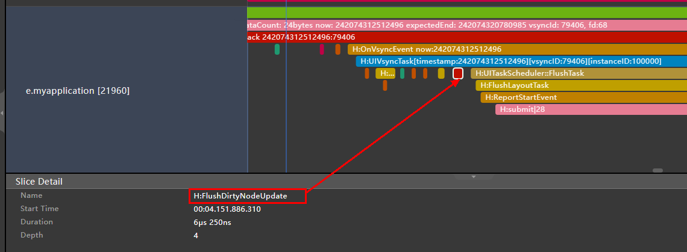
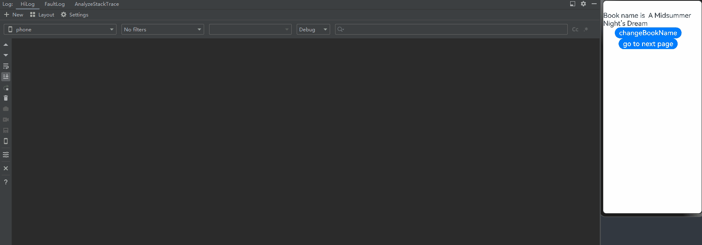
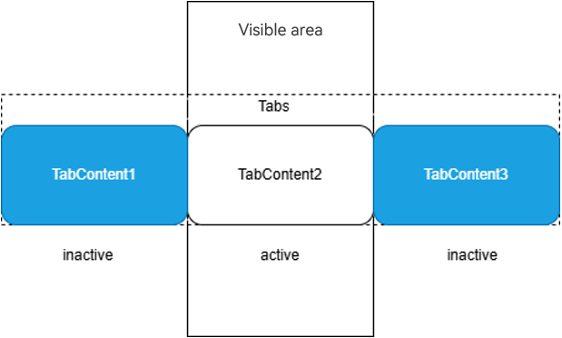
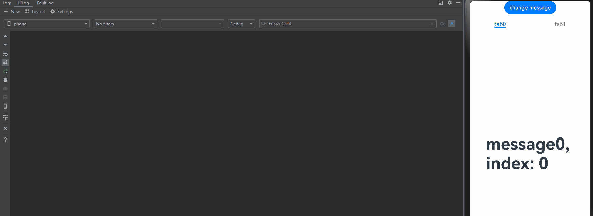
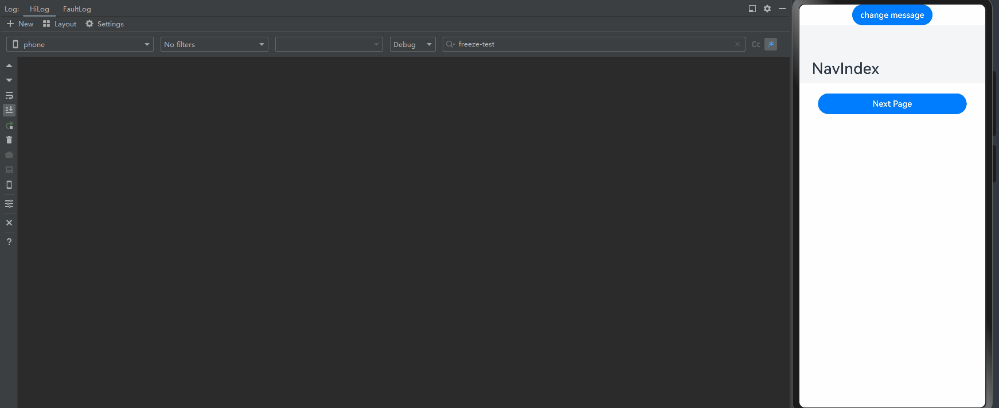
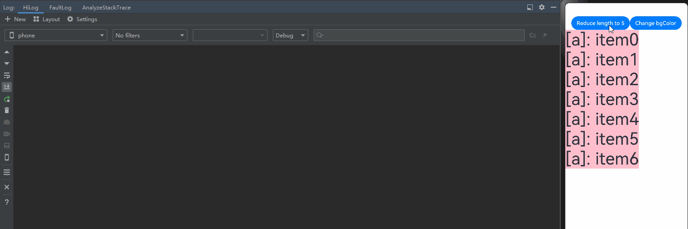
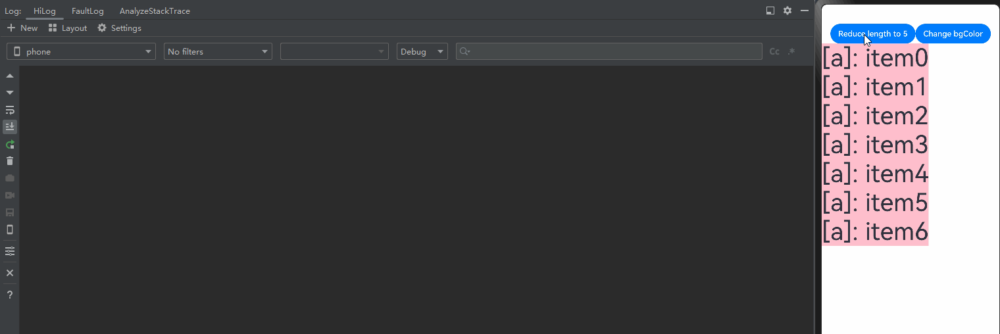
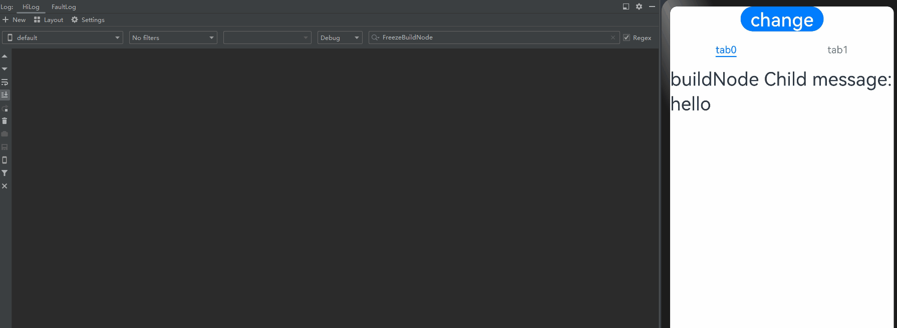

# Freezing a Custom Component (V2)

<!--Kit: ArkUI-->
<!--Subsystem: ArkUI-->
<!--Owner: @liwenzhen3-->
<!--Designer: @zhangboren-->
<!--Tester: @TerryTsao-->
<!--Adviser: @zhang_yixin13-->
<!-- md-trans-meta sourceCommit=2fe87adc16af5a903a1eb4a9624e4d36fa962e3d translatedAt=2026-07-25T08:55:35.455Z pushedAt=2026-07-25T09:19:15.852Z -->

When a custom component decorated by @ComponentV2 is in the inactive state, its state variables will not respond to updates. That is, [@Monitor](./arkts-new-monitor.md) will not be invoked, and the nodes associated with the state variables will not be refreshed. This freeze mechanism significantly optimizes performance in complex UI scenarios by preventing inactive components from performing unnecessary refreshes due to state variable updates, thereby reducing resource consumption. The [freezeWhenInactive](../../reference/apis-arkui/arkui-ts/ts-custom-component-parameter.md#componentoptions) attribute determines whether to enable the freeze feature. When no parameter is passed, the freeze feature is not used by default. Supported scenarios include [page routing](../../reference/apis-arkui/js-apis-router.md), [TabContent](../../reference/apis-arkui/arkui-ts/ts-container-tabcontent.md), [Navigation](../../reference/apis-arkui/arkui-ts/ts-basic-components-navigation.md), and [Repeat](../../reference/apis-arkui/arkui-ts/ts-rendering-control-repeat.md).

Before reading this document, a solid understanding of the basic syntax for @ComponentV2 is required. You are advised to read [\@ComponentV2](./arkts-create-custom-components.md#componentv2) in advance.

> **NOTE**
>
> Freezing of @ComponentV2 decorated custom components is supported since API version 12.
>
> Since API version 18, mixed scenarios of custom component freezing are supported.
>
> Since API version 22, you can set [inheritFreezeOptions](../../reference/apis-arkui/js-apis-arkui-builderNode.md#inheritfreezeoptions20) of [BuilderNode](../../reference/apis-arkui/js-apis-arkui-builderNode.md) to true to implement the following scenario: When component freezing is enabled for the parent component and BuilderNode is enabled for the middle layer of the component tree, the child components of BuilderNode can be frozen. For details, see [Configuring BuilderNode Freeze Inheritance](../arkts-user-defined-arktsNode-builderNode.md#configuring-buildernode-freeze-inheritance).
>
> Different from the component freezing of @Component, the custom component decorated by @ComponentV2 does not support the freezing of cache node components in the [LazyForEach](../rendering-control/arkts-rendering-control-lazyforeach.md) scenario.

## Use Scenarios

### Defining Page Routes

> **NOTE**
>
> While this example demonstrates page navigation and routing using **router** APIs, you are advised to use the **Navigation** component instead, which offers enhanced functionality and greater customization flexibility. For details, see the use cases of [Navigation](#navigation).

When page 1 navigates to page 2 using **this.getUIContext().getRouter().pushUrl()**, it enters the hidden state, where updating its state variables will not trigger UI re-rendering.

For details, see the following.


Page 1:

<!-- @[freeze_template1_Page1_start](https://gitcode.com/openharmony/applications_app_samples/blob/master/code/DocsSample/ArkUISample/FreezeV2/entry/src/main/ets/pages/freeze/template1/Page1.ets) -->     

``` TypeScript
import { hilog } from '@kit.PerformanceAnalysisKit';

const DOMAIN = 0x0000;
const BOOK_INITIAL_NAME = '100';

@ObservedV2
export class Book {
  @Trace public name: string = BOOK_INITIAL_NAME;

  constructor(page: string) {
    this.name = page;
  }
}

@Entry
@ComponentV2({ freezeWhenInactive: true })
export struct Page1 {
  @Local bookTest: Book = new Book(`A Midsummer Night's Dream`);

  @Monitor('bookTest.name')
  onMessageChange(monitor: IMonitor) {
    hilog.info(DOMAIN, 'testTag', `The book name change from ${monitor.value()?.before} to ${monitor.value()?.now}`);
  }

  build() {
    Column() {
      Text(`Book name is  ${this.bookTest.name}`).fontSize(25)
      Button('changeBookName').fontSize(25)
        .onClick(() => {
          this.bookTest.name = 'The Old Man and the Sea';
        })
      // Tap the button to navigate to page 2.
      Button('go to next page').fontSize(25)
        .onClick(() => {
          this.getUIContext().getRouter().pushUrl({ url: 'pages/freeze/template1/Page2' });
          setTimeout(() => {
            this.bookTest = new Book(`Jane Austen's Pride and Prejudice`);
          }, 1000)
        })
    }
  }
}
```

Page 2:

<!-- @[freeze_template1_Page2_start](https://gitcode.com/openharmony/applications_app_samples/blob/master/code/DocsSample/ArkUISample/FreezeV2/entry/src/main/ets/pages/freeze/template1/Page2.ets) --> 

``` TypeScript
@Entry
@ComponentV2
struct Page2 {
  build() {
    Column() {
      Text('This is the page2').fontSize(25)
      // Tap the button to navigate back to page 1.
      Button('Back')
        .onClick(() => {
          this.getUIContext().getRouter().back();
        })
    }
  }
}
```

In the preceding example:

1. Click **changeBookName** on page 1. The name attribute of the bookTest variable is changed, and the onMessageChange method registered in @Monitor is called.

2. Click **go to next page** on page 1 to jump to page 2, and then update the state variable bookTest after 1s. When **bookTest** is updated, page 1 is already in the inactive state, where the [@Local](./arkts-new-local.md) decorated state variable **bookTest** does not respond to updates. Therefore, the @Monitor is not called, and no UI re-rendering occurs for nodes bound to this state variable.

The trace information is shown below.



3. Click **Back**. Page 2 is destroyed, and the state of page 1 changes from inactive to active. The update of the **bookTest** state variable is now observed. As a result, the **onMessageChange** method registered in @Monitor is called, and the bound **Text** component updates its display content.



### TabContent

Freezes the TabContent that is currently invisible in Tabs. Modifying the state variable does not trigger the update of the frozen component.

During initial rendering, only the **TabContent** component that is being displayed is created. The remaining **TabContent** components are created only when all TabContent components are switched.

For details, see the following.



<!-- @[freeze_template2_start](https://gitcode.com/openharmony/applications_app_samples/blob/master/code/DocsSample/ArkUISample/FreezeV2/entry/src/main/ets/pages/freeze/template2/TabContentTest.ets) -->

``` TypeScript
import { hilog } from '@kit.PerformanceAnalysisKit';

const DOMAIN = 0x0000;

@Entry
@ComponentV2
struct TabContentTest {
  @Local message: number = 0;
  @Local data: number[] = [0, 1];

  build() {
    Row() {
      Column() {
        // Tap the button to modify message. The visible TabContent triggers the onMessageUpdated callback.
        Button('change message').onClick(() => {
          this.message++;
        })

        Tabs() {
          ForEach(this.data, (item: number) => {
            TabContent() {
              FreezeChild({ message: this.message, index: item })
            }.tabBar(`tab${item}`)
          }, (item: number) => item.toString())
        }
      }
      .width('100%')
    }
    .height('100%')
  }
}

@ComponentV2({ freezeWhenInactive: true })
struct FreezeChild {
  @Param message: number = 0;
  @Param index: number = 0;

  @Monitor('message')
  onMessageUpdated(mon: IMonitor) {
    hilog.info(DOMAIN, 'FreezeChild', `FreezeChild message callback func ${this.message}, index: ${this.index}`);
  }

  build() {
    Text('message' + `${this.message}, index: ${this.index}`)
      .fontSize(50)
      .fontWeight(FontWeight.Bold)
  }
}
```

In the preceding example:

1. When **change message** is clicked, the value of **message** changes, triggering the @Monitor decorated **onMessageUpdated** callback of the **TabContent** component being displayed.

2. When **tab1** in **TabBar** is clicked to navigate to another **TabContent** component, the component switches from inactive to active, triggering the corresponding **onMessageUpdated** callback registered via @Monitor.

3. When **change message** is clicked again, the value of **message** changes, triggering only the **onMessageUpdated** callback registered via @Monitor of the **TabContent** component being displayed. Other inactive **TabContent** components do not trigger @Monitor decorated callbacks.



### Navigation

When a **NavDestination** component becomes invisible, its child custom components enter an inactive state. In this state, modifying state variables does not trigger UI re-rendering of these components. When this **NavDestination** component is visible again, its child custom components are restored to the active state and the @Monitor decorated callback is triggered for UI re-rendering.

Note: The terms "Active" and "Inactive" in this document refer to the component's frozen active/inactive state, distinct from the [onActive](../../reference/apis-arkui/arkui-ts/ts-basic-components-navdestination.md#onactive17) and [onInactive](../../reference/apis-arkui/arkui-ts/ts-basic-components-navdestination.md#oninactive17) lifecycle callbacks in the [NavDestination](../../reference/apis-arkui/arkui-ts/ts-basic-components-navdestination.md) component.

<!-- @[freeze_template3_start](https://gitcode.com/openharmony/applications_app_samples/blob/master/code/DocsSample/ArkUISample/FreezeV2/entry/src/main/ets/pages/freeze/template3/MyNavigationTestStack.ets) -->

``` TypeScript
import { hilog } from '@kit.PerformanceAnalysisKit';

const DOMAIN = 0x0000;
const PAGE_ONE_INDEX = 1;
const PAGE_TWO_INDEX = 2;
const PAGE_THREE_INDEX = 3;

@Entry
@ComponentV2
struct MyNavigationTestStack {
  @Provider('pageInfo') pageInfo: NavPathStack = new NavPathStack();
  @Local message: number = 0;

  @Monitor('message')
  info() {
    hilog.info(DOMAIN, 'FreezeChild', `freeze-test MyNavigation message callback ${this.message}`);
  }

  @Builder
  PageMap(name: string) {
    if (name === 'pageOne') {
      PageOneStack({ message: this.message })
    } else if (name === 'pageTwo') {
      PageTwoStack({ message: this.message })
    } else if (name === 'pageThree') {
      PageThreeStack({ message: this.message })
    }
  }

  build() {
    Column() {
      Button('change message')
        .onClick(() => {
          this.message++;
        })
      Navigation(this.pageInfo) {
        Column() {
          Button('Next Page', { stateEffect: true, type: ButtonType.Capsule })
            .onClick(() => {
              this.pageInfo.pushPath({ name: 'pageOne' }); // Push the NavDestination page information specified by name onto the stack.
            })
        }
      }.title('NavIndex')
      .navDestination(this.PageMap)
      .mode(NavigationMode.Stack)
    }
  }
}

@ComponentV2
struct PageOneStack {
  @Consumer('pageInfo') pageInfo: NavPathStack = new NavPathStack();
  @Local index: number = PAGE_ONE_INDEX;
  @Param message: number = 0;

  build() {
    NavDestination() {
      Column() {
        NavigationContentMsgStack({ message: this.message, index: this.index })
        Text('cur stack size:' + `${this.pageInfo.size()}`)
          .fontSize(30)
        Button('Next Page', { stateEffect: true, type: ButtonType.Capsule })
          .onClick(() => {
            this.pageInfo.pushPathByName('pageTwo', null);
          })
        Button('Back Page', { stateEffect: true, type: ButtonType.Capsule })
          .onClick(() => {
            this.pageInfo.pop();
          })
      }.width('100%').height('100%')
    }.title('pageOne')
    .onBackPressed(() => {
      this.pageInfo.pop();
      return true;
    })
  }
}

@ComponentV2
struct PageTwoStack {
  @Consumer('pageInfo') pageInfo: NavPathStack = new NavPathStack();
  @Local index: number = PAGE_TWO_INDEX;
  @Param message: number = 0;

  build() {
    NavDestination() {
      Column() {
        NavigationContentMsgStack({ message: this.message, index: this.index })
        Text('cur stack size:' + `${this.pageInfo.size()}`)
          .fontSize(30)
        Button('Next Page', { stateEffect: true, type: ButtonType.Capsule })
          .onClick(() => {
            this.pageInfo.pushPathByName('pageThree', null);
          })
        Button('Back Page', { stateEffect: true, type: ButtonType.Capsule })
          .onClick(() => {
            this.pageInfo.pop();
          })
      }
    }.title('pageTwo')
    .onBackPressed(() => {
      this.pageInfo.pop();
      return true;
    })
  }
}

@ComponentV2
struct PageThreeStack {
  @Consumer('pageInfo') pageInfo: NavPathStack = new NavPathStack();
  @Local index: number = PAGE_THREE_INDEX;
  @Param message: number = 0;

  build() {
    NavDestination() {
      Column() {
        NavigationContentMsgStack({ message: this.message, index: this.index })
        Text('cur stack size:' + `${this.pageInfo.size()}`)
          .fontSize(30)
        Button('Next Page', { stateEffect: true, type: ButtonType.Capsule })
          .height(40)
          .onClick(() => {
            this.pageInfo.pushPathByName('pageOne', null);
          })
        Button('Back Page', { stateEffect: true, type: ButtonType.Capsule })
          .height(40)
          .onClick(() => {
            this.pageInfo.pop();
          })
      }
    }.title('pageThree')
    .onBackPressed(() => {
      this.pageInfo.pop();
      return true;
    })
  }
}

@ComponentV2({ freezeWhenInactive: true })
struct NavigationContentMsgStack {
  @Param message: number = 0;
  @Param index: number = 0;

  @Monitor('message')
  info() {
    hilog.info(DOMAIN, 'FreezeChild', `freeze-test NavigationContent message callback ${this.message}`);
    hilog.info(DOMAIN, 'FreezeChild', `freeze-test ---- called by content ${this.index}`);
  }

  build() {
    Column() {
      Text('msg:' + `${this.message}`)
        .fontSize(30)
    }
  }
}
```

In the preceding example:

1. When **change message** is clicked, the value of **message** changes, triggering the @Monitor decorated **info** callback of the **MyNavigationTestStack** component being displayed.

2. When **Next Page** is clicked, the page is switched to **PageOne** and the **PageOneStack** node is created.

3. When **change message** is clicked again, the value of **message** changes, triggering only the @Monitor decorated **info** method of the **NavigationContentMsgStack** child component in **PageOneStack**.

4. When **Next Page** is clicked, the page is switched to **PageTwo** and the **PageTwoStack** node is created. The state of the **PageOneStack** node changes from active to inactive.

5. When **change message** is clicked again, the value of **message** changes, triggering only the @Monitor decorated **info** method of the **NavigationContentMsgStack** child component in **PageTwoStack**. The @Monitor method does not trigger for child custom components of **NavDestination** that are not on the top of the navigation stack and are in an inactive state.

6. When **Next Page** is clicked, the page is switched to **PageThree** and the **PageThreeStack** node is created. The state of the **PageTwoStack** node changes from active to inactive.

7. When **change message** is clicked again, the value of **message** changes, triggering only the @Monitor decorated **info** method of the **NavigationContentMsgStack** child component in **PageThreeStack**. The @Monitor method does not trigger for child custom components of **NavDestination** that are not on the top of the navigation stack and are in an inactive state.

8. After **Back Page** is clicked to return to **PageTwo**, the state of the **PageTwoStack** node changes from inactive to active, triggering the @Monitor decorated **info** method of the **NavigationContentMsgStack** child component.

9. After **Back Page** is clicked again to return to **PageOne**, the state of the **PageOneStack** node changes from inactive to active, triggering the @Monitor decorated **info** method of the **NavigationContentMsgStack** child component.

10. When **Back Page** is clicked again, the initial page is displayed, and no method is called.



### Repeat

> **NOTE**
>
> Repeat supports custom component freezing since API version 18.

Freezing custom components in the cache pool of **Repeat** prevents unnecessary component re-renders. Before proceeding, reviewing the [Node Update and Reuse Mechanism](../rendering-control/arkts-new-rendering-control-repeat.md#node-update-and-reuse-mechanism) is recommended.

<!-- @[freeze_template4_start](https://gitcode.com/openharmony/applications_app_samples/blob/master/code/DocsSample/ArkUISample/FreezeV2/entry/src/main/ets/pages/freeze/template4/RepeatVirtualScrollFreeze.ets) --> 

``` TypeScript
import { hilog } from '@kit.PerformanceAnalysisKit';

const DOMAIN = 0x0000;

@Entry
@ComponentV2
struct RepeatVirtualScrollFreeze {
  @Local simpleList: Array<string> = [];
  @Local bgColor: Color = Color.Pink;

  aboutToAppear(): void {
    for (let i = 0; i < 7; i++) {
      this.simpleList.push(`item${i}`);
    }
  }

  build() {
    Column() {
      Row() {
        Button('Reduce length to 5')
          .onClick(() => {
            this.simpleList = this.simpleList.slice(0, 5);
          })
        Button('Change bgColor')
          .onClick(() => {
            this.bgColor = this.bgColor == Color.Pink ? Color.Blue : Color.Pink;
          })
      }

      List() {
        Repeat(this.simpleList)
          .each((obj: RepeatItem<string>) => {
          })
          .key((item: string, index: number) => item)
          .virtualScroll({ totalCount: this.simpleList.length })
          .templateId(() => 'a')
          .template('a', (ri) => {
            ChildComponent({
              message: ri.item,
              bgColor: this.bgColor
            })
          }, { cachedCount: 2 })
      }
      .cachedCount(0)
      .height(500)
    }
    .height('100%')
  }
}

// Enable component freezing.
@ComponentV2({ freezeWhenInactive: true })
struct ChildComponent {
  @Param @Require message: string = '';
  @Param @Require bgColor: Color = Color.Pink;

  @Monitor('bgColor')
  onBgColorChange(monitor: IMonitor) {
    // When the value of bgColor changes, the components in the cache pool are not re-rendered, so no log is printed.
    hilog.info(DOMAIN, 'testTag', `repeat---bgColor change from ${monitor.value()?.before} to ${monitor.value()?.now}`);
  }

  build() {
    Text(`[a]: ${this.message}`)
      .fontSize(50)
      .backgroundColor(this.bgColor)
  }
}
```

In the preceding example:

After **Reduce length to 5** is clicked, the two removed components enter the cache pool of **Repeat**. Then, clicking **Change bgColor** changes the value of **bgColor**, triggering component re-rendering.

With component freezing enabled (**freezeWhenInactive: true**), only the @Monitor decorated **onBgColorChange** callback in the remaining active nodes is triggered. In the example, the five visible nodes refresh and log five messages, but the cached nodes do not.



<!-- @[freeze_template4_pageB_start](https://gitcode.com/openharmony/applications_app_samples/blob/master/code/DocsSample/ArkUISample/FreezeV2/entry/src/main/ets/pages/freeze/template4/PageB.ets) --> 

``` TypeScript
import { hilog } from '@kit.PerformanceAnalysisKit';

const DOMAIN = 0x0000;
// ...
// Disable component freezing.
@ComponentV2({ freezeWhenInactive: false })
struct ChildComponent1 {
  @Param @Require message: string = '';
  @Param @Require bgColor: Color = Color.Pink;

  @Monitor('bgColor')
  onBgColorChange(monitor: IMonitor) {
    // When the value of bgColor changes, components in the cache pool are also re-rendered, printing logs.
    hilog.info(DOMAIN, 'testTag', `repeat---bgColor change from ${monitor.value()?.before} to ${monitor.value()?.now}`);
  }

  build() {
    Text(`[a]: ${this.message}`)
      .fontSize(50)
      .backgroundColor(this.bgColor)
  }
}
```

When component freezing is disabled (**freezeWhenInactive: false** - the default setting when **freezeWhenInactive** is not specified), the @Monitor decorated **onBgColorChange** callback is triggered for both the remaining active components and components in the cache pool. This means all seven components are re-rendered, printing seven logs.



### Component Freezing for Child Components Only

You can selectively freeze specific child components by setting **freezeWhenInactive: true** only on those child components.

<!-- @[freeze_template5_PageA_start](https://gitcode.com/openharmony/applications_app_samples/blob/master/code/DocsSample/ArkUISample/FreezeV2/entry/src/main/ets/pages/freeze/template5/PageA.ets) --> 

``` TypeScript
// src/main/ets/pages/freeze/template5/PageA.ets
import { hilog } from '@kit.PerformanceAnalysisKit';

const DOMAIN = 0x0000;

@ObservedV2
class Book {
  @Trace public name: string = 'TS';

  constructor(name: string) {
    this.name = name;
  }
}

@Entry
@ComponentV2
struct PageA {
  pageInfo: NavPathStack = new NavPathStack();

  build() {
    Column() {
      Navigation(this.pageInfo) {
        Child()

        // Tap the button to navigate to PageB.
        Button('Go to next page').fontSize(30)
          .onClick(() => {
            this.pageInfo.pushPathByName('PageB', null);
          })
      }
    }
  }
}

@ComponentV2({ freezeWhenInactive: true })
export struct Child {
  @Local bookTest: Book = new Book(`A Midsummer Night's Dream`);

  @Monitor('bookTest.name')
  onMessageChange(monitor: IMonitor) {
    hilog.info(DOMAIN, 'testTag', `The book name change from ${monitor.value()?.before} to ${monitor.value()?.now}`);
  }

  textUpdate(): number {
    hilog.info(DOMAIN, 'testTag', 'The text is update');
    return 25;
  }

  build() {
    Column() {
      Text(`The book name is ${this.bookTest.name}`).fontSize(this.textUpdate())

      Button('change BookName')
        .onClick(() => {
          setTimeout(() => {
            this.bookTest = new Book(`Jane Austen's Pride and Prejudice`);
          }, 3000);
        })
    }
  }
}
```

<!-- @[freeze_template5_PageB_start](https://gitcode.com/openharmony/applications_app_samples/blob/master/code/DocsSample/ArkUISample/FreezeV2/entry/src/main/ets/pages/freeze/template5/PageB.ets) --> 

``` TypeScript
// src/main/ets/pages/freeze/template5/PageB.ets
@Builder
function pageBBuilder() {
  PageB()
}

@ComponentV2
struct PageB {
  pathStack: NavPathStack = new NavPathStack();

  build() {
    NavDestination() {
      Column() {
        Text('This is the PageB')

        // Tap the button to navigate back to PageA.
        Button('Back').fontSize(30)
          .onClick(() => {
            this.pathStack.pop();
          })
      }
    }.onReady((context: NavDestinationContext) => {
      this.pathStack = context.pathStack;
    })
  }
}
```

When using **Navigation**, create a **route_map.json** file as shown below in the **src/main/resources/base/profile** directory, replacing the value of **pageSourceFile** with the actual path to **PageB**. Then, add **"routerMap": "$profile: route_map"** to the **module.json5** file.

```json
{
  "routerMap": [
    {
      "name": "PageB",
      "pageSourceFile": "src/main/ets/pages/freeze/template5/PageB.ets",
      "buildFunction": "pageBBuilder",
      "data": {
        "description" : "This is the PageB"
      }
    }
  ]
}
```

In the preceding example:

- The child component **Child** in **PageA** has **freezeWhenInactive: true** configured.

- During the test, click the **change BookName** button; within 3 seconds, click the **Go to next page** button. When **bookTest** is updated, **PageA** is already in the inactive state after navigation to **PageB**. Due to component freezing enabled for **Child**, the **@Local bookTest** state variable does not respond to updates. This means that the @Monitor decorated method will not be called, and any nodes associated with the state variable will not be re-rendered.

- After the **Back** button is clicked to return to the previous page, the @Monitor decorated callback is triggered, and components associated with the state variable will be re-rendered.

### Mixed Use of Component Freezing

When scenarios that support component freezing are used together, the freezing behavior varies according to the API version. Set the component freezing flag for the parent component. In API version 17 or earlier, when the parent component is unfrozen, all nodes of its child components are unfrozen. Since API version 18, when a parent component is unfrozen, only the on-screen nodes of its child components are unfrozen. For details, see [Mixed Component Usage](./arkts-custom-components-freeze.md#mixed-component-usage).

**Mixed Use of Navigation and TabContent**

<!-- @[freeze_template6_start](https://gitcode.com/openharmony/applications_app_samples/blob/master/code/DocsSample/ArkUISample/FreezeV2/entry/src/main/ets/pages/freeze/template6/MyNavigationTestStack.ets) -->  

``` TypeScript
import { hilog } from '@kit.PerformanceAnalysisKit';

const DOMAIN = 0x0000;
const TAB_STATE_INITIAL_VALUE = 47;

@ComponentV2
struct ChildOfParamComponent {
  @Require @Param childVal: number;

  @Monitor('childVal')
  onChange(m: IMonitor) {
    hilog.info(DOMAIN, 'testTag',
      `Appmonitor ChildOfParamComponent: changed ${m.dirty[0]}: ${m.value()?.before} -> ${m.value()?.now}`);
  }

  build() {
    Column() {
      Text(`Child Param: ${this.childVal}`)
    }
  }
}

@ComponentV2
struct ParamComponent {
  @Require @Param val: number;

  @Monitor('val')
  onChange(m: IMonitor) {
    hilog.info(DOMAIN, 'testTag',
      `Appmonitor ParamComponent: changed ${m.dirty[0]}: ${m.value()?.before} -> ${m.value()?.now}`);
  }

  build() {
    Column() {
      Text(`val: ${this.val}`)
      ChildOfParamComponent({ childVal: this.val })
    }
  }
}

@ComponentV2
struct DelayComponent {
  @Require @Param delayVal1: number;

  @Monitor('delayVal1')
  onChange(m: IMonitor) {
    hilog.info(DOMAIN, 'testTag',
      `Appmonitor DelayComponent: changed ${m.dirty[0]}: ${m.value()?.before} -> ${m.value()?.now}`);
  }

  build() {
    Column() {
      Text(`Delay Param: ${this.delayVal1}`)
    }
  }
}

@ComponentV2({ freezeWhenInactive: true })
struct TabsComponent {
  private controller: TabsController = new TabsController();
  @Local tabState: number = TAB_STATE_INITIAL_VALUE;

  @Monitor('tabState')
  onChange(m: IMonitor) {
    hilog.info(DOMAIN, 'testTag',
      `Appmonitor TabsComponent: changed ${m.dirty[0]}: ${m.value()?.before} -> ${m.value()?.now}`);
  }

  build() {
    Column({ space: 10 }) {
      Button(`Incr state ${this.tabState}`)
        .fontSize(25)
        .onClick(() => {
          hilog.info(DOMAIN, 'testTag', 'Button increment state value');
          this.tabState = this.tabState + 1;
        })
      Tabs({ barPosition: BarPosition.Start, index: 0, controller: this.controller }) {
        TabContent() {
          ParamComponent({ val: this.tabState })
        }.tabBar('Update')
        TabContent() {
          DelayComponent({ delayVal1: this.tabState })
        }.tabBar('DelayUpdate')
      }
      .vertical(false)
      .scrollable(true)
      .barMode(BarMode.Fixed)
      .barWidth(400)
      .barHeight(150)
      .animationDuration(400)
      .width('100%')
      .height(200)
      .backgroundColor(0xF5F5F5)
    }
  }
}

@Entry
@Component
struct MyNavigationTestStack1 {
  @Provide('pageInfo') pageInfo: NavPathStack = new NavPathStack();

  @Builder
  PageMap(name: string) {
    if (name === 'pageOne') {
      PageOneStack1()
    } else if (name === 'pageTwo') {
      PageTwoStack2()
    }
  }

  build() {
    Column() {
      Navigation(this.pageInfo) {
        Column() {
          Button('Next Page', { stateEffect: true, type: ButtonType.Capsule })
            .width('80%')
            .height(40)
            .margin(20)
            .onClick(() => {
              this.pageInfo.pushPath({ name: 'pageOne' }); // Push the NavDestination page information specified by name onto the stack.
            })
        }
      }.title('NavIndex')
      .navDestination(this.PageMap)
      .mode(NavigationMode.Stack)
    }
  }
}

@Component
struct PageOneStack1 {
  @Consume('pageInfo') pageInfo: NavPathStack;

  build() {
    NavDestination() {
      Column() {
        // Create TabContent in NavDestination.
        TabsComponent()

        Button('Next Page', { stateEffect: true, type: ButtonType.Capsule })
          .width('80%')
          .height(40)
          .margin(20)
          .onClick(() => {
            this.pageInfo.pushPathByName('pageTwo', null);
          })
      }.width('100%').height('100%')
    }.title('pageOne')
    .onBackPressed(() => {
      this.pageInfo.pop();
      return true;
    })
  }
}

@Component
struct PageTwoStack2 {
  @Consume('pageInfo') pageInfo: NavPathStack;

  build() {
    NavDestination() {
      Column() {
        Button('Back Page', { stateEffect: true, type: ButtonType.Capsule })
          .width('80%')
          .height(40)
          .margin(20)
          .onClick(() => {
            this.pageInfo.pop();
          })
      }.width('100%').height('100%')
    }.title('pageTwo')
    .onBackPressed(() => {
      this.pageInfo.pop();
      return true;
    })
  }
}
```

For API version 17 or earlier:

When you tap `Next Page` to navigate to the next page and then return, all tabs of **TabContent** are unfrozen.

For API version 18 or later:

When you tap `Next Page` to navigate to the next page and then return, only the nodes of the corresponding tab are unfrozen.

## Constraints

In API version 21 and earlier versions, as shown in the following example, the custom node [BuilderNode](../../reference/apis-arkui/js-apis-arkui-builderNode.md) is used in FreezeBuildNode. When a BuilderNode is used within a frozen component hierarchy, its imperative mounting mechanism conflicts with the functionality of component freezing, which relies on parent-child relationships. As a result, the child components of the BuilderNode remain active, regardless of their parent's frozen state. Since API version 22, you can [configure BuilderNode freeze inheritance](../arkts-user-defined-arktsNode-builderNode.md#configuring-buildernode-freeze-inheritance).

<!-- @[freeze_template7_start](https://gitcode.com/openharmony/applications_app_samples/blob/master/code/DocsSample/ArkUISample/FreezeV2/entry/src/main/ets/pages/freeze/template7/BuilderNode.ets) --> 

``` TypeScript
import { BuilderNode, FrameNode, NodeController, UIContext } from '@kit.ArkUI';
import { hilog } from '@kit.PerformanceAnalysisKit';

const DOMAIN = 0x0000;

// Define a Params class to pass parameters.
@ObservedV2
class Params {
  // Singleton pattern to ensure that there is only one Params instance.
  public static singleton_: Params;

  // Method for obtaining the Params instance.
  public static instance() {
    if (!Params.singleton_) {
      Params.singleton_ = new Params(0);
    }
    return Params.singleton_;
  }

  // Use the @Trace decorator to decorate the message attribute so that its changes are observable.
  @Trace public message: string = 'Hello';
  public index: number = 0;

  constructor(index: number) {
    this.index = index;
  }
}

// Define a BuildNodeChild component that contains a storage attribute and an index attribute.
@ComponentV2
struct BuildNodeChild {
  // Use the Params instance as the storage attribute.
  storage: Params = Params.instance();
  @Param index: number = 0;

  // Use the @Monitor decorator to listen for the changes of storage.message.
  @Monitor('storage.message')
  onMessageChange(monitor: IMonitor) {
    hilog.info(DOMAIN, 'FreezeChild',
      `FreezeBuildNode BuildNodeChild message callback func ${this.storage.message}, index:${this.index}`);
  }

  build() {
    Text(`buildNode Child message: ${this.storage.message}`).fontSize(30)
  }
}

// Define a buildText function that receives a Params parameter and constructs a Column component.
@Builder
function buildText(params: Params) {
  Column() {
    BuildNodeChild({ index: params.index })
  }
}

class TextNodeController extends NodeController {
  private textNode: BuilderNode<[Params]> | null = null;
  private index: number = 0;

  // The constructor receives an index parameter.
  constructor(index: number) {
    super();
    this.index = index;
  }

  // Create and return a FrameNode.
  makeNode(context: UIContext): FrameNode | null {
    this.textNode = new BuilderNode(context);
    this.textNode.build(wrapBuilder<[Params]>(buildText), new Params(this.index));
    return this.textNode.getFrameNode();
  }
}

// Define an index component that contains a message attribute and a data array.
@Entry
@ComponentV2
struct Index {
  // Use the Params instance as the storage attribute.
  storage: Params = Params.instance();
  private data: number[] = [0, 1];

  build() {
    Row() {
      Column() {
        Button('change').fontSize(30)
          .onClick(() => {
            this.storage.message += 'a';
          })

        Tabs() {
          // Use Repeat to repeatedly render the TabContent component.
          Repeat<number>(this.data)
            .each((obj: RepeatItem<number>) => {
              TabContent() {
                FreezeBuildNode({ index: obj.item })
                  .margin({ top: 20 })
              }.tabBar(`tab${obj.item}`)
            })
            .key((item: number) => item.toString())
        }
      }
    }
    .width('100%')
    .height('100%')
  }
}

// Define a FreezeBuildNode component that contains a message attribute and an index attribute.
@ComponentV2({ freezeWhenInactive: true })
struct FreezeBuildNode {
  // Use the Params instance as the storage attribute.
  storage: Params = Params.instance();
  @Param index: number = 0;

  // Use the @Monitor decorator to listen for the changes of storage.message.
  @Monitor('storage.message')
  onMessageChange(monitor: IMonitor) {
    hilog.info(DOMAIN, 'FreezeChild',
      `FreezeBuildNode message callback func ${this.storage.message}, index: ${this.index}`);
  }

  build() {
    NodeContainer(new TextNodeController(this.index))
      .width('100%')
      .height('100%')
      .backgroundColor('#FFF0F0F0')
  }
}
```

When **change** is clicked, the **message** value is modified. This triggers the **onMessageChange** method registered through @Monitor in the currently displayed **TabContent** component. Unexpected: For **TabContent** components that are not being displayed, the @Monitor decorated **onMessageChange** callbacks of child components under the BuilderNode are also triggered, indicating that these components are not frozen.

