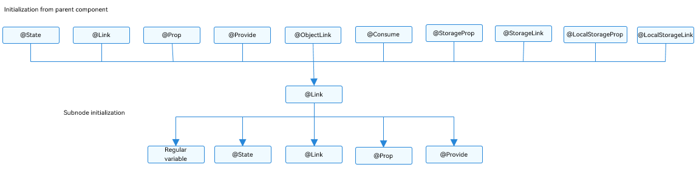
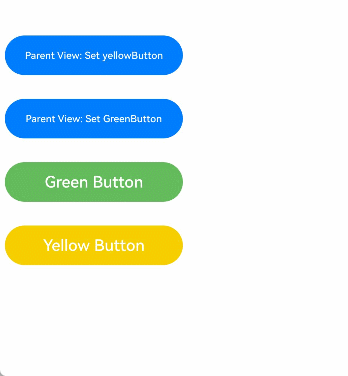

# \@Link Decorator: Implementing Two-Way Synchronization Between Parent and Child Components
<!--Kit: ArkUI-->
<!--Subsystem: ArkUI-->
<!--Owner: @jiyujia926-->
<!--Designer: @s10021109-->
<!--Tester: @TerryTsao-->
<!--Adviser: @zhang_yixin13-->


An \@Link decorated variable creates two-way synchronization with its corresponding data source in parent component.

Before reading this topic, you are advised to understand the basic usage of [\@State](./arkts-state.md). For best practices, see [State Management](https://developer.huawei.com/consumer/en/doc/best-practices/bpta-status-management).

> **NOTE**
>
> This decorator can be used in ArkTS widgets since API version 9.
>
> This decorator can be used in atomic services since API version 11.

## Overview

An \@Link decorated variable in a child component shares the same value with a variable in its parent component.


## Usage Rules

| \@Link Decorator                         | Description                                                  |
| ---------------------------------------- | ------------------------------------------------------------ |
| Parameters                               | N/A                                                          |
| Synchronization type                     | Two-way:<br>The state variable in the parent component can be synchronized with the child component \@Link in a two-way manner. Changes to either will be synchronized to the other. |
| Allowed variable types                   | Object, class, string, number, Boolean, enum, and array of these types.<br>[Date type](#decorating-variables-of-the-date-type).<br>Union types defined by the ArkUI framework, for example, [Length](../../reference/apis-arkui/arkui-ts/ts-types.md#length), [ResourceStr](../../reference/apis-arkui/arkui-ts/ts-types.md#resourcestr), and [ResourceColor](../../reference/apis-arkui/arkui-ts/ts-types.md#resourcecolor).<br>The type must be specified and match the two-way bound state variable type of the parent component.<br>For details about the scenarios of supported types, see [Observed Changes](#observed-changes).<br>The **any** type is not supported.<br>(Applicable to API version 11 or later) [Map](#decorating-variables-of-the-map-type) and [Set](#decorating-variables-of-the-set-type) types, and union types of the supported types, for example: **string\| number, string \| undefined**, or **ClassA \| null**. For details, see [Union Type Support](#union-type-support).<br>**NOTE**<br>When using **undefined** and **null**, explicitly specify the type to comply with TypeScript type checking. Example: **@Link a: string \| undefined**. |
| Initial value for the decorated variable | Initialization of the decorated variables is forbidden.      |


## Variable Transfer/Access Rules

| Transfer/Access     | Description                                      |
| ---------- | ---------------------------------------- |
| Initialization and update from the parent component| Mandatory.<br>- A two-way synchronization relationship can be established with an \@State, \@StorageLink, or \@Link decorated variable in the parent component. An @Link decorated variable can be initialized from an [\@State](./arkts-state.md), @Link, [\@Prop](./arkts-prop.md), [\@Provide](./arkts-provide-and-consume.md), [\@Consume](./arkts-provide-and-consume.md), [\@ObjectLink](./arkts-observed-and-objectlink.md), [\@StorageLink](./arkts-appstorage.md#storagelink), [\@StorageProp](./arkts-appstorage.md#storageprop), [\@LocalStorageLink](./arkts-localstorage.md#localstoragelink), or [\@LocalStorageProp](./arkts-localstorage.md#localstorageprop) decorated variable in the parent component.<br>- Since API version 9, the syntax for initializing the child component \@Link from the parent component \@State is **Comp({ aLink: this.aState })**, and **Comp({aLink: $aState})** is also supported.|
| Child component initialization  | Supported; can be used to initialize a regular variable or \@State, \@Link, \@Prop, or \@Provide decorated variable in the child component.|
| Access from outside the component | Private, accessible only within the component.                          |

 **Figure 1** Initialization rules




## Observed Changes and Behavior


### Observed Changes

- When the decorated variable is of the Boolean, string, or number type, its value change can be observed. For details, see [Using \@Link with Primitive and Class Types](#using-link-with-primitive-and-class-types).

- When the decorated variable is of the class or Object type, its value change and value changes of all its attributes, that is, the attributes that **Object.keys(observedObject)** returns, can be observed. For details, see [Using \@Link with Primitive and Class Types](#using-link-with-primitive-and-class-types).

- When the decorated variable is of the array type, the addition, deletion, and updates of array items can be observed. For details, see [Using \@Link with Array Types](#using-link-with-array-types).

- When the decorated object is of the Date type, the following changes can be observed: (1) complete **Date** object reassignment; (2) property changes caused by calling **setFullYear**, **setMonth**, **setDate**, **setHours**, **setMinutes**, **setSeconds**, **setMilliseconds**, **setTime**, **setUTCFullYear**, **setUTCMonth**, **setUTCDate**, **setUTCHours**, **setUTCMinutes**, **setUTCSeconds**, or **setUTCMilliseconds**.


- When the decorated object is of the **Map** type, the following changes can be observed: (1) complete **Map** object reassignment; (2) changes caused by calling **set**, **clear**, or **delete**. For details, see [Decorating Variables of the Map Type](#decorating-variables-of-the-map-type).

- When the decorated object is of the **Set** type, the following changes can be observed: (1) complete **Set** object reassignment; (2) changes caused by calling **add**, **clear**, or **delete**. For details, see [Decorating Variables of the Set Type](#decorating-variables-of-the-set-type).
### Framework Behavior

An \@Link decorated variable shares the lifecycle of its owning component.

To understand the value initialization and update mechanism of the \@Link decorated variable, it is necessary to consider the parent component and the initial render and update process of the child component that owns the \@Link decorated variable (in this example, the \@State decorated variable in the parent component is used).

1. Initial render: The execution of the parent component's **build()** creates an instance of the child component. The initialization process is as follows:
   1. An \@State decorated variable of the parent component is specified to initialize the child component's \@Link decorated variable. The child component's \@Link decorated variable value remains synchronized with its source variable, enabling two-way data synchronization.
   2. The parent component's \@State wrapper variable instance is passed to the child component through the child's constructor. When the child component's \@Link wrapper instance receives a reference to the parent's \@State variable, it registers itself with that parent \@State variable.

2. Update of the \@Link source: When the state variable in the parent component is updated, the \@Link decorated variable in the related child component is updated. Procedure:
   1. As indicated in the initial rendering step, the child component's \@Link wrapper class registers the current **this** pointer with the parent component. When the parent component's \@State variable is changed, all built-in components and state variables (such as the \@Link wrapper instance) that depend on it are traversed and updated.
   2. After the \@Link wrapper instance is updated, all built-in components that depend on the \@Link decorated variable in the child component are notified of the update. In this way, the parent component has the state data of the child components synchronized.

3. Update of \@Link: After the \@Link decorated variable in the child component is updated, the following steps are performed (the \@State decorated variable in the parent component is used):
   1. After the \@Link decorated variable is updated, the **set** method of the parent component's \@State wrapper instance is called to synchronize the new value back to the parent component.
   2. The \@Link in the child component and \@State in the parent component each update their respective dependent UI components through independent dependency traversals, achieving synchronized state while maintaining proper UI consistency.


## Constraints

1. The \@Link decorator cannot be used in custom components decorated by [\@Entry](./arkts-create-custom-components.md#entry).

2. Variables decorated with \@Link do not support local initialization. Any attempt to perform local initialization on them will result in a compilation error.

    ```ts
    // Incorrect usage. An error is reported during compilation.
    @Link count: number = 10;
  
    // Correct usage.
    @Link count: number;
    ```

3. The type of a variable decorated with \@Link must match the type of its data source. The framework throws a runtime error for any type mismatch.

    **Incorrect Usage**
  
    ```ts
    class Info {
      info: string = 'Hello';
    }
  
    class Cousin {
      name: string = 'Hello';
    }
  
    @Component
    struct Child {
      // Incorrect usage: type mismatch between @Link and the @State data source.
      @Link test: Cousin;
  
      build() {
        Text(this.test.name)
      }
    }
  
    @Entry
    @Component
    struct LinkExample {
      @State info: Info = new Info();
  
      build() {
        Column() {
          // Incorrect usage: type mismatch between @Link and the @State data source.
          Child({test: new Cousin()})
        }
      }
    }
    ```

    **Correct Usage**
  
    ```ts
    class Info {
      info: string = 'Hello';
    }
  
    @Component
    struct Child {
      // Correct usage.
      @Link test: Info;
  
      build() {
        Text(this.test.info)
      }
    }
  
    @Entry
    @Component
    struct LinkExample {
      @State info: Info = new Info();
  
      build() {
        Column() {
          // Correct usage.
          Child({test: this.info})
        }
      }
    }
    ```

4. Variables decorated with \@Link can be initialized only by state variables. Using regular variables for initialization causes compilation warnings and runtime crashes.

    **Incorrect Usage**
  
    ```ts
    class Info {
      info: string = 'Hello';
    }
  
    @Component
    struct Child {
      @Link msg: string;
      @Link info: string;
  
      build() {
        Text(this.msg + this.info)
      }
    }

    @Entry
    @Component
    struct LinkExample {
      @State message: string = 'Hello';
      @State info: Info = new Info();
  
      build() {
        Column() {
          // Incorrect usage. Regular variables cannot initialize @Link decorated variables.
          Child({msg: 'World', info: this.info.info})
        }
      }
    }
    ```

    **Correct Usage**
  
    ```ts
    class Info {
      info: string = 'Hello';
    }
  
    @Component
    struct Child {
      @Link msg: string;
      @Link info: Info;
  
      build() {
        Text(this.msg + this.info.info)
      }
    }
  
    @Entry
    @Component
    struct LinkExample {
      @State message: string = 'Hello';
      @State info: Info = new Info();
  
      build() {
        Column() {
          // Correct usage.
          Child({msg: this.message, info: this.info})
        }
      }
    }
    ```

5. Variables decorated with \@Link cannot be of the function type. If a function-type variable is decorated with \@Link, the framework throws a runtime error.


## Use Scenarios


### Using \@Link with Primitive and Class Types

In the following example, after **Parent View: Set yellowButton** and **Parent View: Set GreenButton** of the parent component **ShufflingContainer** are clicked, the change in the parent component is synchronized to the child components.

  1. After buttons of the child components **GreenButton** and **YellowButton** are clicked, the child components (@Link decorated variables) change accordingly. Due to the two-way synchronization relationship between @Link and @State, the changes are synchronized to the parent component.
  
  2. When a button in the parent component **ShufflingContainer** is clicked, the parent component's @State decorated variable changes, and the changes are synchronized to the child components, which are then updated accordingly.

```ts
class GreenButtonState {
  width: number = 0;

  constructor(width: number) {
    this.width = width;
  }
}

@Component
struct GreenButton {
  @Link greenButtonState: GreenButtonState;

  build() {
    Button('Green Button')
      .width(this.greenButtonState.width)
      .height(40)
      .backgroundColor('#64bb5c')
      .fontColor('#FFFFFF')
      .onClick(() => {
        if (this.greenButtonState.width < 700) {
          // Update the attribute of the class. The change can be observed and synchronized back to the parent component.
          this.greenButtonState.width += 60;
        } else {
          // Update the class. The change can be observed and synchronized back to the parent component.
          this.greenButtonState = new GreenButtonState(180);
        }
      })
  }
}

@Component
struct YellowButton {
  @Link yellowButtonState: number;

  build() {
    Button('Yellow Button')
      .width(this.yellowButtonState)
      .height(40)
      .backgroundColor('#f7ce00')
      .fontColor('#FFFFFF')
      .onClick(() => {
        // The change of the decorated variable of a primitive type in the child component can be synchronized back to the parent component.
        this.yellowButtonState += 40.0;
      })
  }
}

@Entry
@Component
struct ShufflingContainer {
  @State greenButtonState: GreenButtonState = new GreenButtonState(180);
  @State yellowButtonProp: number = 180;

  build() {
    Column() {
      Flex({ direction: FlexDirection.Column, alignItems: ItemAlign.Center }) {
        // Primitive type @Link in the child component synchronized from @State in the parent component.
        Button('Parent View: Set yellowButton')
          .width(this.yellowButtonProp)
          .height(40)
          .margin(12)
          .fontColor('#FFFFFF')
          .onClick(() => {
            this.yellowButtonProp = (this.yellowButtonProp < 700) ? this.yellowButtonProp + 40 : 100;
          })
        // Class type @Link in the child component synchronized from @State in the parent component.
        Button('Parent View: Set GreenButton')
          .width(this.greenButtonState.width)
          .height(40)
          .margin(12)
          .fontColor('#FFFFFF')
          .onClick(() => {
            this.greenButtonState.width = (this.greenButtonState.width < 700) ? this.greenButtonState.width + 100 : 100;
          })
        // Initialize the class type @Link.
        GreenButton({ greenButtonState: this.greenButtonState }).margin(12)
        // Initialize the primitive type @Link.
        YellowButton({ yellowButtonState: this.yellowButtonProp }).margin(12)
      }
    }
  }
}
```



### Using \@Link with Array Types


```ts
@Component
struct Child {
  @Link items: number[];

  build() {
    Column() {
      Button(`Button1: push`)
        .margin(12)
        .width(312)
        .height(40)
        .fontColor('#FFFFFF')
        .onClick(() => {
          this.items.push(this.items.length + 1);
        })
      Button(`Button2: replace whole item`)
        .margin(12)
        .width(312)
        .height(40)
        .fontColor('#FFFFFF')
        .onClick(() => {
          this.items = [100, 200, 300];
        })
    }
  }
}

@Entry
@Component
struct Parent {
  @State arr: number[] = [1, 2, 3];

  build() {
    Column() {
      Child({ items: $arr })
        .margin(12)
      ForEach(this.arr,
        (item: number) => {
          Button(`${item}`)
            .margin(12)
            .width(312)
            .height(40)
            .backgroundColor('#11a2a2a2')
            .fontColor('#e6000000')
        },
        (item: ForEachInterface) => item.toString()
      )
    }
  }
}
```


The ArkUI framework can observe the addition, deletion, and replacement of array items. In the preceding example, both \@State and \@Link decorated variables are declared as the **number[]** type. It is important to note that defining @Link as a number type (for example, \@Link item: number) is not supported. In addition, the framework does not support creating child components in the parent component by using individual data items from the \@State decorated array. For scenarios requiring this type of implementation, use [\@Prop](arkts-prop.md) and [\@Observed](./arkts-observed-and-objectlink.md).

### Decorating Variables of the Map Type

> **NOTE**
>
> Since API version 11, \@Link supports the Map type.

In this example, the **value** variable is of the Map\<number, string\> type. When the button is clicked, the value of **message** changes, and the UI is re-rendered.

```ts
@Component
struct Child {
  @Link value: Map<number, string>;

  build() {
    Column() {
      ForEach(Array.from(this.value.entries()), (item: [number, string]) => {
        Text(`${item[0]}`).fontSize(30)
        Text(`${item[1]}`).fontSize(30)
        Divider()
      })
      Button('child init map').onClick(() => {
        this.value = new Map([[0, "a"], [1, "b"], [3, "c"]]);
      })
      Button('child set new one').onClick(() => {
        this.value.set(4, "d");
      })
      Button('child clear').onClick(() => {
        this.value.clear();
      })
      Button('child replace the first one').onClick(() => {
        this.value.set(0, "aa");
      })
      Button('child delete the first one').onClick(() => {
        this.value.delete(0);
      })
    }
  }
}


@Entry
@Component
struct MapSample {
  @State message: Map<number, string> = new Map([[0, "a"], [1, "b"], [3, "c"]]);

  build() {
    Row() {
      Column() {
        Child({ value: this.message })
      }
      .width('100%')
    }
    .height('100%')
  }
}
```

### Decorating Variables of the Set Type

> **NOTE**
>
> Since API version 11, \@Link supports the Set type.

In this example, the **message** variable is of the **Set\<number\>** type. When the button is clicked, the value of **message** changes, and the UI is re-rendered.

```ts
@Component
struct Child {
  @Link message: Set<number>;

  build() {
    Column() {
      ForEach(Array.from(this.message.entries()), (item: [number, number]) => {
        Text(`${item[0]}`).fontSize(30)
        Divider()
      })
      Button('init set').onClick(() => {
        this.message = new Set([0, 1, 2, 3, 4]);
      })
      Button('set new one').onClick(() => {
        this.message.add(5);
      })
      Button('clear').onClick(() => {
        this.message.clear();
      })
      Button('delete the first one').onClick(() => {
        this.message.delete(0);
      })
    }
    .width('100%')
  }
}


@Entry
@Component
struct SetSample {
  @State message: Set<number> = new Set([0, 1, 2, 3, 4]);

  build() {
    Row() {
      Column() {
        Child({ message: this.message })
      }
      .width('100%')
    }
    .height('100%')
  }
}
```

### Decorating Variables of the Date Type

In this example, the **selectedDate** variable is of the Date type. After the button is clicked, the value of **selectedDate** changes, and the UI is re-rendered.

```ts
@Component
struct DateComponent {
  @Link selectedDate: Date;

  build() {
    Column() {
      Button(`child increase the year by 1`)
      .onClick(() => {
        this.selectedDate.setFullYear(this.selectedDate.getFullYear() + 1);
      })
      Button('child update the new date')
        .margin(10)
        .onClick(() => {
          this.selectedDate = new Date('2023-09-09');
        })
      DatePicker({
        start: new Date('1970-1-1'),
        end: new Date('2100-1-1'),
        selected: this.selectedDate
      })
    }
  }
}

@Entry
@Component
struct ParentComponent {
  @State parentSelectedDate: Date = new Date('2021-08-08');

  build() {
    Column() {
      Button('parent increase the month by 1')
        .margin(10)
        .onClick(() => {
          this.parentSelectedDate.setMonth(this.parentSelectedDate.getMonth() + 1);
        })
      Button('parent update the new date')
        .margin(10)
        .onClick(() => {
          this.parentSelectedDate = new Date('2023-07-07');
        })
      DatePicker({
        start: new Date('1970-1-1'),
        end: new Date('2100-1-1'),
        selected: this.parentSelectedDate
      })

      DateComponent({ selectedDate:this.parentSelectedDate })
    }
  }
}
```

### Using the Two-Way Synchronization Mechanism to Change Local Variables

Use [\@Watch](./arkts-watch.md) to change local variables during two-way synchronization.

In the following example, the \@Watch callback on an \@Link variable modifies the @State decorated **memberMessage** variable, achieving variable synchronization between parent and child components. However, local modifications to the @State decorated **memberMessage** variable will not propagate changes back to the parent component.

```ts
@Entry
@Component
struct Parent {
  @State sourceNumber: number = 0;

  build() {
    Column() {
      Text(`sourceNumber of the parent component: ` + this.sourceNumber)
      Child({ sourceNumber: this.sourceNumber })
      Button('Change sourceNumber in Parent Component')
        .onClick(() => {
          this.sourceNumber++;
        })
    }
    .width('100%')
    .height('100%')
  }
}

@Component
struct Child {
  @State memberMessage: string = 'Hello World';
  @Link @Watch('onSourceChange') sourceNumber: number;

  onSourceChange() {
    this.memberMessage = this.sourceNumber.toString();
  }

  build() {
    Column() {
      Text(this.memberMessage)
      Text(`sourceNumber of the child component: ` + this.sourceNumber.toString())
      Button('Change memberMessage in Child Component')
        .onClick(() => {
          this.memberMessage = 'Hello memberMessage';
        })
    }
  }
}
```

## Union Type Support

The \@Link decorator supports union types, including **undefined** and **null**. In the following example, the **name** variable is declared with type **string | undefined**. After the button in the parent **Index** component is clicked to modify either the value or type of **name**, the **Child** component will automatically update to reflect these changes.

```ts
@Component
struct Child {
  @Link name: string | undefined;

  build() {
    Column() {

      Button('Child change name to Bob')
        .onClick(() => {
          this.name = "Bob";
        })

      Button('Child change name to undefined')
        .onClick(() => {
          this.name = undefined;
        })

    }.width('100%')
  }
}

@Entry
@Component
struct Index {
  @State name: string | undefined = "mary";

  build() {
    Column() {
      Text(`The name is  ${this.name}`).fontSize(30)

      Child({ name: this.name })

      Button('Parents change name to Peter')
        .onClick(() => {
          this.name = "Peter";
        })

      Button('Parents change name to undefined')
        .onClick(() => {
          this.name = undefined;
        })
    }
  }
}
```

## Common Issues

### Type Mismatch in \@Link Decorated Variables

When \@Link is used to decorate state variables in child components, the variable type must exactly match its data source type. The data source must be a state variable decorated with \@State or other state decorators.

**Incorrect Usage**

```ts
@Observed
class Info {
  public age: number = 0;

  constructor(age: number) {
    this.age = age;
  }
}

@Component
struct LinkChild {
  @Link testNum: number;

  build() {
    Text(`LinkChild testNum ${this.testNum}`)
  }
}

@Entry
@Component
struct Parent {
  @State info: Info = new Info(1);

  build() {
    Column() {
      Text(`Parent testNum ${this.info.age}`)
        .onClick(() => {
          this.info.age += 1;
        })
      // The type of the @Link decorated variable must be the same as that of the @State decorated data source.
      LinkChild({ testNum: this.info.age })
    }
  }
}
```

In the example, the type of the \@Link decorated **testNum** variable and the initialization from the parent component **LinkChild({testNum:this.info.age})** are incorrect. The data source of \@Link must be a decorated state variable. The \@Link decorated variables must be of the same type as the data source, for example, \@Link: T and \@State: T. Therefore, **\@Link testNum: number** should be changed to **\@Link testNum: Info**, with initialization from the parent component as **LinkChild({testNum: this.info})**.

**Correct Usage**

```ts
@Observed
class Info {
  public age: number = 0;

  constructor(age: number) {
    this.age = age;
  }
}

@Component
struct LinkChild {
  @Link testNum: Info;

  build() {
    Text(`LinkChild testNum ${this.testNum?.age}`)
      .onClick(() => {
        this.testNum.age += 1;
      })
  }
}

@Entry
@Component
struct Parent {
  @State info: Info = new Info(1);

  build() {
    Column() {
      Text(`Parent testNum ${this.info.age}`)
        .onClick(() => {
          this.info.age += 1;
        })
      // The type of the @Link decorated variable must be the same as that of the @State decorated data source.
      LinkChild({ testNum: this.info })
    }
  }
}
```

### Using the a.b(this.object) Pattern Fails to Trigger UI Re-rendering

In the **build** method, when a variable decorated with \@Link is of the object type and is called using the **a.b(this.object)** pattern, the **b** method receives the original object of **this.object**, and modifying its properties will not trigger UI re-rendering. In the following example, when the static method **Score.changeScore1** or **this.changeScore2** is used to change **this.score.value** in the **Child** component, the UI is not re-rendered.

**Incorrect Usage**

```ts
class Score {
  value: number;
  constructor(value: number) {
    this.value = value;
  }

  static changeScore1(score:Score) {
    score.value += 1;
  }
}

@Entry
@Component
struct Parent {
  @State score: Score = new Score(1);

  build() {
    Column({space:8}) {
      Text(`The value in Parent is ${this.score.value}.`)
        .fontSize(30)
        .fontColor(Color.Red)
      Child({ score: this.score })
    }
    .width('100%')
    .height('100%')
  }
}

@Component
struct Child {
  @Link score: Score;

  changeScore2(score:Score) {
    score.value += 2;
  }

  build() {
    Column({space:8}) {
      Text(`The value in Child is ${this.score.value}.`)
        .fontSize(30)
      Button(`changeScore1`)
        .onClick(()=>{
          // Static method calls will not trigger UI re-rendering.
          Score.changeScore1(this.score);
        })
      Button(`changeScore2`)
        .onClick(()=>{
          // Internal component method calls using this will not trigger UI re-rendering.
          this.changeScore2(this.score);
        })
    }
  }
}
```

You can add a proxy for **this.score** to re-render the UI by assigning a value to the variable and then calling the variable.

**Correct Usage**

```ts
class Score {
  value: number;
  constructor(value: number) {
    this.value = value;
  }

  static changeScore1(score:Score) {
    score.value += 1;
  }
}

@Entry
@Component
struct Parent {
  @State score: Score = new Score(1);

  build() {
    Column({space:8}) {
      Text(`The value in Parent is ${this.score.value}.`)
        .fontSize(30)
        .fontColor(Color.Red)
      Child({ score: this.score })
    }
    .width('100%')
    .height('100%')
  }
}

@Component
struct Child {
  @Link score: Score;

  changeScore2(score:Score) {
    score.value += 2;
  }

  build() {
    Column({space:8}) {
      Text(`The value in Child is ${this.score.value}.`)
        .fontSize(30)
      Button(`changeScore1`)
        .onClick(()=>{
          // Add a proxy by assigning a value.
          let score1 = this.score;
          Score.changeScore1(score1);
        })
      Button(`changeScore2`)
        .onClick(()=>{
          // Add a proxy by assigning a value.
          let score2 = this.score;
          this.changeScore2(score2);
        })
    }
  }
}
```

<!--no_check-->
