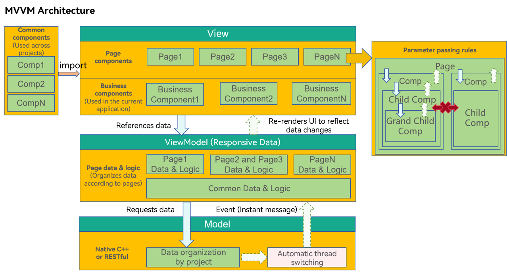
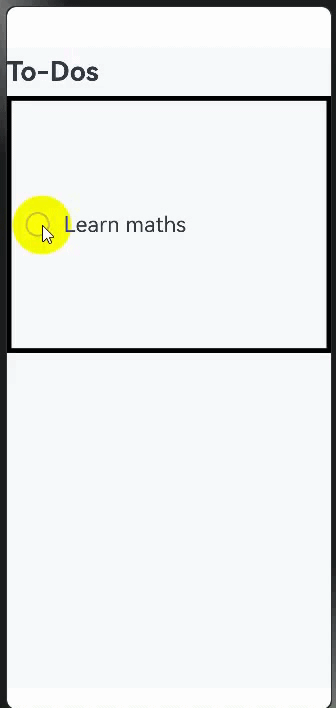
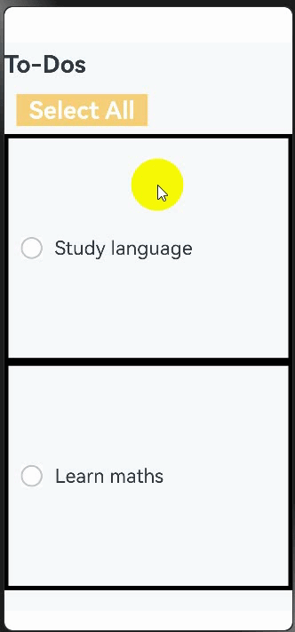
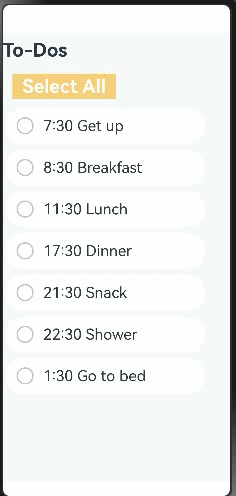
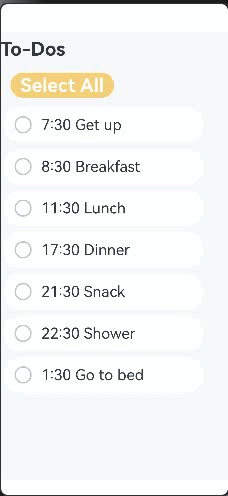
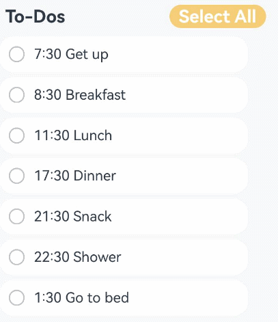

# MVVM (V1)
<!--Kit: ArkUI-->
<!--Subsystem: ArkUI-->
<!--Owner: @zzq212050299-->
<!--Designer: @s10021109-->
<!--Tester: @TerryTsao-->
<!--Adviser: @zhang_yixin13-->

After mastering the basic concepts of state management, developers usually try to develop their own applications. In the early stage of application development, if the project structure is not carefully planned, the number of state variables increases as the project expands and becomes complex. As a result, the relationships between components become complex. In this case, developing new functions may cause a chain reaction and increase maintenance costs. This document describes the MVVM mode and the relationship between the UI development mode of ArkUI and MVVM, and provides guidance for developers to design the project structure to facilitate product development and maintenance during product iteration and upgrade.


Most decorators are covered in this topic, therefore, you are advised to read [State Management Overview](./arkts-state-management-overview.md) and topics related to decorators of V1 to have a basic understanding of state management V1 before getting started.

## Introduction

### Concept

During application development, UI updates need to synchronize data status changes in real time, which directly affects application performance and user experience. To reduce the complexity of data and UI synchronization, ArkUI uses the Model-View-ViewModel (MVVM) architecture. The MVVM divides an application into three core parts: Model, View, and ViewModel to separate data, views, and logic. In this mode, the UI can automatically update the status change to manage the binding and update of data and views more efficiently.

- View: indicates the user interface layer. Displays user interfaces and interacts with users. It does not contain any service logic. It is dynamically updated by binding the data provided by the ViewModel layer.
- Model: indicates the data access layer. It is data-centric and does not directly interact with the user interface. Defines data structures, manages data (such as obtaining, storing, and updating data), and processes service logic.
- ViewModel: indicates the logical layer. Generally, a View corresponds to a ViewModel. The View and ViewModel can communicate with each other in either of the following ways:

  1. Method invoking: The view listens to user behavior through events and triggers the method at the ViewModel layer in the callback. For example, when a view detects a user's button click behavior, the method corresponding to the ViewModel is called to process the user operation. 
  2. Bidirectional binding: Views are bound to ViewModel data to implement bidirectional synchronization. 

The UI development mode of ArkUI belongs to the MVVM mode. By introducing the concept of MVVM, you may have basic understanding on how the state management work in MVVM. State management aims to drive data update and enable you to focus only on page design without paying attention to the UI re-render logic. In addition, ViewModel enables state variables to automatically maintain data. In this way, MVVM provides a more efficient way for you to develop applications.

### ArkUI Development

The UI development mode of ArkUI is the MVVM mode. State variables play the role of ViewModel in the MVVM mode. The UI is updated upwards and data is updated downwards. The following figure shows the overall framework.



### Layer Description

**View**

The View layer consists of the following components:
* Page components: All applications are classified by page, such as the login page, list page, editing page, help page, and copyright page. The data required by each page may be completely different, or the data required by multiple pages may be the same.
* Business components: a functional component that has some service capabilities of the application. Typically, the business component may be associated with the data in the ViewModel of the project and cannot be shared with other projects.
* Common components: Like system components, these components are not associated with the ViewModel data in the application. These components can be shared across multiple projects to implement common functions.

**Model**

The Model layer is the original data provider of applications and represents the core service logic and data of applications.

**ViewModel**

Provides data for components at the View layer and organizes the data by page. When a user browses a page, some pages may not be displayed. Therefore, it is recommended that the page data be designed in lazy loading (on-demand loading) mode.

> The differences between the ViewModel data and the Model data are as follows:
>
> Data at the Model layer is organized based on the entire project to form a complete application service data system.
>
> ViewModel data provides data used on a page. It may be a part of the service data of the entire application. In addition, ViewModel also provides auxiliary data for page display, which may be irrelevant to the application services.

### Core Principles of the Architecture

**Cross-layer access is not allowed.**

* View cannot directly call data from Model. Instead, use the methods provided by ViewModel to call.
* The Model layer cannot directly operate the UI. It can only notify the ViewModel layer of data updates, and the ViewModel layer updates the corresponding data.

**The lower layer cannot access the upper layer data.**

The lower-layer data updates the upper-layer data in notification mode. In the service logic, the lower layer cannot directly obtain the upper-layer data. For example, the logic processing at the ViewModel layer should not depend on a value on the View layer.

**Non-parent-child components cannot directly access each other.**

This is the core principle of the View layer design. A component must have the following logic:

* Do not directly access the parent component. Event or subscription capability must be used.
* Do not directly access sibling components. This is because a component can access only its child nodes (through parameter transfer) and parent nodes (through events or notifications) to decouple components.

For a component, the reasons are as follows:

* The child components used by the component are clear, therefore, access is allowed.
* The parent node where the component is placed is unknown. Therefore, the component can access the parent node only through notifications or events.
* It is impossible for a component to know its sibling nodes, so the component cannot manipulate the sibling nodes.

## Memo Development

This section describes how to use the ArkUI framework to design your own applications. This section describes how to develop functions without designing the code architecture. That is, functions are developed as required without considering subsequent maintenance. In addition, this section describes the decorators required for function development.

### @State

* The [@State](./arkts-state.md) decorator is one of the most commonly used decorators and is used to define state variables. Generally, these state variables are used as the data source of the parent component. When a developer clicks a state variable, the state variable is updated and the UI is refreshed.

<!-- @[state_source_update_refresh](https://gitcode.com/openharmony/applications_app_samples/blob/master/code/DocsSample/ArkUISample/ArktsMvvmSample/entry/src/main/ets/pages/StateIndex.ets) -->

``` TypeScript
@Entry
@Component
struct StateIndex {
  @State isFinished: boolean = false;

  build() {
    Column() {
      Row() {
        // Replace $r('app.string.all_tasks') with the actual resource file. In this example, the value of the resource file is All to-dos.
        Text($r('app.string.all_tasks'))
          .fontSize(30)
          .fontWeight(FontWeight.Bold)
      }
      .width('100%')
      .margin({ top: 10, bottom: 10 })

      // To-Do list
      Row({ space: 15 }) {
        if (this.isFinished) {
          // Replace $r('app.media.finished') with the actual resource file.
          Image($r('app.media.finished'))
            .width(28)
            .height(28)
        } else {
          // Replace $r('app.media.unfinished') with the actual resource file.
          Image($r('app.media.unfinished'))
            .width(28)
            .height(28)
        }
        // Replace $r('app.string.all_learn_advanced_math') with the actual resource file. In this example, the value of the resource file is Learning Heights.
        Text($r('app.string.learn_advanced_math'))
          .fontSize(24)
          .decoration({ type: this.isFinished ? TextDecorationType.LineThrough : TextDecorationType.None })
      }
      .height('40%')
      .width('100%')
      .border({ width: 5 })
      .padding({ left: 15 })
      .onClick(() => {
        this.isFinished = !this.isFinished;
      })
    }
    .height('100%')
    .width('100%')
    .margin({ top: 5, bottom: 5 })
    .backgroundColor('#90f1f3f5')
  }
}
```

The following figure shows the final effect.



### @Prop and @Link

In the preceding example, all code is written in the @Entry component. As more and more components need to be rendered, the @Entry component must be split. Therefore, the split subcomponents need to use the \@Prop and \@Link decorators.

* [\@Prop](./arkts-prop.md) is a unidirectional transfer between the parent and child components. The child component deeply copies the data of the parent component and updates the data from the parent component or itself. However, the data is not synchronized to the parent component.
* [\@Link](./arkts-link.md) is transmitted bidirectionally between the parent and child components. When the parent component changes, all \@Links are notified. In addition, the data source of the parent component is notified of the \@Link update.

<!-- @[prop_link_update_refresh](https://gitcode.com/openharmony/applications_app_samples/blob/master/code/DocsSample/ArkUISample/ArktsMvvmSample/entry/src/main/ets/pages/PropLinkIndex.ets) -->

``` TypeScript
@Component
struct PropLinkTodoComponent {
  build() {
    Row() {
      // Replace $r('app.string.all_tasks') with the actual resource file. In this example, the value of the resource file is All to-dos.
      Text($r('app.string.all_tasks'))
        .fontSize(30)
        .fontWeight(FontWeight.Bold)
    }
    .width('100%')
    .margin({ top: 10, bottom: 10 })
  }
}

@Component
struct PropLinkAllChooseComponent {
  @Link isFinished: boolean;

  build() {
    Row() {
      // Replace $r('app.string.check_all') with the actual resource file. In this example, the value of the resource file is All.
      Button($r('app.string.check_all'), { type: ButtonType.Normal })
        .onClick(() => {
          this.isFinished = !this.isFinished;
        })
        .fontSize(30)
        .fontWeight(FontWeight.Bold)
        .backgroundColor('#f7f6cc74')
    }
    .padding({ left: 15 })
    .width('100%')
    .margin({ top: 10, bottom: 10 })
  }
}

@Component
struct ThingComponent1 {
  @Prop isFinished: boolean;

  build() {
    // Task 1
    Row({ space: 15 }) {
      if (this.isFinished) {
        // Replace $r('app.media.finished') with the actual resource file.
        Image($r('app.media.finished'))
          .width(28)
          .height(28)
      } else {
        // Replace $r('app.media.unfinished') with the actual resource file.
        Image($r('app.media.unfinished'))
          .width(28)
          .height(28)
      }
      // Replace $r('app.string.learn_chinese') with the actual resource file. In this example, the value of the resource file is "Learning language."
      Text($r('app.string.learn_chinese'))
        .fontSize(24)
        .decoration({ type: this.isFinished ? TextDecorationType.LineThrough : TextDecorationType.None })
    }
    .height('40%')
    .width('100%')
    .border({ width: 5 })
    .padding({ left: 15 })
    .onClick(() => {
      this.isFinished = !this.isFinished;
    })
  }
}

@Component
struct ThingComponent2 {
  @Prop isFinished: boolean;

  build() {
    // Task 1
    Row({ space: 15 }) {
      if (this.isFinished) {
        // Replace $r('app.media.finished') with the actual resource file.
        Image($r('app.media.finished'))
          .width(28)
          .height(28)
      } else {
        // Replace $r('app.media.unfinished') with the actual resource file.
        Image($r('app.media.unfinished'))
          .width(28)
          .height(28)
      }
      // Replace $r('app.string.learn_advanced_math') with the actual resource file. In this example, the value of the resource file is Learning Heights.
      Text($r('app.string.learn_advanced_math'))
        .fontSize(24)
        .decoration({ type: this.isFinished ? TextDecorationType.LineThrough : TextDecorationType.None })
    }
    .height('40%')
    .width('100%')
    .border({ width: 5 })
    .padding({ left: 15 })
    .onClick(() => {
      this.isFinished = !this.isFinished;
    })
  }
}

@Entry
@Component
struct PropLinkIndex {
  @State isFinished: boolean = false;

  build() {
    Column() {
      // All To-Do items.
      PropLinkTodoComponent()

      // Select all.
      PropLinkAllChooseComponent({ isFinished: this.isFinished })

      // Task 1
      ThingComponent1({ isFinished: this.isFinished })

      // Task 2
      ThingComponent2({ isFinished: this.isFinished })
    }
    .height('100%')
    .width('100%')
    .margin({ top: 5, bottom: 5 })
    .backgroundColor('#90f1f3f5')
  }
}
```


Below is how the component looks with the system bar effect applied.



### Rendering Repeated Components

* Although subcomponents are split in the previous example, the code of component 1 is similar to that of component 2. When the rendered components have the same settings except data, you need to use [ForEach loop rendering](../../reference/apis-arkui/arkui-ts/ts-rendering-control-foreach.md).
* In this way, redundant code is decreased and the code structure is clearer.

<!-- @[foreach_update_refresh](https://gitcode.com/openharmony/applications_app_samples/blob/master/code/DocsSample/ArkUISample/ArktsMvvmSample/entry/src/main/ets/pages/ForEachIndex.ets) -->

``` TypeScript
@Component
struct ForEachTodoComponent {
  build() {
    Row() {
      // Replace $r('app.string.all_tasks') with the actual resource file. In this example, the value of the resource file is All to-dos.
      Text($r('app.string.all_tasks'))
        .fontSize(30)
        .fontWeight(FontWeight.Bold)
    }
    .width('100%')
    .margin({ top: 10, bottom: 10 })
  }
}

@Component
struct ForEachAllChooseComponent {
  @Link isFinished: boolean;

  build() {
    Row() {
      // Replace $r('app.string.check_all') with the actual resource file. In this example, the value of the resource file is All.
      Button($r('app.string.check_all'), { type: ButtonType.Normal })
        .onClick(() => {
          this.isFinished = !this.isFinished;
        })
        .fontSize(30)
        .fontWeight(FontWeight.Bold)
        .backgroundColor('#f7f6cc74')
    }
    .padding({ left: 15 })
    .width('100%')
    .margin({ top: 10, bottom: 10 })
  }
}

@Component
struct ForEachThingComponent {
  @Prop isFinished: boolean;
  @Prop thing: string;

  build() {
    // Task 1
    Row({ space: 15 }) {
      if (this.isFinished) {
        // Replace $r('app.media.finished') with the actual resource file.
        Image($r('app.media.finished'))
          .width(28)
          .height(28)
      } else {
        // Replace $r('app.media.unfinished') with the actual resource file.
        Image($r('app.media.unfinished'))
          .width(28)
          .height(28)
          // ...
      }
      Text(`${this.thing}`)
        .fontSize(24)
        .decoration({ type: this.isFinished ? TextDecorationType.LineThrough : TextDecorationType.None })
    }
    .height('8%')
    .width('90%')
    .padding({ left: 15 })
    .opacity(this.isFinished ? 0.3 : 1)
    .border({ width: 1 })
    .borderColor(Color.White)
    .borderRadius(25)
    .backgroundColor(Color.White)
    .onClick(() => {
      this.isFinished = !this.isFinished;
    })
  }
}

@Entry
@Component
struct ForEachIndex {
  @State isFinished: boolean = false;
  @State planList: ResourceStr[] = [
    // Replace $r('app.string.get_up') with the actual resource file. In this example, the value of the resource file is 7:30 Get up.
    $r('app.string.get_up'),
    // Replace $r('app.string.breakfast') with the actual resource file. In this example, the value of the resource file is 8:30 Breakfast.
    $r('app.string.breakfast'),
    // Replace $r('app.string.lunch') with the actual resource file. In this example, the value of the resource file is 11:30 Lunch.
    $r('app.string.lunch'),
    // Replace $r('app.string.dinner') with the actual resource file. In this example, the value of the resource file is 17:30 Dinner.
    $r('app.string.dinner'),
    // Replace $r('app.string.midnight_snack') with the actual resource file. In this example, the value of the resource file is 21:30 Snack.
    $r('app.string.midnight_snack'),
    // Replace $r('app.string.bathe') with the actual resource file. In this example, the value of the resource file is 22:30 Shower.
    $r('app.string.bathe'),
    // Replace $r('app.string.sleep') with the actual resource file. In this example, the value of the resource file is 1:30 Sleep.
    $r('app.string.sleep')
  ];
  context1 = this.getUIContext().getHostContext();

  aboutToAppear(): void {
    for (let i = 0; i < this.planList.length; i++) {
      this.planList[i] = this.context1!.resourceManager.getStringSync((this.planList[i] as Resource).id);
    };
  }

  build() {
    Column() {
      // All To-Do items.
      ForEachTodoComponent()

      // Select all.
      ForEachAllChooseComponent({ isFinished: this.isFinished })

      List() {
        ForEach(this.planList, (item: string) => {
          // Task 1
          ForEachThingComponent({ isFinished: this.isFinished, thing: item })
            .margin(5)
        })
      }
    }
    .height('100%')
    .width('100%')
    .margin({ top: 5, bottom: 5 })
    .backgroundColor('#90f1f3f5')
  }
}
```


Below is how the component looks with the system bar effect applied.



### @Builder

* The **Builder** method is used to define methods in a component so that the same code can be reused in the component.
* In this example, the [@Builder](./arkts-builder.md) method is used for deduplication and data is removed. The code is clearer and easier to read, the @Entry component is used only to process page construction logic and does not process a large amount of content irrelevant to page design.

<!-- @[builder_source_update_refresh](https://gitcode.com/openharmony/applications_app_samples/blob/master/code/DocsSample/ArkUISample/ArktsMvvmSample/entry/src/main/ets/pages/BuilderIndex.ets) -->

``` TypeScript
@Observed
class TodoListData {
  public planList: ResourceStr[] = [
    // Replace $r('app.string.get_up') with the actual resource file. In this example, the value of the resource file is 7:30 Get up.
    $r('app.string.get_up'),
    // Replace $r('app.string.breakfast') with the actual resource file. In this example, the value of the resource file is 8:30 Breakfast.
    $r('app.string.breakfast'),
    // Replace $r('app.string.lunch') with the actual resource file. In this example, the value of the resource file is 11:30 Lunch.
    $r('app.string.lunch'),
    // Replace $r('app.string.dinner') with the actual resource file. In this example, the value of the resource file is 17:30 Dinner.
    $r('app.string.dinner'),
    // Replace $r('app.string.midnight_snack') with the actual resource file. In this example, the value of the resource file is 21:30 Snack.
    $r('app.string.midnight_snack'),
    // Replace $r('app.string.bathe') with the actual resource file. In this example, the value of the resource file is 22:30 Shower.
    $r('app.string.bathe'),
    // Replace $r('app.string.sleep') with the actual resource file. In this example, the value of the resource file is 1:30 Sleep.
    $r('app.string.sleep')
  ];
}

@Component
struct StateTodoComponent {
  build() {
    Row() {
      // Replace $r('app.string.all_tasks') with the actual resource file. In this example, the value of the resource file is All to-dos.
      Text($r('app.string.all_tasks'))
        .fontSize(30)
        .fontWeight(FontWeight.Bold)
    }
    .width('100%')
    .margin({ top: 10, bottom: 10 })
  }
}

@Component
struct BuilderAllChooseComponent {
  @Link isFinished: boolean;

  build() {
    Row() {
      // Replace $r('app.string.check_all') with the actual resource file. In this example, the value of the resource file is All.
      Button($r('app.string.check_all'), { type: ButtonType.Capsule })
        .onClick(() => {
          this.isFinished = !this.isFinished;
        })
        .fontSize(30)
        .fontWeight(FontWeight.Bold)
        .backgroundColor('#f7f6cc74')
    }
    .padding({ left: 15 })
    .width('100%')
    .margin({ top: 10, bottom: 10 })
  }
}

@Component
struct BuilderThingComponent {
  @Prop isFinished: boolean;
  @Prop thing: string;

  @Builder
  displayIcon(icon: Resource) {
    Image(icon)
      .width(28)
      .height(28)
      .onClick(() => {
        this.isFinished = !this.isFinished;
      })
      // ...
  }

  build() {
    // Task 1
    Row({ space: 15 }) {
      if (this.isFinished) {
        // Replace $r('app.media.finished') with the actual resource file.
        this.displayIcon($r('app.media.finished'));
      } else {
        // Replace $r('app.media.unfinished') with the actual resource file.
        this.displayIcon($r('app.media.unfinished'));
      }
      Text(`${this.thing}`)
        .fontSize(24)
        .decoration({ type: this.isFinished ? TextDecorationType.LineThrough : TextDecorationType.None })
        .onClick(() => {
          // Replace $r('app.string.la_la') with the actual resource file. In this example, the value in the resource file is "la".
          this.thing += this.getUIContext().getHostContext()!.resourceManager.getStringSync($r('app.string.la_la').id);
        })
    }
    .height('8%')
    .width('90%')
    .padding({ left: 15 })
    .opacity(this.isFinished ? 0.3 : 1)
    .border({ width: 1 })
    .borderColor(Color.White)
    .borderRadius(25)
    .backgroundColor(Color.White)
  }
}

@Entry
@Component
struct BuilderIndex {
  @State isFinished: boolean = false;
  @State data: TodoListData = new TodoListData(); // View is bound to the ViewModel data.

  aboutToAppear(): void {
    for (let i = 0; i < this.data.planList.length; i++) {
      this.data.planList[i] =
        this.getUIContext().getHostContext()!.resourceManager.getStringSync((this.data.planList[i] as Resource).id);
    }
  }

  build() {
    Column() {
      // All To-Do items.
      StateTodoComponent()

      // Select all.
      BuilderAllChooseComponent({ isFinished: this.isFinished })

      List() {
        ForEach(this.data.planList, (item: string) => {
          // Task 1
          BuilderThingComponent({ isFinished: this.isFinished, thing: item })
            .margin(5)
        })
      }
    }
    .height('100%')
    .width('100%')
    .margin({ top: 5, bottom: 5 })
    .backgroundColor('#90f1f3f5')
  }
}
```


 Below is how the component looks with the system bar effect applied.



### Summary

* By gradually optimizing the code structure, you can see that the @Entry component is the entry of the page. The build function should only combine the required components, which is similar to building blocks. A child component called by a page is similar to a building block and waits to be called by a required page. A state variable is similar to an adhesive. When a UI refresh event is triggered, the state variable automatically refreshes the bound component to implement on-demand page refresh.
* Although the existing architecture does not use the design concept of MVVM, the core concept of MVVM has emerged. The UI development of ArkUI is naturally suitable for the MVVM mode. In ArkUI, pages and components form the View layer. Pages organize components, and components are elements. When a component needs to be updated, a state variable is used to drive the component to be updated, so as to update a page. ViewModel data comes from the Model layer.
* The code function in the example is simple. However, as the function increases, the code amount of the home page increases. When more functions need to be added to Notepad and other pages also need to use the components of the main page, you can use the MVVM mode to organize the project structure.

## Developing a To-Do List Through MVVM

The previous section shows the code organization in non-MVVM mode. With the increase of the main page code, a proper layering policy should be adopted to make the project structure clear and prevent components from referencing each other. This avoids the difficulty in updating functions during subsequent maintenance. This section describes how to use the MVVM to reconstruct the code in the previous section based on the core file organization mode of the MVVM.

### MVVM File Structure

```txt
├── src
│   ├── ets
│   │   ├── pages Stores page components.
│   │   ├── views Stores service components.
│   │   ├── shares Stores common components.
│   │   └── viewmodel Data service.
│   │   │   ├── LoginViewModel.ets Login page ViewModel.
│   │   │   └── xxxViewModel.ets Other pages ViewModel.
│
```

### Layered Design

**Model**

* The Model layer stores the core data structure of the application. This layer is not closely related to UI development. You can encapsulate the data structure based on your service logic.

**ViewModel**

> Note:
>
> The ViewModel layer not only stores data, but also provides data services and processing.

* The ViewModel layer is the data layer that serves views. The design has two features:
  1. Data is organized based on pages.
  2. Data on each page is lazy loaded.

**View**

The View layer is organized as required. You need to distinguish the following three types of components at this layer:

* Page components: provides the overall page layout, implements redirection between multiple pages, and processes foreground and background events.
* Business components: referenced by a page to construct a page.
* Shared components: shared by multiple projects.

> The differences between shared components and business components are as follows:
>
> The service component contains the ViewModel data. Without the ViewModel, the component cannot run.
>
> A shared component does not contain ViewModel data and requires external data. It contains a custom component that can work as long as external parameters (without service parameters) are met.

### Sample Code

The organizational structure is reconstructed based on the MVVM model as follows:

```txt
├── src
│   ├── ets
│   │   ├── model
│   │   │   ├── ThingModel.ets
│   │   │   └── TodoListModel.ets
│   │   ├── pages
│   │   │   ├── Index.ets
│   │   ├── views
│   │   │   ├── AllChooseComponent.ets
│   │   │   ├── ThingComponent.ets
│   │   │   ├── TodoComponent.ets
│   │   │   └── TodoListComponent.ets
│   │   ├── viewmodel
│   │   │   ├── ThingViewModel.ets
│   │   │   └── TodoListViewModel.ets
│   └── resources
│   │   ├── rawfile
│   │   │   ├── default_tasks.json
│
```

The code is as follows:

  * ThingModel.ets

  <!-- @[thing_model_class](https://gitcode.com/openharmony/applications_app_samples/blob/master/code/DocsSample/ArkUISample/ArktsMvvmSample/entry/src/main/ets/model/ThingModel.ets) -->
  
  ``` TypeScript
  export default class ThingModel {
    public thingName: string = 'Todo';
    public isFinish: boolean = false;
  }
  ```

  * TodoListModel.ets

  <!-- @[to_do_list_model_class](https://gitcode.com/openharmony/applications_app_samples/blob/master/code/DocsSample/ArkUISample/ArktsMvvmSample/entry/src/main/ets/model/TodoListModel.ets) --> 
  
  ``` TypeScript
  import { common } from '@kit.AbilityKit';
  import { util } from '@kit.ArkTS';
  import { hilog } from '@kit.PerformanceAnalysisKit';
  import ThingModel from './ThingModel';
  
  const DOMAIN = 0x0001;
  const TAG = 'TodoListModel';
  
  export default class TodoListModel {
    public things: Array<ThingModel> = [];
  
    constructor(things: Array<ThingModel>) {
      this.things = things;
    }
  
    async loadTasks(context: common.UIAbilityContext) {
      try {
        let getJson = await context.resourceManager.getRawFileContent('default_tasks.json');
        let textDecoderOptions: util.TextDecoderOptions = { ignoreBOM: true };
        let textDecoder = util.TextDecoder.create('utf-8', textDecoderOptions);
        let result = textDecoder.decodeToString(getJson, { stream: false });
        this.things = JSON.parse(result);
      } catch (error) {
        hilog.error(DOMAIN, TAG, 'Failed to load tasks. Cause: %{public}s', JSON.stringify(error.message));
      }
    }
  }
  ```

  * Index.ets

  <!-- @[mvvm_model_main_index](https://gitcode.com/openharmony/applications_app_samples/blob/master/code/DocsSample/ArkUISample/ArktsMvvmSample/entry/src/main/ets/pages/Index.ets) -->
  
  ``` TypeScript
  import { common } from '@kit.AbilityKit';
  // import ViewModel
  import TodoListViewModel from '../viewmodel/TodoListViewModel';
  
  // import View
  import { TodoComponent } from '../views/TodoComponent';
  import { AllChooseComponent } from '../views/AllChooseComponent';
  import { TodoListComponent } from '../views/TodoListComponent';
  
  @Entry
  @Component
  struct TodoList {
    @State todoListViewModel: TodoListViewModel = new TodoListViewModel(); // View is bound to the ViewModel data.
    private context = this.getUIContext().getHostContext() as common.UIAbilityContext;
  
    async aboutToAppear() {
      await this.todoListViewModel.loadTasks(this.context);
    }
  
    build() {
      Column() {
        Row({ space: 40 }) {
          // All To-Do items.
          TodoComponent()
          // Select all.
          AllChooseComponent({ todoListViewModel: this.todoListViewModel })
        }
  
        Column() {
          TodoListComponent({ thingViewModelArray: this.todoListViewModel.things })
        }
      }
      .height('100%')
      .width('100%')
      .margin({ top: 5, bottom: 5 })
      .backgroundColor('#90f1f3f5')
    }
  }
  ```

  * AllChooseComponent.ets

  <!-- @[all_choose_component_view](https://gitcode.com/openharmony/applications_app_samples/blob/master/code/DocsSample/ArkUISample/ArktsMvvmSample/entry/src/main/ets/views/AllChooseComponent.ets) -->  
  
  ``` TypeScript
  import TodoListViewModel from '../viewmodel/TodoListViewModel';
  import { common } from '@kit.AbilityKit';
  
  @Component
  export struct AllChooseComponent {
    context1 = this.getUIContext().getHostContext() as common.UIAbilityContext;
    // In the resources\base\element\string.json file, set name to 'check_all' and value to a non-null string.
    @State titleName: ResourceStr = this.context1.resourceManager.getStringSync($r('app.string.check_all').id);
    @Link todoListViewModel: TodoListViewModel;
  
    build() {
      Row() {
        Button(`${this.titleName}`, { type: ButtonType.Capsule })
          .onClick(() => {
            this.todoListViewModel.chooseAll(); // When a click event occurs at the View layer, call the ViewModel-layer method chooseAll to process the logic.
            this.titleName = this.todoListViewModel.isChosen ?
              // In the resources\base\element\string.json file, set name to 'check_all' and value to a non-null string.
              this.context1.resourceManager.getStringSync($r('app.string.check_all').id)
              // In the resources\base\element\string.json file, set name to 'deselect_all' and value to a non-null string.
              : this.context1.resourceManager.getStringSync($r('app.string.deselect_all').id);
          })
          .fontSize(30)
          .fontWeight(FontWeight.Bold)
          .backgroundColor('#f7f6cc74')
      }
      .padding({ left: this.todoListViewModel.isChosen ? 15 : 0 })
      .width('100%')
      .margin({ top: 10, bottom: 10 })
    }
  }
  ```


  * ThingComponent.ets

  <!-- @[thing_component_view](https://gitcode.com/openharmony/applications_app_samples/blob/master/code/DocsSample/ArkUISample/ArktsMvvmSample/entry/src/main/ets/views/ThingComponent.ets) -->
  
  ``` TypeScript
  import ThingViewModel from '../viewmodel/ThingViewModel';
  
  @Component
  export struct ThingComponent {
    @ObjectLink thing: ThingViewModel;
  
    @Builder
    displayIcon(icon: Resource) {
      Image(icon)
        .width(28)
        .height(28)
        .onClick(() => {
          this.thing.updateIsFinish(); // When a click event occurs at the View layer, call the ViewModel-layer method updateIsFinish to process the logic.
        })
        .id(this.thing.thingName)
    }
  
    build() {
      // To-Do list
      Row({ space: 15 }) {
        if (this.thing.isFinish) {
          // Replace $r('app.media.finished') with the actual resource file.
          this.displayIcon($r('app.media.finished'));
        } else {
          // Replace $r('app.media.unfinished') with the actual resource file.
          this.displayIcon($r('app.media.unfinished'));
        }
  
        Text(`${this.thing.thingName}`)
          .fontSize(24)
          .decoration({ type: this.thing.isFinish ? TextDecorationType.LineThrough : TextDecorationType.None })
          .onClick(() => {
            this.thing.addSuffixes(); // When a click event occurs at the View layer, call the ViewModel-layer method addSuffixes to process the logic.
          })
      }
      .height('8%')
      .width('90%')
      .padding({ left: 15 })
      .opacity(this.thing.isFinish ? 0.3 : 1)
      .border({ width: 1 })
      .borderColor(Color.White)
      .borderRadius(25)
      .backgroundColor(Color.White)
    }
  }
  ```

  * TodoComponent.ets

  <!-- @[to_do_component_view](https://gitcode.com/openharmony/applications_app_samples/blob/master/code/DocsSample/ArkUISample/ArktsMvvmSample/entry/src/main/ets/views/TodoComponent.ets) -->
  
  ``` TypeScript
  @Component
  export struct TodoComponent {
    build() {
      Row() {
        // Replace $r('app.string.all_tasks') with the actual resource file. In this example, the value of the resource file is All to-dos.
        Text($r('app.string.all_tasks'))
          .fontSize(30)
          .fontWeight(FontWeight.Bold)
      }
      .padding({ left: 15 })
      .width('50%')
      .margin({ top: 10, bottom: 10 })
    }
  }
  ```


  * TodoListComponent.ets

  <!-- @[to_do_list_component_view](https://gitcode.com/openharmony/applications_app_samples/blob/master/code/DocsSample/ArkUISample/ArktsMvvmSample/entry/src/main/ets/views/TodoListComponent.ets) -->
  
  ``` TypeScript
  import ThingViewModel from '../viewmodel/ThingViewModel';
  import { ThingViewModelArray } from '../viewmodel/TodoListViewModel'
  import { ThingComponent } from './ThingComponent';
  
  @Component
  export struct TodoListComponent {
    @ObjectLink thingViewModelArray: ThingViewModelArray;
  
    build() {
      Column() {
        List() {
          ForEach(this.thingViewModelArray, (item: ThingViewModel) => {
            // To-Do list
            ListItem() {
              ThingComponent({ thing: item })
                .margin(5)
            }
          }, (item: ThingViewModel) => {
            return item.thingName;
          })
        }
      }
    }
  }
  ```

  * ThingViewModel.ets

  <!-- @[thing_view_model](https://gitcode.com/openharmony/applications_app_samples/blob/master/code/DocsSample/ArkUISample/ArktsMvvmSample/entry/src/main/ets/viewmodel/ThingViewModel.ets) -->
  
  ``` TypeScript
  import ThingModel from '../model/ThingModel';
  
  @Observed
  export default class ThingViewModel {
    @Track public thingName: string = 'Todo';
    @Track public isFinish: boolean = false;
    public context: Context = AppStorage.get('context')!;
  
    updateTask(thing: ThingModel) {
      this.thingName = thing.thingName;
      this.isFinish = thing.isFinish;
    }
  
    updateIsFinish(): void {
      this.isFinish = !this.isFinish;
    }
  
    addSuffixes(): void {
      // In the resources\base\element\string.json file, set name to 'la_la' and value to a non-null string.
      this.thingName += this.context.resourceManager.getStringSync($r('app.string.la_la').id);
    }
  }
  ```
  

  * TodoListViewModel.ets

  <!-- @[to_do_list_view_model](https://gitcode.com/openharmony/applications_app_samples/blob/master/code/DocsSample/ArkUISample/ArktsMvvmSample/entry/src/main/ets/viewmodel/TodoListViewModel.ets) --> 
  
  ``` TypeScript
  import ThingViewModel from './ThingViewModel';
  import { common } from '@kit.AbilityKit';
  import TodoListModel from '../model/TodoListModel';
  
  @Observed
  export class ThingViewModelArray extends Array<ThingViewModel> {
  }
  
  @Observed
  export default class TodoListViewModel {
    @Track public isChosen: boolean = true;
    @Track public things: ThingViewModelArray = new ThingViewModelArray();
  
    async loadTasks(context: common.UIAbilityContext) {
      let todoList = new TodoListModel([]);
      await todoList.loadTasks(context);
      for (let thing of todoList.things) {
        let todoListViewModel = new ThingViewModel();
        todoListViewModel.updateTask(thing);
        this.things.push(todoListViewModel);
      }
    }
  
    chooseAll(): void {
      for (let thing of this.things) {
        thing.isFinish = this.isChosen;
      }
      this.isChosen = !this.isChosen;
    }
  }
  ```

  * default_tasks.json

  ```typescript
  [
    {"thingName": "7:30 Get up", "isFinish": false},
    {"thingName": "8:30 Breakfast", "isFinish": false},
    {"thingName": "11:30 Lunch", "isFinish": false},
    {"thingName": "17:30 Dinner", "isFinish": false},
    {"thingName": "21:30 Snack", "isFinish": false},
    {"thingName": "22:30 Shower", "isFinish": false},
    {"thingName": "1:30 Go to bed", "isFinish": false}
  ]
  ```

  After the MVVM mode is split, the code structure and module responsibilities are clearer. The new page needs to use an event component, for example, TodoListComponent. You only need to import the component.

  The following figure shows the effect.

  

  

  
