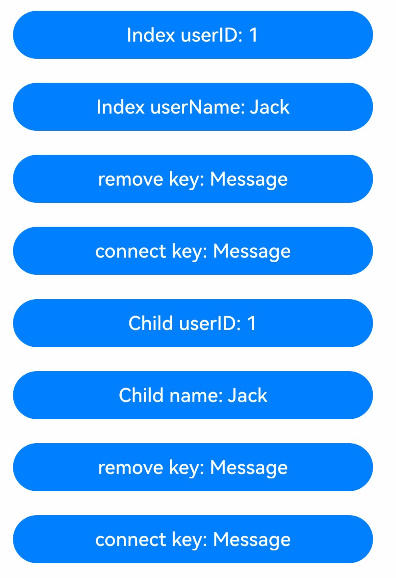
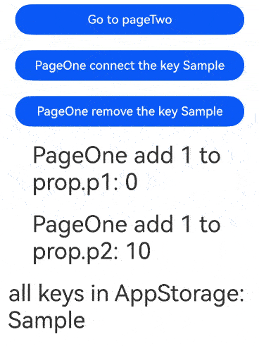

# AppStorageV2: Storing Application-wide UI State

<!--Kit: ArkUI-->
<!--Subsystem: ArkUI-->
<!--Owner: @jiyujia926-->
<!--Designer: @zhangboren-->
<!--Tester: @TerryTsao-->
<!--Adviser: @zhang_yixin13-->
<!-- md-trans-meta sourceCommit=3efb4ba336409dd0731ba011e1e227786db57fa2 translatedAt=2026-07-22T02:04:35.657Z pushedAt=2026-07-24T01:13:48.668Z -->

To enhance the state management framework's capability of sharing application‑wide UI state variables, you can use AppStorageV2 to store the data of global UI state variables for the application.

AppStorageV2 provides the capability of globally sharing state variables within an application. You can bind the same key through **connect** to share data across abilities.

Before reading this topic, you are advised to read [\@ComponentV2](./arkts-create-custom-components.md#componentv2), [\@ObservedV2 and \@Trace](./arkts-new-observedV2-and-trace.md), and API reference of [AppStorageV2-API](../../reference/apis-arkui/js-apis-stateManagement.md#appstoragev2).

>**NOTE**
>
>AppStorageV2 is supported since API version 12.
>

## Overview

AppStorageV2 is a singleton created when the application UI is started. It is used to provide a central storage of application status data that can be accessed at the application level and remains persistent throughout the application lifecycle. Properties in AppStorageV2 are accessed using unique key strings. It should be noted that data between AppStorage and AppStorageV2 is not shared.

The **connect** API of AppStorageV2 enables synchronization with UI components.

AppStorageV2 supports state sharing among multiple UIAbility instances in the [main thread](../../application-models/thread-model-stage.md) of the same application.

## How to Use

- **connect**: creates or obtains the stored data.

>**NOTE**
>
>1. The second parameter is used when no **key** is specified, and the third parameter is used otherwise (including when the second parameter is invalid).
>
>2. If the data has been stored in AppStorageV2, you can obtain the stored data without using the default constructor. If the data has not been stored, you must specify a default constructor; otherwise, an application exception will be thrown.
>
>3. Ensure that the data types match the key. Connecting different types of data to the same key will result in an application exception.
>
>4. You are advised to use meaningful values for keys. The values can contain letters, digits, and underscores (_) and a maximum of 255 characters. Using invalid characters or null characters will result in undefined behavior.
>
>5. When matching the key with the [\@Observed](arkts-observed-and-objectlink.md) object, specify the key or customize the **name** property.

- **remove**: deletes the stored data of a specified key.

>**NOTE**
>
>If a key that does not exist in AppStorageV2 is deleted, a warning is reported.

- **keys**: returns all keys in AppStorageV2.

For details about the preceding APIs, see [AppStorageV2](../../reference/apis-arkui/js-apis-stateManagement.md#appstoragev2) in the API reference.

## Constraints

1. Only the class type is supported. Otherwise, a runtime error is reported. Since API version 23, the error code [140103](../../reference/apis-arkui/errorcode-stateManagement.md#140103-appstoragev2-and-persistencev2-use-unsupported-data-types) will be returned.

2. Must be used together with UI (UI thread) and cannot be used in other threads. For example, [@Sendable](../../arkts-utils/arkts-sendable.md) is not supported.

3. The [collections.Set](../../reference/apis-arkts/arkts-apis-arkts-collections-Set.md) and [collections.Map](../../reference/apis-arkts/arkts-apis-arkts-collections-Map.md) types are not supported.

4. Non-built-in types, such as [PixelMap](../../reference/apis-image-kit/arkts-apis-image-PixelMap.md), NativePointer, and [ArrayList](../../reference/apis-arkts/js-apis-arraylist.md), are not supported.

5. Primitive types, such as string, number, and boolean, are not supported. Note: The lack of support for storing primitive types means that the type passed to the **connect** API cannot be a primitive type. However, the class passed to **connect** can contain primitive types.

## Use Scenarios

### Using AppStorageV2

AppStorageV2 provides the **connect** API to enable data modification and synchronization. When modified data is decorated with @Trace, changes automatically trigger UI re-rendering. Note that the **remove** API only deletes data from AppStorageV2 without affecting already instantiated component data.

<!-- @[appStorageV2_index](https://gitcode.com/openharmony/applications_app_samples/blob/master/code/DocsSample/ArkUISample/AppStorageV2/entry/src/main/ets/pages/AppStorageV2.ets) -->

``` TypeScript
import { AppStorageV2 } from '@kit.ArkUI';

@ObservedV2
class Message {
  @Trace public userID: number;
  public userName: string;

  constructor(userID?: number, userName?: string) {
    this.userID = userID ?? 1;
    this.userName = userName ?? 'Jack';
  }
}

@Entry
@ComponentV2
struct Index {
  // Use connect to create an object with key Message in AppStorageV2.
  // Changes to the return value of connect will be synchronized back to AppStorageV2.
  @Local message: Message = AppStorageV2.connect<Message>(Message, () => new Message())!;

  build() {
    Column() {
      // Modifying class properties decorated with @Trace will synchronously update the UI.
      Button(`Index userID: ${this.message.userID}`)
        .width(300)
        .margin(10)
        .onClick(() => {
          this.message.userID += 1;
        })
      // Modifying class properties not decorated with @Trace will not update the UI, but changes are still synchronized back to AppStorageV2.
      Button(`Index userName: ${this.message.userName}`)
        .width(300)
        .margin(10)
        .onClick(() => {
          this.message.userName += 'suf';
        })
      // Clicking the button deletes the object with key Message from AppStorageV2.
      // After removal, changes to the parent component's userId are still synchronized to the child component, because remove only deletes the object from AppStorageV2 and does not affect the existing component data.
      Button('remove key: Message')
        .width(300)
        .margin(10)
        .onClick(() => {
          AppStorageV2.remove<Message>(Message);
        })
      // Clicking the button adds an object with key Message to AppStorageV2.
      // After removal, when the key is re-added and the userID in both parent and child components is modified, it is found that the data is out of sync. Once the child component reconnects via connect(), the data becomes consistent again.
      Button('connect key: Message')
        .width(300)
        .margin(10)
        .onClick(() => {
          this.message = AppStorageV2.connect<Message>(Message, () => new Message(5, 'Rose'))!;
        })
      Divider()
      Child()
    }
    .width('100%')
    .height('100%')
  }
}

@ComponentV2
struct Child {
  // Use connect to obtain the object with key Message from AppStorageV2 (created in the parent component).
  @Local message: Message = AppStorageV2.connect<Message>(Message, () => new Message())!;
  @Local name: string = this.message.userName;

  build() {
    Column() {
      // Modifying @Trace decorated properties updates the UI, and the change is propagated to the parent component.
      Button(`Child userID: ${this.message.userID}`)
        .width(300)
        .margin(10)
        .onClick(() => {
          this.message.userID += 5;
        })
      // After the userName property is modified in the parent component, clicking the name button synchronizes the parent's class property changes.
      Button(`Child name: ${this.name}`)
        .width(300)
        .margin(10)
        .onClick(() => {
          this.name = this.message.userName;
        })
      // Clicking the button deletes the object with key Message from AppStorageV2.
      // After remove, modifying userID in the parent and child components causes them to change synchronously, because remove only deletes from AppStorageV2 without affecting the data already existing in the components.
      Button('remove key: Message')
        .width(300)
        .margin(10)
        .onClick(() => {
          AppStorageV2.remove<Message>(Message);
        })
      // Clicking the button adds an object with key Message to AppStorageV2.
      // After remove and re-add, modifying userID in the parent and child components shows that the data is no longer synchronized. After the parent component reconnects, the data becomes consistent.
      Button('connect key: Message')
        .width(300)
        .margin(10)
        .onClick(() => {
          this.message = AppStorageV2.connect<Message>(Message, () => new Message(10, 'Lucy'))!;
        })
    }
    .width('100%')
    .height('100%')
  }
}
```



### Storing Data Between Two Pages

Data page

<!-- @[appStorageV2_sample](https://gitcode.com/openharmony/applications_app_samples/blob/master/code/DocsSample/ArkUISample/AppStorageV2/entry/src/main/ets/pages/Sample.ets) -->

``` TypeScript
// Data center.
// Sample.ets
@ObservedV2
export class Sample {
  @Trace public p1: number = 0;
  public p2: number = 10;
}
```

Page 1

<!-- @[appStorageV2_pageOne](https://gitcode.com/openharmony/applications_app_samples/blob/master/code/DocsSample/ArkUISample/AppStorageV2/entry/src/main/ets/pages/PageOne.ets) -->

``` TypeScript
import { AppStorageV2 } from '@kit.ArkUI';
import { Sample } from './Sample';

@Entry
@ComponentV2
struct PageOne {
  // Create a key-value pair with Sample as the key in AppStorageV2 (if the key exists, existing data in AppStorageV2 is returned) and associate it with prop.
  @Local prop: Sample = AppStorageV2.connect(Sample, () => new Sample())!;
  pageStack: NavPathStack = new NavPathStack();

  build() {
    Navigation(this.pageStack) {
      Column() {
        Button('Go to pageTwo')
          .width(300)
          .margin(10)
          .onClick(() => {
            this.pageStack.pushPathByName('PageTwo', null);
          })

        Button('PageOne connect the key Sample')
          .width(300)
          .margin(10)
          .onClick(() => {
            // Create a key-value pair with Sample as the key in AppStorageV2 (if the key exists, existing data in AppStorageV2 is returned) and associate it with prop.
            this.prop = AppStorageV2.connect(Sample, 'Sample', () => new Sample())!;
          })

        Button('PageOne remove the key Sample')
          .width(300)
          .margin(10)
          .onClick(() => {
            // After deletion from AppStorageV2, prop will no longer be associated with the value whose key is Sample.
            AppStorageV2.remove(Sample);
          })

        Text(`PageOne add 1 to prop.p1: ${this.prop.p1}`)
          .fontSize(30)
          .margin(10)
          .onClick(() => {
            this.prop.p1++;
          })

        Text(`PageOne add 1 to prop.p2: ${this.prop.p2}`)
          .fontSize(30)
          .margin(10)
          .onClick(() => {
            // The page is not re-rendered, but the value of p2 is changed.
            this.prop.p2++;
          })

        // Obtain all current keys in AppStorageV2.
        Text(`all keys in AppStorageV2: ${AppStorageV2.keys()}`)
          .fontSize(30)
          .margin(10)
      }
    }
  }
}
```

Page 2

<!-- @[appStorageV2_pageTwo](https://gitcode.com/openharmony/applications_app_samples/blob/master/code/DocsSample/ArkUISample/AppStorageV2/entry/src/main/ets/pages/PageTwo.ets) -->

``` TypeScript
import { AppStorageV2 } from '@kit.ArkUI';
import { Sample } from './Sample';

@Builder
export function PageTwoBuilder() {
  PageTwo()
}

@ComponentV2
struct PageTwo {
  // Create a key-value pair with Sample as the key in AppStorageV2 (if the key exists, existing data in AppStorageV2 is returned) and associate it with prop.
  @Local prop: Sample = AppStorageV2.connect(Sample, () => new Sample())!;
  pathStack: NavPathStack = new NavPathStack();

  build() {
    NavDestination() {
      Column() {
        Button('PageTwo connect the key Sample1')
          .width(300)
          .margin(10)
          .onClick(() => {
            // Create a key-value pair with Sample1 as the key in AppStorageV2 (if the key exists, existing data in AppStorageV2 is returned) and associate it with prop.
            this.prop = AppStorageV2.connect(Sample, 'Sample1', () => new Sample())!;
          })

        Text(`PageTwo add 1 to prop.p1: ${this.prop.p1}`)
          .fontSize(30)
          .margin(10)
          .onClick(() => {
            this.prop.p1++;
          })

        Text(`PageTwo add 1 to prop.p2: ${this.prop.p2}`)
          .fontSize(30)
          .margin(10)
          .onClick(() => {
            // The page is not re-rendered, but the value of p2 is changed, which is performed after re-initialization.
            this.prop.p2++;
          })

        // Obtain all current keys in AppStorageV2.
        Text(`all keys in AppStorageV2: ${AppStorageV2.keys()}`)
          .fontSize(30)
          .margin(10)
      }
    }
    .onReady((context: NavDestinationContext) => {
      this.pathStack = context.pathStack;
    })
  }
}
```

When using **Navigation**, create a **route_map.json** file as shown below in the **src/main/resources/base/profile** directory, replacing the value of **pageSourceFile** with the actual path to **PageTwo**. Then, add **"routerMap": "$profile: route_map"** to the **module.json5** file.

```json
{
  "routerMap": [
    {
      "name": "PageTwo",
      "pageSourceFile": "src/main/ets/pages/PageTwo.ets",
      "buildFunction": "PageTwoBuilder",
      "data": {
        "description" : "AppStorageV2 example"
      }
    }
  ]
}
```

