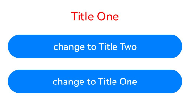

# \@Event Decorator: Standardizing Component Output

<!--Kit: ArkUI-->
<!--Subsystem: ArkUI-->
<!--Owner: @jiyujia926-->
<!--Designer: @zhangboren-->
<!--Tester: @TerryTsao-->
<!--Adviser: @zhang_yixin13-->
<!-- md-trans-meta sourceCommit=3efb4ba336409dd0731ba011e1e227786db57fa2 translatedAt=2026-07-22T02:05:47.047Z pushedAt=2026-07-23T12:01:18.035Z -->

To enable a child component to request the parent component to update \@Param decorated variables, developers can use the [\@Event](../../reference/apis-arkui/arkui-ts/ts-state-management-event.md#event) decorator. Using \@Event to decorate a callback method is a convention that indicates the child component needs a callback to update the data source.

\@Event works with \@Param to implement two-way data synchronization. Before reading this topic, you are advised to read [\@Param](./arkts-new-param.md).

>**NOTE**
>
> The \@Event decorator is supported in custom components decorated with \@ComponentV2 since API version 12.
>
> This decorator can be used in atomic services since API version 12.
>
> This decorator can be used in ArkTS widgets since API version 23.

## Overview

Since the variables decorated with \@Param cannot be changed locally, you can use the \@Event decorator to define a callback for updating the data source. Combined with the synchronization mechanism of [\@Local](arkts-new-local.md), it allows changes to propagate back to \@Param decorated variables, achieving active updates to @Param decorated variables.

\@Event is used to decorate a component's output methods. When using this decorator, note the following:

- You need to determine the parameters and return value in the callback decorated with \@Event.

- \@Event has no effect when decorating non-callback variables. If uninitialized, it automatically generates an empty function as the default callback.

- If \@Event is not initialized externally but has a default value, the default function will be used for processing.

\@Param marks the input of a component, indicating that the decorated variable is affected by the parent component. \@Event marks the output of a component, allowing the child component to influence the parent. Decorating a callback with \@Event indicates that the callback is the output of the custom component. The parent component needs to determine whether to provide the corresponding method for the child component to change the data source of the \@Param variable.

## Decorator Description

| \@Event Decorator| Description|
| ------------------- | ------------------------------------------------------------ |
| Decorator parameters| None.|
| Allowed variable types| Callback, such as **()=>void** and **(x:number)=>boolean**. You can specify the return value and whether the callback contains parameters.|
| Allowed function types| Arrow function.|

## Constraints

- The \@Event can be used only in custom components decorated with [\@ComponentV2](./arkts-create-custom-components.md#componentv2). It does not take effect if the decorated variable is not a function.

  ```ts
  @ComponentV2
  struct Index {
    @Event changeFactory: () => void = () => {}; // Correct usage.
    @Event message: string = 'abcd'; // Incorrect usage: Decorating a non-function variable, @Event has no effect.
  }
  @Component
  struct Index {
    @Event changeFactory: () => void = () => {}; // Incorrect usage. An error is reported during compilation.
  }
  ```

## Use Scenarios

### Changing Variables in the Parent Component

You can use \@Event to change a variable in the parent component. When the variable is used as the data source of the \@Param variable in the child component, this change will be synchronized accordingly.

<!-- @[EventDecoratorTest1](https://gitcode.com/openharmony/applications_app_samples/blob/master/code/DocsSample/ArkUISample/EventDecorator/entry/src/main/ets/pages/EventDecoratorTest1.ets) -->  

``` TypeScript
@Entry
@ComponentV2
struct Index {
  @Local title: string = 'Title One';
  @Local fontColor: Color = Color.Red;

  build() {
    Column() {
      Child({
        title: this.title,
        fontColor: this.fontColor,
        changeFactory: (type: number) => {
          if (type == 1) {
            this.title = 'Title One';
            this.fontColor = Color.Red;
          } else if (type == 2) {
            this.title = 'Title Two';
            this.fontColor = Color.Green;
          }
        }
      })
    }
    .width('100%')
  }
}

@ComponentV2
struct Child {
  @Param title: string = '';
  @Param fontColor: Color = Color.Black;
  @Event changeFactory: (x: number) => void = (x: number) => {};

  build() {
    Column() {
      Text(`${this.title}`)
        .fontColor(this.fontColor)
        .fontSize(20)
        .margin(10)
      // Use changeFactory to change the variable in the parent component.
      Button('change to Title Two')
        .width(300)
        .margin(10)
        .onClick(() => {
          this.changeFactory(2);
        })
      Button('change to Title One')
        .width(300)
        .margin(10)
        .onClick(() => {
          this.changeFactory(1);
        })
    }
    .width('100%')
  }
}
```



Note that using \@Event to change the value of the parent component takes effect immediately. However, the process of synchronizing the change from the parent component to the child component is asynchronous. That is, after the method of \@Event is called, the value of the child component does not change immediately. This is because \@Event passes the actual change capability of the child component value to the parent component for processing. After the parent component determines how to process the value, the final value is synchronized back to the child component before rendering.

<!-- @[EventDecoratorTest2](https://gitcode.com/openharmony/applications_app_samples/blob/master/code/DocsSample/ArkUISample/EventDecorator/entry/src/main/ets/pages/EventDecoratorTest2.ets) -->  

``` TypeScript
import { hilog } from '@kit.PerformanceAnalysisKit';
const TAG = '[Sample_EventDecorator]';
const DOMAIN = 0xF811;
@ComponentV2
struct Child2 {
  @Param index: number = 0;
  @Event changeIndex: (val: number) => void;

  build() {
    Column() {
      Text(`Child index: ${this.index}`)
        .fontSize(20)
        .margin(10)
        .onClick(() => {
          this.changeIndex(20);
          // Output the child component this.index and verify that the value is not immediately synchronized back to the child component after @Event is called.
          hilog.info(DOMAIN, TAG, `after changeIndex ${this.index}`);
        })
    }
    .width('100%')
  }
}
@Entry
@ComponentV2
struct Index2 {
  @Local index: number = 0;

  build() {
    Column() {
      Child2({
        index: this.index,
        changeIndex: (val: number) => {
          this.index = val;
          // Output the index of the parent component for comparison with the logs on the child component side.
          hilog.info(DOMAIN, TAG, `in changeIndex ${this.index}`);
        }
      })
    }
    .width('100%')
  }
}
```


In the preceding example, clicking the text triggers the \@Event function event to change the value of the child component. The printed log is as follows:

```text
in changeIndex 20
after changeIndex 0
```

This indicates that after **changeIndex** is called, the **index** in the parent component has changed, but the one in the child component has not changed yet.