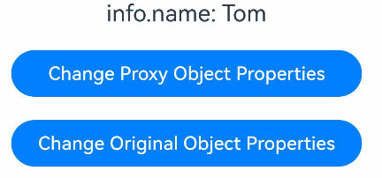
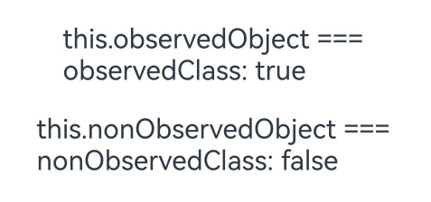
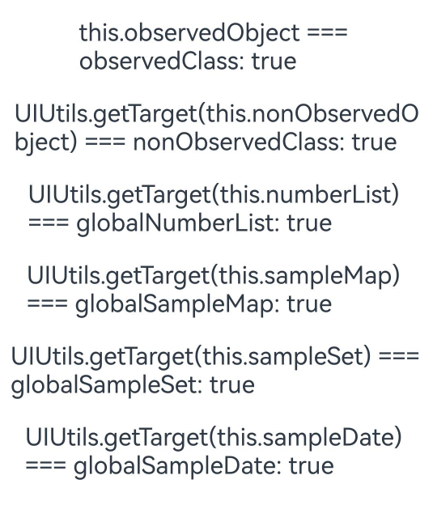
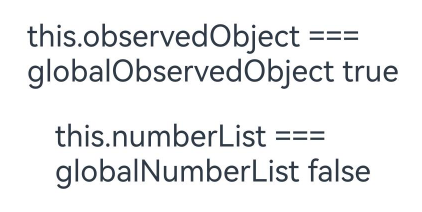
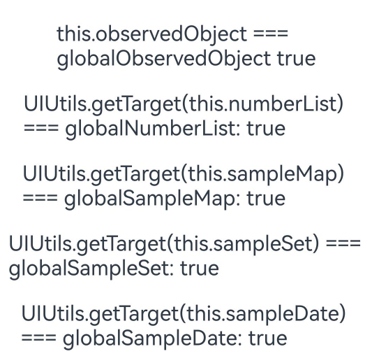

# getTarget API: Obtaining Original Objects

<!--Kit: ArkUI-->
<!--Subsystem: ArkUI-->
<!--Owner: @jiyujia926-->
<!--Designer: @zhangboren-->
<!--Tester: @TerryTsao-->
<!--Adviser: @zhang_yixin13-->
<!-- md-trans-meta sourceCommit=3efb4ba336409dd0731ba011e1e227786db57fa2 translatedAt=2026-07-22T02:05:47.921Z pushedAt=2026-07-23T11:59:45.042Z -->

To obtain the original object before a proxy is added by the state management framework, you can use the [getTarget](../../reference/apis-arkui/js-apis-stateManagement.md#gettarget) API.

Before reading this topic, you are advised to review [\@Observed](./arkts-observed-and-objectlink.md) and [\@ObservedV2](./arkts-new-observedV2-and-trace.md).

>**NOTE**
>
>The **getTarget** API in UIUtils is supported since API version 12.

## Overview

The state management framework adds proxies to original objects of the class, Date, Map, Set, and Array types to observe attribute changes and API invoking. Proxies will change the variable types. In scenarios such as type determination and Node-API invoking, unexpected results may be generated because the variable type is not the type of the original object.

- Import the UIUtils to use the **getTarget** API.

  ```ts
  import { UIUtils } from '@kit.ArkUI';
  ```

- In state management V1, proxies are added to the following to observe changes in top-level properties or changes triggered by API calls: (1) instances of classes decorated with \@Observed; (2) objects of the class, Date, Map, Set, and Array types decorated with [\@State](./arkts-state.md) or other state variable decorators.

- In state management V2, proxies are added to the following to observe changes triggered by API calls: objects of the Date, Map, Set, and Array types decorated with [\@Trace](./arkts-new-observedV2-and-trace.md), [\@Local](./arkts-new-local.md), or other state variable decorators.

The **getTarget** API is used to obtain the original objects of these proxy objects.

## Constraints

- Only the parameters of the object type can be passed by **getTarget**.

  ```ts
  import { UIUtils } from '@kit.ArkUI';
  let resNumber = UIUtils.getTarget(2); // Passing a non-object type argument causes a compilation error.
  let resObject = UIUtils.getTarget(2 as Object); // Non-object type input parameter. The input value is returned directly, bypassing the compilation interception. This is an incorrect usage.
  ```

  ``` TypeScript
  import { UIUtils } from '@kit.ArkUI';
  @Observed
  class Info {
    public name: string = 'Tom';
  }
  let info: Info = new Info();
  let rawInfo: Info = UIUtils.getTarget (info); // Correct usage.
  ```

- Changes to the content in the original object obtained by **getTarget** cannot be observed nor trigger UI re-renders.

  <!-- @[Changes_to_the_content_in_the_original](https://gitcode.com/openharmony/applications_app_samples/blob/master/code/DocsSample/ArkUISample/NewGettarget/entry/src/main/ets/View/GetTargetObject.ets) --> 

  ``` TypeScript
  import { UIUtils } from '@kit.ArkUI';
  @Observed
  class Info {
    public name: string = 'Tom';
  }
  @Entry
  @Component
  struct GetTargetObject {
    @State info: Info = new Info();
  
    build() {
      Column() {
        Text(`info.name: ${this.info.name}`)
          .fontSize(20)
          .margin(10)
        Button('Change Proxy Object Properties')
          .width(300)
          .margin(10)
          .onClick(() => {
            this.info.name = 'Alice'; // The Text component can be re-rendered.
          })
        Button('Change Original Object Properties')
          .width(300)
          .margin(10)
          .onClick(() => {
            let rawInfo: Info = UIUtils.getTarget(this.info);
            rawInfo.name = 'Bob'; // The Text component cannot be re-rendered.
          })
      }
      .width('100%')
    }
  }
  ```



## Use Scenarios

### Obtaining the Original Object Before Proxy Addition in State Management V1

State management V1 adds proxies to the following objects:

1. Instances of classes decorated with \@Observed. A proxy is automatically added to an instance of a class decorated with \@Observed when the instance is created. This occurs during the **new** process. In the following example, classes not decorated with \@Observed are not proxied.

<!-- @[nonObservedClass_outOne](https://gitcode.com/openharmony/applications_app_samples/blob/master/code/DocsSample/ArkUISample/NewGettarget/entry/src/main/ets/View/GetTargetAgent.ets) --> 

``` TypeScript
@Observed
class ObservedClass {
  public name: string = 'Tom';
}
class NonObservedClass {
  public name: string = 'Tom';
}
let observedClass: ObservedClass = new ObservedClass(); // Proxied.
let nonObservedClass: NonObservedClass = new NonObservedClass(); // Not proxied.
```

2. Complex-type objects decorated with state variable decorators Proxies are added to objects of the Class, Map, Set, Date, or Array type decorated with \@State, [\@Prop](./arkts-prop.md), or other state variable decorators. If the object is already a proxy, no new proxy is added.

<!-- @[nonObservedObject_1](https://gitcode.com/openharmony/applications_app_samples/blob/master/code/DocsSample/ArkUISample/NewGettarget/entry/src/main/ets/View/GetTargetNoChange.ets) --> 

``` TypeScript
@Observed
class ObservedClassOne {
  public name: string = 'Tom';
}
class NonObservedClassOne {
  public name: string = 'Tom';
}
let observedClass: ObservedClassOne = new ObservedClassOne(); // Proxied.
let nonObservedClass: NonObservedClassOne = new NonObservedClassOne(); // Not proxied.
@Entry
@Component
struct GetTargetNoChange {
  @State observedObject: ObservedClassOne = observedClass; // No new proxy is created (the object is already proxied).
  @State nonObservedObject: NonObservedClassOne = nonObservedClass; // A proxy is created.
  @State numberList: number[] = [1, 2, 3]; // A proxy is created for the Array type.
  @State sampleMap: Map<number, string> = new Map([[0, 'a'], [1, 'b'], [3, 'c']]); // A proxy is created for the Map type.
  @State sampleSet: Set<number> = new Set([0, 1, 2, 3, 4]); // A proxy is created for the Set type.
  @State sampleDate: Date = new Date(); // A proxy is created for the Date type.

  build() {
    Column() {
      Text(`this.observedObject === observedClass: ${this.observedObject === observedClass}`) // true
        .fontSize(20)
        .margin(10)
      Text(`this.nonObservedObject === nonObservedClass: ${this.nonObservedObject === nonObservedClass}`) // false
        .fontSize(20)
        .margin(10)
    }
    .width('100%')
  }
}
```



Use **UIUtils.getTarget** to obtain the original objects before proxies are added.

<!-- @[nonObservedClass_out](https://gitcode.com/openharmony/applications_app_samples/blob/master/code/DocsSample/ArkUISample/NewGettarget/entry/src/main/ets/View/GetTargetAgent.ets) --> 

``` TypeScript
import { UIUtils } from '@kit.ArkUI';
@Observed
class ObservedClass {
  public name: string = 'Tom';
}
class NonObservedClass {
  public name: string = 'Tom';
}
let observedClass: ObservedClass = new ObservedClass(); // Proxied.
let nonObservedClass: NonObservedClass = new NonObservedClass(); // Not proxied.
let globalNumberList: number[] = [1, 2, 3]; // Not proxied.
let globalSampleMap: Map<number, string> = new Map([[0, 'a'], [1, 'b'], [3, 'c']]); // Not proxied.
let globalSampleSet: Set<number> = new Set([0, 1, 2, 3, 4]); // Not proxied.
let globalSampleDate:Date = new Date (); // Not proxied.
@Entry
@Component
struct GetTargetAgent {
  @State observedObject: ObservedClass = observedClass; // No new proxy is created (the object is already proxied).
  @State nonObservedObject: NonObservedClass = nonObservedClass; // A proxy is created.
  @State numberList: number[] = globalNumberList; // A proxy is created for the Array type.
  @State sampleMap: Map<number, string> = globalSampleMap; // A proxy is created for the Map type.
  @State sampleSet: Set<number> = globalSampleSet; // A proxy is created for the Set type.
  @State sampleDate: Date = globalSampleDate; // A proxy is created for the Date type.

  build() {
    Column() {
      Text(`this.observedObject === observedClass: ${this.observedObject ===
        observedClass}`) // true
        .fontSize(20)
        .margin(10)
      Text(`UIUtils.getTarget(this.nonObservedObject) === nonObservedClass: ${UIUtils.getTarget(this.nonObservedObject) ===
        nonObservedClass}`) // true
        .fontSize(20)
        .margin(10)
      Text(`UIUtils.getTarget(this.numberList) === globalNumberList: ${UIUtils.getTarget(this.numberList) ===
        globalNumberList}`) // true
        .fontSize(20)
        .margin(10)
      Text(`UIUtils.getTarget(this.sampleMap) === globalSampleMap: ${UIUtils.getTarget(this.sampleMap) ===
        globalSampleMap}`) // true
        .fontSize(20)
        .margin(10)
      Text(`UIUtils.getTarget(this.sampleSet) === globalSampleSet: ${UIUtils.getTarget(this.sampleSet) ===
        globalSampleSet}`) // true
        .fontSize(20)
        .margin(10)
      Text(`UIUtils.getTarget(this.sampleDate) === globalSampleDate: ${UIUtils.getTarget(this.sampleDate) ===
        globalSampleDate}`) // true
        .fontSize(20)
        .margin(10)
    }
    .width('100%')
  }
}
```



### Obtaining the Original Object Before Proxy Addition in State Management V2

In state management V2, proxies are added to objects of the Map, Set, Date, and Array type decorated with \@Trace, \@Local, or other state variable decorators. Unlike in state management V1, no proxies are added to class instances in state management V2.

<!-- @[observedObject_globalObservedObject](https://gitcode.com/openharmony/applications_app_samples/blob/master/code/DocsSample/ArkUISample/NewGettarget/entry/src/main/ets/View/GetAgentObject.ets) --> 

``` TypeScript
@ObservedV2
class ObservedClassTwo {
  @Trace public name: string = 'Tom';
}
let globalObservedObject: ObservedClassTwo = new ObservedClassTwo(); // Not proxied.
let globalNumberList: number[] = [1, 2, 3]; // Not proxied.
let globalSampleMap: Map<number, string> = new Map([[0, 'a'], [1, 'b'], [3, 'c']]); // Not proxied.
let globalSampleSet: Set<number> = new Set([0, 1, 2, 3, 4]); // Not proxied.
let globalSampleDate:Date = new Date (); // Not proxied.
@Entry
@ComponentV2
struct GetAgentObject {
  @Local observedObject: ObservedClassTwo = globalObservedObject; // Objects in V2 are not proxied.
  @Local numberList: number[] = globalNumberList; // A proxy is created for the Array type.
  @Local sampleMap: Map<number, string> = globalSampleMap; // A proxy is created for the Map type.
  @Local sampleSet: Set<number> = globalSampleSet; // A proxy is created for the Set type.
  @Local sampleDate: Date = globalSampleDate; // A proxy is created for the Date type.

  build() {
    Column() {
      Text(`this.observedObject === globalObservedObject ${this.observedObject === globalObservedObject}`) // true
        .fontSize(20)
        .margin(10)
      Text(`this.numberList === globalNumberList ${this.numberList === globalNumberList}`) // false
        .fontSize(20)
        .margin(10)
    }
    .width('100%')
  }
}
```



Use **UIUtils.getTarget** to obtain the original objects before proxies are added.

<!-- @[NonObservedClass_outs](https://gitcode.com/openharmony/applications_app_samples/blob/master/code/DocsSample/ArkUISample/NewGettarget/entry/src/main/ets/View/GetBeforeAgent.ets) --> 

``` TypeScript
import { UIUtils } from '@kit.ArkUI';
@ObservedV2
class ObservedClassThree {
  @Trace public name: string = 'Tom';
}
let globalObservedObject: ObservedClassThree = new ObservedClassThree(); // Not proxied.
let globalNumberList: number[] = [1, 2, 3]; // Not proxied.
let globalSampleMap: Map<number, string> = new Map([[0, 'a'], [1, 'b'], [3, 'c']]); // Not proxied.
let globalSampleSet: Set<number> = new Set([0, 1, 2, 3, 4]); // Not proxied.
let globalSampleDate:Date = new Date (); // Not proxied.
@Entry
@ComponentV2
struct GetBeforeAgent {
  @Local observedObject: ObservedClassThree = globalObservedObject; // Objects in V2 are not proxied.
  @Local numberList: number[] = globalNumberList; // A proxy is created for the Array type.
  @Local sampleMap: Map<number, string> = globalSampleMap; // A proxy is created for the Map type.
  @Local sampleSet: Set<number> = globalSampleSet; // A proxy is created for the Set type.
  @Local sampleDate: Date = globalSampleDate; // A proxy is created for the Date type.

  build() {
    Column() {
      Text(`this.observedObject === globalObservedObject ${this.observedObject ===
        globalObservedObject}`) // true
        .fontSize(20)
        .margin(10)
      Text(`UIUtils.getTarget(this.numberList) === globalNumberList: ${UIUtils.getTarget(this.numberList) ===
        globalNumberList}`) // true
        .fontSize(20)
        .margin(10)
      Text(`UIUtils.getTarget(this.sampleMap) === globalSampleMap: ${UIUtils.getTarget(this.sampleMap) ===
        globalSampleMap}`) // true
        .fontSize(20)
        .margin(10)
      Text(`UIUtils.getTarget(this.sampleSet) === globalSampleSet: ${UIUtils.getTarget(this.sampleSet) ===
        globalSampleSet}`) // true
        .fontSize(20)
        .margin(10)
      Text(`UIUtils.getTarget(this.sampleDate) === globalSampleDate: ${UIUtils.getTarget(this.sampleDate) ===
        globalSampleDate}`) // true
        .fontSize(20)
        .margin(10)
    }
    .width('100%')
  }
}
```



In state management V2, decorators generate getter and setter methods for the decorated variables, and add the **\_\_ob\_** prefix to the original variable names. For performance purposes, the **getTarget** API does not process the prefix added by decorators in V2. Therefore, when an instance of a class decorated with \@ObservedV2 is passed to the **getTarget** API, the returned object remains the instance itself, and the property name decorated with \@Trace still has the **\_\_ob\_** prefix.

This prefix causes some Node-APIs to fail to process object properties as expected.<br>Example:<br>Affected Node-APIs include the following:

``` TypeScript
@ObservedV2
class Info {
  @Trace public name: string = 'Tom';
  @Trace public age: number = 24;
}
let info: Info = new Info(); // info instance passed in through Node-APIs.
```

| Name             | Result                                      |
| ----------------------- | ---------------------------------------------- |
| [napi_get_property_names](../../napi/use-napi-about-property.md#napi_get_property_names) | Returns property names with the **\_\_ob\_** prefix, for example, **\_\_ob\_name** or **\_\_ob\_age**.       |
| [napi_set_property](../../napi/use-napi-about-property.md#napi_set_property)       | Changes values successfully using the original name (for example, **name**) or the name with the **\_\_ob\_** prefix (for example, **\_\_ob\_name**).      |
| [napi_get_property](../../napi/use-napi-about-property.md#napi_get_property)       | Obtains values using the original name (for example, **name**) or the name with the **\_\_ob\_** prefix (for example, **\_\_ob\_name**).      |
| [napi_has_property](../../napi/use-napi-about-property.md#napi_has_property)       | Returns **true** for both the original name (for example, **name**) or the name with the **\_\_ob\_** prefix (for example, **\_\_ob\_name**).        |
| [napi_delete_property](../../napi/use-napi-about-property.md#napi_delete_property)    | Requires the **\_\_ob\_** prefix for successful deletion.|
| [napi_has_own_property](../../napi/use-napi-about-property.md#napi_has_own_property)   | Returns **true** for both the original name (for example, **name**) or the name with the **\_\_ob\_** prefix (for example, **\_\_ob\_name**).        |
| [napi_set_named_property](../../napi/use-napi-about-property.md#napi_set_named_property) | Changes values successfully using the original name (for example, **name**) or the name with the **\_\_ob\_** prefix (for example, **\_\_ob\_name**).      |
| [napi_get_named_property](../../napi/use-napi-about-property.md#napi_get_named_property) | Obtains values using the original name (for example, **name**) or the name with the **\_\_ob\_** prefix (for example, **\_\_ob\_name**).      |
| [napi_has_named_property](../../napi/use-napi-about-property.md#napi_has_named_property) | Returns **true** for both the original name (for example, **name**) or the name with the **\_\_ob\_** prefix (for example, **\_\_ob\_name**).        |