# @ObservedV2 and @Trace Decorators: Observing Property Changes in Classes
<!--Kit: ArkUI-->
<!--Subsystem: ArkUI-->
<!--Owner: @jiyujia926-->
<!--Designer: @zhangboren-->
<!--Tester: @TerryTsao-->
<!--Adviser: @zhang_yixin13-->
<!-- md-trans-meta sourceCommit=3efb4ba336409dd0731ba011e1e227786db57fa2 translatedAt=2026-07-22T02:08:00.950Z pushedAt=2026-07-23T11:23:19.381Z -->

To enhance the capability of the state management framework in observing changes to properties within class objects, you can use the [@ObservedV2](../../reference/apis-arkui/arkui-ts/ts-state-management-observedv2.md#observedv2) decorator and the [@Trace](../../reference/apis-arkui/arkui-ts/ts-state-management-trace.md#trace) decorator to decorate classes and properties in classes.


@ObservedV2 and @Trace provide the capability to directly observe changes to properties of nested class objects, which is one of the core capabilities in state management V2. Before reading this document, you are advised to read [State Management Overview](./arkts-state-management-overview.md) to understand the overall capability architecture of state management V2.

> **NOTE**
>
> The @ObservedV2 and @Trace decorators are supported since API version 12.
>
> Since API version 12, the @ObservedV2 and @Trace decorators are supported in ArkTS widgets.
>
> Since API version 12, the @ObservedV2 and @Trace decorators are supported in atomic services.

## Overview

The @ObservedV2 decorator and the @Trace decorator are used to decorate classes and properties in classes, so that the decorated classes and properties have the capability of deep observation:

- The @ObservedV2 decorator and the @Trace decorator must be used together. Using either the @ObservedV2 decorator or the @Trace decorator alone has no effect.
- When a property decorated by the @Trace decorator changes, only the components associated with that property are notified to refresh.
- In a nested class, a property in the nested class has the capability to trigger UI refresh only when it is decorated by @Trace and the nested class is decorated by @ObservedV2.
- In an inheritance class, a property in the parent class or child class has the capability to trigger UI refresh only when it is decorated by @Trace and the class where the property resides is decorated by @ObservedV2.
- A property not decorated by @Trace cannot be detected for changes when used in the UI, and cannot trigger UI refresh.
- A class that uses the @ObservedV2 and @Trace decorators must be instantiated using the new operator before it has the capability of being observed for changes.

## Limitations of State Management V1 for Directly Observing Nested Class Object Property Changes

The existing state management V1 cannot directly observe property changes of nested class objects.

<!-- @[Observed_Limitations](https://gitcode.com/openharmony/applications_app_samples/blob/master/code/DocsSample/ArkUISample/arktsobservedv2andtrace/entry/src/main/ets/pages/overview/Limitations.ets) -->  

``` TypeScript
@Observed
class Father {
  public son: Son;

  constructor(name: string, age: number) {
    this.son = new Son(name, age);
  }
}

@Observed
class Son {
  public name: string;
  public age: number;

  constructor(name: string, age: number) {
    this.name = name;
    this.age = age;
  }
}

@Entry
@Component
struct Index {
  @State father: Father = new Father('John', 8);

  build() {
    Row() {
      Column() {
        Text(`name: ${this.father.son.name} age: ${this.father.son.age}`)
          .fontSize(50)
          .fontWeight(FontWeight.Bold)
          .onClick(() => {
            // Nested class object property changes cannot be observed.
            this.father.son.age++;
          })
      }
      .width('100%')
    }
    .height('100%')
  }
}
```


In the code above, tapping the Text component to increment the age value does not trigger a UI refresh. This is because the existing state management framework cannot observe changes to the age property in the nested class. The V1 solution is to use the [@ObjectLink decorator](arkts-observed-and-objectlink.md) with a custom component to enable observation.

<!-- @[Realize_Observation](https://gitcode.com/openharmony/applications_app_samples/blob/master/code/DocsSample/ArkUISample/arktsobservedv2andtrace/entry/src/main/ets/pages/overview/RealizeObservation.ets) -->  

``` TypeScript
@Observed
class Father {
  public son: Son;

  constructor(name: string, age: number) {
    this.son = new Son(name, age);
  }
}

@Observed
class Son {
  public name: string;
  public age: number;

  constructor(name: string, age: number) {
    this.name = name;
    this.age = age;
  }
}

@Component
struct Child {
  // @Observed works with @ObjectLink to observe changes to properties of nested class objects.
  @ObjectLink son: Son;

  build() {
    Row() {
      Column() {
        Text(`name: ${this.son.name} age: ${this.son.age}`)
          .fontSize(50)
          .fontWeight(FontWeight.Bold)
          .margin(10)
          .onClick(() => {
            this.son.age++;
          })
      }
      .width('100%')
    }
    .height('100%')
  }
}

@Entry
@Component
struct Index {
  @State father: Father = new Father('John', 8);

  build() {
    Column() {
      Child({ son: this.father.son })
    }
    .width('100%')
  }
}
```


Although this approach can observe property changes in nested classes, the code becomes extremely complex and difficult to use when the nesting level is deep. Therefore, the class decorator @ObservedV2 and the member variable decorator @Trace are introduced to enhance the capability of observing property changes in nested classes.

## Decorator Description

| @ObservedV2 Class Decorator | Description                                                  |
| --------------------------- | ------------------------------------------------------------ |
| Decorator parameter         | None.                                                        |
| Class decorator             | Decorates a class. It must be placed before the class definition, and the class object is created using `new`. |

| @Trace Member Variable Decorator | Description                                                         |
| -------------------------------- | ------------------------------------------------------------ |
| Decorator parameter              | None.                                                           |
| Decoratable variables            | Member properties in a class. The property type can be number, string, boolean, class, [Array](#decorating-basic-type-arrays-with-trace), [Date](#decorating-date-type-with-trace), [Map](#decorating-map-type), [Set](#decorating-set-types-with-trace), and others. @Trace does not support observing Function type data. If a Function type property decorated by @Trace is modified, the UI will not be refreshed. |

## Observing Changes

Properties decorated by @Trace in a class decorated by @ObservedV2 have the capability to be observed for changes. When the property value changes, the UI component bound to the property is refreshed.

- Properties decorated by @Trace in a nested class have the capability to be observed for changes.

<!-- @[Observe_Changes](https://gitcode.com/openharmony/applications_app_samples/blob/master/code/DocsSample/ArkUISample/arktsobservedv2andtrace/entry/src/main/ets/pages/overview/ObserveChanges.ets) --> 

``` TypeScript
@ObservedV2
class Son {
  @Trace public age: number = 100;
}

class Father {
  public son: Son = new Son();
}

@Entry
@ComponentV2
struct Index {
  father: Father = new Father();

  build() {
    Column() {
      // When age is changed by clicking, the Text component refreshes.
      Text(`${this.father.son.age}`)
        .fontSize(20)
        .margin(10)
        .onClick(() => {
          this.father.son.age++;
        })
    }
    .width('100%')
  }
}
```


- Properties decorated with \@Trace in an inherited class can be observed for changes.

<!-- @[Inherited_Changes](https://gitcode.com/openharmony/applications_app_samples/blob/master/code/DocsSample/ArkUISample/arktsobservedv2andtrace/entry/src/main/ets/pages/overview/InheritedChanges.ets) --> 

``` TypeScript
@ObservedV2
class Father {
  @Trace public name: string = 'Tom';
}

class Son extends Father {
}

@Entry
@ComponentV2
struct Index {
  son: Son = new Son();

  build() {
    Column() {
      // When name is changed on click, the Text component refreshes.
      Text(`${this.son.name}`)
        .fontSize(20)
        .margin(10)
        .onClick(() => {
          this.son.name = 'Jack';
        })
    }
    .width('100%')
  }
}
```


- Static properties decorated with \@Trace in a class can be observed for changes.

<!-- @[Static_Attribute](https://gitcode.com/openharmony/applications_app_samples/blob/master/code/DocsSample/ArkUISample/arktsobservedv2andtrace/entry/src/main/ets/pages/overview/StaticAttribute.ets) --> 

``` TypeScript
@ObservedV2
class Manager {
  @Trace public static count: number = 1;
}

@Entry
@ComponentV2
struct Index {
  build() {
    Column() {
      // When count is changed on click, the Text component refreshes.
      Text(`${Manager.count}`)
        .fontSize(20)
        .margin(10)
        .onClick(() => {
          Manager.count++;
        })
    }
    .width('100%')
  }
}
```


- When @Trace decorates built-in types, changes caused by their respective APIs can be observed:

  | Type  | Observable API                                              |
  | ----- | ------------------------------------------------------------ |
  | Array | push, pop, shift, unshift, splice, copyWithin, fill, reverse, sort |
  | Date  | setFullYear, setMonth, setDate, setHours, setMinutes, setSeconds, setMilliseconds, setTime, setUTCFullYear, setUTCMonth, setUTCDate, setUTCHours, setUTCMinutes, setUTCSeconds, setUTCMilliseconds |
  | Map   | set, clear, delete                                           |
  | Set   | add, clear, delete                                           |

## Restrictions

The @ObservedV2 and @Trace decorators have the following usage restrictions:

- Non-@Trace decorated member properties used in the UI cannot trigger UI refresh.

<!-- @[UiRefresh_CannotTriggered](https://gitcode.com/openharmony/applications_app_samples/blob/master/code/DocsSample/ArkUISample/arktsobservedv2andtrace/entry/src/main/ets/pages/usagerestrictions/UiRefreshCannotTriggered.ets) --> 

``` TypeScript
@ObservedV2
class Person {
  public id: number = 0;
  @Trace public age: number = 8;
}

@Entry
@ComponentV2
struct Index {
  person: Person = new Person();

  build() {
    Column() {
      // age is decorated by @Trace and can trigger UI refresh when used in the UI.
      Text(`${this.person.age}`)
        .fontSize(20)
        .margin(10)
        .onClick(() => {
          this.person.age++; // A click triggers UI refresh.
        })
      // id is not decorated by @Trace and does not trigger UI refresh when used in the UI.
      Text(`${this.person.id}`) // No refresh occurs when id changes.
        .fontSize(20)
        .margin(10)
        .onClick(() => {
          this.person.id++; // A click does not trigger UI refresh.
        })
    }
    .width('100%')
  }
}
```

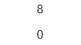

- \@ObservedV2 can only decorate classes, not custom components.

```ts
@ObservedV2 // Incorrect usage. This will cause a compilation error.
struct Index {
  build() {
  }
}
```

- \@Trace cannot be used on a class that is not decorated by \@ObservedV2.

```ts
class User {
  id: number = 0;
  @Trace name: string = 'Tom'; // Incorrect usage. This will cause a compilation error.
}
```

- \@Trace is a decorator for properties in a class and cannot be used in a struct.

```ts
@ComponentV2
struct Comp {
  @Trace message: string = 'Hello World'; // Incorrect usage. A compilation error occurs.

  build() {
  }
}
```

- \@ObservedV2 and \@Trace cannot be used together with [\@Observed](arkts-observed-and-objectlink.md) or [\@Track](arkts-track.md).

```ts
@Observed
class User {
  @Trace name: string = 'Tom'; // Incorrect usage. A compilation error occurs.
}

@ObservedV2
class Person {
  @Track name: string = 'Jack'; // Incorrect usage. A compilation error occurs.
}
```

- Classes decorated with @ObservedV2 and @Trace cannot be used together with V1 decorators such as [@State](arkts-state.md). A compilation error will occur.

<!-- @[Use_Mixture](https://gitcode.com/openharmony/applications_app_samples/blob/master/code/DocsSample/ArkUISample/arktsobservedv2andtrace/entry/src/main/ets/pages/usagerestrictions/UseMixture.ets) --> 

``` TypeScript
// Take the @State decorator as an example.
@ObservedV2
class Job {
  @Trace public jobName: string = 'Teacher';
}

@ObservedV2
class Info {
  @Trace public name: string = 'Tom';
  @Trace public age: number = 25;
  public job: Job = new Job();
}

@Entry
@ComponentV2
struct Index {
  // @State info: Info = new Info(); Cannot be mixed. A compilation error will occur.
  @Local info: Info = new Info();

  build() {
    Column() {
      Text(`name: ${this.info.name}`)
        .fontSize(20)
        .margin(10)
      Text(`age: ${this.info.age}`)
        .fontSize(20)
        .margin(10)
      Text(`jobName: ${this.info.job.jobName}`)
        .fontSize(20)
        .margin(10)
      Button('change age')
        .width(300)
        .margin(10)
        .onClick(() => {
          this.info.age++;
        })
      Button('Change job')
        .width(300)
        .margin(10)
        .onClick(() => {
          this.info.job.jobName = 'Doctor';
        })
    }
    .width('100%')
  }
}
```

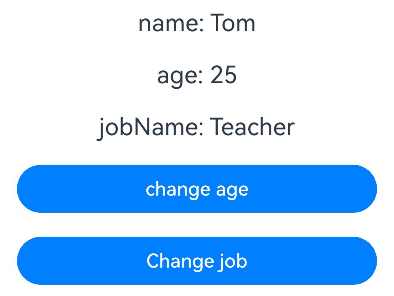

- Classes that inherit from @ObservedV2 cannot be used together with V1 decorators such as @State. A runtime error will occur.

<!-- @[Inheritance_Mixture](https://gitcode.com/openharmony/applications_app_samples/blob/master/code/DocsSample/ArkUISample/arktsobservedv2andtrace/entry/src/main/ets/pages/usagerestrictions/InheritanceMixture.ets) --> 

``` TypeScript
// Using the @State decorator as an example.
@ObservedV2
class Job {
  @Trace public jobName: string = 'Teacher';
}

@ObservedV2
class Info {
  @Trace public name: string = 'Tom';
  @Trace public age: number = 25;
  public job: Job = new Job();
}

class Message extends Info {
  constructor() {
    super();
  }
}

@Entry
@Component
struct Index {
  // @State message: Message = new Message();  Cannot be used together; a runtime error occurs.
  message: Message = new Message();

  build() {
    Column() {
      Text(`name: ${this.message.name}`)
        .fontSize(20)
        .margin(10)
      Text(`age: ${this.message.age}`)
        .fontSize(20)
        .margin(10)
      Text(`jobName: ${this.message.job.jobName}`)
        .fontSize(20)
        .margin(10)
      Button('change age')
        .width(300)
        .margin(10)
        .onClick(() => {
          this.message.age++;
        })
      Button('Change job')
        .width(300)
        .margin(10)
        .onClick(() => {
          this.message.job.jobName = 'Doctor';
        })
    }
    .width('100%')
  }
}
```

- A class that uses the \@ObservedV2 and \@Trace decorators must be instantiated using the new operator before it has the capability to be observed for changes.
- An \@ObservedV2 class instance cannot be obtained directly through JSON.parse deserialization (objects obtained directly through JSON.parse deserialization cannot have their property changes observed). You can use the third-party library [class-transformer](https://gitcode.com/CPF-ApplicationTPC/openharmony_tpc_samples/tree/master/class-transformer) to achieve observable deserialization. For an example, see [Serialization and Deserialization of @ObservedV2 Decorated Objects](#serialization-and-deserialization-of-observedv2-decorated-objects).

## When to Use

### Nested Class Scenario

In the following nested class scenario, the Pencil class is the innermost class within the Son class. The Pencil class is decorated by @ObservedV2 and its length property is decorated by @Trace, so changes to length can be observed.

The @Trace decorator differs in capability from the [@Track](arkts-track.md) and [@State](arkts-state.md) decorators in the existing state management framework. @Track enables property-level update for a class, but does not provide deep observation capability. @State can only observe changes to the object itself and its first-level properties. For multi-level nested scenarios, observation can only be achieved by encapsulating custom components with [@Observed](arkts-observed-and-objectlink.md) and [@ObjectLink](arkts-observed-and-objectlink.md).

* When Button('change length') is clicked, length is a property decorated by @Trace, and its change can trigger a refresh of the associated UI component, namely UINode (1), and output a log in the format "id: 1 renderTimes: x", where x increments with each click.
* The `son` variable in the custom component Page is a regular variable, so clicking Button('assign Son') does not cause any change to be observed.
* After clicking Button('assign Son'), clicking Button('change length') does not trigger a UI refresh. This is because the address of son has changed, and its associated UI component is not linked to the latest son.

<!-- @[Nested_Class](https://gitcode.com/openharmony/applications_app_samples/blob/master/code/DocsSample/ArkUISample/arktsobservedv2andtrace/entry/src/main/ets/pages/usagescenarios/NestedClass.ets) --> 

``` TypeScript
import { hilog } from '@kit.PerformanceAnalysisKit';

const DOMAIN = 0x0001;
const TAG = 'ArktsObservedV2AndTrace';

@ObservedV2
class Pencil {
  @Trace public length: number = 21; // When length changes, the associated component is refreshed.
}

class Bag {
  public width: number = 50;
  public height: number = 60;
  public pencil: Pencil = new Pencil();
}

class Son {
  public age: number = 5;
  public school: string = 'some';
  public bag: Bag = new Bag();
}

@Entry
@ComponentV2
struct Page {
  son: Son = new Son();
  renderTimes: number = 0;

  isRender(id: number): number {
    hilog.info(DOMAIN, TAG, `id: ${id} renderTimes: ${this.renderTimes}`);
    this.renderTimes++;
    return 40;
  }

  build() {
    Column() {
      Text('pencil length' + this.son.bag.pencil.length)
        .fontSize(this.isRender(1)) // UINode (1)
        .margin(10)
      Button('change length')
        .width(300)
        .margin(10)
        .onClick(() => {
          // Click to change the length value. UINode (1) is refreshed.
          this.son.bag.pencil.length += 100;
        })
      Button('assign Son')
        .width(300)
        .margin(10)
        .onClick(() => {
          // Since the variable son is not a state variable, UINode (1) cannot be refreshed.
          this.son = new Son();
        })
    }
    .width('100%')
  }
}
```

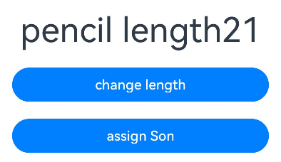

### Inheritance Class Scenario

\@Trace supports use in class inheritance scenarios. Whether in a base class or a derived class, only properties decorated by \@Trace have the capability to be observed for changes.

In the following example, classes GrandFather, Father, Uncle, Son, and Cousin are declared, with the inheritance relationships shown in the figure below.

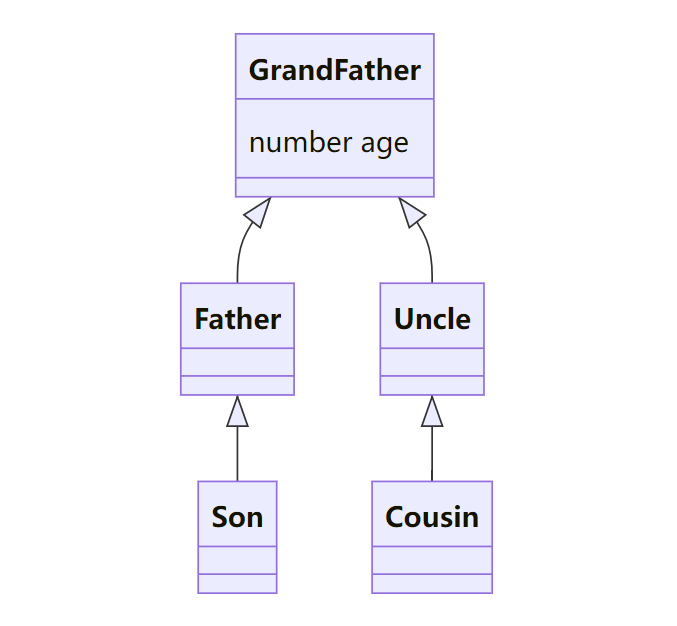


Create instances of the Son and Cousin classes, and click Button('change Son age') and Button('change Cousin age') to trigger UI refresh.

<!-- @[Inheritance_Class](https://gitcode.com/openharmony/applications_app_samples/blob/master/code/DocsSample/ArkUISample/arktsobservedv2andtrace/entry/src/main/ets/pages/usagescenarios/InheritanceClass.ets) -->  

``` TypeScript
import { hilog } from '@kit.PerformanceAnalysisKit';

const DOMAIN = 0x0001;
const TAG = 'ArktsObservedV2AndTrace';

@ObservedV2
class GrandFather {
  // Properties decorated by @Trace have the capability to be observed for changes.
  @Trace public age: number = 0;

  constructor(age: number) {
    this.age = age;
  }
}

class Father extends GrandFather {
  constructor(father: number) {
    super(father);
  }
}

class Uncle extends GrandFather {
  constructor(uncle: number) {
    super(uncle);
  }
}

class Son extends Father {
  constructor(son: number) {
    super(son);
  }
}

class Cousin extends Uncle {
  constructor(cousin: number) {
    super(cousin);
  }
}

@Entry
@ComponentV2
struct Index {
  son: Son = new Son(0);
  cousin: Cousin = new Cousin(0);
  renderTimes: number = 0;

  isRender(id: number): number {
    hilog.info(DOMAIN, TAG, `id: ${id} renderTimes: ${this.renderTimes}`);
    this.renderTimes++;
    return 40;
  }

  build() {
    Row() {
      Column() {
        Text(`Son ${this.son.age}`)
          .fontSize(this.isRender(1))
          .fontWeight(FontWeight.Bold)
          .margin(10)
        Text(`Cousin ${this.cousin.age}`)
          .fontSize(this.isRender(2))
          .fontWeight(FontWeight.Bold)
          .margin(10)
        Button('change Son age')
          .width(300)
          .margin(10)
          .onClick(() => {
            this.son.age++;
          })
        Button('change Cousin age')
          .width(300)
          .margin(10)
          .onClick(() => {
            this.cousin.age++;
          })
      }
      .width('100%')
    }
    .height('100%')
  }
}
```

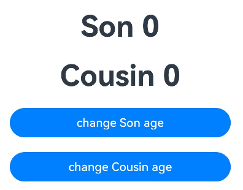

### Decorating Basic Type Arrays with @Trace

When an array is decorated by @Trace, changes can be observed using supported APIs. For supported APIs, see [Observing Changes](#observing-changes).

In the following example, the property numberArr in the Arr class decorated by @ObservedV2 is an array decorated by @Trace. When using array APIs to operate on numberArr, the corresponding changes can be observed. Note: Use the array length for judgment to prevent out-of-bounds access.

<!-- @[Decoration_Foundation](https://gitcode.com/openharmony/applications_app_samples/blob/master/code/DocsSample/ArkUISample/arktsobservedv2andtrace/entry/src/main/ets/pages/usagescenarios/DecorationFoundation.ets) -->  

``` TypeScript
let nextId: number = 0;

@ObservedV2
class Arr {
  public id: number = 0;
  @Trace public numberArr: number[] = [];

  constructor() {
    this.id = nextId++;
    this.numberArr = [0, 1, 2];
  }
}

@Entry
@ComponentV2
struct Index {
  arr: Arr = new Arr();

  build() {
    Column() {
      Text(`length: ${this.arr.numberArr.length}`)
        .fontSize(40)
        .margin(10)
      Divider()
      if (this.arr.numberArr.length >= 3) {
        Text(`${this.arr.numberArr[0]}`)
          .fontSize(40)
          .margin(10)
          .onClick(() => {
            this.arr.numberArr[0]++;
          })
        Text(`${this.arr.numberArr[1]}`)
          .fontSize(40)
          .margin(10)
          .onClick(() => {
            this.arr.numberArr[1]++;
          })
        Text(`${this.arr.numberArr[2]}`)
          .fontSize(40)
          .margin(10)
          .onClick(() => {
            this.arr.numberArr[2]++;
          })
      }

      Divider()

      ForEach(this.arr.numberArr, (item: number, index: number) => {
        Text(`${index} ${item}`)
          .fontSize(40)
          .margin(10)
      })

      // numberArr is an array decorated by @Trace.
      // When using array APIs to operate on numberArr, the corresponding changes can be observed.
      Button('push')
        .width(300)
        .margin(10)
        .onClick(() => {
          this.arr.numberArr.push(50);
        })

      Button('pop')
        .width(300)
        .margin(10)
        .onClick(() => {
          this.arr.numberArr.pop();
        })

      Button('shift')
        .width(300)
        .margin(10)
        .onClick(() => {
          this.arr.numberArr.shift();
        })

      Button('splice')
        .width(300)
        .margin(10)
        .onClick(() => {
          this.arr.numberArr.splice(1, 0, 60);
        })

      Button('unshift')
        .width(300)
        .margin(10)
        .onClick(() => {
          this.arr.numberArr.unshift(100);
        })

      Button('copywithin')
        .width(300)
        .margin(10)
        .onClick(() => {
          this.arr.numberArr.copyWithin(0, 1, 2);
        })

      Button('fill')
        .width(300)
        .margin(10)
        .onClick(() => {
          this.arr.numberArr.fill(0, 2, 4);
        })

      Button('reverse')
        .width(300)
        .margin(10)
        .onClick(() => {
          this.arr.numberArr.reverse();
        })

      Button('sort')
        .width(300)
        .margin(10)
        .onClick(() => {
          this.arr.numberArr.sort();
        })
    }
    .width('100%')
  }
}
```

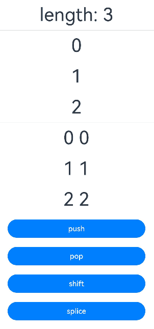

### Decorating Object Arrays with @Trace

* @Trace decorates the object array `personList` and the `age` property in the `Person` class, so changes to both `personList` and `age` can be observed.
* When you tap the Text component to change `age`, the Text component refreshes.

<!-- @[Decorative_Object](https://gitcode.com/openharmony/applications_app_samples/blob/master/code/DocsSample/ArkUISample/arktsobservedv2andtrace/entry/src/main/ets/pages/usagescenarios/DecorativeObject.ets) -->  

``` TypeScript
let nextId: number = 0;

@ObservedV2
class Person {
  // @Trace decorates the age property in the Person class, making age observable.
  @Trace public age: number = 0;

  constructor(age: number) {
    this.age = age;
  }
}

@ObservedV2
class Info {
  public id: number = 0;
  @Trace public personList: Person[] = [];

  constructor() {
    this.id = nextId++;
    this.personList = [new Person(0), new Person(1), new Person(2)];
  }
}

@Entry
@ComponentV2
struct Index {
  info: Info = new Info();

  build() {
    Column() {
      Text(`length: ${this.info.personList.length}`)
        .fontSize(40)
        .margin(10)
      Divider()
      if (this.info.personList.length >= 3) {
        Text(`${this.info.personList[0].age}`)
          .fontSize(40)
          .margin(10)
          .onClick(() => {
            this.info.personList[0].age++;
          })

        Text(`${this.info.personList[1].age}`)
          .fontSize(40)
          .margin(10)
          .onClick(() => {
            this.info.personList[1].age++;
          })

        Text(`${this.info.personList[2].age}`)
          .fontSize(40)
          .margin(10)
          .onClick(() => {
            this.info.personList[2].age++;
          })
      }

      Divider()

      ForEach(this.info.personList, (item: Person, index: number) => {
        Text(`${index} ${item.age}`)
          .fontSize(40)
          .margin(10)
      })
    }
    .width('100%')
  }
}
```

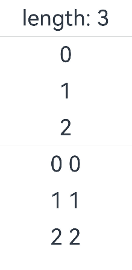

### Decorating Map Type

* A Map type property decorated by @Trace can observe changes resulting from API calls, including set, clear, and delete.
* Because the Info class is decorated by @ObservedV2 and the memberMap property is decorated by @Trace, clicking Button('init map') to assign a value to memberMap can also be observed.

<!-- @[Decoration_Map](https://gitcode.com/openharmony/applications_app_samples/blob/master/code/DocsSample/ArkUISample/arktsobservedv2andtrace/entry/src/main/ets/pages/usagescenarios/DecorationMap.ets) -->  

``` TypeScript
@ObservedV2
class Info {
  @Trace public memberMap: Map<number, string> = new Map([[0, 'a'], [1, 'b'], [3, 'c']]);
}

@Entry
@ComponentV2
struct MapSample {
  info: Info = new Info();

  build() {
    Row() {
      Column() {
        ForEach(Array.from(this.info.memberMap.entries()), (item: [number, string]) => {
          Text(`${item[0]}`)
            .fontSize(30)
            .margin(10)
          Text(`${item[1]}`)
            .fontSize(30)
            .margin(10)
          Divider()
        })
        // Observe changes brought by API calls on the Map type property decorated by @Trace.
        Button('init map')
          .width(300)
          .margin(10)
          .onClick(() => {
            this.info.memberMap = new Map([[0, 'a'], [1, 'b'], [3, 'c']]);
          })
        Button('set new one')
          .width(300)
          .margin(10)
          .onClick(() => {
            this.info.memberMap.set(4, 'd');
          })
        Button('clear')
          .width(300)
          .margin(10)
          .onClick(() => {
            this.info.memberMap.clear();
          })
        Button('set the key: 0')
          .width(300)
          .margin(10)
          .onClick(() => {
            this.info.memberMap.set(0, 'aa');
          })
        Button('delete the first one')
          .width(300)
          .margin(10)
          .onClick(() => {
            this.info.memberMap.delete(0);
          })
      }
      .width('100%')
    }
    .height('100%')
  }
}
```

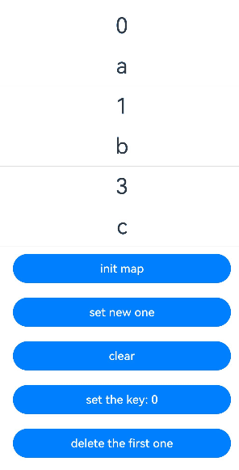

### Decorating Set Types with @Trace

* A Set type property decorated by @Trace can observe changes brought by API calls, including add, clear, and delete.
* Because the Info class is decorated by @ObservedV2 and the memberSet property is decorated by @Trace, clicking Button('init set') to assign a value to memberSet can also be observed.

<!-- @[Decoration_Set](https://gitcode.com/openharmony/applications_app_samples/blob/master/code/DocsSample/ArkUISample/arktsobservedv2andtrace/entry/src/main/ets/pages/usagescenarios/DecorationSet.ets) -->  

``` TypeScript
@ObservedV2
class Info {
  @Trace public memberSet: Set<number> = new Set([0, 1, 2, 3, 4]);
}

@Entry
@ComponentV2
struct SetSample {
  info: Info = new Info();

  build() {
    Row() {
      Column() {
        ForEach(Array.from(this.info.memberSet.entries()), (item: [number, number]) => {
          Text(`${item[0]}`)
            .fontSize(30)
            .margin(10)
          Divider()
        })
        // The @Trace decorated Set type property can observe changes brought by API calls.
        Button('init set')
          .width(300)
          .margin(10)
          .onClick(() => {
            this.info.memberSet = new Set([0, 1, 2, 3, 4]);
          })
        Button('set new one')
          .width(300)
          .margin(10)
          .onClick(() => {
            this.info.memberSet.add(5);
          })
        Button('clear')
          .width(300)
          .margin(10)
          .onClick(() => {
            this.info.memberSet.clear();
          })
        Button('delete the first one')
          .width(300)
          .margin(10)
          .onClick(() => {
            this.info.memberSet.delete(0);
          })
      }
      .width('100%')
    }
    .height('100%')
  }
}
```

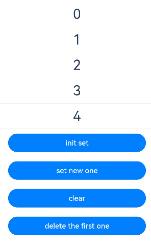

### Decorating Date Type with @Trace

* @Trace decorated Date type properties can observe changes brought by API calls, including setFullYear, setMonth, setDate, setHours, setMinutes, setSeconds, setMilliseconds, setTime, setUTCFullYear, setUTCMonth, setUTCDate, setUTCHours, setUTCMinutes, setUTCSeconds, and setUTCMilliseconds.
* Because the Info class is decorated by @ObservedV2 and the selectedDate property is decorated by @Trace, clicking Button('set selectedDate to 2023-07-08') to assign a value to selectedDate can also be observed as a change.

<!-- @[Decorate_Date](https://gitcode.com/openharmony/applications_app_samples/blob/master/code/DocsSample/ArkUISample/arktsobservedv2andtrace/entry/src/main/ets/pages/usagescenarios/DecorateDate.ets) -->  

``` TypeScript
@ObservedV2
class Info {
  @Trace public selectedDate: Date = new Date('2021-08-08');
}

@Entry
@ComponentV2
struct DateSample {
  info: Info = new Info();

  build() {
    Column() {
      // The @Trace decorated Date type property can observe changes brought by API calls.
      Button('set selectedDate to 2023-07-08')
        .width(300)
        .margin(10)
        .onClick(() => {
          this.info.selectedDate = new Date('2023-07-08');
        })
      Button('increase the year by 1')
        .width(300)
        .margin(10)
        .onClick(() => {
          this.info.selectedDate.setFullYear(this.info.selectedDate.getFullYear() + 1);
        })
      Button('increase the month by 1')
        .width(300)
        .margin(10)
        .onClick(() => {
          this.info.selectedDate.setMonth(this.info.selectedDate.getMonth() + 1);
        })
      Button('increase the day by 1')
        .width(300)
        .margin(10)
        .onClick(() => {
          this.info.selectedDate.setDate(this.info.selectedDate.getDate() + 1);
        })
      DatePicker({
        start: new Date('1970-1-1'),
        end: new Date('2100-1-1'),
        selected: this.info.selectedDate
      })
    }
    .width('100%')
  }
}
```

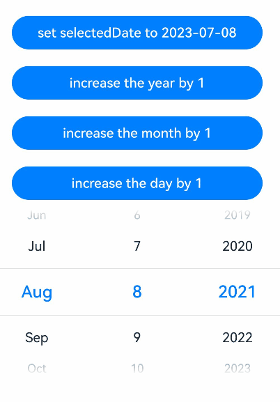

## FAQs

### Serialization and Deserialization of @ObservedV2 Decorated Objects

After serialization, objects decorated by @ObservedV2 will have the `__ob_` prefix added to properties decorated by @Trace.

```ts
@ObservedV2
class Info {
  @Trace name: string = 'Tom';
  @Trace age: number = 24;
}

let realInfo: Info = new Info();
let jsonResult: string = JSON.stringify(realInfo); // '{"__ob_name":"Tom","__ob_age":24}'
```

If an @ObservedV2 decorated object is serialized using JSON.stringify and then deserialized using JSON.parse, the observation capability will be lost.

```ts
@ObservedV2
class Info {
  @Trace name: string = 'Tom';
  @Trace age: number = 24;
}

let realInfo: Info = new Info();
let jsonResult: string = JSON.stringify(realInfo); // '{"__ob_name":"Tom","__ob_age":24}'
let parseInfo: Info = JSON.parse(jsonResult);

// Unlike objects created directly through the new operator, the object obtained by JSON.parse is not actually an instance of Info, so it has no property observation capability.
let isInfoByNew: boolean = realInfo instanceof Info; // true
let isInfoByParse: boolean = parseInfo instanceof Info; // false
```

You can use the third-party library [class-transformer](https://gitcode.com/CPF-ApplicationTPC/openharmony_tpc_samples/tree/master/class-transformer) to achieve observability after deserialization.

class-transformer can be installed using the following command.

```text
ohpm install class-transformer
```

```ts
import { plainToInstance } from 'class-transformer'; // Import the third-party library.
@ObservedV2
class Info {
  @Trace name: string = 'Tom';
  @Trace age: number = 24;
}
let realInfo: Info = new Info();
let jsonResult: string = JSON.stringify(realInfo); // '{"__ob_name":"Tom","__ob_age":24}'
let parseInfo: Info = JSON.parse(jsonResult);

let transformedInfo: Info = plainToInstance(Info, parseInfo);
let isInfoByTransformed: boolean = transformedInfo instanceof Info; // true
```

For multi-level nested object scenarios, additional processing is required, including:

- Remove the `__ob_` prefix from the serialization result; otherwise, inner objects cannot be correctly converted.
- Use the @Type decorator provided by the class-transformer library (renamed to `TypeFromLibrary` in the example to distinguish it from the [@Type decorator](arkts-new-type.md) in state management V2) to mark the type of inner objects.

Using the @Type decorator of the third-party library requires installing [reflect-metadata](https://gitcode.com/CPF-ApplicationTPC/openharmony_tpc_samples/tree/master/reflect-metadata).

reflect-metadata can be installed using the following command.

```text
ohpm install reflect-metadata@0.2.1
```

```ts
import { plainToInstance, Type as TypeFromLibrary} from 'class-transformer'; // Import the third-party library.
import 'reflect-metadata'; // Required by the @Type decorator of the third-party library.
@ObservedV2
class Info {
  @Trace name: string = 'Tom';
  @Trace age: number = 24;
}
@ObservedV2
class InfoWrapper {
  // Use the @Type decorator of the third-party library (renamed to TypeFromLibrary) to mark the type of the inner property.
  @TypeFromLibrary(() => Info)
  @Trace info: Info = new Info();
}
let realWrapper: InfoWrapper = new InfoWrapper();
let infoWrapperJson: string = JSON.stringify(realWrapper); // '{"__ob_info":{"__ob_name":"Tom","__ob_age":24}}'
// Remove the '__ob_' prefix from property keys. This is for demonstration only. Developers need to complete the removal of the '__ob_' prefix from keys based on actual type definitions.
let jsonHandled = infoWrapperJson.replaceAll('__ob_', ''); // '{"info":{"name":"Tom","age":24}}'
let wrapperHandled = plainToInstance(InfoWrapper, JSON.parse(jsonHandled));

let isWrapper: boolean = wrapperHandled instanceof InfoWrapper; // true
let isInfo: boolean = (wrapperHandled.info) instanceof Info; // true
```

The complete example used in the UI is as follows.

<!-- @[Serialization_And_Deserialization](https://gitcode.com/openharmony/applications_app_samples/blob/master/code/DocsSample/ArkUISample/arktsobservedv2andtrace/entry/src/main/ets/pages/faqs/SerializationAndDeserialization.ets) --> 

``` TypeScript
import { plainToInstance, Type as TypeFromLibrary } from 'class-transformer'; // Import the third-party library.
import 'reflect-metadata'; // Required by the @Type decorator of the third-party library.

// Simulate a JSON key-value pair object.
let testJSON: Record<string, ESObject> = {
  'id': 1,
  'info': {
    'name': 'Tom',
    'age': 24
  },
  'friends': [
    {
      'name': 'John',
      'age': 23
    },
    {
      'name': 'Mary',
      'age': 24
    }
  ]
}

@ObservedV2
class Info {
  @Trace public name?: string;
  @Trace public age?: number;
}

@ObservedV2
class Person {
  public id?: number;
  // Use the @Type decorator (renamed to TypeFromLibrary) from the third-party library to mark the type of the inner property.
  @TypeFromLibrary(() => Info)
  @Trace public info?: Info;
  // Use the @Type decorator (renamed to TypeFromLibrary) from the third-party library to mark the type of the inner property.
  @TypeFromLibrary(() => Info)
  @Trace public friends?: Info[];
}

@Entry
@ComponentV2
struct SerializationAndDeserialization {
  @Local person: Person | undefined = undefined;
  aboutToAppear(): void {
    this.person = plainToInstance(Person, testJSON); // Directly convert the object to a Person instance through plainToInstance.
  }

  build() {
    Column() {
      Text(`name: ${this.person?.info?.name}, age: ${this.person?.info?.age}`)
        .fontSize(20)
        .margin(10)
        .onClick(() => {
          if (this.person?.info?.age) {
            this.person!.info!.age++; // Modify the observable.
          }
        })
      ForEach(this.person?.friends, (item: Info) => {
        Text(`friend name: ${item.name}, age: ${item.age}`)
          .fontSize(20)
          .margin(10)
          .onClick(() => {
            if (item.age) {
              item.age++; // Modify the observable.
            }
          })
      })

      Button('Refresh Info')
        .width(300)
        .margin(10)
        .onClick(() => {
          let json: string =
            `{
              "id":12,
                "__ob_info":
                  {
                    "__ob_name":"Jimmy",
                    "__ob_age":35
                   },
              "__ob_friends":[
                {
                  "__ob_name":"Bob",
                  "__ob_age":30
                },
                {
                  "__ob_name":"Kevin",
                  "__ob_age":33
                }
              ]
            }`;
          // Remove the '__ob_' prefix, and then convert the JSON string into a Person object using JSON.parse and plainToInstance.
          this.person = plainToInstance(Person, JSON.parse(json.replaceAll('__ob_', '')));
        })
    }
    .width('100%')
  }
}
```

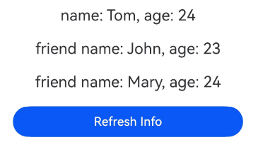

### Abnormal display of @ObservedV2 type transferred via router

For an @ObservedV2 class transferred via router, because the property names generated through serialization are inconsistent with the original property names in the class, it cannot be directly converted to an @ObservedV2 instance using the `as` type cast. Instead, it needs to be deserialized to regenerate the @ObservedV2 instance. For details about deserialization, see [Serialization and Deserialization of @ObservedV2 Decorated Objects](#serialization-and-deserialization-of-observedv2-decorated-objects).

Counterexample

```ts
// Content of the pages/faqs/RouterIndex.ets file

@ObservedV2
export class RouterModel {
  @Trace id: number = -1;
  @Trace info: string = 'default';
}

@Entry
@ComponentV2
struct RouterIndex {
  @Local paramsInfo: RouterModel = new RouterModel();
  onJumpClick(): void {
    this.paramsInfo.id = 0;
    this.paramsInfo.info = 'RouterModel';
    this.getUIContext().getRouter().pushUrl({
      url: 'pages/faqs/ChildPage',
      params: this.paramsInfo // Pass the @ObservedV2 instance to the child page.
    }, (err) => {
      if (err) {
        console.error(`Invoke pushUrl failed, code is ${err.code}, message is ${err.message}`);
        return;
      }
      console.info('Invoke pushUrl succeeded.');
    })
  }

  build() {
    Column() {
      Text('Parent page')
        .fontSize(20)
        .margin(10)
      Button('Jump')
        .width(300)
        .margin(10)
        .onClick(() => {
          this.onJumpClick();
        })
    }
    .width('100%')
  }
}
```

```ts
// Content of the file pages/faqs/ChildPage.ets

import { RouterModel } from './RouterIndex';

@Entry
@ComponentV2
struct Detail {
  @Local params?: RouterModel
  aboutToAppear(): void {
    // Incorrect usage! @ObservedV2 type passed through router cannot be directly type-cast.
    this.params = this.getUIContext().getRouter().getParams() as RouterModel;
  }
  build() {
    Column() {
      Text(`Detail Page: ${this.params?.id} ${this.params?.info}`) // Because the data transfer fails, undefined is displayed here.
        .fontSize(20)
        .margin(10)
    }
    .width('100%')
  }
}
```

Correct Example

<!-- @[Router_Index](https://gitcode.com/openharmony/applications_app_samples/blob/master/code/DocsSample/ArkUISample/arktsobservedv2andtrace/entry/src/main/ets/pages/faqs/RouterIndex.ets) --> 

``` TypeScript
@ObservedV2
export class RouterModel {
  @Trace public id: number = -1;
  @Trace public info: string = 'default';
}

@Entry
@ComponentV2
struct RouterIndex {
  @Local paramsInfo: RouterModel = new RouterModel();
  onJumpClick(): void {
    this.paramsInfo.id = 0;
    this.paramsInfo.info = 'RouterModel';
    this.getUIContext().getRouter().pushUrl({
      url: 'pages/faqs/ChildPage',
      params: this.paramsInfo // Pass the @ObservedV2 instance to the child page.
    }, (err) => {
      if (err) {
        console.error(`Invoke pushUrl failed, code is ${err.code}, message is ${err.message}`);
        return;
      }
      console.info('Invoke pushUrl succeeded.');
    })
  }

  build() {
    Column() {
      Text('Parent page')
        .fontSize(20)
        .margin(10)
      Button('Jump')
        .width(300)
        .margin(10)
        .onClick(() => {
          this.onJumpClick();
        })
    }
    .width('100%')
  }
}
```

<!-- @[Child_Page](https://gitcode.com/openharmony/applications_app_samples/blob/master/code/DocsSample/ArkUISample/arktsobservedv2andtrace/entry/src/main/ets/pages/faqs/ChildPage.ets) --> 

``` TypeScript
import { RouterModel } from './RouterIndex';
import { plainToInstance } from 'class-transformer'; // Import the third-party library.

@Entry
@ComponentV2
struct Detail {
  @Local params?: RouterModel
  aboutToAppear(): void {
    this.params =
      plainToInstance(RouterModel, JSON.parse(JSON.stringify(this.getUIContext().getRouter().getParams())));
  }
  build() {
    Column() {
      Text(`Detail Page: ${this.params?.id} ${this.params?.info}`)
        .fontSize(20)
        .margin(10)
    }
    .width('100%')
  }
}
```

