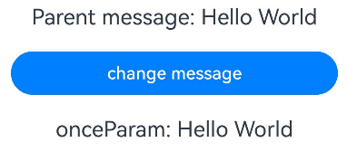
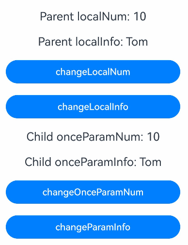

# \@Once: Implementing Initialization Once
<!--Kit: ArkUI-->
<!--Subsystem: ArkUI-->
<!--Owner: @jiyujia926-->
<!--Designer: @zhangboren-->
<!--Tester: @TerryTsao-->
<!--Adviser: @zhang_yixin13-->
<!-- md-trans-meta sourceCommit=3efb4ba336409dd0731ba011e1e227786db57fa2 translatedAt=2026-07-22T02:06:55.606Z pushedAt=2026-07-23T11:21:33.828Z -->

To enable a variable to be initialized only once from an external source without accepting subsequent synchronization changes, you can use the [\@Once](../../reference/apis-arkui/arkui-ts/ts-state-management-once.md#once) decorator together with the \@Param decorator.

Before reading this document, read [\@Param](./arkts-new-param.md).

> **NOTE**
>
> The \@Once decorator is supported in custom components decorated with \@ComponentV2 since API version 12.
>
> This decorator can be used in atomic services since API version 12.
>
> This decorator can be used in ArkTS widgets since API version 23.

## Overview

The \@Once decorator accepts values passed only during variable initialization. Subsequent data source changes will not be synchronized to child components.

- \@Once must be used with \@Param. Using it independently or with other decorators is not allowed.
- \@Once does not affect the observation capability of \@Param. Only changes in data source are intercepted.
- The sequence of the variables decorated by \@Once and \@Param does not affect the actual functions.
- When \@Once and \@Param are used together, you can change the value of \@Param variables locally.

## Rules of Use

As an auxiliary decorator, the \@Once decorator does not have requirements on the decoration type and the capability of observing variables.

| \@Once Decorator| Description                                     |
| ---------------- | ----------------------------------------- |
| Parameters      | None                                     |
| Usage conditions        | It cannot be used independently and must be used together with the \@Param decorator.|


## Constraints

- \@Once can only be used together with \@Param inside custom components decorated with [\@ComponentV2](./arkts-create-custom-components.md#componentv2).

  <!-- @[once_param_componentV2_pair](https://gitcode.com/openharmony/applications_app_samples/blob/master/code/DocsSample/ArkUISample/ArktsNewOnce/entry/src/main/ets/pages/MyComponent.ets) --> 

  ``` TypeScript
  @ComponentV2
  struct MyComponent {
    @Param @Once onceParam: string = 'onceParam'; // Correct usage.
    // ...
  }
  ```

- The order of \@Once and \@Param does not matter. Both \@Param \@Once and \@Once \@Param are correct.

  <!-- @[once_param_order_irrelevant](https://gitcode.com/openharmony/applications_app_samples/blob/master/code/DocsSample/ArkUISample/ArktsNewOnce/entry/src/main/ets/pages/MyComponent.ets) -->

  ``` TypeScript
  @ComponentV2
  struct MyComponent {
  // ···
    @Param @Once param1: number = 0;
    @Once @Param param2: number = 0;
  // ···
  }
  ```

## Scenario

### Initializing Variables Only Once

\@Once is used for scenarios where a variable is expected to be initialized by synchronizing with the data source only once, and subsequent changes are no longer synchronized.

<!-- @[once_init_sync_noMore](https://gitcode.com/openharmony/applications_app_samples/blob/master/code/DocsSample/ArkUISample/ArktsNewOnce/entry/src/main/ets/pages/MyComponent.ets) -->  

``` TypeScript
@ComponentV2
struct ChildComponent {
  // The onceParam decorated with @Once is initialized and synchronized only once.
  @Param @Once onceParam: string = '';

  build() {
    Column() {
      Text(`onceParam: ${this.onceParam}`)
        .fontSize(20)
        .margin(10)
    }
    .width('100%')
  }
}

@Entry
@ComponentV2
struct MyComponent {
  // ...
  @Local message: string = 'Hello World';

  build() {
    Column() {
      Text(`Parent message: ${this.message}`)
        .fontSize(20)
        .margin(10)
      Button('change message')
        .width(300)
        .margin(10)
        .onClick(() => {
          this.message = 'Hello Tomorrow';
        })
      ChildComponent({ onceParam: this.message })
    }
    .width('100%')
  }
}
```



### Changing the \@Param Variables Locally

When \@Once is used together with \@Param, it can lift the restriction that \@Param cannot be modified locally and can trigger UI re-rendering. In this case, the effect of using \@Param and \@Once is similar to [\@Local](arkts-new-local.md), but \@Param and \@Once can also receive initial values passed from outside.

<!-- @[once_param_modify_init](https://gitcode.com/openharmony/applications_app_samples/blob/master/code/DocsSample/ArkUISample/ArktsNewOnce/entry/src/main/ets/pages/Index.ets) -->  

``` TypeScript
@ObservedV2
class Info {
  @Trace name: string;
  constructor(name: string) {
    this.name = name;
  }
}
@ComponentV2
struct Child {
  // When @Once is used together with @Param, it can be modified locally and can trigger UI re-rendering.
  @Param @Once onceParamNum: number = 0;
  @Param @Once @Require onceParamInfo: Info;

  build() {
    Column() {
      Text(`Child onceParamNum: ${this.onceParamNum}`)
        .fontSize(20)
        .margin(10)
      Text(`Child onceParamInfo: ${this.onceParamInfo.name}`)
        .fontSize(20)
        .margin(10)
      Button('changeOnceParamNum')
        .width(300)
        .margin(10)
        .onClick(() => {
          this.onceParamNum++;
        })
      Button('changeParamInfo')
        .width(300)
        .margin(10)
        .onClick(() => {
          this.onceParamInfo = new Info('Cindy');
        })
    }
    .width('100%')
  }
}
@Entry
@ComponentV2
struct Index {
  @Local localNum: number = 10;
  @Local localInfo: Info = new Info('Tom');

  build() {
    Column() {
      Text(`Parent localNum: ${this.localNum}`)
        .fontSize(20)
        .margin(10)
      Text(`Parent localInfo: ${this.localInfo.name}`)
        .fontSize(20)
        .margin(10)
      Button('changeLocalNum')
        .width(300)
        .margin(10)
        .onClick(() => {
          this.localNum++;
        })
      Button('changeLocalInfo')
        .width(300)
        .margin(10)
        .onClick(() => {
          this.localInfo = new Info('Cindy');
        })
      Child({
        onceParamNum: this.localNum,
        onceParamInfo: this.localInfo
      })
    }
    .width('100%')
  }
}
```

