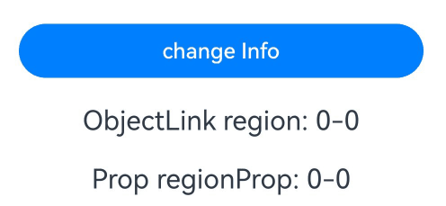
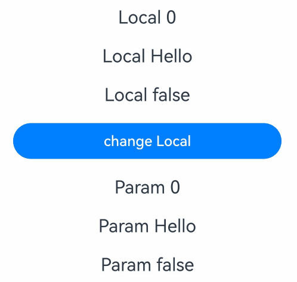
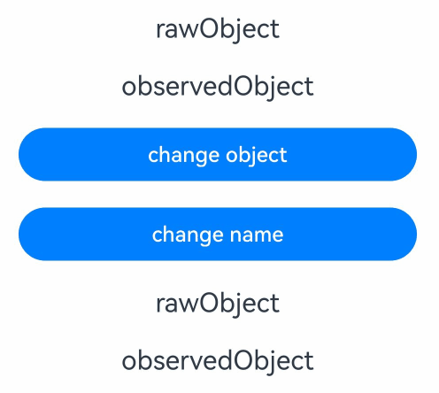
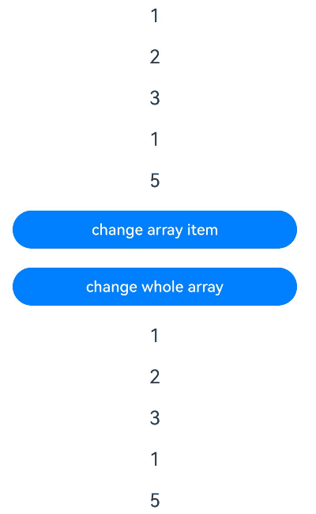
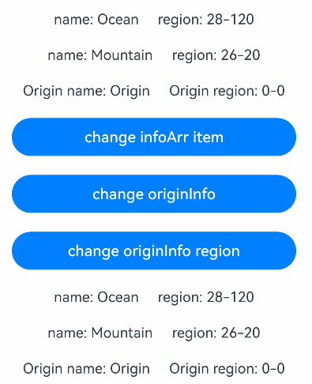
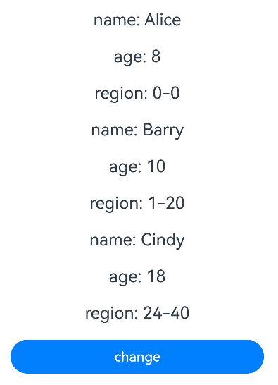
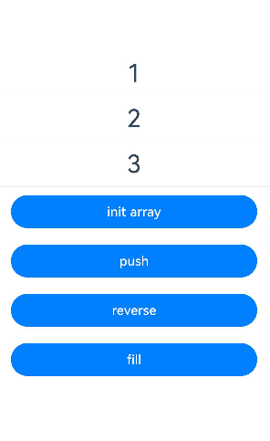
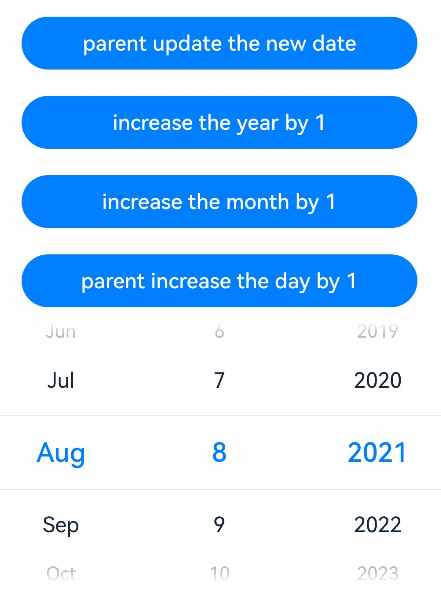
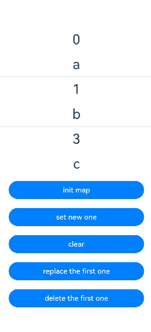
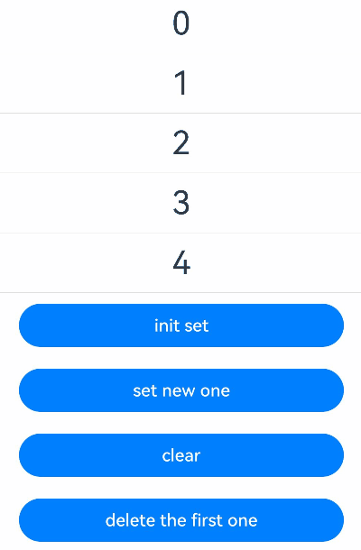

# \@Param Decorator: Inputting External Parameters to Components

<!--Kit: ArkUI-->
<!--Subsystem: ArkUI-->
<!--Owner: @jiyujia926-->
<!--Designer: @zhangboren-->
<!--Tester: @TerryTsao-->
<!--Adviser: @zhang_yixin13-->
<!-- md-trans-meta sourceCommit=3efb4ba336409dd0731ba011e1e227786db57fa2 translatedAt=2026-07-22T02:09:27.011Z pushedAt=2026-07-23T11:18:35.963Z -->

To enhance the capability of child components to accept external parameter input, developers can use the [@Param](../../reference/apis-arkui/arkui-ts/ts-state-management-param.md#param) decorator.

\@Param can receive not only the external input of the component, but also the synchronous change of \@Local. Before reading this topic, you are advised to read [\@Local](./arkts-new-local.md).

> **NOTE**
>
> The \@Param decorator is supported in custom components decorated with \@ComponentV2 since API version 12.
>
> This decorator can be used in atomic services since API version 12.
>
> This decorator can be used in ArkTS widgets since API version 23.

## Overview

\@Param indicates the state passed in from outside, ensuring that data can be synchronized between the parent and child components.

- Variables decorated with \@Param support local initialization, but cannot be directly modified in the component.

- \@Param decorated variables can be passed in from outside when initializing a custom component. When the data source is also a state variable, changes of the data source will be synchronized to \@Param.

- \@Param can accept data sources of any type, including common variables, state variables, constants, and function return values.

- When an \@Param decorated variable changes, the component associated with the variable will be re-rendered.

- \@Param supports observation of primitive types (such as number, boolean, string, Object, class), nested types (such as [Array](#decorating-variables-of-the-array-type), [Set](#decorating-variables-of-the-set-type), [Map](#decorating-variables-of-the-map-type), [Date](#decorating-variables-of-the-date-type)), as well as null, undefined, and [union types](#union-type).

- For complex types such as class objects, \@Param accepts references from the data source. You can change the class object properties in the component and this change will be synchronized to the data source.

- \@Param can only observe the decorated variables. For details, see [Observed Changes](#observed-changes).

## Limitations of State Management V1 to Accept Decorators Passed in Externally

State management V1 has multiple decorators that can accept external input, including [\@State](arkts-state.md), [\@Prop](arkts-prop.md), [\@Link](arkts-link.md), and [\@ObjectLink](arkts-observed-and-objectlink.md). These decorators have restrictions and are difficult to distinguish. Improper use of them may cause performance problems.

<!-- @[Param_Decorator_Limitations](https://gitcode.com/openharmony/applications_app_samples/blob/master/code/DocsSample/ArkUISample/ParadigmStateManagement/entry/src/main/ets/pages/param/ParamDecoratorLimitations.ets) -->  

``` TypeScript
@Observed
class Region {
  public x: number;
  public y: number;

  constructor(x: number, y: number) {
    this.x = x;
    this.y = y;
  }
}

@Observed
class Info {
  public region: Region;

  constructor(x: number, y: number) {
    this.region = new Region(x, y);
  }
}

@Entry
@Component
struct Index {
  @State info: Info = new Info(0, 0);

  build() {
    Column() {
      Button('change Info')
        .width(300)
        .margin(10)
        .onClick(() => {
          this.info = new Info(100, 100);
        })
      Child({
        region: this.info.region,
        regionProp: this.info.region,
        infoProp: this.info,
        infoLink: this.info,
        infoState: this.info
      })
    }
    .width('100%')
  }
}

@Component
struct Child {
  // Summary of decorators that accept external input in V1.
  @ObjectLink region: Region;
  @Prop regionProp: Region;
  @Prop infoProp: Info;
  @Link infoLink: Info;
  @State infoState: Info = new Info(1, 1);

  build() {
    Column() {
      Text(`ObjectLink region: ${this.region.x}-${this.region.y}`)
        .fontSize(20)
        .margin(10)
      Text(`Prop regionProp: ${this.regionProp.x}-${this.regionProp.y}`)
        .fontSize(20)
        .margin(10)
    }
    .width('100%')
  }
}
```



In the preceding example, \@State can only receive the reference of info during initialization. After info is changed, synchronization cannot be performed. \@Prop supports one-way synchronization, but the deep copy performance is still poor for complex types. \@Link can synchronize the input reference in a two-way manner, but it requires that the data source be also a state variable. Therefore, it cannot accept the member property **region** in **info**. \@ObjectLink can accept the class member property which must be decorated by \@Observed. Different restrictions of decorators make the value transfer rules between parent and child components complex and difficult to use. This is where \@Param, a decorator that indicates the component state passed in from outside, comes into the picture.

## Decorator Description

| \@Param Variable Decorator | Description                                                        |
| ------------------ | ------------------------------------------------------------ |
| Parameters        | None                                                        |
| Allowed local modification      | No. If you need to change the value, you can use \@Param with [\@Once](./arkts-new-once.md) to change the local value of the child component. Alternatively, you can use the [\@Event](./arkts-new-event.md) decorator to change the value of the \@Param data source.|
| Synchronization type          | One-way synchronization from the parent to the child component.                                          |
| Allowed decorated variable types| Basic types, such as object, class, string, number, boolean, and enum, and built-in types such as Array, Date, Map, and Set. It supports null, undefined, and union types.|
| Initial value for the decorated variable| Local initialization is allowed. If local initialization is not performed, this parameter must be used together with the [\@Require](./arkts-require.md) decorator and initialization must be passed from outside.|

## Variable Passing

| Behavior      | Rule |
| -------------- | ------------------------------------------------------------ |
| Initialization from the parent component| \@Param decorated variables can be initialized locally. If local initialization is not performed, the variables must be initialized from outside. When both the local initial value and external input value exist, the latter is preferentially used for initialization.|
| Child component initialization  | \@Param decorated variables can initialize @Param-decorated variable in a child component.      |
| Synchronization          | \@Param can be synchronized with the state variable data source passed in by the parent component (that is, the variable decorated by \@Local or \@Param). When the data source changes, the changes will be synchronized to \@Param of the child component.|

## Observed Changes

\@Param decorated variables enjoy observation capability. When a decorated variable changes, the UI component bound to the variable will be re-rendered.

- When the decorated variable is of the boolean, string, or number type, the synchronized change of the data source can be observed.

  <!-- @[Param_Observe_Change_Variable](https://gitcode.com/openharmony/applications_app_samples/blob/master/code/DocsSample/ArkUISample/ParadigmStateManagement/entry/src/main/ets/pages/param/ParamObserveChangeVariable.ets) --> 

  ``` TypeScript
  @Entry
  @ComponentV2
  struct Index {
    // Number of clicks.
    @Local count: number = 0;
    @Local message: string = 'Hello';
    @Local flag: boolean = false;
  
    build() {
      Column() {
        Text(`Local ${this.count}`)
          .fontSize(20)
          .margin(10)
        Text(`Local ${this.message}`)
          .fontSize(20)
          .margin(10)
        Text(`Local ${this.flag}`)
          .fontSize(20)
          .margin(10)
        Button('change Local')
          .width(300)
          .margin(10)
          .onClick(() => {
            // Changes to the data source will be synchronized to the child component.
            this.count++;
            this.message += ' World';
            this.flag = !this.flag;
          })
        Child({
          count: this.count,
          message: this.message,
          flag: this.flag
        })
      }
      .width('100%')
    }
  }
  
  @ComponentV2
  struct Child {
    @Require @Param count: number;
    @Require @Param message: string;
    @Require @Param flag: boolean;
  
    build() {
      Column() {
        Text(`Param ${this.count}`)
          .fontSize(20)
          .margin(10)
        Text(`Param ${this.message}`)
          .fontSize(20)
          .margin(10)
        Text(`Param ${this.flag}`)
          .fontSize(20)
          .margin(10)
      }
      .width('100%')
    }
  }
  ```



- When the decorated variable is of a class object type, only changes to the overall assignment of the class object can be observed. Changes to class member properties cannot be directly observed. Observing changes to class member properties relies on the [@ObservedV2](arkts-new-observedV2-and-trace.md) and [@Trace](arkts-new-observedV2-and-trace.md) decorators. Alternatively, [makeObserved](./arkts-new-makeObserved.md) can be used to make the object observable.

  <!-- @[Param_Observe_Change_Class](https://gitcode.com/openharmony/applications_app_samples/blob/master/code/DocsSample/ArkUISample/ParadigmStateManagement/entry/src/main/ets/pages/param/ParamObserveChangeClass.ets) --> 

  ``` TypeScript
  class RawObject {
    public name: string;
  
    constructor(name: string) {
      this.name = name;
    }
  }
  
  @ObservedV2
  class ObservedObject {
    @Trace public name: string;
  
    constructor(name: string) {
      this.name = name;
    }
  }
  
  @Entry
  @ComponentV2
  struct Index {
    @Local rawObject: RawObject = new RawObject('rawObject');
    @Local observedObject: ObservedObject = new ObservedObject('observedObject');
  
    build() {
      Column() {
        Text(`${this.rawObject.name}`)
          .fontSize(20)
          .margin(10)
        Text(`${this.observedObject.name}`)
          .fontSize(20)
          .margin(10)
        Button('change object')
          .width(300)
          .margin(10)
          .onClick(() => {
            // Changes to the overall assignment of the class object can be observed.
            this.rawObject = new RawObject('new rawObject');
            this.observedObject = new ObservedObject('new observedObject');
          })
        Button('change name')
          .width(300)
          .margin(10)
          .onClick(() => {
            // \@Local and \@Param cannot observe the class object properties. Therefore, the changes of rawObject.name cannot be observed.
            this.rawObject.name = 'new rawObject name';
            // The name property of ObservedObject is decorated by @Trace. Therefore, the changes of observedObject.name can be observed.
            this.observedObject.name = 'new observedObject name';
          })
        Child({
          rawObject: this.rawObject,
          observedObject: this.observedObject
        })
      }
      .width('100%')
    }
  }
  
  @ComponentV2
  struct Child {
    @Require @Param rawObject: RawObject;
    @Require @Param observedObject: ObservedObject;
  
    build() {
      Column() {
        Text(`${this.rawObject.name}`)
          .fontSize(20)
          .margin(10)
        Text(`${this.observedObject.name}`)
          .fontSize(20)
          .margin(10)
      }
      .width('100%')
    }
  }
  ```



- When the decorated variable is a simple type array, the overall or item changes of the array can be observed.

  <!-- @[Param_Observe_Change_Array](https://gitcode.com/openharmony/applications_app_samples/blob/master/code/DocsSample/ArkUISample/ParadigmStateManagement/entry/src/main/ets/pages/param/ParamObserveChangeArray.ets) -->  

  ``` TypeScript
  @Entry
  @ComponentV2
  struct Index {
    @Local numArr: number[] = [1, 2, 3, 4, 5];
    @Local dimensionTwo: number[][] = [[1, 2, 3], [4, 5, 6]];
  
    build() {
      Column() {
        Text(`${this.numArr[0]}`)
          .fontSize(20)
          .margin(10)
        Text(`${this.numArr[1]}`)
          .fontSize(20)
          .margin(10)
        Text(`${this.numArr[2]}`)
          .fontSize(20)
          .margin(10)
        Text(`${this.dimensionTwo[0][0]}`)
          .fontSize(20)
          .margin(10)
        Text(`${this.dimensionTwo[1][1]}`)
          .fontSize(20)
          .margin(10)
        // When the decorated variable is an array of simple types, changes to array items can be observed.
        Button('change array item')
          .width(300)
          .margin(10)
          .onClick(() => {
            this.numArr[0]++;
            this.numArr[1] += 2;
            this.dimensionTwo[0][0] = 0;
            this.dimensionTwo[1][1] = 0;
          })
        // When the decorated variable is an array of simple types, changes to the array as a whole can be observed.
        Button('change whole array')
          .width(300)
          .margin(10)
          .onClick(() => {
            this.numArr = [5, 4, 3, 2, 1];
            this.dimensionTwo = [[7, 8, 9], [0, 1, 2]];
          })
        Child({
          numArr: this.numArr,
          dimensionTwo: this.dimensionTwo
        })
      }
      .width('100%')
    }
  }
  
  @ComponentV2
  struct Child {
    @Require @Param numArr: number[];
    @Require @Param dimensionTwo: number[][];
  
    build() {
      Column() {
        Text(`${this.numArr[0]}`)
          .fontSize(20)
          .margin(10)
        Text(`${this.numArr[1]}`)
          .fontSize(20)
          .margin(10)
        Text(`${this.numArr[2]}`)
          .fontSize(20)
          .margin(10)
        Text(`${this.dimensionTwo[0][0]}`)
          .fontSize(20)
          .margin(10)
        Text(`${this.dimensionTwo[1][1]}`)
          .fontSize(20)
          .margin(10)
      }
      .width('100%')
    }
  }
  ```



- When the decorated variable is of a nested class or is an object array, \@Param cannot observe the change of lower-level object attributes. Observation of lower-level object attributes requires the use of \@ObservedV2 and \@Trace decorators.

  <!-- @[Param_Observe_Change_Nested_Class](https://gitcode.com/openharmony/applications_app_samples/blob/master/code/DocsSample/ArkUISample/ParadigmStateManagement/entry/src/main/ets/pages/param/ParamObserveChangeNestedClass.ets) --> 

  ``` TypeScript
  @ObservedV2
  class Region {
    @Trace public x: number;
    @Trace public y: number;
  
    constructor(x: number, y: number) {
      this.x = x;
      this.y = y;
    }
  }
  
  @ObservedV2
  class Info {
    @Trace public region: Region;
    @Trace public name: string;
  
    constructor(name: string, x: number, y: number) {
      this.name = name;
      this.region = new Region(x, y);
    }
  }
  
  @Entry
  @ComponentV2
  struct Index {
    @Local infoArr: Info[] = [new Info('Ocean', 28, 120), new Info('Mountain', 26, 20)];
    @Local originInfo: Info = new Info('Origin', 0, 0);
  
    build() {
      Column() {
        ForEach(this.infoArr, (info: Info) => {
          Row() {
            Text(`name: ${info.name}`)
              .fontSize(15)
              .margin(10)
            Text(`region: ${info.region.x}-${info.region.y}`)
              .fontSize(15)
              .margin(10)
          }
        })
        Row() {
          Text(`Origin name: ${this.originInfo.name}`)
            .fontSize(15)
            .margin(10)
          Text(`Origin region: ${this.originInfo.region.x}-${this.originInfo.region.y}`)
            .fontSize(15)
            .margin(10)
        }
  
        Button('change infoArr item')
          .width(300)
          .margin(10)
          .onClick(() => {
            // Because the name property is decorated by @Trace, it can be observed.
            this.infoArr[0].name = 'Win';
          })
        Button('change originInfo')
          .width(300)
          .margin(10)
          .onClick(() => {
            // Because the variable originInfo is decorated by @Local, it can be observed.
            this.originInfo = new Info('Origin', 100, 100);
          })
        Button('change originInfo region')
          .width(300)
          .margin(10)
          .onClick(() => {
            // Because the x and y properties are decorated by @Trace, it can be observed.
            this.originInfo.region.x = 25;
            this.originInfo.region.y = 25;
          })
        Child({
          infoArr: this.infoArr,
          originInfo: this.originInfo
        })
      }
      .width('100%')
    }
  }
  
  @ComponentV2
  struct Child {
    @Param infoArr: Info[] = [];
    @Param originInfo: Info = new Info('O', 0, 0);
  
    build() {
      Column() {
        ForEach(this.infoArr, (info: Info) => {
          Row() {
            Text(`name: ${info.name}`)
              .fontSize(15)
              .margin(10)
            Text(`region: ${info.region.x}-${info.region.y}`)
              .fontSize(15)
              .margin(10)
          }
        })
        Row() {
          Text(`Origin name: ${this.originInfo.name}`)
            .fontSize(15)
            .margin(10)
          Text(`Origin region: ${this.originInfo.region.x}-${this.originInfo.region.y}`)
            .fontSize(15)
            .margin(10)
        }
      }
      .width('100%')
    }
  }
  ```



- If the decorated variable is of a built-in type, you can observe the changes in the overall variable assignment and API calling.

  | Type | Change-Triggering API                                             |
  | ----- | ------------------------------------------------------------ |
  | Array | push, pop, shift, unshift, splice, copyWithin, fill, reverse, sort |
  | Date  | setFullYear, setMonth, setDate, setHours, setMinutes, setSeconds, setMilliseconds, setTime, setUTCFullYear, setUTCMonth, setUTCDate, setUTCHours, setUTCMinutes, setUTCSeconds, setUTCMilliseconds |
  | Map   | set, clear, delete                                           |
  | Set   | add, clear, delete                                           |

## Constraints

The \@Param decorator has the following constraints:

- The \@Param decorator can be used only in custom components decorated with the [\@ComponentV2](./arkts-create-custom-components.md#componentv2) decorator.

  ```ts
  @ComponentV2
  struct MyComponent {
    @Param message: string = 'Hello World'; // Correct usage.
    build() {
    }
  }
  @Component
  struct TestComponent {
    @Param message: string = 'Hello World'; // Incorrect usage. An error is reported during compilation.
    build() {
    }
  }
  ```

- The \@Param decorated variable indicates the external input of the component and needs to be initialized. The local initial value or the value transferred from the outside can be used for initialization. When an external value is transferred, the external value is preferentially used. You must provide either a local initial value or an externally passed‑in value.

  ```ts
  @ComponentV2
  struct ChildComponent {
    @Param param1: string = 'Initialize local';
    @Param param2: string = 'Initialize local and put in';
    @Require @Param param3: string;
    @Param param4: string; // Incorrect usage. The external initialization is not performed and no initial value exists in the local host. As a result, an error is reported during compilation.
    build() {
      Column() {
        Text(`${this.param1}`) // Local initialization. "Initialize local" is displayed.
        Text(`${this.param2}`) // External initialization. "Put in" is displayed.
        Text(`${this.param3}`) // External initialization. "Put in" is displayed.
      }
    }
  }
  @Entry
  @ComponentV2
  struct MyComponent {
    @Local message: string = 'Put in';
    build() {
      Column() {
        ChildComponent({
          param2: this.message,
          param3: this.message
        })
      }
    }
  }
  ```

- The variable decorated by @Param cannot be directly modified in the child component. However, if the decorated variable is of the object type, the attributes of the object can be modified in the child component.

  ```ts
  @ObservedV2
  class Info {
    @Trace name: string;
    constructor(name: string) {
      this.name = name;
    }
  }
  @Entry
  @ComponentV2
  struct Index {
    @Local info: Info = new Info('Tom');
    build() {
      Column() {
        Text(`Parent info.name ${this.info.name}`)
        Button('Parent change info')
          .onClick(() => {
            // If the @Local decorated variable of the parent component is changed, the @Param decorated variable is synchronized to the child component.
            this.info = new Info('Lucy');
        })
        Child({ info: this.info })
      }
    }
  }
  @ComponentV2
  struct Child {
    @Require @Param info: Info;
    build() {
      Column() {
        Text(`info.name: ${this.info.name}`)
        Button('change info')
          .onClick(() => {
            // Incorrect usage. It is not allowed to change the @Param variable in the child component. An error is reported during compilation.
            this.info = new Info('Jack');
          })
        Button('Child change info.name')
          .onClick(() => {
            // The properties of an object can be changed in the child component and this change is synchronized to the data source of the parent component. When the properties are decorated by @Trace, the corresponding UI re-rendering is observable.
            this.info.name = 'Jack';
          })
      }
    }
  }
  ```

## Use Cases

### Passing and Synchronizing Variables from the Parent Component to the Child Component

\@Param receives and synchronizes the data passed in by the \@Local or \@Param parent component in real time.

<!-- @[Param_Use_Scene_Parent_To_Child](https://gitcode.com/openharmony/applications_app_samples/blob/master/code/DocsSample/ArkUISample/ParadigmStateManagement/entry/src/main/ets/pages/param/ParamUseSceneParentToChild.ets) --> 

``` TypeScript
@ObservedV2
class Region {
  @Trace public x: number;
  @Trace public y: number;

  constructor(x: number, y: number) {
    this.x = x;
    this.y = y;
  }
}

@ObservedV2
class Info {
  @Trace public name: string;
  @Trace public age: number;
  @Trace public region: Region;

  constructor(name: string, age: number, x: number, y: number) {
    this.name = name;
    this.age = age;
    this.region = new Region(x, y);
  }
}

@Entry
@ComponentV2
struct Index {
  // Decorate the infoList array with @Local and pass it as the data source to the child component's @Param.
  @Local infoList: Info[] = [new Info('Alice', 8, 0, 0), new Info('Barry', 10, 1, 20), new Info('Cindy', 18, 24, 40)];

  build() {
    Column() {
      ForEach(this.infoList, (info: Info) => {
        MiddleComponent({ info: info })
      })
      // Modify array elements and object properties to trigger updates in MiddleComponent and SubComponent.
      Button('change')
        .width(300)
        .margin(10)
        .onClick(() => {
          this.infoList[0] = new Info('Atom', 40, 27, 90);
          this.infoList[1].name = 'Bob';
          this.infoList[2].region = new Region(7, 9);
        })
    }
    .width('100%')
  }
}

@ComponentV2
struct MiddleComponent {
  // Use @Param to receive the Info object passed from the parent component. The child component updates when the data source changes.
  @Require @Param info: Info;

  build() {
    Column() {
      Text(`name: ${this.info.name}`)
        .fontSize(20)
        .margin(10)
      Text(`age: ${this.info.age}`)
        .fontSize(20)
        .margin(10)
      // Pass the Region object further to the child component's @Param.
      SubComponent({ region: this.info.region })
    }
    .width('100%')
  }
}

@ComponentV2
struct SubComponent {
  // @Param receives the Region object passed from the parent component. The child component updates when the data source changes.
  @Require @Param region: Region;

  build() {
    Column() {
      Text(`region: ${this.region.x}-${this.region.y}`)
        .fontSize(20)
        .margin(10)
    }
    .width('100%')
  }
}
```



### Decorating Variables of the Array Type

By using \@Param to decorate the variables of the Array type, you can observe the value assignment to the array and the changes brought by the **push**, **pop**, **shift**, **unshift**, **splice**, **copyWithin**, **fill**, **reverse**, and **sort** APIs of the array.

<!-- @[Param_Use_Scene_Array](https://gitcode.com/openharmony/applications_app_samples/blob/master/code/DocsSample/ArkUISample/ParadigmStateManagement/entry/src/main/ets/pages/param/ParamUseSceneArray.ets) --> 

``` TypeScript
@ComponentV2
struct Child {
  // Use @Param to receive an Array type variable passed from the parent component.
  @Require @Param count: number[];

  build() {
    Column() {
      ForEach(this.count, (item: number) => {
        Text(`${item}`)
          .fontSize(30)
          .margin(10)
        Divider()
      })
    }
    .width('100%')
  }
}

@Entry
@ComponentV2
struct Index {
  // Use @Local to decorate an Array type variable as the data source to pass to the child component's @Param.
  @Local count: number[] = [1, 2, 3];

  build() {
    Row() {
      Column() {
        Child({ count: this.count })
        // Reassign the entire array to trigger child component updates.
        Button('init array')
          .width(300)
          .margin(10)
          .onClick(() => {
            this.count = [9, 8, 7];
          })
        // Add array elements to trigger child component updates.
        Button('push')
          .width(300)
          .margin(10)
          .onClick(() => {
            this.count.push(0);
          })
        // Reverse array elements to trigger child component updates.
        Button('reverse')
          .width(300)
          .margin(10)
          .onClick(() => {
            this.count.reverse();
          })
        // Fill the array with the same element to trigger child component updates.
        Button('fill')
          .width(300)
          .margin(10)
          .onClick(() => {
            this.count.fill(6);
          })
      }
      .width('100%')
    }
    .height('100%')
  }
}
```



### Decorating Variables of the Date Type

By using \@Param to decorate the variables of the Date type, you can observe the value changes to the entire **Date** and the changes brought by calling the **Date** APIs: **setFullYear**, **setMonth**, **setDate**, **setHours**, **setMinutes**, **setSeconds**, **setMilliseconds**, **setTime**, **setUTCFullYear**, **setUTCMonth**, **setUTCDate**, **setUTCHours**, **setUTCMinutes**, **setUTCSeconds**, and **setUTCMilliseconds**.

<!-- @[Param_Use_Scene_Date](https://gitcode.com/openharmony/applications_app_samples/blob/master/code/DocsSample/ArkUISample/ParadigmStateManagement/entry/src/main/ets/pages/param/ParamUseSceneDate.ets) --> 

``` TypeScript
@ComponentV2
struct DateComponent {
  // Use @Param to receive a Date variable passed from the parent component.
  @Param selectedDate: Date = new Date('2024-01-01');

  build() {
    Column() {
      DatePicker({
        start: new Date('1970-1-1'),
        end: new Date('2100-1-1'),
        selected: this.selectedDate
      })
    }
    .width('100%')
  }
}

@Entry
@ComponentV2
struct Index {
  // Use @Local to decorate a Date variable as the data source to pass to the child component's @Param.
  @Local parentSelectedDate: Date = new Date('2021-08-08');

  build() {
    Column() {
      // Reassign the entire Date variable to trigger a child component update.
      Button('parent update the new date')
        .width(300)
        .margin(10)
        .onClick(() => {
          this.parentSelectedDate = new Date('2023-07-07');
        })
      // Call the setFullYear method of Date to modify the year, triggering a child component update.
      Button('increase the year by 1')
        .width(300)
        .margin(10)
        .onClick(() => {
          this.parentSelectedDate.setFullYear(this.parentSelectedDate.getFullYear() + 1);
        })
      // Call the setMonth method of Date to modify the month, triggering a child component update.
      Button('increase the month by 1')
        .width(300)
        .margin(10)
        .onClick(() => {
          this.parentSelectedDate.setMonth(this.parentSelectedDate.getMonth() + 1);
        })
      // Call the setDate method of Date to modify the day, triggering a child component update.
      Button('parent increase the day by 1')
        .width(300)
        .margin(10)
        .onClick(() => {
          this.parentSelectedDate.setDate(this.parentSelectedDate.getDate() + 1);
        })
      DateComponent({ selectedDate: this.parentSelectedDate })
    }
    .width('100%')
  }
}
```



### Decorating Variables of the Map Type

By using \@Param to decorate the variables of the **Map** type, you can observe the overall value changes to the entire **Map** and the changes brought by calling the **Map** APIs: set, clear, and delete.

<!-- @[Param_Use_Scene_Map](https://gitcode.com/openharmony/applications_app_samples/blob/master/code/DocsSample/ArkUISample/ParadigmStateManagement/entry/src/main/ets/pages/param/ParamUseSceneMap.ets) --> 

``` TypeScript
@ComponentV2
struct Child {
  // Use @Param to receive a Map type variable passed from the parent component.
  @Param value: Map<number, string> = new Map();

  build() {
    Column() {
      ForEach(Array.from(this.value.entries()), (item: [number, string]) => {
        Text(`${item[0]}`)
          .fontSize(30)
          .margin(10)
        Text(`${item[1]}`)
          .fontSize(30)
          .margin(10)
        Divider()
      })
    }
    .width('100%')
  }
}

@Entry
@ComponentV2
struct Index {
  // Use @Local to decorate a Map type variable as the data source to pass to the child component's @Param.
  @Local message: Map<number, string> = new Map([[0, 'a'], [1, 'b'], [3, 'c']]);

  build() {
    Row() {
      Column() {
        Child({ value: this.message })
        // Reassign the entire Map to trigger a child component update.
        Button('init map')
          .width(300)
          .margin(10)
          .onClick(() => {
            this.message = new Map([[0, 'a'], [1, 'b'], [3, 'c']]);
          })
        // Add a key-value pair to trigger a child component update.
        Button('set new one')
          .width(300)
          .margin(10)
          .onClick(() => {
            this.message.set(4, 'd');
          })
        // Clear the Map to trigger a child component update.
        Button('clear')
          .width(300)
          .margin(10)
          .onClick(() => {
            this.message.clear();
          })
        // Update a key-value pair to trigger a child component update.
        Button('replace the first one')
          .width(300)
          .margin(10)
          .onClick(() => {
            this.message.set(0, 'aa');
          })
        // Delete a key-value pair to trigger a child component update.
        Button('delete the first one')
          .width(300)
          .margin(10)
          .onClick(() => {
            this.message.delete(0);
          })
      }
      .width('100%')
    }
    .height('100%')
  }
}
```



### Decorating Variables of the Set Type

By using \@Param to decorate the variables of the **Set** type, you can observe the overall value changes to the entire **Set** and the changes brought by calling the **Set** APIs: add, clear, and delete.

<!-- @[Param_Use_Scene_Set](https://gitcode.com/openharmony/applications_app_samples/blob/master/code/DocsSample/ArkUISample/ParadigmStateManagement/entry/src/main/ets/pages/param/ParamUseSceneSet.ets) --> 

``` TypeScript
@ComponentV2
struct Child {
  // Use @Param to receive a Set type variable passed from the parent component.
  @Param message: Set<number> = new Set();

  build() {
    Column() {
      ForEach(Array.from(this.message.entries()), (item: [number, number]) => {
        Text(`${item[0]}`)
          .fontSize(30)
          .margin(10)
        Divider()
      })
    }
    .width('100%')
  }
}

@Entry
@ComponentV2
struct Index {
  // Use @Local to decorate a Set type variable as the data source to pass to the child component's @Param.
  @Local message: Set<number> = new Set([0, 1, 2, 3, 4]);

  build() {
    Row() {
      Column() {
        Child({ message: this.message })
        // Reassign the entire Set to trigger child component updates.
        Button('init set')
          .width(300)
          .margin(10)
          .onClick(() => {
            this.message = new Set([0, 1, 2, 3, 4]);
          })
        // Add an element to trigger child component updates.
        Button('set new one')
          .width(300)
          .margin(10)
          .onClick(() => {
            this.message.add(5);
          })
        // Clear the Set to trigger child component updates.
        Button('clear')
          .width(300)
          .margin(10)
          .onClick(() => {
            this.message.clear();
          })
        // Delete an element to trigger child component updates.
        Button('delete the first one')
          .width(300)
          .margin(10)
          .onClick(() => {
            this.message.delete(0);
          })
      }
      .width('100%')
    }
    .height('100%')
  }
}
```



### Union Type

\@Param supports null, undefined, and union types. In the following example, **count** is of the **number | undefined** type. Clicking the buttons to change the type of **count** will trigger UI re-rendering.

<!-- @[Param_Use_Scene_Unite](https://gitcode.com/openharmony/applications_app_samples/blob/master/code/DocsSample/ArkUISample/ParadigmStateManagement/entry/src/main/ets/pages/param/ParamUseSceneUnite.ets) --> 

``` TypeScript
@Entry
@ComponentV2
struct Index {
  // Use @Local to decorate a union type variable and pass it as the data source to the child component's @Param.
  @Local count: number | undefined = 0;

  build() {
    Column() {
      MyComponent({ count: this.count })
      // Modify the union type value to trigger the child component update.
      Button('change')
        .width(300)
        .margin(10)
        .onClick(() => {
          this.count = undefined;
        })
    }
  }
}

@ComponentV2
struct MyComponent {
  // Use @Param to receive the union type variable passed from the parent component.
  @Param count: number | undefined = 0;

  build() {
    Column() {
      Text(`count(${this.count})`)
        .fontSize(30)
        .margin(10)
    }
  }
}
```


<!--no_check-->