# PersistenceV2: Persisting UI States

<!--Kit: ArkUI-->
<!--Subsystem: ArkUI-->
<!--Owner: @jiyujia926-->
<!--Designer: @zhangboren-->
<!--Tester: @TerryTsao-->
<!--Adviser: @zhang_yixin13-->
<!-- md-trans-meta sourceCommit=3efb4ba336409dd0731ba011e1e227786db57fa2 translatedAt=2026-07-22T02:09:20.827Z pushedAt=2026-07-23T10:40:48.504Z -->

To enhance the state management framework's capability of persistently storing UIs, you can use **PersistenceV2** to persist data.

**PersistenceV2** is an optional singleton object within an application. Its purpose is to persist UI-related data so that their values are the same upon application re-start as they were when the application was closed.

**PersistenceV2** provides the state variable persistence capability. You can bind the same key through **connect** or **globalConnect** to implement the persistence capability during state variable change and application cold start.

Before reading this topic, you are advised to read [\@ComponentV2](./arkts-create-custom-components.md#componentv2), [\@ObservedV2 and \@Trace](./arkts-new-observedV2-and-trace.md), and API reference of [PersistenceV2-API](../../reference/apis-arkui/js-apis-stateManagement.md#persistencev2).

>**NOTE**
>
>**PersistenceV2** is supported since API version 12.
>
>**globalConnect** is supported since API version 18. The behavior of **globalConnect** is the same as that of **connect**. The only difference is that the underlying storage path of **connect** is a module-level path, while that of **globalConnect** is an application-level path. For details, see the section [Using connect and globalConnect in Different Modules](#using-connect-and-globalconnect-in-different-modules).
>
>Since API version 23, globalConnect supports the persistence of [collection types](#collection-types-supported-by-globalconnect) (Array, Map, Set, Date, collections.Array, collections.Map, collections.Set), the persistence of data of the @Sendable type in the UI thread, the persistence of objects referenced cyclically, and the persistence of data whose single key exceeds 8 KB. Currently, you are advised to use the globalConnect API of API version 23.

## Overview

**PersistenceV2** is a singleton to be created when the application UI is started. It provides central storage for application state data that is accessible at the application level. Data is accessed through a unique key string. Unlike AppStorageV2, PersistenceV2 also stores the latest data on the device disk (persistent). In this way, the selected result can still be saved even when the application is closed.

For an [\@ObservedV2](./arkts-new-observedV2-and-trace.md) object associated with **PersistenceV2**, the change of the [\@Trace](./arkts-new-observedV2-and-trace.md) attribute of the object triggers automatic persistence of the entire associated object; changes to non‑@Trace properties do not. If necessary, you can call **PersistenceV2** APIs to manually perform persistence. Note that the class attributes that are persisted by PersistenceV2 must have initial values. Otherwise, persistence is not supported.

**PersistenceV2** can synchronize application state attributes with UI components and can be accessed during implementation of application service logic as well.

**PersistenceV2** supports state sharing among multiple UIAbility instances in the [main thread](../../application-models/thread-model-stage.md) of an application.

PersistenceV2 inherits from [AppStorageV2](../../reference/apis-arkui/js-apis-stateManagement.md#appstoragev2) and supports the creation or obtaining of stored data through [connect](../../reference/apis-arkui/js-apis-stateManagement.md#connect).

## Usage Instructions

- **globalConnect**: creates or obtains the stored data.

>**NOTE**
>
>1. When associating an [\@Observed](./arkts-observed-and-objectlink.md) object, since the **name** property of this type is undefined, you need to either specify a key or customize the **name** property.
>
>2. **globalConnect** is an application-level storage path. For a key, the entire application has only one storage path for the corresponding encryption partition. The data path stored using the **connect** of PersistenceV2 is at the module level. That is, the data copy is stored in the persistent file of the corresponding module when the module calls **connect**. If multiple modules use the same key, the data of the module that uses the **connect** function first is used, and the data in **PersistenceV2** is also stored in the module that uses the **connect** function first. The storage path, determined when the first ability of the application is started, is the module to which the ability belongs. If an ability calls **connect** and can be started by different modules, the number of data copies is the same as the number of startup modes of the ability. Therefore, you are advised to use **globalConnect** instead of **connect**.

- **remove**: deletes the stored data of a specified key. If a key that does not exist in **PersistenceV2** is deleted, a warning is reported.

- **keys**: returns all keys stored in PersistenceV2. All keys in the module-level and application-level storage paths are returned.

- **save**: manually persists data.

- **notifyOnError**: callback for responding to a serialization or deserialization failure. When data is stored to disks, the data needs to be serialized. If a key fails to be serialized, the error is unpredictable. This API can be called to capture exceptions.

For details about the preceding APIs, see [PersistenceV2-API Reference](../../reference/apis-arkui/js-apis-stateManagement.md#persistencev2) and [AppStorageV2-API Reference](../../reference/apis-arkui/js-apis-stateManagement.md#appstoragev2).

## Constraints

1. Must be used only with the UI thread. Other threads are not supported. @Sendable is not supported in versions earlier than API version 23.

   -  Since API version 23, the **globalConnect** API is provided to support the persistence of class objects decorated with **@Sendable** in the UI thread. The member attribute types must be basic built-in types (**string**, **number**, and **boolean**).

2. Types such as **collections.Set** and **collections.Map** are not supported before API version 23.

- Since API version 23, the **globalConnect** API is provided and supports [collections.Set](../../reference/apis-arkts/arkts-apis-arkts-collections-Set.md), [collections.Map](../../reference/apis-arkts/arkts-apis-arkts-collections-Map.md), and [collections.Array](../../reference/apis-arkts/arkts-apis-arkts-collections-Array.md). **collections.Set**, **collections.Map**, and **collections.Array** cannot be observed. When **defaultCreator** is used in the **globalConnect** API, [UIUtils.makeObserved](../../reference/apis-arkui/js-apis-stateManagement.md#makeobserved) needs to be used to automatically save the data when the value changes. Otherwise, you need to manually call [PersistenceV2.save(key)](../../reference/apis-arkui/js-apis-stateManagement.md#save) to save the changed data.

   The following is the sample code for the newly added **globalConnect** API that supports **collections.Array**.

    <!-- @[top_level_collections_array](https://gitcode.com/openharmony/applications_app_samples/blob/master/code/DocsSample/ArkUISample/PersistenceV2/entry/src/main/ets/pages/TopLevelCollectionsArray.ets) -->

    ``` TypeScript
    import { PersistenceV2, UIUtils } from '@kit.ArkUI';
    import { collections } from '@kit.ArkTS';
     
    @Entry
    @ComponentV2
    struct Page1 {
      // Support direct persistence of collections.Array types.
      @Local array: collections.Array<number> = PersistenceV2.globalConnect({
        // Define the data type for persistence.
        type: collections.Array<number>,
        // Define the default constructor. Call makeObserved when returning to enable automatic persistence.
        defaultCreator: () => UIUtils.makeObserved(new collections.Array<number>(1,2))
      })!;
      // Build a data source for Repeat based on collections.Array.
      toArray<T>(array: collections.Array<T>): Array<T> {
        const result = new Array<T>();
        array.forEach((item: T) => result.push(item));
        return result;
      }
     
      build() {
        Column({ space: 10 }) {
          Column({ space: 0 }) {
            Repeat(this.toArray(this.array))
              .each(ri => {
                Row() {
                  Text(`Item: `)
                    .fontSize(20)
                    .margin(10)
                  Text(`${ri.item}`)
                    .fontSize(20)
                    .margin(10)
                }
              })
              .key((item: number, index: number) => `${index} - ${item}`)
          }
          Divider().width('100%')
          // Click 'array.push(0)', restart the app, and the Repeat array items are: 1, 2, 0.
          Button('array.push(0)')
            .onClick(() => {
              this.array.push(Math.round(0));
            })
            .width(300)
            .margin(10)
          // Click 'array.pop()', restart the app, and the Repeat array items are: 1, 2.
          Button('array.pop()')
            .onClick(() => {
              this.array.pop();
            })
            .width(300)
            .margin(10)
          // Click 'array.splice(0)', restart the app, and the Repeat array items are empty.
          Button('array.splice(0)')
            .onClick(() => {
              this.array.splice(0);
            })
            .width(300)
            .margin(10)
          // Click 'splice(1, 0, random)', restart the app: the Repeat component displays the same array items again.
          Button('array.splice(1, 0, random)')
            .onClick(() => {
              this.array.splice(1, 0, Math.round(100*Math.random()));
            })
            .width(300)
            .margin(10)
          // Click 'array.splice(0, 2, random, random)', the first two array items are replaced and recorded.
          // Restart the app: the Repeat component displays the array items again.
          Button('array.splice(0, 2, random, random)')
            .onClick(() => {
              this.array.splice(0, 2, Math.round(100*Math.random()), Math.round(100*Math.random()));
            })
            .width(300)
            .margin(10)
          // Click 'array.sort' to sort the array items in ascending order. Restart the app, and the Repeat component displays the ascending array.
          Button('array.sort')
            .onClick(() => {
              this.array.sort((a, b) => a -b);
            })
            .width(300)
            .margin(10)
          // Click 'array.reverse' to sort the array items in descending order. Restart the app, and the Repeat component displays the descending array.
          Button('array.reverse')
            .onClick(() => {
              this.array.reverse();
            })
            .width(300)
            .margin(10)
        }
        .width('100%')
      }
    }
    ```

     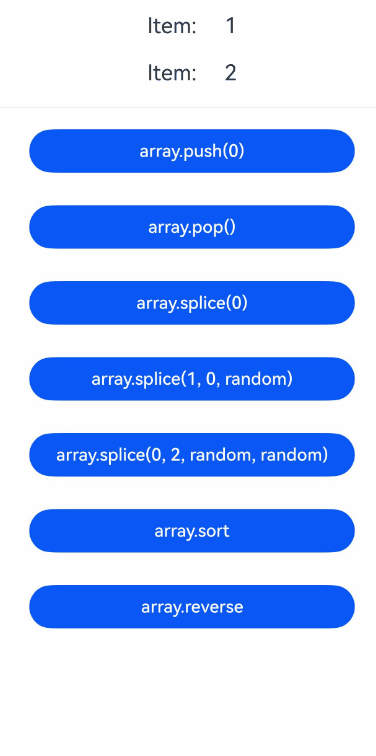

- When **globalConnect** is used to persist multiple same [collection types](#collection-types-supported-by-globalconnect), different **key** values need to be provided to distinguish the persistent data.

   The following is a sample code snippet for persisting the same **Array\<number>** type.

  ```typescript
  @Entry
  @ComponentV2
  struct Page1 {
    // Different keys are recommended to distinguish persistent data of the same container type.
    @Local arr1: Array<number> = PersistenceV2.globalConnect({
      type: Array<number>,
      key: 'arr1',
      defaultCreator: () => UIUtils.makeObserved(new Array<number>()),
    })!;

    @Local arr2: Array<number> = PersistenceV2.globalConnect({
      type: Array<number>,
      key: 'arr2',
      defaultCreator: () => UIUtils.makeObserved(new Array<number>()),
    })!;
    // ...
  }
  ```

3. Non-built-in types, such as [PixelMap](../../reference/apis-image-kit/arkts-apis-image-PixelMap.md), NativePointer, and [ArrayList](../../reference/apis-arkts/js-apis-arraylist.md), are not supported.

4. Before API version 23, the data size supported by a single **key** is about 8 KB. If the data size is too large, the persistence fails.

- Since API version 23, this restriction is removed. Data is read and written in the UI thread at the same time. However, you are not advised to store a large amount of persistent data in the UI thread. Otherwise, the UI may freeze.

5. Before API version 23, the data to be persisted must be a **class** object. Container types (such as **Array**, **Set**, and **Map**), built-in constructed objects (such as **String** and **Number**), and basic types (such as **string**, **number**, and **boolean**) are not supported. To persist non-class objects, you need to use [Preferences](../../database/preferences-guidelines.md) for data persistence.

- Since API version 23, class types and container types (**Array**, **Set**, **Map**, and **Date**) can be persisted. Built-in constructed types (such as **String** and **Number**) and basic types (such as **string**, **number**, and **boolean**) can be persisted as **class** attributes. **String** and **Number** are immutable data objects and cannot be directly persisted as [top-level data types](#globalconnect-top-level-persistent-data-types-and-non-top-level-persistent-data-types). For unsupported types, a runtime error is reported. Since API version 23, the error code [140103](../../reference/apis-arkui/errorcode-stateManagement.md#140103-appstoragev2-and-persistencev2-use-unsupported-data-types) will be returned in this case.

   The following is an example of newly added **globalConnect** that supports the persistence of the **Array\<ClassA>** type:

    <!-- @[top_level_array_classa](https://gitcode.com/openharmony/applications_app_samples/blob/master/code/DocsSample/ArkUISample/PersistenceV2/entry/src/main/ets/pages/TopLevelArrayClassA.ets) -->

    ``` TypeScript
    import { PersistenceV2, UIUtils } from '@kit.ArkUI';
   
    @ObservedV2
    class ClassA {
      @Trace public propA: string = '';
      @Trace public propB: string = '';
   
      public report(): string {
        return `${this.propA} - ${this.propB}`;
      }
    }
   
    @Entry
    @ComponentV2
    struct Comp {
      // Persist data whose top-level data type is Array&lt;ClassA&gt;.
      @Local arr: Array<ClassA> = PersistenceV2.globalConnect({
        type: Array<ClassA>,
        defaultCreator: () => UIUtils.makeObserved(new Array<ClassA>()),
        // Add defaultSubCreator to notify the state management framework how to create array items.
        // Additionally, the persisted data must be decorated with makeObserved, because JSON objects themselves lack observation capability, and automatic persistence will fail.
        defaultSubCreator: () => UIUtils.makeObserved(new ClassA())
      })!;
   
      build() {
        Column() {
          Repeat(this.arr)
            .each(ri => {
              Row() {
                Text(`propA '${ri.item.propA}'`)
                  .fontSize(20)
                  .margin(10)
                Text(`propB '${ri.item.propB}'`)
                  .fontSize(20)
                  .margin(10)
                Text(`report?.() '${ri.item.report?.()}'`)
                  .fontSize(20)
                  .margin(10)
              }
            })
          // Click 'add item', and `propA 'a' propB 'b' report?.()'a - b'` is displayed. Kill the app and re-enter, and the last result is displayed.
          Button('add item')
            .width(300)
            .margin(10)
            .onClick(() => {
              let temp: ClassA = new ClassA();
              temp.propA = 'a';
              temp.propB = 'b';
              this.arr.push(temp);
            })
        }
      }
    }
    ```

   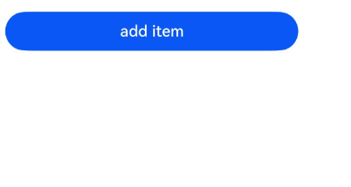

   The following is an example of the persistence of the Date type supported by globalConnect:

    <!-- @[top_level_date](https://gitcode.com/openharmony/applications_app_samples/blob/master/code/DocsSample/ArkUISample/PersistenceV2/entry/src/main/ets/pages/TopLevelDate.ets) --> 

    ``` TypeScript
    import { PersistenceV2, UIUtils } from '@kit.ArkUI';
    
    @Entry
    @ComponentV2
    struct Page1 {
      // Data of the Date type can be directly persisted.
      @Local date: Date = PersistenceV2.globalConnect({
        type: Date,
        defaultCreator: () => UIUtils.makeObserved(new Date())
      })!;
    
      build() {
        Column({ space: 40 }) {
          Text(`date: ${this.date.toISOString()}`)
            .fontSize(24)
            .margin(10)
          // Click 'date.setTime (Date.now ())' to kill the application. After the application is started, the date is displayed.
          Button('date.setTime( Date.now() )')
            .margin(10)
            .onClick(() => {
              this.date.setTime(Date.now());
            })
            .fontSize(24)
        }
        .width('100%')
      }
    }
    ```

    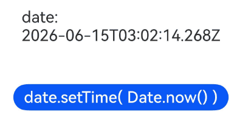

  The following is an example of globalConnect supporting the persistence of the Number type as a class subattribute:

  <!-- @[non_top_level_number_of_class](https://gitcode.com/openharmony/applications_app_samples/blob/master/code/DocsSample/ArkUISample/PersistenceV2/entry/src/main/ets/pages/NonTopLevelNumberOfClass.ets) --> 

  ``` TypeScript
  import { PersistenceV2 } from '@kit.ArkUI';
  
  @ObservedV2 class NumberClass {
    // The number type is not a top-level persistent data type. Only the persistence of non-top-level data types is supported.
    @Trace public value: Number = new Number(Infinity);
  }
  
  @Entry
  @ComponentV2
  struct Page1 {
    // The Number type can be used only as a sub-attribute of NumberClass for persistence.
    @Local number: NumberClass = PersistenceV2.globalConnect({
      type: NumberClass,
      defaultCreator: () => new NumberClass()
    })!;
    output: string[] = [];
  
    aboutToAppear(): void {
      this.output.push(`this.number.value: ${this.number.value}, is instanceof Number ${this.number.value instanceof Number}`);
      this.number.value = new Number(-this.number.value);
    }
  
    build() {
      Column() {
        Row() {
          // When the app is opened for the first time, 'this.number.value: Infinity, is instanceof Number true' is displayed.
          // Open the app for the second time. The 'this.number.value: -Infinity, is instanceof Number true' is displayed.
          Text(this.output.join('\n\n'))
            .fontSize(24)
        }
      }
      .width('100%')
    }
  }
  ```

  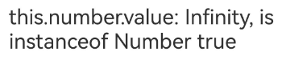

6. In versions earlier than API version 23, the persistence of circularly referenced objects is not supported.

- Since API version 23, the globalConnect API is provided to support the persistence of circularly referenced objects.

   The following is an example of the persistence of an object that supports circular reference in globalConnect:

   <!-- @[circular_reference_of_object](https://gitcode.com/openharmony/applications_app_samples/blob/master/code/DocsSample/ArkUISample/PersistenceV2/entry/src/main/ets/pages/CircularReferenceOfObject.ets) --> 

   ``` TypeScript
   import { PersistenceV2 } from '@kit.ArkUI';
   
   @ObservedV2
   class ClassA {
     @Trace public value: string = 'a';
     @Trace public refB: ClassB | undefined;
   }
   
   @ObservedV2
   class ClassB {
     @Trace public value: string = 'b';
     @Trace public refA: ClassA | undefined;
   }
   
   @ObservedV2
   class ClassC {
     @Trace public value: string = 'c';
     @Trace public objA: ClassA = new ClassA();
     @Trace public objB: ClassB = new ClassB();
   
     // ClassC is a circular reference object.
     constructor() {
       this.objA.refB = this.objB;
       this.objB.refA = this.objA;
     }
   }
   
   @Entry
   @ComponentV2
   struct Page1 {
     @Local test: ClassC = PersistenceV2.globalConnect({
       type: ClassC,
       defaultCreator: () => new ClassC()
     })!;
     output: string[] = [];
   
     aboutToAppear(): void {
       const refAValue = this.test.objA?.refB?.refA?.value;
       const refBValue = this.test.objB?.refA?.refB?.value;
       this.output.push(`${refAValue}, ${refBValue}`);
       this.test.objA.value += 'a';
       this.test.objB.value += 'b';
     }
   
     build() {
       Column() {
         Row() {
           // When the app is opened for the first time, 'a, b' is displayed.
           // When the app is opened for the second time, 'aa, bb' is displayed.
           Text(this.output.join('\n\n'))
             .fontSize(20)
             .width(300)
             .margin(10)
         }
         .height('100%')
       }
       .width('100%')
     }
   }
   ```

   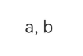

7. Automatic persistency is triggered only when [\@Trace](./arkts-new-observedV2-and-trace.md) data is changed. The change of state variables in V1, [\@Observed](./arkts-observed-and-objectlink.md) objects, and common data does not trigger persistency.

8. It is not recommended to mix **connect** and **globalConnect**. If they are mixed, the keys must be different; otherwise, the application will crash. Starting from API version 23, error code [140105](../../reference/apis-arkui/errorcode-stateManagement.md#140105-persistencev2-mixes-connect-and-globalconnect-that-use-the-same-key) will be returned.

9. PersistenceV2 must be associated with a UI instance. The persistence operation must be called after the UI instance is initialized (that is, after the [loadContent](../../reference/apis-arkui/arkts-apis-window-WindowStage.md#loadcontent9) callback is triggered).

```ts
// EntryAbility.ets
// The following is a code snippet. You need to complete it in EntryAbility.ets.
import { PersistenceV2 } from '@kit.ArkUI';

// Define a class outside EntryAbility.
@ObservedV2
class Storage {
  @Trace isPersist: boolean = false;
}

// Call PersistenceV2 in the loadContent callback of onWindowStageCreate.
onWindowStageCreate(windowStage: window.WindowStage): void {
  windowStage.loadContent('pages/Index', (err) => {
    if (err.code) {
      return;
    }
    PersistenceV2.connect(Storage, () => new Storage());
  });
}
```

10. If you have strong requirements on data persistence, for example, the persistence time, you are advised to use [Preferences](../../database/preferences-guidelines.md) for data persistence. Note: PersistenceV2 and Preferences cannot be used together because the data stored in Preferences does not have state variable information, and the deserialized data cannot trigger automatic storage of PersistenceV2.

11. When you use **globalConnect** to persist data and read data from the disk, ensure that the type of the key remains consistent before and after persistence. Since API version 23, the error code [140107](../../reference/apis-arkui/errorcode-stateManagement.md#140107-data-types-of-appstoragev2-and-persistencev2-do-not-match) will be returned in this case.

12. **globalConnect** supports only the EL1 to EL5 encryption levels. Otherwise, a runtime exception will be thrown. Since API version 23, the error code [140106](../../reference/apis-arkui/errorcode-stateManagement.md#140106-using-persistencev2-to-store-data-at-an-unsupported-encryption-level) will be returned. For details, see [Using globalConnect to Store Data](#using-globalconnect-to-store-data).

13. If the structure of the stored data is inconsistent with the current data structure, deserialization may fail. In versions earlier than API version 26.0.0, you cannot obtain the old serialized data, and therefore cannot determine the changes in your data structure.

- From API version 26.0.0, [PersistenceErrorCallback](../../reference/apis-arkui/js-apis-stateManagement.md#persistenceerrorcallback) supports the **oldValue** parameter, which can be used to obtain the old serialized data stored on the disk. For details, see [Obtaining the Old Serialized Data Through notifyOnError](#obtaining-the-old-serialized-data-through-notifyonerror).

14. The [\@Computed](./arkts-new-computed.md) attribute cannot be used in classes that use **connect** or **globalConnect**. \@Computed is read-only and does not support value assignment. As a result, deserialization fails.

## Types Supported by globalConnect

### globalConnect Top-Level Persistent Data Types and Non-Top-Level Persistent Data Types

In versions earlier than API version 23, the top-level persistent data type must be a user-defined **class** object. Container types (such as **Array**, **Set**, **Map**, and **Date**) are not supported. Since API version 23, the persistent top-level data type can be a user-defined **class** or a container type. Non-top-level data type, which is defined in the attributes of a user-defined class.

In the following example, Array\<ClassA> is a top-level persistent data type and can be the direct return value type of globalConnect. collections.Map is the attribute type of the CollectionMapClass class, which is a non-top-level persistent data type.

```typescript
class ClassA {
  propA: number;

}
@Sendable
class CollectionMapClass {
  // The attribute type in the user-defined class is collections.Map, which is not the top-level persistent data type.
  value = new collections.Map<number, number>([]);
}

@ComponentV2
struct Page1 {
  // The top-level persistent data type is Array\<ClassA>.
  @Local arr: Array<ClassA> = PersistenceV2.globalConnect({
    type: Array<ClassA>,
    defaultCreator: () => UIUtils.makeObserved(new Array<ClassA>()),
    // Add defaultSubCreator to notify the state management framework of how to create an array item.
    // Add makeObserved to the persisted data. Otherwise, the persistence will fail.
    defaultSubCreator: () => UIUtils.makeObserved(new ClassA())
  })!;
  
  // The top-level persistent data type is a user-defined class, and collections.Map is a non-top-level persistent data type.
  collectionMap: CollectionMapClass = PersistenceV2.globalConnect({
    type: CollectionMapClass,
    defaultCreator: () => new CollectionMapClass()
  })!
  // ...
}
```

### globalConnect: types supported by user-defined class object attributes

The attributes of a user-defined class object can be of the following types: boolean, number, string, undefined, null, Object, Date, Number, Boolean, String, and user-defined class. The following collection types are also supported: Array, Map, and Set.

```typescript
// The @Trace attribute of the observation class supports all the preceding types.
@ObservedV2
class ClassA {
  // VType is one of the types listed above.
  @Trace propA: VType;  
}

@ComponentV2 struct Comp {
  @Local obsObj : ClassA = PersistenceV2.globalConnect({
    type: ClassA, 
    defaultCreator: () => new ClassA()
  })
  // ...
}
```

The attributes of the user-defined class type must be decorated by the @Type decorator, and the class attribute value must be the instance of the class specified in @Type.

```typescript
class ClassA {
  // ...
}
class PersistClass {
  @Type(ClassA)
  propA: ClassA = new ClassA();
}
```

### Collection Types Supported by globalConnect

The collection types are **Array\<V>**, **Map\<K, V>**, **Set\<V>**, **collections.Array\<V>**, **collections.Map\<K, V>** and **collections.Set\<V>**.

Here, the key type (`K`) in `Map<K, V>` and `collections.Map<K, V>` refers to the `string` or `number` type.

The value type (**V**) in **Array\<V>**, **Map\<K, V>**, **Set\<V>** can be **boolean**, **number**, **string**, **Date**, **Number**, **Boolean**, **String**, **interface**, or **class**.

**collections.Array\<V>**, **collections.Map\<K, V>** and **collections.Set\<V>** require that the value of **V** must be of the **@Sendable** type (**boolean**, **number**, or **string** type).

The following shows how to use **globalConnect** to persist **Array\<ClassA>**.

<!-- @[top_level_array_classa_apis](https://gitcode.com/openharmony/applications_app_samples/blob/master/code/DocsSample/ArkUISample/PersistenceV2/entry/src/main/ets/pages/TopLevelArrayClassAAPIs.ets) -->

``` TypeScript
import { PersistenceV2, UIUtils } from '@kit.ArkUI';
 
class ClassA {
  public propA: number = 0;
  public classAToString() : string {
    return this.propA?.toString()
  }
}
 
@Entry
@ComponentV2
struct Page1 {
  @Local arr: Array<ClassA> = PersistenceV2.globalConnect({
    type: Array<ClassA>,
    defaultCreator: () => UIUtils.makeObserved(new Array<ClassA>()),
    // Add defaultSubCreator to notify the state management framework how to create ClassA objects.
    // In addition, persisted data must be decorated with makeObserved; otherwise, persistence will fail.
    defaultSubCreator: () => UIUtils.makeObserved(new ClassA())
  })!;
 
  build() {
    Column({ space: 10 }) {
      Column({ space: 0 }) {
        Repeat(this.arr)
          .each(ri => {
            Row() {
              Text(`Item: `)
                .fontSize(20)
                .margin(10)
              Text(ri.item?.classAToString ? ri.item?.classAToString(): `classAToString() missing from object, propA: ${ri.item?.propA}`)
                .fontSize(20)
                .margin(10)
            }
          })
          .key((item: ClassA, index: number) => `${index} - ${item?.propA}`)
      }
      .width('100%')
 
      Divider().width('100%')
      // Click 'array.push(0)', restart the app, and the Repeat array items are: 1, 2, 0.
      Button('array.push(0)')
        .width(300)
        .margin(10)
        .onClick(() => {
          let temp = new ClassA();
          temp.propA = 0;
          this.arr.push(UIUtils.makeObserved(temp));
        })
        .fontSize(24)
      // Click 'array.pop()', restart the app, and the Repeat array items are: 1, 2.
      Button('array.pop()')
        .width(300)
        .margin(10)
        .onClick(() => {
          this.arr.pop();
        })
        .fontSize(24)
      // Click 'array.splice(0)', restart the app, and the Repeat array items are empty.
      Button('array.splice(0)')
        .width(300)
        .margin(10)
        .onClick(() => {
          this.arr.splice(0);
        })
        .fontSize(24)
      // Click 'splice(1, 0, random)', restart the app: the Repeat component displays the same array items again.
      Button('array.splice(1, 0, random)')
        .margin(10)
        .onClick(() => {
          let temp = new ClassA();
          temp.propA = Math.round(100 * Math.random());
          this.arr.splice(1, 0, UIUtils.makeObserved(temp));
        })
        .fontSize(24)
      // Click 'array.splice(0, 2, random, random)', the first two array items are replaced and recorded.
      // Restart the app: the Repeat component displays the array items again.
      Button('array.splice(0, 2, random, random)')
        .margin(10)
        .onClick(() => {
          let tempA = new ClassA();
          tempA.propA = Math.round(100 * Math.random());
          this.arr.splice(0, 2,
            UIUtils.makeObserved(tempA),
            UIUtils.makeObserved(tempA));
        })
        .fontSize(18)
      // Click 'array.sort' to sort the array items in ascending order, restart the app, and the Repeat component displays the ascending array.
      Button('array.sort')
        .width(300)
        .margin(10)
        .onClick(() => {
          this.arr.sort((tempA, tempB)=> tempA?.propA - tempB?.propA);
        })
        .fontSize(24)
      // Click 'array.reverse' to sort the array items in descending order, restart the app, and the Repeat component displays the descending array.
      Button('array.reverse')
        .width(300)
        .margin(10)
        .onClick(() => {
          this.arr.reverse();
        })
        .fontSize(24)
    }
    .width('100%')
  }
}
```

 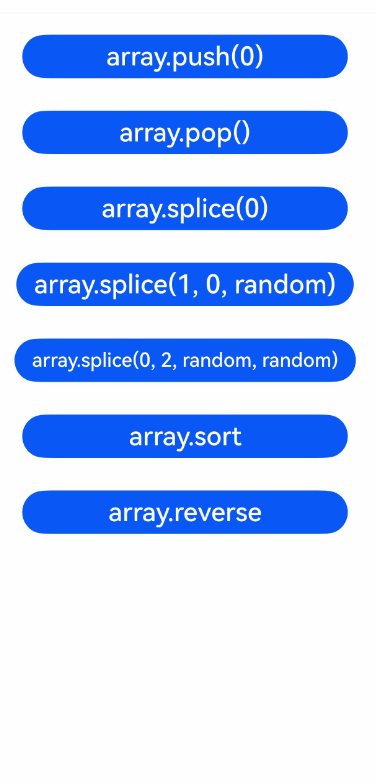

## Use Cases

### Storing Data Between Two Pages

Data page

<!-- @[persistence_v2_sample](https://gitcode.com/openharmony/applications_app_samples/blob/master/code/DocsSample/ArkUISample/ParadigmStateManagement/entry/src/main/ets/pages/persistenceV2/Sample.ets) --> 

``` TypeScript

// Sample.ets
import { Type } from '@kit.ArkUI';

// Data center
@ObservedV2
class SampleChild {
  @Trace public p1: number = 0;
  public p2: number = 10;
}

@ObservedV2
export class Sample {
  // For complex objects, use the @Type decorator to ensure successful serialization.
  @Type(SampleChild)
  @Trace public f: SampleChild = new SampleChild();
}
```

Page 1

<!-- @[Persistence_Use_Case_Data_Page](https://gitcode.com/openharmony/applications_app_samples/blob/master/code/DocsSample/ArkUISample/ParadigmStateManagement/entry/src/main/ets/pages/persistenceV2/page/Page1.ets) --> 

``` TypeScript
// Page1.ets
import { PersistenceV2 } from '@kit.ArkUI';
import { Sample } from '../Sample';
import { hilog } from '@kit.PerformanceAnalysisKit';

const DOMAIN = 0x0000;

// Register a callback for serialization failure.
PersistenceV2.notifyOnError((key: string, reason: string, msg: string) => {
  hilog.error(DOMAIN, 'testTag', '%{public}s', `error key: ${key}, reason: ${reason}, message: ${msg}`);
});

@Entry
@ComponentV2
struct Page1 {
  // Create a KV pair whose key is Sample in PersistenceV2 (if the key exists, the data in PersistenceV2 is returned) and associate it with prop.
  // Add @Local to decorate the prop attribute that needs to change the connected object. (Changing the connected object is not recommended.)
  @Local prop: Sample = PersistenceV2.connect(Sample, () => new Sample())!;
  pageStack: NavPathStack = new NavPathStack();

  build() {
    Navigation(this.pageStack) {
      Column() {
        Button('Go to page2')
          .width(300)
          .margin(10)
          .onClick(() => {
            this.pageStack.pushPathByName('Page2', null);
          })

        Button('Page1 connect the key Sample')
          .width(300)
          .margin(10)
          .onClick(() => {
            // Create a KV pair whose key is Sample in PersistenceV2 (if the key exists, the data in PersistenceV2 is returned) and associate it with prop.
            // Changing the connected object for the prop attribute is not recommended.
            this.prop = PersistenceV2.connect(Sample, 'Sample', () => new Sample())!;
          })

        Button('Page1 remove the key Sample')
          .width(300)
          .margin(10)
          .onClick(() => {
            // After being deleted from PersistenceV2, prop will no longer be associated with the value whose key is Sample.
            PersistenceV2.remove(Sample);
          })

        Button('Page1 save the key Sample')
          .width(300)
          .margin(10)
          .onClick(() => {
            // If the sample is in the connect state, persist the key-value pair of Sample.
            PersistenceV2.save(Sample);
          })

        Text(`Page1 add 1 to prop.p1: ${this.prop.f.p1}`)
          .fontSize(30)
          .margin(10)
          .onClick(() => {
            this.prop.f.p1++;
          })

        Text(`Page1 add 1 to prop.p2: ${this.prop.f.p2}`)
          .fontSize(30)
          .margin(10)
          .onClick(() => {
            // The page is not re-rendered, but the value of p2 is changed.
            this.prop.f.p2++;
          })

        // Obtain all keys in the current PersistenceV2.
        Text(`all keys in PersistenceV2: ${PersistenceV2.keys()}`)
          .fontSize(30)
          .margin(10)
      }
        .width('100%')
    }
  }
}
```

Page 2

<!-- @[Persistence_Use_Case_Data_Page](https://gitcode.com/openharmony/applications_app_samples/blob/master/code/DocsSample/ArkUISample/ParadigmStateManagement/entry/src/main/ets/pages/persistenceV2/page/Page2.ets) --> 

``` TypeScript
// Page2.ets
import { PersistenceV2 } from '@kit.ArkUI';
import { Sample } from '../Sample';

@Builder
export function Page2Builder() {
  Page2()
}

@ComponentV2
struct Page2 {
  // Create a KV pair whose key is Sample in PersistenceV2 (if the key exists, the data in PersistenceV2 is returned) and associate it with prop.
  // Add @Local to decorate the prop attribute that needs to change the connected object. (Changing the connected object is not recommended.)
  @Local prop: Sample = PersistenceV2.connect(Sample, () => new Sample())!;
  pathStack: NavPathStack = new NavPathStack();

  build() {
    NavDestination() {
      Column() {
        Button('Page2 connect the key Sample1')
          .width(300)
          .margin(10)
          .onClick(() => {
            // Create a KV pair whose key is Sample1 in PersistenceV2 (if the key exists, the data in PersistenceV2 is returned) and associate it with prop.
            // Changing the connected object for the prop attribute is not recommended.
            this.prop = PersistenceV2.connect(Sample, 'Sample1', () => new Sample())!;
          })

        Text(`Page2 add 1 to prop.p1: ${this.prop.f.p1}`)
          .fontSize(30)
          .margin(10)
          .onClick(() => {
            this.prop.f.p1++;
          })

        Text(`Page2 add 1 to prop.p2: ${this.prop.f.p2}`)
          .fontSize(30)
          .margin(10)
          .onClick(() => {
            // The page is not re-rendered, but the value of p2 is changed, which is performed after re-initialization.
            this.prop.f.p2++;
          })

        // Obtain all keys in the current PersistenceV2.
        Text(`all keys in PersistenceV2: ${PersistenceV2.keys()}`)
          .fontSize(30)
          .margin(10)
      }
      .width('100%')
    }
    .onReady((context: NavDestinationContext) => {
      this.pathStack = context.pathStack;
    })
  }
}
```

When using **Navigation**, create a **route_map.json** file as shown below in the **src/main/resources/base/profile** directory, replacing the value of **pageSourceFile** with the actual path to **Page2**. Then, add **"routerMap": "$profile: route_map"** to the **module.json5** file.

```json
{
  "routerMap": [
    {
      "name": "Page2",
      "pageSourceFile": "src/main/ets/pages/Page2.ets",
      "buildFunction": "Page2Builder",
      "data": {
        "description" : "PersistenceV2 example"
      }
    }
  ]
}
```

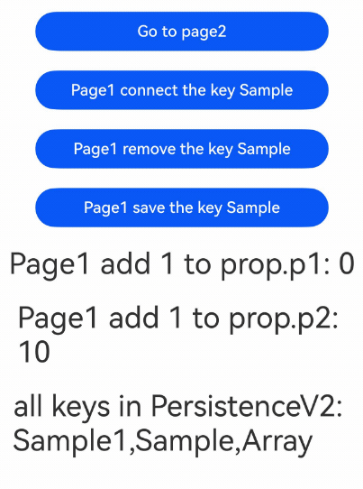

### Using globalConnect to Store Data

<!-- @[persistence_v2_global_connect](https://gitcode.com/openharmony/applications_app_samples/blob/master/code/DocsSample/ArkUISample/ParadigmStateManagement/entry/src/main/ets/pages/persistenceV2/PersistenceV2GlobalConnect.ets) -->   

``` TypeScript
import { PersistenceV2, Type, ConnectOptions } from '@kit.ArkUI';
import { contextConstant } from '@kit.AbilityKit';
import { hilog } from '@kit.PerformanceAnalysisKit';

const DOMAIN = 0x0000;
// Register a callback for serialization failure.
PersistenceV2.notifyOnError((key: string, reason: string, msg: string) => {
  hilog.error(DOMAIN, 'testTag', '%{public}s', `error key: ${key}, reason: ${reason}, message: ${msg}`);
});

@ObservedV2
class SampleChild {
  @Trace public childId: number = 0;
  public groupId: number = 1;
}

@ObservedV2
export class SampleGlobalConnect {
  // For complex objects, use the @Type decorator to ensure successful serialization.
  @Type(SampleChild)
  @Trace public father: SampleChild = new SampleChild();
}

@Entry
@ComponentV2
struct Page1 {
  @Local refresh: number = 0;
  // If no key is provided, the type name is used as the key. If the encryption level is not specified, the default EL2 level is used.
  @Local p: SampleGlobalConnect =
    PersistenceV2.globalConnect({ type: SampleGlobalConnect, defaultCreator: () => new SampleGlobalConnect() })!;
  // Use key:global1 for connection and set the encryption level to EL1.
  @Local p1: SampleGlobalConnect = PersistenceV2.globalConnect({
    type: SampleGlobalConnect,
    key: 'global1',
    defaultCreator: () => new SampleGlobalConnect(),
    areaMode: contextConstant.AreaMode.EL1
  })!;
  // Use key:global2 for connection and use the constructor function. If no encryption parameter is passed in, EL2 is used by default.
  options: ConnectOptions<SampleGlobalConnect> =
    { type: SampleGlobalConnect, key: 'global2', defaultCreator: () => new SampleGlobalConnect() };
  @Local p2: SampleGlobalConnect = PersistenceV2.globalConnect(this.options)!;
  // Use key:global3 for connection and set the encryption parameter ranging from 0 to 4; otherwise, a crash occurs. In this case, EL3 is set.
  @Local p3: SampleGlobalConnect = PersistenceV2.globalConnect({
    type: SampleGlobalConnect,
    key: 'global3',
    defaultCreator: () => new SampleGlobalConnect(),
    areaMode: 3
  })!;

  build() {
    Column() {
      // Display data.
      // Data decorated by @Trace can be automatically persisted to disks.
      Text('Key SampleGlobalConnect: ' + this.p.father.childId.toString())
        .onClick(() => {
          this.p.father.childId += 1;
        })
        .fontSize(25)
        .margin(5)
        .fontColor(Color.Red)
      Text('Key global1: ' + this.p1.father.childId.toString())
        .onClick(() => {
          this.p1.father.childId += 1;
        })
        .fontSize(25)
        .margin(5)
        .fontColor(Color.Red)
      Text('Key global2: ' + this.p2.father.childId.toString())
        .onClick(() => {
          this.p2.father.childId += 1;
        })
        .fontSize(25)
        .margin(5)
        .fontColor(Color.Red)
      Text('Key global3: ' + this.p3.father.childId.toString())
        .onClick(() => {
          this.p3.father.childId += 1;
        })
        .fontSize(25)
        .margin(5)
        .fontColor(Color.Red)
      // keys() API.
      // keys() itself does not trigger a refresh. It requires a state variable to trigger a refresh.
      Text('Persist keys: ' + PersistenceV2.keys().toString() + ' refresh: ' + this.refresh)
        .onClick(() => {
          this.refresh += 1;
        })
        .fontSize(25)
        .margin(5)

      // remove() API.
      Text('Remove key SampleGlobalConnect: ' + 'refresh: ' + this.refresh)
        .onClick(() => {
          // Deleting this key will cause it to lose connection with p. Even if a reconnection occurs, p will not be able to store data.
          PersistenceV2.remove(SampleGlobalConnect);
          this.refresh += 1;
        })
        .fontSize(25)
        .margin(5)
      Text('Remove key global1: ' + 'refresh: ' + this.refresh)
        .onClick(() => {
          // Deleting this key will cause it to lose connection with p1. Even if a reconnection occurs, p1 will not be able to store data.
          PersistenceV2.remove('global1');
          this.refresh += 1;
        })
        .fontSize(25)
        .margin(5)
      Text('Remove key global2: ' + 'refresh: ' + this.refresh)
        .onClick(() => {
          // Deleting this key will cause it to lose connection with p2. Even if a reconnection occurs, p2 will not be able to store data.
          PersistenceV2.remove('global2');
          this.refresh += 1;
        })
        .fontSize(25)
        .margin(5)
      Text('Remove key global3: ' + 'refresh: ' + this.refresh)
        .onClick(() => {
          // Deleting this key will cause it to lose connection with p3. Even if a reconnection occurs, p3 will not be able to store data.
          PersistenceV2.remove('global3');
          this.refresh += 1;
        })
        .fontSize(25)
        .margin(5)
      // reConnect
      // Fail to connect to the previous state variable after reconnection. Therefore, data cannot be saved.
      Text('ReConnect key global2: ' + 'refresh: ' + this.refresh)
        .onClick(() => {
          // At this point, a variable with the key global2 will be stored again, but this variable has nothing to do with p2.
          PersistenceV2.globalConnect(this.options);
          this.refresh += 1;
        })
        .fontSize(25)
        .margin(5)

      // save() API.
      Text('not save key SampleGlobalConnect: ' + this.p.father.groupId.toString() + ' refresh: ' + this.refresh)
        .onClick(() => {
          // Objects that are not saved by @Trace cannot be automatically stored.
          this.p.father.groupId += 1;
          this.refresh += 1;
        })
        .fontSize(25)
        .margin(5)
      Text('save key SampleGlobalConnect: ' + this.p.father.groupId.toString() + ' refresh: ' + this.refresh)
        .onClick(() => {
          // Objects that are not saved by @Trace cannot be automatically stored. You need to call the key for storage.
          this.p.father.groupId += 1;
          PersistenceV2.save(SampleGlobalConnect);
          this.refresh += 1;
        })
        .fontSize(25)
        .margin(5)
    }
    .width('100%')
  }
}
```

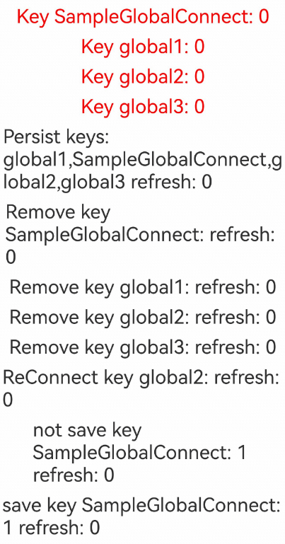

### Using connect and globalConnect in Different Modules

Pay attention to the following points when using connect to store data:

1. connect uses the module-level storage path. The path of the module that is started first is used as the storage path. When data is written back from the memory to the disk, the data is written back to the path of the first module that is connected. If the application is started from another module, the path of the new module is used as the storage path.

2. When different modules use the same key, the key-value pair saved in the module that is started first is written back to the corresponding module.

Pay attention to the storage path of globalConnect:

Although **globalConnect** is an application-level path, you can set different encryption partitions. Different encryption partitions indicate different storage paths. The **connect** does not support the setting of encryption partitions. However, when the encryption level of a module is switched, the storage path of the module is switched to the corresponding encryption partition path.

Create a module based on the project and redirect to the new module based on the sample code. The sample code is as follows:

<!-- @[persistence_v2_module_connect_storage_one](https://gitcode.com/openharmony/applications_app_samples/blob/master/code/DocsSample/ArkUISample/ParadigmStateManagement/entry/src/main/ets/pages/persistenceV2/PersistenceV2ModuleConnectStorage1.ets) --> 

``` TypeScript
module 1
import { PersistenceV2, Type } from '@kit.ArkUI';
import { common, Want } from '@kit.AbilityKit';
import { hilog } from '@kit.PerformanceAnalysisKit';
import { contextConstant } from '@kit.AbilityKit';

const DOMAIN = 0x0000;

// Register a callback for serialization failure.
PersistenceV2.notifyOnError((key: string, reason: string, msg: string) => {
  hilog.error(DOMAIN, 'testTag', '%{public}s', `error key: ${key}, reason: ${reason}, message: ${msg}`);
});

@ObservedV2
class SampleChild {
  @Trace public childId: number = 0;
  public groupId: number = 1;
}

@ObservedV2
export class Sample {
  // For complex objects, use the @Type decorator to ensure successful serialization.
  @Type(SampleChild)
  @Trace public father: SampleChild = new SampleChild();
}

@Entry
@ComponentV2
struct Page1 {
  @Local refresh: number = 0;
  // Use key:globalConnect1 for connection and set the encryption level to EL1.
  @Local p1: Sample =
    PersistenceV2.globalConnect({
      type: Sample,
      key: 'globalConnect1',
      defaultCreator: () => new Sample(),
      areaMode: contextConstant.AreaMode.EL1
    })!;
  // Use key:connect2 for connection and use the constructor function. If no encryption parameter is passed in, EL2 is used by default.
  @Local p2: Sample = PersistenceV2.connect(Sample, 'connect2', () => new Sample())!;
  private context = this.getUIContext().getHostContext() as common.UIAbilityContext;

  build() {
    Column() {
      // Display data.
      Text('Key globalConnect1: ' + this.p1.father.childId.toString())
        .onClick(() => {
          this.p1.father.childId += 1;
        })
        .fontSize(25)
        .margin(10)
        .fontColor(Color.Pink)
      Text('Key connect2: ' + this.p2.father.childId.toString())
        .onClick(() => {
          this.p2.father.childId += 1;
        })
        .fontSize(25)
        .margin(10)
        .fontColor(Color.Pink)

      // Jump
      Button('Jump to newModule')
        .width(300)
        .margin(10)
        .onClick (() => { // Used between different modules. You are advised to use globalConnect.
          let want: Want = {
            deviceId: '', // If deviceId is empty, the current device is used.
            bundleName: 'com.samples.paradigmstatemanagement', // View in app.json5.
            moduleName: 'demo', // View in module.json5 of the module to be redirected to. This parameter is optional.
            abilityName: 'NewModuleAbility', // Jump startup ability, which can be obtained from the module.json5 file of the target module.
            uri: 'src/main/ets/pages/Index'
          };
          // context is the UIAbilityContext of the initiator UIAbility.
          this.context.startAbility(want).then(() => {
            hilog.info(DOMAIN, 'testTag', '%{public}s', 'start ability success');
          }).catch((err: Error) => {
            hilog.error(DOMAIN, 'testTag', '%{public}s',
              `start ability failed. code is ${err.name}, message is ${err.message}`);
          });
        })
    }
    .width('100%')
    .borderWidth(3)
    .borderColor(Color.Blue)
    .margin({ top: 5, bottom: 5 })
  }
}
```

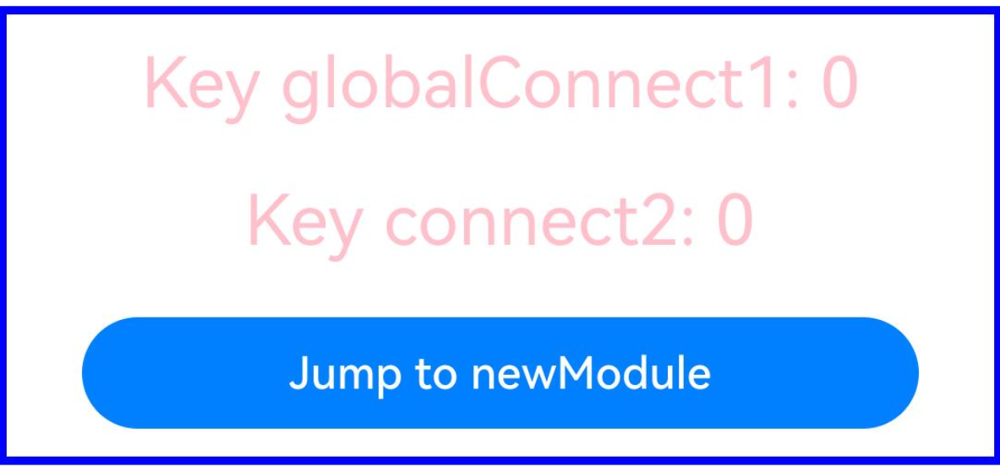

<!-- @[persistence_v2_module_connect_storage_two](https://gitcode.com/openharmony/applications_app_samples/blob/master/code/DocsSample/ArkUISample/ParadigmStateManagement/demo/src/main/ets/pages/Index.ets) -->  

``` TypeScript
// Module 2
import { PersistenceV2, Type } from '@kit.ArkUI';
import { hilog } from '@kit.PerformanceAnalysisKit';
import { contextConstant } from '@kit.AbilityKit';

const DOMAIN = 0x0000;
// Register a callback for serialization failure.
PersistenceV2.notifyOnError((key: string, reason: string, msg: string) => {
  hilog.error(DOMAIN, 'testTag', '%{public}s', `error key: ${key}, reason: ${reason}, message: ${msg}`);
});

@ObservedV2
class SampleChild {
  @Trace public childId: number = 0;
  public groupId: number = 1;
}

@ObservedV2
export class Sample {
  // For complex objects, use the @Type decorator to ensure successful serialization.
  @Type(SampleChild)
  @Trace public father: SampleChild = new SampleChild();
}

@Entry
@ComponentV2
struct Page1 {
  @Local a: number = 0;
  // Use key:globalConnect1 for connection and set the encryption level to EL1.
  @Local p1: Sample =
    PersistenceV2.globalConnect({ type: Sample, key: 'globalConnect1', defaultCreator: () => new Sample(), areaMode: contextConstant.AreaMode.EL1 })!;
  // Use key:connect2 for connection and use the constructor function. If no encryption parameter is passed in, EL2 is used by default.
  @Local p2: Sample = PersistenceV2.connect(Sample, 'connect2', () => new Sample())!;

  build() {
    Column() {
      // Display data.
      Text('Key globalConnect1: ' + this.p1.father.childId.toString())
        .onClick(() => {
          this.p1.father.childId += 1;
        })
        .fontSize(25)
        .margin(10)
        .fontColor(Color.Red)
      Text('Key connect2: ' + this.p2.father.childId.toString())
        .onClick(() => {
          this.p2.father.childId += 1;
        })
        .fontSize(25)
        .margin(10)
        .fontColor(Color.Red)
    }
    .width('100%')
  }
}
```

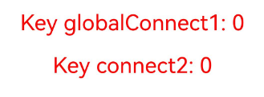

When you use different startup modes for newModule, the following symptoms may occur:

*   Start the **newModule** and change the variables bound to **globalConnect1** and **connect2**. For example, change the value of **childId** to **5**.

* Exit the application, clear the background, start the module entry, and start **newModule** by pressing the redirection key. The value of **globalConnect1** is **5**, and the value of **connect2** remains **0**.

* **globalConnect** is an application-level storage path. For a key, the entire application has only one storage path for the corresponding encryption level. **connect** is a module-level storage path. Each encryption level has a different storage path according to the startup mode of the module.

### Obtaining the Old Serialized Data Through notifyOnError

If the structure of the stored data is different from that of the current data, deserialization may fail. In API version 26.0.0 and later, you can add the **oldValue** parameter to the input parameter callback of **notifyOnError** to obtain the old serialized data stored on the disk, so that you can directly perceive the differences between the data structures.

<!-- @[persistence_v2_notifyOnError](https://gitcode.com/openharmony/applications_app_samples/blob/master/code/DocsSample/ArkUISample/ParadigmStateManagement/entry/src/main/ets/pages/persistenceV2/PersistenceV2NotifyOnError.ets) --> 

``` TypeScript
import { PersistenceV2, Type } from '@kit.ArkUI';
import { hilog } from '@kit.PerformanceAnalysisKit';

const DOMAIN = 0x0000;

// Register a callback for serialization failure.
PersistenceV2.notifyOnError((key: string, reason: string, msg: string, oldValue?: string) => {
  hilog.error(DOMAIN, 'testTag', '%{public}s',
    `error key: ${key}, reason: ${reason}, message: ${msg}, oldValue: ${oldValue}`);
});

@ObservedV2
class SampleInfo {
  @Trace public info: boolean = true;
  @Trace public propertyName: string = 'Hello';
}

@ObservedV2
class SampleChild {
  // Initially, the childInfo type is SampleInfo. Use connect/globalConnect to store it to the disk.
  @Type(SampleInfo)
  @Trace public childInfo: SampleInfo = new SampleInfo();
  // Change the childInfo type to number and run the code again.
  // @Trace public childInfo: number = 0;
  public groupId: number = 1;
}

@ObservedV2
export class Sample {
  // For complex objects, use the @Type decorator to ensure successful serialization.
  @Type(SampleChild)
  @Trace public father: SampleChild = new SampleChild();
}

@Entry
@ComponentV2
struct Index {
  @Local refresh: number = 0;
  // Call connect or globalConnect to store the data.
  @Local p: Sample = PersistenceV2.connect(Sample, 'connectSample', () => new Sample())!;
  // @Local p: Sample = PersistenceV2.globalConnect(
  //   { type: Sample, key: 'connectSample', defaultCreator: () => new Sample() })!;

  build() {
    Column({ space: 5 }) {
      // Display data.
      Text('Key connectSample: ' + this.p.father.groupId.toString())
        .onClick(() => {
          this.p.father.groupId += 1;
        })
        .fontSize(25)
        .margin(10)
        .fontColor(Color.Red)

      // save() API.
      // Variables that are not decorated by @Trace can be refreshed only by using the state variable refresh.
      Text('save key connect3: ' + this.p.father.groupId.toString() + ' refresh:' + this.refresh)
        .onClick(() => {
          // Objects that are not saved by @Trace cannot be automatically stored. You need to call the key for storage.
          this.p.father.groupId += 1;
          PersistenceV2.save('connectSample');
          this.refresh += 1;
        })
        .fontSize(25)
        .margin(10)
    }
    .width('100%')
  }
}
```

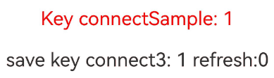

At the beginning, the type of the **childInfo** variable in **SampleChild** is **SampleInfo**. After the data is stored normally, the type of the **childInfo** variable is changed to **number** and the value is set to **1**. Then, the program is started again. In this case, the data deserialization fails because the structure of the stored data is inconsistent with that of the current data. In this case, the callback written in **notifyOnError** is used to print the old serialized data stored in the disk. That is, the following information is displayed in the Error logs:

```text
error key: connectSample, reason: serialization, message: TypeError: Receiver is not a JSObject, oldValue: {"father":{"childInfo":{"info":true,"propertyName":"Hello"},"groupId":1}}
```

## **Usage Suggestion**

You are advised to use the new API **globalConnect** to create and obtain data. The storage specifications and memory specifications of **globalConnect** are the same for an application, and the encryption level can be set without switching the encryption mode of ability. If your application does not involve multiple modules, using **connect** will not affect your application.

### Migrating from connect to globalConnect

<!-- @[persistence_v2_connect_migration_one](https://gitcode.com/openharmony/applications_app_samples/blob/master/code/DocsSample/ArkUISample/ParadigmStateManagement/entry/src/main/ets/pages/persistenceV2/PersistenceV2ConnectMigration1.ets) --> 

``` TypeScript
// Use connect to store data.
import { PersistenceV2, Type } from '@kit.ArkUI';
import { hilog } from '@kit.PerformanceAnalysisKit';

const DOMAIN = 0x0000;

// Register a callback for serialization failure.
PersistenceV2.notifyOnError((key: string, reason: string, msg: string) => {
  hilog.error(DOMAIN, 'testTag', '%{public}s', `error key: ${key}, reason: ${reason}, message: ${msg}`);
});

@ObservedV2
class SampleChild {
  @Trace public childId: number = 0;
  public groupId: number = 1;
}

@ObservedV2
export class Sample {
  // For complex objects, use the @Type decorator to ensure successful serialization.
  @Type(SampleChild)
  @Trace public father: SampleChild = new SampleChild();
}

@Entry
@ComponentV2
struct Page1 {
  @Local refresh: number = 0;
  // Use key:connect3 for storage.
  @Local p: Sample = PersistenceV2.connect(Sample, 'connect3', () => new Sample())!;

  build() {
    Column({ space: 5 }) {
      // Display data.
      Text('Key connect3: ' + this.p.father.childId.toString())
        .onClick(() => {
          this.p.father.childId += 1;
        })
        .fontSize(25)
        .margin(10)
        .fontColor(Color.Red)

      // save() API.
      // Variables that are not decorated by @Trace can be refreshed only by using the state variable refresh.
      Text('save key connect3: ' + this.p.father.groupId.toString() + ' refresh:' + this.refresh)
        .onClick(() => {
          // Objects that are not saved by @Trace cannot be automatically stored. You need to call the key for storage.
          this.p.father.groupId += 1;
          PersistenceV2.save('connect3');
          this.refresh += 1;
        })
        .fontSize(25)
        .margin(10)
    }
    .width('100%')
  }
}
```

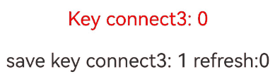

<!-- @[persistence_v2_connect_migration_two](https://gitcode.com/openharmony/applications_app_samples/blob/master/code/DocsSample/ArkUISample/ParadigmStateManagement/entry/src/main/ets/pages/persistenceV2/PersistenceV2ConnectMigration2.ets) -->  

``` TypeScript
// Migrate to globalConnect.
import { PersistenceV2, Type } from '@kit.ArkUI';
import { hilog } from '@kit.PerformanceAnalysisKit';

const DOMAIN = 0x0000;

// Register a callback for serialization failure.
PersistenceV2.notifyOnError((key: string, reason: string, msg: string) => {
  hilog.error(DOMAIN, 'testTag', '%{public}s', `error key: ${key}, reason: ${reason}, message: ${msg}`);
});

@ObservedV2
class SampleChild {
  @Trace public childId: number = 0;
  public groupId: number = 1;
}

@ObservedV2
export class Sample {
  // For complex objects, use the @Type decorator to ensure successful serialization.
  @Type(SampleChild)
  @Trace public father: SampleChild = new SampleChild();
}

// Auxiliary data used to determine whether data migration is complete.
@ObservedV2
class StorageState {
  @Trace public isCompleteMoving: boolean = false;
}

function move() {
  let movingState = PersistenceV2.globalConnect({ type: StorageState, defaultCreator: () => new StorageState() })!;
  if (!movingState.isCompleteMoving) {
    let p: Sample = PersistenceV2.connect(Sample, 'connect3', () => new Sample())!;
    PersistenceV2.remove('connect3');
    let p1 = PersistenceV2.globalConnect({ type: Sample, key: 'connect4', defaultCreator: () => p })!; // You can use the default constructor.
    // For assigned value decorated by @Trace, it is automatically saved.
    p1.father = p.father;
    // Set the migration flag to true.
    movingState.isCompleteMoving = true;
  }
}

move();

@Entry
@ComponentV2
struct Page1 {
  @Local refresh: number = 0;
  // Store data with key:connect4.
  @Local p: Sample =
    PersistenceV2.globalConnect({ type: Sample, key: 'connect4', defaultCreator: () => new Sample() })!;

  build() {
    Column({ space: 5 }) {
      // Display data.
      Text('Key connect4: ' + this.p.father.childId.toString())
        .onClick(() => {
          this.p.father.childId += 1;
        })
        .fontSize(25)
        .margin(10)
        .fontColor(Color.Red)

      // save() API.
      // Variables that are not decorated by @Trace can be refreshed only by using the state variable refresh.
      Text('save key connect4: ' + this.p.father.groupId.toString() + ' refresh:' + this.refresh)
        .onClick(() => {
          // Objects that are not saved by @Trace cannot be automatically stored. You need to call the key for storage.
          this.p.father.groupId += 1;
          PersistenceV2.save('connect4');
          this.refresh += 1;
        })
        .fontSize(25)
        .margin(10)
    }
    .width('100%')
  }
}
```

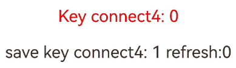

To migrate data from **connect** to **globalConnect**, you should assign the value bound to the key to **globalConnect** for storage. When the custom component uses **globalConnect** for connection, the data bound to **globalConnect** is the data saved using **connect**. You can customize the **move** function and move the data to a proper position.

### Do Not Change the Data Structure After Using connect/globalConnect to Store Data

After using connect/globalConnect to store data, you are advised not to change the data structure. Otherwise, the stored data may fail to be deserialized, and the previous data cannot be obtained. The preceding section [Obtaining the Old Serialized Data Through notifyOnError](#obtaining-the-old-serialized-data-through-notifyonerror) describes how to locate the specific changes in the data structure using the old serialized data after the data structure is changed. However, in some scenarios, **notifyOnError** is not triggered due to implicit data structure conversion in code implementation. As a result, the old serialized data cannot be obtained, as shown in the following code.

<!-- @[persistence_v2_change_data_structure](https://gitcode.com/openharmony/applications_app_samples/blob/master/code/DocsSample/ArkUISample/ParadigmStateManagement/entry/src/main/ets/pages/persistenceV2/PersistenceV2ChangeDataStructure.ets) -->  

``` TypeScript
import { PersistenceV2, Type } from '@kit.ArkUI';
import { hilog } from '@kit.PerformanceAnalysisKit';

const DOMAIN = 0x0000;

// Register a callback for serialization failure.
PersistenceV2.notifyOnError((key: string, reason: string, msg: string, oldValue?: string) => {
  hilog.error(DOMAIN, 'testTag', '%{public}s',
    `error key: ${key}, reason: ${reason}, message: ${msg}, oldValue: ${oldValue}`);
});

@ObservedV2
class SampleChild {
  @Trace public info: string = 'Hello';
}

@ObservedV2
class Sample {
  // At the beginning, the type of childInfo is SampleChild. Use connect/globalConnect to store it to the disk.
  @Type(SampleChild)
  @Trace public childInfo: SampleChild = new SampleChild();
}

@Entry
@ComponentV2
struct Index {
  // Call connect or globalConnect for storage.
  @Local sample: Sample =
    PersistenceV2.globalConnect({ type: Sample, key: 'connectSample', defaultCreator: () => new Sample() })!;

  build() {
    Column({ space: 5 }) {
      Text(JSON.stringify(this.sample)) // Serialize and display the sample variable.
        .fontSize(20)
        .margin(10)
      Button('Change Info')
        .width(300)
        .margin(10)
        .onClick(() => {
          // By converting the type to ESObject and then to SampleChild, the type verification is bypassed. Therefore, notifyOnError is not triggered after the button is clicked.
          // After the button is clicked and the code is run again, notifyOnError is triggered because info stored here is of the Array type, but info in SampleChild is still of the string type.
          this.sample.childInfo = { info: [1, 2] } as ESObject as SampleChild;
        })
    }
    .width('100%')
  }
}
```

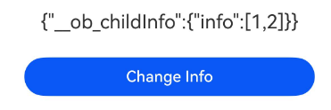

The following table describes the scenarios where **notifyOnError** is triggered when the data structure is changed.

> **NOTE**
>
>1. **oldValue** is the parameter of the **notifyOnError** callback, which is used to obtain the old serialized data when deserialization fails.
>
>2. The types that will trigger **notifyOnError** in the following table refer to the types that will trigger the **notifyOnError** callback after the original types are changed.
>
>3. The types in the following table refer to the types of attributes in the class.
>
>4. During deserialization, if the attribute type is **Object**, the internal attributes are recursively traversed and deserialized.

**Table of scenarios where notifyOnError is triggered after the data structure is changed using PersistenceV2.connect**

| Original Type| Example| Serialization storage result of the example| Type that triggers notifyOnError| oldValue |
|---|---|---|---|---|
| number | `50` | `50` | boolean, Array, Set, Map, Object | `50` |
| boolean | `true` | `true` | number, Array, Set, Map, Object | `true` |
| string | `'hello'` | `"hello"` | number, boolean, Array, Set, Map, Object | `"hello"` |
| Array | `new Array<number>([1,2,3])` | `[1,2,3]` | number, boolean, string | `[1,2,3]` |
| Set | `new Set<number>([1,2,3])` | `[1,2,3]` | number, boolean, string | `[1,2,3]` |
| Map | `new Map<string, number>([['a',1],['b',2]])` | `[["a",1],["b",2]]` | number, boolean, string, Array, Date | `[["a",1],["b",2]]` |
| Date | `new Date()` | `"2026-03-26T00:00:00.000Z"` | number, boolean, Array, Set, Map, Object | `"2026-03-26T00:00:00.000Z"` |
| Object | `new Class A { public info: number = 100; }` | `{"info":100}` | number, boolean, string | `{"info":100}` |

**Table of scenarios where notifyOnError is triggered after the data structure is changed using PersistenceV2.globalConnect**

| Original Type| Example| Serialization storage result of the example| Type that triggers notifyOnError| oldValue |
|---|---|---|---|---|
| number | `50` | `50` | N/A| N/A|
| boolean | `true` | `true` | N/A| N/A|
| string | `'hello'` | `"hello"` | N/A| N/A|
| Array | `new Array<number>([1,2,3])` | `\"Ar0003[1,2,3]\"` | number, boolean, string, Set, Map, Date, Object | `[1,2,3]` |
| Set | `new Set<number>([1,2,3])` | `\"Se0003\\\"Ar0004[1,2,3]\\\"\"` | number, boolean, string, Array, Map, Date, Object | `[1,2,3]` |
| Map | `new Map<string, number>([['a',1],['b',2]])` | `\"Ma0003[[\\\"a\\\",\\\"1\\\"],[\\\"b\\\",\\\"2\\\"]]\"` | number, boolean, string, Array, Set, Date, Object | `[["a",1],["b",2]]` |
| Date | `new Date()` | `\"Da00032026-03-26T00:00:00.000Z\"` | N/A| N/A|
| Object | `new Class A { public info: number = 100; }` | `\"0b0003{\\\"info\\\":100}\"` | number, boolean, string |  `{"info":100}` |