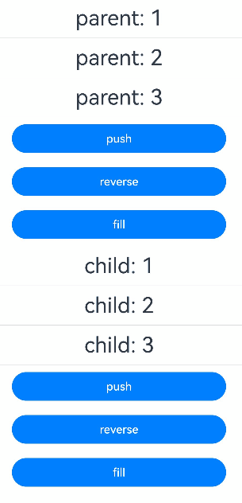
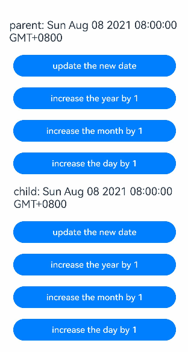
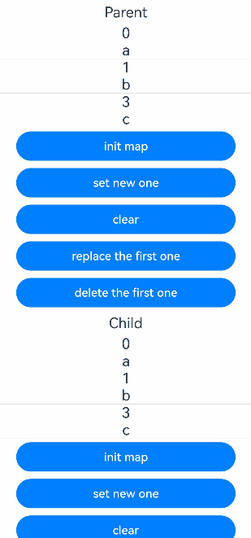
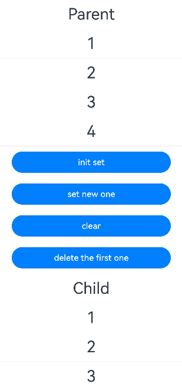
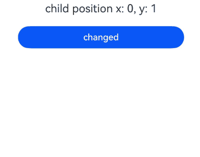
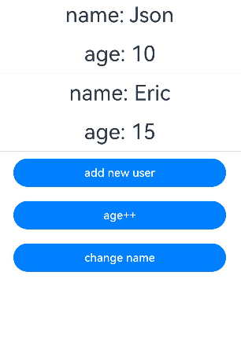
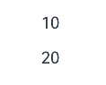
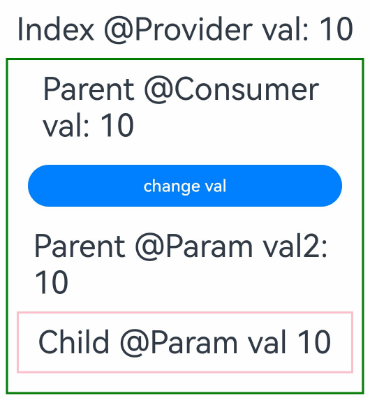
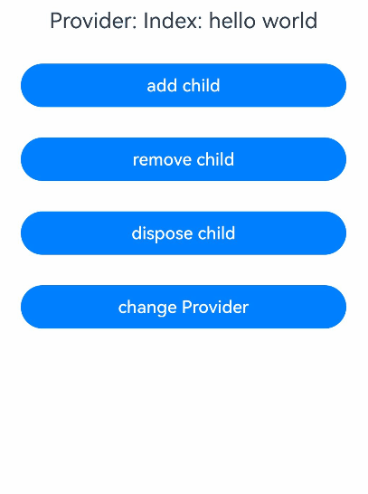

# \@Provider and \@Consumer Decorators: Synchronizing Across Component Levels in a Two-Way Manner

<!--Kit: ArkUI-->
<!--Subsystem: ArkUI-->
<!--Owner: @liwenzhen3-->
<!--Designer: @zhangboren-->
<!--Tester: @TerryTsao-->
<!--Adviser: @zhang_yixin13-->
<!-- md-trans-meta sourceCommit=3efb4ba336409dd0731ba011e1e227786db57fa2 translatedAt=2026-07-22T02:09:21.867Z pushedAt=2026-07-25T01:58:46.607Z -->

[\@Provider](../../reference/apis-arkui/arkui-ts/ts-state-management-provider.md#provider) and [\@Consumer](../../reference/apis-arkui/arkui-ts/ts-state-management-consumer.md#consumer) are used for two-way synchronization of data across component levels, freeing you from the constraints of the component hierarchy.

\@Provider and \@Consumer are decorators in state management V2, so they can be used only in [\@ComponentV2](./arkts-create-custom-components.md#componentv2). A compilation error will be reported if they are used in [\@Component](./arkts-create-custom-components.md).

\@Provider and \@Consumer provide the capability of synchronizing data across the component levels in a two-way manner. Before reading this document, you are advised to read [\@ComponentV2](./arkts-create-custom-components.md#componentv2). For details about common problems, see [In-Component State Management FAQs](./arkts-state-management-faq-inner-component.md).

>**NOTE**
>
> \@Provider and \@Consumer decorators are supported since API version 12.
>
> \@Provider and \@Consumer decorators can be used in atomic services since API version 12.
>
> Since API version 23, you can set the [BuildOptions](../../reference/apis-arkui/js-apis-arkui-builderNode.md#buildoptions12) parameter **enableProvideConsumeCrossing** to **true** in [BuilderNode](../../reference/apis-arkui/js-apis-arkui-builderNode.md) to enable cross-[BuilderNode](../../reference/apis-arkui/js-apis-arkui-builderNode.md) two-way synchronization for \@Provider and \@Consumer. After BuilderNode is mounted to the custom component node tree, \@Consumer re-obtains the latest \@Provider data and establishes a two-way synchronization relationship with it. For details, see [Using \@Consumer to Establish Two-Way Synchronization with \@Provider in the Cross-BuilderNode Scenario](#using-consumer-to-establish-two-way-synchronization-with-provider-in-the-cross-buildernode-scenario).
>
> \@Provider and \@Consumer decorators can be used in ArkTS cards since API version 23.

## Overview

\@Provider provides data. Its child components can use the \@Consumer to obtain the data by binding the same **key**.

\@Consumer obtains data. It can obtain the \@Provider data of the nearest parent node by binding the same **key**. If the \@Provider data cannot be found, the local default value will be used. For details, see the following.


Data types decorated by \@Provider and \@Consumer must be the same.

The following notes must be paid attention to when using \@Provider and \@Consumer:

- \@Provider and \@Consumer strongly depend on the custom component levels. \@Consumer is initialized to different values because the parent component of the custom component is different.

- Using \@Provider with \@Consumer is equivalent to bonding components together. From the perspective of independent component, usage of \@Provider and \@Consumer should be lessened.

## Capability Comparison: \@Provider and \@Consumer Vs. \@Provide and \@Consume

In state management V1, [\@Provide and \@Consume](./arkts-provide-and-consume.md) are the decorators which provide two-way synchronization across component levels. This topic introduces \@Provider and \@Consumer decorators in state management V2. Although the names and features of the two pairs are similar, there are still some differences.

If you are not familiar with \@Provide and \@Consume in state management V1, you can skip this section.

| Capability| \@Provider and \@Consumer Decorators of V2                                            |\@Provide and \@Consume Decorators of V1|
| ------------------ | ----------------------------------------------------- |----------------------------------------------------- |
| \@Consume(r)         |Local initialization is mandatory. The local default value will be used when \@Provider is not found.| Before API version 20, @Consume does not support local initialization. If the corresponding \@Provide cannot be found, an exception is thrown. From API version 20 onwards, @Consume supports setting the default value. If the default value is not set and the corresponding \@Provide cannot be found, an exception is thrown.|
| Supported Type          | **function** is supported.| **function** is not supported.|
| Observation capability          | Only the value change of itself can be observed. To observe the nesting scenario, use this decorator together with [\@Trace](arkts-new-observedV2-and-trace.md).| Changes at the first layer can be observed. To observe the nesting scenario, use this decorator together with [\@Observed and \@ObjectLink](arkts-observed-and-objectlink.md).|
| alias and attribute name        | **alias** is the unique matching key. By default, the attribute name is **alias**.| If both the **alias** and attribute name are **key**, the former one is matched first. If no match is found, the attribute name can be matched.|
| \@Provide(r) initialization from the parent component     | Not allowed.| Allowed.|
| \@Provide(r) overloading support | Enabled by default. That is, \@Provider can have duplicate names and \@Consumer can search upwards for the nearest \@Provider.| Disabled by default. That is, \@Provide with duplicate names is not allowed in the component tree. If overloading is required, set **allowOverride**.|

## Decorator Description

### Basic rules

\@Provider syntax:

`@Provider(aliasName?: string) varName : varType = initValue`

| \@Provider Property Decorator| Description                                                 |
| ------------------ | ----------------------------------------------------- |
| Parameters        | **aliasName?: string**: alias. The default value is the attribute name.|
| Supported Type          | Member variables in the custom component.<br> Property types include number, string, boolean, class, [Array](#decorating-variables-of-the-array-type), [Date](#decorating-variables-of-the-date-type), [Map](#decorating-variables-of-the-map-type), and [Set](#decorating-variables-of-the-set-type). [Arrow functions](#decorating-callback-by-using-provider-and-consumer-and-facilitating-behavior-abstraction-between-components).|
| Initialization from the parent component     | Forbidden.|
| Local initialization        | Required.|
| Observation capability        | Be equivalent to \@Trace. Changes are synchronized to the corresponding \@Consumer.|

\@Consumer syntax:

`@Consumer(aliasName?: string) varName : varType = initValue`

| \@Consumer Property Decorator| Description                                                        |
| --------------------- | ------------------------------------------------------------ |
| Parameters           | **aliasName?: string**: alias. The default value is the attribute name. The nearest \@Provider is searched upwards.   |
| Supported type         | Member variables in the custom component.<br> Property types include number, string, boolean, class, Array, Date, Map, and Set.<br> Arrow function.|
| Initialization from the parent component     | Forbidden.|
| Local initialization        | Required.|
| Observation capability        | Be equivalent to \@Trace. Changes will be synchronized to the corresponding \@Provider.|

### aliasName and Attribute Name

\@Provider and \@Consumer accept the optional parameter **aliasName**. If no parameter is set, the attribute name is used as the default aliasName.

>**NOTE**
>
> aliasName is the unique key used to match \@Provider and \@Consumer.

The following three examples clearly describe how \@Provider and \@Consumer use **aliasName** for searching and matching.

```ts
@ComponentV2
struct Parent {
  // The aliasName is not defined. Use the property name "str" as the aliasName.
  @Provider() str: string = 'hello';
}

@ComponentV2
struct Child {
  // Define aliasName as"str" and use it to search.
  // If the value can be found on the Parent component, use the value "hello" of @Provider.
  @Consumer('str') str: string = 'world';
}
```

```ts
@ComponentV2
struct Parent {
  // Define aliasName as "alias".
  @Provider('alias') str: string = 'hello';
}

@ComponentV2 
struct Child {
  // Define aliasName as "alias", find out @Provider, and obtain the value "hello".
  @Consumer('alias') str: string = 'world';
}
```

```ts
@ComponentV2
struct Parent {
  // Define aliasName as "alias".
  @Provider('alias') str: string = 'hello';
}

@ComponentV2
struct Child {
  // The aliasName is not defined. Use the property name "str" as the aliasName.
  // The corresponding @Provider is not found, use the local value "world".
  @Consumer() str: string = 'world';
}
```

## Variable Passing

| Behavior      | Description                                                        |
| -------------- | ------------------------------------------------------------ |
| Initialization from the parent component| Variables decorated by \@Provider and \@Consumer can be initialized only locally.|
| Initializing child components   | Variables decorated by @Provider and @Consumer can initialize variables decorated by [@Param](./arkts-new-param.md) in child components. |

## Constraints

1. \@Provider and \@Consumer are attribute decorators of custom components. They can decorate only attributes in custom components but not class attributes.

2. \@Provider and \@Consumer are decorators of the state management V2, which can be used only in \@ComponentV2 but not in \@Component.

3. \@Provider and \@Consumer support only local initialization.

## Use Cases

### Synchronizing \@Provider and \@Consumer in a Two-Way Manner

**Establishing a Two-Way Binding**

1. Initialize the **Parent** and **Child** custom components:

    - **@Consumer() str: string = 'world'** in the **Child** component searches upwards to find **@Provider() str: string = 'hello'** in the **Parent** component.

    - **@Consumer() str: string = 'world'** is initialized to the value of **@Provider**, that is, **'hello'**.

    - Both of them establish a two-way synchronization relationship.

2. Click the button in Parent, change the str decorated by \@Provider, and notify the corresponding \@Consumer to refresh the UI.

3. Click the button in Child, change the str decorated by \@Consumer, and notify the corresponding \@Provider to refresh the UI.

<!-- @[Twoway_Binding](https://gitcode.com/openharmony/applications_app_samples/blob/master/code/DocsSample/ArkUISample/ProviderConsumer/entry/src/main/ets/homePage/TwowayBinding.ets) --> 

``` TypeScript
@Entry
@ComponentV2
struct Parent {
  @Provider() str: string = 'hello';

  build() {
    Column() {
      Button(this.str)
        .width(300)
        .margin(10)
        .onClick(() => {
          this.str += '0';
        })
      Child()
    }
    .width('100%')
  }
}

@ComponentV2
struct Child {
  // The name of the @Consumer decorated attribute str is the same as that of the @Provider decorated attribute str in the Parent component. Therefore, a bidirectional binding relationship is established.
  @Consumer() str: string = 'world';

  build() {
    Column() {
      Button(this.str)
        .width(300)
        .margin(10)
        .onClick(() => {
          this.str += '0';
        })
    }
    .width('100%')
  }
}
```


**Two-Way Binding Not Established**

In the following example, \@Provider and \@Consumer fail to establish a two-way synchronization relationship because of different **aliasName** values.

1. Initialize the **Parent** and **Child** custom components:

    - In **Child**, `@Consumer() str: string = 'world'` searches upward but does not find its data provider (@Provider).

    - `@Consumer() str: string = 'world'` uses the local default value 'world'.

    - Both of them fail to establish a two-way synchronization relationship.

2. Click the button in the **Parent** component to change @Provider decorated **str1** and re-render only the **Button** component associated with @Provider.

3. Click the button in Child to change the str decorated by \@Consumer. Only the Button component associated with \@Consumer is updated.

<!-- @[No_Twoway_Binding](https://gitcode.com/openharmony/applications_app_samples/blob/master/code/DocsSample/ArkUISample/ProviderConsumer/entry/src/main/ets/homePage/NoTwowayBinding.ets) --> 

``` TypeScript
@Entry
@ComponentV2
struct Parent {
  @Provider() str1: string = 'hello';

  build() {
    Column() {
      Button(this.str1)
        .width(300)
        .margin(10)
        .onClick(() => {
          this.str1 += '0';
        })
      Child()
    }
    .width('100%')
  }
}

@ComponentV2
struct Child {
  // The name of the @Consumer decorated attribute str is different from that of the @Provider decorated attribute str1 in the Parent component. Therefore, the bidirectional binding relationship cannot be established.
  @Consumer() str: string = 'world';

  build() {
    Column() {
      Button(this.str)
        .width(300)
        .margin(10)
        .onClick(() => {
          this.str += '0';
        })
    }
    .width('100%')
  }
}
```


### Decorating Variables of the Array Type

When the decorated object is of the **Array** type, the following can be observed: (1) complete array reassignment; (2) array item changes caused by calling **push**, **pop**, **shift**, **unshift**, **splice**, **copyWithin**, **fill**, **reverse**, or **sort**.

<!-- @[Decorative_Array](https://gitcode.com/openharmony/applications_app_samples/blob/master/code/DocsSample/ArkUISample/ProviderConsumer/entry/src/main/ets/homePage/DecorativeArray.ets) -->  

``` TypeScript
@Entry
@ComponentV2
struct Parent {
  @Provider() count: number[] = [1, 2, 3];

  build() {
    Row() {
      Column() {
        ForEach(this.count, (item: number) => {
          Text(`parent: ${item}`)
            .fontSize(30)
            .margin(10)
          Divider()
        })
        // count is decorated by @Provider, and the overall assignment of Array and changes brought by calling Array APIs are observable.
        Button('push')
          .width(300)
          .margin(10)
          .onClick(() => {
            this.count.push(111);
          })
        Button('reverse')
          .width(300)
          .margin(10)
          .onClick(() => {
            this.count.reverse();
          })
        Button('fill')
          .width(300)
          .margin(10)
          .onClick(() => {
            this.count.fill(6);
          })
        Child()
      }
      .width('100%')
    }
    .height('100%')
  }
}

@ComponentV2
struct Child {
  @Consumer() count: number[] = [9, 8, 7];

  build() {
    Column() {
      ForEach(this.count, (item: number) => {
        Text(`child: ${item}`)
          .fontSize(30)
          .margin(10)
        Divider()
      })
      // count is decorated by @Consumer, and the overall assignment of Array and changes brought by calling Array APIs are observable.
      Button('push')
        .width(300)
        .margin(10)
        .onClick(() => {
          this.count.push(222);
        })
      Button('reverse')
        .width(300)
        .margin(10)
        .onClick(() => {
          this.count.reverse();
        })
      Button('fill')
        .width(300)
        .margin(10)
        .onClick(() => {
          this.count.fill(8);
        })
    }
    .width('100%')
  }
}
```



### Decorating Variables of the Date Type

By decorating the variables of the Date type, you can observe the value changes to the entire **Date** and the changes brought by calling the **Date** APIs: **setFullYear**, **setMonth**, **setDate**, **setHours**, **setMinutes**, **setSeconds**, **setMilliseconds**, **setTime**, **setUTCFullYear**, **setUTCMonth**, **setUTCDate**, **setUTCHours**, **setUTCMinutes**, **setUTCSeconds**, and **setUTCMilliseconds**.

<!-- @[Decorative_Date](https://gitcode.com/openharmony/applications_app_samples/blob/master/code/DocsSample/ArkUISample/ProviderConsumer/entry/src/main/ets/homePage/DecorativeDate.ets) -->  

``` TypeScript
@Entry
@ComponentV2
struct Parent {
  @Provider() selectedDate: Date = new Date('2021-08-08');

  build() {
    Column() {
      Text(`parent: ${this.selectedDate}`)
        .fontSize(20)
        .margin(10)
      // selectedDate is decorated by @Provider. Changes from overall assignment of Date and from calling Date APIs can be observed.
      Button('update the new date')
        .width(300)
        .margin(10)
        .onClick(() => {
          this.selectedDate = new Date('2023-07-07');
        })
      Button('increase the year by 1')
        .width(300)
        .margin(10)
        .onClick(() => {
          this.selectedDate.setFullYear(this.selectedDate.getFullYear() + 1);
        })
      Button('increase the month by 1')
        .width(300)
        .margin(10)
        .onClick(() => {
          this.selectedDate.setMonth(this.selectedDate.getMonth() + 1);
        })
      Button('increase the day by 1')
        .width(300)
        .margin(10)
        .onClick(() => {
          this.selectedDate.setDate(this.selectedDate.getDate() + 1);
        })
      Child()
    }
    .width('100%')
  }
}

@ComponentV2
struct Child {
  @Consumer() selectedDate: Date = new Date('2022-07-07');

  build() {
    Column() {
      Text(`child: ${this.selectedDate}`)
        .fontSize(20)
        .margin(10)
      // selectedDate is decorated by @Consumer. Changes from overall assignment of Date and from calling Date APIs can be observed.
      Button('update the new date')
        .width(300)
        .margin(10)
        .onClick(() => {
          this.selectedDate = new Date('2025-01-01');
        })
      Button('increase the year by 1')
        .width(300)
        .margin(10)
        .onClick(() => {
          this.selectedDate.setFullYear(this.selectedDate.getFullYear() + 1);
        })
      Button('increase the month by 1')
        .width(300)
        .margin(10)
        .onClick(() => {
          this.selectedDate.setMonth(this.selectedDate.getMonth() + 1);
        })
      Button('increase the day by 1')
        .width(300)
        .margin(10)
        .onClick(() => {
          this.selectedDate.setDate(this.selectedDate.getDate() + 1);
        })
    }
    .width('100%')
  }
}
```



### Decorating Variables of the Map Type

By decorating the variables of the **Map** type, you can observe the overall value changes to the entire **Map** and the changes brought by calling the **Map** APIs: set, clear, and delete.

<!-- @[Decorative_Map](https://gitcode.com/openharmony/applications_app_samples/blob/master/code/DocsSample/ArkUISample/ProviderConsumer/entry/src/main/ets/homePage/DecorativeMap.ets) -->  

``` TypeScript
@Entry
@ComponentV2
struct Parent {
  @Provider() message: Map<number, string> = new Map([[0, 'a'], [1, 'b'], [3, 'c']]);

  build() {
    Column() {
      Text('Parent')
        .fontSize(20)
        .margin(5)
      ForEach(Array.from(this.message.entries()), (item: [number, string]) => {
        Text(`${item[0]}`)
          .fontSize(20)
        Text(`${item[1]}`)
          .fontSize(20)
        Divider()
      })
      // message is decorated by @Provider, and changes from overall assignment of the Map and from calling Map interfaces can be observed.
      Button('init map')
        .width(300)
        .margin(5)
        .onClick(() => {
          this.message = new Map([[0, 'aa'], [1, 'bb'], [3, 'cc']]);
        })
      Button('set new one')
        .width(300)
        .margin(5)
        .onClick(() => {
          this.message.set(4, 'd');
        })
      Button('clear')
        .width(300)
        .margin(5)
        .onClick(() => {
          this.message.clear();
        })
      Button('replace the first one')
        .width(300)
        .margin(5)
        .onClick(() => {
          this.message.set(0, 'a~');
        })
      Button('delete the first one')
        .width(300)
        .margin(5)
        .onClick(() => {
          this.message.delete(0);
        })
      Child()
    }
    .width('100%')
  }
}

@ComponentV2
struct Child {
  @Consumer() message: Map<number, string> = new Map([[0, 'd'], [1, 'e'], [3, 'f']]);

  build() {
    Column() {
      Text('Child')
        .fontSize(20)
        .margin(5)
      ForEach(Array.from(this.message.entries()), (item: [number, string]) => {
        Text(`${item[0]}`)
          .fontSize(20)
        Text(`${item[1]}`)
          .fontSize(20)
        Divider()
      })
      // message is decorated by @Consumer, and changes from overall assignment of the Map and from calling Map APIs can be observed.
      Button('init map')
        .width(300)
        .margin(5)
        .onClick(() => {
          this.message = new Map([[0, 'dd'], [1, 'ee'], [3, 'ff']]);
        })
      Button('set new one')
        .width(300)
        .margin(5)
        .onClick(() => {
          this.message.set(4, 'g');
        })
      Button('clear')
        .width(300)
        .margin(5)
        .onClick(() => {
          this.message.clear();
        })
      Button('replace the first one')
        .width(300)
        .margin(5)
        .onClick(() => {
          this.message.set(0, 'a*');
        })
      Button('delete the first one')
        .width(300)
        .margin(5)
        .onClick(() => {
          this.message.delete(0);
        })
    }
    .width('100%')
  }
}
```



### Decorating Variables of the Set Type

By decorating the variables of the **Set** type, you can observe the overall value changes to the entire **Set** and the changes brought by calling the **Set** APIs: add, clear, and delete.

<!-- @[Decorative_Set](https://gitcode.com/openharmony/applications_app_samples/blob/master/code/DocsSample/ArkUISample/ProviderConsumer/entry/src/main/ets/homePage/DecorativeSet.ets) -->  

``` TypeScript
@Entry
@ComponentV2
struct Parent {
  @Provider() message: Set<number> = new Set([1, 2, 3, 4]);

  build() {
    Column() {
      Text('Parent')
        .fontSize(30)
        .margin(10)
      ForEach(Array.from(this.message.entries()), (item: [number, number]) => {
        Text(`${item[0]}`)
          .fontSize(30)
          .margin(10)
        Divider()
      })
      // message is decorated by @Provider, and the overall assignment of Set and changes brought by calling Set APIs are observable.
      Button('init set')
        .width(300)
        .margin(10)
        .onClick(() => {
          this.message = new Set([1, 2, 3, 4]);
        })
      Button('set new one')
        .width(300)
        .margin(10)
        .onClick(() => {
          this.message.add(5);
        })
      Button('clear')
        .width(300)
        .margin(10)
        .onClick(() => {
          this.message.clear();
        })
      Button('delete the first one')
        .width(300)
        .margin(10)
        .onClick(() => {
          this.message.delete(1);
        })
      Child()
    }
    .width('100%')
  }
}

@ComponentV2
struct Child {
  @Consumer() message: Set<number> = new Set([1, 2, 3, 4, 5, 6]);

  build() {
    Column() {
      Text('Child')
        .fontSize(30)
        .margin(10)
      ForEach(Array.from(this.message.entries()), (item: [number, number]) => {
        Text(`${item[0]}`)
          .fontSize(30)
          .margin(10)
        Divider()
      })
      // message is decorated by @Consumer, and the overall assignment of Set and changes brought by calling Set APIs are observable.
      Button('init set')
        .width(300)
        .margin(10)
        .onClick(() => {
          this.message = new Set([1, 2, 3, 4, 5, 6]);
        })
      Button('set new one')
        .width(300)
        .margin(10)
        .onClick(() => {
          this.message.add(7);
        })
      Button('clear')
        .width(300)
        .margin(10)
        .onClick(() => {
          this.message.clear();
        })
      Button('delete the first one')
        .width(300)
        .margin(10)
        .onClick(() => {
          this.message.delete(1);
        })
    }
    .width('100%')
  }
}
```



### Decorating Callback by Using @Provider and @Consumer and Facilitating Behavior Abstraction Between Components

When a parent component needs to register callbacks for child components, the @Provider and @Consumer decorators can be applied to callback methods.

For drag scenarios requiring synchronization of child component drag start position to the parent component, refer to the following example.

<!-- @[Drag_Drop](https://gitcode.com/openharmony/applications_app_samples/blob/master/code/DocsSample/ArkUISample/ProviderConsumer/entry/src/main/ets/homePage/DragDrop.ets) --> 

``` TypeScript
@Entry
@ComponentV2
struct Parent {
  @Local childX: number = 0;
  @Local childY: number = 1;
  @Provider() onDrag: (x: number, y: number) => void = (x: number, y: number) => {
    console.info(`onDrag event at x=${x} y:${y}`);
    this.childX = x;
    this.childY = y;
  }

  build() {
    Column() {
      Text(`child position x: ${this.childX}, y: ${this.childY}`)
        .fontSize(20)
        .margin(10)
      Child()
    }
    .width('100%')
  }
}

@ComponentV2
struct Child {
  @Consumer() onDrag: (x: number, y: number) => void = (x: number, y: number) => {};

  build() {
    Button('changed')
      .width(300)
      .margin(10)
      .draggable(true)
      .onDragStart((event: DragEvent) => {
        // Current Previewer does not support common drag events.
        this.onDrag(event.getDisplayX(), event.getDisplayY());
      })
  }
}
```



### Decorating Complex Types by \@Provider and \@Consumer and Using together with \@Trace

1. \@Provider and \@Consumer can only observe changes to the data itself. If you need to observe attribute changes of the decorated complex data type, you can use \@Trace together, or use [makeObserved](./arkts-new-makeObserved.md) to convert non-observable data into observable data.

2. When decorating built-in types, such as Array, Map, Set, and Date, you can observe the changes of some APIs. The observation capability is the same as that of [\@Trace](./arkts-new-observedV2-and-trace.md#observing-changes).

<!-- @[Decorative_Complex](https://gitcode.com/openharmony/applications_app_samples/blob/master/code/DocsSample/ArkUISample/ProviderConsumer/entry/src/main/ets/homePage/DecorativeComplex.ets) -->  

``` TypeScript
@ObservedV2
class User {
  // Properties of complex data types decorated by @Trace can be observed for property changes.
  @Trace public name: string;
  @Trace public age: number;

  constructor(name: string, age: number) {
    this.name = name;
    this.age = age;
  }
}
const data: User[] = [new User('Json', 10), new User('Eric', 15)];
@Entry
@ComponentV2
struct Parent {
  @Provider('data') users: User[] = data;

  build() {
    Column() {
      Child()
      Button('add new user')
        .width(300)
        .margin(10)
        .onClick(() => {
          this.users.push(new User('Molly', 18));
        })
      Button('age++')
        .width(300)
        .margin(10)
        .onClick(() => {
          this.users[0].age++;
        })
      Button('change name')
        .width(300)
        .margin(10)
        .onClick(() => {
          this.users[0].name = 'Shelly';
        })
    }
    .width('100%')
  }
}

@ComponentV2
struct Child {
  @Consumer('data') users: User[] = [];

  build() {
    Column() {
      ForEach(this.users, (item: User) => {
        Column() {
          Text(`name: ${item.name}`)
            .fontSize(30)
            .margin(10)
          Text(`age: ${item.age}`)
            .fontSize(30)
            .margin(10)
          Divider()
        }
        .width('100%')
      })
    }
    .width('100%')
  }
}
```



### Searching Upwards by \@Consumer for the Nearest \@Provider

If \@Provider has duplicate names in the component tree, \@Consumer will search upwards for the \@Provider data of the nearest parent node.

<!-- @[Provider_Same](https://gitcode.com/openharmony/applications_app_samples/blob/master/code/DocsSample/ArkUISample/ProviderConsumer/entry/src/main/ets/homePage/ProviderSame.ets) --> 

``` TypeScript
@Entry
@ComponentV2
struct Index {
  @Provider() val: number = 10;

  build() {
    Column() {
      Parent()
    }
    .width('100%')
  }
}

@ComponentV2
struct Parent {
  @Provider() val: number = 20;
  @Consumer('val') val2: number = 0; // 10

  build() {
    Column() {
      Text(`${this.val2}`)
        .fontSize(20)
        .margin(10)
      Child()
    }
    .width('100%')
  }
}

@ComponentV2
struct Child {
  @Consumer() val: number = 0; // 20

  build() {
    Column() {
      Text(`${this.val}`)
        .fontSize(20)
        .margin(10)
    }
    .width('100%')
  }
}
```



In the preceding example:

- \@Consumer in **Parent** searches upwards for **@Provider() val: number = 10** defined in **Index** and initializes it to **10**.

- \@Consumer in **Child** is searched upwards. After **@Provider() val: number = 20** defined in **Parent** is found, \@Consumer stops and is initialized to **20**.

### Initializing \@Param by \@Provider and \@Consumer

Variables decorated by \@Provider and \@Consumer can be used to initialize \@Param decorated variables in the child component.

<!-- @[Decorative_Initialized](https://gitcode.com/openharmony/applications_app_samples/blob/master/code/DocsSample/ArkUISample/ProviderConsumer/entry/src/main/ets/homePage/DecorativeInitialized.ets) -->  

``` TypeScript
@Entry
@ComponentV2
struct Index {
  @Provider() val: number = 10;

  build() {
    Column() {
      Text(`Index @Provider val: ${this.val}`)
        .fontSize(30)
        .margin(10)
      // The @Provider decorated variable val can initialize the @Param decorated variable val2.
      Parent({ val2: this.val })
    }
    .width('100%')
  }
}

@ComponentV2
struct Parent {
  @Consumer() val: number = 0;
  @Require @Param val2: number;

  build() {
    Column() {
      Text(`Parent @Consumer val: ${this.val}`)
        .fontSize(30)
        .margin(10)
      Button('change val')
        .width(300)
        .margin(10)
        .onClick(() => {
          this.val++;
        })
      Text(`Parent @Param val2: ${this.val2}`)
        .fontSize(30)
        .margin(10)
      // The @Consumer decorated variable val can initialize the @Param decorated variable val.
      Child({ val: this.val })
    }
    .width('95%')
    .border({ width: 2, color: Color.Green })
    .height('45%')
  }
}

@ComponentV2
struct Child {
  @Require @Param val: number;

  build() {
    Column() {
      Text(`Child @Param val ${this.val}`)
        .fontSize(30)
        .margin(10)
    }
    .width('95%')
    .border({ width: 2, color: Color.Pink })
  }
}
```



In the preceding example:

- Two-way data binding is established between the variable val decorated by \@Provider in **Index** and the variable **val** decorated by \@Consumer in **Parent**. The variable **val2** decorated by \@Param in **Parent** receives data from the data source **val** in **Index** and synchronizes the changes. The variable **val** decorated by \@Param in **Child** receives data from the data source **val** in **Parent** and synchronizes the changes.

- Click the button in **Parent** to trigger the change of **@Consumer() val**. The change is synchronized to **@Provider() val** in **Index** and **@Param val** in **Child**, and the corresponding UI is refreshed.

- The change of **@Provider() val** in the **Index** is synchronized to **@Param val2** in the parent, which corresponds to UI update.

### Using \@Consumer to Establish Two-Way Synchronization with \@Provider in the Cross-BuilderNode Scenario

> **NOTE**
>
> Since API version 23, cross-BuilderNode pairing of @Provider and @Consumer is supported.

The following provides an example to implement the following functions:

1. BuilderNode constructs the component tree through a [global custom builder function](arkts-builder.md#global-custom-builder-function). The root [FrameNode](../../reference/apis-arkui/js-apis-arkui-frameNode.md) of the component tree can be obtained via [getFrameNode](../../reference/apis-arkui/js-apis-arkui-builderNode.md#getframenode), and this node can be directly returned by [NodeController](../../reference/apis-arkui/js-apis-arkui-nodeController.md) and mounted under the [NodeContainer](../../reference/apis-arkui/arkui-ts/ts-basic-components-nodecontainer.md) node.

2. When mounting to the custom component node tree, **BuilderNode** is mounted under the custom component via the **addBuilderNode** method. At this point, the \@Consumer under the **BuilderNode** searches upward for \@Provider; after finding the nearest \@Provider according to the key matching rules, it establishes a two-way synchronization relationship with the \@Provider. If no matched \@Provider is found, the default value of \@Consumer is used.

3. After the two-way synchronization relationship is established, if the value of the \@Provider decorated variable differs from the default value of \@Consumer, the \@Monitor method of \@Consumer is called back, along with the [\@Monitor](./arkts-new-monitor.md) method of variables that have a synchronization relationship with \@Consumer. For example, \@Consumer notifies \@Param in its child component to trigger the \@Monitor method.

4. After **BuilderNode** is unmounted from the component tree, \@Consumer attempts to find the corresponding \@Provider again. If it finds that the previously paired \@Provider can no longer be located after being unmounted from the component tree, it disconnects the two-way synchronization relationship with the \@Provider, and the variable decorated by \@Consumer is restored to its default value.

5. When \@Consumer disconnects the connection with \@Provider and reverts to its default value, it determines whether the value of the variable decorated by \@Consumer has changed relative to the shift from the \@Provider value to the \@Consumer default value. If there is a change, it triggers a callback for the \@Monitor method of \@Consumer, as well as the \@Monitor methods of variables that have a synchronization relationship with this \@Consumer.

<!-- @[Builder_Node](https://gitcode.com/openharmony/applications_app_samples/blob/master/code/DocsSample/ArkUISample/ProviderConsumer/entry/src/main/ets/homePage/BuilderNode.ets) --> 

``` TypeScript
import { BuilderNode, FrameNode, NodeController } from '@kit.ArkUI';

@Builder
function buildText() {
  TestRemove()
}

let globalBuilderNode: BuilderNode<[]> | null = null;

class TextNodeController extends NodeController {
  private rootNode: FrameNode | null = null;
  private uiContext: UIContext | null = null;

  constructor() {
    super();
  }

  makeNode(context: UIContext): FrameNode | null {
    this.rootNode = new FrameNode(context);
    this.uiContext = context;
    return this.rootNode;
  }

  addBuilderNode(): void {
    if (globalBuilderNode === null && this.uiContext) {
      globalBuilderNode = new BuilderNode(this.uiContext);
      // Construct BuilderNode, with TestRemove as a child component.
      globalBuilderNode.build(wrapBuilder<[]>(buildText), undefined, { enableProvideConsumeCrossing: true });
    }
    if (this.rootNode && globalBuilderNode) {
      this.rootNode.appendChild(globalBuilderNode.getFrameNode());
    }
  }

  removeBuilderNode(): void {
    if (this.rootNode && globalBuilderNode) {
      this.rootNode.removeChild(globalBuilderNode.getFrameNode());
    }
  }

  disposeNode(): void {
    if (this.rootNode && globalBuilderNode) {
      globalBuilderNode.dispose();
    }
  }
}

@Entry
@ComponentV2
struct RemoChildDisconnectProvider {
  @Provider() content: string = 'Index: hello world';
  @Monitor('content')
  providerWatch() {
    console.info(`Provider change ${this.content}`);
  }

  controllerIndex: TextNodeController = new TextNodeController();

  build() {
    Column({ space: 8 }) {
      Text(`Provider: ${this.content}`)
        .fontSize(20)
        .margin(10)

      // Add BuilderNode, @Consumer establishes two-way synchronization with @Provider.
      Button('add child')
        .width(300)
        .margin(10)
        .onClick(() => {
          this.controllerIndex.addBuilderNode();
        })

      // Remove BuilderNode, @Consumer disconnects the connection with @Provider and reverts to the default value.
      Button('remove child')
        .width(300)
        .margin(10)
        .onClick(() => {
          this.controllerIndex.removeBuilderNode();
        })

      // The child node TestRemove of BuilderNode is released. Subsequently, this child node is destroyed, which triggers the aboutToDisappear callback of the child node.
      Button('dispose child')
        .width(300)
        .margin(10)
        .onClick(() => {
          this.controllerIndex.disposeNode();
        })

      // Two-way synchronous update of @Provider/@Consumer
      Button('change Provider')
        .width(300)
        .margin(10)
        .onClick(() => {
          this.content += 'Pro';
        })
      NodeContainer(this.controllerIndex)
    }
    .width('100%')
    .height('100%')
  }
}

@ComponentV2
struct TestRemove {
  @Consumer() content: string = 'default value';
  @Monitor('content')
  consumerWatch() {
    console.info(`Consumer change ${this.content}`);
  }

  aboutToDisappear() {
    console.info(`TestRemove aboutToDisappear`);
  }

  build() {
    Column() {
      Text('Consumer ' + this.content)
        .fontSize(20)
        .margin(10)

      // The Text component bound to @Provider and @Consumer is refreshed, and the @Monitor methods of @Provider and @Consumer are triggered.
      Button('change cc')
        .width(300)
        .margin(10)
        .onClick(() => {
          this.content += 'cc';
        })
    }
    .width('100%')
  }
}
```



In the preceding example:

- When **add child** is clicked, \@Consumer in `TestRemove` searches upwards for the nearest \@Provider in `RemoChildDisconnectProvider`, updates \@Consumer from the default value to the \@Provider value, and calls back the \@Monitor method of \@Consumer.

- After \@Provider and \@Consumer are paired, a two-way synchronization relationship is established. When **change Provider** and **change cc** are clicked, the Text components bound to \@Provider and \@Consumer are refreshed, and the \@Monitor methods of \@Provider and \@Consumer are called back.

- When **remove child** is clicked, the BuilderNode child node is unmounted from the component tree, the connection between \@Consumer in `TestRemove` and \@Provider in `RemoChildDisconnectProvider` is disconnected, \@Consumer in `TestRemove` is restored to the default value, and the \@Monitor method of \@Consumer is called back.

- When **dispose child** is clicked, the child node `TestRemove` under BuilderNode is released. Subsequently, this child node is destroyed, and the **aboutToDisappear** callback is executed.