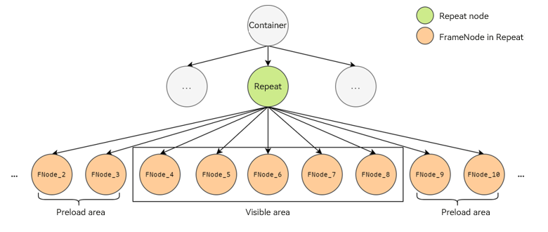
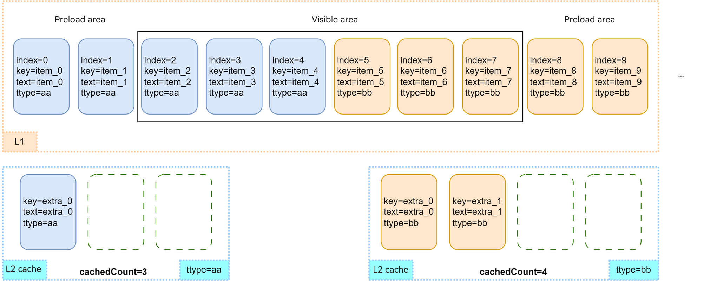
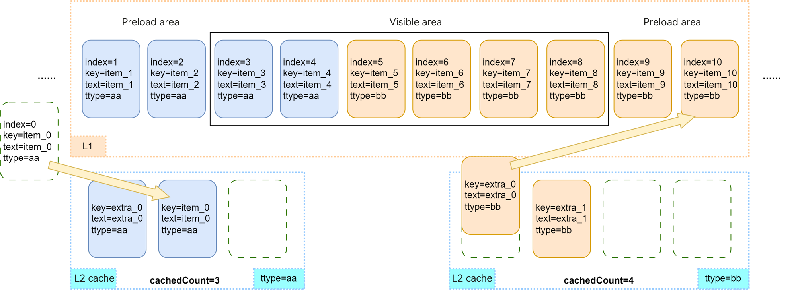
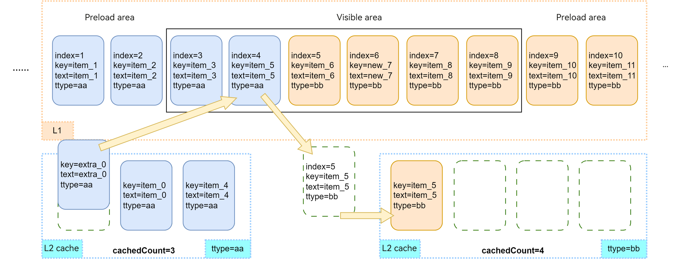
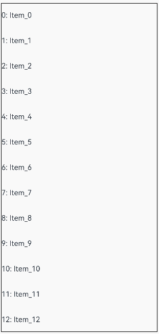
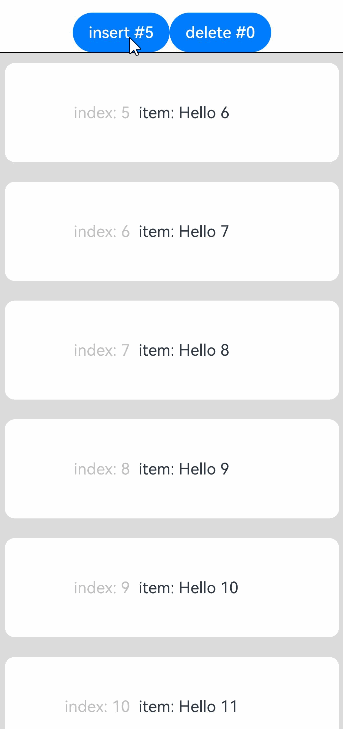
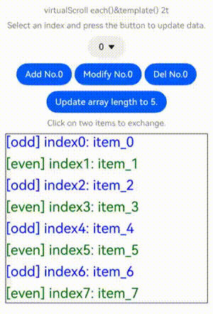
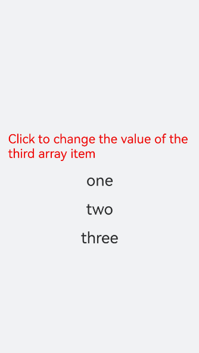
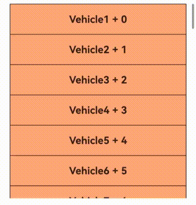
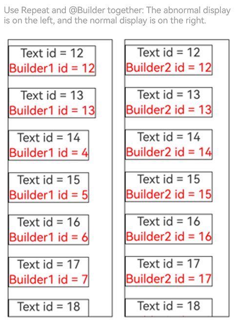

# Repeat: Reusing Components for Repeated Content Rendering

> **NOTE**
> 
> **Repeat** is supported since API version 12.
> 
> This topic serves as a development guide. For details about the component API specifications, see [Repeat](../../reference/apis-arkui/arkui-ts/ts-rendering-control-repeat.md).

## Overview

**Repeat** performs iterative rendering based on array data and is typically used together with container components.

**Repeat** loads child components based on the parent container's effective loading range (visible area + preload area). When scrolling occurs or the array data changes, **Repeat** dynamically recalculates the loading range based on the container's layout process, while managing the creation and destruction of child component nodes. By efficiently updating or reusing component nodes, **Repeat** improves rendering performance. For details, see [Node Update and Reuse Mechanism](#node-update-and-reuse-mechanism).

> **NOTE**
> 
> Differences between **Repeat** and [LazyForEach](./arkts-rendering-control-lazyforeach.md):
> - **Repeat** directly listens for state variable changes, whereas **LazyForEach** requires developers to implement the [IDataSource](../../reference/apis-arkui/arkui-ts/ts-rendering-control-lazyforeach.md#idatasource) API and manually manage changes to the content and indexes of child components.
> - **Repeat** enhances node reuse, improving rendering performance for long list scrolling and data updates.
> - **Repeat** supports rendering templates, enabling rendering of different child components within the same array based on custom template types.

## Constraints

- **Repeat** must be used within the following scrollable container components: [List](../../reference/apis-arkui/arkui-ts/ts-container-list.md), [Grid](../../reference/apis-arkui/arkui-ts/ts-container-grid.md), [Swiper](../../reference/apis-arkui/arkui-ts/ts-container-swiper.md), [WaterFlow](../../reference/apis-arkui/arkui-ts/ts-container-waterflow.md).
<br>Each iteration can only create one child component, which must be compatible with its parent container. For example, when **Repeat** is used with the [List](../../reference/apis-arkui/arkui-ts/ts-container-list.md) component, the child component must be [ListItem](../../reference/apis-arkui/arkui-ts/ts-container-listitem.md).
- **Repeat** does not support V1 decorators. Using it with V1 decorators can cause rendering issues.
- Currently, **Repeat** does not support animations.
- A scrollable container component can contain only one **Repeat**. For example, in a **List** component, using **ListItem**, **ForEach**, and **LazyForEach** together, or using multiple **Repeat** instances, is not recommended.
- When **Repeat** is used together with a custom component or [@Builder](./arkts-builder.md) function, the parameter of the **RepeatItem** type must be passed as a whole to the component for data changes to be detected. For details, see [Using Repeat with @Builder](#using-repeat-with-builder).

> **NOTE**
>
> The functionality of **Repeat** depends on dynamic modifications to array properties. If the array object is sealed or frozen, certain **Repeat** features may not function properly, as these operations prevent property extensions or lock existing property configurations.
>
> Common scenarios that may trigger this issue:<br>1. Observable data conversion: When a regular array (such as [collections.Array](../../reference/apis-arkts/js-apis-arkts-collections.md#collectionsarray)) is converted into observable data using [makeObserved](../../reference/apis-arkui/js-apis-StateManagement.md#makeobserved), some implementations may automatically seal the array.<br>2. Intentional object protection: explicit calls to **Object.seal()** or **Object.freeze()** to prevent array modifications.

## How It Works

Child components of **Repeat** are defined using **.each()** and .**template()** properties, with only one child component allowed per instance. During initial page rendering, **Repeat** creates child components on demand based on the current effective loading range (visible area + preload area), as illustrated below.



**.each()** applies to the scenario where only one type of child component needs to be rendered in an iteration. The following example demonstrates basic usage of **Repeat**:

```ts
// Use Repeat in a List container component.
@Entry
@ComponentV2 // The V2 decorator is recommended.
struct RepeatExample {
  @Local dataArr: Array<string> = []; // Data source.

  aboutToAppear(): void {
    for (let i = 0; i < 50; i++) {
      this.dataArr.push(`data_${i}`); // Add data to the array.
    }
  }

  build() {
    Column() {
      List() {
        Repeat<string>(this.dataArr)
          .each((ri: RepeatItem<string>) => {
            ListItem() {
              Text('each_' + ri.item).fontSize(30)
            }
          })
          .virtualScroll({ totalCount: this.dataArr.length }) // Enable lazy loading. totalCount indicates the data length to be loaded.
      }
      .cachedCount(2) // Size of the preload area.
      .height('70%')
      .border({ width: 1 }) // Border.
    }
  }
}
```

After execution, the UI is displayed as shown below.


**Repeat** supports rendering templates, enabling multiple types of child components to be rendered from a single data source. Each data item obtains its template type through the **.templateId()** API, and the corresponding **.template()** API is used to render the appropriate child component.

- If **.templateId()** is not provided, the default type, which is an empty string, is used.
- If multiple **.template()** APIs share the same type, the last defined one takes effect, overriding the previous ones.
- If no matching template type is found, the child component in **.template()** whose type is an empty string is rendered first. If no such **.template()** is available, the child component in **.each()** is rendered.
- Only nodes with the same template type can be reused.

The following example demonstrates how to use **Repeat** with multiple rendering templates.

```ts
// Use Repeat in a List container component.
@Entry
@ComponentV2 // The V2 decorator is recommended.
struct RepeatExampleWithTemplates {
  @Local dataArr: Array<string> = []; // Data source.

  aboutToAppear(): void {
    for (let i = 0; i < 50; i++) {
      this.dataArr.push(`data_${i}`); // Add data to the array.
    }
  }

  build() {
    Column() {
      List() {
        Repeat<string>(this.dataArr)
          .each((ri: RepeatItem<string>) => { // Default rendering template.
            ListItem() {
              Text('each_' + ri.item).fontSize(30).fontColor('rgb(161,10,33)') // The font color is red.
            }
          })
          .key((item: string, index: number): string => JSON.stringify(item)) // Key generator.
          .virtualScroll({ totalCount: this.dataArr.length }) // Enable lazy loading. totalCount indicates the data length to be loaded.
          .templateId((item: string, index: number): string => { // Search for the corresponding template child component for rendering based on the return value.
            return index <= 4 ? 'A' : (index <= 10 ? 'B' : ''); // The first five nodes use template A, the next five nodes use template B, and the others use the default template.
          })
          .template('A', (ri: RepeatItem<string>) => { // Template A.
            ListItem() {
              Text('A_' + ri.item).fontSize(30).fontColor('rgb(23,169,141)') // The font color is green.
            }
          }, { cachedCount: 3 }) // Cache capacity of template A: 3 instances.
          .template('B', (ri: RepeatItem<string>) => { // Template B.
            ListItem() {
              Text('B_' + ri.item).fontSize(30).fontColor('rgb(39,135,217)') // The font color is blue.
            }
          }, { cachedCount: 4 }) // Cache capacity of template B: 4 instances.
      }
      .cachedCount(2) // Size of the preload area.
      .height('70%')
      .border({ width: 1 }) // Border.
    }
  }
}
```

After execution, the UI is displayed as shown below.


## Node Update and Reuse Mechanism

> **NOTE**
> 
> **Repeat** handles child components through four operations: creation, update, reuse, and destruction. The difference between node update and node reuse is as follows:
> 
> - Node update: The node is not destroyed, and its properties are updated based on changes to state variables.
> - Node reuse: The old node is not destroyed but moved to the idle node cache pool. When a new node is needed, **Repeat** obtains a reusable node from the cache pool and updates its properties accordingly.

When scrolling occurs or the array data changes, **Repeat** moves child nodes that fall outside the effective loading range to the cache pool. These nodes are disconnected from the page component tree but not destroyed. When new components are needed, nodes from the cache pool are reused.

By default, node reuse is enabled for **Repeat**. Since API version 18, you can configure the **reusable** field to specify whether to enable node reuse. For better rendering performance, you are advised to keep node reuse enabled. For a code example, see [VirtualScrollOptions](../../reference/apis-arkui/arkui-ts/ts-rendering-control-repeat.md#virtualscrolloptions).

Since API version 18, **Repeat** supports L2 caching of frozen custom components. For details, see [Freezing Custom Components in a Buffer Pool](./arkts-custom-components-freezeV2.md#repeat).

The following illustrates the rendering logic of child components under typical [scroll](#scrolling-scenario) and [data update](#data-update-scenario) scenarios. In the figure below, the L1 cache represents the effective loading area managed by **Repeat**, and the L2 cache refers to the idle node cache pool for each rendering template.

For this example, we define an array with 20 items. The first 5 items use template type **'aa'**, while the remaining items use template type **'bb'**. The cache pool capacity is set to 3 nodes for template **'aa'** and 4 nodes for template **'bb'**. The size of the preload area of the container component is 2. For demonstration purposes, one idle node is added to the **aa** cache pool, and two in the **bb** cache pool.

The following figure shows the list node status after initial rendering.



### Scrolling Scenario

When the user swipes the screen to the right by the distance of one node, **Repeat** starts to reuse nodes from the cache pool. The node whose index is 10 enters the effective loading area, and its template type is identified as **bb**. Because the **bb** cache pool is not empty, **Repeat** obtains an idle node from this pool for reuse and updates the node's properties. The child component's descendant components involving data items and indexes are updated synchronously based on V2 state management rules. Other nodes within the effective loading area only require index updates.

The node whose index is 0 moves out of the effective loading area. When the UI main thread is idle, the system checks whether the **aa** cache pool is full. If it is not full, the system adds the node to the corresponding cache pool; otherwise, **Repeat** destroys redundant nodes.



### Data Update Scenario

Perform the following array update operations based on the previous section: Delete the node whose index is 4 and change **item_7** to **new_7**.

After the node whose index is 4 is deleted, it is invalidated and added to the **aa** cache pool. The subsequent nodes move leftwards, with the newly entering **item_11** node reusing an idle node in the **bb** cache pool, while other nodes only receive index updates.  


Then, as the **item_5** node moves leftwards and its index is updated to 4, its template type changes to **aa** according to calculation rules. This requires reusing an idle node from the **aa** cache pool and adding the old node back to the **bb** cache pool.  



## Key Generation

The **.key()** property of **Repeat** generates a unique key for each child component. These keys enable **Repeat** to identify added and removed data items and track positional changes (index movements) within the array.

> **NOTE**
>
> Differences between a key and an index: A key is a unique data identifier, which can be used to determine whether a data item has changed, while an index simply indicates a data item's position in the array.

If **.key()** is not specified, **Repeat** auto-generates random keys. If a duplicate key is found, **Repeat** recursively generates a new key based on the existing one until no duplicate key exists.

When using **.key()**, pay attention to the following:

- Even if the array changes, you must ensure that keys remain unique across all items in the array.
- The **.key()** function must return a consistent key for the same data item across all executions.
- While technically allowed, using **index** in **.key()** is discouraged. Indexes change when items are added, removed, or rearranged, causing keys to shift and forcing **Repeat** to re-create components, which degrades performance.
- (Recommended) Convert simple-type arrays into class object arrays with a **readonly id** property initialized using a unique value.

## Precise Lazy Loading

When the total length of the data source is long or loading data items takes time, you can use the precise lazy loading feature of **Repeat** to avoid loading all data during initialization.

You can set the **totalCount** property of **.virtualScroll()** or the custom **onTotalCount** method to calculate the expected length of the data source, and set the **onLazyLoading** property to implement precise lazy loading of data. This way, the corresponding data is loaded when the node is rendered for the first time. For details, see [VirtualScrollOptions](../../reference/apis-arkui/arkui-ts/ts-rendering-control-repeat.md#virtualscrolloptions).

**Example 1**

This example demonstrates how to dynamically load data in the corresponding area during the initial rendering, screen scrolling, and display area navigation for scenarios where the total length of the data source is long.

```ts
@Entry
@ComponentV2
struct RepeatLazyLoading {
  // Assume that the total length of the data source is 1000. The initial array does not provide data.
  @Local arr: Array<string> = [];
  scroller: Scroller = new Scroller();
  build() {
    Column({ space: 5 }) {
      // The initial item displayed on the screen is at index 100. Data can be automatically obtained through lazy loading.
      List({ scroller: this.scroller, space: 5, initialIndex: 100 }) {
        Repeat(this.arr)
          .virtualScroll({
            // The expected total length of the data source is 1000.
            onTotalCount: () => { return 1000; },
            // Implement lazy loading.
            onLazyLoading: (index: number) => { this.arr[index] = index.toString(); }
          })
          .each((obj: RepeatItem<string>) => {
            ListItem() {
              Row({ space: 5 }) {
                Text(`${obj.index}: Item_${obj.item}`)
              }
            }
            .height(50)
          })
      }
      .height('80%')
      .border({ width: 1})
      // Navigate to the position at index 500. Data can be automatically obtained through lazy loading.
      Button('ScrollToIndex 500')
        .onClick(() => { this.scroller.scrollToIndex(500); })
    }
  }
}
```

The figure below shows the effect.


**Example 2**

This example deals with time-consuming data loading. In the **onLazyLoading** method, placeholders are created for data items, and then data is loaded through asynchronous tasks.

```ts
@Entry
@ComponentV2
struct RepeatLazyLoading {
  @Local arr: Array<string> = [];
  build() {
    Column({ space: 5 }) {
      List({ space: 5 }) {
        Repeat(this.arr)
          .virtualScroll({
            onTotalCount: () => { return 100; },
            // Implement lazy loading.
            onLazyLoading: (index: number) => {
              // Create a placeholder.
              this.arr[index] = '';
              // Simulate a time-consuming loading process and load data through an asynchronous task.
              setTimeout(() => { this.arr[index] = index.toString(); }, 1000);
            }
          })
          .each((obj: RepeatItem<string>) => {
            ListItem() {
              Row({ space: 5 }) {
                Text(`${obj.index}: Item_${obj.item}`)
              }
            }
            .height(50)
          })
      }
      .height('100%')
      .border({ width: 1})
    }
  }
}
```

The figure below shows the effect.


**Example 3**

This example shows how to implement infinite lazy loading of data by using lazy loading together with **onTotalCount: () => { return this.arr.length + 1; }**.

> **NOTE**
>
> - In this scenario, you need to provide the initial data required for the first screen display and set **cachedCount** to a value greater than 0 for the parent container component. Otherwise, rendering exceptions will occur.
> - Avoid using the **onLazyLoading** method together with the loop mode of **Swipe**. Otherwise, staying at **index = 0** will trigger continuous **onLazyLoading** calls.
> - Pay special attention to the memory usage to avoid excessive memory consumption caused by continuous data loading.

```ts
@Entry
@ComponentV2
struct RepeatLazyLoading {
  @Local arr: Array<string> = [];
  // Provide the initial data required for the first screen display.
  aboutToAppear(): void {
    for (let i = 0; i < 15; i++) {
      this.arr.push(i.toString());
    }
  }
  build() {
    Column({ space: 5 }) {
      List({ space: 5 }) {
        Repeat(this.arr)
          .virtualScroll({
            // Enable infinite lazy loading of data.
            onTotalCount: () => { return this.arr.length + 1; },
            onLazyLoading: (index: number) => { this.arr[index] = index.toString(); }
          })
          .each((obj: RepeatItem<string>) => {
            ListItem() {
              Row({ space: 5 }) {
                Text(`${obj.index}: Item_${obj.item}`)
              }
            }
            .height(50)
          })
      }
      .height('100%')
      .border({ width: 1})
      // You are advised to set cachedCount to a value greater than 0.
      .cachedCount(1)
    }
  }
}
```

The figure below shows the effect.




## Drag-and-Drop Sorting

By using **Repeat** within a **List** component and setting up the [onMove](../../reference/apis-arkui/arkui-ts/ts-universal-attributes-drag-sorting.md#onmove) event, you can implement drag-and-drop sorting. The drag-and-drop sorting feature is supported since API version 19.

> **NOTE**
>
> - When the drag-and-drop gesture is released, if any item's position changes, the **onMove** event is triggered, which reports the original index and target index of the relocated item.<br>In the **onMove** event, the data source must be updated based on the reported start index and target index. Before and after the data source is modified, the key value of each item must remain unchanged to ensure that the drop animation can be executed properly.
> - Modify data source only after the drag-and-drop operation is completed.

**Example**

```ts
@Entry
@ComponentV2
struct RepeatVirtualScrollOnMove {
  @Local simpleList: Array<string> = [];

  aboutToAppear(): void {
    for (let i = 0; i < 100; i++) {
      this.simpleList.push(`${i}`);
    }
  }

  build() {
    Column() {
      List() {
        Repeat<string>(this.simpleList)
          // Set onMove to enable drag-and-drop sorting.
          .onMove((from: number, to: number) => {
            let temp = this.simpleList.splice(from, 1);
            this.simpleList.splice(to, 0, temp[0]);
          })
          .each((obj: RepeatItem<string>) => {
            ListItem() {
              Text(obj.item)
                .fontSize(16)
                .textAlign(TextAlign.Center)
                .size({height: 100, width: "100%"})
            }.margin(10)
            .borderRadius(10)
            .backgroundColor("#FFFFFFFF")
          })
          .key((item: string, index: number) => {
            return item;
          })
          .virtualScroll({ totalCount: this.simpleList.length })
      }
      .border({ width: 1 })
      .backgroundColor("#FFDCDCDC")
      .width('100%')
      .height('100%')
    }
  }
}
```

The figure below shows the effect.


## Content Position Preservation

The content position preservation feature, introduced in API version 20, maintains visible component positions when data is inserted or deleted before the current viewport area.

For this feature to work, the parent container must be a **List** component and the [maintainVisibleContentPosition](../../reference/apis-arkui/arkui-ts/ts-container-list.md#maintainvisiblecontentposition12) attribute must be set to **true**.

**Example**

```ts
@Entry
@ComponentV2
struct PreInsertDemo {
  @Local simpleList: Array<string> = [];
  private cnt: number = 1;

  aboutToAppear(): void {
    for (let i = 0; i < 30; i++) {
      this.simpleList.push(`Hello ${this.cnt++}`);
    }
  }

  build() {
    Column() {
      Row() {
        Button(`insert #5`)
          .onClick(() => {
            this.simpleList.splice(5, 0, `Hello ${this.cnt++}`);
          })
        Button(`delete #0`)
          .onClick(() => {
            this.simpleList.splice(0, 1);
          })
      }

      List({ initialIndex: 5 }) {
        Repeat<string>(this.simpleList)
          .each((obj: RepeatItem<string>) => {
            ListItem() {
              Row() {
                Text(`index: ${obj.index}  `)
                  .fontSize(16)
                  .fontColor("#70707070")
                  .textAlign(TextAlign.End)
                  .size({ height: 100, width: "40%" })
                Text(`item: ${obj.item}`)
                  .fontSize(16)
                  .textAlign(TextAlign.Start)
                  .size({ height: 100, width: "60%" })
              }
            }.margin(10)
            .borderRadius(10)
            .backgroundColor("#FFFFFFFF")
          })
          .key((item: string, index: number) => item)
          .virtualScroll({ totalCount: this.simpleList.length })
      }
      .maintainVisibleContentPosition(true) // Enable content position preservation.
      .border({ width: 1 })
      .backgroundColor("#FFDCDCDC")
      .width('100%')
      .height('100%')
    }
  }
}
```

In the example, insertions or deletions above the viewport cause only index updates, while displayed items remain visually stable.

The figure below shows the effect.



## Use Cases

### Data Display and Operations

The following sample code shows how to insert, modify, delete, and swap data items in an array using **Repeat**. Select an index from the drop-down list box and click the corresponding button to operate the data item. Click two data items in sequence to swap them.

```ts
@ObservedV2
class Repeat006Clazz {
  @Trace message: string = '';

  constructor(message: string) {
    this.message = message;
  }
}

@Entry
@ComponentV2
struct RepeatVirtualScroll2T {
  @Local simpleList: Array<Repeat006Clazz> = [];
  private exchange: number[] = [];
  private counter: number = 0;
  @Local selectOptions: SelectOption[] = [];
  @Local selectIdx: number = 0;

  @Monitor("simpleList")
  reloadSelectOptions(): void {
    this.selectOptions = [];
    for (let i = 0; i < this.simpleList.length; ++i) {
      this.selectOptions.push({ value: i.toString() });
    }
    if (this.selectIdx >= this.simpleList.length) {
      this.selectIdx = this.simpleList.length - 1;
    }
  }

  aboutToAppear(): void {
    for (let i = 0; i < 100; i++) {
      this.simpleList.push(new Repeat006Clazz(`item_${i}`));
    }
    this.reloadSelectOptions();
  }

  handleExchange(idx: number): void { // Click to swap child components.
    this.exchange.push(idx);
    if (this.exchange.length === 2) {
      let _a = this.exchange[0];
      let _b = this.exchange[1];
      let temp: Repeat006Clazz = this.simpleList[_a];
      this.simpleList[_a] = this.simpleList[_b];
      this.simpleList[_b] = temp;
      this.exchange = [];
    }
  }

  build() {
    Column({ space: 10 }) {
      Text('virtualScroll each()&template() 2t')
        .fontSize(15)
        .fontColor(Color.Gray)
      Text('Select an index and press the button to update data.')
        .fontSize(15)
        .fontColor(Color.Gray)

      Select(this.selectOptions)
        .selected(this.selectIdx)
        .value(this.selectIdx.toString())
        .key('selectIdx')
        .onSelect((index: number) => {
          this.selectIdx = index;
        })
      Row({ space: 5 }) {
        Button('Add No.' + this.selectIdx)
          .onClick(() => {
            this.simpleList.splice(this.selectIdx, 0, new Repeat006Clazz(`${this.counter++}_add_item`));
            this.reloadSelectOptions();
          })
        Button('Modify No.' + this.selectIdx)
          .onClick(() => {
            this.simpleList.splice(this.selectIdx, 1, new Repeat006Clazz(`${this.counter++}_modify_item`));
          })
        Button('Del No.' + this.selectIdx)
          .onClick(() => {
            this.simpleList.splice(this.selectIdx, 1);
            this.reloadSelectOptions();
          })
      }
      Button('Update array length to 5.')
        .onClick(() => {
          this.simpleList = this.simpleList.slice(0, 5);
          this.reloadSelectOptions();
        })

      Text('Click on two items to exchange.')
        .fontSize(15)
        .fontColor(Color.Gray)

      List({ space: 10 }) {
        Repeat<Repeat006Clazz>(this.simpleList)
          .each((obj: RepeatItem<Repeat006Clazz>) => {
            ListItem() {
              Text(`[each] index${obj.index}: ${obj.item.message}`)
                .fontSize(25)
                .onClick(() => {
                  this.handleExchange(obj.index);
                })
            }
          })
          .key((item: Repeat006Clazz, index: number) => {
            return item.message;
          })
          .virtualScroll({ totalCount: this.simpleList.length })
          .templateId((item: Repeat006Clazz, index: number) => {
            return (index % 2 === 0) ? 'odd' : 'even';
          })
          .template('odd', (ri) => {
            Text(`[odd] index${ri.index}: ${ri.item.message}`)
              .fontSize(25)
              .fontColor(Color.Blue)
              .onClick(() => {
                this.handleExchange(ri.index);
              })
          }, { cachedCount: 3 })
          .template('even', (ri) => {
            Text(`[even] index${ri.index}: ${ri.item.message}`)
              .fontSize(25)
              .fontColor(Color.Green)
              .onClick(() => {
                this.handleExchange(ri.index);
              })
          }, { cachedCount: 1 })
      }
      .cachedCount(2)
      .border({ width: 1 })
      .width('95%')
      .height('40%')
    }
    .justifyContent(FlexAlign.Center)
    .width('100%')
    .height('100%')
  }
}
```

This example demonstrates the implementation of 100 items using a custom class **RepeatClazz** with a string property **message**. The **cachedCount** attribute of the **List** component is set to **2**, and the sizes of the idle node cache pools for the **'odd'** and **'even'** templates are set to **3** and **1**, respectively. After execution, the UI is displayed as shown below.



### Repeat Nesting

**Repeat** supports nesting. The sample code is as follows:

```ts
// Repeat can be nested in other components.
@Entry
@ComponentV2
struct RepeatNest {
  @Local outerList: string[] = [];
  @Local innerList: number[] = [];

  aboutToAppear(): void {
    for (let i = 0; i < 20; i++) {
      this.outerList.push(i.toString());
      this.innerList.push(i);
    }
  }

  build() {
    Column({ space: 20 }) {
      Text('Nested Repeat with virtualScroll')
        .fontSize(15)
        .fontColor(Color.Gray)
      List() {
        Repeat<string>(this.outerList)
          .each((obj) => {
            ListItem() {
              Column() {
                Text('outerList item: ' + obj.item)
                  .fontSize(30)
                List() {
                  Repeat<number>(this.innerList)
                    .each((subObj) => {
                      ListItem() {
                        Text('innerList item: ' + subObj.item)
                          .fontSize(20)
                      }
                    })
                    .key((item) => "innerList_" + item)
                    .virtualScroll()
                }
                .width('80%')
                .border({ width: 1 })
                .backgroundColor(Color.Orange)
              }
              .height('30%')
              .backgroundColor(Color.Pink)
            }
            .border({ width: 1 })
          })
          .key((item) => "outerList_" + item)
          .virtualScroll()
      }
      .width('80%')
      .border({ width: 1 })
    }
    .justifyContent(FlexAlign.Center)
    .width('90%')
    .height('80%')
  }
}
```

The figure below shows the effect.


### Integration with Parent Container Components

This section provides examples of using **Repeat** within scrollable container components.

#### Using with a List Component

This example demonstrates how to use **Repeat** in the **List** component.

```ts
class DemoListItemInfo {
  name: string;
  icon: Resource;

  constructor(name: string, icon: Resource) {
    this.name = name;
    this.icon = icon;
  }
}

@Entry
@ComponentV2
struct DemoList {
  @Local videoList: Array<DemoListItemInfo> = [];

  aboutToAppear(): void {
    for (let i = 0; i < 10; i++) {
      // app.media.listItem0, app.media.listItem1, and app.media.listItem2 are only examples. Replace them with the actual ones in use.
      this.videoList.push(new DemoListItemInfo('Video' + i,
        i % 3 == 0 ? $r("app.media.listItem0") :
        i % 3 == 1 ? $r("app.media.listItem1") : $r("app.media.listItem2")));
    }
  }

  @Builder
  itemEnd(index: number) {
    Button('Delete')
      .backgroundColor(Color.Red)
      .onClick(() => {
        this.videoList.splice(index, 1);
      })
  }

  build() {
    Column({ space: 10 }) {
      Text('List Contains the Repeat Component')
        .fontSize(15)
        .fontColor(Color.Gray)

      List({ space: 5 }) {
        Repeat<DemoListItemInfo>(this.videoList)
          .each((obj: RepeatItem<DemoListItemInfo>) => {
            ListItem() {
              Column() {
                Image(obj.item.icon)
                  .width('80%')
                  .margin(10)
                Text(obj.item.name)
                  .fontSize(20)
              }
            }
            .swipeAction({
              end: {
                builder: () => {
                  this.itemEnd(obj.index);
                }
              }
            })
            .onAppear(() => {
              console.info('AceTag', obj.item.name);
            })
          })
          .key((item: DemoListItemInfo) => item.name)
          .virtualScroll()
      }
      .cachedCount(2)
      .height('90%')
      .border({ width: 1 })
      .listDirection(Axis.Vertical)
      .alignListItem(ListItemAlign.Center)
      .divider({
        strokeWidth: 1,
        startMargin: 60,
        endMargin: 60,
        color: '#ffe9f0f0'
      })

      Row({ space: 10 }) {
        Button('Delete No.1')
          .onClick(() => {
            this.videoList.splice(0, 1);
          })
        Button('Delete No.5')
          .onClick(() => {
            this.videoList.splice(4, 1);
          })
      }
    }
    .width('100%')
    .height('100%')
    .justifyContent(FlexAlign.Center)
  }
}
```

Swipe left and touch the **Delete** button, or touch the button at the bottom to delete the video widget.


#### Using with a Grid Component

This example demonstrates how to use **Repeat** in the **Grid** component.

```ts
class DemoGridItemInfo {
  name: string;
  icon: Resource;

  constructor(name: string, icon: Resource) {
    this.name = name;
    this.icon = icon;
  }
}

@Entry
@ComponentV2
struct DemoGrid {
  @Local itemList: Array<DemoGridItemInfo> = [];
  @Local isRefreshing: boolean = false;
  private layoutOptions: GridLayoutOptions = {
    regularSize: [1, 1],
    irregularIndexes: [10]
  }
  private GridScroller: Scroller = new Scroller();
  private num: number = 0;

  aboutToAppear(): void {
    for (let i = 0; i < 10; i++) {
      // app.media.gridItem0, app.media.gridItem1, and app.media.gridItem2 are only examples. Replace them with the actual ones in use.
      this.itemList.push(new DemoGridItemInfo('Video' + i,
        i % 3 == 0 ? $r("app.media.gridItem0") :
        i % 3 == 1 ? $r("app.media.gridItem1") : $r("app.media.gridItem2")));
    }
  }

  build() {
    Column({ space: 10 }) {
      Text('Grid Contains the Repeat Component')
        .fontSize(15)
        .fontColor(Color.Gray)

      Refresh({ refreshing: $$this.isRefreshing }) {
        Grid(this.GridScroller, this.layoutOptions) {
          Repeat<DemoGridItemInfo>(this.itemList)
            .each((obj: RepeatItem<DemoGridItemInfo>) => {
              if (obj.index === 10 ) {
                GridItem() {
                  Text('Last viewed here. Touch to refresh.')
                    .fontSize(20)
                }
                .height(30)
                .border({ width: 1 })
                .onClick(() => {
                  this.GridScroller.scrollToIndex(0);
                  this.isRefreshing = true;
                })
                .onAppear(() => {
                  console.info('AceTag', obj.item.name);
                })
              } else {
                GridItem() {
                  Column() {
                    Image(obj.item.icon)
                      .width('100%')
                      .height(80)
                      .objectFit(ImageFit.Cover)
                      .borderRadius({ topLeft: 16, topRight: 16 })
                    Text(obj.item.name)
                      .fontSize(15)
                      .height(20)
                  }
                }
                .height(100)
                .borderRadius(16)
                .backgroundColor(Color.White)
                .onAppear(() => {
                  console.info('AceTag', obj.item.name);
                })
              }
            })
            .key((item: DemoGridItemInfo) => item.name)
            .virtualScroll()
        }
        .columnsTemplate('repeat(auto-fit, 150)')
        .cachedCount(4)
        .rowsGap(15)
        .columnsGap(10)
        .height('100%')
        .padding(10)
        .backgroundColor('#F1F3F5')
      }
      .onRefreshing(() => {
        setTimeout(() => {
          this.itemList.splice(10, 1);
          this.itemList.unshift(new DemoGridItemInfo('refresh', $r('app.media.gridItem0'))); // app.media.gridItem0 is only an example. Replace it with the actual one.
          for (let i = 0; i < 10; i++) {
            // app.media.gridItem0, app.media.gridItem1, and app.media.gridItem2 are only examples. Replace them with the actual ones in use.
            this.itemList.unshift(new DemoGridItemInfo('New video ' + this.num,
              i % 3 == 0 ? $r("app.media.gridItem0") :
              i % 3 == 1 ? $r("app.media.gridItem1") : $r("app.media.gridItem2")));
            this.num++;
          }
          this.isRefreshing = false;
        }, 1000);
        console.info('AceTag', 'onRefreshing');
      })
      .refreshOffset(64)
      .pullToRefresh(true)
      .width('100%')
      .height('85%')

      Button('Refresh')
        .onClick(() => {
          this.GridScroller.scrollToIndex(0);
          this.isRefreshing = true;
        })
    }
    .width('100%')
    .height('100%')
    .justifyContent(FlexAlign.Center)
  }
}
```

Swipe down on the screen, touch the **Refresh** button, or touch **Last viewed here. Touch to refresh.** to load new videos.


#### Using with a Swiper Component

This example demonstrates how to use **Repeat** in the **Swiper** component.

```ts
const remotePictures: Array<string> = [
  'https://www.example.com/xxx/0001.jpg', // Set the specific network image address.
  'https://www.example.com/xxx/0002.jpg',
  'https://www.example.com/xxx/0003.jpg',
  'https://www.example.com/xxx/0004.jpg',
  'https://www.example.com/xxx/0005.jpg',
  'https://www.example.com/xxx/0006.jpg',
  'https://www.example.com/xxx/0007.jpg',
  'https://www.example.com/xxx/0008.jpg',
  'https://www.example.com/xxx/0009.jpg'
];

@ObservedV2
class DemoSwiperItemInfo {
  id: string;
  @Trace url: string = 'default';

  constructor(id: string) {
    this.id = id;
  }
}

@Entry
@ComponentV2
struct DemoSwiper {
  @Local pics: Array<DemoSwiperItemInfo> = [];

  aboutToAppear(): void {
    for (let i = 0; i < 9; i++) {
      this.pics.push(new DemoSwiperItemInfo('pic' + i));
    }
    setTimeout(() => {
      this.pics[0].url = remotePictures[0];
    }, 1000);
  }

  build() {
    Column() {
      Text('Swiper Contains the Repeat Component')
        .fontSize(15)
        .fontColor(Color.Gray)

      Stack() {
        Text('Loading...')
          .fontSize(15)
          .fontColor(Color.Gray)
        Swiper() {
          Repeat(this.pics)
            .each((obj: RepeatItem<DemoSwiperItemInfo>) => {
              Image(obj.item.url)
                .onAppear(() => {
                  console.info('AceTag', obj.item.id);
                })
            })
            .key((item: DemoSwiperItemInfo) => item.id)
            .virtualScroll()
        }
        .cachedCount(9)
        .height('50%')
        .loop(false)
        .indicator(true)
        .onChange((index) => {
          setTimeout(() => {
            this.pics[index].url = remotePictures[index];
          }, 1000);
        })
      }
      .width('100%')
      .height('100%')
      .backgroundColor(Color.Black)
    }
  }
}
```

Here network latency is simulated with a 1-second delay for image loading.


## Lazy Loading Disablement

For scenarios involving short lists or requiring immediate loading of all components, you can disable lazy loading in **Repeat** by omitting its **.virtualScroll()** property. In this case, **Repeat** renders all child components during initial page loading. For long lists (typically with more than 30 items), disabling lazy loading will cause **Repeat** to load all child components at once, which is time-consuming and not recommended.

> **NOTE**
>
> - The rendering template feature is unavailable when lazy loading is disabled.
> - With lazy loading disabled, **Repeat** can be used in any container component.
> - This feature is compatible with V1 decorators.
> - With lazy loading disabled, UI updates are dependent on key value changes: If keys remain identical, the UI will not update even when underlying data changes. For details, see [Node Update Mechanism](#node-update-mechanism).

### Node Update Mechanism

When lazy loading is disabled, **Repeat** handles array changes as follows:<br>On initial renders, all child components are created. When the data array changes, **Repeat** executes the following steps:

First, **Repeat** traverses old array keys. If it identifies keys absent in the new array, it adds them to the **deletedKeys** collection.

Second, **Repeat** traverses new array keys. For each key in the new array:

1. If a match can be found in the old array, the corresponding child component node is reused, with its index updated.
2. If no matches can be found in the old array and the **deletedKeys** collection is not empty, **Repeat** reuses the most recently deleted node according to the last in first out (LIFO) policy and updates its key and content.
3. If no matches can be found in the old array and the **deletedKeys** collection is empty, **Repeat** creates a new node for the key.

Third, after the new array keys are traversed, nodes corresponding to the remaining keys in the **deletedKeys** collection are destroyed.


In the example of array changes shown below, item_*X* represents the key of a data item.


Based on the aforementioned update logic, **item_0** remains unchanged, **item_1** and **item_2** only have their indexes changed, **item_n1** and **item_n2** are obtained by updating **item_4** and **item_3**, respectively, and **item_n3** is newly created because no reusable nodes are available.

> **NOTE**
> 
> Key differences between **Repeat** with lazy loading disabled and [ForEach](arkts-rendering-control-foreach.md):
> - Performance optimization: **Repeat** implements specialized rendering enhancements for array update scenarios.
> - Architectural shift: Component content and index management responsibilities are elevated to the framework level.

### Example

```ts
@Entry
@ComponentV2
struct Parent {
  @Local simpleList: Array<string> = ['one', 'two', 'three'];

  build() {
    Row() {
      Column() {
        Text('Click to change the value of the third array item')
          .fontSize(24)
          .fontColor(Color.Red)
          .onClick(() => {
            this.simpleList[2] = 'new three';
          })

        Repeat<string>(this.simpleList)
            .each((obj: RepeatItem<string>)=>{
              ChildItem({ item: obj.item })
                .margin({top: 20})
            })
            .key((item: string) => item)
      }
      .justifyContent(FlexAlign.Center)
      .width('100%')
      .height('100%')
    }
    .height('100%')
    .backgroundColor(0xF1F3F5)
  }
}

@ComponentV2
struct ChildItem {
  @Param @Require item: string;

  build() {
    Text(this.item)
      .fontSize(30)
  }
}
```



When the red text component is clicked, the third data item undergoes a content update while preserving its existing component node.

## Implementation Notes

### Maintaining the Scroll Position When Off-Screen Data Changes

In the following example, changes to off-screen data affect the scroll position of the **List** component.
When a **Repeat** component is declared within a **List** component (as shown in the code below), clicking the insert button adds an element before the first visible item, causing the list to scroll downward unexpectedly.

```ts
// Define a class and mark it as observable.
// Define a custom array in the class and mark it as traceable.
@ObservedV2
class ArrayHolder {
  @Trace arr: Array<number> = [];

  // Constructor used to initialize the array length.
  constructor(count: number) {
    for (let i = 0; i < count; i++) {
      this.arr.push(i);
    }
  }
}

@Entry
@ComponentV2
struct RepeatTemplateSingle {
  @Local arrayHolder: ArrayHolder = new ArrayHolder(100);
  @Local totalCount: number = this.arrayHolder.arr.length;
  scroller: Scroller = new Scroller();

  build() {
    Column({ space: 5 }) {
      List({ space: 20, initialIndex: 19, scroller: this.scroller }) {
        Repeat(this.arrayHolder.arr)
          .virtualScroll({ totalCount: this.totalCount })
          .templateId((item, index) => {
            return 'number';
          })
          .template('number', (r) => {
            ListItem() {
              Text(r.index! + ":" + r.item + "Reuse");
            }
          })
          .each((r) => {
            ListItem() {
              Text(r.index! + ":" + r.item + "eachMessage");
            }
          })
      }
      .height('30%')

      Button(`insert totalCount ${this.totalCount}`)
        .height(60)
        .onClick(() => {
          // Insert an element before the first visible element on screen.
          this.arrayHolder.arr.splice(18, 0, this.totalCount);
          this.totalCount = this.arrayHolder.arr.length;
        })
    }
    .width('100%')
    .margin({ top: 5 })
  }
}
```

The figure below shows the effect.


**Implementation After Correction**
To maintain the scroll position during off-screen data changes, use the [onScrollIndex](../../ui/arkts-layout-development-create-list.md#handling-scroll-position-changes) callback of the **List** component to listen for scrolling and obtain the scroll position when the list scrolls. Then, use the [scrollToIndex](../../reference/apis-arkui/arkui-ts/ts-container-scroll.md#scrolltoindex) API of **Scroller** to lock the scroll position when off-screen data is added or removed.

The following example demonstrates handling of data additions:

```ts
// The definition of ArrayHolder is the same as that in the demo code above.

@Entry
@ComponentV2
struct RepeatTemplateSingle {
  @Local arrayHolder: ArrayHolder = new ArrayHolder(100);
  @Local totalCount: number = this.arrayHolder.arr.length;
  scroller: Scroller = new Scroller();

  private start: number = 1;
  private end: number = 1;

  build() {
    Column({ space: 5 }) {
      List({ space: 20, initialIndex: 19, scroller: this.scroller }) {
        Repeat(this.arrayHolder.arr)
          .virtualScroll({ totalCount: this.totalCount })
          .templateId((item, index) => {
            return 'number';
          })
          .template('number', (r) => {
            ListItem() {
              Text(r.index! + ":" + r.item + "Reuse")
            }
          })
          .each((r) => {
            ListItem() {
              Text(r.index! + ":" + r.item + "eachMessage")
            }
          })
      }
      .onScrollIndex((start, end) => {
        this.start = start;
        this.end = end;
      })
      .height('30%')

      Button(`insert totalCount ${this.totalCount}`)
        .height(60)
        .onClick(() => {
          // Insert an element before the first visible element on screen.
          this.arrayHolder.arr.splice(18, 0, this.totalCount);
          let rect = this.scroller.getItemRect(this.start); // Obtain the size and position of the child component.
          this.scroller.scrollToIndex(this.start + 1); // Scroll to the specified index.
          this.scroller.scrollBy(0, -rect.y); // Scroll by a specified distance.
          this.totalCount = this.arrayHolder.arr.length;
        })
    }
    .width('100%')
    .margin({ top: 5 })
  }
}
```

The figure below shows the effect.


### Handling Cases Where the totalCount Value Exceeds the Data Source Length

For large datasets, lazy loading is typically used to render only a portion of the data initially. For **Repeat** to display the correct scrollbar style, **totalCount** must be set to the expected total data length, which means the **totalCount** value may be greater than the **array.length** value before all data is loaded.

If the **totalCount** value is greater than the **array.length** value, the application should request subsequent data when the list is about to reach the end of the currently loaded items. Implement safeguards for data request errors (for example, network latency) to prevent UI display anomalies.

This can be implemented using the [onScrollIndex](../../ui/arkts-layout-development-create-list.md#handling-scroll-position-changes) callback of the parent component (**List** or **Grid**). The sample code is as follows:

```ts
@ObservedV2
class VehicleData {
  @Trace name: string;
  @Trace price: number;

  constructor(name: string, price: number) {
    this.name = name;
    this.price = price;
  }
}

@ObservedV2
class VehicleDB {
  public vehicleItems: VehicleData[] = [];

  constructor() {
    // The initial size of the array is 20.
    for (let i = 1; i <= 20; i++) {
      this.vehicleItems.push(new VehicleData(`Vehicle${i}`, i));
    }
  }
}

@Entry
@ComponentV2
struct entryCompSucc {
  @Local vehicleItems: VehicleData[] = new VehicleDB().vehicleItems;
  @Local listChildrenSize: ChildrenMainSize = new ChildrenMainSize(60);
  @Local totalCount: number = this.vehicleItems.length;
  scroller: Scroller = new Scroller();

  build() {
    Column({ space: 3 }) {
      List({ scroller: this.scroller }) {
        Repeat(this.vehicleItems)
          .virtualScroll({ totalCount: 50 }) // The expected array length is 50.
          .templateId(() => 'default')
          .template('default', (ri) => {
            ListItem() {
              Column() {
                Text(`${ri.item.name} + ${ri.index}`)
                  .width('90%')
                  .height(this.listChildrenSize.childDefaultSize)
                  .backgroundColor(0xFFA07A)
                  .textAlign(TextAlign.Center)
                  .fontSize(20)
                  .fontWeight(FontWeight.Bold)
              }
            }.border({ width: 1 })
          }, { cachedCount: 5 })
          .each((ri) => {
            ListItem() {
              Text("Wrong: " + `${ri.item.name} + ${ri.index}`)
                .width('90%')
                .height(this.listChildrenSize.childDefaultSize)
                .backgroundColor(0xFFA07A)
                .textAlign(TextAlign.Center)
                .fontSize(20)
                .fontWeight(FontWeight.Bold)
            }.border({ width: 1 })
          })
          .key((item, index) => `${index}:${item}`)
      }
      .height('50%')
      .margin({ top: 20 })
      .childrenMainSize(this.listChildrenSize)
      .alignListItem(ListItemAlign.Center)
      .onScrollIndex((start, end) => {
        console.log('onScrollIndex', start, end);
        // Lazy loading
        if (this.vehicleItems.length < 50) {
          for (let i = 0; i < 10; i++) {
            if (this.vehicleItems.length < 50) {
              this.vehicleItems.push(new VehicleData("Vehicle_loaded", i));
            }
          }
        }
      })
    }
  }
}
```

The figure below shows the effect.



### Using Repeat with @Builder

When **Repeat** is used together with @Builder, the parameter of the **RepeatItem** type must be passed as a whole to the component for data changes to be detected. If only **RepeatItem.item** or **RepeatItem.index** is passed, UI rendering exceptions will occur.

The sample code is as follows:

```ts
@Entry
@ComponentV2
struct RepeatBuilderPage {
  @Local simpleList1: Array<number> = [];
  @Local simpleList2: Array<number> = [];

  aboutToAppear(): void {
    for (let i = 0; i < 100; i++) {
      this.simpleList1.push(i);
      this.simpleList2.push(i);
    }
  }

  build() {
    Column({ space: 20 }) {
      Text('Use Repeat and @Builder together: The abnormal display is on the left, and the normal display is on the right.')
        .fontSize(15)
        .fontColor(Color.Gray)

      Row({ space: 20 }) {
        List({ initialIndex: 5, space: 20 }) {
          Repeat<number>(this.simpleList1)
            .each((ri) => {})
            .virtualScroll({ totalCount: this.simpleList1.length })
            .templateId((item: number, index: number) => "default")
            .template('default', (ri) => {
              ListItem() {
                Column() {
                  Text('Text id = ' + ri.item)
                    .fontSize(20)
                  this.buildItem1 (ri.item) // Incorrect. To avoid rendering issues, change it to this.buildItem1(ri).
                }
              }
              .border({ width: 1 })
            }, { cachedCount: 3 })
        }
        .cachedCount(1)
        .border({ width: 1 })
        .width('45%')
        .height('60%')

        List({ initialIndex: 5, space: 20 }) {
          Repeat<number>(this.simpleList2)
            .each((ri) => {})
            .virtualScroll({ totalCount: this.simpleList2.length })
            .templateId((item: number, index: number) => "default")
            .template('default', (ri) => {
              ListItem() {
                Column() {
                  Text('Text id = ' + ri.item)
                    .fontSize(20)
                  this.buildItem2(ri) // Correct. The rendering is normal.
                }
              }
              .border({ width: 1 })
            }, { cachedCount: 3 })
        }
        .cachedCount(1)
        .border({ width: 1 })
        .width('45%')
        .height('60%')
      }
    }
    .height('100%')
    .justifyContent(FlexAlign.Center)
  }

  @Builder
  // The @Builder parameter must be of the RepeatItem type for proper rendering.
  buildItem1(item: number) {
    Text('Builder1 id = ' + item)
      .fontSize(20)
      .fontColor(Color.Red)
      .margin({ top: 2 })
  }

  @Builder
  buildItem2(ri: RepeatItem<number>) {
    Text('Builder2 id = ' + ri.item)
      .fontSize(20)
      .fontColor(Color.Red)
      .margin({ top: 2 })
  }
}
```

The following figure shows the display effect. Scroll down on the page to observe the difference: The left side demonstrates incorrect usage, while the right side shows the correct usage. (**Text** components are in black, while **Builder** components are in red). The preceding code shows the error-prone scenario during development, where only the value, instead the entire **RepeatItem** object, is passed in the @Builder function.


