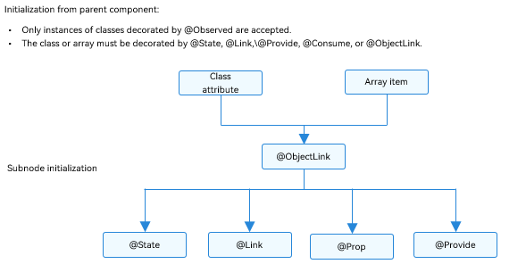
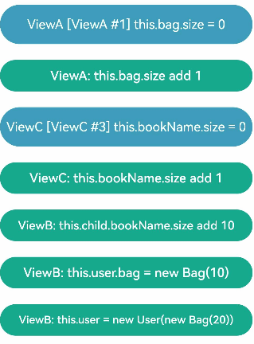
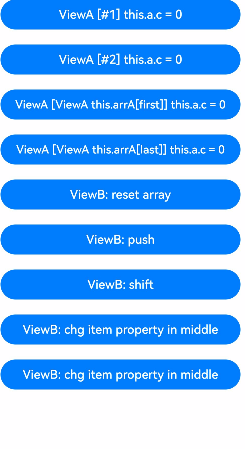
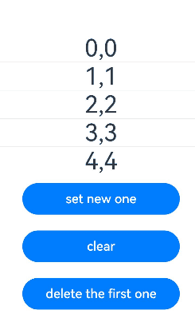
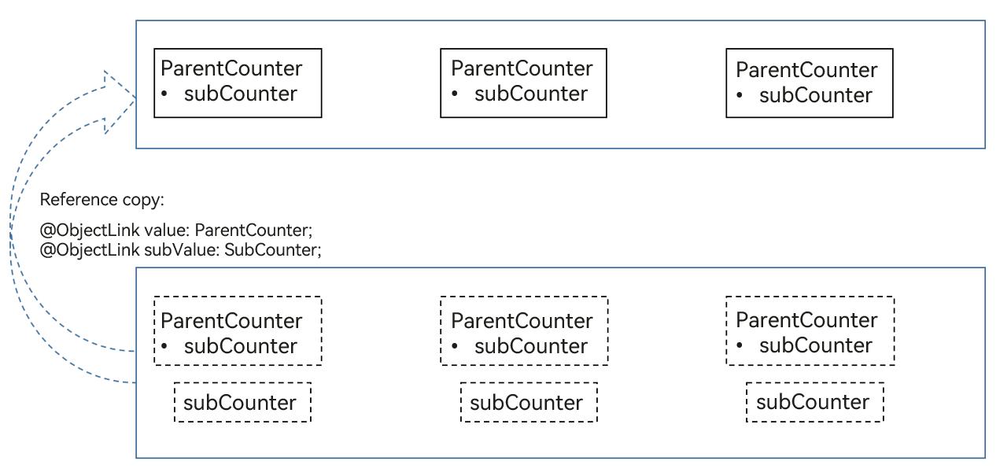
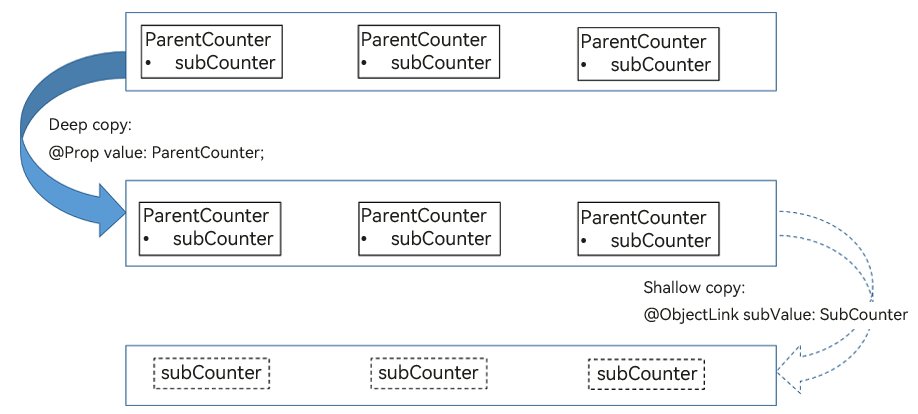

# \@Observed and \@ObjectLink Decorators: Observing Property Changes in Nested Class Objects


The decorators including [\@State](./arkts-state.md), [\@Prop](./arkts-prop.md), [\@Link](./arkts-link.md), [\@Provide and \@Consume](./arkts-provide-and-consume.md) can only observe the top-layer changes. However, in actual application development, the application encapsulates its own data model based on the requirements. In this case, for multi-layer nesting, for example, a two-dimensional array, an array item class, or a class inside another class as a property, the property changes at the second layer cannot be observed. This is where the \@Observed and \@ObjectLink decorators come in handy.

\@Observed and \@ObjectLink are used together to observe nested scenarios, aiming at offsetting the limitation that the decorator can observe only one layer. You are advised to have a basic understanding of the observation capability of the decorators before reading this topic. For details, see [\@State](./arkts-state.md).

> **NOTE**
>
> These two decorators can be used in ArkTS widgets since API version 9.
>
> These two decorators can be used in atomic services since API version 11.

## Overview

\@ObjectLink and \@Observed class decorators are used for two-way data synchronization in scenarios involving nested objects or arrays:

- Use **new** to create a class decorated by \@Observed so that the property changes can be observed.

- The \@ObjectLink decorated state variable in the child component is used to accept the instance of the \@Observed decorated class and establish two-way data binding with the corresponding state variable in the parent component. The instance can be an \@Observed decorated item in the array or an \@Observed decorated property in the class object.

- Using \@Observed alone has no effect in nested classes. To observe changes of class properties, it must be used with a custom component. (For examples, see [Nested Object](#nested-object)). To create a two-way or one-way synchronization, it must be used with \@ObjectLink or with \@Prop. (For details, see [Differences Between \@Prop and \@ObjectLink](#differences-between-prop-and-objectlink).)


## Decorator Description

| \@Observed Decorator| Description                               |
| -------------- | --------------------------------- |
| Decorator parameters         | None.                                |
| Class decorator          | Decorates a class. You must use **new** to create a class object before defining the class.|

| \@ObjectLink Decorator| Description                                      |
| ----------------- | ---------------------------------------- |
| Decorator parameters            | None.                                      |
| Allowed variable types        | In versions earlier than API version 18, @ObjectLink must be initialized with an \@Observed decorated class instance.<br>Since API version 18, \@ObjectLink can also be initialized with the return value of [makeV1Observed](../../reference/apis-arkui/js-apis-StateManagement.md#makev1observed18).<br>\@ObjectLink does not support simple types. To use simple types, you can use [\@Prop](arkts-prop.md).<br>It supports class instances that inherit from Date, [Array](#two-dimensional-array), [Map](#extended-map-class), and [Set](#extended-set-class) (the latter two are supported since API version 11). For an example, see [Observed Changes](#observed-changes).<br>Since API version 11, @ObjectLink supports union types of @Observed decorated classes and **undefined** or **null**, for example, **ClassA \| ClassB**, **ClassA \| undefined**, or **ClassA \| null**. For details, see [Union Type @ObjectLink](#union-type-objectlink).<br>An @ObjectLink decorated variable accepts changes to its properties, but the variable itself is read-only.|
| Initial value for the decorated variable        | Not allowed.                                    |

Example of a read-only \@ObjectLink decorated variable:


```ts
// Allowed: assigning a value to a property of an @ObjectLink decorated variable
this.objLink.a= ...
// Not allowed: assigning a new value to the @ObjectLink decorated variable itself
this.objLink= ...
```

> **NOTE**
>
> Value assignment is not allowed for the \@ObjectLink decorated variable. To assign a value, use [@Prop](arkts-prop.md) instead.
>
> - \@Prop creates a one-way synchronization from the data source to the decorated variable. It takes a copy of its source to enable changes to remain local. When \@Prop observes a change to its source, the local value of the \@Prop decorated variable is overwritten.
>
> - \@ObjectLink creates a two-way synchronization between the data source and the decorated variable. An \@ObjectLink decorated variable can be considered as a pointer to the source object inside the parent component. Do not assign values to \@ObjectLink decorated variables, as doing so will interrupt the synchronization chain. \@ObjectLink decorated variables are initialized through data source (Object) references. Assigning a value to them is equivalent to updating the array items or class properties in the parent component, which is not supported in TypeScript/JavaScript and will result in a runtime error.


## Variable Transfer/Access Rules

| \@ObjectLink Transfer/Access| Description                                      |
| ----------------- | ---------------------------------------- |
| Initialization from the parent component          | Mandatory.<br>To initialize an \@ObjectLink decorated variable, a variable in the parent component must meet all the following conditions:<br>- The variable type is an \@Observed decorated class.<br>- The initialized value must be an array item or a class property.<br>- The class or array of the synchronization source must be decorated by [\@State](./arkts-state.md), [\@Link](./arkts-link.md), [\@Provide](./arkts-provide-and-consume.md), [\@Consume](./arkts-provide-and-consume.md), or \@ObjectLink.<br>For an example where the synchronization source is an array item, see [Object Array](#object-array). For an example of the initialized class, see [Nested Object](#nested-object).|
| Synchronization with the source           | Two-way.                                     |
| Subnode initialization         | Supported; can be used to initialize a regular variable or \@State, \@Link, \@Prop, or \@Provide decorated variable in the child component.|


  **Figure 1** Initialization rule 





## Observed Changes and Behavior


### Observed Changes

If the property of an \@Observed decorated class is not of the simple type, such as class, object, or array, it must be decorated by \@Observed. Otherwise, the property changes cannot be observed.


```ts
class Child {
  public num: number;

  constructor(num: number) {
    this.num = num;
  }
}

@Observed
class Parent {
  public child: Child;
  public count: number;

  constructor(child: Child, count: number) {
    this.child = child;
    this.count = count;
  }
}
```

In the preceding example, **Parent** is decorated by \@Observed, and the value changes of its member variables can be observed. In contrast, **Child** is not decorated by \@Observed, and therefore its property changes cannot be observed.


```ts
@ObjectLink parent: Parent;

// Value changes can be observed.
this.parent.child = new Child(5);
this.parent.count = 5;

// Child is not decorated by @Observed, therefore, its property changes cannot be observed.
this.parent.child.num = 5;
```

\@ObjectLink: \@ObjectLink can only accept instances of classes decorated by \@Observed. When possible, design a separate custom component to render each array or object. In this case, an object array or nested object (which is an object whose property is an object) requires two custom components: one for rendering an external array/object, and the other for rendering a class object nested within the array/object. The following can be observed:

- Value changes of the properties that **Object.keys(observedObject)** returns. For details, see [Nested Object](#nested-object).

- Replacement of array items for the data source of an array and changes of class properties for the data source of a class. For details, see [Object Array](#object-array).

For an instance of the class that extends **Date**, the value changes of **Date** properties can be observed. In addition, you can call the following APIs to update **Date** properties: **setFullYear**, **setMonth**, **setDate**, **setHours**, **setMinutes**, **setSeconds**, **setMilliseconds**, **setTime**, **setUTCFullYear**, **setUTCMonth**, **setUTCDate**, **setUTCHours**, **setUTCMinutes**, **setUTCSeconds**, and **setUTCMilliseconds**.

```ts
@Observed
class DateClass extends Date {
  constructor(args: number | string) {
    super(args);
  }
}

@Observed
class NewDate {
  public data: DateClass;

  constructor(data: DateClass) {
    this.data = data;
  }
}

@Component
struct Child {
  label: string = 'date';
  @ObjectLink data: DateClass;

  build() {
    Column() {
      Button(`child increase the day by 1`)
        .onClick(() => {
          this.data.setDate(this.data.getDate() + 1);
        })
      DatePicker({
        start: new Date('1970-1-1'),
        end: new Date('2100-1-1'),
        selected: this.data
      })
    }
  }
}

@Entry
@Component
struct Parent {
  @State newData: NewDate = new NewDate(new DateClass('2023-1-1'));

  build() {
    Column() {
      Child({ label: 'date', data: this.newData.data })

      Button(`parent update the new date`)
        .onClick(() => {
          this.newData.data = new DateClass('2023-07-07');
        })
      Button(`ViewB: this.newData = new NewDate(new DateClass('2023-08-20'))`)
        .onClick(() => {
          this.newData = new NewDate(new DateClass('2023-08-20'));
        })
    }
  }
}
```

For a class that extends **Map**, the value changes of the **Map** instance can be observed. In addition, you can call the following APIs to update the instance: **set**, **clear**, and **delete**. For details, see [Extended Map Class](#extended-map-class).

For a class that extends **Set**, the value changes of the **Set** instance can be observed. In addition, you can call the following APIs to update the instance: **add**, **clear**, and **delete**. For details, see [Extended Set Class](#extended-set-class).


### Framework Behavior

1. Initial rendering:

   a. \@Observed causes all instances of the decorated class to be wrapped with an opaque proxy object, which takes over the **setter** and **getter** methods of the properties of the class.

   b. The \@ObjectLink decorated variable in the child component is initialized from the parent component and accepts the instance of the \@Observed decorated class. The \@ObjectLink decorated wrapped object registers itself with the \@Observed decorated class.

2. Property update: When the property of the \@Observed decorated class is updated, the framework executes **setter** and **getter** methods of the proxy, traverses the \@ObjectLink decorated wrapped objects that depend on it, and notifies the data update.


## Constraints

1. Using \@Observed to decorate a class changes the original prototype chain of the class. Using \@Observed and other class decorators to decorate the same class may cause problems.

2. The \@ObjectLink decorator cannot be used in custom components decorated by \@Entry.

3. The \@ObjectLink decorator must be used with complex types. Otherwise, an error is reported during compilation.

4. In versions earlier than API version 18, the type of the variable decorated by \@ObjectLink must be a class explicitly decorated by @Observed. If the type is not specified or is not a class decorated by \@Observed, an error is reported during compilation.
Since API version 18, \@ObjectLink can also be initialized with the return value of [makeV1Observed](../../reference/apis-arkui/js-apis-StateManagement.md#makev1observed18). If it is not properly initialized, an error is reported during runtime.

  ```ts
  @Observed
  class Info {
    count: number;

    constructor(count: number) {
      this.count = count;
    }
  }

  class Test {
    msg: number;

    constructor(msg: number) {
      this.msg = msg;
    }
  }

  // Incorrect format. The count type is not specified, leading to a compilation error.
  @ObjectLink count;
  // Incorrect format. Test is not decorated by @Observed, leading to a compilation error.
  @ObjectLink test: Test;

  // Correct format.
  @ObjectLink count: Info;
  ```

5. Variables decorated by \@ObjectLink cannot be initialized locally. You can only pass in the initial value from the parent component through construction parameters. Otherwise, an error is reported during compilation.

  ```ts
  @Observed
  class Info {
    count: number;

    constructor(count: number) {
      this.count = count;
    }
  }

  // Incorrect format. An error is reported during compilation.
  @ObjectLink count: Info = new Info(10);

  // Correct format.
  @ObjectLink count: Info;
  ```

6. The variables decorated by \@ObjectLink are read-only and cannot be assigned values. Otherwise, an error "Cannot set property when setter is undefined" is reported during runtime. If you need to replace all variables decorated by \@ObjectLink, you can replace them in the parent component.

  [Incorrect Usage]

  ```ts
  @Observed
  class Info {
    count: number;

    constructor(count: number) {
      this.count = count;
    }
  }

  @Component
  struct Child {
    @ObjectLink num: Info;

    build() {
      Column() {
        Text(`Value of num: ${this.num.count}`)
          .onClick(() => {
            // Incorrect format. The variable decorated by @ObjectLink cannot be assigned a value.
            this.num = new Info(10);
          })
      }
    }
  }

  @Entry
  @Component
  struct Parent {
    @State num: Info = new Info(10);

    build() {
      Column() {
        Text(`Value of count: ${this.num.count}`)
        Child({num: this.num})
      }
    }
  }
  ```

  [Correct Usage]

  ```ts
  @Observed
  class Info {
    count: number;

    constructor(count: number) {
      this.count = count;
    }
  }

  @Component
  struct Child {
    @ObjectLink num: Info;

    build() {
      Column() {
        Text(`Value of num: ${this.num.count}`)
          .onClick(() => {
            // Correct format, which is used to change the member property of the @ObjectLink decorated variables.
            this.num.count = 20;
          })
      }
    }
  }

  @Entry
  @Component
  struct Parent {
    @State num: Info = new Info(10);

    build() {
      Column() {
        Text(`Value of count: ${this.num.count}`)
        Button('click')
          .onClick(() => {
            // Replace the variable in the parent component.
            this.num = new Info(30);
          })
        Child({num: this.num})
      }
    }
  }
  ```


## Use Scenarios

### Inheritance Object

```ts
@Observed
class Animal {
  name: string;
  age: number;

  constructor(name: string, age: number) {
    this.name = name;
    this.age = age;
  }
}

@Observed
class Dog extends Animal {
  kinds: string;

  constructor(name: string, age: number, kinds: string) {
    super(name, age);
    this.kinds = kinds;
  }
}

@Entry
@Component
struct Index {
  @State dog: Dog = new Dog('Molly', 2, 'Husky');

  @Styles
  pressedStyles() {
    .backgroundColor('#ffd5d5d5')
  }

  @Styles
  normalStyles() {
    .backgroundColor('#ffffff')
  }

  build() {
    Column() {
      Text(`${this.dog.name}`)
        .width(320)
        .margin(10)
        .fontSize(30)
        .textAlign(TextAlign.Center)
        .stateStyles({
          pressed: this.pressedStyles,
          normal: this.normalStyles
        })
        .onClick(() => {
          this.dog.name = 'DouDou';
        })

      Text(`${this.dog.age}`)
        .width(320)
        .margin(10)
        .fontSize(30)
        .textAlign(TextAlign.Center)
        .stateStyles({
          pressed: this.pressedStyles,
          normal: this.normalStyles
        })
        .onClick(() => {
          this.dog.age = 3;
        })

      Text(`${this.dog.kinds}`)
        .width(320)
        .margin(10)
        .fontSize(30)
        .textAlign(TextAlign.Center)
        .stateStyles({
          pressed: this.pressedStyles,
          normal: this.normalStyles
        })
        .onClick(() => {
          this.dog.kinds = 'Samoyed';
        })
    }
  }
}
```


In the preceding example, some properties (**name** and **age**) in the **Dog** class are inherited from the **Animal** class. You can directly change **name** and **age** in the **dog** variable decorated by \@State to trigger UI re-rendering.

### Nested Object

```ts
@Observed
class Book {
  name: string;

  constructor(name: string) {
    this.name = name;
  }
}

@Observed
class Bag {
  book: Book;

  constructor(book: Book) {
    this.book = book;
  }
}

@Component
struct BookCard {
  @ObjectLink book: Book;

  build() {
    Column() {
      Text(`BookCard: ${this.book.name}`) // The name change can be observed.
        .width(320)
        .margin(10)
        .textAlign(TextAlign.Center)

      Button('change book.name')
        .width(320)
        .margin(10)
        .onClick(() => {
          this.book.name = 'C++';
        })
    }
  }
}

@Entry
@Component
struct Index {
  @State bag: Bag = new Bag(new Book('JS'));

  build() {
    Column() {
      Text(`Index: ${this.bag.book.name}`) // The name change cannot be observed.
        .width(320)
        .margin(10)
        .textAlign(TextAlign.Center)

      Button('change bag.book.name')
        .width(320)
        .margin(10)
        .onClick(() => {
          this.bag.book.name = 'TS';
        })

      BookCard({ book: this.bag.book })
    }
  }
}
```



In the preceding example, the **Text** component in the **Index** component is not re-rendered because the change belongs to the second layer and \@State cannot observe the change at the second layer. However, **Book** is decorated by \@Observed, and the **name** property of **Book** can be observed by \@ObjectLink. Therefore, no matter which button is clicked, the **Text** component in the **BookCard** component is re-rendered.

### Object Array

An object array is a frequently used data structure. The following example shows the usage of array objects.

> **NOTE**
>
> **NextID** is used to generate a unique, persistent key for each array item during [ForEach rendering](./arkts-rendering-control-foreach.md) to identify the corresponding component.

```ts
let NextID: number = 1;

@Observed
class Info {
  public id: number;
  public info: number;

  constructor(info: number) {
    this.id = NextID++;
    this.info = info;
  }
}

@Component
struct Child {
  // The type of the Child's @ObjectLink is Info.
  @ObjectLink info: Info;
  label: string = 'ViewChild';

  build() {
    Row() {
      Button(`ViewChild [${this.label}] this.info.info = ${this.info ? this.info.info : "undefined"}`)
        .width(320)
        .margin(10)
        .onClick(() => {
          this.info.info += 1;
        })
    }
  }
}

@Entry
@Component
struct Parent {
  // Info[] decorated by @State in the Parent.
  @State arrA: Info[] = [new Info(0), new Info(0)];

  build() {
    Column() {
      ForEach(this.arrA,
        (item: Info) => {
          Child({ label: `#${item.id}`, info: item })
        },
        (item: Info): string => item.id.toString()
      )
      // Initialize the @ObjectLink decorated variable using the @State decorated array, whose items are instances of @Observed decorated Info.
      Child({ label: `ViewChild this.arrA[first]`, info: this.arrA[0] })
      Child({ label: `ViewChild this.arrA[last]`, info: this.arrA[this.arrA.length-1] })

      Button(`ViewParent: reset array`)
        .width(320)
        .margin(10)
        .onClick(() => {
          this.arrA = [new Info(0), new Info(0)];
        })
      Button(`ViewParent: push`)
        .width(320)
        .margin(10)
        .onClick(() => {
          this.arrA.push(new Info(0));
        })
      Button(`ViewParent: shift`)
        .width(320)
        .margin(10)
        .onClick(() => {
          if (this.arrA.length > 0) {
            this.arrA.shift();
          } else {
            console.log("length <= 0");
          }
        })
      Button(`ViewParent: item property in middle`)
        .width(320)
        .margin(10)
        .onClick(() => {
          this.arrA[Math.floor(this.arrA.length / 2)].info = 10;
        })
      Button(`ViewParent: item property in middle`)
        .width(320)
        .margin(10)
        .onClick(() => {
          this.arrA[Math.floor(this.arrA.length / 2)] = new Info(11);
        })
    }
  }
}
```



- **this.arrA[Math.floor(this.arrA.length/2)] = new Info(..)**: The change of this state variable triggers two updates.
  1. ForEach: The value assignment of the array item causes the change of [itemGenerator](../../reference/apis-arkui/arkui-ts/ts-rendering-control-foreach.md) of **ForEach**. Therefore, the array item is identified as changed, and the item builder of **ForEach** is executed to create a **Child** component instance.
  2. **Child({ label: ViewChild this.arrA[last], info: this.arrA[this.arrA.length-1] })**: The preceding update changes the second element in the array. Therefore, the **Child** component instance bound to **this.arrA[1]** is updated.

- **this.arrA.push(new Info(0))**: The change of this state variable triggers two updates with different effects.
  1. **ForEach**: The newly added **Info** object is unknown to the **ForEach** [itemGenerator](../../reference/apis-arkui/arkui-ts/ts-rendering-control-foreach.md). The item builder of **ForEach** will be executed to create a **Child** component instance.
  2. **Child({ label: ViewChild this.arrA[last], info: this.arrA[this.arrA.length-1] })**: The last item of the array is changed. As a result, the second **Child** component instance is changed. **Child({ label: ViewChild this.arrA[first], info: this.arrA[0] })**: The change to the array does not trigger a change to the array item, so the first **Child** component instance is not re-rendered.

- **this.arrA[Math.floor(this.arrA.length/2)].info**: @State cannot observe changes at the second layer. However, as **Info** is decorated by \@Observed, the change of its properties will be observed by \@ObjectLink.


### Two-Dimensional Array

@Observed class decoration is required for a two-dimensional array. You can declare an \@Observed decorated class that extends from **Array**.


```ts
@Observed
class ObservedArray<T> extends Array<T> {
}
```

Declare a class **ObservedArray\<T\>** inherited from Array and use **new** to create an instance of **ObservedArray\<string\>**, and then the property changes can be observed.

The following example shows how to use \@Observed to observe the changes of a two-dimensional array.

```ts
@Observed
class ObservedArray<T> extends Array<T> {
}

@Component
struct Item {
  @ObjectLink itemArr: ObservedArray<string>;

  build() {
    Row() {
      ForEach(this.itemArr, (item: string, index: number) => {
        Text(`${index}: ${item}`)
          .width(100)
          .height(100)
      }, (item: string) => item)
    }
  }
}

@Entry
@Component
struct IndexPage {
  @State arr: Array<ObservedArray<string>> = [new ObservedArray<string>('apple'), new ObservedArray<string>('banana'), new ObservedArray<string>('orange')];

  build() {
    Column() {
      ForEach(this.arr, (itemArr: ObservedArray<string>) => {
        Item({ itemArr: itemArr })
      })

      Divider()

      Button('push two-dimensional array item')
        .margin(10)
        .onClick(() => {
          this.arr[0].push('strawberry');
        })

      Button('push array item')
        .margin(10)
        .onClick(() => {
          this.arr.push(new ObservedArray<string>('pear'));
        })

      Button('change two-dimensional array first item')
        .margin(10)
        .onClick(() => {
          this.arr[0][0] = 'APPLE';
        })

      Button('change array first item')
        .margin(10)
        .onClick(() => {
          this.arr[0] = new ObservedArray<string>('watermelon');
        })
    }
  }
}
```

Since API version 18, \@ObjectLink can also be initialized with the return value of [makeV1Observed](../../reference/apis-arkui/js-apis-StateManagement.md#makev1observed18). Therefore, if you do not want to declare the class that inherits from array, you can use **makeV1Observed** to achieve the same effect.

A complete example is as follows:

```ts
import { UIUtils } from '@kit.ArkUI';

@Component
struct Item {
  @ObjectLink itemArr: Array<string>;

  build() {
    Row() {
      ForEach(this.itemArr, (item: string, index: number) => {
        Text(`${index}: ${item}`)
          .width(100)
          .height(100)
      }, (item: string) => item)
    }
  }
}

@Entry
@Component
struct IndexPage {
  @State arr: Array<Array<string>> =
    [UIUtils.makeV1Observed(['apple']), UIUtils.makeV1Observed(['banana']), UIUtils.makeV1Observed(['orange'])];

  build() {
    Column() {
      ForEach(this.arr, (itemArr: Array<string>) => {
        Item({ itemArr: itemArr })
      })

      Divider()

      Button('push two-dimensional array item')
        .margin(10)
        .onClick(() => {
          this.arr[0].push('strawberry');
        })

      Button('push array item')
        .margin(10)
        .onClick(() => {
          this.arr.push(UIUtils.makeV1Observed(['pear']));
        })

      Button('change two-dimensional array first item')
        .margin(10)
        .onClick(() => {
          this.arr[0][0] = 'APPLE';
        })

      Button('change array first item')
        .margin(10)
        .onClick(() => {
          this.arr[0] = UIUtils.makeV1Observed(['watermelon']);
        })
    }
  }
}
```


### Extended Map Class

> **NOTE**
>
> Since API version 11, \@ObjectLink supports @Observed decorated classes extending from **Map** and the Map type.

In the following example, the **myMap** variable is of the MyMap\<number, string\> type. When the button is clicked, the value of **myMap** changes, and the UI is re-rendered.

```ts
@Observed
class Info {
  public info: MyMap<number, string>;

  constructor(info: MyMap<number, string>) {
    this.info = info;
  }
}


@Observed
export class MyMap<K, V> extends Map<K, V> {
  public name: string;

  constructor(name?: string, args?: [K, V][]) {
    super(args);
    this.name = name ? name : "My Map";
  }

  getName() {
    return this.name;
  }
}

@Entry
@Component
struct MapSampleNested {
  @State message: Info = new Info(new MyMap("myMap", [[0, "a"], [1, "b"], [3, "c"]]));

  build() {
    Row() {
      Column() {
        MapSampleNestedChild({ myMap: this.message.info })
      }
      .width('100%')
    }
    .height('100%')
  }
}

@Component
struct MapSampleNestedChild {
  @ObjectLink myMap: MyMap<number, string>;

  build() {
    Row() {
      Column() {
        ForEach(Array.from(this.myMap.entries()), (item: [number, string]) => {
          Text(`${item[0]}`).fontSize(30)
          Text(`${item[1]}`).fontSize(30)
          Divider().strokeWidth(5)
        })

        Button('set new one')
          .width(200)
          .margin(10)
          .onClick(() => {
            this.myMap.set(4, "d");
          })
        Button('clear')
          .width(200)
          .margin(10)
          .onClick(() => {
            this.myMap.clear();
          })
        Button('replace the first one')
          .width(200)
          .margin(10)
          .onClick(() => {
            this.myMap.set(0, "aa");
          })
        Button('delete the first one')
          .width(200)
          .margin(10)
          .onClick(() => {
            this.myMap.delete(0);
          })
      }
      .width('100%')
    }
    .height('100%')
  }
}
```


### Extended Set Class

> **NOTE**
>
> Since API version 11, \@ObjectLink supports @Observed decorated classes extending from **Set** and the Set type.

In the following example, the **mySet** variable is of the MySet\<number\> type. When the button is clicked, the value of **mySet** changes, and the UI is re-rendered.

```ts
@Observed
class Info {
  public info: MySet<number>;

  constructor(info: MySet<number>) {
    this.info = info;
  }
}


@Observed
export class MySet<T> extends Set<T> {
  public name: string;

  constructor(name?: string, args?: T[]) {
    super(args);
    this.name = name ? name : "My Set";
  }

  getName() {
    return this.name;
  }
}

@Entry
@Component
struct SetSampleNested {
  @State message: Info = new Info(new MySet("Set", [0, 1, 2, 3, 4]));

  build() {
    Row() {
      Column() {
        SetSampleNestedChild({ mySet: this.message.info })
      }
      .width('100%')
    }
    .height('100%')
  }
}

@Component
struct SetSampleNestedChild {
  @ObjectLink mySet: MySet<number>;

  build() {
    Row() {
      Column() {
        ForEach(Array.from(this.mySet.entries()), (item: [number, number]) => {
          Text(`${item}`).fontSize(30)
          Divider()
        })
        Button('set new one')
          .width(200)
          .margin(10)
          .onClick(() => {
            this.mySet.add(5);
          })
        Button('clear')
          .width(200)
          .margin(10)
          .onClick(() => {
            this.mySet.clear();
          })
        Button('delete the first one')
          .width(200)
          .margin(10)
          .onClick(() => {
            this.mySet.delete(0);
          })
      }
      .width('100%')
    }
    .height('100%')
  }
}
```



## Union Type @ObjectLink

@ObjectLink supports union types of @Observed decorated classes and **undefined** or **null**. In the following example, the type of **count** is **Source | Data | undefined**. If the property or type of **count** is changed when the button in the **Parent** component is clicked, the change will be synchronized to the **Child** component.

```ts
@Observed
class Source {
  public source: number;

  constructor(source: number) {
    this.source = source;
  }
}

@Observed
class Data {
  public data: number;

  constructor(data: number) {
    this.data = data;
  }
}

@Entry
@Component
struct Parent {
  @State count: Source | Data | undefined = new Source(10);

  build() {
    Column() {
      Child({ count: this.count })

      Button('change count property')
        .margin(10)
        .onClick(() => {
          // Determine the count type and update the property.
          if (this.count instanceof Source) {
            this.count.source += 1;
          } else if (this.count instanceof Data) {
            this.count.data += 1;
          } else {
            console.info('count is undefined, cannot change property');
          }
        })

      Button('change count to Source')
        .margin(10)
        .onClick(() => {
          // Assign the value of an instance of Source.
          this.count = new Source(100);
        })

      Button('change count to Data')
        .margin(10)
        .onClick(() => {
          // Assign the value of an instance of Data.
          this.count = new Data(100);
        })

      Button('change count to undefined')
        .margin(10)
        .onClick(() => {
          // Assign the value undefined.
          this.count = undefined;
        })
    }.width('100%')
  }
}

@Component
struct Child {
  @ObjectLink count: Source | Data | undefined;

  build() {
    Column() {
      Text(`count is instanceof ${this.count instanceof Source ? 'Source' :
        this.count instanceof Data ? 'Data' : 'undefined'}`)
        .fontSize(30)
        .margin(10)

      Text(`count's property is  ${this.count instanceof Source ? this.count.source : this.count?.data}`).fontSize(15)

    }.width('100%')
  }
}
```


## FAQs

### Assigning Value to @ObjectLink Decorated Variable in Child Component

It is not allowed to assign a value to an @ObjectLink decorated variable in the child component.

[Incorrect Usage]

```ts
@Observed
class Info {
  public info: number = 0;

  constructor(info: number) {
    this.info = info;
  }
}

@Component
struct ObjectLinkChild {
  @ObjectLink testNum: Info;

  build() {
    Text(`ObjectLinkChild testNum ${this.testNum.info}`)
      .onClick(() => {
        // The @ObjectLink decorated variable cannot be assigned a value here.
        this.testNum = new Info(47);
      })
  }
}

@Entry
@Component
struct Parent {
  @State testNum: Info[] = [new Info(1)];

  build() {
    Column() {
      Text(`Parent testNum ${this.testNum[0].info}`)
        .onClick(() => {
          this.testNum[0].info += 1;
        })

      ObjectLinkChild({ testNum: this.testNum[0] })
    }
  }
}
```

In this example, an attempt is made to assign a value to the @ObjectLink decorated variable by clicking **ObjectLinkChild**.

```
this.testNum = new Info(47); 
```

This is not allowed. For @ObjectLink that implements two-way data synchronization, assigning a value is equivalent to updating the array item or class property in the parent component, which is not supported in TypeScript/JavaScript and will result in a runtime error.

[Correct Usage]

```ts
@Observed
class Info {
  public info: number = 0;

  constructor(info: number) {
    this.info = info;
  }
}

@Component
struct ObjectLinkChild {
  @ObjectLink testNum: Info;

  build() {
    Text(`ObjectLinkChild testNum ${this.testNum.info}`)
      .onClick(() => {
        // You can assign values to the properties of the ObjectLink decorated object.
        this.testNum.info = 47;
      })
  }
}

@Entry
@Component
struct Parent {
  @State testNum: Info[] = [new Info(1)];

  build() {
    Column() {
      Text(`Parent testNum ${this.testNum[0].info}`)
        .onClick(() => {
          this.testNum[0].info += 1;
        })

      ObjectLinkChild({ testNum: this.testNum[0] })
    }
  }
}
```

### UI Not Updated on property Changes in Simple Nested Objects

If you find your application UI not updating after a property in a nested object is changed, you may want to check the decorators in use.

Each decorator has its scope of observable changes, and only those observed changes can cause the UI to update. The \@Observed decorator can observe the property changes of nested objects, while other decorators can observe only the changes at the first layer.

[Incorrect Usage]

In the following example, some UI components are not updated.


```ts
class Parent {
  parentId: number;

  constructor(parentId: number) {
    this.parentId = parentId;
  }

  getParentId(): number {
    return this.parentId;
  }

  setParentId(parentId: number): void {
    this.parentId = parentId;
  }
}

class Child {
  childId: number;

  constructor(childId: number) {
    this.childId = childId;
  }

  getChildId(): number {
    return this.childId;
  }

  setChildId(childId: number): void {
    this.childId = childId;
  }
}

class Cousin extends Parent {
  cousinId: number = 47;
  child: Child;

  constructor(parentId: number, cousinId: number, childId: number) {
    super(parentId);
    this.cousinId = cousinId;
    this.child = new Child(childId);
  }

  getCousinId(): number {
    return this.cousinId;
  }

  setCousinId(cousinId: number): void {
    this.cousinId = cousinId;
  }

  getChild(): number {
    return this.child.getChildId();
  }

  setChild(childId: number): void {
    return this.child.setChildId(childId);
  }
}

@Entry
@Component
struct MyView {
  @State cousin: Cousin = new Cousin(10, 20, 30);

  build() {
    Column({ space: 10 }) {
      Text(`parentId: ${this.cousin.parentId}`)
      Button("Change Parent.parent")
        .onClick(() => {
          this.cousin.parentId += 1;
        })

      Text(`cousinId: ${this.cousin.cousinId}`)
      Button("Change Cousin.cousinId")
        .onClick(() => {
          this.cousin.cousinId += 1;
        })

      Text(`childId: ${this.cousin.child.childId}`)
      Button("Change Cousin.Child.childId")
        .onClick(() => {
          // The Text component is not updated when clicked.
          this.cousin.child.childId += 1;
        })
    }
  }
}
```

- The UI is not re-rendered when the last **Text('child: ${this.cousin.child.childId}')** is clicked. This is because, \@State **cousin: Cousin** can only observe the property change of **this.cousin**, such as **this.cousin.parentId**, **this.cousin.cousinId**, and **this.cousin.child**, but cannot observe the in-depth property, that is, **this.cousin.child.childId** (**childId** is the property of the **Child** object embedded in **cousin**).

- To observe the properties of nested object **Child**, you need to make the following changes:
  - Construct a child component for separate rendering of the **Child** instance. This child component can use \@ObjectLink **child : Child** or \@Prop **child : Child**. \@ObjectLink is generally used, unless local changes to the **Child** object are required.
  - The nested **Child** object must be decorated by \@Observed. When a **Child** object is created in **Cousin** (**Cousin(10, 20, 30)** in this example), it is wrapped in the ES6 proxy. When the **Child** property changes to **this.cousin.child.childId += 1**, the \@ObjectLink decorated variable is notified of the change.

[Correct Usage]

The following example uses \@Observed/\@ObjectLink to observe property changes for nested objects.


```ts
class Parent {
  parentId: number;

  constructor(parentId: number) {
    this.parentId = parentId;
  }

  getParentId(): number {
    return this.parentId;
  }

  setParentId(parentId: number): void {
    this.parentId = parentId;
  }
}

@Observed
class Child {
  childId: number;

  constructor(childId: number) {
    this.childId = childId;
  }

  getChildId(): number {
    return this.childId;
  }

  setChildId(childId: number): void {
    this.childId = childId;
  }
}

class Cousin extends Parent {
  cousinId: number = 47;
  child: Child;

  constructor(parentId: number, cousinId: number, childId: number) {
    super(parentId);
    this.cousinId = cousinId;
    this.child = new Child(childId);
  }

  getCousinId(): number {
    return this.cousinId;
  }

  setCousinId(cousinId: number): void {
    this.cousinId = cousinId;
  }

  getChild(): number {
    return this.child.getChildId();
  }

  setChild(childId: number): void {
    return this.child.setChildId(childId);
  }
}

@Component
struct ViewChild {
  @ObjectLink child: Child;

  build() {
    Column({ space: 10 }) {
      Text(`childId: ${this.child.getChildId()}`)
      Button("Change childId")
        .onClick(() => {
          this.child.setChildId(this.child.getChildId() + 1);
        })
    }
  }
}

@Entry
@Component
struct MyView {
  @State cousin: Cousin = new Cousin(10, 20, 30);

  build() {
    Column({ space: 10 }) {
      Text(`parentId: ${this.cousin.parentId}`)
      Button("Change Parent.parentId")
        .onClick(() => {
          this.cousin.parentId += 1;
        })

      Text(`cousinId: ${this.cousin.cousinId}`)
      Button("Change Cousin.cousinId")
        .onClick(() => {
          this.cousin.cousinId += 1;
        })

      ViewChild({ child: this.cousin.child }) // Alternative format of Text(`childId: ${this.cousin.child.childId}`).
      Button("Change Cousin.Child.childId")
        .onClick(() => {
          this.cousin.child.childId += 1;
        })
    }
  }
}
```

### UI Not Updated on property Changes in Complex Nested Objects

[Incorrect Usage]

The following example creates a child component with an \@ObjectLink decorated variable to render **ParentCounter** with nested properties. Specifically, **SubCounter** nested in **ParentCounter** is decorated with \@Observed.


```ts
let nextId = 1;
@Observed
class SubCounter {
  counter: number;
  constructor(c: number) {
    this.counter = c;
  }
}
@Observed
class ParentCounter {
  id: number;
  counter: number;
  subCounter: SubCounter;
  incrCounter() {
    this.counter++;
  }
  incrSubCounter(c: number) {
    this.subCounter.counter += c;
  }
  setSubCounter(c: number): void {
    this.subCounter.counter = c;
  }
  constructor(c: number) {
    this.id = nextId++;
    this.counter = c;
    this.subCounter = new SubCounter(c);
  }
}
@Component
struct CounterComp {
  @ObjectLink value: ParentCounter;
  build() {
    Column({ space: 10 }) {
      Text(`${this.value.counter}`)
        .fontSize(25)
        .onClick(() => {
          this.value.incrCounter();
        })
      Text(`${this.value.subCounter.counter}`)
        .onClick(() => {
          this.value.incrSubCounter(1);
        })
      Divider().height(2)
    }
  }
}
@Entry
@Component
struct ParentComp {
  @State counter: ParentCounter[] = [new ParentCounter(1), new ParentCounter(2), new ParentCounter(3)];
  build() {
    Row() {
      Column() {
        CounterComp({ value: this.counter[0] })
        CounterComp({ value: this.counter[1] })
        CounterComp({ value: this.counter[2] })
        Divider().height(5)
        ForEach(this.counter,
          (item: ParentCounter) => {
            CounterComp({ value: item })
          },
          (item: ParentCounter) => item.id.toString()
        )
        Divider().height(5)
        // First click event
        Text('Parent: incr counter[0].counter')
          .fontSize(20).height(50)
          .onClick(() => {
            this.counter[0].incrCounter();
            // The value increases by 10 each time the event is triggered.
            this.counter[0].incrSubCounter(10);
          })
        // Second click event
        Text('Parent: set.counter to 10')
          .fontSize(20).height(50)
          .onClick(() => {
            // The value cannot be set to 10, and the UI is not updated.
            this.counter[0].setSubCounter(10);
          })
        Text('Parent: reset entire counter')
          .fontSize(20).height(50)
          .onClick(() => {
            this.counter = [new ParentCounter(1), new ParentCounter(2), new ParentCounter(3)];
          })
      }
    }
  }
}
```

For the **onClick** event of **Text('Parent: incr counter[0].counter')**, **this.counter[0].incrSubCounter(10)** calls the **incrSubCounter** method to increase the **counter** value of **SubCounter** by 10. The UI is updated to reflect the change.

However, when **this.counter[0].setSubCounter(10)** is called in **onClick** of **Text('Parent: set.counter to 10')**, the **counter** value of **SubCounter** cannot be reset to **10**.

**incrSubCounter** and **setSubCounter** are functions of the same **SubCounter**. The UI can be correctly updated when **incrSubCounter** is called for the first click event. However, the UI is not updated when **setSubCounter** is called for the second click event. Actually neither **incrSubCounter** nor **setSubCounter** can trigger an update of **Text('${this.value.subCounter.counter}')**. This is because \@ObjectLink **value: ParentCounter** can only observe the properties of **ParentCounter**. **this.value.subCounter.counter** is a property of **SubCounter** and therefore cannot be observed.

However, when **this.counter[0].incrCounter()** is called for the first click event, it marks \@ObjectLink **value: ParentCounter** in the **CounterComp** component as changed. In this case, an update of **Text('${this.value.subCounter.counter}')** is triggered. If **this.counter[0].incrCounter()** is deleted from the first click event, the UI cannot be updated.

[Correct Usage]

To solve the preceding problem, you can use the following method to directly observe the properties in **SubCounter** so that the **this.counter[0].setSubCounter(10)** API works:


```ts
CounterComp({ value: this.counter[0] }); // ParentComp passes ParentCounter to CounterComp.
@ObjectLink value: ParentCounter; // @ObjectLink receives ParentCounter.

// CounterChild is a child component of CounterComp. CounterComp passes this.value.subCounter to the CounterChild component.
CounterChild({ subValue: this.value.subCounter });
@ObjectLink subValue: SubCounter; // @ObjectLink receives SubCounter.
```

This approach enables \@ObjectLink to serve as a proxy for the properties of the **ParentCounter** and **SubCounter** classes. In this way, the property changes of the two classes can be observed and trigger UI update. Even if **this.counter[0].incrCounter()** is deleted, the UI can be updated correctly.

This approach can be used to implement "two-layer" observation, that is, observation of external objects and internal nested objects. However, it is only applicable to the \@ObjectLink decorator, but not to \@Prop (\@Prop passes objects through deep copy). For details, see [Differences Between \@Prop and \@ObjectLink](#differences-between-prop-and-objectlink).


```ts
let nextId = 1;

@Observed
class SubCounter {
  counter: number;

  constructor(c: number) {
    this.counter = c;
  }
}

@Observed
class ParentCounter {
  id: number;
  counter: number;
  subCounter: SubCounter;

  incrCounter() {
    this.counter++;
  }

  incrSubCounter(c: number) {
    this.subCounter.counter += c;
  }

  setSubCounter(c: number): void {
    this.subCounter.counter = c;
  }

  constructor(c: number) {
    this.id = nextId++;
    this.counter = c;
    this.subCounter = new SubCounter(c);
  }
}

@Component
struct CounterComp {
  @ObjectLink value: ParentCounter;

  build() {
    Column({ space: 10 }) {
      Text(`${this.value.counter}`)
        .fontSize(25)
        .onClick(() => {
          this.value.incrCounter();
        })
      CounterChild({ subValue: this.value.subCounter })
      Divider().height(2)
    }
  }
}

@Component
struct CounterChild {
  @ObjectLink subValue: SubCounter;

  build() {
    Text(`${this.subValue.counter}`)
      .onClick(() => {
        this.subValue.counter += 1;
      })
  }
}

@Entry
@Component
struct ParentComp {
  @State counter: ParentCounter[] = [new ParentCounter(1), new ParentCounter(2), new ParentCounter(3)];

  build() {
    Row() {
      Column() {
        CounterComp({ value: this.counter[0] })
        CounterComp({ value: this.counter[1] })
        CounterComp({ value: this.counter[2] })
        Divider().height(5)
        ForEach(this.counter,
          (item: ParentCounter) => {
            CounterComp({ value: item })
          },
          (item: ParentCounter) => item.id.toString()
        )
        Divider().height(5)
        Text('Parent: reset entire counter')
          .fontSize(20).height(50)
          .onClick(() => {
            this.counter = [new ParentCounter(1), new ParentCounter(2), new ParentCounter(3)];
          })
        Text('Parent: incr counter[0].counter')
          .fontSize(20).height(50)
          .onClick(() => {
            this.counter[0].incrCounter();
            this.counter[0].incrSubCounter(10);
          })
        Text('Parent: set.counter to 10')
          .fontSize(20).height(50)
          .onClick(() => {
            this.counter[0].setSubCounter(10);
          })
      }
    }
  }
}
```

### Differences Between \@Prop and \@ObjectLink

In the following example, the \@ObjectLink decorated variable is a reference to the data source. That is, **this.value.subCounter** and **this.subValue** are different references to the same object. Therefore, when the click handler of **CounterComp** is clicked, both **this.value.subCounter.counter** and **this.subValue.counter** change, and the corresponding component **Text(this.subValue.counter: ${this.subValue.counter})** is re-rendered.


```ts
let nextId = 1;

@Observed
class SubCounter {
  counter: number;

  constructor(c: number) {
    this.counter = c;
  }
}

@Observed
class ParentCounter {
  id: number;
  counter: number;
  subCounter: SubCounter;

  incrCounter() {
    this.counter++;
  }

  incrSubCounter(c: number) {
    this.subCounter.counter += c;
  }

  setSubCounter(c: number): void {
    this.subCounter.counter = c;
  }

  constructor(c: number) {
    this.id = nextId++;
    this.counter = c;
    this.subCounter = new SubCounter(c);
  }
}

@Component
struct CounterComp {
  @ObjectLink value: ParentCounter;

  build() {
    Column({ space: 10 }) {
      CountChild({ subValue: this.value.subCounter })
      Text(`this.value.counter: increase 7 `)
        .fontSize(30)
        .onClick(() => {
          // Text(`this.subValue.counter: ${this.subValue.counter}`) is re-rendered after clicking.
          this.value.incrSubCounter(7);
        })
      Divider().height(2)
    }
  }
}

@Component
struct CountChild {
  @ObjectLink subValue: SubCounter;

  build() {
    Text(`this.subValue.counter: ${this.subValue.counter}`)
      .fontSize(30)
  }
}

@Entry
@Component
struct ParentComp {
  @State counter: ParentCounter[] = [new ParentCounter(1), new ParentCounter(2), new ParentCounter(3)];

  build() {
    Row() {
      Column() {
        CounterComp({ value: this.counter[0] })
        CounterComp({ value: this.counter[1] })
        CounterComp({ value: this.counter[2] })
        Divider().height(5)
        ForEach(this.counter,
          (item: ParentCounter) => {
            CounterComp({ value: item })
          },
          (item: ParentCounter) => item.id.toString()
        )
        Divider().height(5)
        Text('Parent: reset entire counter')
          .fontSize(20).height(50)
          .onClick(() => {
            this.counter = [new ParentCounter(1), new ParentCounter(2), new ParentCounter(3)];
          })
        Text('Parent: incr counter[0].counter')
          .fontSize(20).height(50)
          .onClick(() => {
            this.counter[0].incrCounter();
            this.counter[0].incrSubCounter(10);
          })
        Text('Parent: set.counter to 10')
          .fontSize(20).height(50)
          .onClick(() => {
            this.counter[0].setSubCounter(10);
          })
      }
    }
  }
}
```

The following figure shows how \@ObjectLink works.



[Incorrect Usage]

\@Prop is used instead of \@ObjectLink. Click **Text(this.subValue.counter: ${this.subValue.counter})**, and the UI is re-rendered properly. However, when you click **Text(this.value.counter: increase 7)**, \@Prop makes a local copy of the variable, and the first **Text** of **CounterComp** is not re-rendered.

  **this.value.subCounter** and **this.subValue** are not the same object. Therefore, the change of **this.value.subCounter** does not change the copy object of **this.subValue**, and **Text(this.subValue.counter: ${this.subValue.counter})** is not re-rendered.

```ts
@Component
struct CounterComp {
  @Prop value: ParentCounter = new ParentCounter(0);
  @Prop subValue: SubCounter = new SubCounter(0);
  build() {
    Column({ space: 10 }) {
      Text(`this.subValue.counter: ${this.subValue.counter}`)
        .fontSize(20)
        .onClick(() => {
          this.subValue.counter += 7;
        })
      Text(`this.value.counter: increase 7 `)
        .fontSize(20)
        .onClick(() => {
          this.value.incrSubCounter(7);
        })
      Divider().height(2)
    }
  }
}
```

The following figure shows how \@Prop works.


[Correct Usage]

Make only one copy of \@Prop value: ParentCounter from **ParentComp** to **CounterComp**. Do not make another copy of **SubCounter**.

- Use only one \@Prop **counter: Counter** in the **CounterComp** component.

- Add another child component **SubCounterComp** that contains \@ObjectLink **subCounter: SubCounter**. This \@ObjectLink ensures that changes to the **SubCounter** object properties are observed and the UI is updated properly.

- \@ObjectLink **subCounter: SubCounter** shares the same **SubCounter** object with **this.counter.subCounter** of \@Prop **counter: Counter** in **CounterComp**.

  

```ts
let nextId = 1;

@Observed
class SubCounter {
  counter: number;
  constructor(c: number) {
    this.counter = c;
  }
}

@Observed
class ParentCounter {
  id: number;
  counter: number;
  subCounter: SubCounter;
  incrCounter() {
    this.counter++;
  }
  incrSubCounter(c: number) {
    this.subCounter.counter += c;
  }
  setSubCounter(c: number): void {
    this.subCounter.counter = c;
  }
  constructor(c: number) {
    this.id = nextId++;
    this.counter = c;
    this.subCounter = new SubCounter(c);
  }
}

@Component
struct SubCounterComp {
  @ObjectLink subValue: SubCounter;
  build() {
    Text(`SubCounterComp: this.subValue.counter: ${this.subValue.counter}`)
      .onClick(() => {
        this.subValue.counter = 7;
      })
  }
}
@Component
struct CounterComp {
  @Prop value: ParentCounter;
  build() {
    Column({ space: 10 }) {
      Text(`this.value.incrCounter(): this.value.counter: ${this.value.counter}`)
        .fontSize(20)
        .onClick(() => {
          this.value.incrCounter();
        })
      SubCounterComp({ subValue: this.value.subCounter })
      Text(`this.value.incrSubCounter()`)
        .onClick(() => {
          this.value.incrSubCounter(77);
        })
      Divider().height(2)
    }
  }
}
@Entry
@Component
struct ParentComp {
  @State counter: ParentCounter[] = [new ParentCounter(1), new ParentCounter(2), new ParentCounter(3)];
  build() {
    Row() {
      Column() {
        CounterComp({ value: this.counter[0] })
        CounterComp({ value: this.counter[1] })
        CounterComp({ value: this.counter[2] })
        Divider().height(5)
        ForEach(this.counter,
          (item: ParentCounter) => {
            CounterComp({ value: item })
          },
          (item: ParentCounter) => item.id.toString()
        )
        Divider().height(5)
        Text('Parent: reset entire counter')
          .fontSize(20).height(50)
          .onClick(() => {
            this.counter = [new ParentCounter(1), new ParentCounter(2), new ParentCounter(3)];
          })
        Text('Parent: incr counter[0].counter')
          .fontSize(20).height(50)
          .onClick(() => {
            this.counter[0].incrCounter();
            this.counter[0].incrSubCounter(10);
          })
        Text('Parent: set.counter to 10')
          .fontSize(20).height(50)
          .onClick(() => {
            this.counter[0].setSubCounter(10);
          })
      }
    }
  }
}
```


The following figure shows the copy relationship.




### Member Variable Changes in the @Observed Decorated Class Constructor Not Taking Effect

In state management, @Observed decorated classes are wrapped with a proxy. When a member variable of a class is changed in a component, the proxy intercepts the change. When the value in the data source is changed, the proxy notifies the bound component of the change. In this way, the change can be observed and trigger UI re-rendering.

If the value change of a member variable occurs in the class constructor, the change does not pass through the proxy (because the change occurs in the data source). Therefore, even if the change is successful with a timer in the class constructor, the UI cannot be re-rendered.

[Incorrect Usage]

```ts
@Observed
class RenderClass {
  waitToRender: boolean = false;

  constructor() {
    setTimeout(() => {
      this.waitToRender = true;
      console.log("Change the value of waitToRender to" + this.waitToRender);
    }, 1000)
  }
}

@Entry
@Component
struct Index {
  @State @Watch('renderClassChange') renderClass: RenderClass = new RenderClass();
  @State textColor: Color = Color.Black;

  renderClassChange() {
    console.log("The value of renderClass is changed to" + this.renderClass.waitToRender);
  }

  build() {
    Row() {
      Column() {
        Text("The value of renderClass is" + this.renderClass.waitToRender)
          .fontSize(20)
          .fontColor(this.textColor)
        Button("Show")
          .onClick(() => {
            // It is not recommended to use other state variables to forcibly re-render the UI. This example is used to check whether the value of waitToRender is updated.
            this.textColor = Color.Red;
          })
      }
      .width('100%')
    }
    .height('100%')
  }
}
```

In the preceding example, a timer is used in the constructor of **RenderClass**. Though the value of **waitToRender** changes 1 second later, the UI is not re-rendered. After the button is clicked to forcibly refresh the **Text** component, you can see that the value of **waitToRender** is changed to **true**.

[Correct Usage]

```ts
@Observed
class RenderClass {
  waitToRender: boolean = false;

  constructor() {
  }
}

@Entry
@Component
struct Index {
  @State @Watch('renderClassChange') renderClass: RenderClass = new RenderClass();

  renderClassChange() {
    console.log("The value of renderClass is changed to" + this.renderClass.waitToRender);
  }

  onPageShow() {
    setTimeout(() => {
      this.renderClass.waitToRender = true;
      console.log("Change the value of renderClass to" + this.renderClass.waitToRender);
    }, 1000)
  }

  build() {
    Row() {
      Column() {
        Text("The value of renderClass is" + this.renderClass.waitToRender)
          .fontSize(20)
      }
      .width('100%')
    }
    .height('100%')
  }
}
```

In the preceding example, the timer is moved to the component. In this case, the page displays "The value of renderClass is changed to false". When the timer is triggered, the value of renderClass is changed, triggering the [@Watch](./arkts-watch.md) callback. As a result, page content changes to "The value of renderClass is true" and the log is displayed as "Change the value of renderClass to true".

In sum, it is recommended that you change the class members decorated by @Observed in components to implement UI re-rendering.

### \@ObjectLink Data Source Update Timing

```ts
@Observed
class Person {
  name: string = '';
  age: number = 0;

  constructor(name: string, age: number) {
    this.name = name;
    this.age = age;
  }
}

@Observed
class Info {
  person: Person;

  constructor(person: Person) {
    this.person = person;
  }
}

@Entry
@Component
struct Parent {
  @State @Watch('onChange01') info: Info = new Info(new Person('Bob', 10));

  onChange01() {
    console.log(':::onChange01:' + this.info.person.name); // 2
  }

  build() {
    Column() {
      Text(this.info.person.name).height(40)
      Child({
        per: this.info.person, clickEvent: () => {
          console.log(':::clickEvent before', this.info.person.name); // 1
          this.info.person = new Person('Jack', 12);
          console.log(':::clickEvent after', this.info.person.name); // 3
        }
      })
    }
  }
}

@Component
struct Child {
  @ObjectLink @Watch('onChange02') per: Person;
  clickEvent?: () => void;

  onChange02() {
    console.log(':::onChange02:' + this.per.name); // 5
  }

  build() {
    Column() {
      Button(this.per.name)
        .height(40)
        .onClick(() => {
          this.onClickType();
        })
    }
  }

  private onClickType() {
    if (this.clickEvent) {
      this.clickEvent();
    }
    console.log(':::-------- this.per.name in Child is still:' + this.per.name); // 4
  }
}
```

The data source update of \@ObjectLink depends on its parent component. When the data source changes of the parent component trigger a re-rendering on the parent component, the data source of the child component \@ObjectLink is reset. This process does not occur immediately after the data source of the parent component changes. Instead, it occurs when the parent component is re-rendered. In the preceding example, **Parent** contains **Child** and passes the arrow function to **Child**. When the child component is clicked, the log printing sequence is from 1 to 5. When the log is printed to log 4, the click event process ends. In this case, only **Child** is marked as the node that needs to be updated by the parent component, therefore, the value of **this.per.name** in log 4 is still **Bob**. The data source of **Child** is updated only when the parent component is re-rendered.

When the \@Watch function of **@ObjectLink @Watch('onChange02') per: Person** is executed, the data source of \@ObjectLink has been updated by the parent component. In this case, the value printed in log 5 is **Jack**.

The meaning of the log is as follows:
- Log 1: Before a value is assigned to **Parent @State @Watch('onChange01') info: Info = new Info(new Person('Bob', 10))**.

- Log 2: Assign a value to **Parent @State @Watch('onChange01') info: Info = new Info(new Person('Bob', 10))** and execute its \@Watch function synchronously.

- Log 3: A value is assigned to **Parent @State @Watch('onChange01') info: Info = new Info(new Person('Bob', 10))**.

- Log 4: After **clickEvent** in the **onClickType** method is executed, **Child** is marked as the node that needs to be updated by the parent component, and the latest value is not updated to **Child @ObjectLink @Watch('onChange02') per: Person**. Therefore, the value of **this.per.name** in log 4 is still **Bob**.

- Log 5: The next VSync triggers **Child** re-rendering. **@ObjectLink @Watch('onChange02') per: Person** is re-rendered and its @Watch method is triggered. In this case, the new value of the **@ObjectLink @Watch('onChange02') per: Person** is **Jack**.

The parent-child synchronization principle of \@Prop is the same as that of \@ObjectLink.

When **this.info.person.name** is changed in **clickEvent**, this change takes effect immediately. In this case, the value of log 4 is **Jack**.

```ts
Child({
  per: this.info.person, clickEvent: () => {
    console.log(':::clickEvent before', this.info.person.name); // 1
    this.info.person.name = 'Jack';
    console.log(':::clickEvent after', this.info.person.name); // 3
  }
})
```

The **Text** component in **Parent** is not re-rendered because **this.info.person.name** is a value with two-layer nesting.

### Using the a.b(this.object) Format Fails to Trigger UI Re-render

In the **build** method, when the variable decorated by @Observed and @ObjectLink is of the object type and is called using the **a.b(this.object)** format, the original object of **this.object** is passed in the b method. If the property of **this.object** is changed, the UI cannot be re-rendered. In the following example, the UI re-render is not triggered when **this.weather.temperature** in the component is changed by using a static method or using **this** to call the internal method of the component.

[Incorrect Usage]

```ts
@Observed
class Weather {
  temperature:number;

  constructor(temperature:number) {
    this.temperature = temperature;
  }

  static increaseTemperature(weather:Weather) {
    weather.temperature++;
  }
}

class Day {
  weather:Weather;
  week:string;
  constructor(weather:Weather, week:string) {
    this.weather = weather;
    this.week = week;
  }
}

@Entry
@Component
struct Parent {
  @State day1: Day = new Day(new Weather(15), 'Monday');

  build() {
    Column({ space:10 }) {
      Child({ weather: this.day1.weather})
    }
    .height('100%')
    .width('100%')
  }
}

@Component
struct Child {
  @ObjectLink weather: Weather;

  reduceTemperature (weather:Weather) {
    weather.temperature--;
  }

  build() {
    Column({ space:10 }) {
      Text(`The temperature of day1 is ${this.weather.temperature} degrees.`)
        .fontSize(20)
      Button('increaseTemperature')
        .onClick(()=>{
          // The UI cannot be re-rendered using a static method.
          Weather.increaseTemperature(this.weather);
        })
      Button('reduceTemperature')
        .onClick(()=>{
          // The UI cannot be re-rendered using this.
          this.reduceTemperature(this.weather);
        })
    }
    .height('100%')
    .width('100%')
  }
}
```

You can add a proxy for **this.weather** to re-render the UI by assigning a value to the variable and then calling the variable.

[Correct Usage]

```ts
@Observed
class Weather {
  temperature:number;

  constructor(temperature:number) {
    this.temperature = temperature;
  }

  static increaseTemperature(weather:Weather) {
    weather.temperature++;
  }
}

class Day {
  weather:Weather;
  week:string;
  constructor(weather:Weather, week:string) {
    this.weather = weather;
    this.week = week;
  }
}

@Entry
@Component
struct Parent {
  @State day1: Day = new Day(new Weather(15), 'Monday');

  build() {
    Column({ space:10 }) {
      Child({ weather: this.day1.weather})
    }
    .height('100%')
    .width('100%')
  }
}

@Component
struct Child {
  @ObjectLink weather: Weather;

  reduceTemperature (weather:Weather) {
    weather.temperature--;
  }

  build() {
    Column({ space:10 }) {
      Text(`The temperature of day1 is ${this.weather.temperature} degrees.`)
        .fontSize(20)
      Button('increaseTemperature')
        .onClick(()=>{
          // Add a proxy by assigning a value.
          let weather1 = this.weather;
          Weather.increaseTemperature(weather1);
        })
      Button('reduceTemperature')
        .onClick(()=>{
          // Add a proxy by assigning a value.
          let weather2 = this.weather;
          this.reduceTemperature(weather2);
        })
    }
    .height('100%')
    .width('100%')
  }
}
```
