# \@Observed and \@ObjectLink Decorators: Observing Property Changes in Nested Class Objects

<!--Kit: ArkUI-->
<!--Subsystem: ArkUI-->
<!--Owner: @liwenzhen3-->
<!--Designer: @zhangboren-->
<!--Tester: @TerryTsao-->
<!--Adviser: @zhang_yixin13-->
<!-- md-trans-meta sourceCommit=3efb4ba336409dd0731ba011e1e227786db57fa2 translatedAt=2026-07-22T02:13:05.248Z pushedAt=2026-07-23T10:40:20.098Z -->

The decorators described above (including [\@State](./arkts-state.md), [\@Prop](./arkts-prop.md), [\@Link](./arkts-link.md), and [\@Provide and \@Consume](./arkts-provide-and-consume.md)) can only observe changes at the first layer. However, in actual app development, developers often encapsulate their own data models based on requirements. For multi-level nesting scenarios, such as two-dimensional arrays, object arrays, and nested classes, changes to second-layer properties cannot be observed. Therefore, the [\@Observed](../../reference/apis-arkui/arkui-ts/ts-state-management-observed.md#observed) and [\@ObjectLink](../../reference/apis-arkui/arkui-ts/ts-state-management-objectlink.md#objectlink) decorators are introduced to enable observation of deep property changes in nested data structures.

\@Observed/\@ObjectLink is suitable for observing property changes in nested objects (where an object's property is itself an object). Before reading this document, you are advised to have a basic understanding of the observation capabilities of decorators. It is recommended to read [\@State](./arkts-state.md) for basic usage first. For best practices, see [State Management Best Practices](https://developer.huawei.com/consumer/en/doc/best-practices/bpta-status-management). For FAQs, see [State Management FAQs](./arkts-state-management-faq.md).

> **NOTE**
>
> These two decorators can be used in ArkTS widgets since API version 9.
>
> These two decorators can be used in atomic services since API version 11.

## Overview

When used together, the \@ObjectLink and \@Observed class decorators enable two-way data synchronization for nested objects or arrays. The usage is as follows:

- Declare array items or class properties as types decorated by @Observed. For an example, see [Nested Objects](#nested-objects).

- Use the @ObjectLink decorated state variable in a child component to receive the @Observed decorated class instance from the parent component, thereby establishing two-way data binding.

- Before API version 19, @ObjectLink can only receive class instances decorated by @Observed. Starting from API version 19, @ObjectLink can also receive complex types without the @Observed decoration restriction. However, note that if nested type observation is required, the received value must be a class instance decorated by @Observed or the return value of [makeV1Observed](../../reference/apis-arkui/js-apis-stateManagement.md#makev1observed19). For an example, see [Two-Dimensional Arrays](#two-dimensional-arrays).

- To implement one-way data synchronization, use @Prop in conjunction. For an example, see [Differences Between @Prop and @ObjectLink](#differences-between-prop-and-objectlink).

## Decorator Description

| @Observed Class Decorator | Description                                                  |
| ------------------------- | ------------------------------------------------------------ |
| Decorator Parameter       | None.                                                        |
| Class Decorator           | Decorates a class. It must be placed before the class definition, and the class object is created using `new`. |

| \@ObjectLink Variable Decorator | Description                                                         |
| ---------------------- | ------------------------------------------------------------ |
| Decorator Parameter             | None.                                                         |
| Allowed Variable Types     | Supports class instances that inherit from Date or [Array](#two-dimensional-arrays).<br/>Since API version 11, supports class instances that inherit from [Map](#inheriting-the-map-class) or [Set](#inheriting-the-set-class), as well as union types composed of \@Observed-decorated classes and undefined or null, such as ClassA \| ClassB, ClassA \| undefined, or ClassA \| null. For examples, see [Supporting Union Types with \@ObjectLink](#supporting-union-types-with-objectlink).<br/>Before API version 19, the variable must be an instance of a class decorated by \@Observed.<br/>Since API version 19, \@ObjectLink can be initialized with complex types, namely class, object, or built-in types. However, when observing nested types, it must still receive an instance of a class decorated by \@Observed or the return value of makeV1Observed.<br/>**Note:**<br/>\@ObjectLink does not support simple types. If a simple type is required, use [\@Prop](arkts-prop.md). |
| Initial Value of the Decorated Variable     | Local initialization is prohibited.                                             |

The property of an \@ObjectLink-decorated variable can be changed, but the variable itself cannot be assigned as a whole. That is, the \@ObjectLink-decorated variable is read-only.

```ts
// Assignment to the data property decorated by @ObjectLink is allowed.
this.objLink.a= ...
// Assignment to the @ObjectLink-decorated data itself is not allowed.
this.objLink= ...
```

> **NOTE**
>
> The \@ObjectLink-decorated variable cannot be assigned. If an assignment operation is required, use [\@Prop](arkts-prop.md).
>
> - The relationship between a \@Prop-decorated variable and its data source is one-way synchronization. The \@Prop-decorated variable maintains a local copy of the data source, so local modifications are allowed. If the data source in the parent component is updated, the local modifications to the \@Prop-decorated variable will be overwritten.
>
> - The relationship between an \@ObjectLink-decorated variable and its data source is two-way synchronization. The \@ObjectLink-decorated variable acts as a pointer to the data source. Assignment to the \@ObjectLink-decorated variable is prohibited. If such an assignment occurs, the synchronization chain will be broken.

## Rules for Variable Passing/Access

| @ObjectLink Passing/Access | Description                                                        |
| --------------------- | ------------------------------------------------------------ |
| Initialized from the parent component | Mandatory.<br/>The variable decorated by @ObjectLink must be initialized with a complex type. To observe changes, the following conditions must be met:<br/>-&nbsp;Before API version 19, the type must be an instance of a class decorated by @Observed.<br/>- From API version 19 onward, @ObjectLink can be initialized with a complex type, that is, a class, object, or built-in type. However, when observing nested types, it must still receive an instance of a class decorated by @Observed or the return value of makeV1Observed.<br/>-&nbsp;The class or array of the synchronization source must be data decorated by [@State](./arkts-state.md), [@Link](./arkts-link.md), [@Provide](./arkts-provide-and-consume.md), [@Consume](./arkts-provide-and-consume.md), or @ObjectLink.<br/>For an example where the synchronization source is an array item, see [Object Arrays](#object-arrays). For an example of initializing a class, see [Nested Objects](#nested-objects). |
| Synchronized with the source object | Bidirectional.                                                       |
| Can initialize child components | Allowed. Can be used to initialize regular variables, @State, @Link, @Prop, and @Provide. |

  **Figure 1** Initialization rule illustration  

  

## Observed Changes and Behavior

### Observing Changes

Before API version 19, if changes in nested scenarios need to be observed, such as nested classes, two-dimensional arrays, and object arrays, the inner data types must also be decorated by @Observed. Starting from API version 19, inner data can also be made observable by using [makeV1Observed](../../reference/apis-arkui/js-apis-stateManagement.md#makev1observed19). The inner data must be passed to @ObjectLink to make it observable in the UI. For an example, see [Nested Objects](#nested-objects).

When @ObjectLink receives an object, if the object is decorated by @State or other state variable decorators, first-level changes can be observed. For an example, see [Object Type](#object-type).

When @ObjectLink receives a nested object, the inner object must be of a class type decorated by @Observed. Starting from API version 19, the inner object also supports the return value processed by [makeV1Observed](../../reference/apis-arkui/js-apis-stateManagement.md#makev1observed19). For an example, see [Nested Objects](#nested-objects).

For @ObjectLink, it is recommended to design a separate custom component to render each array or object. In this case, an object array or nested object requires two custom components: one custom component to render the outer array/object, and another custom component to render the class objects nested within the array/object. The following can be observed:

- Changes to the values of its properties, where properties refer to all properties returned by Object.keys(observedObject). For an example, see [Nested Objects](#nested-objects).

- If the data source is an array, replacement of array items can be observed. If the data source is a class, changes to the class properties can be observed. For an example, see [Object Arrays](#object-arrays).

When @ObjectLink decorates a class that inherits from Date, the overall assignment of the Date object can be observed, and the Date properties can be updated by calling the Date APIs `setFullYear`, `setMonth`, `setDate`, `setHours`, `setMinutes`, `setSeconds`, `setMilliseconds`, `setTime`, `setUTCFullYear`, `setUTCMonth`, `setUTCDate`, `setUTCHours`, `setUTCMinutes`, `setUTCSeconds`, and `setUTCMilliseconds`.

<!-- @[Observation_ChangeInheritance](https://gitcode.com/openharmony/applications_app_samples/blob/master/code/DocsSample/ArkUISample/arktsobservedandobjectlink/entry/src/main/ets/pages/overview/ObservationChangeInheritance.ets) -->  

``` TypeScript
@Observed
class DateClass extends Date {
  constructor(args: number | string) {
    super(args);
  }
}

@Observed
class NewDate {
  public data: DateClass;

  constructor(data: DateClass) {
    this.data = data;
  }
}

@Component
struct Child {
  label: string = 'date';
  @ObjectLink data: DateClass;

  build() {
    Column() {
      // data is decorated by @Observed and @ObjectLink, so the overall assignment of the Date object and changes caused by calling Date APIs can be observed.
      Button('child increase the day by 1')
        .width(300)
        .margin(10)
        .onClick(() => {
          this.data.setDate(this.data.getDate() + 1);
        })
      DatePicker({
        start: new Date('1970-1-1'),
        end: new Date('2100-1-1'),
        selected: this.data
      })
    }
    .width('100%')
  }
}

@Entry
@Component
struct Parent {
  @State newData: NewDate = new NewDate(new DateClass('2023-1-1'));

  build() {
    Column() {
      Child({ label: 'date', data: this.newData.data })

      Button('parent update the new date')
        .width(300)
        .margin(10)
        .onClick(() => {
          this.newData.data = new DateClass('2023-07-07');
        })
      Button(`2023-08-20`)
        .width(300)
        .margin(10)
        .onClick(() => {
          this.newData = new NewDate(new DateClass('2023-08-20'));
        })
    }
    .width('100%')
  }
}
```

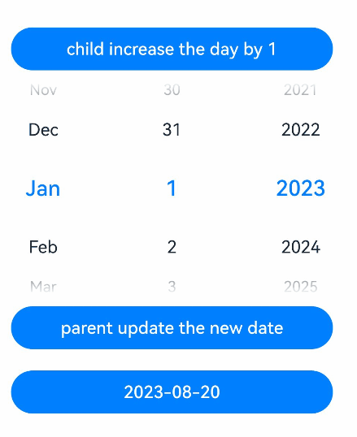

When \@ObjectLink decorates a class that inherits from Map, the overall assignment of the Map can be observed, and the Map values can be updated by calling the Map interfaces `set`, `clear`, and `delete`. For an example, see [Inheriting the Map Class](#inheriting-the-map-class).

When \@ObjectLink decorates a class that inherits from Set, the overall assignment of the Set can be observed, and the Set values can be updated by calling the Set interfaces `add`, `clear`, and `delete`. For an example, see [Inheriting the Set Class](#inheriting-the-set-class).

### Framework Behavior

1. Initial rendering:

   a. Instances of classes decorated by @Observed are wrapped by proxy objects, which proxy the setter and getter methods of the class properties.

   b. In a child component, a variable decorated by @ObjectLink is initialized from the parent component and receives an instance of the @Observed-decorated class. The @ObjectLink wrapper class then registers itself with the @Observed class. Here, registration means that the @ObjectLink wrapper class provides its own reference to the @Observed instance, so that the @Observed instance can add it to the dependency list and notify it when a property changes.

2. Property update: When a property of an @Observed-decorated class changes, the proxied setter and getter are executed, and then all @ObjectLink wrapper classes that depend on it are traversed to notify them of the data update.

## Constraints

1. Using @Observed to decorate a class changes the original prototype chain of the class. Decorating the same class with @Observed and other class decorators may cause issues.

2. Using the @ObjectLink decorator in a custom component decorated by [@Entry](./arkts-create-custom-components.md#entry) is not recommended, and a warning will be generated during compilation.

3. The type decorated by @ObjectLink must be a complex type; otherwise, a compile-time error will occur.

4. Before API version 19, the type of a variable decorated by @ObjectLink must be explicitly a class decorated by @Observed. If the type is not specified or is not a class decorated by @Observed, a compile-time error will occur.

   Since API version 19, @ObjectLink can also be initialized by the return value of [makeV1Observed](../../reference/apis-arkui/js-apis-stateManagement.md#makev1observed19). If @ObjectLink is initialized with a class not decorated by @Observed or a value that is not the return value of makeV1Observed, a runtime warning log will be generated.

   ```ts
   class Test {
     msg: number;
   
     constructor(msg: number) {
       this.msg = msg;
     }
   }
   // Incorrect usage: The type of count is not specified, causing a compilation error.
   @ObjectLink count;
   // Incorrect usage: Test is not decorated with @Observed, causing a compilation error.
   @ObjectLink test: Test;
   ```

   ``` TypeScript
   @Observed
   class Info {
     public count: number;
   
     constructor(count: number) {
       this.count = count;
     }
   }
   // ...
   // Correct usage
   @ObjectLink count: Info;
   ```

5. Variables decorated with @ObjectLink cannot be initialized locally. They can only receive initial values from the parent component through constructor parameters. Otherwise, a compilation error will occur.

   ```ts
   // Incorrect usage, causing a compilation error.
   @ObjectLink count: CountInfo = new CountInfo(10);
   ```

   ``` TypeScript
   @Observed
   class CountInfo {
     public count: number;
   
     constructor(count: number) {
       this.count = count;
     }
   }
   // ...
   // Correct approach.
   @ObjectLink count: CountInfo;
   ```

6. Variables decorated by \@ObjectLink are read-only and cannot be assigned. Otherwise, a runtime error occurs with the message "Cannot set property when setter is undefined." If the variable decorated by \@ObjectLink needs to be replaced as a whole, perform the replacement in the parent component.

   **Incorrect Usage**

   ```ts
   @Observed
   class Info {
     count: number;
   
     constructor(count: number) {
       this.count = count;
     }
   }
   
   @Component
   struct Child {
     @ObjectLink num: Info;
   
     build() {
       Column() {
         Text(`num value: ${this.num.count}`)
           .onClick(() => {
             // Incorrect approach. @ObjectLink-decorated variables cannot be assigned, which causes a runtime error.
             this.num = new Info(10);
           })
       }
     }
   }
   
   @Entry
   @Component
   struct Parent {
     @State num: Info = new Info(10);
   
     build() {
       Column() {
         Text(`count value: ${this.num.count}`)
         Child({num: this.num})
       }
     }
   }
   ```

   **Correct Usage**

   <!-- @[variables_decorated_ObjectLink_read_only](https://gitcode.com/openharmony/applications_app_samples/blob/master/code/DocsSample/ArkUISample/arktsobservedandobjectlink/entry/src/main/ets/pages/restrictiveconditions/ReadOnlyVariable.ets) --> 

   ``` TypeScript
   
   @Observed
   class Info {
     public count: number;
   
     constructor(count: number) {
       this.count = count;
     }
   }
   
   @Component
   struct Child {
     @ObjectLink num: Info;
   
     build() {
       Column() {
         Text(`num value: ${this.num.count}`)
           .fontSize(20)
           .margin(10)
           .onClick(() => {
             // Correct approach: modify the member property of the @ObjectLink decorated variable.
             this.num.count = 20;
           })
       }
       .width('100%')
     }
   }
   
   @Entry
   @Component
   struct Parent {
     @State num: Info = new Info(10);
   
     build() {
       Column() {
         Text(`count value: ${this.num.count}`)
           .fontSize(20)
           .margin(10)
         Button('click')
           .width(300)
           .margin(10)
           .onClick(() => {
             // Perform a full replacement in the parent component.
             this.num = new Info(30);
           })
         Child({ num: this.num })
       }
       .width('100%')
     }
   }
   ```

   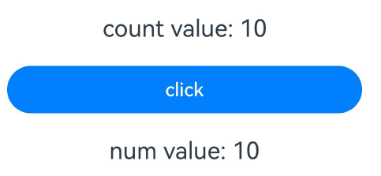

## Use Cases

### Object Type

This scenario involves built-in types (Array, Map, Set, and Date) and regular classes. Starting from API version 19, @ObjectLink can receive built-in type and regular class objects passed from @State, observe their API calls and first-layer changes, without requiring an additional @Observed decorator. This is because state variable decorators such as @State add a layer of proxy wrapping to the object (the outer object), which functions equivalently to adding the @Observed decorator.

<!-- @[State_To_Objectlink](https://gitcode.com/openharmony/applications_app_samples/blob/master/code/DocsSample/ArkUISample/arktsobservedandobjectlink/entry/src/main/ets/pages/objectLinkusagescenarios/StateToObjectlink.ets) --> 

``` TypeScript
class Book {
  public name: string;

  constructor(name: string) {
    this.name = name;
  }
}

@Component
struct BookCard {
  @ObjectLink book: Book;

  build() {
    Column() {
      Text(`BookCard: ${this.book.name}`) // Changes to name can be observed.
        .fontSize(20)
        .margin(10)
        .width(320)
        .textAlign(TextAlign.Center)

      Button('change book.name')
        .width(320)
        .margin(10)
        .onClick(() => {
          this.book.name = 'C++';
        })
    }
    .width('100%')
  }
}

@Entry
@Component
struct Index {
  @State book: Book = new Book('JS');

  build() {
    Column() {
      BookCard({ book: this.book })
    }
  }
}
```


### Nested Objects

<!-- @[Nested_Object](https://gitcode.com/openharmony/applications_app_samples/blob/master/code/DocsSample/ArkUISample/arktsobservedandobjectlink/entry/src/main/ets/pages/objectLinkusagescenarios/NestedObject.ets) --> 

``` TypeScript
@Observed
class Book {
  public name: string;

  constructor(name: string) {
    this.name = name;
  }
}

@Observed
class Bag {
  public book: Book;

  constructor(book: Book) {
    this.book = book;
  }
}

@Component
struct BookCard {
  @ObjectLink book: Book;

  build() {
    Column() {
      Text(`BookCard: ${this.book.name}`) // Changes to name can be observed.
        .width(320)
        .margin(10)
        .textAlign(TextAlign.Center)

      Button('change book.name')
        .width(320)
        .margin(10)
        .onClick(() => {
          this.book.name = 'C++';
        })
    }
  }
}

@Entry
@Component
struct Index {
  @State bag: Bag = new Bag(new Book('JS'));

  build() {
    Column() {
      Text(`Index: ${this.bag.book.name}`) // Changes to name cannot be observed.
        .width(320)
        .margin(10)
        .textAlign(TextAlign.Center)

      Button('change bag.book.name')
        .width(320)
        .margin(10)
        .onClick(() => {
          this.bag.book.name = 'TS';
        })

      BookCard({ book: this.bag.book })
    }
  }
}
```

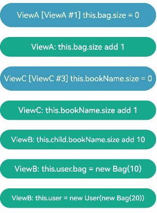

In the preceding example:

- For the state variable `@State bag: Bag` in the Index component, `bag.book` is the first level, and `bag.book.name` is the second level. Therefore, when you tap `change bag.book.name` to directly modify `this.bag.book.name`, the `Text('Index: ${this.bag.book.name}')` in Index does not refresh, because \@State can only observe changes at the first level of properties and cannot directly observe changes to the nested object's internal property `name`.

- For the state variable `@ObjectLink book: Book` in the BookCard component, `Book` is decorated by \@Observed, and `book` is received by \@ObjectLink. Changes to `book.name` can be observed by `@ObjectLink`. Therefore, whether you tap `change bag.book.name` in the parent component Index or tap `change book.name` in the child component BookCard, the `Text('BookCard: ${this.book.name}')` in BookCard refreshes.

- \@State is responsible for sensing changes at the first level of the outer object `Bag`, while `@Observed + @ObjectLink` is responsible for sensing property changes of the inner object `Book`.

### Object Arrays

Object arrays are a commonly used data structure. The following example demonstrates how to use object arrays.

> **NOTE**
>
> NextID is used to generate a unique and persistent key for each array element during [ForEach loop rendering](../rendering-control/arkts-rendering-control-foreach.md), identifying the corresponding component.

<!-- @[Object_Array](https://gitcode.com/openharmony/applications_app_samples/blob/master/code/DocsSample/ArkUISample/arktsobservedandobjectlink/entry/src/main/ets/pages/objectLinkusagescenarios/ObjectArray.ets) --> 

``` TypeScript
import { hilog } from '@kit.PerformanceAnalysisKit';

const DOMAIN = 0x0001;
const TAG = 'ArkTSObservedAndObjectlink';
let nextID: number = 1;

@Observed
class Info {
  public id: number;
  public info: number;

  constructor(info: number) {
    this.id = nextID++;
    this.info = info;
  }
}

@Component
struct Child {
  // The @ObjectLink in the child component Child is of type Info.
  @ObjectLink info: Info;
  label: string = 'ViewChild';

  build() {
    Row() {
      Button(`ViewChild [${this.label}] this.info.info = ${this.info ? this.info.info : 'undefined'}`)
        .width(320)
        .margin(10)
        .onClick(() => {
          this.info.info += 1;
        })
    }
  }
}

@Entry
@Component
struct Parent {
  // Parent has an @State-decorated Info[].
  @State arrA: Info[] = [new Info(0), new Info(0)];

  build() {
    Column() {
      ForEach(this.arrA,
        (item: Info) => {
          Child({ label: `#${item.id}`, info: item })
        },
        (item: Info): string => item.id.toString()
      )
      // Initialize @ObjectLink with an array item from the @State-decorated array, where the array item is an instance of the @Observed-decorated Info class.
      Child({ label: 'ViewChild this.arrA[first]', info: this.arrA[0] })
      Child({ label: 'ViewChild this.arrA[last]', info: this.arrA[this.arrA.length-1] })

      Button('ViewParent: reset array')
        .width(320)
        .margin(10)
        .onClick(() => {
          this.arrA = [new Info(0), new Info(0)];
        })
      Button('ViewParent: push')
        .width(320)
        .margin(10)
        .onClick(() => {
          this.arrA.push(new Info(0));
        })
      Button('ViewParent: shift')
        .width(320)
        .margin(10)
        .onClick(() => {
          if (this.arrA.length > 0) {
            this.arrA.shift();
          } else {
            hilog.info(DOMAIN, TAG, 'length <= 0');
          }
        })
      Button('ViewParent: item property in middle')
        .width(320)
        .margin(10)
        .onClick(() => {
          this.arrA[Math.floor(this.arrA.length / 2)].info = 10;
        })
      Button('ViewParent: item property in middle')
        .width(320)
        .margin(10)
        .onClick(() => {
          this.arrA[Math.floor(this.arrA.length / 2)] = new Info(11);
        })
    }
  }
}
```

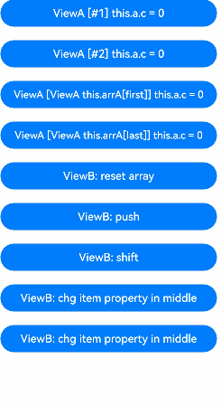

- this.arrA[Math.floor(this.arrA.length/2)] = new Info(..): This state variable change triggers two updates:

  1. ForEach: The assignment of the array item causes the itemGenerator of [ForEach](../../reference/apis-arkui/arkui-ts/ts-rendering-control-foreach.md) to be modified, so the array item is identified as changed. The item builder of ForEach is executed, creating a new Child component instance.

  2. Child({ label: 'ViewChild this.arrA[last]', info: this.arrA[this.arrA.length-1] }): The above change modifies the second element in the array, so the Child bound to this.arrA[1] is updated.

- this.arrA.push(new Info(0)): Triggers two updates with different effects:

  1. ForEach: The newly added Info object is an unknown itemGenerator for ForEach, so the ForEach item builder executes and creates a new Child component instance.

  2. Child({ label: 'ViewChild this.arrA[last]', info: this.arrA[this.arrA.length-1] }): The last item of the array has changed, causing the second Child instance to update. For Child({ label: 'ViewChild this.arrA[first]', info: this.arrA[0] }), the array change does not trigger a change notification for an individual array item, so the first Child is not refreshed.

- this.arrA[Math.floor(this.arrA.length/2)].info: @State cannot observe second-level changes, but since Info is decorated with @Observed, changes to Info's properties are observed by @ObjectLink.

### Two-Dimensional Arrays

Use \@Observed to observe changes in two-dimensional arrays. A subclass that inherits from Array and is decorated by \@Observed can be declared.

``` TypeScript
@Observed
class ObservedArray<T> extends Array<T> {
}
```

Declare a class `ObservedArray\<T\>` that inherits from `Array`, and use the `new` operator to create an instance of `ObservedArray\<string\>`. Property changes of this instance can be observed.

The following example demonstrates how to use \@Observed to observe changes in two-dimensional arrays.

<!-- @[Two_dimensional_array_example](https://gitcode.com/openharmony/applications_app_samples/blob/master/code/DocsSample/ArkUISample/arktsobservedandobjectlink/entry/src/main/ets/pages/objectLinkusagescenarios/TwoDimensionalArray.ets) -->  

``` TypeScript
@Observed
class ObservedArray<T> extends Array<T> {
}

@Component
struct Item {
  @ObjectLink itemArr: ObservedArray<string>;

  build() {
    Row() {
      ForEach(this.itemArr, (item: string, index: number) => {
        Text(`${index}: ${item}`)
          .fontSize(20)
          .margin(5)
          .width(120)
          .height(100)
      }, (item: string) => item)
    }
  }
}

@Entry
@Component
struct IndexPage {
  // An instance of ObservedArray<string> created with the new operator can have its property changes observed.
  @State arr: Array<ObservedArray<string>> = [
    new ObservedArray<string>('apple'),
    new ObservedArray<string>('banana'),
    new ObservedArray<string>('orange')
  ];

  build() {
    Column() {
      ForEach(this.arr, (itemArr: ObservedArray<string>) => {
        Item({ itemArr: itemArr })
      })

      Divider()

      Button('push two-dimensional array item')
        .width(300)
        .margin(10)
        .onClick(() => {
          this.arr[0].push('strawberry');
        })

      Button('push array item')
        .width(300)
        .margin(10)
        .onClick(() => {
          this.arr.push(new ObservedArray<string>('pear'));
        })

      Button('change two-dimensional array first item')
        .width(300)
        .margin(10)
        .onClick(() => {
          this.arr[0][0] = 'APPLE';
        })

      Button('change array first item')
        .width(300)
        .margin(10)
        .onClick(() => {
          this.arr[0] = new ObservedArray<string>('watermelon');
        })
    }
    .width('100%')
  }
}
```

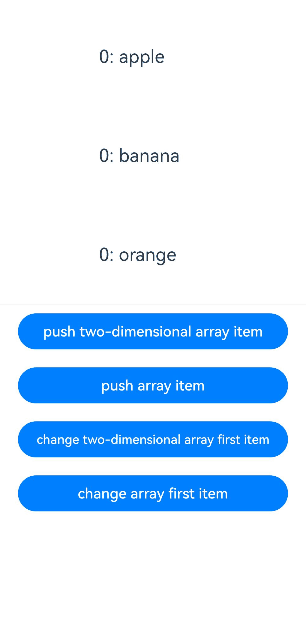

Starting from API version 19, @ObjectLink can also be initialized with the return value of [makeV1Observed](../../reference/apis-arkui/js-apis-stateManagement.md#makev1observed19). Therefore, if developers do not want to declare an additional class that extends Array, they can use makeV1Observed to achieve the same effect.

The complete example is as follows.

<!-- @[Complete_Example_Two_Dimensional_Array](https://gitcode.com/openharmony/applications_app_samples/blob/master/code/DocsSample/ArkUISample/arktsobservedandobjectlink/entry/src/main/ets/pages/objectLinkusagescenarios/CompleteExampleTwoDimensionalArray.ets) -->  

``` TypeScript
import { UIUtils } from '@kit.ArkUI';

@Component
struct Item {
  @ObjectLink itemArr: Array<string>;

  build() {
    Row() {
      ForEach(this.itemArr, (item: string, index: number) => {
        Text(`${index}: ${item}`)
          .width(100)
          .height(100)
      }, (item: string) => item)
    }
  }
}

@Entry
@Component
struct IndexPage {
  // Use makeV1Observed to observe changes in a two-dimensional array.
  @State arr: Array<Array<string>> =
    [UIUtils.makeV1Observed(['apple']), UIUtils.makeV1Observed(['banana']), UIUtils.makeV1Observed(['orange'])];

  build() {
    Column() {
      ForEach(this.arr, (itemArr: Array<string>) => {
        Item({ itemArr: itemArr })
      })

      Divider()

      Button('push two-dimensional array item')
        .margin(10)
        .onClick(() => {
          this.arr[0].push('strawberry');
        })

      Button('push array item')
        .margin(10)
        .onClick(() => {
          this.arr.push(UIUtils.makeV1Observed(['pear']));
        })

      Button('change two-dimensional array first item')
        .margin(10)
        .onClick(() => {
          this.arr[0][0] = 'APPLE';
        })

      Button('change array first item')
        .margin(10)
        .onClick(() => {
          this.arr[0] = UIUtils.makeV1Observed(['watermelon']);
        })
    }
  }
}
```

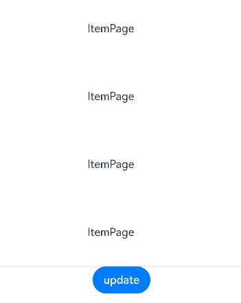

### Inheriting the Map Class

> **NOTE**
>
> Since API version 11, \@ObjectLink supports \@Observed decorated Map types and types that inherit from the Map class.

In the following example, the type of myMap is MyMap\<number, string\>. When the button is tapped to change the property of myMap, the view is refreshed accordingly.

<!-- @[Inherit_From_Map_Class](https://gitcode.com/openharmony/applications_app_samples/blob/master/code/DocsSample/ArkUISample/arktsobservedandobjectlink/entry/src/main/ets/pages/objectLinkusagescenarios/InheritFromMapClass.ets) -->  

``` TypeScript
@Observed
class Info {
  public info: MyMap<number, string>;

  constructor(info: MyMap<number, string>) {
    this.info = info;
  }
}

@Observed
export class MyMap<K, V> extends Map<K, V> {
  public name: string;

  constructor(name?: string, args?: [K, V][]) {
    super(args);
    this.name = name ? name : 'My Map';
  }

  getName() {
    return this.name;
  }
}

@Entry
@Component
struct MapSampleNested {
  @State message: Info = new Info(new MyMap('myMap', [[0, 'a'], [1, 'b'], [3, 'c']]));

  build() {
    Row() {
      Column() {
        MapSampleNestedChild({ myMap: this.message.info })
      }
      .width('100%')
    }
    .height('100%')
  }
}

@Component
struct MapSampleNestedChild {
  @ObjectLink myMap: MyMap<number, string>;

  build() {
    Row() {
      Column() {
        ForEach(Array.from(this.myMap.entries()), (item: [number, string]) => {
          Text(`${item[0]}`).fontSize(30)
          Text(`${item[1]}`).fontSize(30)
          Divider().strokeWidth(5)
        })

        // myMap is decorated by @Observed and @ObjectLink, so the overall assignment of the Map and changes caused by calling Map APIs can be observed.
        Button('set new one')
          .width(200)
          .margin(10)
          .onClick(() => {
            this.myMap.set(4, 'd');
          })
        Button('clear')
          .width(200)
          .margin(10)
          .onClick(() => {
            this.myMap.clear();
          })
        Button('replace the first one')
          .width(200)
          .margin(10)
          .onClick(() => {
            this.myMap.set(0, 'aa');
          })
        Button('delete the first one')
          .width(200)
          .margin(10)
          .onClick(() => {
            this.myMap.delete(0);
          })
      }
      .width('100%')
    }
    .height('100%')
  }
}
```

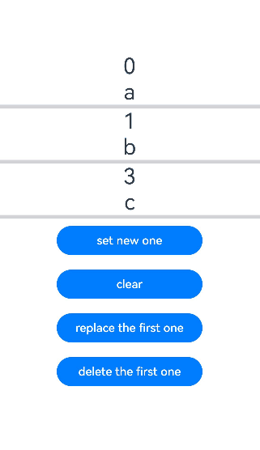

### Inheriting the Set Class

> **NOTE**
>
> Since API version 11, @ObjectLink supports @Observed-decorated Set types and types that inherit from the Set class.

In the following example, the type of mySet is MySet&lt;number&gt;. When the Button is tapped to change a property of mySet, the view is refreshed accordingly.

<!-- @[Inherit_From_Set_Class](https://gitcode.com/openharmony/applications_app_samples/blob/master/code/DocsSample/ArkUISample/arktsobservedandobjectlink/entry/src/main/ets/pages/objectLinkusagescenarios/InheritFromSetClass.ets) -->  

``` TypeScript
@Observed
class Info {
  public info: MySet<number>;

  constructor(info: MySet<number>) {
    this.info = info;
  }
}

@Observed
export class MySet<T> extends Set<T> {
  public name: string;

  constructor(name?: string, args?: T[]) {
    super(args);
    this.name = name ? name : 'My Set';
  }

  getName() {
    return this.name;
  }
}

@Entry
@Component
struct SetSampleNested {
  @State message: Info = new Info(new MySet('Set', [0, 1, 2, 3, 4]));

  build() {
    Row() {
      Column() {
        SetSampleNestedChild({ mySet: this.message.info })
      }
      .width('100%')
    }
    .height('100%')
  }
}

@Component
struct SetSampleNestedChild {
  @ObjectLink mySet: MySet<number>;

  build() {
    Row() {
      Column() {
        ForEach(Array.from(this.mySet.entries()), (item: [number, number]) => {
          Text(`${item}`).fontSize(30)
          Divider()
        })
        // mySet is decorated by @Observed and @ObjectLink, so changes to the Set as a whole (via assignment) and changes made through Set APIs can be observed.
        Button('set new one')
          .width(200)
          .margin(10)
          .onClick(() => {
            this.mySet.add(5);
          })
        Button('clear')
          .width(200)
          .margin(10)
          .onClick(() => {
            this.mySet.clear();
          })
        Button('delete the first one')
          .width(200)
          .margin(10)
          .onClick(() => {
            this.mySet.delete(0);
          })
      }
      .width('100%')
    }
    .height('100%')
  }
}
```

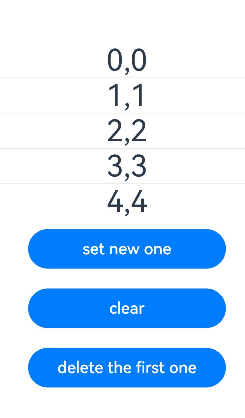

### Supporting Union Types with \@ObjectLink

\@ObjectLink supports union types composed of an \@Observed decorated class and undefined or null. In the following example, the count type is Source | Data | undefined. When the Button in the parent component Parent is tapped to change the property or type of count, the corresponding Text component in the Child component is refreshed.

<!-- @[ObjectLink_Supports_Union_Types](https://gitcode.com/openharmony/applications_app_samples/blob/master/code/DocsSample/ArkUISample/arktsobservedandobjectlink/entry/src/main/ets/pages/objectLinkusagescenarios/ObjectLinkSupportsUnionTypes.ets) --> 

``` TypeScript
import { hilog } from '@kit.PerformanceAnalysisKit';

const DOMAIN = 0x0001;
const TAG = 'ArkTSObservedAndObjectlink';

@Observed
class Source {
  public source: number;

  constructor(source: number) {
    this.source = source;
  }
}

@Observed
class Data {
  public data: number;

  constructor(data: number) {
    this.data = data;
  }
}

@Entry
@Component
struct Parent {
  @State count: Source | Data | undefined = new Source(10);

  build() {
    Column() {
      Child({ count: this.count })

      Button('change count property')
        .margin(10)
        .onClick(() => {
          // Determine the type of count and update the property.
          if (this.count instanceof Source) {
            this.count.source += 1;
          } else if (this.count instanceof Data) {
            this.count.data += 1;
          } else {
            hilog.info(DOMAIN, TAG, `count is undefined, cannot change property`);
          }
        })

      Button('change count to Source')
        .margin(10)
        .onClick(() => {
          // Assign an instance of Source.
          this.count = new Source(100);
        })

      Button('change count to Data')
        .margin(10)
        .onClick(() => {
          // Assign an instance of Data.
          this.count = new Data(100);
        })

      Button('change count to undefined')
        .margin(10)
        .onClick(() => {
          // Assign undefined.
          this.count = undefined;
        })
    }.width('100%')
  }
}

@Component
struct Child {
  @ObjectLink count: Source | Data | undefined;

  build() {
    Column() {
      Text(`count is instanceof ${this.count instanceof Source ? 'Source' :
        this.count instanceof Data ? 'Data' : 'undefined'}`)
        .fontSize(30)
        .margin(10)

      Text(`count's property is  ${this.count instanceof Source ? this.count.source : this.count?.data}`).fontSize(15)

    }.width('100%')
  }
}
```

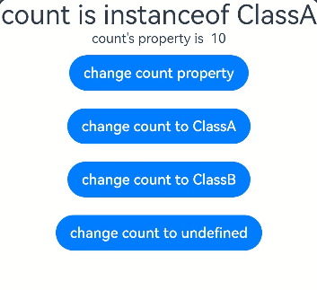

## FAQs

### Basic Nested Object Property Changes Not Taking Effect

In app development, there are many nested object scenarios. For example, a developer updates a property, but the UI does not update accordingly.

Each decorator has its own observation capability, but not all changes can be observed. Only observable changes trigger UI updates. The @Observed decorator can observe property changes of nested objects, while other decorators can only observe changes at the first level.

**Incorrect Usage**

In the following example, some UI components do not update.

```ts
class Parent {
  parentId: number;

  constructor(parentId: number) {
    this.parentId = parentId;
  }

  getParentId(): number {
    return this.parentId;
  }

  setParentId(parentId: number): void {
    this.parentId = parentId;
  }
}

class Child {
  childId: number;

  constructor(childId: number) {
    this.childId = childId;
  }

  getChildId(): number {
    return this.childId;
  }

  setChildId(childId: number): void {
    this.childId = childId;
  }
}

class Cousin extends Parent {
  cousinId: number = 47;
  child: Child;

  constructor(parentId: number, cousinId: number, childId: number) {
    super(parentId);
    this.cousinId = cousinId;
    this.child = new Child(childId);
  }

  getCousinId(): number {
    return this.cousinId;
  }

  setCousinId(cousinId: number): void {
    this.cousinId = cousinId;
  }

  getChild(): number {
    return this.child.getChildId();
  }

  setChild(childId: number): void {
    this.child.setChildId(childId);
  }
}

@Entry
@Component
struct MyView {
  @State cousin: Cousin = new Cousin(10, 20, 30);

  build() {
    Column({ space: 10 }) {
      Text(`parentId: ${this.cousin.parentId}`)
      Button('Change Parent.parent')
        .onClick(() => {
          this.cousin.parentId += 1;
        })

      Text(`cousinId: ${this.cousin.cousinId}`)
      Button('Change Cousin.cousinId')
        .onClick(() => {
          this.cousin.cousinId += 1;
        })

      Text(`childId: ${this.cousin.child.childId}`)
      Button('Change Cousin.Child.childId')
        .onClick(() => {
          // The Text component above does not refresh when clicked.
          this.cousin.child.childId += 1;
        })
    }
  }
}
```

- The last Text component, `Text('childId: ${this.cousin.child.childId}')`, does not trigger a UI refresh when tapped. This is because `@State cousin: Cousin` can only observe changes to the properties of `this.cousin`, such as `this.cousin.parentId`, `this.cousin.cousinId`, and `this.cousin.child`, but cannot observe properties nested within those properties, namely `this.cousin.child.childId` (the `childId` property belongs to the `Child` object nested inside `cousin`).

- To observe the properties of the nested `Child` object, the following changes are required:

  - Construct a child component dedicated to rendering the `Child` instance. This child component can use `@ObjectLink child: Child` or `@Prop child: Child`. Typically, `@ObjectLink` is used, unless the child component needs to make local modifications to its `Child` object.

  - The nested `Child` class must be decorated with `@Observed`. When a `Child` object is created inside `Cousin` (in this example, `Cousin(10, 20, 30)`), it is wrapped in an ES6 proxy, so that when a `Child` property changes (`this.cousin.child.childId += 1`), the modification is notified to the `@ObjectLink` variable.

**Correct Usage**

The following example uses `@Observed`/`@ObjectLink` to observe property changes of a nested object.

<!-- @[Basic_nesting](https://gitcode.com/openharmony/applications_app_samples/blob/master/code/DocsSample/ArkUISample/arktsobservedandobjectlink/entry/src/main/ets/pages/ObservedAndObjectLinkFAQs/BasicNesting.ets) --> 

``` TypeScript
class Parent {
  public parentId: number;

  constructor(parentId: number) {
    this.parentId = parentId;
  }

  getParentId(): number {
    return this.parentId;
  }

  setParentId(parentId: number): void {
    this.parentId = parentId;
  }
}

@Observed
class Child {
  public childId: number;

  constructor(childId: number) {
    this.childId = childId;
  }

  getChildId(): number {
    return this.childId;
  }

  setChildId(childId: number): void {
    this.childId = childId;
  }
}

class Cousin extends Parent {
  public cousinId: number = 47;
  public child: Child;

  constructor(parentId: number, cousinId: number, childId: number) {
    super(parentId);
    this.cousinId = cousinId;
    this.child = new Child(childId);
  }

  getCousinId(): number {
    return this.cousinId;
  }

  setCousinId(cousinId: number): void {
    this.cousinId = cousinId;
  }

  getChild(): number {
    return this.child.getChildId();
  }

  setChild(childId: number): void {
    this.child.setChildId(childId);
  }
}

@Component
struct ViewChild {
  @ObjectLink child: Child;

  build() {
    Column({ space: 10 }) {
      Text(`childId: ${this.child.getChildId()}`)
        .fontSize(20)
        .margin(10)
      Button('Change childId')
        .width(300)
        .margin(10)
        .onClick(() => {
          this.child.setChildId(this.child.getChildId() + 1);
        })
    }
    .width('100%')
  }
}

@Entry
@Component
struct MyView {
  @State cousin: Cousin = new Cousin(10, 20, 30);

  build() {
    Column({ space: 10 }) {
      Text(`parentId: ${this.cousin.parentId}`)
        .fontSize(20)
        .margin(10)
      Button('Change Parent.parentId')
        .width(300)
        .margin(10)
        .onClick(() => {
          this.cousin.parentId += 1;
        })

      Text(`cousinId: ${this.cousin.cousinId}`)
        .fontSize(20)
        .margin(10)
      Button('Change Cousin.cousinId')
        .width(300)
        .margin(10)
        .onClick(() => {
          this.cousin.cousinId += 1;
        })

      ViewChild({ child: this.cousin.child }) // Alternative way to write Text(`childId: ${this.cousin.child.childId}`).
      Button('Change Cousin.Child.childId')
        .width(300)
        .margin(10)
        .onClick(() => {
          this.cousin.child.childId += 1;
        })
    }
    .width('100%')
  }
}
```

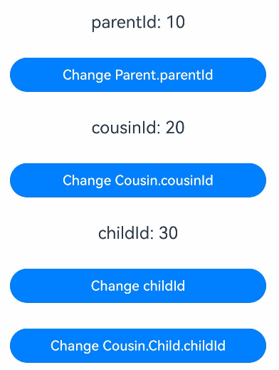

### Complex Nested Object Property Changes Not Taking Effect

**Incorrect Usage**

The following example creates a child component with an \@ObjectLink decorated variable to render a ParentCounter that contains nested properties, with the SubCounter nested in ParentCounter decorated by \@Observed.

```ts
let nextId = 1;
@Observed
class SubCounter {
  counter: number;
  constructor(c: number) {
    this.counter = c;
  }
}
@Observed
class ParentCounter {
  id: number;
  counter: number;
  subCounter: SubCounter;
  incrCounter() {
    this.counter++;
  }
  incrSubCounter(c: number) {
    this.subCounter.counter += c;
  }
  setSubCounter(c: number): void {
    this.subCounter.counter = c;
  }
  constructor(c: number) {
    this.id = nextId++;
    this.counter = c;
    this.subCounter = new SubCounter(c);
  }
}
@Component
struct CounterComp {
  @ObjectLink value: ParentCounter;
  build() {
    Column({ space: 10 }) {
      Text(`${this.value.counter}`)
        .fontSize(25)
        .onClick(() => {
          this.value.incrCounter();
        })
      Text(`${this.value.subCounter.counter}`)
        .onClick(() => {
          this.value.incrSubCounter(1);
        })
      Divider().height(2)
    }
  }
}
@Entry
@Component
struct ParentComp {
  @State counter: ParentCounter[] = [new ParentCounter(1), new ParentCounter(2), new ParentCounter(3)];
  build() {
    Row() {
      Column() {
        CounterComp({ value: this.counter[0] })
        CounterComp({ value: this.counter[1] })
        CounterComp({ value: this.counter[2] })
        Divider().height(5)
        ForEach(this.counter,
          (item: ParentCounter) => {
            CounterComp({ value: item })
          },
          (item: ParentCounter) => item.id.toString()
        )
        Divider().height(5)
        // First click event
        Text('Parent: incr counter[0].counter')
          .fontSize(20).height(50)
          .onClick(() => {
            this.counter[0].incrCounter();
            // Increment by 10 on each trigger.
            this.counter[0].incrSubCounter(10);
          })
        // Second click event
        Text('Parent: set.counter to 10')
          .fontSize(20).height(50)
          .onClick(() => {
            // The value cannot be set to 10, and the UI will not be refreshed.
            this.counter[0].setSubCounter(10);
          })
        Text('Parent: reset entire counter')
          .fontSize(20).height(50)
          .onClick(() => {
            this.counter = [new ParentCounter(1), new ParentCounter(2), new ParentCounter(3)];
          })
      }
    }
  }
}
```

For the onClick event of Text('Parent: incr counter[0].counter'), this.counter[0].incrSubCounter(10) calls the incrSubCounter method to increase the counter value of SubCounter by 10, and the UI is refreshed synchronously.

However, when this.counter[0].setSubCounter(10) is called in the onClick event of Text('Parent: set.counter to 10'), the counter value of SubCounter cannot be reset to 10.

Both incrSubCounter and setSubCounter are functions of the same SubCounter. When incrSubCounter is called in the first click handler, the UI is updated correctly, but when setSubCounter is called in the second click handler, the UI is not updated. In fact, neither incrSubCounter nor setSubCounter can trigger an update of Text('${this.value.subCounter.counter}'), because @ObjectLink value : ParentCounter can only observe the properties of its proxy ParentCounter. For this.value.subCounter.counter, which is a property of SubCounter, the decorator cannot observe properties of the nested class.

In addition, the first click event calls this.counter[0].incrCounter(), which marks the @ObjectLink value: ParentCounter in the CounterComp custom component as changed, thereby triggering an update of Text('${this.value.subCounter.counter}'). If this.counter[0].incrCounter() is removed from the first click event, the UI cannot be updated.

**Correct Usage**

To address the preceding issue, the following approach can be used to directly observe the properties in SubCounter so that the operation this.counter[0].setSubCounter(10) takes effect:

<!-- @[Complex_Methods_Nesting](https://gitcode.com/openharmony/applications_app_samples/blob/master/code/DocsSample/ArkUISample/arktsobservedandobjectlink/entry/src/main/ets/pages/ObservedAndObjectLinkFAQs/ComplexMethodsNesting.ets) --> 

``` TypeScript
let nextId = 1;

@Observed
class SubCounter {
  public counter: number;

  constructor(c: number) {
    this.counter = c;
  }
}

@Observed
class ParentCounter {
  public id: number;
  public counter: number;
  public subCounter: SubCounter;

  incrCounter() {
    this.counter++;
  }

  incrSubCounter(c: number) {
    this.subCounter.counter += c;
  }

  setSubCounter(c: number): void {
    this.subCounter.counter = c;
  }

  constructor(c: number) {
    this.id = nextId++;
    this.counter = c;
    this.subCounter = new SubCounter(c);
  }
}


@Entry
@Component
struct ParentComp {
  @State counter: ParentCounter[] = [new ParentCounter(1), new ParentCounter(2), new ParentCounter(3)];
  build() {
    Row() {
        CounterComp({ value: this.counter[0] }) // ParentComp passes ParentCounter to CounterComp.
    }
  }
}

@Component
struct CounterComp {
  @ObjectLink value: ParentCounter; // @ObjectLink receives ParentCounter.
  build() {
      // CounterChild is a child component of CounterComp. CounterComp passes this.value.subCounter to CounterChild.
      CounterChild({ subValue: this.value.subCounter })
  }
}

@Component
struct CounterChild {
  @ObjectLink subValue: SubCounter; // @ObjectLink receives SubCounter.
  build() {
    Text(`${this.subValue.counter}`)
      .fontSize(20)
      .margin(10)
      .onClick(() => {
        this.subValue.counter += 1;
      })
  }
}
```


With this approach, @ObjectLink proxies the properties of both ParentCounter and SubCounter, so that changes to the properties of either class can be observed, meaning the UI is refreshed accordingly. Even if the aforementioned `this.counter[0].incrCounter()` is removed, the UI is still refreshed correctly.

This approach can be used to implement "two-level" observation, that is, observation of both the outer object and the inner nested object. However, it applies only to the @ObjectLink decorator and cannot be used with @Prop (which passes objects through deep copy). For details, see [Differences Between @Prop and @ObjectLink](#differences-between-prop-and-objectlink).

<!-- @[Complex_nested_observation_levels](https://gitcode.com/openharmony/applications_app_samples/blob/master/code/DocsSample/ArkUISample/arktsobservedandobjectlink/entry/src/main/ets/pages/ObservedAndObjectLinkFAQs/ComplexNestingComplete.ets) -->  

``` TypeScript
let nextId = 1;

@Observed
class SubCounter {
  public counter: number;

  constructor(c: number) {
    this.counter = c;
  }
}

@Observed
class ParentCounter {
  public id: number;
  public counter: number;
  public subCounter: SubCounter;

  incrCounter() {
    this.counter++;
  }

  incrSubCounter(c: number) {
    this.subCounter.counter += c;
  }

  setSubCounter(c: number): void {
    this.subCounter.counter = c;
  }

  constructor(c: number) {
    this.id = nextId++;
    this.counter = c;
    this.subCounter = new SubCounter(c);
  }
}

@Component
struct CounterComp {
  @ObjectLink value: ParentCounter;

  build() {
    Column({ space: 10 }) {
      Text(`${this.value.counter}`)
        .fontSize(25)
        .onClick(() => {
          this.value.incrCounter();
        })
      CounterChild({ subValue: this.value.subCounter })
      Divider().height(2)
    }
    .width('100%')
  }
}

@Component
struct CounterChild {
  @ObjectLink subValue: SubCounter;

  build() {
    Text(`${this.subValue.counter}`)
      .fontSize(20)
      .onClick(() => {
        this.subValue.counter += 1;
      })
  }
}

@Entry
@Component
struct ParentComp {
  // @ObjectLink proxies the properties of both ParentCounter and SubCounter, so that changes to the properties of either class can be observed.
  @State counter: ParentCounter[] = [new ParentCounter(1), new ParentCounter(2), new ParentCounter(3)];

  build() {
    Row() {
      Column() {
        CounterComp({ value: this.counter[0] })
        CounterComp({ value: this.counter[1] })
        CounterComp({ value: this.counter[2] })
        Divider().height(5)
        ForEach(this.counter,
          (item: ParentCounter) => {
            CounterComp({ value: item })
          },
          (item: ParentCounter) => item.id.toString()
        )
        Divider().height(5)
        Text('Parent: reset entire counter')
          .fontSize(20)
          .margin(5)
          .height(50)
          .onClick(() => {
            this.counter = [new ParentCounter(1), new ParentCounter(2), new ParentCounter(3)];
          })
        Text('Parent: incr counter[0].counter')
          .fontSize(20)
          .margin(5)
          .height(50)
          .onClick(() => {
            this.counter[0].incrCounter();
            this.counter[0].incrSubCounter(10);
          })
        Text('Parent: set.counter to 10')
          .fontSize(20)
          .margin(5)
          .height(50)
          .onClick(() => {
            this.counter[0].setSubCounter(10);
          })
      }
      .width('100%')
    }
  }
}
```

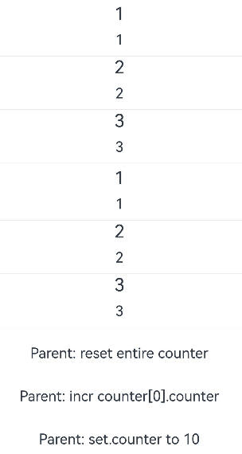

### Differences Between @Prop and @ObjectLink

Both @Prop and @ObjectLink can receive class object instances decorated by @Observed. @Prop performs a deep copy of the object, and modifications to the deep-copied object do not affect the original object or its associated components. @ObjectLink obtains a reference to the object, and modifications to the referenced object affect the original object and its associated components.

In the following example, the `UserChild` component uses both @Prop and @ObjectLink to receive the @Observed-decorated class object instance from the parent component as the data source. Modifications to this data source object affect both the @Prop-decorated and @ObjectLink-decorated variables. Tap the `change @ObjectLink value` button and then the `change @Prop value` button to observe the following:

1. Modifying the object content decorated by @ObjectLink affects the data source object and re-synchronizes it to @Prop, so both Text components are refreshed.

2. Modifying the object content decorated by @Prop affects only the Text2 component that uses this object, without affecting the data source object.

<!-- @[Differences_Prop_ObjectLink](https://gitcode.com/openharmony/applications_app_samples/blob/master/code/DocsSample/ArkUISample/arktsobservedandobjectlink/entry/src/main/ets/pages/ObservedAndObjectLinkFAQs/DifferencesPropObjectLink.ets) --> 

``` TypeScript
let nextId = 0;

@Observed
class User {
  public id: number;

  constructor() {
    this.id = nextId++;
  }
}

@Entry
@Component
struct Index {
  @State users: User[] = [new User(), new User(), new User()];

  build() {
    Column() {
      UserChild({ firstUserByObjectLink: this.users[0], firstUserByProp: this.users[0] })
    }
    .width('100%')
  }
}

@Component
struct UserChild {
  @ObjectLink firstUserByObjectLink: User;
  @Prop firstUserByProp: User;

  build() {
    Column() {
      // The comparison result is false, indicating that the object obtained after @Prop deep copy is no longer the same object as the original.
      Text(`firstUserByObjectLink equals firstUserByProp? : ${this.firstUserByObjectLink === this.firstUserByProp}`)
        .fontSize(20)
        .margin(10)
      Text(`UserChild firstUserByObjectLink.id: ${this.firstUserByObjectLink.id}`) // Text1
        .fontSize(20)
        .margin(10)
      Text(`UserChild firstUserByProp.id: ${this.firstUserByProp.id}`) // Text2
        .fontSize(20)
        .margin(10)
      Button('change @ObjectLink value')
        .width(300)
        .margin(10)
        .onClick(() => {
          this.firstUserByObjectLink.id++;
        })
      Button('change @Prop value')
        .width(300)
        .margin(10)
        .onClick(() => {
          this.firstUserByProp.id++;
        })
    }
    .width('100%')
  }
}
```

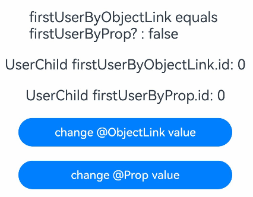

The relationships in the example above are shown in the following figure:


### Delaying Member Variable Changes in the Constructor of an @Observed Decorated Class

In state management, when a class is decorated with @Observed, it is wrapped with a "proxy" layer. When a member variable of the class is modified in a component, the proxy intercepts the change, updates the value in the data source, and simultaneously notifies the bound components, thereby enabling change observation and UI refresh triggering.

When a developer assigns or modifies a member variable in the class constructor, this change does not go through the proxy (because the value in the data source is modified directly), and therefore cannot be observed. Consequently, if a developer uses a timer in the class constructor to modify a member variable, the UI will not be refreshed even if the modification is successfully executed.

**Incorrect Usage**

```ts
@Observed
class RenderClass {
  waitToRender: boolean = false;

  constructor() {
    setTimeout(() => {
      this.waitToRender = true;
      console.info('The value of waitToRender is changed to: ' + this.waitToRender);
    }, 1000)
  }
}

@Entry
@Component
struct Index {
  @State @Watch('renderClassChange') renderClass: RenderClass = new RenderClass();
  @State textColor: Color = Color.Black;

  renderClassChange() {
    console.info('The value of renderClass is changed to: ' + this.renderClass.waitToRender);
  }

  build() {
    Row() {
      Column() {
        Text('The value of renderClass is: ' + this.renderClass.waitToRender)
          .fontSize(20)
          .fontColor(this.textColor)
        Button('Show')
          .onClick(() => {
            // Using other state variables to forcibly refresh the UI is not recommended. This is only used here to check whether the value of waitToRender has been updated.
            this.textColor = Color.Red;
          })
      }
      .width('100%')
    }
    .height('100%')
  }
}
```

In the example code above, a timer is used in the constructor of RenderClass to modify the value of waitToRender after one second, but this does not trigger a UI refresh. At this point, clicking the button to forcibly refresh the Text component reveals that the value of waitToRender has already been changed to true.

**Correct Usage**

<!-- @[Delayed_change](https://gitcode.com/openharmony/applications_app_samples/blob/master/code/DocsSample/ArkUISample/arktsobservedandobjectlink/entry/src/main/ets/pages/ObservedAndObjectLinkFAQs/DelayedChange.ets) --> 

``` TypeScript
import { hilog } from '@kit.PerformanceAnalysisKit';

const DOMAIN = 0x0001;
const TAG = 'ArkTSObservedAndObjectlink';

@Observed
class RenderClass {
  public waitToRender: boolean = false;

  constructor() {
  }
}

@Entry
@Component
struct DelayedChangeIndex {
  @State @Watch('renderClassChange') renderClass: RenderClass = new RenderClass();

  renderClassChange() {
    hilog.info(DOMAIN, TAG, `The value of renderClass is changed to: ${this.renderClass.waitToRender}`);
  }

  onPageShow() {
    setTimeout(() => {
      this.renderClass.waitToRender = true;
    }, 1000);
  }

  build() {
    Row() {
      Column() {
        Text(`The value of renderClass is: ${this.renderClass.waitToRender}`)
          .fontSize(20)
      }
      .width('100%')
    }
    .height('100%')
  }
}
```


In the example code above, the timer modification is moved into the component. When the UI is displayed, it first shows "The value of renderClass is: false". When the timer fires, the value of renderClass changes, triggering the [@Watch](./arkts-watch.md) callback. At this point, the UI refreshes to display "The value of renderClass is: true", and the log outputs "The value of renderClass is changed to: true".

Therefore, it is recommended that developers modify the member variables of the @Observed decorated class within the component to trigger a refresh.

### When Does @ObjectLink Update Its Data Source?

<!-- @[ObjectLink_Data_source_update_timing](https://gitcode.com/openharmony/applications_app_samples/blob/master/code/DocsSample/ArkUISample/arktsobservedandobjectlink/entry/src/main/ets/pages/ObservedAndObjectLinkFAQs/ObjectLinkDataSourceUpdate.ets) --> 

``` TypeScript
import { hilog } from '@kit.PerformanceAnalysisKit';

const DOMAIN = 0x0001;
const TAG = 'ArkTSObservedAndObjectlink';

@Observed
class Person {
  public name: string = '';
  public age: number = 0;

  constructor(name: string, age: number) {
    this.name = name;
    this.age = age;
  }
}

@Observed
class Info {
  public person: Person;

  constructor(person: Person) {
    this.person = person;
  }
}

@Entry
@Component
struct Parent {
  @State @Watch('onChange01') info: Info =
    new Info(
      new Person('Bob', 10)
    );

  onChange01() {
    hilog.info(DOMAIN, TAG, `:::onChange01: + ${this.info.person.name}`); // 2
  }

  build() {
    Column() {
      Text(this.info.person.name)
        .fontSize(20)
        .margin(10)
        .height(40)
      Child({
        per: this.info.person, clickEvent: () => {
          hilog.info(DOMAIN, TAG, `:::clickEvent before ${this.info.person.name}`); // 1
          this.info.person = new Person('Jack', 12);
          hilog.info(DOMAIN, TAG, `:::clickEvent after ${this.info.person.name}`); // 3
        }
      })
    }
    .width('100%')
  }
}

@Component
struct Child {
  @ObjectLink @Watch('onChange02') per: Person;
  clickEvent?: () => void;

  onChange02() {
    hilog.info(DOMAIN, TAG, `:::onChange02:${this.per.name}`); // 5
  }

  build() {
    Column() {
      Button(this.per.name)
        .width(300)
        .margin(10)
        .height(40)
        .onClick(() => {
          this.onClickType();
        })
    }
    .width('100%')
  }

  private onClickType() {
    if (this.clickEvent) {
      this.clickEvent();
    }
    hilog.info(DOMAIN, TAG, `:::--------this.per.name in Child is still: ${this.per.name}`); // 4
  };
}
```


The data source update of @ObjectLink depends on its parent component. When a data source change in the parent component triggers a parent refresh, the child component's @ObjectLink data source is reset. This process does not occur immediately after the parent component's data source changes; rather, it takes place only when the parent component actually refreshes. In the example above, Parent contains Child, and Parent passes an arrow function to Child. When the user taps, the log printing order is 1-2-3-4-5. By the time log 4 is printed, the tap event flow has ended, and at this point the Child component has merely been marked as a node that requires a parent update. Therefore, the value of `this.per.name` printed in log 4 remains `Bob`. The Child's data source is not updated until the parent component actually refreshes.

When the @Watch function of `@ObjectLink @Watch('onChange02') per: Person` is executed, it indicates that the @ObjectLink data source has been updated by the parent component. At this point, the value printed in log 5 is the updated `Jack`.

The meanings of the logs are as follows:

- Log 1: Before the assignment of Parent @State @Watch('onChange01') info: Info = new Info(new Person('Bob', 10)).

- Log 2: During the assignment of Parent @State @Watch('onChange01') info: Info = new Info(new Person('Bob', 10)), its @Watch function is executed synchronously.

- Log 3: The assignment of Parent @State @Watch('onChange01') info: Info = new Info(new Person('Bob', 10)) is completed.

- Log 4: The clickEvent execution within the onClickType method is completed. At this point, the Child component is only marked as a node that needs to be updated by the parent component, and the latest value has not yet been propagated to Child @ObjectLink @Watch('onChange02') per: Person. Therefore, the value of this.per.name printed in Log 4 remains Bob.

- Log 5: The next vsync signal triggers the Child update. @ObjectLink @Watch('onChange02') per: Person is updated, triggering its @Watch method. At this point, @ObjectLink @Watch('onChange02') per: Person holds the new value Jack.

The parent-child synchronization principle of @Prop is the same as that of @ObjectLink.

When this.info.person.name is changed in clickEvent, the modification takes effect immediately, and the value printed in log 4 is Jack.

<!-- @[ClickEvent_Jack](https://gitcode.com/openharmony/applications_app_samples/blob/master/code/DocsSample/ArkUISample/arktsobservedandobjectlink/entry/src/main/ets/pages/ObservedAndObjectLinkFAQs/ClickEventJack.ets) --> 

``` TypeScript
Child({
  per: this.info.person, clickEvent: () => {
    hilog.info(DOMAIN, TAG, `:::clickEvent before ${this.info.person.name}`); // 1
    this.info.person.name = 'Jack';
    hilog.info(DOMAIN, TAG, `:::clickEvent after ${this.info.person.name}`); // 3
  }
})
```

At this point, the Text component in Parent is not refreshed, because this.info.person.name involves two-level nesting.

### @Observed Decorated Class Does Not Trigger UI Updates When Using `this` to Assign Properties in the Constructor

When member variables are assigned or modified in the constructor of an @Observed class, such modifications do not go through the proxy and cannot be observed.

**Incorrect Usage**

```ts
@Observed
class DataDownloader {
  state: number;
  constructor() {
    this.state = 0;
    setInterval(() => {
      // Modify the member variable in the constructor without triggering UI updates.
      this.state += 1;
    }, 2000);
  }
}

@Entry
@Component
struct Index {
  @State dataDownloader: DataDownloader = new DataDownloader();
  build() {
    Column() {
      Text(`Download state is ${this.dataDownloader.state}`)
    }
  }
}
```

**Correct Usage**

<!-- @[Change_Property_In_Constructor](https://gitcode.com/openharmony/applications_app_samples/blob/master/code/DocsSample/ArkUISample/arktsobservedandobjectlink/entry/src/main/ets/pages/ObservedAndObjectLinkFAQs/ChangePropertyInConstructor.ets) --> 

``` TypeScript
@Observed
class DataDownloader {
  public state: number;
  private intervalId: number = -1;

  constructor() {
    this.state = 0;
  }

  startIntervalUpdate() {
    this.intervalId = setInterval(() => {
      this.state += 1;
    }, 2000);
  }

  stopIntervalUpdate() {
    clearInterval(this.intervalId);
  }
}

@Entry
@Component
struct Index {
  @State dataDownloader: DataDownloader = new DataDownloader();

  aboutToAppear() {
    this.dataDownloader.startIntervalUpdate(); // Modify the property after the @Observed decorated class is constructed to trigger UI updates.
  }

  build() {
    Column() {
      Text(`Download state is ${this.dataDownloader.state}`)
    }
  }
}
```


### UI not refreshing after array data replacement when using LazyForEach with @ObjectLink

When an array of objects of an @Observed decorated class is displayed using [LazyForEach](../rendering-control/arkts-rendering-control-lazyforeach.md), replacing the array data may cause the UI not to refresh after the array data is modified. After changing the array data, `onDataChange` must be called to notify the LazyForEach component to rebind the state variables; otherwise, the issue described above will occur.

**Incorrect Usage**

```ts
// Base class for LazyForEach data iteration
class BasicDataSource implements IDataSource {
  private listeners: DataChangeListener[] = [];
  private originDataArray: StringData[] = [];

  public totalCount(): number {
    return this.originDataArray.length;
  }

  public getData(index: number): StringData {
    return this.originDataArray[index];
  }

  registerDataChangeListener(listener: DataChangeListener): void {
    if (this.listeners.indexOf(listener) < 0) {
      console.info('add listener');
      this.listeners.push(listener);
    }
  }

  unregisterDataChangeListener(listener: DataChangeListener): void {
    const pos = this.listeners.indexOf(listener);
    if (pos >= 0) {
      console.info('remove listener');
      this.listeners.splice(pos, 1);
    }
  }

  notifyDataAdd(index: number): void {
    this.listeners.forEach(listener => {
      listener.onDataAdd(index);
    });
  }
}

// Data type for LazyForEach iteration
class MyDataSource extends BasicDataSource {
  public dataArray: StringData[] = [];

  public totalCount(): number {
    return this.dataArray.length;
  }

  public getData(index: number): StringData {
    return this.dataArray[index];
  }

  public pushData(data: StringData): void {
    this.dataArray.push(data);
    this.notifyDataAdd(this.dataArray.length - 1);
  }
}

@Observed
class StringData {
  message: string;

  constructor(message: string) {
    this.message = message;
  }
}

@Entry
@Component
struct MyComponent {
  private data: MyDataSource = new MyDataSource();
  helloCount: number = 4;

  aboutToAppear() {
    for (let i = 0; i <= 3; i++) {
      this.data.pushData(new StringData(`Hello ${i}`));
    }
  }

  build() {
    Column() {
      List({ space: 3 }) {
        // Use LazyForEach for lazy loading data iteration
        LazyForEach(this.data, (item: StringData, index: number) => {
          ListItem() {
            ChildComponent({ data: item })
          }
        }, (item: StringData, index: number) => index.toString() + item.message)
      }.cachedCount(3)
      Button('Replace the first element')
        .onClick(() => {
          // Replacing an array element does not refresh the UI. The newly replaced value is not yet bound to the LazyForEach component.
          this.data.dataArray[0] = new StringData('Hello ' + this.helloCount++)
        })
      Button('Modify data of the first element')
        .onClick(() => {
          // Modifying the element value after replacing the array element also does not refresh the UI.
          this.data.dataArray[0].message += '1';
        })
    }
  }
}

// Use @Reusable to implement component reuse.
@Reusable
@Component
struct ChildComponent {
  // Receive data of the @Observed decorated class using @ObjectLink.
  @ObjectLink data: StringData;

  aboutToAppear(): void {
    console.info(`aboutToAppear: ${this.data.message}`);
  }

  aboutToRecycle(): void {
    console.info(`aboutToRecycle: ${this.data.message}`);
  }

  // Update data for the reused component.
  aboutToReuse(params: Record<string, ESObject>): void {
    this.data.message = (params.data as StringData).message;
    console.info(`aboutToReuse: ${this.data.message}`);
  }

  build() {
    Row() {
      Text(this.data.message)
        .fontSize(50)
        .onAppear(() => {
          console.info(`appear: ${this.data.message}`);
        })
    }.margin({ left: 10, right: 10 })
  }
}
```

**Correct Usage**

<!-- @[Use_With_LazyForEach](https://gitcode.com/openharmony/applications_app_samples/blob/master/code/DocsSample/ArkUISample/arktsobservedandobjectlink/entry/src/main/ets/pages/ObservedAndObjectLinkFAQs/UseWithLazyForEach.ets) --> 

``` TypeScript
// Base class for LazyForEach data iteration.
class BasicDataSource implements IDataSource {
  private listeners: DataChangeListener[] = [];
  private originDataArray: StringData[] = [];

  public totalCount(): number {
    return this.originDataArray.length;
  }

  public getData(index: number): StringData {
    return this.originDataArray[index];
  }

  registerDataChangeListener(listener: DataChangeListener): void {
    if (this.listeners.indexOf(listener) < 0) {
      console.info('add listener');
      this.listeners.push(listener);
    }
  }

  unregisterDataChangeListener(listener: DataChangeListener): void {
    const pos = this.listeners.indexOf(listener);
    if (pos >= 0) {
      console.info('remove listener');
      this.listeners.splice(pos, 1);
    }
  }

  notifyDataAdd(index: number): void {
    this.listeners.forEach(listener => {
      listener.onDataAdd(index);
    });
  }

  // Notify LazyForEach to process data replacement.
  notifyDataChanged(index: number): void {
    this.listeners.forEach(listener => {
      listener.onDataChange(index);
    })
  }
}

// Data type for LazyForEach iteration.
class MyDataSource extends BasicDataSource {
  public dataArray: StringData[] = [];

  public totalCount(): number {
    return this.dataArray.length;
  }

  public getData(index: number): StringData {
    return this.dataArray[index];
  }

  public pushData(data: StringData): void {
    this.dataArray.push(data);
    this.notifyDataAdd(this.dataArray.length - 1);
  }
}

@Observed
class StringData {
  public message: string;

  constructor(message: string) {
    this.message = message;
  }
}

@Entry
@Component
struct MyComponent {
  private data: MyDataSource = new MyDataSource();
  helloCount: number = 4;

  aboutToAppear() {
    for (let i = 0; i <= 2; i++) {
      this.data.pushData(new StringData(`Hello ${i}`));
    }
  }

  build() {
    Column({ space: 3 }) {
      List({ space: 3 }) {
        // Use LazyForEach to lazily load and traverse data.
        LazyForEach(this.data, (item: StringData, index: number) => {
          ListItem() {
            ChildComponent({ data: item })
          }.width('100%')
          // The key of LazyForEach is constructed from index and message. When replacing an element, the key must be modified to trigger UI refresh.
        }, (item: StringData, index: number) => index.toString() + item.message)
      }.cachedCount(3)
      Button('Replace the first element')
        .onClick(() => {
          this.data.dataArray[0] = new StringData('Hello ' + this.helloCount++);
          // Notify LazyForEach after replacing the element to refresh the UI.
          this.data.notifyDataChanged(0);
        })
      Button('Modify the data of the first element')
        .onClick(() => {
          // After the element is replaced, the binding is re-established, so subsequent modifications to the element value also refresh the UI.
          this.data.dataArray[0].message += '1';
        })
    }
    .width('100%')
    .alignItems(HorizontalAlign.Center)
  }
}

// Enable component reuse with @Reusable.
@Reusable
@Component
struct ChildComponent {
  // Use @ObjectLink to receive @Observed class data.
  @ObjectLink data: StringData;

  aboutToAppear(): void {
    console.info(`aboutToAppear: ${this.data.message}`);
  }

  aboutToRecycle(): void {
    console.info(`aboutToRecycle: ${this.data.message}`);
  }

  // Update data for the reused component.
  aboutToReuse(params: Record<string, ESObject>): void {
    this.data.message = (params.data as StringData).message;
    console.info(`aboutToReuse: ${this.data.message}`);
  }

  build() {
    Row() {
      Text(this.data.message)
        .fontSize(50)
        .onAppear(() => {
          console.info(`appear: ${this.data.message}`);
        })
    }.margin({ left: 10, right: 10 })
  }
}
```

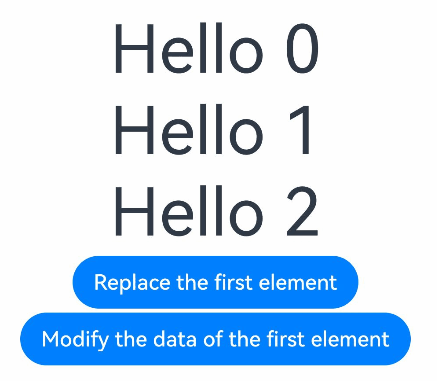

<!--no_check-->